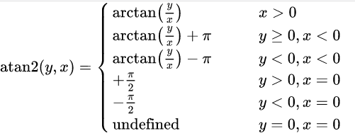

# 2023 8月

**天上白玉京 ， 长安三万里。** 
七上七下 ， 又回到我最爱的颜色： 2023 . 8 .13


麻了；


努力两个月，实现~超越自我。

### 比赛补题

**CCPC网络赛**

1.  [CCPC2023.md](..\..\problems\XCPC\网络赛\CCPC2023.md) 

==**多校下**==

1.  [6多校.md](..\..\problems\nowcoder\牛客多校\6多校.md) 
1.  [7多校.md](..\..\problems\nowcoder\牛客多校\7多校.md)
1.  [8多校.md](..\..\problems\nowcoder\牛客多校\8多校.md) 
1.  [9多校.md](..\..\problems\nowcoder\牛客多校\9多校.md) ==重视I的扫描线解法==
1.  [10多校.md](..\..\problems\nowcoder\牛客多校\10多校.md) ==咕咕==

==**杭电多校**==

1. 背包dp：
   1.  [Backpack .md](..\..\problems\HDU\杭电多校\动态规划\背包\Backpack .md)
2. 区间dp （能力范围之内）
   1.  [Mr. Liang play Card Game.md](..\..\problems\HDU\杭电多校\动态规划\区间\Mr. Liang play Card Game.md) 
   2.  [Link with Bracket Sequence I.md](..\..\problems\HDU\杭电多校\动态规划\区间\Link with Bracket Sequence I.md) 
   3.  [Link with Bracket Sequence II.md](..\..\problems\HDU\杭电多校\动态规划\区间\Link with Bracket Sequence II.md)
3. 状压dp 
   1.  [Boss Rush.md](..\..\problems\HDU\杭电多校\动态规划\状压\Boss Rush.md) 
4. 计数dp
   1.  [Matryoshka Doll.md](..\..\problems\HDU\杭电多校\动态规划\计数dp\Matryoshka Doll.md)

5. 数位dp
   1.  [Sumire.md](..\..\problems\HDU\杭电多校\动态规划\数位dp\Sumire.md) 

==**div2 **==

近期cf打的像:shit: 一样：
很多1400的题都做不出来：如下：

1.  [C. Another Permutation Problem.md](..\..\problems\codeforces\1400-1600\规律挖掘\C. Another Permutation Problem.md)
2.  [C. Divisor Chain.md](..\..\problems\codeforces\1400-1600\构造\位运算模型\lowerbit\C. Divisor Chain.md) 
3.  [D. Matrix Cascade.md](..\..\problems\codeforces\1400-1600\贪心和执行\D. Matrix Cascade.md) 

#### 解题报告：

**动态规划：**

1.  [D. Earn or Unlock.md](..\..\problems\codeforces\2000\动态规划\背包dp\D. Earn or Unlock.md)
2.  [D. Bookshelves.md](..\..\problems\codeforces\1900\动态规划\位运算模型\D. Bookshelves.md) 和自己校赛出题的想法非常类似
3.  **计数dp**
    1.   [E. Arena.md](..\..\problems\codeforces\2100\动态规划\计数dp\E. Arena.md) 
    1.   [D. Doremy's Pegging Game.md](..\..\problems\codeforces\2000\动态规划\计数dp\D. Doremy's Pegging Game.md) 
4.  树形dp
    1.   [F. Unique Occurrences.md](..\..\problems\codeforces\2300\动态规划\虚树优化dp\F. Unique Occurrences.md)
5.  LCS相关的dp模型：
    1.  [D. Ball Sorting.md](..\..\problems\codeforces\2100\动态规划\LIS\D. Ball Sorting.md)
6.  方格移动模型：
    1. [F. Railguns.md](..\..\problems\codeforces\2200\动态规划\方格模型\F. Railguns.md) 
7.  图论相关dp：
    1.  [D. The way home.md](..\..\problems\codeforces\2100\图上dp\D. The way home.md)

8.  位运算模型相关：
    1.   [F2. Korney Korneevich and XOR (hard version).md](..\..\problems\codeforces\2400\动态规划\位运算模型\F2. Korney Korneevich and XOR (hard version).md) 
9.  贪心角度下设计背包：
    1.   [BBQ.md](..\..\problems\HDU\杭电多校\动态规划\贪心角度下的dp\BBQ.md) 

**贪心**

1. [C. Ina of the Mountain.md](..\..\problems\codeforces\2400\贪心\C. Ina of the Mountain.md) 

**期望**

1.  [E. Assimilation IV.md](..\..\problems\codeforces\2100\期望\E. Assimilation IV.md)

**图论**

1.  [E. Minimum spanning tree for each edge.md](..\..\problems\codeforces\2300\图论\E. Minimum spanning tree for each edge.md) 

#### **算法学习：**

1.  [计数dp进阶 解题报告.md](..\..\Logrithm\动态规划\计数dp\代码源进阶\计数dp进阶 解题报告.md) 
2.  *数据结构：*
    1.  [李超线段树.md](..\..\Logrithm\数据结构\线段树\李超线段树.md) ==只解决基本问题==
3.  **虚树**
    1.   [虚树.md](..\..\Logrithm\图论\树上问题\虚树.md) 
4.  寄算几何
    1.   [向量的点积和叉积.md](..\..\Logrithm\计算几何\点，线段，极角序\向量的点积和叉积.md) 
    2.   [点、线段、极角序.md](..\..\Logrithm\计算几何\点，线段，极角序\点、线段、极角序.md)
    3.   [多边形.md](..\..\Logrithm\计算几何\多边形\多边形.md)


-----


# CCPC2023 网络赛：


:cry:没开出A ， 差一点就可以给自己打上一个名额。
一个小小的区间加，我竟然没有自己写，于是成哥写寄了。并且我也没有意识到。

反思是，这些基本的东西，也是可以自己写的，并且可以对这些基本的问题，自行封装出一个板。一个比较好写的板。

并且这一次的调试能力不够强 ， 少了vs就很难受。

## A ： 


## solve

很显然的计数dp问题： 
浑水摸鱼：

**状态定义：**
$f_{i ,j }$ 表示将1....i分为j段。共有多少种方案数：

**状态转移：**

显然是不可行的。如果对一个计数，研究具体的细节时候，发现关注局部之间的转移，就必须花费一定量的花费时候，就意味着应该从整体上考虑其贡献，以及转移。

**状态设计更新：**

$f_{i}$ 表示以i为结尾的每个方案的$len^2$ 的贡献。

**状态转移：**
$$
f_{i}->f_{i + 1}\\
\sum f(i) i^2->\sum f(i)\times (i + 1)^2\\
->\sum f(i)\times i^2 + 2\times\sum f(i)\times i + \sum f(i)
$$


于是分别维护三个变量即可：

$f1(i)->\sum f(i)\times i^2$

$f2(i)->\sum f(i)\times i$

$f3(i)->\sum f(i)$

由考察i为尾段之后拼上一个新的区间的方案更新情况，就是找打一个最大符合题意得前缀：可以使用二分+字符串哈希实现，（先匹配最大前缀，跳过第一个不匹配值。继续匹配第二个后缀。）

区间加法，这一块得实现方式很多。有线段树和差分数组。当时太急，没有考虑具体选择。


#### code

赛时代码，没有交过。可能会出错；

```cpp
#include<bits/stdc++.h>
using namespace std;
using ll = long long;
#define int ll
#define fi first
#define se second
#define sz(x) (int)(x).size()
const int mod = 998244353;
const int N = 1E6 + 10;
// struct BIT {
//     vector<int>tr;
//     int si;
//     BIT(int n): tr(n + 50) {si = n;}
//     int lowbit(int p) {return p & -p;}
//     void modify(int pos, int x) {}
//     void update(int l, int r, int x) {
//         modify(l, x), modify(r + 1, -x);
//     }
//     void update(int l, int r, int w) {
//         l++ , r++;
//         ++r;
//         for (; l <= si; l += lowbit(l)) (tr[l] += w) %= mod;
//         for (; r <= si; r += lowbit(r))tr[r] = ((tr[r] -  w) % mod + mod) % mod;
//     }
//     int query(int l, int r) {
//         l++ , r++;
//         int x = 0, y = 0;
//         l--;
//         for (; l; l -= lowbit(l))(x += tr[l]) %= mod;
//         for (; r; r -= lowbit(r))(y += tr[r]) %= mod;
//         return ((y - x) % mod + mod) % mod;
//     }
// };
int f1[N] , f2[N] , f3[N];
void add(int& a , int b) {
    a += b;
    if (a >= mod) a -= mod;
    if (a < 0) a += mod;
}

class shash {
public:
    vector<ll> pres;
    vector<ll> epow;
    ll e , p;
    shash() {};
    shash(string& s , ll e , ll p) {
        int n = sz(s);
        this->e = e;
        this->p = p;
        pres = vector<ll>(n + 1);
        epow = vector<ll>(n + 1);
        epow[0] = 1;
        for (int i = 0; i < n; i++) {
            pres[i + 1] = (pres[i] * e + s[i]) % p;
            epow[i + 1] = epow[i] * e % p;

        }
    }
    ll operator()(int l , int r) {
        ll res = (pres[r + 1] - pres[l] * epow[r - l + 1] % p) % p;
        return (res + p) % p;
    }
} ss , tt;
bool check(int l1 , int r1 , int l2 , int r2) {
    return ss(l1 , r1) == tt(l2 , r2);
}
signed main() {
    ios::sync_with_stdio(false);
    cin.tie(0);
    string s , t;
    cin >> s >> t;
    int n = sz(s);
    int m = sz(t);
    ss = shash (s , 1331 , mod);
    tt = shash (t , 1331 , mod);
    int cunt = 0;
    //顺序是先枚举i ， 然后更新到后边的结构：
    for (int i = 0; i < n; i++) {
        // 检查当前定位情况：
        add(f1[i + 1] , f1[i]);
        add(f2[i + 1] , f2[i]);
        add(f3[i + 1] , f3[i]);
        if (i < m) {
            if (s[i] != t[i]) {
                cunt++;
            }
            if (cunt <= 1) {
                add(f1[i + 1] , 1);
                add(f1[i + 2] , -1);

                add(f2[i + 1] , 1);
                add(f2[i + 2] , -1);

                add(f3[i + 1] , 1);
                add(f3[i + 2] , -1);
            }
        }

        if (i == n - 1) break;
        /*起点*/
        int l1 = i + 1 , l2 = 0;
        /*可能的长度*/
        int low = 1 , high = min({n - i - 1 , m});
        while (low < high) {
            int mid = (low + high + 1) / 2;

            //尾部
            int  r1 = l1 + mid - 1;
            int  r2 = l2 + mid - 1;
            // 当前的最低位置：
            if (check(l1 , r1 , l2 , r2)) {
                low = mid;
            } else high = mid - 1;
        }
        /*长度*/
        if (low == 1) {
            if (s[i + 1] != t[0]) {
                l1 = i + 2;
                l2 = 1;
            } else {
                l1 = i + 3;
                l2 = low + 1;
            }
        } else {
            l1 = i + low + 2;
            l2 = low + 1;
        }
        int r1;
        if (l1 < n && l2 < m) {
            low = 1 , high = min({n - l1 , m - low});
            while (low < high) {
                int mid = (low + high + 1) / 2;
                int  r1 = l1 + mid - 1;
                int  r2 = l2 + mid - 1;
                if (check(l1 , r1 , l2 , r2)) {
                    low = mid;
                } else high = mid - 1;
            }
            if (low == 1 && s[l1] != t[l2]) {
                r1 = l1 - 1;
                l1 = i + 1;
            }
            else {
                r1 = l1 + low - 1;
                l1 = i + 1;
                r1 = min(n - 1 , r1);
            }
        } else if (low == m) {
            l1 = i + 1;
            r1 = i + low;
        } else if (l1 >= n) {
            l1 = i + 1;
            r1 = n - 1;
        }

        // cout << i + 1 << "\tcur\n";
        // cout << l1 << " " << r1 << "\n";
        /*于是现在定位到了， i .... 最长*/
        /*长度设置为l1 , l2*/
        /*整个区间进行区间加的操作：*/
        ll q1 = f1[i + 1] , q2 = f2[i + 1] , q3 = f3[i + 1];
        // f1.update(l1 , r1 , (1LL * q1 + 2LL * q2 % mod + q3) % mod);
        add(f1[l1 + 1] , (q1 + 2 * q2 + q3) % mod);
        add(f1[r1 + 2] , ((-1 * (q1 + 2 * q2 + q3) % mod) + mod) % mod);

        add(f2[l1 + 1] , (q2 + q3) % mod);
        add(f2[r1 + 2] , (-(q2 + q3) % mod + mod) % mod);

        // f3.update(l1 , r1 , q3);
        add(f3[l1 + 1] , q3);
        add(f3[r1 + 2] , (-q3 % mod + mod) % mod);
        cout << f1[i + 1] << " "  << f2[i + 1] << " " << f3[i + 1] << "\n";
    }
    cout << f1[n] << "\n";
}
```


----


# 多校6

AC/4 rank/371

## [A-Tree_2023牛客暑期多校训练营6 (nowcoder.com)](https://ac.nowcoder.com/acm/contest/57360/A?&headNav=acm)


### solve

单纯做一个dp ， 
对边进行一个排序，然后考虑结合边的顺序做一个dp。

如果朴素的去做一个dp ： 即朴素的树形dp。考虑状态为：$f_{i , j}$ ， 表示i节点所代表的子树中j个黑色节点的最大价值。然后发现是转移不了 的，因为子树外的点对，的贡献情况是变化的，且不可知的。‘

因此，如果走dp的路，必须集中精力解决顺序的问题：对结构进行以下角度的关注：

1. 将边对点对的“支配”关系一个做更加明确的刻画：

   然后惊奇的发现，分成若干块，不会有相交关系。

   ==启发：==

   因此顺序可以考虑成处理较小的块再处理更大的块。感受一下大规模问题对于小规模问题是没有后效性的。

2. 因此考虑将顺序控制为：从小到大对边处理。再内部将边合并。类似于并查集，于是就能做以下的动态规划设计：

**状态定义：**

$f_{i , j}$ 表示当前合并顺序下，当前连通块的黑色节点数量为j时，的最大收益。

$sz_{i ,j}$表示当前顺序下，当前连通块的节点总数：

**状态转移方程：**

这个类似于树形背包，对它做同等的复杂度分析，发现最终的复杂度是$O(N^2)$的。
$$
g_{i + j} = max(f_{x,i} + f_{y,j} + i*(sz(y) - j) *w+ j * (sz(x) - i)*w)
$$


### code

```cpp
#include<bits/stdc++.h>
using namespace std;
using ll = long long;

#define all(x) (x).begin(),(x).end()
#define sz(x) (int)(x).size()

const int inf = 1E9 + 7;;
const ll INF = 1E18 + 7;
const int N = 3010;

int cost[N];
ll f[N][N];
int fa[N] , sz[N] , col[N];

int find(int x) {
	return fa[x] = (fa[x] == x ? x : find(fa[x]));
}
signed main()
{
	ios::sync_with_stdio(false);
	cin.tie(0);
	int n;
	cin >> n;
	for (int i = 1; i <= n; i++) {
		cin >> col[i];
	}
	for (int i = 1; i <= n; i++) {
		cin >> cost[i];
		fa[i] = i;
		sz[i] = 1;
		if (col[i] == 1) {
			f[i][1] = 0;
			f[i][0] = -cost[i];
		} else {
			f[i][0] = 0;
			f[i][1] = -cost[i];
		}
	}
	vector<array<int , 3>> edge;
	for (int i = 1; i < n; i++) {
		int u , v, w;
		cin >> u >> v >> w;
		edge.push_back({w , u , v});
	}

	ll ans = 0;
	sort(all(edge));
	for (auto [w , u , v] : edge) {
		int x = find(u);
		int y = find(v);
		vector<ll> g(sz[x] + sz[y] + 1 , -INF);
		for (int i = 0; i <= sz[x];  i++) {
			for (int j = 0; j <= sz[y]; j++) {
				ll v1 = 1LL * (sz[x] - i) * j * w;
				ll v2 = 1LL * (sz[y] - j) * i * w;
				g[i + j] = max(g[i + j] , f[x][i] + f[y][j] + v1 + v2);
			}
		}
		sz[x] += sz[y];
		fa[y] = x;
		// cout << "  x "  <<  x << "\n";
		for (int j = 0; j <= sz[x]; j++) {
			f[x][j] = g[j];
			// cout << g[j] << "\n";
		}
	}
	int root = find(1);
	for (int i = 0; i <= n; i++) {
		ans = max(f[root][i] , ans);
	}
	cout << ans << '\n';
}
/* stuff you should look for
* int overflow, array bounds
* special cases (n=1?)
* do smth instead of nothing and stay organized
* WRITE STUFF DOWN
* DON'T GET STUCK ON ONE APPROACH
*/
```


## traffic

李超线段树：
[H-traffic_2023牛客暑期多校训练营6 (nowcoder.com)](https://ac.nowcoder.com/acm/contest/57360/H)


### solve

思路很容易就能看出来 ： 就是构造生成树即可：其关键在于断开两个环；关注两个环的关系，然后对此做出一些处理：

1. 两个环是不相交的： 选择这两个环断开一条边即可。
2. 两个环相交： 选择三条链。然后在这三条链之中，选出两个最大断开即可：

整体的思想： 求出$\sum a x + \sum b$ ,然后减去上述求出的两个最长边即可。
上述可以使用李超线段树实现：

### 生长：

1. 李超线段的板子调了好久：

2. 还要学习更加优美的找环的方式：我使用的方式是断边重建：

   1. 使用tarjan找强连通分量。然后根据这个分量，将环分离：找出来后就容易实现了。

   2. jls的方式：

   ```cpp
    td::vector<int> pe(n, -1), parent(n, -1), dep(n, -1), w(n);
   int cur = 1;
   std::vector<int> e[4];
   auto dfs = [&](auto self, int x) -> void {
       for (auto [y, i] : adj[x]) {
           if (i == pe[x]) {
               continue;
           }
           if (dep[y] == -1) {
               dep[y] = dep[x] + 1;
               pe[y] = i;
               parent[y] = x;
               self(self, y);
               w[x] ^= w[y];
           } else if (dep[y] < dep[x]) {
               //标记属于第几个环：打上标记
               // 关注返祖边：
               // w数组的作用：
               // 标记了属于第几个环；
               w[x] ^= cur;
               // 类似于树上差分： 还原：标记： 标记当前父亲不属于环上：
               // 并且顶点以及边及时记录：
               w[y] ^= cur;
               e[cur].push_back(i);
               cur <<= 1;
           }
       }
   };
   dep[0] = 0;
   dfs(dfs, 0);
   for (int i = 1; i < n; i++) {
       if (w[i]) {
           e[w[i]].push_back(pe[i]);
       }
   }
   ```

   解读：

   

   3. 一个类似的问题： [3多校第三场.md](3多校第三场.md)   ==其中支配树问题中==

   

   

   

   

### code

```cpp
#include<bits/stdc++.h>
using namespace std;
using ll = long long;
#define int ll

#define all(x) (x).begin(),(x).end()
#define sz(x) (int)(x).size()

const int inf = 1E9 + 7;;
const ll INF = 1E18 + 7;
const int N = 1E6 + 10;


vector<array<int, 2>> g[N];
vector<array<int, 4>> edge;

int n, T;
vector<array<int, 2>> rec;
bool vis[N];
vector<int> cycle;
bool dfs(int u, int preid) {
	vis[u] = true;
	for (auto t : g[u]) {
		int v = t[0], id = t[1];
		if (id == preid) continue;
		if (vis[v]) {
			cycle.push_back(id);
			while (rec.size()) {
				int s = rec.back()[0];
				int t = rec.back()[1];
				// auto [s , t] = rec.back();
				rec.pop_back();
				cycle.push_back(t);
				if (s == v) return true;
			}
			return true;
		}
		else {
			rec.push_back({ u , id });
			// 已经找到了环。
			if (dfs(v, id)) return true;
			rec.pop_back();
		}
	}
	vis[u] = false;
	// 与它相关的谱系中没有找到环:
	return false;
}

/* 李超线段树维护代码块：
begin :
*/

const double eps = 1E-12;
const int maxn = (int)1E5 + 10;


struct line {
	double k, b;
	int id;
	bool flag;
};
line add(int id) {
	line now;
	now.k = edge[id][2];
	now.b = edge[id][3];
	now.flag = true;
	now.id = id;
	return now;
}

struct Tree {
	line seg[maxn * 4];
	// const int l = 0, r = (int)1E5;

	inline double calc(line l, int x) {
		return l.k * x + l.b;
	}/*计算坐标值*/

	inline int cross(line l1, line l2) {
		return floor(l1.b - l2.b) / (l2.k - l1.k);
	}

	/*线段树部分*/
	// pair<double, int> dcmp(pair<double, int>& x, const pair<double, int>& y) {
	// 	double d = x.first - y.first;
	// 	if (abs(d) < eps) {
	// 		x.second = max(x.second, y.second);
	// 	}
	// 	else if (d < 0) x = y;
	// 	return x;
	// }
	inline int check(double x, double y) {
		if (abs(x - y) < eps) return 0;
		else if (x < y) return -1;
		else return 1;
	}

	void modify(int now, int l, int r, line k) {
		int resl = check(calc(k, l), calc(seg[now], l));
		int resr = check(calc(k, r), calc(seg[now], r));
		if (not seg[now].flag) { seg[now] = k; }
		else if (resl == 1 && resr == 1) {
			seg[now] = k;
		}
		else if (resl == 0 && resr == 0) {
			seg[now].id = min(seg[now].id, k.id);
		}
		else if (resl == 1 || resr == 1) {
			int mid = (l + r) / 2;

			// 这里要修改以下:
			int resmid = check(calc(k , mid) , calc(seg[now] , mid));
			if (resmid == 1) {
				line tmp = k; k = seg[now]; seg[now] = tmp;
			} else if (resmid == 0) {
				// 刚好在中点相交：
				if (k.k < seg[now].k) modify(now << 1 , l , mid , k);
				else modify(now << 1 | 1 , mid + 1 , r , k);
				return;
			}

			// 交点在两侧：
			// 判断在哪一侧上：
			resmid = check(cross(k , seg[now]) , mid);
			if (resmid == -1) modify(now << 1, l, mid, k);
			else modify(now << 1 | 1, mid + 1, r, k);
		}
	}

	pair<double, int> query(int now, int l, int r, int x) {
		if (l == r) {
			return { calc(seg[now] , x) , seg[now].id };
		}
		else {
			int mid = (l + r) / 2;
			pair<double, int> ans = { calc(seg[now] , x) , seg[now].id };
			if (x <= mid) return max(ans, query(now << 1, l, mid, x));
			else return max(ans, query(now << 1 | 1, mid + 1, r, x));
		}
	}
} tree[3];
/*end*/

signed main()
{
	ios::sync_with_stdio(false);
	cin.tie(0);
	cin >> n >> T;
	// 第一个问题是优美的找环：
	ll suma = 0, sumb = 0;
	edge.resize(n + 2);
	for (int i = 1; i <= n + 1; i++) {
		int u, v, a, b;
		cin >> u >> v >> a >> b;
		suma += a;
		sumb += b;
		edge[i] = { u , v , a , b };
		g[u].push_back({ v , i });
		g[v].push_back({ u , i });
	}

	// 找出两个环：
	dfs(1, 0);
	// for (auto u : cycle) {
	// 	cout << u << " ";
	// }
	// cout << "\n";

	set<int> cycle1;
	for (auto u : cycle) {
		cycle1.insert(u);
	}
	for (int i = 1; i <= n; i++) {
		g[i].clear();
	}

	// 重新建图：
	for (int i = 1, flag = 1; i <= n + 1; i++) {
		// auto [u , v , a , b] = edge[i];
		int u = edge[i][0];
		int v = edge[i][1];
		if (cycle1.count(i) && flag) {
			flag = 0;
			continue;
		}
		g[u].push_back({ v , i });
		g[v].push_back({ u , i });
	}
	memset(vis, false, sizeof vis);
	cycle.clear();
	rec.clear();
	set<int> cycle2;
	dfs(1, 0);
	// 找到了环：
	// 然后开始线段树维护：
	for (auto id : cycle) {
		// modify(1 , 0 , T , add(id
		cycle2.insert(id);
	}
	for (auto id : cycle1) {
		line now = add(id);
		if (cycle2.count(id)) {
			tree[2].modify(1, 0, T, now);
		}
		else {
			tree[0].modify(1, 0, T, now);
		}
	}

	for (auto id : cycle2) {
		if (cycle1.count(id)) continue;
		line now = add(id);
		tree[1].modify(1, 0, T, now);
	}
	// for (auto u : cycle) {
	// 	cout << u << " ";
	// }
	for (int t = 0; t <= T; t++) {
		vector<pair<double, int>> dec;
		for (int i = 0; i < 3; i++) {
			dec.push_back(tree[i].query(1, 0, T, t));
		}
		sort(all(dec));
		cout << (suma * t + sumb - (long long)(dec[2].first + dec[1].first)) << "\n";
	}
	// edge.resize(10);
	// edge[1] = { 1 , 2 , 3 , 1 };
	// edge[3] = { 2 , 3 , 1 , 3 };
	// edge[2] = { 1 , 2 , 1 , 2 };
	// tree[0].modify(1, 0, 10, add(1));
	// cout << tree[0].query(1, 0, 10, 0).first << " " << tree[0].query(1, 0, 10, 0).second << "\n";
	// tree[0].modify(1, 0, 10, add(2));
	// cout << tree[0].query(1, 0, 10, 0).first << " " << tree[0].query(1, 0, 10, 0).second << "\n";
	// tree[0].modify(1, 0, 10, add(3));
	// cout << tree[0].query(1, 0, 10, 0).first << " " << tree[0].query(1, 0, 10, 0).second << "\n";

}

/*

4 100
1 2 0 0
2 4 0 0
3 4 0 0
2 3 0 0
1 3 0 0

2 10
1 2 0 0
1 2 0 0
2 1 0 0

7 10
1 2 0 0
1 3 0 0
2 3 0 0
3 4 0 0
4 5 0 0
5 6 0 0
6 7 0 0
5 7 0 0

*/
```

---


# 多校7

ac 1 / rank 670 完大蛋

经典手上只捏了一道题，导致最后出大问题，兴许如果开其它题，有可能开出来呢。比如下述这个很典的拆位问题： 但是当时就是没有一眼看出来。

## I We Love Strings

链接：https://ac.nowcoder.com/acm/contest/57361/I


###  solve

**分治：**

首先，观察范围，可以按照将字符串分成两类：

1. 小于等于20 ， 暴力枚举符合条件的字符串进行统计。
2. 大于20 ， 这种字符串最多有20个，用容斥技巧处理：

**2. 解决细节**

直接枚举字符串的选择情况：

枚举出选择情况之后，很容易就能计算出它们能够共同表达的字符串集合：

1. 一个位置上匹配但是不全为'?'： 前缀不变：
2. 一个位置上全为'?' ：          当前匹配的前缀总数乘上2。
3. 一个位置上不同 ：             匹配串总数为0。

**容斥原理**

1. 只选择一个： +
2. 选择两个， 得到的必然是1步骤中贡献的交集；  -
3. 选择三个， 得到的结果，对应2步骤中结果的交集： + 

... 奇数则贡献， 偶数则减去：

#### 生长思考：

这是一个定理，容斥并不是简单的从整体到局部的一步加减法。是一种已经上升为理论的，严谨的理论体系：

下面是一个容斥原理的定义：

 

[容斥原理 - OI Wiki](https://oi.wiki/math/combinatorics/inclusion-exclusion-principle/)

```cpp
#include<bits/stdc++.h>
using namespace std;
using ll = long long;

#define int ll
#define all(x) (x).begin(),(x).end()
#define sz(x) (int)(x).size()

const int inf = 1E9 + 7;;
const ll INF = 1E18 + 7;
const int N = 1E6 + 10;
const int mod = 998244353;

void add(int& a , int b) {
	a += b;
	if (a >= mod) a -= mod;
}
void dec(int&a , int b) {
	a -= b;
	if (a < 0) a += mod;
}
signed main()
{
	ios::sync_with_stdio(false);
	cin.tie(0);
	int n;
	cin >> n;
	map<int , vector<string>> mp;
	for (int i = 1; i <= n; i++) {
		string s;
		cin >> s;
		mp[sz(s)].push_back(s);
	}
	int ans = 0;
	for (auto &[len , s] : mp) {
		int n = sz(s);
		if (len <= 20) {
			for (int msk = 0; msk < (1 << len); msk++) {
				for (int i = 0; i < n; i++) {
					bool flag = true;
					for (int j = 0; j < len; j++) {
						if (s[i][j] != '?' && (s[i][j] - '0') != (msk >> j & 1)) {
							flag = false;
							break;
						}
					}
					if (flag) {
						add(ans , 1);
						break;
					}
				}
			}
		} else {
			for (int msk = 1; msk < (1 << n); msk++) {
				int cnt = 1;
				for (int j = 0; j < len; j++) {
					bool f1 = false , f0 = false;
					for (int i = 0; i < n; i++) {
						if (msk >> i & 1) {
							if (s[i][j] == '0') f0 = true;
							if (s[i][j] == '1') f1 = true;
						}
					}
					if (f0 && f1) {
						cnt = 0;
						break;
					}
					if (not f0 && not f1) {
						add(cnt , cnt);
					}
				}
				if (__builtin_popcount(msk) % 2) {
					add(ans , cnt);
				} else {
					dec(ans , cnt);
				}
			}
		}
	}
	cout << ans << "\n";
}

/* stuff you should look for
* int overflow, array bounds
* special cases (n=1?)
* do smth instead of nothing and stay organized
* WRITE STUFF DOWN
* DON'T GET STUCK ON ONE APPROACH
*/
```

----

## K Set

[K-Set_2023牛客暑期多校训练营7 (nowcoder.com)](https://ac.nowcoder.com/acm/contest/57361/K)
Sylvy has an array $a$ of length $n$. Glacy wants you to calculate $\sum_{S\subseteq\left\{x|x\in Z, 1\le x\le n\right\}}\left|S\right|\left(\min_{x\in S}a_x\right)\left(\max_{x\in S}a_x\right)\left(\bigoplus_{x\in S}a_x\right)$ module $998244353$, where $\bigoplus$ denotes the bitwise operator xor.

### solve

维护异或和以及乘法相关的贡献。考虑拆位技巧： 相似： [7多校.md](7多校.md) 
发现这类拆位：一段元素序列异或和（或者是其它类型的和）是单独作为一乘式中的一项。
**怎么确定最大最小值？**

1. 首先，由于是序列问题，并且是元素顺序无关的计数问题。可以对序列进行重新排序进行处理，如上对序列做一个排序之后，就产生了奇迹（事实上，往往可以考虑对数组排序处理。观察等效性，以及是否出现了某些新的性质。）
2. 排序之后，于是就变成只关注首尾端了。
   **计算顺序的设计：**
   对每一个位单独考虑。因为每一个位的在异或中的贡献都是独立的。
   ==**维护一些信息：**==
   对于前端维护的序列中，关注一些和算式相关的属性，从而做一些统计的角度设计：
3. 按照位置上的异或和分为两类：0 与 1。 
   $f_{i , 0 /1 }$ 分别表示到1 ... i这个位置当前异或和为0/1 的min*|S|之和。
4. 怎么从$f_{i - 1, 0/1}$ 转移到$f_{i ,0/1}$ ? 
   发现最关键的问题是： 长度不好处理，原有序列拼接上一个新的数组之后，有如下转换：

$$
  f_{i - 1 ,0/1}->\sum min \times|S|->\sum min \times (|S| + 1)
$$

解决该问题： 启发：显然只要记录一个$\sum min$ 即可。
于是新开一个数组$g_{i ,0/1}$ 同时记录所选的序列的最小值之和。

**转移：**

当前考察的是元素$a_i$ , 那么会出现如下几种可能：

1. 当前在该位上$a_i$ 对应的比特：x = 1。

   1. 接上：
   2. 单独成为一个序列。
   3. 不接：

2. x = 0

   如上：

很显然的变化，用滚动数组优化。详细看代码。

### code

```cpp
const int inf = 1E9 + 7;;
const ll INF = 1E18 + 7;
const int N = 1E6 + 10;
const int mod = 998244353;

signed main(){
	ios::sync_with_stdio(false);
	cin.tie(0);
	int n;
	cin >> n;
	vector<int> a(n);
	for (int i = 0; i < n; i++)
		cin >> a[i];
	sort(all(a));
	ll ans = 0;
	for (int i = 0; i <= 30; i++) {
		array<ll , 2> f = {0 , 0} , g = {0 , 0};
		for (int j = 0; j < n; j++) {
			int x = a[j] >> i & 1 , sum;
			// 统计贡献
			sum = (x * a[j] + f[x ^ 1] + g[x ^ 1]) % mod;
			ans = (ans + (1LL << i) * sum % mod * a[j] % mod) % mod;
			// 更新；
			auto tf = f , tg = g;
			if (x) {
				f[0] = (tf[1] + tf[0]) % mod;
				f[1] = (a[j] + tf[0] + tf[1]) % mod;
				g[0] = (tg[0] + tg[1] + tf[1]) % mod;
				g[1] = (a[j] + tg[1] + tg[0] + tf[0]) % mod;
			}
			else {
				f[0] = (a[j] + tf[0] + tf[0]) % mod;
				f[1] = (tf[1] + tf[1]) % mod;
				g[0] = (a[j] + tg[0] + tg[0] + tf[0]) % mod;
				g[1] = (tg[1] + tg[1] + tf[1]) % mod;
			}
		}
	}
	cout << ans << "\n";
}
```

----

# 牛客多校8

AC ： 3/ rank : 255
**复盘**

主要的思考点： 最后的40分钟写出了I题，但是只有5分钟的调试调整。赛后调试了30分钟1A了。怎么省出25分钟去调试？

1. 浪费时间： H题第一份代码于1点25写完。可是最终不断地调试，修正之后，即使在1点半之前得到了正解地思路，最后通过确是在三点半：
   1. 第一点： 当时已经确定了算法的正确性： 也应该认识到由并查集实现找极小是不正确的。但是却没有集中精力解决该问题。
   2. 第二点： 要提醒自己，要尽早的认识到当前的问题所在： 当前自己可以做更多的事情，敢于突破自己的局限性。做好全局的时间管理： 
   3. 第三点： 很多多余的动作：
      1. 比如A完题就去外面，洗脸等等。胡思乱想，浪费一些时间看榜等等。
   4. 代码编写时间：	

## 题：

## H

[H-Insert 1, Insert 2, Insert 3, ..._2023牛客暑期多校训练营8 (nowcoder.com)](https://ac.nowcoder.com/acm/contest/57362/H)


### solve

1. 第一个观察，组合区间的计数问题， 考虑区间的右端点：然后可以找出符合条件的区间左端点。直接统计：
2. 观察，只需要找到第一个符合条件的左端点：然后就可以进行下方的转移：

$$
f_{i}-> f_{leftfirst}
$$

**证明如下：**

1. $f_{leftfirst}$ 记录的所有解拼接上当前所有解必然是正确的。（实际上left_most肯定是1）
2. 所以集中精力解决的问题是：
   1. 是否出现漏解的问题：
      1. 显然左端点在leftmost以右的区间是不正确的：违反leftmost的定义：（假设正确的leftmost）
      2. 左端点之外的拼接上的区间，和leftfirst以右的区间之间的关系是独立互不干扰的。后边的区间不依赖于拼接的区间。并且后边的区间中的元素只作为拼接上的区间的尾段。去掉这种关系左段区间依然是要求合法的。
   2. 综上，并不漏解。

3. 因此接下来集中精力解决的问题是，找到最leftfirst:

$\large 寻找leftfirst$

*场上思路：*

1. 用一个栈完成匹配。（其实就是贪心的选择最近的可选下一个。）
2. $x$ - > x - 1 。 于是得到了id。那么最近的1将会在[id , i - 1] 中区间（特判没有x - 1与之匹配。）

**状态定义：**

$pre_i$ 表示i位置为右端点时的leftmost
$f_i$ : 表示i位置为右端点时的合法序列总数：

**状态转移方程：**

$f_{i} = f_{minist(pre_{id....i-1})}$

实现上使用线段树实现：

```cpp
#include<bits/stdc++.h>
using namespace std;
using ll = long long;

#define all(x) (x).begin(),(x).end()
#define sz(x) (int)(x).size()

const int inf = 1E9 + 7;;
const ll INF = 1E18 + 7;
const int N = 1E6 + 10;
int a[N];
ll f[N];
int pre[N];
vector<int> stk[N];
/*
12
1 1 2 2 3 3 1 1 2 2 3 3

10
1 2 1 3 2 4 3 5 4 6


13
1 2 3 4 5 6 1 2 3 7 4 4 5

12
1 2 1 3 1 4 2 5 3 2 3 4
*/

//const int N = 201000;
//const ll mod = 1000000007;

//节点的内容。数据项以及内容。
//如果维护信息比较复杂。也可以考虑将信息封装。并且如上写一个区间信息合并重载函数。
struct node {
	int t;
	int val;
} seg[N * 4];

// [l, r]

//在modify以及建树之后。把两个儿子的信息合并。
void update(int id) {
	seg[id].val = min(seg[id * 2].val , seg[id * 2 + 1].val);
}

//push down。
//完成两项东西。合并标记。
//修改区间信息。
void settag(int id, int t) {
	if (t) {
		seg[id].t = min(seg[id].t , t);
		seg[id].val = min(seg[id].val , t);
	}
}
//记得将下放后将标记初始化。
void pushdown(int id) {
	if (seg[id].t) { // 标记非空
		settag(id * 2, seg[id].t);
		settag(id * 2 + 1, seg[id].t);
	}
}

//建树。记得建完之后update.
//以及到达终点时，将节点信息修正。
void build(int id, int l, int r) {
	seg[id].t = {0};
	if (l == r) {
		seg[id].val = {pre[l]};
	} else {
		int mid = (l + r) / 2;
		build(id * 2, l, mid);
		build(id * 2 + 1, mid + 1, r);
		update(id);
	}
}

// 节点为id，对应的区间为[l, r]，修改a[pos] -> val
//记得update
//正确sertag
void modify(int id, int l, int r, int ql, int qr, int t) {
	if (l == ql && r == qr) {
		settag(id, t);
		return;
	}
	int mid = (l + r) / 2;
	// 重要‼️
	pushdown(id);
	if (qr <= mid) modify(id * 2, l, mid, ql, qr, t);
	else if (ql > mid) modify(id * 2 + 1, mid + 1, r, ql, qr, t);
	else {
		modify(id * 2, l, mid, ql, mid, t);
		modify(id * 2 + 1, mid + 1, r, mid + 1, qr, t);
	}
	// 重要‼️
	update(id);
}
// [ql, qr]表示查询的区间
//到达终点时及时返回。
ll query(int id, int l, int r, int ql, int qr) {
	if (l == ql && r == qr) return seg[id].val;
	int mid = (l + r) / 2;
	// 重要‼️
	pushdown(id);
	if (qr <= mid) return query(id * 2, l, mid, ql, qr);
	else if (ql > mid) return query(id * 2 + 1, mid + 1, r, ql, qr);
	else {
		// qr > mid, ql <= mid
		// [ql, mid], [mid + 1, qr]
		return min(query(id * 2, l, mid, ql, mid) ,
		           query(id * 2 + 1, mid + 1, r, mid + 1, qr));
	}
}
/*
1. 该代码处理问题：同时维护区间加，区间改变，区间乘法三种操作。
2. 调整过程
维护信息 -> build -> updata -> 区间信息合并函数
tag - > modify  -> push_down  ->  settag
query -> 返回类型，修改内容 , 信息合并。
*/


/*
5
1 2 5 3 4

*/

signed main()
{
	ios::sync_with_stdio(false);
	cin.tie(0);

	int n = 1E6;
	cin >> n;
	for (int i = 1; i <= n; i++) {
		// a[i] = i;
		cin >> a[i];
	}
	// 快速找到第一个匹配的串：
	for (int i = 1; i <= n; i++) {
		pre[i] = i;
	}
	build(1 , 1 , n);
	ll ans = 0;
	set<int> rec;
	for (int i = 1; i <= n; i++) {
		stk[a[i]].push_back(i);
		rec.insert(a[i]);
		if (a[i] == 1) {
			f[i] = f[i - 1] + 1;
			ans += f[i];
		} else {
			if (stk[a[i] - 1].size()) {
				int t = stk[a[i] - 1].back();
				stk[a[i] - 1].pop_back();
				if (stk[a[i] - 1].empty()) {
					rec.erase(a[i] - 1);
				}
				pre[i] = query(1 , 1 , n , t , i - 1);
				modify(1 , 1 , n , i , i , pre[i]);
				f[i] = f[pre[i]];
				ans += f[i];
			} else {
				for (auto v : rec) {
					stk[v].clear();
				}
				rec.clear();
			}
		}
	}
	// for (int i = 1; i <= n; i++) {
	// 	cout << f[i] << " \n"[i == n];
	// }
	cout << ans << "\n";
}

/* stuff you should look for
* int overflow, array bounds
* special cases (n=1?)
* do smth instead of nothing and stay organized
* WRITE STUFF DOWN
* DON'T GET STUCK ON ONE APPROACH
*/
```

### 更优的解法：


但是比较模糊：

##  I Make It Square

[I-Make It Square_2023牛客暑期多校训练营8 (nowcoder.com)](https://ac.nowcoder.com/acm/contest/57362/I)


### solve

分类讨论 + 字符串哈希：只需要找出终点的位置，然后就可以找到s串和t串的交。首先由于前半段等于后边段，因此可以建立一种映射的相等关系。这种关系类比交：

1. 找到s串和t串交是关键： 其判定是否有合法解，以及自由构造的符号（p 与 q中有些位置是和s与t串映射。因此是不自由的。）

分类讨论即可：

1. 中点在s串中：
2. 中点在t串中：
3. 中点在第二个k串中；

找到交区间，就可以定位到s和t串。通过字符串哈希判断即可：

找到了一个好用的字符串哈希板子：

```cpp
class shash {
public:
	vector<ll> pres;
	vector<ll> epow;
	ll e, p;

	shash(string& s, ll e, ll p) {
		int n = s.size();
		this->e = e;
		this->p = p;
		pres = vector<ll>(n + 1);
		epow = vector<ll>(n + 1);
		epow[0] = 1;
		for (int i = 0; i < n; i++) {
			pres[i + 1] = (pres[i] * e + s[i]) % p;
			epow[i + 1] = (epow[i] * e) % p;
		}
	}

	ll operator()(int l, int r) {
		ll res = (pres[r + 1] - pres[l] * epow[r - l + 1] % p) % p;
		return (res + p) % p;
	}
};

int main(){
    string s ="0000";
    shash ss(s , 1331 , 1E9 + 7);
    cout << ss(0 , 1) << "\n";
}

```


```cpp
#include<bits/stdc++.h>
using namespace std;
using ll = long long;

#define all(x) (x).begin(),(x).end()
#define sz(x) (int)(x).size()

const int inf = 1E9 + 7;;
const ll INF = 1E18 + 7;
const int N = 1E6 + 10;

int mid, len;
array<int, 2> merge(int l1, int r1, int l2, int  r2) {
	array<int, 2> res;
	l2 -= mid;
	r2 -= mid;

	if (r2 < l1) res = { -1 , -1 };
	else if (l2 > r1) res = { -1 , -1 };
	else {
		res = { max(l1 , l2) , min(r1 ,  r2) };
	}
	return res;
}

ll qpow(ll x, ll n, ll mod = 998244353) {
	ll res = 1;
	while (n) {
		if (n & 1) res = res * x % mod;
		x = x * x % mod;
		n /= 2;
	}
	return res;
}

class shash {
public:
	vector<ll> pres;
	vector<ll> epow;
	ll e, p;

	shash(string& s, ll e, ll p) {
		int n = s.size();
		this->e = e;
		this->p = p;
		pres = vector<ll>(n + 1);
		epow = vector<ll>(n + 1);
		epow[0] = 1;
		for (int i = 0; i < n; i++) {
			pres[i + 1] = (pres[i] * e + s[i]) % p;
			epow[i + 1] = (epow[i] * e) % p;
		}
	}

	ll operator()(int l, int r) {
		ll res = (pres[r + 1] - pres[l] * epow[r - l + 1] % p) % p;
		return (res + p) % p;
	}
};
signed main()
{
	ios::sync_with_stdio(false);
	cin.tie(0);

	int m;
	cin >> m;
	string s, t;
	cin >> s >> t;

	shash ss(s, 1331, inf);
	shash tt(t, 1331, inf);

	for (int k = 1; k <= m; k++) {
		if ((sz(s) + sz(t) + 2 * k) % 2) {
			cout << 0 << "\n";
			continue;
		}
		mid = (sz(s) + sz(t) + 2 * k) / 2;
		len = 2 * mid;
		// 当前交点在s处：
		vector<array<int, 5>> mix;//重合关系：

		if (mid <= k + sz(s)) {
			int d2 = sz(t);
			int l1 = k + 1;
			int r1 = mid;
			int l2 = len - d2 + 1;
			int r2 = len;
			auto inter = merge(l1, r1, l2, r2);
			if (inter != array<int, 2> { -1, -1}) {
				mix.push_back({ inter[0] , inter[1] , mid + inter[0] , mid + inter[1] , 1 });
			}
			// 自己与自己针对l ， r
			if (mid != k + sz(s)) {
				l2 = mid + 1;
				r2 = len - d2 - k;
				inter = merge(l1, r1, l2, r2);
				if (inter != array<int, 2> { -1, -1}) {
					mix.push_back({ inter[0] , inter[1] , mid + inter[0] , mid + inter[1] , 0 });
				}
			}
		}
		// 当前在k内部：
		else if (mid <= sz(s) + 2 * k) {
			int l1 = k + 1, r1 = k + sz(s);
			int l2 = len - sz(t) + 1, r2 = len;
			auto inter = merge(l1, r1, l2, r2);
			if (inter != array<int, 2> { -1, -1}) {
				mix.push_back({ inter[0] , inter[1] , mid + inter[0] , mid + inter[1] , 1 });
			}
		}
		// 当前在t内：
		else {
			int l1 = k + 1, r1 = k + sz(s);
			int l2 = mid + 1, r2 = len;
			auto inter = merge(l1, r1, l2, r2);
			if (inter != array<int, 2> { -1, -1}) {
				mix.push_back({ inter[0] , inter[1] , mid + inter[0] , mid + inter[1] , 1 });
			}
			l1 = 2 * k + sz(s) + 1;
			r1 = mid;
			inter = merge(l1, r1, l2, r2);
			if (inter != array<int, 2> { -1, -1}) {
				mix.push_back({ inter[0] , inter[1] , mid + inter[0] , mid + inter[1] , 3 });
			}
		}
		bool flag = false;
		ll sum = sz(s) + sz(t);
		for (auto p : mix) {
			int l1 = p[0], r1 = p[1], l2 = p[2], r2 = p[3], ty = p[4];
			if (ty == 1) {
				l1 = l1 - k - 1;
				r1 = r1 - k - 1;
				l2 -= 2 * k + sz(s) + 1;
				r2 -= 2 * k + sz(s) + 1;
				if (ss(l1, r1) != tt(l2, r2)) {
					flag = true;
					break;
				}
				sum -= (r1 - l1 + 1) * 2;
			}
			else if (ty == 0) {
				l1 -= k + 1;
				r1 -= k + 1;
				l2 -= k + 1;
				r2 -= k + 1;
				if (ss(l1, r1) != ss(l2, r2)) {
					flag = true;
					break;
				}
				sum -= (r1 - l1 + 1) * 2;
			}
			else {
				l1 -= 2 * k + sz(s) + 1;
				r1 -= 2 * k + sz(s) + 1;
				l2 -= 2 * k + sz(s) + 1;
				r2 -= 2 * k + sz(s) + 1;
				if (tt(l1, r1) != tt(l2, r2)) {
					flag = true;
					break;
				}
				sum -= (r1 - l1 + 1) * 2;
			}
		}
		if (flag) {
			cout << 0 << " ";
			continue;
		}
		/*统计快速幂*/
		cout << qpow(26, (2 * k - sum)/2) << " ";
	}
	cout << "\n";
}
```

---

## Distance on Tree

[D-Distance on Tree_2023牛客暑期多校训练营8 (nowcoder.com)](https://ac.nowcoder.com/acm/contest/57362/D?&headNav=acm)

**简介：**

给定一棵树，具有以下属性：

1. 以1为根：
2. 第i个节点的点权为$ 1\le a_i \lt m$
3. 边有边权：

定义一种结构： 子树中不同的三个点：u ,v w. 定义基于该三元组x个函数
$f_x = d_{u , v} + d_{u ,w} + d_{v,w}$
$g_x = (a_u + a_v + a_w)\% m$


求一颗子树中的最优方案（最优方案定义为$f_x$ 最大，输出方案对应的$f_x$）

$\large SOLVE$

很容易想到一种暴力的树形dp的做法：

**状态定义：**

$f_{0/1/2 , u , x}$ : 表示（选择1 , 2 , 3）个不同节点，$g_{n_1 + n_2} = x$ 下， 的相关性信息：具体细节如下：

1. 0 ： 所有方案中，节点到顶点的距离的两倍（开两倍是贡献的处理问题）的最大值 
2. 1 ： 所有方案中，两点之间的距离，以及两点到顶点的距离之和 的最大值
3. 2 ： 所有方案中的$f_x$函数 的最大值。

**转移方程：**
v是u的子节点：默认滚动数组： w是两点间的边权。
$g_{2 , v,x}->f_{2 ,u ,x}$ 
$g_{1 , v ,x + f_{0, u , y}} + 2 * w-> f_{2 , u ,(x + y)\%m}$
$g_{0 , v, x} + f_{1 , u ,y} + 2*w -> f_{2 , u , (x + y)\% m}$
$g_{1, v ,x} + 2 * w -> f_{1 , u , x}$
$g_{0 , v, x} + f_{0 , u , y} + 2* w->f_{1 , u , (x + y)\% m}$
$g_{0 , v , x} + 2*w -> f_{0 , u , x}$

滚动的过程中稍微注意顺序即可：

**复杂度分析：**
这个情形树形背包非常相似，我们难以准确计算其复杂度，由于节点之间的复杂关系。但是可以明确的，如果暴力的进行枚举其复杂度将是$O(nm^2)$
然而，实际上树形背包的复杂度，经过一些计算证明等等，如果只关注节点的有效状态其复杂度将为$O(n^2)$

笔记如下： [平方复杂度的树形dp.md](..\..\..\Logrithm\动态规划\树形dp\树上背包\平方复杂度的树形dp.md)  [树上背包.md](..\..\..\Logrithm\动态规划\树形dp\树上背包\树上背包.md) 

类似的我们将获得一些启发：

1. 如果只关注有效状态之间之间 ， 那么复杂度是否会得到一个卓越的下降？

   是否是典型的值域背包？ 然而由于有两个点的状态，其有效状态的大小是$N^2$ 级别的因此并不是上述树上背包的情形：

2. 考虑复杂度的另一个典型角度如下：

   

**考虑根号分治：**
每次进行子树合并时：m(即值域)。定义阈值$\sqrt m$ ,于是根据子树的有效状态数量，自然的引出大小子树。
分类讨论不同情形下的合并：(子树节点和有效状态x的关系是最糟糕情况下$\sqrt x$ = sz(u))。

1. 小 与 小 每一次节点的合并，复杂度小于$m\sqrt m$ , 同时每一个节点只被合并一次，整体上的复杂度贡献为$n m^{\frac {3}{2}}$。
2. 大 与 大 每一次合并的花费为$m^2$ , 但是最多只有$\frac {n}{\sqrt  m}$ 这样的节点。
3. 小 与 大（反过来同理）。这时u中选两个点v中选一个点的复杂度为$m\sqrt m$，而反过来u选两个点 v选一个点的复杂度为$m\times m$ 。但是注意到$v$以小点身份加入$u$这一大点之后，以后关于v子树内 部的转移就都是以大点身份进行的，因而每个节点以小点身份转移的时候，至多只会被一个大点吸收。而单次吸收的复杂度仅为 $O(m)$（均摊到一个点上的贡献），因而这一部分的复杂度仅为 $O(nm)$。所以这部分复杂度为$O(nm^{\frac {3}{2}} + nm)$ 。

### code

```cpp
#include<bits/stdc++.h>
using namespace std;
using ll = long long;

#define all(x) (x).begin(),(x).end()
#define sz(x) (int)(x).size()

const int inf = 1E9 + 7;;
const ll INF = 1E18 + 7;
const int N = 2023;

vector<pair<int , int>> g[N];

int a[N];
int f[3][N][N];
int n , m , q;

void cmax(int& a , int b) {
	if (a < b) a = b;
}
// 重量：
// 记录有效状态的个数：
array<vector<int> , 3> dfs(int u , int fa) {
	// 一个的话好说， 但是两个怎么处理？
	array<vector<int> , 3> cur;

	f[0][u][a[u]] = 0;
	cur[0].push_back(a[u]);

	for (auto [v , w] : g[u]) {
		if (v == fa) continue;
		auto t = dfs(v , u);
		/*3 + 0 - > 3*/
		for (auto x : t[2]) {
			if (f[2][u][x] == -1) cur[2].push_back(x);
			cmax(f[2][u][x] , f[2][v][x]);
		}
		/*2 + 1 - > 3*/
		for (auto x : t[1]) {
			for (auto y : cur[0]) {
				int z = (x + y) % m;
				if (f[2][u][z] == -1) cur[2].push_back(z);
				cmax(f[2][u][z] , f[0][u][y] + f[1][v][x] + 2 * w);
			}
		}
		/*1 + 2 -> 3*/
		for (auto x : t[0]) {
			for (auto y :  cur[1]) {
				int z  = (x + y) % m;
				if (f[2][u][z] == -1) cur[2].push_back(z);
				cmax(f[2][u][z] , f[1][u][y] + f[0][v][x] + 2 * w);
			}
		}
		/*2 + 0 - > 2*/
		for (auto x : t[1]) {
			if (f[1][u][x] == -1) cur[1].push_back(x);
			cmax(f[1][u][x] , f[1][v][x] + 2 * w);
		}
		/*1 + 1 -> 2*/
		for (auto x : t[0]) {
			for (auto y : cur[0]) {
				int z = (x + y) % m;
				if (f[1][u][z] == -1) cur[1].push_back(z);
				cmax(f[1][u][z] , f[0][u][y] + f[0][v][x] + 2 * w);

			}
		}
		/*1 + 0 - > 1*/
		for (auto x : t[0]) {
			if (f[0][u][x] == -1) cur[0].push_back(x);
			cmax(f[0][u][x] , f[0][v][x] + 2 * w);
			// cout << f[0][u][x] << "\n";
		}
	}
	return cur;
}
signed main()
{
	ios::sync_with_stdio(false);
	cin.tie(0);
	cin >> n >> m >> q;
	memset(f , 0xff , sizeof f);
	for (int i = 1; i <= n ; i++)
		cin >> a[i];
	for (int i = 1; i < n; i ++) {
		int u , v , w;
		cin >> u >> v >> w;
		g[u].push_back({v,  w});
		g[v].push_back({u , w});
	}
	dfs(1 , 0);
	while (q--) {
		int x , k;
		cin >> x >> k;
		cout << max(f[2][x][k] , 0) << "\n";
	}
}
```

---


# 2023 多校9


拼命开I未果： 刘成和谢荣栩开G未果。寄！只补一道：

## I

[I-Non-Puzzle: Segment Pair_2023牛客暑期多校训练营9 (nowcoder.com)](https://ac.nowcoder.com/acm/contest/57363/I)

There are $n$ pairs of segments in the X-axis. The $i$\-th of them is $[l_{i},r_{i}]$ and $[l'_{i},r'_{i}]$.  

You should choose **exactly one** segment from each pair (that is, choose either $[l_{i},r_{i}]$ or $[l'_{i},r'_{i}]$ for each $i$), satisfying that there exists at least one point $x$, which is included by all the chosen segments.  

You need to determine the number of different ways of choosing the segments (over $2^n$ possible ways) that satisfies the condition, output it modulo $10^9+7$.  

Two ways are considered different if and only if there exists $i$, such that $[l_{i},r_{i}]$ is chosen in one way, and $[l'_{i},r'_{i}]$ is chosen in another. Note that even if $[l_{i},r_{i}] = [l'_{i},r'_{i}]$, the two ways are considered different.

在 X 轴上有 $n$对线段。其中的$i$对分别是$[l_{i},r_{i}]$对和$[l'_{i},r'_{i}]$对。

您应从每对线段中选择***准确的一条线段（即对每条$i$选择$[l_{i},r_{i}]$或$[l'_{i},r'_{i}]$），满足至少存在一个点$x$，它被所有选择的线段所包含。  

您需要确定满足条件的选择线段的不同方式的数目（超过 $2^n$ 种可能的方式），并输出它的模数 $10^9+7$。

当且仅当存在 $i$，使得 $[l_{i},r_{i}]$在一种方式中被选择，而 $[l'_{i},r'_{i}]$在另一种方式中被选择时，两种方式才被认为是不同的。请注意，即使$[l_{i},r_{i}] = [l'_{i},r'_{i}]$，这两种方式也被认为是不同的。


### solve:

考虑做一系列的转移：

1. 很容易计算出每一个点有多少种方案发生了覆盖，剩下解决问题：

但是直接求和，显然会重复（考虑一个某一个具体的方案，最终的交集可能是1个点以上的。因此如果把每一个点的贡献累加作为答案，那么显然会出现冗余的情况。）

**考虑怎么将这些方案去掉：**

有以下几个角度：


**整体把握资源规模：**

1. 考虑两种规模的空间：
   1. 问题中的求解线段。
   2. 对问题求解的线段长吨减1.
2. 然后惊奇的发现，2中所有的点被覆盖的方案数减去1中所有点被覆盖的方案数为最终答案。
   1. 对长度减少1之后，由于每一个交集的区间的左右边界，必然由某一条线段的右边界组成：如果对每一个区间进行减少1的变化。
      1. 交集长度为1的方案： 不再存在交集。 
      2. 交集长度大于1的方案。交集区间长度减少1.因此对于每一个方案都将会少一个点被覆盖。而原来的方案计算减去变化后的方案数计算。就是这些少了的点的次数。因为每一个交集发生一次缺失。因此相减即得到了最终的答案。

**枚举左区间端点**

枚举区间交集的左端点，找出这一类型的区间的答案：

**jls code**

参考了jls的代码：有一个很难学习的技巧就是，对区间覆盖的处理：它通过一些非常巧妙地方式实现。

```cpp
const int N = 5E5 + 10;
const int mod = inf;
const int M = (int) 5E5;
// const int M = 5;

int l1[N], r1[N], l2[N], r2[N];
ll p2[N];

void add(int& a, int b) {
	a += b;
	if (a > mod) a -= mod;
	if (a < 0) a += mod;
}


signed main()
{
	ios::sync_with_stdio(false);
	cin.tie(0);
	int n;
	cin >> n;

	p2[0] = 1;
	for (int i = 1; i <= n; i++) {
		p2[i] = p2[i - 1] * 2 % mod;
	}
	for (int i = 0; i < n; i++) {
		cin >> l1[i] >> r1[i] >> l2[i] >> r2[i];
	}
	// 得到交集， 补集合的方法：
	function<int()> solve = [&]() {
		int res = 0;
		vector<array<int , 3>> d(M + 10);

		for (int i = 0; i < n; i++) {
			vector<array<int, 2>> f;
			f.push_back({ l1[i] , 1 });
			f.push_back({ r1[i] , -1 });
			f.push_back({ l2[i] , 1 });
			f.push_back({ r2[i] , -1 });
			// sort(all(f) , [&](const array<int , 2>& a , const array<int , 2>&b) {
			// 	if (a[0] < b[0]) return true;
			// 	else if (a[0] > b[0]) return false;
			// 	else {
			// 		return a[1] > b[1];
			// 	}
			// });
			sort(all(f));
			//一个学不来的技巧：
			int last = 0, val = 0;
			for (auto [x,  y] : f) {

				d[last][val]++;
				d[x][val]--;
				last = x;
				val += y;
			}
			d[last][0]++;
		}
		for (int i = 1; i <= M; i++) {
			for (int j = 0; j < 3; j++) {
				d[i][j] += d[i - 1][j];
				// cout << d[i][j]  << "\n";
			}
			if (d[i][0] == 0) {
				add(res , p2[d[i][2]]);
			}
		}
		// cout << res << "\n";
		return res;
	};
	int ans = 0;
	add(ans , -solve());
	for (int i = 0; i < n; i++) {
		r1[i]++; r2[i]++;
	}
	add(ans , solve());
	cout << ans << "\n";
}
```


**第二种容斥方法：**


```cpp
#include <bits/stdc++.h>
using namespace std;
const int N = 5e5 + 5, mod = 1e9 + 7;
int n, l1, r1, l2, r2, a[N], b[3], p[N];
struct node
{
    int x, y, id;
};
vector<node> ve;
bool cmp(node a, node b)
{
    if (a.x != b.x)
        return a.x < b.x;
    return a.y < b.y;
}
int main()
{
    cin >> n;
    p[0] = 1;
    for (int i = 1; i <= n; i++)
        p[i] = p[i - 1] * 2ll % mod;
    for (int i = 1; i <= n; i++)
    {
        cin >> l1 >> r1 >> l2 >> r2;
        ve.push_back({l1, 1, i});
        ve.push_back({r1 + 1, -1, i});
        ve.push_back({l2, 1, i});
        ve.push_back({r2 + 1, -1, i});
    }
    sort(ve.begin(), ve.end(), cmp);
    b[0] = n;
    long long ans = 0;
    for (auto v : ve)
    {
        b[a[v.id]]--;
        a[v.id] += v.y;
        if (v.y == 1 && !b[0])
            ans += p[b[2]], ans %= mod;
        b[a[v.id]]++;
    }
    cout << ans;
}
```

标记信息维护地非常漂亮。感受扫描线地思想：

-----

# 多校10

一人血C：连A五道：

------

杭电做题记录：


# Backpack

 [Backpack - HDU 7140 - Virtual Judge (vjudge.net)](https://vjudge.net/problem/HDU-7140)

给定一个规定容量的背包， 选取一些物品，要求这些物品的体积和刚好等于背包的容量。求出可行方案下，选择物品之间异或和的最大值。

其中数据范围大概都是1000：

### solve

**第一个角度：**
做一个普通的背包：$f_{i ,j }$ 表示选择了前i位 ， j空间。但是发现这转移不了。因此再开一个维度去记录前面方案的异或和。首先这空间上是不允许的，其次，每次考察新的物品，其转移是异或和的转移。是无性质的。每一个之前的异或和可能都要更新转移。是行不通的。

**第二个角度**

将其转换成一个可行性问题：追求一个移位性的转移。然后可以使用bitset优化暴力复杂度的dp。

**状态定义**

bitset<m + 1> $f_{i ,j}$ 表示考虑前i个物品， 当前的异或和为j , 背包体积为0....m的可行性。

**状态转移方程：**
考虑当前物品选或者不选两种策略：
$f_{i , j , x} = max(f_{i - 1 , j , x} , f _{i -1 , j \oplus v , x - w})$

发现对于该元素的转移，实际上对组进行一个偏移后复制。（并且由于是可行性问题，只要求0与1两种信息。）因此可以使用bitset , 优化。

**总复杂度：**

$O(\frac {nm}{w})$

#### 生长思考：

一个方案可以有多种属性： 这些属性之间相互独立。比如上述问题中方案中的以下几个关键属性：

1. 价值的异或和。
2. 重量

其中两个量的值域都是有限的。可以直接开一个数组记录。转换角度 ： 对一个给定重量的选择情况下，可行方案中异或和的存在情况，逆向思维转换成：给定异或和某个值，可行方案中所有物品总质量大小存在情况。 然后就神奇的完成转移了。可见有时候，虽然是研究同一个空间，正向与逆向的考虑可能是有所不同的。

### code

```cpp
#include<bits/stdc++.h>
using namespace std;
using ll = long long;

#define all(x) (x).begin(),(x).end()
#define sz(x) (int)(x).size()

const int inf = 1E9 + 7;;
const ll INF = 1E18 + 7;
const int N = (1 << 10) + 10;
const int M = 1 << 10;
void solve() {
	int n, m; cin >> n >> m;
	array <bitset<M>, M > f;
	// 表示重量为0 ， 异或和为0true：
	f[0][0] = 1;
	for (int i = 1; i <= n; i++) {
		int v, w; cin >> w >> v;
		auto g = f;
		for (int j = 0; j < M; j++) {
			f[j] |= g[j ^ v] << w;
		}
	}
	for (int i = M - 1; i >= 0; i--) {
		if (f[i][m]) {
			cout << i << "\n";
			return;
		}
	}
	cout << -1 << "\n";
}
signed main()
{
	ios::sync_with_stdio(false);
	cin.tie(0);
	int t; cin >> t;
	while (t--) solve();
}
```

----

# Mr. Liang play Card Game

[Mr. Liang play Card Game - HDU 7277 - Virtual Judge (vjudge.net)](https://vjudge.net/problem/HDU-7277)

给定一个牌组数组 ， 每张牌上标记了牌的种类以及等级。对这些牌组进行一下两种操作：

1. 选择一张牌打出，得到一个分数$p ^{leval}V_i$ ，level表示该牌的等级。$V_i$ 表示该牌对应种类的一个固有的元素。
1. 对两个相邻的同类型，同级别的牌进行合并。合并后你两张牌消息，得到一个等级+1的牌。

求问最大收益。

### solve

很显然的区间dp问题：

1. 数据范围是 1.... 100；非常可行。
2. 转移过程中，规模不断变小。
3. 相邻合并。

**状态设计：**
$f_{L , R , ty , level}$ : 表示将区间[L , R]合并成ty类型，level等级的最大收益。
$g_{L , R}$ 表示将区间[L , R]整个处理完毕的最大收益。

**状态转移方程**

对于$f数组$ ： 合并区间有多种可能：定义 left , right表示 分割出来的左右区间。

1. left -> level - 1 , right -> level - 1;
2. left -> 空 ， right -> level
3. left - > level , right -> 空

对于$g数组：$

1. 整个数组合并成一个牌，再消掉。
2. 整个数组分左右两端独立按照最优花费消掉。

**生长思考：**

1. 这种dp设计，是否考虑了所有的方案：


1. 初始化得到的dp数组显然是正确的。
2. 对于一个区间（某个规模下的问题：）上述的几种转移方向中，都涉及到将了划分成两个区间处理。 考察对于该问题的任意解： 不断地合并或者拿走。考察一个方案的最后一步操作 ： 两个牌合并，或者取出一张牌。而得到两张牌（或者一张牌X （可以看成一张空牌，和X））利用的资源，必定是两相斥的区间。如果确定了其利用到了什么资源（即这个结果是基于哪一区间中操作得到的。）确定终点（即最后变为空，或者某种牌。）找最优，显然是最优的。（相同资源，相同操作终点 ， 所有方案中取最优。）

上面可以是对一般的区间动态规划问题的解法的合法性分析：几个关键如下：

1. 发现每一个方案中，最后都是两个合成对象之间的合并。
2. 两个合成对象之间，所涉及的区间资源，必然是两相斥的区间。
3. 综上枚举两区间的分界点，以及合成对象的类型，就可以不重不漏的记录并且计算所有规模问题下的最优方案。

### code

```cpp
#include<bits/stdc++.h>
using namespace std;

using ll = long long;

#define dbg(x) cerr << "[" << __LINE__ << "]" << ": " << x << "\n"

#define all(x) (x).begin(),(x).end()
#define sz(x) (int)(x).size()

const int inf = 1E9 + 7;
const ll INF = 1E18 + 7;
const int N = 101;
const int P = 21;


int a[N] , v[N];
ll f[N][N][P][8];
ll g[N][N];
int sum[N][P];
ll p2[P];

void work(int testNo)
{
	int n , m , R , p;
	cin >> n >> m >> R >> p;
	R = min(R , 7);
	p2[1] = 1;
	for (int i = 2; i <= R; i++) {
		p2[i] = p2[i - 1] * p;
	}
	for (int i = 1; i <= n; i++)
		cin >> a[i];

	for (int i = 1; i <= m; i++)
		cin >> v[i];
	// 处理输入的过程：


	// 进行相关信息的初始化：
	for (int i = 1; i <= n; i++) {
		// 一般数组整体的初始化：
		for (int j = i; j <= n; j++)
			for (int k = 0; k <= m; k++)
				for (int pp = 0; pp <= R; pp++) {
					f[i][j][k][pp] = -1;
					g[i][j] = 0;
				}

		// 当前数组的信息：
		f[i][i][a[i]][1] = 0;
		g[i][i] = v[a[i]];

	}

	for (int d = 0; d < n; d++) {
		for (int l = 1; l + d <= n; l++) {
			int r = l + d;
			for (int mid = l; mid < r; mid++) {
				// 合并成的ty的最大值：、
				// 可是具体的行为怎么办？
				// 可能会追求不同的等级：
				// 如一维度，
				for (int ty = 1; ty <= m; ty++) {
					for (int pp = 1; pp <= R ; pp++) {
						if (f[mid + 1][r][ty][pp] != -1) {
							f[l][r][ty][pp] = max(f[l][r][ty][pp] , g[l][mid] + f[mid + 1][r][ty][pp]);
						}
						if (f[l][mid][ty][pp] != -1) {
							f[l][r][ty][pp] = max(f[l][r][ty][pp] , g[mid + 1][r] + f[l][mid][ty][pp]);
						}
						if (f[l][mid][ty][pp - 1] != -1 && f[mid + 1][r][ty][pp - 1] != -1) {
							f[l][r][ty][pp] = max(f[l][r][ty][pp] , f[l][mid][ty][pp - 1] + f[mid + 1][r][ty][pp - 1]);
						}
					}
				}
				g[l][r] = max(g[l][r] , g[l][mid] + g[mid + 1][r]);
			}
			for (int ty = 1; ty <= m; ty++) {
				for (int pp = 1; pp <= R ; pp++) {
					if (f[l][r][ty][pp] != -1)
						g[l][r] = max(g[l][r] , 1LL * p2[pp] * v[ty] + f[l][r][ty][pp]);
				}
			}
		}
	}
	cout << g[1][n] << "\n";
}

signed main()
{
	ios::sync_with_stdio(false);
	cin.tie(0);

	int t; cin >> t;
	for (int i = 1; i <= t; i++)work(i);
}
```

----


# Link with Bracket Sequence I

[K-Link with Bracket Sequence I_"蔚来杯"2022牛客暑期多校训练营2 (nowcoder.com)](https://ac.nowcoder.com/acm/contest/33187/K)

**Please pay attention to the unusual memory limit.**  

Link is playing a game, called _NIO's Game_.  

In this game, a level consists of several worlds. Each world consists of $m$ nodes and some directed roads. The player starts on node $1$ of the first world. In each world, the player can either stay at current node or go through exactly one road that exists in that world. After that, the player will be teleported to the next world without changing the ID of the node where he stays. If there is no next world, the game ends. The player wins if he ends on node $m$.  
Link is editing a new level, he has already made $n$ worlds (numbered from $1$ to $n$) and wants to choose a **continuous subsegment** of them to form a new level. **The only limit is that there should be at least one way to win.**  
Link doesn't want to **use** too many worlds. What is the **minimum** number of worlds Link needs to use in the new level?

链接有一个长度为 $n$的括号序列 $a$，它是长度为 $m$的有效括号序列 $b$的**子序列**。
林克不记得$b$，所以他想知道可能的序列数$b$。
如果一个括号序列满足以下任何一个条件，那么它就是有效的：  

- 其长度为 $0$。
- 它可以表示为 $(A)$，其中 $A$是一个有效的括号序列。
- 可以表示为$AB$，其中$A$和$B$都是有效的括号序列。
  序列 $a$是序列 $b$的子序列，如果 $a$可以通过删除几个（可能是零或全部）元素从 $b$得到。

### solve

关于括号的合法性问题的处理，有一个经典的技巧与角度：（关注 ， 记录多出的左括号的人数量。）在任何一个前缀中，一个合法的括号序列都要满足前缀的左括号序列比右括号多。

**状态设计：**
$f_{i , j , k}$ 表示当前s串前i项，和t串前j项匹配，左括号比右括号多k个的方案个数。
其中记录的即是s_{1....i} 到 t_{1....j}即最大匹配。

**状态转移方程：**

求解$f_{i , j , k}$ 考虑当前位置放什么符号：

1. 考虑放置')'

   1. $f_{i - 1 , j - 1 , k + 1}$ : 前提t[j] = ')'
   2. $f_{i - 1 , j , k + 1}$   : 前提t[j + 1] $\ne$ ')'
2. 考虑放置'('
   1. $f_{i - 1 , j - 1 , k - 1}$ : 前提t[j] = '(' , k > 0
   2. $f_{i - 1, j , k - 1}$ ： 前提t[j + 1] $\ne$ '(' , k > 0


**生长思考：**
写这问题时，状态设计时是带猜测意味的。并没有详细的证明正确性；

1. 首先对于某个规模的问题，任一方案都落在某一个记录状态中。
2. 对于计数问题，同规模，不同特征问题的解之间显然没有重复。

### code

```cpp
const int inf = 1E9 + 7;
const ll INF = 1E18 + 7;
const int N = 210;
const int mod = 1E9 + 7;
/*
1
2 4
)(
*/
void work(int testNo){
	int n, m;
	cin >> n >> m;
	vector<vector<vector<int>>> f(m + 1, vector<vector<int>>(n + 1, vector<int>(m + 2, 0)));
	string s;
	cin >> s;
	s = ' ' + s + ' ';
	f[0][0][0] = 1;
	for (int i = 1; i <= m; i++) {
		for (int j = 0; j <= n; j++) {
			// cout << "i : " << i << " j : " << j << "\n";
			for (int k = 0; k <= m; k++) {
				if (s[j] == ')')
					(f[i][j][k] += f[i - 1][j - 1][k + 1]) %= mod;
				if (s[j + 1] != ')')
					(f[i][j][k] += f[i - 1][j][k + 1]) %= mod;
				if (s[j] == '(' && k > 0)
					(f[i][j][k] += f[i - 1][j - 1][k - 1]) %= mod;
				if (s[j + 1] != '(' && k > 0)
					(f[i][j][k] += f[i - 1][j][k - 1]) %= mod;
				// cout << f[i][j][k] << ' ';
			}
			// cout << "\n";
		}
	}
	cout << f[m][n][0] << "\n";
}
signed main(){
	ios::sync_with_stdio(false);
	cin.tie(0);
	int t; cin >> t;
	for (int i = 1; i <= t; i++)work(i);
}
```


-----

# Link with Bracket Sequence II

[Link with Bracket Sequence II - HDU 7174 - Virtual Judge (vjudge.net)](https://vjudge.net/problem/HDU-7174)

**简介：** 对于一个括号序列进行了拓展。一共定义了m对配对：其中 -i 与 i进行配对 ， 负数表示右端，正数表示左端。给定一个串，问将其中的0修改成其它数字。使得该串是一个题意中定义的合法序列，问方案数为多少。


### solve

**状态定义：**
S表示有效括号序列。
$f_{l , r}$表示将区间[l , r]变成有效括号序列的所有方案。
$g_{l , r}$ 表示将区间变成形如（S）的方案数。

**状态转移方程：**

分类这种括号序列的可能形式： 

1. S (S)
2. (S)

对于$g_{l , r}$
$g_{l , r} <- g_{l + 1 ， r - 1} \times sum$ 其中sum表示两端点的括号匹配的合法情况。 如果无论没有合法的分配方案就设置为0。因此就考虑了所有的情况。

对于$f_{l,r}$：
$f_{l ,r} <- f_{l , mid} \times  g_{mid + 1 , r} , g_{l ,r}$

### code

```cpp
#include<bits/stdc++.h>
using namespace std;

using ll = long long;

#define dbg(x) cerr << "[" << __LINE__ << "]" << ": " << x << "\n"

#define all(x) (x).begin(),(x).end()
#define sz(x) (int)(x).size()

const int inf = 1E9 + 7;
const ll INF = 1E18 + 7;
const int N = 1E6 + 10;
const int mod = (int) 1E9 + 7;

void add(int& a , int b) {
	a = a + b;
	if (a > mod) a -= mod;
}
bool same(const int& a , const int& b) {

	return (a > 0 && a == -b) || (a == 0 && b < 0) || (a > 0 && b == 0) || (a == 0 && b == 0);
}

void work(int testNo)
{
	int n , m;
	cin >> n >> m;
	vector<int> a(n + 1);
	vector<vector<int>> f(n + 1 , vector<int>(n + 1));
	vector<vector<int>> g(n + 1 , vector<int>(n + 1));
	for (int i = 1; i <= n; i++)
		cin >> a[i];
	for (int d = 1; d < n; d += 2)
		for (int l = 1; l + d <= n; l++) {
			int r = l + d;
			// 第一种情况：
			if (same(a[l] , a[r])) {
				if (d == 1) {
					if (a[l] == 0 && a[r] == 0) {
						g[l][r] = m;
					} else g[l][r] = 1;
				} else {
					if (a[l] == 0 && a[r] == 0)
						add(g[l][r] , 1LL * m * f[l + 1][r - 1] % mod);
					else {
						g[l][r] = f[l + 1][r - 1];
					}
				}
			}
			add(f[l][r] , g[l][r]);
			for (int mid = l; mid < r; mid++) {
				add(f[l][r] , 1LL *  g[l][mid] * f[mid + 1][r] % mod);
			}
		}
	// for (int l = 1; l <= n; l++)
	// 	for (int r = 1; r <= n; r++) {
	// 		cout << f[l][r] << " \n"[r == n];
	// 	}
	cout << f[1][n] << "\n";
}
/*
1
6 3
0 0 0 0 0 0

1
4 2
0 0 0 0
*/

signed main()
{
	ios::sync_with_stdio(false);
	cin.tie(0);

	int t; cin >> t;
	for (int i = 1; i <= t; i++)work(i);
}
```

----

# Boss Rush

[Boss Rush - HDU 7163 - Virtual Judge (vjudge.net)](https://vjudge.net/problem/HDU-7163)


### 简介：

游戏背景：

1. BOSS ： 血量 为H
2. 技能属性：
   1. T : 表示释放这个技能的持续时间： （假定x时刻释放， 那么直到x + T都不可以使用其它技能）
   2. $len_i$ : 表示持续伤害的回合：
   3. 一个长度为$len_i$ 的伤害数组：表示开始释放技能的第i个时刻的伤害；

求可行方案中最小的时刻，使得BOSS被打败：

### solve

1. 二分：限定时间：
   在限定时间后，进行一个dp；

**状态设计：**
$f_{s}$表示当前限定时间下，技能的执行情况为s的最大伤害； 
假设更小规模的状态都已经求出，当前考虑执行的技能情况为s的子问题。首先对于该问题的解集，第一步枚举最后一个使用的技能。问题的最优解就在 这不重不漏的枚举中产生：

1. 对于每一个枚举，分割成了更小的子问题。该子问题中任意解（任意顺序）拼接上枚举的技能后。其最终的形式都是$A + B$ , 其中A表示更小子问题中的某一个解。B枚举使用的技能在剩下时间内产生的伤害。显然最大A是最优的。正是更小子问题的解。
2. 更小子问题中给出什么解，都不影响枚举的最后一个技能的使用。
   综上，该状态设计是递推成立，且没有后效性的。

**状态转移：**
$f_{s} ->f_t + B$ 其中t枚举最后一个使用的技能后，分裂得到的子问题。
**生长：**

1. 如果不二分，直接做会怎么样？
   很多容易想到的转移方式，都要关注更多的细节，导致不可行：
   例如：$f_s$ 表示使用s。打出H伤害的最短时间。显然由于加入一个新的元素之后，其能减少的时间是不能仅$f_s$ 记录的最大，这一简单信息确定的。考虑一个新的技能后，1. 是不可转移的。2. 是难以转移的。
   遇事不决，先二分check 一 check。

### code

[Source code - Virtual Judge (vjudge.net)](https://vjudge.net/solution/44894945/Lm4u6AqBvaNYfNC960nZ)

```cpp
#include<bits/stdc++.h>
using namespace std;

using ll = long long;

#define dbg(x) cerr << "[" << __LINE__ << "]" << ": " << x << "\n"

#define all(x) (x).begin(),(x).end()
#define sz(x) (int)(x).size()
#define bit(x) (1 << (x))
// #define int ll

const int inf = 1E9 + 7;
const ll INF = 1E12 + 7;
const int N = 1E5 + 10;
void work(int testNo)
{
    int n;
    ll H;
    cin >> n >> H;
    vector<int> t(n), len(n), sum(bit(n));
    vector<vector<int>> d(n);
    vector<vector<ll>>pre(n);
    for (int i = 0; i < n; i++) {
        cin >> t[i] >> len[i];
        d[i].resize(len[i]);
        pre[i].resize(len[i] + 1);
        for (int j = 0; j < len[i]; j++) {
            cin >> d[i][j];
            pre[i][j + 1] = pre[i][j] + d[i][j];
        }
    }

    for (int s = 0; s < bit(n); s++) {
        for (int j = 0; j < n; j++) {
            if (s >> j & 1) sum[s] += t[j];
        }
    }

    vector<ll>f(bit(n));
    auto check = [&](ll T) {
        //然后是一个经典的状态压缩dp:
        //使用了s表示的技能中的最大伤害:
        ll mx = 0;
        for (int s = 0; s < bit(n); s++) {
            f[s] = 0;
            for (int j = 0; j < n; j++) {
                if (s >> j & 1) {
                    int pres = s ^ (1 << j);
                    if (sum[pres] > T) continue;
                    ll remain = T + 1 - sum[pres];
                    remain = min(remain, 1LL * len[j]);
                    f[s] = max(f[s], f[pres] + pre[j][remain]);
                    mx = max(mx, f[s]);
                    if (mx >= H) return true;
                }
            }
        }
        return false;
    };

    ll low = 0, high = INF;
    while (low < high) {
        ll mid = (low + high) / 2;
        if (check(mid)) {
            high = mid;
        }
        else low = mid + 1;
    }
    if (low == INF) {
        cout << -1 << "\n";
    }
    else cout << low << "\n";
}

signed main()
{
    ios::sync_with_stdio(false);
    cin.tie(0);

    int t; cin >> t;
    for (int i = 1; i <= t; i++)work(i);
}
```

-----

# Matryoshka Doll

[Matryoshka Doll - HDU 7239 - Virtual Judge (vjudge.net)](https://vjudge.net/problem/HDU-7239)

简介：给定一个数组， 将该数组分成k个有序序列。 对于每一个序列要保证，$a_{i + 1} >= a_i + R$ 其中R给出。保证题意给出的数组是升序的。问有多少种划分方法满足题意？

### solve

大的问题没有头绪，那就尝试发散出简化版的问题，并且从中得到启发：

==**简化版问题：**==
忽略相邻元素之间的关系：朴素的划分成k组的方案数；
**状态定义：**
$f_{i ,j}$表示： 前i个元素划分成j组的方案数。
**状态转移：**
$f_{i, j} - > f_{i - 1, j - 1} , f_{i - 1 , j} * j$ , j > 0
**边界处理**
$f_{0 ,0 } = 1$

==**启发**==

单纯的转移，上述是有很多不合法方案的。有两种方法：

1. 转移过程中，记录更细节，或者更本质，更全面的属性。
2. 容斥；

这里考虑使用容斥来解决该问题：

**状态定义：**
$f_{i ,j}$ 表示考虑将1到i个元素，分为j组。合法的方案数。

**状态转移**
如简化版本一般的转移：
$f_{i ,j}->f_{i - 1 , j - 1} , f_{i - 1, j} * j$

观察重复方案的具体细节： 

1. 就是接在了不该接的一段中。
2. 这一类不能接的元素之间肯定都分别作为某一组的头部（因为它们本身显然是不可相邻的。）
3. 即每一个具体的方案中，只有j - l个头部可以接上当前考察的元素；（i之前有多少个元素是在$a_i$ - r + 1之内的。）

实现上，可以使用双指针，用较低的复杂度实现不合法范围的计算。

```cpp
#include<bits/stdc++.h>
using namespace std;

using ll = long long;

#define dbg(x) cerr << "[" << __LINE__ << "]" << ": " << x << "\n"

#define all(x) (x).begin(),(x).end()
#define sz(x) (int)(x).size()

const int inf = 1E9 + 7;
const ll INF = 1E18 + 7;
const int N = 5E3 + 10;
const int mod = 998244353;

void add(int& a , int b) {
    a += b;
    if (a >= mod) a -= mod;
}
void dec(int& a , int b) {
    a -= b;
    if (a < 0) a += mod;
}
int f[N][N] , a[N];
void work(int testNo)
{
    int n ,  k , d;
    cin >> n >> k >> d;
    for (int i = 1; i <= n; i++)
        cin >> a[i];
    // vector<vector<int>> f(n + 1 , vector<int>(k + 1 , 0));
    for (int i = 1; i <= n; i++)
        for (int j = 1; j <= k; j++)
            f[i][j] = 0;
    f[0][0] = 1;
    for (int i = 1 , l = 1; i <= n; i++) {
        for (int j = 1; j <= min(i , k); j++) {
            add(f[i][j] , f[i - 1][j - 1]);
            while (l < i && a[l] <= a[i] - d)
                l++;
            add(f[i][j] , 1LL * f[i - 1][j] * (j - (i - l)) % mod);
        }
    }
    cout << f[n][k] << "\n";
}

signed main()
{
    ios::sync_with_stdio(false);
    cin.tie(0);

    int t; cin >> t;
    for (int i = 1; i <= t; i++)work(i);
}
```

-----


# Sumire

[Sumire - HDU 7214 - Virtual Judge (vjudge.net)](https://vjudge.net/problem/HDU-7214)
Calculate
$\sum _{i=l}^rf^k(i,B,d)$
where f(x,B,d) means the number of times that digit d appears in the base-B form of x (ignoring leading zeros).
In this problem, we consider that $0^0=0$.

### solve

**第一个乱搞的思路：**
设计角度： 直来直去，能记就记：

**状态设计：**

$f_{cur , j , 2 , 2}$ : 表示从cur....1 ， D出现的次数为j次， 当前是否贴上界 ， cur之前是否全为前导0的的数字个数。

**状态转移方程：**

1. 枚举当前cur数位上放置什么数码： 于是就可以枚举前缀的所有方案进行统计了：

```cpp
int mx = limit ? d[cur] : B - 1;
for (int i = 0; i <= mx; i++) {
    int x = cur - 1,  y = limit && (i == mx);
    int z = zero && (i == 0);
    dfs(x, y, z);
    int move = 0;
    if (i == 0 && D == 0 && z) move = 0;
    else if (i == D) move = 1;
    for (int j = 0; j <= len; j++) {
        // cout << f[x][y][j][z][zero] << ' ';
        add(f[cur][j + move][limit][zero] , f[x][j][y][z]);
    }
}
```

但是复杂度是 $O(N^2 \times N)$ ，（状态数，加上转移的花费）在多组询问之下，显然是无法通过的。

----

1. 记录状态：
   **参考：**

2. [“杭电杯”中国大学生算法设计超级联赛（7） Sumire（数位dp）_sumire题解_zzzgw666的博客-CSDN博客](https://blog.csdn.net/qq_56877339/article/details/126288440)
3. [2022杭电多校第七场题解_sumire 数码 dd 在 xx 的 bb 进制表示下出现的次数_anonyacm的博客-CSDN博客](https://blog.csdn.net/weixin_46155777/article/details/126677406)
4. [2022杭电多校7 萌新向题解 B C D F H - 哔哩哔哩 (bilibili.com)](https://www.bilibili.com/read/cv18018497)

**状态设计：**

追求每一个状态只需要花费1次的复杂度转移： 上述状态设计中，是从局部整体的角度出发的。这样将子问题合并时，难以避免较大的开销：

整体上进行状态设计：
$f_{cur , j , 2, 2}$ :表示当前枚举到第cur位 ， 当前已经有j个数码，是否贴上界，是否有前导0。所有符合条件的后缀方案（数字）中的整体的贡献。
**状态转移方程：**
枚举后缀，发现数码的后缀数其实是等效的：下面分几种情形讨论：
关注 , 定义几个关键属性：

1. mx : 当前限制下，可以枚举数码的最大值；
2. limit : 当前的前缀是否贴上界：
3. zero : 当前的前缀是否为前导0.
4. D ： 当前问题下的数码：

分以下几类进行讨论：其实就是查找子树相同的结构：
具体转移看下述代码：

**tips**

1. 关键细节1 ： 前导零是有必要记录的： 如果当前需要记录的数码是0.如果前面是前导0 ， 这会影响统计。

### 生长思考：

1. 其实可以认为，数位dp和树形dp是极其相似的。其区别为，树形dp中面对的资源： 树形结构是给出的，并且是少有规律可行的。二数位dp，从第一位开始搜索，这天然的搜索树结构：其规模是指数级别的庞大，但由于进制，数位等事物的规律，也是有迹可循。

把握数位dp中的搜索树 ： 所需要强调关注的问题：

1. 边界： 即limit , 这个搜索分支和其它的不一致。
2. 其它分支： 如非limit : 这一类中同等地位下，后续的搜索树形是一致的。要善于使用这些结构：

如上模型，状态定义中。我们定义的整个问题就是，给子树贴上pre ，limit , zero 之后，其最后所有的分支代表的数字的贡献。显然是有大量重复的 ， 且可转移的。

###  code

**正解 ： **

```cpp
#include<bits/stdc++.h>
using namespace std;
using ll = long long;
#define dbg(x) cerr << "[" << __LINE__ << "]" << ": " << x << "\n"
#define all(x) (x).begin(),(x).end()
#define sz(x) (int)(x).size()
#define int ll
const int N = 1E6 + 10;
const int mod = 1E9 + 7;
vector<int> d;
int k, B, D;
// 当前第几个位置， 已经有多少个， 是否贴上界：
int f[64][64][2][2];
int len;
int qpow(int x , int n) {
    if (x == 0 && n == 0) return 0;
    int res = 1;
    while (n) {
        if (n % 2) res = 1LL * res *  x % mod;
        x = 1LL * x * x % mod;
        n /= 2;
    }
    return res;
}
void add(int& a, int b) {
    a = a + b;
    if (a >= mod) a -= mod;
    if (a < 0) a += mod;
}
int dfs(int cur/*当前第几位*/ , int pre, bool limit /*是否贴上界*/, bool zero) {
    if (cur == 0) return qpow(pre , k);
    int& res = f[cur][pre][limit][zero];
    if (res != -1) return res;
    res = 0;
    int mx = limit ? d[cur] : B - 1;
    // 几个分类点：
    if (D == 0) {
        if (mx == 0)add(res , dfs(cur - 1 , pre + !zero , limit , zero));
        else {
            /*mx*/
            add(res , dfs(cur - 1 , pre , limit , false));
            /*非D， 非mx*/
            add(res , 1LL * dfs(cur - 1 , pre , false , false) * (mx - 1) % mod);
            /*D*/
            add(res , dfs(cur - 1 , pre + !zero , false , zero));
        }
    } else {
        if (D > mx) {
            /*mx*/
            add(res , dfs(cur - 1 , pre , limit , false));
            /*非mx*/
            add(res , 1LL * dfs(cur - 1 , pre , false , false) * mx % mod);
        } else if (D == mx) {
            /*mx*/
            add(res , dfs(cur - 1 , pre + 1 , limit , false));
            /*其它：*/
            add(res , 1LL * dfs(cur - 1 , pre , false , false) * mx % mod);
        } else if (D < mx) {
            /*mx*/
            add(res , dfs(cur - 1 , pre , limit , false));
            /*D*/
            add(res , dfs(cur - 1 , pre + 1 , false , false));
            /*其它*/
            add(res , 1LL * dfs(cur - 1 , pre , false , false) * (mx - 1) % mod);
        }
    }
    return res;
}

ll solve(ll x) {
    memset(f , -1 , sizeof f);
    d.clear();
    d.push_back(0);
    while (x) {
        d.push_back(x % B);
        x /= B;
    }
    len = sz(d) - 1;
    return  dfs(len, 0 , 1 , 1);
}
/*
1
2 2 0 1 5

1
1 4 3 11 45

1
10 14 11 19 198
*/
void work(int testNo)
{
    ll L, R;
    cin >> k >> B >> D >> L >> R;
    cout << ((solve(R) - solve(L - 1)) % mod + mod) % mod << "\n";
}
signed main()
{
    ios::sync_with_stdio(false);
    cin.tie(0);
    int t; cin >> t;
    for (int i = 1; i <= t; i++)work(i);
}
```

**很天真的一个复杂度：** 每一个状态的转移是n次；因此做一次的复杂度是$(O(log^3_{B}R))$ , 接近1E6

```cpp
#include<bits/stdc++.h>
using namespace std;

using ll = long long;

#define dbg(x) cerr << "[" << __LINE__ << "]" << ": " << x << "\n"

#define all(x) (x).begin(),(x).end()
#define sz(x) (int)(x).size()

const int inf = 1E9 + 7;
const ll INF = 1E18 + 7;
const int N = 1E6 + 10;
const int mod = 1E9 + 7;

vector<int> d;
int k, B, D;

// 当前第几个位置， 已经有多少个， 是否贴上界：
int f[64][64][2][2];
bool vis[64][2][2];
int len;

int qpow(int x , int n) {
    int res = 1;
    while (n) {
        if (n % 2) res = 1LL * res *  x % mod;
        n /= 2;
        x = 1LL * x * x % mod;
    }
    return res;
}

void add(int& a, int b) {
    a = a + b;
    if (a >= mod) a -= mod;
}

void dfs(int cur/*当前第几位*/, bool limit /*是否贴上界*/, bool zero) {

    if (vis[cur][limit][zero]) return;
    vis[cur][limit][zero] = true;
    if (cur == 0) {
        f[cur][0][limit][zero] = 1;
        return;
    }
    for (int j = 0; j <= len - cur; j++) {
        f[cur][j][limit][zero] = 0;
    }

    int mx = limit ? d[cur] : B - 1;
    for (int i = 0; i <= mx; i++) {
        int x = cur - 1,  y = limit && (i == mx);
        int z = zero && (i == 0);
        dfs(x, y, z);
        int move = 0;
        if (i == 0 && D == 0 && z) move = 0;
        else if (i == D) move = 1;
        for (int j = 0; j <= len; j++) {
            // cout << f[x][y][j][z][zero] << ' ';
            add(f[cur][j + move][limit][zero] , f[x][j][y][z]);
        }
    }
}

ll solve(ll x) {

    // memset(f, 0, sizeof f);
    memset(vis, false, sizeof vis);

    d.clear();
    d.push_back(0);
    while (x) {
        d.push_back(x % B);
        x /= B;
    }
    len = sz(d) - 1;
    dfs(len, 1, 1);
    int ans = 0;
    for (int j = 1; j <= len; j++) {
        // cout << f[len - 1][0][j][1][1] << " \n"[j == len - 1];
        add(ans, 1LL * qpow(j , k) * f[len][j][1][1] % mod);
    }
    return ans;
}
/*
1
2 2 0 1 5


1
1 4 3 11 45


1
10 14 11 19 198


*/
void work(int testNo)
{
    ll L, R;
    cin >> k >> B >> D >> L >> R;
    cout << (solve(R) - solve(L - 1) + mod) % mod << "\n";
}
signed main()
{
    ios::sync_with_stdio(false);
    cin.tie(0);
    int t; cin >> t;
    for (int i = 1; i <= t; i++)work(i);
}
```

------

# C. Another Permutation Problem

[Problem - C - Codeforces](https://codeforces.com/contest/1859/problem/C)

Andrey is just starting to come up with problems, and it's difficult for him. That's why he came up with a strange problem about permutations$^{\dagger}$ and asks you to solve it. Can you do it?

Let's call the cost of a permutation $p$ of length $n$ the value of the expression:

$(\sum_{i = 1}^{n} p_i \cdot i) - (\max_{j = 1}^{n} p_j \cdot j)$.

Find the maximum cost among all permutations of length $n$.

$^{\dagger}$A permutation of length $n$ is an array consisting of $n$ distinct integers from $1$ to $n$ in arbitrary order. For example, $[2,3,1,5,4]$ is a permutation, but $[1,2,2]$ is not a permutation ($2$ appears twice in the array), and $[1,3,4]$ is also not a permutation ($n=3$ but there is $4$ in the array).

安德烈刚刚开始想问题，这对他来说很难。因此，他想出了一个关于排列组合$^{\dagger}$的奇怪问题，并要求您解决它。你能做到吗？

我们把长度为$n$的排列组合$p$的代价称为表达式的值：

$(\sum_{i = 1}^{n} p_i \cdot i) - (\max_{j = 1}^{n} p_j \cdot j)$.

求所有长度为$n$的排列组合的最大成本。
 $^{\dagger}$长度为$n$的排列是一个由$n$个不同的整数组成的数组，这些整数从$1$到$n$依次排列。例如，$[2,3,1,5,4]$是一个排列，但$[1,2,2]$不是一个排列（$2$在数组中出现了两次），$[1,3,4]$也不是一个排列（$n=3$但在数组中有$4$）。

### solve

注意到数据范围比较小： 于是枚举最大位置，以及最大位置放置的情况。

1. 然后依次从大到小放置剩余的元素。 对于当前能放就放。
   1. 因为如果有一个可以与之交换。和更小的元素交换（如果属于临界态）即放在它能放置的最大位置是最优的。
   2. 注意到找到mx的位置之后，下一个元素的最大，总在 pos - 1 , pos + 1出现。 双指针不断更新即可。

**为什么赛时做那么慢？**

1. 不够大胆，猜测。并且思路的延展性比较差，思考的密度，效率都比较低。
2. 解决方法是：
   1. 一定时间，整场vp。
   2. 保持一定量的构造问题的训练。

### code

```cpp
#include<bits/stdc++.h>
using namespace std;

using ll = long long;

#define dbg(x) cerr << "[" << __LINE__ << "]" << ": " << x << "\n"

#define all(x) (x).begin(),(x).end()
#define sz(x) (int)(x).size()

const int inf = 1E9 + 7;
const ll INF = 1E18 + 7;
const int N = 1E6 + 10;

void work(int testNo)
{
	int n;
	cin >> n;
	//贪心的选择能放的最大位置：
	ll ans = 0;
	for (int i = 1; i <= n; i++) {
		for (int j = 1; j <= n; j++) {
			bool flag = true;
			ll temp = 0;
			int mx;
			if (j == n) {
				mx = n - 1;
			} else mx = n;
			int l = min(i * j / mx , n);
			if (l == i) l--;
			int r = l + 1;
			if (r == i) r++;
			while (mx) {
				if (r <= n && mx * r <= i * j) {
					temp += mx * r;
					r++ , mx--;
					if (r == i) r++;
					if (mx == j) mx--;
				} else {
					if (l == 0 || l * mx > i * j) flag = false;
					temp += mx * l;
					l-- , mx--;
					if (l == i) l--;
					if (mx == j)mx--;
				}
			}
			if (flag) ans = max(ans , temp);
		}
	}
	cout << ans << "\n";
}

signed main()
{
	ios::sync_with_stdio(false);
	cin.tie(0);

	int t; cin >> t;
	for (int i = 1; i <= t; i++)work(i);
}

/* stuff you should look for
* int overflow, array bounds
* special cases (n=1?)
* do smth instead of nothing and stay organized
* WRITE STUFF DOWN
* DON'T GET STUCK ON ONE APPROACH
*/
```

-----

# C. Divisor Chain (1200翻车惨案)

[Problem - C - Codeforces](https://codeforces.com/contest/1864/problem/C)

You are given an integer $x$. Your task is to reduce $x$ to $1$.

To do that, you can do the following operation:

-   select a divisor $d$ of $x$, then change $x$ to $x-d$, i.e. reduce $x$ by $d$. (We say that $d$ is a divisor of $x$ if $d$ is an positive integer and there exists an integer $q$ such that $x = d \cdot q$.)

There is an additional constraint: you **cannot** select the same value of $d$ **more than twice**.

For example, for $x=5$, the following scheme is **invalid** because $1$ is selected more than twice: $5\xrightarrow{-1}4\xrightarrow{-1}3\xrightarrow{-1}2\xrightarrow{-1}1$. The following scheme is however a valid one: $5\xrightarrow{-1}4\xrightarrow{-2}2\xrightarrow{-1}1$.

Output any scheme which reduces $x$ to $1$ with at most $1000$ operations. It can be proved that such a scheme always exists.

给你一个整数 $x$。您的任务是将$x$减为$1$。

为此，您可以执行以下操作：

- 选取$x$的除数$d$，然后把$x$改为$x-d$，即用$d$减少$x$。(如果 $d$是一个正整数，并且存在一个整数 $q$，使得 $x = d \cdot q$，那么我们说 $d$是 $x$的除数）。
  还有一个额外的限制：你**不能**选择相同的 $d$值**两次以上。**两次以上。
  例如，对于$x=5$，下面的方案是**无效的**，因为$1$被选择了两次以上：$5\xrightarrow{-1}4\xrightarrow{-1}3\xrightarrow{-1}2\xrightarrow{-1}1$.但下面的方案是有效的：$5\xrightarrow{-1}4\xrightarrow{-2}2\xrightarrow{-1}1$.
  输出任何能以最多$1000$次运算将$x$还原为$1$的方案。可以证明这样的方案总是存在的。

### solve

赛时，对着质因数的角度硬想。想两个小时都想不出来。
那么下面是合理的思维前进：

1. 1000的可能是迷惑的
2. 100就可以了？
   1. 规模变化具有特殊。每次都是除一个大于2的质数等等。
      **那么为什么就不用二进制的角度看这个数字呢？**
      在二进制角度下， lowbit(x)必定是x 的因数。
3. 所以lowbit(x)将作为一个选择：
4. 然后惊奇的发现， lowbit(x) 至多30次减完。
   最后当只剩下一个1时， 要采取特殊的处理方法：
5. 不断减半导致1前移 ， 最终变为1.
   综上： 每个位的位权出现两次。

### code

```cpp
int lowbit(int x) {
	return x & -x;
}
void work(int testNo)
{
	int x;
	cin >> x;
	vector<int> ans;
	ans.push_back(x);
	while (x > 1) {
		if (x == lowbit(x)) {
			x -= x / 2;
		} else x -= lowbit(x);
		ans.push_back(x);
	}

	cout << sz(ans) << '\n';
	for (auto u : ans) {
		cout << u << " ";
	}
	cout << "\n";
}

signed main(){
	ios::sync_with_stdio(false);
	cin.tie(0);
	int t; cin >> t;
	for (int i = 1; i <= t; i++)work(i);
}
```

-----


# D. Matrix Cascade

[Problem - D - Codeforces](https://codeforces.com/contest/1864/problem/D)

There is a matrix of size $n \times n$ which consists of 0s and 1s. The rows are numbered from $1$ to $n$ from top to bottom, the columns are numbered from $1$ to $n$ from left to right. The cell at the intersection of the $x$\-th row and the $y$\-th column is denoted as $(x, y)$.

AquaMoon wants to turn all elements of the matrix to 0s. In one step she can perform the following operation:

-   Select an arbitrary cell, let it be $(i, j)$, then invert the element in $(i, j)$ and also invert all elements in cells $(x, y)$ for $x \gt i$ and $x - i \ge \left|y - j\right|$. To invert a value means to change it to the opposite: 0 changes to 1, 1 changes to 0.

Help AquaMoon determine the minimum number of steps she need to perform to turn all elements of the matrix to 0s. We can show that an answer always exists.

有一个大小为$n \times n$的矩阵，由 0 和 1 组成。行的编号从上到下依次为$1$到$n$，列的编号从左到右依次为$1$到$n$。第$x$行与第$y$列交叉处的单元格记为$(x, y)$。

水月想把矩阵的所有元素都变成 0。她可以一步完成以下操作：

- 选择任意一个单元格，假设它是$(i, j)$，然后反转$(i, j)$中的元素，并反转$(x, y)$单元格中的$x \gt  i$和$x - i \ge \left|y - j\right|$的所有元素。将一个值反转意味着将它变为相反的值：0 变为 1，1 变为 0。

帮助 AquaMoon 确定将矩阵中的所有元素变为 0 所需的最少步骤数。我们可以证明答案总是存在的。


### solve

难以找出一个优雅的规律： 那么就转换成一个模拟的问题：
显然如果每个格子只操作1次。那么方案是唯一的。
变化中关注以下的几个现象：

$cunt_{i , j}$ 处理完i以上的行之后， 第i行第j各个格子的操作次数。

1. $cunt_{i ,j}$首先继承于$cunt_{i - 1, j}$
2. 研究其变化：
   1. 关注第一个翻转的格子： 那么可以这个格子的操作次数是被下一行继承的。此外还造成其它一些映像。相当于有两个哨兵接下来起点分别$j - 1$ , $j + 1$ ， 不断地往前走直到走到终点。
   2. 每一个格子翻转后其行为是独立的。

**生长思考：**

1. 针对一个和数学相关的问，没有一下子找到公式。但是换个角度，好比有一种数列是没有通项公式的，但是它们有递推公式， 使用这些递推公式，逐渐的，也可以得到全局的情况。
2. 要让影响更加密集， 统一。上述就是一个好例子。化繁为简。

### code

```cpp
void work(int testNo)
{
    int n;
    cin >> n;
    vector<vector<int>> s(n + 1 , vector<int>(n + 1 , 0));

    for (int i = 1; i <= n; i++) {
        for (int j = 1; j <= n; j++) {
            char x; cin >> x;
            s[i][j] = x - '0';
        }
    }
    vector<int> pre(n + 2 , 0) , suf(n + 2 , 0) , sum (n + 2 , 0);
    int ans = 0;
    for (int i = 1; i <= n; i++) {
        for (int i = 1; i <= n; i++) {
            sum[i] += pre[i];
            sum[i] += suf[i];
        }
        for (int i = 1; i <= n; i++) {
            pre[i] = pre[i + 1];
        }
        for (int i = n; i >= 1; i--) {
            suf[i] = suf[i - 1];
        }
        for (int j = 1; j <= n; j++) {
            if ((s[i][j] + sum[j]) % 2) {
                pre[j - 1] ++;
                suf[j + 1] ++;
                sum[j]++;
                ans++;
            }
        }
    }
    cout << ans << "\n";
}
signed main()
{
    ios::sync_with_stdio(false);
    cin.tie(0);

    int t; cin >> t;
    for (int i = 1; i <= t; i++)work(i);
}
```

------

# D. Earn or Unlock

[Problem - D - Codeforces](https://codeforces.com/contest/1855/problem/D)

Andrea is playing the game Tanto Cuore.


He has a deck of $n$ cards with values $a_1, \ldots, a_n$ from top to bottom. Each card can be either locked or unlocked. Initially, only the topmost card is unlocked.

The game proceeds in turns. In each turn, Andrea chooses an unlocked card in the deck — the value written on the card is $v$ — and performs exactly one of the following two operations:

1.  Unlock the first $v$ **locked** cards in the deck from the top. If there are less than $v$ locked cards in the deck, then unlock all the locked cards.
2.  Earn $v$ victory points.

In both cases, after performing the operation, he removes the card from the deck.

The game ends when all the cards remaining in the deck are locked, or there are no more cards in the deck.

What is the maximum number of victory points Andrea can earn?

翻译
Andrea 正在玩 "Tanto Cuore "游戏。

他有一副从上到下数值为 $a_1, \ldots, a_n$的$n$张牌。每张牌都可以上锁或解锁。最初，只有最上面的一张牌是解锁的。
游戏轮流进行。在每一轮中，安德烈娅从牌组中选择一张未上锁的牌--牌上写的数值是 $v$--并执行以下两个操作中的一个：

1.  解锁第一张$v$锁牌组中自上而下的第 $v$张**锁**牌。如果牌组中锁定的牌少于$v$张，则解锁所有锁定的牌。
2.  获得 $v$ 胜利点数。
    在这两种情况下，执行完操作后，他都会将卡牌从牌面移除。
    当牌组中所有剩余的牌都被锁定或牌组中不再有牌时，游戏结束。
    Andrea 最多能获得多少胜利点数？

### solve

**基本的观察：**

1. 如果使用了某些可行的牌组，在保证可行性的前提下（即，i牌不是开启j牌的前提。）牌使用顺序是无关的。
2. 在不开启的牌组中能选就选。如果已知道开启牌最远到x牌。则可以直接确定其花费是：$sum_i - (i - 1)$ 因为开启的牌数等于使用牌子的胜利点数。因此总的用来开启牌数的胜利点数和为i - 1（除去第一张， 其它都是通过胜利点数开启的.）

**启发**
只要确定了所有可能开启的范围：就可以统计出所有可能的答案。这种可行性问题，可以考虑天然bitset优化实现。

**1 .状态定义：**
$f_{i , s}$ 表示当前前可以开启的最大长度。

**1 .状态转移方程：**
小于位置i的最大范围，都不能作为是i可用的前提。都不可以参与转移。因此将比i更低位的可行范围全部标记为0.然后根据i的点数做一个移动位运算。最后将所有的i的情况都或起来。

**2 . 状态定义：**
使用滚动数组优化： $f_s$ 表示考虑完1...i（假设当前滚动到了第i个物品。）

**2. 状态转移方程：**

$f |= (f >> i) << (i + a_i)$ : 清空低位，更新高位。

### code ， 下面的代码主要是借鉴tourist

```cpp
const int inf = 1E9 + 7;;
const ll INF = 1E18 + 7;
const int N = 2E5 + 10;
int a[N];
ll sum[N];
signed main()
{
	ios::sync_with_stdio(false);
	cin.tie(0);
	int n;
	cin >> n;
	bitset<N> f;
	for (int i = 1; i <= n; i++) {
		cin >> a[i];
		// sum[i] = sum[i - 1] + a[i];
	}
	f[1] = 1;
	for (int i = 1; i <= n; i++) {
		f |= (f >> i) << (i + a[i]);
	}
	ll ans = 0;
	for (int i = 1; i < N; i++) {
		sum[i] = sum[i - 1] + a[i];
		if (f[i]) ans = max(ans , sum[i] - i + 1);
	}
	cout << ans << "\n";
}
```

-----

# D. Bookshelves

[Problem - D - Codeforces](https://codeforces.com/contest/981/problem/D)

Mr Keks is a typical white-collar in Byteland.

He has a bookshelf in his office with some books on it, each book has an integer positive price.

Mr Keks defines the value of a shelf as the sum of books prices on it.

Miraculously, Mr Keks was promoted and now he is moving into a new office.

He learned that in the new office he will have not a single bookshelf, but exactly $k$ bookshelves. He decided that the beauty of the $k$ shelves is the [bitwise AND](https://en.wikipedia.org/wiki/Bitwise_operation#AND) of the values of all the shelves.

He also decided that he won't spend time on reordering the books, so he will place several first books on the first shelf, several next books on the next shelf and so on. Of course, he will place at least one book on each shelf. This way he will put all his books on $k$ shelves in such a way that the beauty of the shelves is as large as possible. Compute this maximum possible beauty.

Keks 先生是典型的拜特兰白领。
他的办公室里有一个书架，上面摆放着一些书，每本书的价格都是整数正数。
Keks 先生将书架的价值定义为书架上书籍价格的总和。
神奇的是，Keks 先生升职了，现在他正在搬进新办公室。
他了解到，在新办公室里，他将拥有的不是一个书架，而是整整 $k$个书架。他决定，$k$个书架的妙处在于将所有书架的值进行【位和】(https://en.wikipedia.org/wiki/Bitwise_operation#AND)。
他还决定不把时间花在重新排序上，所以他会在第一个书架上放几本第一本书，在下一个书架上放几本第二本书，以此类推。当然，他至少会在每个书架上放一本书。这样，他就会把所有的书放在 $k$个书架上，使书架的美观度尽可能大。计算这个最大可能的美观度。

### solve

类比2023广东省省赛

1. 省赛
   
   和二分倍增差不多。通过对解空间地把握 ， 快速地域地规模：在当前问题下：
   通过从从高到低，贪心的考虑每一个数位的情况：
   首先检查最高数位30 是否为1。如果可行解中包括了1， 那么最终的解，在该位置上必须为1.因为更低位无论怎么填都无法大于当前的位权：
   由于数据范围比较小。因此检查是否可行可以用一个dp直接做：

**状态设计：**
$f_{i , k}$ 表示将 1...i个元素划分成k组。每一组和之间的与和是否可以为x；
**状态转移方程**
简单的线性转移：计算$f_{i ,k}$，考虑尾段拼接到j因此可以直接从$f_{j  - 1, k - 1}$中转移。 

### 生长思考：

校赛预案：
求一个矩阵的最大与和。
同上，递进的枚举数位： 求出最大与和。

### code

```cpp
#include<bits/stdc++.h>
using namespace std;
using ll = long long;
#define all(x) (x).begin(),(x).end()
#define sz(x) (int)(x).size()
const int inf = 1E9 + 7;
const ll INF = 1E18 + 7;
const int N = 51;
const int M = 57;
ll a[N] , sum[N];
int n , k;
bool f[N][N];
bool check(ll x) {
	memset(f , false , sizeof f);
	f[0][0] = true;
	// 边界：
	for (int i = 1; i <= n; i++) {
		for (int j = 0; j < i; j++) {
			for (int K = k; K >= 1; K--) {
				f[i][K] |= (((sum[i] - sum[j]) & x) == x) && f[j][K - 1];
			}
		}
	}
	return f[n][k];
}
signed main()
{
	ios::sync_with_stdio(false);
	cin.tie(0);
	cin >> n >> k;
	for (int i = 1; i <= n; i++) {
		cin >> a[i];
		sum[i] = sum[i - 1] + a[i];
	}
	ll ans = 0;
	for (int i = M; i >= 0; i--) {
		if (check(ans | 1LL << i)) ans |= 1LL << i;
	}
	cout << ans << '\n';
}
```

-----

# E. Arena

https://codeforces.com/contest/1606/problem/E
竞技场上有$n$个英雄在战斗。最初，第$i$个英雄有$a_i$点生命值。
竞技场中的战斗分几个回合进行。每轮开始时，每个活着的英雄都会对所有其他英雄造成 $1$点伤害。所有英雄的攻击同时发生。回合结束时，生命值低于 $1$的英雄被视为死亡。
如果在某一回合后，恰好有$1$个英雄仍然活着，则宣布他获胜。否则，没有获胜者。
你的任务是计算有多少种方法可以选择每个英雄的初始健康点数 $a_i$，其中 $1 \le a_i \le x$，从而使这场战斗没有赢家。方法的数量可以非常多，所以打印时要模数为 $998244353$。如果至少有一个英雄的生命值不同，则认为这两种方法是不同的。例如，$[1, 2, 1]$和$[2, 1, 1]$就是不同的。

## solve

**状态定义：**
$f_{i,j}$ 表示当前还剩下i个英雄存活， 最高血量的英雄为j。 给这i个英雄分配血量，满足最终没有赢家的方案个数。
**状态转移方程：**
给定i , j之后。通过当前轮之后的情况，分类转移： 

1. k , j - (i - 1)
2. 做一个大类之后，再作一个细节的分步乘法计数：
   1. 组合选择被淘汰元素的选择方案；
   2. 求出被淘汰的人的合法血量的所有可能方案情况。
      **初始化：**
3. 如果对于i等于1的状态记录，统一为0；
4. 关注最后一步的状态：
   $f_{i ,j }$ 
   i - 1 >= j; 直接算出方案数

### code

```cpp
#include<bits/stdc++.h>
using namespace std;
using ll = long long;

#define all(x) (x).begin(),(x).end()
#define sz(x) (int)(x).size()

const int inf = 1E9 + 7;;
const ll INF = 1E18 + 7;
const int N = 510;
const int mod = 998244353;

void add(ll& a , ll b) {
	a += b;
	if (a >= mod) a -= mod;
}
void dec(ll& a , ll b) {
	a -= b;
	if (a < 0) a += mod;
}


const int N_c = 5E2 + 10;
int c[N_c][N_c];
void C_init() {
	for (int i = 1; i < N_c; ++i) {
		c[i][0] = c[i][i] = 1;
		for (int j = 1; j < i; ++j) {
			c[i][j] = (c[i - 1][j] + c[i - 1][j - 1]) % mod;
		}
	}
}
//注意范围
//小心me
ll f[N][N];

ll qpow(ll x, ll n) {
	ll res = 1;
	while (n) {
		if (n & 1) res = res * x % mod;
		n /= 2;
		x = x * x % mod;
	}
	return res;
}
ll p[N][N];
signed main()
{
	ios::sync_with_stdio(false);
	cin.tie(0);
	C_init();
	int n , x;
	cin >> n >> x;
	for (int i = 1; i <= n; i++) {
		for (int j = 0; j <= x; j++) {
			p[i][j] = qpow(i , j);
		}
	}
	for (int i = 1; i <= n; i++) {
		for (int j = 1; j <= x; j++) {
			if (i - 1 >= j) {
				// f[i][j] = dec(qpow(j , i) , qpow(j - 1 , i));
				// 容斥：
				add(f[i][j] , qpow(j , i));
				dec(f[i][j] , qpow(j - 1 , i));
			} else {
				// 枚举这一次之后还有多少人存活：
				for (int k = 1; k <= i; k++) {
					add(f[i][j] , f[k][j - (i - 1)] * c[i][k] % mod * p[i - 1][i - k] % mod);
				}
			}
		}
	}
	ll ans = 0 ;
	for (int i = 1; i <= x; i++) {
		add(ans , f[n][i]);
	}
	cout << ans << "\n";
}
```

-----

# D. Doremy's Pegging Game

[Problem - 1764D - Codeforces](https://codeforces.com/problemset/problem/1764/D)

Doremy has $n+1$ pegs. There are $n$ red pegs arranged as vertices of a regular $n$\-sided polygon, numbered from $1$ to $n$ in anti-clockwise order. There is also a blue peg of **slightly smaller diameter** in the middle of the polygon. A rubber band is stretched around the red pegs.

Doremy is very bored today and has decided to play a game. Initially, she has an empty array $a$. While the rubber band does not touch the blue peg, she will:

1.  choose $i$ ($1 \leq i \leq n$) such that the red peg $i$ has not been removed;
2.  remove the red peg $i$;
3.  append $i$ to the back of $a$.

Doremy wonders how many possible different arrays $a$ can be produced by the following process. Since the answer can be big, you are only required to output it modulo $p$. $p$ is guaranteed to be a prime number.

多雷米有$n+1$个图钉。有$n$个红色图钉，它们被排列成一个规则的$n$边多边形的顶点，按逆时针顺序从$1$到$n$依次编号。多边形中间还有一个直径略小的蓝色图钉。一根橡皮筋缠绕在红色图钉上。

多莱米今天非常无聊，决定玩一个游戏。起初，她有一个空数组 $a$。当橡皮筋没有碰到蓝色图钉时，她会碰到蓝色图钉：

1. 选择 $i$ ($1 \leq i \leq n$)，这样红色图钉 $i$就没有被移走；
2. 移除红钉$i$；
   将$i$追加到$a$的后面。

多雷米想知道下面的过程可以产生多少个不同的数组 $a$。因为答案可能很大，所以只需要输出它的模数$p$。保证$p$是质数。

有$n=9$和$a=[7,5,2,8,3,9,4]$的游戏和另一个有$n=8$和$a=[3,4,7,1,8,5,2]$的游戏


### solve

参考博客：
[CF1764D题解 - honglan0301's blog - 洛谷博客 (luogu.com.cn)](https://www.luogu.com.cn/blog/529697/solution-cf1764d)

**观察现象：**

1. 首先第一个观察，一旦有一段长度$\ge \frac{n}{2}$ 的点被删去，这种变化就会来到终点：

2. 于是问题转变成了一个选点的问题：

**状态定义**
$f_{i , j}$  表示从删去连续的一段1 到 1 + i个点，共删掉j个点的方案数数：

**状态计算**（每一种状态都可以直接计算，所以是一道计数问题， 而不是动态规划问题。）

1. 首先，明确最后一步删除必定$2 ， 1 + \frac{n}{2}$ 以及$i + 1- \frac{n}{2} , i$的交中的。
2. i大于等于$\frac{n}{2}$ 才有贡献，这里的除法指的是向下取整。
3. 除了最后一个点，顺序是任意选择的。
4. 由于圆上处理的对称性质，只要求出一种情况最后通过$\times n$就可以求出总答案了。

**tips**

1. 还漏了当n为偶数时的一种特殊情况：这种情况下，最后一条链的情况可以退化成一个点。

```cpp
const int N = 5E3 + 10;

ll n;
const int C_maxn = 5010;
ll C[C_maxn][C_maxn];
ll fac[N];
void init(const int MOD)
{
	C[0][0] = 1;
	fac[0] = 1;
	for (int i = 1; i < C_maxn; i++) {
		fac[i] = fac[i - 1] * i % MOD;
	}

	for (int i = 1; i < C_maxn; i++) {
		C[i][0] = 1;
		C[i][i] = 1;
		for (int j = 1; j < i; j++) {
			C[i][j] = (C[i - 1][j] + C[i - 1][j - 1]) % MOD;
		}
	}
}
ll f[N][N] , ans;
signed main() {
	ios::sync_with_stdio(false);
	cin.tie(0);
	int p;
	cin >> n >> p;
	const int mod = p;
	init(mod);
	for (int i = n / 2 + 1; i < n; i++) {
		for (int j = i - 1; j <= n - 2; j++) {
			f[i][j] = C[n - i  - 1][j - i + 1];
			f[i][j] = f[i][j] * fac[j - 1] % mod;
			f[i][j] = f[i][j] * (n / 2 + 1 - (i - n / 2)) % mod;
			ans = (ans + f[i][j] * n % mod) % mod;
		}
	}
	if (n % 2 == 0) {
		ans = (ans + fac[n - 2] * n %  mod) % mod;
	}
	cout << ans << "\n";
}
```

-----

# F. Unique Occurrences

[Problem - F - Codeforces](https://codeforces.com/contest/1681/problem/F)
给你一棵树，由 $n$ 个顶点组成。每条边上都写有一个整数值。
设 $f(v, u)$是顶点 $v$和顶点 $u$之间的简单路径边权中，只出现一次出现的值的个数。
计算所有顶点$v$和$u$对上的$f(v, u)$之和，使得$1 \le v \lt u \le n$.

$\large 1. SOLVE$ 

这种贡献问题，和一些求期望问题的角度相似，并非考虑一个结构整体的贡献情况： 比方说，并不是先枚举出一条具体的路径，然后详细探究路径上每一条边的贡献情况。而是从一条边开始看，在多少条路径中其单独存在：

考虑树形dp：将一条边分成上下两块：

1. 这两块一直延展，同时需要满足节点到该边，没有相同权值的边：
2. 根节点特殊处理：

**状态定义：**

$f_{i}$ 表示从i能够到达的点数： （要求不经过与i父亲相同的边：根特殊处理）

**状态转移方程：**

1. 枚举一个边时，寻找当前边上一个父亲同边权对应的u。 这里通过stk实现：

   $ans <- f_{u} * f_{v}$

2. 如果没有上述类型的父亲节点，就看根节点： 维护一个$root_i$ 对根节点特殊处理：

   对根结点记录的信息：$root_{i}$ 假定根节点与父亲连接了一条权值为i的边。根节点向下延展可以到达的点个数。

$\large 2.CODE$

```cpp
#include<bits/stdc++.h>
using namespace std;
using ll = long long;

#define all(x) (x).begin(),(x).end()
#define sz(x) (int)(x).size()

const int inf = 1E9 + 7;;
const ll INF = 1E18 + 7;
const int N = 5E5 + 10;

vector<pair<int , int>> g[N];

/*
f[i] , 不经过u到父亲的边 ， 可以到达的点的总数：
计算方法：
维护几个关键信息：
1. 整一个子树的带大小：
2. 上一个相遇的同颜色的边的点； （这个可以通过栈维护信息：）

2. 统计答案的方法：
1. 同理，枚举到一个边的时候，直接做即可》

细节 ： 注意1节点（根是特殊的，其一定在栈中：）
*/
// 对0的处理
// 点到达子树中 ， 只经过与父亲相同的点颜色一次的点数： 对根使用root特判：
int root[N] , f[N] , sz[N];
// 记录各种颜色的栈： 方便找到上一个同色边。
stack<int> stk[N];

void dfs(int u , int fa , int PreCol) {
    sz[u] = 1;
    stk[PreCol].push(u);
    for (auto [v , w] : g[u]) {
        if (v == fa) continue;
        dfs(v , u , w);
        sz[u] += sz[v];
    }
    stk[PreCol].pop();
    f[u] += sz[u];
    if (stk[PreCol].empty()) {
        root[PreCol] -= sz[u];
    } else {
        f[stk[PreCol].top()] -= sz[u];
    }
}

ll ans;

void dfs1(int u , int fa , int PreCol) {
    if (stk[PreCol].empty()) {
        ans += 1LL * f[u] * root[PreCol];
        // cout << ans << "\n";
    } else {
        int v = stk[PreCol].top();
        ans += 1LL * f[u] * f[v];
        // cout << ans << "\n";
    }
    stk[PreCol].push(u);
    for (auto [v , w] : g[u]) {
        if (v == fa)  continue;
        dfs1(v , u , w);
    }
    stk[PreCol].pop();
}
signed main()
{
    ios::sync_with_stdio(false);
    cin.tie(0);

    int n;
    cin >> n;
    for (int i = 1; i < n; i++) {
        int u , v , w;
        cin >> u >> v >> w;
        g[u].push_back({v , w});
        g[v].push_back({u , w});
    }
    dfs(1 , 0 , 0);
    for (int i = 1; i <= n; i++) {
        root[i] += sz[1];
        // cout << root[i] << "\n";
    }
    // for (int i = 1; i <= n; i++) {
    //     // cout << f[i]  << " \n"[i == n];
    //     cout << root[i] << " \n"[i == n];
    // }
    // for (int i = 1; i <= n; i++) {
    //     cout << f[i]  << " \n"[i == n];
    //     // cout << root[i] << " \n"[i == n];
    // }
    root[0] = 0;
    dfs1(1 , 0 , 0);
    cout << ans << "\n";
}
```

-----

# D. Ball Sorting

https://codeforces.com/contest/1839/problem/D

有 $n$个彩球排成一排。这些球被涂上$n$种不同的颜色，用数字从$1$到$n$表示。从左边开始的第$i$个球被涂上了$c_i$种颜色。你想重新排列球的顺序，使左起第 $i$个球的颜色是 $i$。此外，你还有颜色为 $0$的 $k \ge 1$个球，可以在重新排序的过程中使用。

由于球的奇特属性，它们只能通过执行以下操作来重新排序：

1.  将颜色为$0$的小球放在序列中的任意位置（任意两个连续小球之间、最左边小球之前或最右边小球之后），同时保持其他小球的相对顺序。由于只有 $k$个颜色为 $0$的球，因此您最多只能进行 $k$次这样的操作。
2.  选择任意一个颜色为**非零**的球，使得与其相邻的球中至少有一个颜色为$0$，然后将该球（颜色非零）移动到序列中的任意位置（任意两个连续的球之间、最左边的球之前或最右边的球之后），同时保持其他球的相对顺序。您可以任意多次进行此操作，但每次操作都要支付 $1$ 枚硬币。

您可以按照任意顺序执行这些操作。在最后一次操作之后，所有颜色为 $0$的球都会神奇地消失，留下一连串颜色不为 0 的 $n$个球。

为了使从左边开始的第$i$个球的颜色为$i$，从$1$到$n$的所有$i$个球的颜色都为$i$，第二种类型的操作至少需要花费多少硬币？**所有颜色为零的球消失后**？可以证明，在问题的约束条件下，总是有可能按要求重新排列球的顺序。

求解从 $1$到 $n$的所有 $k$。

### solve

**观察一些现象：， 研究解空间：**

1. 如果只放入一个0球，并且确定了位置，其最优策略是什么？

   放入一个求之后，意味着将选择0球附近的若干元素：都可以被放放入任意对应的位置。观察到，其实就是选择0球附近的段操作，整个序列将被划分成两段（空段也考虑进去），然后前后端升序关系。上述两段的球不需要被操作。

2. 因此最优的贪心思路是：

   1. k = 1 , 选择一段后，A + B + C； A 与 C中满足，整体上是上升的关系。并且使得总数最大。

   2. 推广到k段；

      去除一些段之后，使得总体上剩余的一些段整体呈上升关系且总数最大。

**状态定义**

$f_{i , j}$ : 表示选择以$a_i$ 为尾部， 将数组去掉j段。剩余整体上升的序列元素的最大个数。

**状态转移方程：**
$f_{i , j} <- f_{i-1,j} + 1$   ==IF==   $a_i> a_{i -1}$
$f_{i ,j} <- f_{k , j - 1} + 1$ ==IF==   $a_{i} > a_{k}$ && $k \ge j - 1$
**初始化：**

1.  暴力初始化：不优雅但是稳妥：
1.  巧妙地始终j = 0 的状态。如果是非上升的，前缀是非上升的初始化为0 ， 否则就是前缀长度。
    **计算答案：**
    确定球数 ： sum 
    枚举上升序列终点： $f_{i , sum - 1}$ 即可：

```cpp
#include<bits/stdc++.h>
using namespace std;
using ll = long long;

#define all(x) (x).begin(),(x).end()
#define sz(x) (int)(x).size()

const int inf = 1E9 + 7;;
const ll INF = 1E18 + 7;
const int N = 510;


void cmax(int& x , const int y) {
	if (x < y) x = y;
}
void solve() {
	int n;
	cin >> n;

	vector<vector<int>> f(n + 1 , vector<int>(n + 1 , 0));
	vector<int> a(n + 1);

	bool flag = true;
	for (int i = 1; i <= n; i++) {
		cin >> a[i];
		flag = flag && (a[i] > a[i - 1]);
		if (flag) f[i][0] = f[i - 1][0] + 1;
	}
	// 有点模糊感：
	for (int j = 1; j <= n; j++) {
		for (int i = j + 1; i <= n; i++) {
			f[i][j] = 1;
			if (a[i] > a[i - 1]) cmax(f[i][j] , f[i - 1][j] + 1);
			for (int pos = i - 1; pos >= j; pos--) {
				if (a[i] > a[pos]) cmax(f[i][j] , f[pos][j - 1] + 1);
			}
		}
		// cout << "k :: " << j << "\n";
		// for (int i = 1; i <= n; i++)
		// 	cout << f[i][j] << " \n"[i == n];
	}
	// for (int i = 1; i <= n; i++) {
	// 	cout << "k : " << i << "\n";
	// 	for (int j = 1; j <= n; j++) {
	// 		cout << f[j][i] << " \n"[j == n];
	// 	}
	// }
	// 可以为空段：
	int mx = f[n][0];
	// int mx = 0;
	for (int j = 1; j <= n; j++) {
		cmax( mx , f[n][j]);
		for (int i = j; i < n; i++) {
			cmax(mx , f[i][j - 1]);
		}
		cout << n - mx << " \n"[j == n];
	}
}


signed main()
{
	ios::sync_with_stdio(false);
	cin.tie(0);
	int t; cin >> t;
	while (t--) solve();
}
```

------

# F. Railguns

https://codeforces.com/contest/1840/problem/F

特马正在玩一个非常有趣的电脑游戏。

在下一个任务中，特马的角色发现自己来到了一个陌生的星球。与地球不同，这颗行星是平的，可以用一个$n \times m$长方形来表示。
特马的角色位于坐标为$(0, 0)$的点上。为了成功完成任务，他需要活着到达坐标为$(n, m)$的点。
让电脑游戏中的角色位于坐标$(i, j)$处。每秒钟，**从第一个**开始，特马可以：

- 或者使用垂直超跳技术，之后他的角色将在一秒结束时到达坐标 $(i + 1, j)$处；
- 或使用水平超跳技术，之后他的角色将在第二秒结束时到达坐标 $(i, j + 1)$处；
- 或者特马可以选择不进行超跳，在这种情况下，他的角色在这一秒内不会移动；
  居住在这颗星球上的外星人非常危险且充满敌意。因此，他们会用轨道炮射击 $r$次。
  每次射击都会垂直或水平完全穿透一个坐标。如果人物在射击**（第二发结束时）**时处于其影响范围内，则会死亡。
  由于特马查看了游戏的源代码，所以他知道每次射击的完整信息--时间、穿透坐标和射击方向。
  角色到达预期点的**短**时间是多少？如果他注定死亡，无法到达坐标为$(n, m)$的点，则输出$-1$。

### solve

观察到每一次等待都对应着一次射击，因此如果最终可以到达终点，那么一定可以在$N + M + Q$次到达终点。

直接dp即可：

#### code

```cpp
#include<bits/stdc++.h>
using namespace std;
using ll = long long;
#define dbg(x) cerr << "[" << __LINE__ << "]" << ": " << x << "\n"
#define all(x) (x).begin(),(x).end()
#define sz(x) (int)(x).size()
const int inf = 1E9 + 7;
const ll INF = 1E18 + 7;
const int N = 1E4 + 10;
void work(int testNo){
	int n , m;
	cin >> n >> m;
	n++ , m++;
	int q;
	cin >> q;
	vector<vector<vector<bool>>> f(n + 1 , vector<vector<bool>>(m  + 1 , vector<bool>(n + m + 10 + q , false)));
	set<pair<int , int>> row , column;
	for (int i = 0; i < q; i++) {
		int a , b  , c;
		cin >> a >> b >> c;
		c++;
		if (b == 1) {
			row.insert({a , c});
		} else column.insert({a , c});
	}
	f[1][1][0] = true;
	for (int i = 1; i <= n; i++) {
		for (int j = 1; j <= m; j++) {
			for (int t = 1; t <= n + m + q + 1; t++) {
				if (column.count({t, j}) || row.count({t, i})) {
					f[i][j][t] = false;
					continue;
				}
				f[i][j][t] = f[i - 1][j][t - 1] || f[i][j - 1][t - 1] || f[i][j][t - 1];
			}
		}
	}
	for (int t = 0; t <= n + m + q + 1; t++) {
		if (f[n][m][t]) {
			cout << t << "\n";
			return;
		}
	}
	cout << -1 << "\n";
}
signed main()
{
	ios::sync_with_stdio(false);
	cin.tie(0);

	int t; cin >> t;
	for (int i = 1; i <= t; i++)work(i);
}
```

-----

# D. The way home

[Problem - 1801D - Codeforces](https://codeforces.com/problemset/problem/1801/D)
The famous magician Borya Budini traveled through the country $X$, which consists of $n$ cities. However, an accident happened, and he was robbed in the city number $1$. Now Budini will have a hard way home to the city number $n$.
He's going to get there by plane. In total, there are $m$ flights in the country, $i$\-th flies from city $a_i$ to city $b_i$ and costs $s_i$ coins. Note that the $i$\-th flight is one-way, so it can't be used to get from city $b_i$ to city $a_i$. To use it, Borya must be in the city $a_i$ and have at least $s_i$ coins (which he will spend on the flight).
After the robbery, he has only $p$ coins left, but he does not despair! Being in the city $i$, he can organize performances every day, each performance will bring him $w_i$ coins.
Help the magician find out if he will be able to get home, and what is the minimum number of performances he will have to organize.

著名魔术师博里亚-布迪尼游历了由$n$个城市组成的$X$个国家。然而，意外发生了，他在$1$号城市被抢劫了。现在，布迪尼将艰难地回到$n$号城市。
他将乘坐飞机到达那里。全国总共有$m$个航班，$i$个从$a_i$号城市飞往$b_i$号城市，需要花费$s_i$个硬币。请注意，$i$次飞行是单程的，因此不能用来从城市$b_i$前往城市$a_i$。要使用它，Borya 必须在城市 $a_i$，并且至少有 $s_i$个硬币（他将把这些硬币花在航班上）。

抢劫之后，他只剩下 $p$个硬币，但他并没有绝望！在城市里 $i$，他可以每天组织演出，每场演出都会给他带来 $w_i$个硬币。

帮助魔术师找出他是否能够回家，以及他最少需要组织多少场演出。

### solve

**状态定义：**
$f_{i ,j}$: 每一个状态用一个{sum , remain} 表示 表示当前在i节点中，途中经过的权值最大点为j节点问题下，的最优可行状态：最优性的定::

1. 由于演出可等效延后执行： 同时最终的解要求的是最小状态。因此记录对于所有可行，记录其最小步数即可。
2. 显然步数相同的情况下记录的是remain的最大值：

**状态转移方程：**
类似于dijkstra的思想，不断盖棺定论（即某个状态不可能被更新时，就取出去更新其它状态。逐步求出所有的状态；）
**初始化：**

1. $f_{1 ,1} = <0 , p>$
2. 其它的初始化定义为：<inf , inf> 表示还没有记录方案；

#### 实现关键：

**使用优先队列：**

1. 定义优先级的问题：

----

**把握更新顺序： **

强调将记录的状态其实是路径：：不断取出一些最优路径来更新。

1. 保证sum越小越优。
2. sum相同情况下， remain越大越优。

求解状态：
$f_{n , x}$ 枚举x不断统计：

### code

```cpp
#include<bits/stdc++.h>
using namespace std;

using ll = long long;

#define dbg(x) cerr << "[" << __LINE__ << "]" << ": " << x << "\n"

#define all(x) (x).begin(),(x).end()
#define sz(x) (int)(x).size()
#define int ll

const ll inf = 1E18 + 7;
const int N = 1010;

struct path {
	int sum;
	ll remain;
};
struct state {
	int u;
	int best;
	path x;
};

bool operator==(const path &a , const path &b) {
	/*tie语法应用：*/
	return tie(a.sum , a.remain) == tie(b.sum , b.remain);
}

bool operator<(const path &a , const path &b) {
	// 小优先
	if (a.sum != b.sum) return a.sum < b.sum;
	// 大优先：
	return a.remain > b.remain;
}
bool operator>(const path &a , const path &b) {
	return not(a < b);
}
bool operator<(const state&a  , const state&b) {
	return tie(a.x , a.best , a.u) < tie(b.x , b.best , b.u);
	// return a.x < b.x;
}
bool operator>(const state&a , const state&b) {
	return not(a < b);
}

vector<pair<int, int>> g[N];
path f[N][N];
int w[N];
/*
1
4 1 2
1 1 1 1
1 3 2

1
4 4 2
7 4 3 1
1 2 21
3 2 6
1 3 8
2 4 11
*/
void work(int testNo)
{
	int n , m , p;
	cin >> n >> m >> p;
	for (int i = 1; i <= n; i++) {
		cin >> w[i];
		g[i].clear();
	}

	for (int i = 1; i <= n; i++)
		for (int j = 1; j <= n; j++)
			f[i][j] = {inf , 0};

	for (int i = 0; i < m; i++) {
		int u , v , cost;
		cin >> u >> v >> cost;
		g[u].push_back({v , cost});
	}
	priority_queue<state , vector<state> , greater<state>> que;
	que.push({1 , 1 , {0 , p}});

	f[1][1] = {0 , p};
	while (que.size()) {
		// cout << ++cunt << "\n";
		auto cur = que.top(); que.pop();
		auto X = cur.x;
		int u = cur.u , best = cur.best;
		if (not (f[u][best] == X)) continue;
		/*转移：*/
		// cout << X.sum << " " << X.remain << "\n";
		for (auto [v , cost] : g[u]) {
			// 计算到达当前状态使用的代价：
			auto nxt = cur;
			auto& Y = nxt.x;
			if (Y.remain < cost) {
				int d = (cost - Y.remain + w[best] -  1) / w[best];
				Y.sum += d;
				Y.remain += d * w[best];
			}
			Y.remain -= cost;

			if (w[best] < w[v]) nxt.best = v;
			nxt.u = v;

			if (Y < f[v][nxt.best]) {
				f[v][nxt.best] = Y;
				que.push(nxt);
			}
		}
	}
	int ans = inf;
	for (int i = 1; i <= n; i++) {
		ans = min(ans , f[n][i].sum);
	}
	if (ans == inf) ans = -1;
	cout << ans << "\n";
}

signed main()
{
	ios::sync_with_stdio(false);
	cin.tie(0);

	int t; cin >> t;
	for (int i = 1; i <= t; i++)work(i);
}
```

-----


# F2. Korney Korneevich and XOR (hard version)

[Problem - F2 - Codeforces](https://codeforces.com/contest/1582/problem/F2)

**This is a harder version of the problem with bigger constraints.**

Korney Korneevich dag up an array $a$ of length $n$. Korney Korneevich has recently read about the operation [bitwise XOR](https://en.wikipedia.org/wiki/Bitwise_operation#XOR), so he wished to experiment with it. For this purpose, he decided to find all integers $x \ge 0$ such that there exists an **increasing** subsequence of the array $a$, in which the bitwise XOR of numbers is equal to $x$.

It didn't take a long time for Korney Korneevich to find all such $x$, and he wants to check his result. That's why he asked you to solve this problem!

A sequence $s$ is a subsequence of a sequence $b$ if $s$ can be obtained from $b$ by deletion of several (possibly, zero or all) elements.

A sequence $s_1, s_2, \ldots , s_m$ is called increasing if $s_1 \lt s_2 \lt \ldots \lt s_m$.

**这是一个难度更大、限制条件更多的问题**。

科尼-科尔涅维奇（Korney Korneevich）在一个长度为 $n$的数组 $a$中添加了一个数组。科尼-科尔涅维奇最近读到了关于 [bitwise XOR](https://en.wikipedia.org/wiki/Bitwise_operation#XOR) 操作的信息，因此他想做个实验。为此，他决定找出所有整数$x \ge 0$，使得数组$a$存在一个**递增的**子序列，其中数字的位XOR等于$x$。

科尼-科尔涅维奇不费吹灰之力就找到了所有这样的 $x$，他想检验一下自己的结果。这就是为什么他要求你解决这个问题！

如果通过删除几个（可能是零个或全部）元素可以从序列 $b$得到序列 $s$，那么序列 $s$就是序列 $b$的子序列。

如果序列 $s_1 , s_2 \ldots s_m$是递增的，则序列 $s_1, s_2, \ldots , s_m$称为递增序列。

**Input**

The first line contains a single integer $n$ ($1 \le n \le 10^6$).

The second line contains $n$ integers $a_1, a_2, \ldots, a_n$ ($0 \le a_i \le 5000$) — the elements of the array $a$.

### solve

==**考虑简单版本的问题: **==
**状态设计:**
$f_{i , j}$ 表示,枚举到i时 , 其亦或和为j的最小尾部.
**状态转移方程:**
枚举$f_{i - 1 , j}$ , 考虑在这些序列中拼接上$a_i$ , 进行状态更新;

==**困难版本下的问题**==
针对，所有$a_i$的值域较小维护一些信息：

$f_{i , v}$ : 表示枚举到i尾段小于$v$的序列的可能取值。 显然用滚动数组实现，可以大幅度减少拷贝花费;
$f_{v} :$ 表示滚动到当前枚举元素时，所有序列中，满足末元素小于v ， 序列异或和的取值。

$kth_v$ ， 记录当前考虑的所有序列中， 异或和为v的方案的最小末元素。

**维护上述结构：**

每次考虑一个新的元素时，

**关于更新**

由上述定义，直接使用$f_v$的信息就可以得到新一轮合法的所有方案。但是如果每一次都大规模更新，其复杂度将是$O(N^3)$ : 枚举一个元素更新后方。

**维护花费上的优化**
观察发现，存在相当大部分更新是浪费的。可能曾经的更小尾巴，已经贡献过一次该异或和，已经没必要继续往上更新了。因此考虑一种维护方式，使得最终每一个$f_v$中的元素不会重复出现。

1. 怎么推断某一个后缀已经出现过该异或和？ 曾有一个较小的尾段贡献过该后缀（如果暴力的更新，显然是扫完所有后缀的。因为大尾巴的方案，兼容小尾巴的方案。）
2. 于是使用$kth_v$数组标记当前计算出的异或和为v的最小尾巴 ， 就可以知道$f_{j > kth_v}$  都已经被更新过。只需要更新未更新的部分。

**复杂度估计：**

$O(A^2 + N)$ 即1E6量级。

### code

```cpp
#include<bits/stdc++.h>
using namespace std;
using ll = long long;

#define all(x) (x).begin(),(x).end()
#define sz(x) (int)(x).size()

const int inf = 1E9 + 7;;
const ll INF = 1E18 + 7;
const int M = 1 << 13;
const int N = 5010;
const int NN = 1E6 + 10;
// 记录尾段小于i , 可行异或值。
vector<int> f[N];
// 记录当前记录过i的最低：
int kth[M + 10];
int a[NN];
signed main() {
	ios::sync_with_stdio(false);
	cin.tie(0);
	int n; cin >> n;
	for (int i = 1; i <= n; i++)
		cin >> a[i];

	for (int i = 0; i < M; i++) {
		kth[i] = 5001;
	}
	for (int i = 0; i <= 5000 ; i++) {
		f[i].push_back(0);
	}
	kth[0] = 0;
	for (int i = 1; i <= n; i++) {
		int v = a[i];
		while (f[v].size()) {
			// 取出当前f的所有异或和，进行更新。
			int s = f[v].back(); f[v].pop_back();
			int t = v ^ s;
			while (kth[t] > v) {
				f[kth[t]--].push_back(t);
			}
		}
	}
	vector<int> ans;
	for (int i = 0; i < M; i++) {
		if (kth[i] != 5001) {
			ans.push_back(i);
		}
	}
	cout << sz(ans) << "\n";
	for (auto x :  ans) {
		cout << x << " ";
	}
	cout << "\n";
}
```

----

# BBQ

[BBQ - HDU 7190 - Virtual Judge (vjudge.net)](https://vjudge.net/problem/HDU-7190)

### 简介：


### solve1

很容易想到$f_{i , |S| ,|S|}$ 复杂度的dp。但是这种dp是显然做不了的。因为非计数问题，往往不方便完全滚动（即操作都在一个数组上进行）。 并且每次更新都是大范围的更新。

==更换状态设计角度==

**状态定义：**
$f_i$ : 处理1....i范围内的字符串段的最小花费：
**状态转移：**
枚举到i时， 最基本的想法是，枚举最后整体相关的一段，j ... i进行增删 ， 使其成为ABBA的形式。可以从一个集合的角度来看：
简单粗爆的 ： 直接不设长度限制的将j从i枚举到起点。 复杂度为$N^2$

----

（困惑，这里线性dp阶段性。阶段之间的划分不够笃定。有些困惑：）

对于该困惑，其本质是不同的划分之间，解方案是存在交的。这和区间动态规划也相似。不同划分方式下，记录的最优策略可能是相同的。

但是只需要关心最终是否能覆盖所有的解集。最多想第一次，这种枚举转移是充分的。（考虑了整个解空间。）

------


整体上把握： 对问题的解空间进行把握，发现处理字符串的最优策略总是将单独划分为若干1....7长度的段进行单独处理：

**证明如下：**

定义其长度为n 。
首先显然：

1. 当n大于等于8时： 其花费次数至少是：n - 4:
   但是有一个策略 ： 将9...n(设若有)删去。 然后将剩下的8个字符分成4 + 4.分别可以在2 + 2的花销下解决。其总的操作次数为： n - 8 + 4。这类长度的区间都可以分割成小于等于8的区间，使得结果不会变的更差；同时 8 长度可以转变成4 + 4。最优结果在划分长度不超过7的所有方案中出现。

**现象：**

1. 增加操作，必然是基于原字符段内的字符种类。因此对字符重新标记，用8进制表示一个状态。使得信息密度充分并且冗余（操作对称性：不同的标记下，只需要区分出两两不同，其效果等效。）
2. 总的状态只有$8^7 = 2E6$ 。

**基于上述的启发，修正转移：**
解决$f_i$ 时，枚举长度小于等于8的区间。
$f_i = max(f_j + g_{j + 1 ,,,i})$ 
$g_{s}$  表示处理s这一类的状态的最小代价：

**集中精力解决的问题**：$g_s$的计算每一个状态追求用： $n|s| = 2E7$ 的复杂度解决： 

1. 增加： $7\times 7$
2. 删除： 7
3. 改： $7\times 7$

综上，记忆化搜索可以在$2E8$ 的复杂度内解决：

### code

``` cpp
#include<bits/stdc++.h>
using namespace std;

using ll = long long;
// #define int ll

#define dbg(x) cerr << "[" << __LINE__ << "]" << ": " << x << "\n"

#define all(x) (x).begin(),(x).end()
#define sz(x) (int)(x).size()

const int inf = 1E9 + 7;
const ll INF = 1E18 + 7;
const int N = 1E6 + 10;
const int M = (int)2E7 + 10;

int g[M];
// 当前处理的字符串：
int t[10];
// s 和 p之间进行匹配的的dp；
int h[10][5];

// 不需要之间进行一个转移，内部处理即可。在这种情形下：
void dfs(int idx/*当前的状态，用一个八进制表示：*/, int Type/*当前的字符类型的数目。最大数字：*/, int n /*当前长度*/) {
    // 表示最优状态：
    int m = inf;
    if (n) {
        for (int a = 1; a <= 7; a++)
            for (int b = 1; b <= 7; b++) {
                // 目标的匹配串：
                int p[] = { 0 , a , b , b , a };
                memset(h, 0x3f, sizeof h);
                for (int i = 0; i <= 4; i++)
                    h[0][i] = i;
                for (int i = 0; i <= 7; i++) {
                    h[i][0] = i;
                }
                // 经典的两串修改匹配问题：
                for (int i = 1; i <= n; i++)
                    for (int j = 1; j <= 4; j++) {
                        // 删 i ， 添j , 修改：
                        h[i][j] = min({ h[i - 1][j] + 1 , h[i][j - 1] + 1, h[i - 1][j - 1] + (t[i] != p[j]) });
                    }
                m = min(h[n][4], m);
            }
        g[idx] = m;
    }
    if (n == 7) return;
    ++n;
    // 拓展：
    for (int i = 1; i <= Type; i++) {
        t[n] = i;
        dfs(idx * 8 + i, Type, n);
    }
    t[n] = Type + 1;
    dfs(idx * 8 + Type + 1, Type + 1, n);
}

int f[N];
void work(int testNo)
{
    string s;
    cin >> s;
    int n = sz(s);
    // 判断当前字符是否出现过：
    s = ' ' + s;

    vector<int> id(27 , 0);
    vector<int> pos;
    for (int i = 1; i <= n; i++) {
        f[i] = inf;
        int idx = 0;
        int sum = 0;
        for (int j = i; j > max(0, i - 7); j--) {
            int x = s[j] - 'a';
            if (id[x] == 0) {
                id[x] = ++sum;
                pos.push_back(x);
            }
            idx = idx * 8 + id[x];
            f[i] = min(f[i] , f[j - 1] + min(g[idx] , i - j + 1));
        }
        for (auto u : pos) id[u] = 0;
        pos.clear();
    }
    cout << f[n] << '\n';
}

signed main()
{
    ios::sync_with_stdio(false);
    cin.tie(0);
    dfs(0, 0, 0);
    // for (int i = 1; i <= 20; i++)
    // cout << g[i] << ' ';
    int t; cin >> t;
    for (int i = 1; i <= t; i++)work(i);
}
```

------


# C. Ina of the Mountain

https://codeforces.com/problemset/problem/1852/C

To prepare her "Takodachi" dumbo octopuses for world domination, Ninomae Ina'nis, a.k.a. Ina of the Mountain, orders Hoshimachi Suisei to throw boulders at them. Ina asks you, Kiryu Coco, to help choose where the boulders are thrown.

There are $n$ octopuses on a single-file trail on Ina's mountain, numbered $1, 2, \ldots, n$. The $i$\-th octopus has a certain initial health value $a_i$, where $1 \leq a_i \leq k$.

Each boulder crushes consecutive octopuses with indexes $l, l+1, \ldots, r$, where $1 \leq l \leq r \leq n$. You can choose the numbers $l$ and $r$ arbitrarily for each boulder.

For each boulder, the health value of each octopus the boulder crushes is reduced by $1$. However, as octopuses are immortal, once they reach a health value of $0$, they will immediately regenerate to a health value of $k$.

Given the octopuses' initial health values, find the **minimum** number of boulders that need to be thrown to make the health of all octopuses equal to $k$.

为了让她的 "Takodachi "大章鱼做好称霸世界的准备，Ninomae Ina'nis（又名 "山之伊娜"）命令 Hoshimachi Suisei 向它们投掷巨石。伊娜让你--桐生可可--帮忙选择投掷巨石的位置。
伊娜山上的一条单行小路上有$n$只章鱼，编号为$1, 2, \ldots, n$。第$i$只章鱼有一定的初始健康值$a_i$，其中$1 \leq a_i \leq k$只。
每块巨石都会压碎指数为$l, l+1, \ldots, r$的连续章鱼，其中$1 \leq l \leq r \leq n$。你可以为每块巨石任意选择数字$l$和$r$。
对于每块巨石，被巨石压碎的每只章鱼的健康值都会减少 $1$。不过，由于章鱼是不死之身，一旦它们的健康值达到 $0$，就会立即再生到健康值 $k$。
给定章鱼的初始健康值，求最少需要投掷多少块巨石才能使所有章鱼的健康值等于 $k$。

**Input**

Each test contains multiple test cases. The first line contains the number of test cases $t$ ($1 \le t \le 10^5$). The description of the test cases follows.

The first line of each test case contains two integers $n$ and $k$ ($1 \le n \le 2 \cdot 10^5$, $1 \le k \le 10^9$) – the number of octopuses, and the upper bound of a octopus's health value.

The second line contains $n$ integers $a_1, a_2, \ldots, a_n$ ($1 \le a_i \le k$) – the initial health values of the octopuses.

It is guaranteed that the sum of $n$ over all test cases does not exceed $2 \cdot 10^5$.

### solve

首先对问题做一些简单的迁移：

1. 将问题转变成花费代价，使得每一个矩形的升降。 为了使得思维背景更加朴素：因此将思维背景转变为如下：

   将所有矩形降到0的代价：

   1. 如果$a_i = k$ 则重定义对应矩形高度为0.

**问题1 ： 当所有矩形的高度确定时 ， 最优秀操作次数怎么计算？**

1. 到下个矩形的每一次上升的统计就是最优答案。

**问题2 ： 什么样的升降策略确定答案？**

考虑贪心，处理每一次的上升的代价：

1. 追求1 ... i的最优解：

   考察第i个时， 当前可以进行的选择是：

   1. 不做上升。将当前上升作为贡献。
   2. 上升一个k：

考虑第二种操作的变化。我们可以通过一些手段来调整这个代价： 选择之前的下降最高。找到这一段之后，在这段区间都上升一个k。发现一些现象：

1. 总操作数，变化是d + k。
2. 其它的下降本质上是不变的。
   考虑到前方最优的选择总是要被使用，因此能用就用。
   因此整体上，比较两种操作之后，选择的更优方案，与前方的最优方案拼接构成了当前规模下的最小贡献。

.png)

### code

```cpp
#include<bits/stdc++.h>
using namespace std;
using ll = long long;
#define all(x) (x).begin(),(x).end()
#define sz(x) (int)(x).size()

const int inf = 1E9 + 7;
const ll INF = 1E18 + 7;
const int N = 1E6 + 10;

int a[N];

void work(int testNo)
{
	int n , k;
	cin >> n >> k;
	for (int i = 1; i <= n; i++) {
		cin >> a[i];
		if (a[i] == k) a[i] = 0;
	}
	priority_queue<int , vector<int> , greater<int>> que;
	ll ans = 0;
	for (int i = 1; i <= n; i++) {
		int d = a[i] - a[i - 1];
		if (d == 0) continue;
		if (d < 0) que.push(d);
		else if (que.size() && k + que.top() < d) {
			ans += k + que.top();
			que.pop();
			que.push(d - k);
		} else {
			ans += d;
		}
	}
	cout << ans << '\n';
}
signed main()
{
	ios::sync_with_stdio(false);
	cin.tie(0);

	int t; cin >> t;
	for (int i = 1; i <= t; i++)work(i);
}
```


----

# E. Assimilation IV

Monocarp 正在玩游戏 "同化 IV"。在这款游戏中，他管理着一个伟大的帝国：建造城市，征服新的土地。

Monocarp 的帝国拥有 $n$座城市。为了征服新的土地，他计划在每个城市建造1座纪念碑。游戏采用回合制，由于莫诺卡普还是业余选手，所以他每回合正好建造一座纪念碑。

莫诺卡普在地图上有$m$个点，他想用建造的纪念碑来控制这些点。他知道每个点与每个城市之间的距离。纪念碑的作用如下：当纪念碑建在某个城市时，它可以控制与该城市距离最多为 $1$的所有点。下一回合，纪念碑控制距离为 $2$的所有点，再下一回合--控制距离为 $3$的所有点，以此类推。Monocarp 将建造 $n$的帝国将征服至少有一座纪念碑控制的所有点。

Monocarp 无法想出任何策略，因此在每个回合中，他会在所有剩余的城市（没有纪念碑的城市）中随机选择一个城市作为纪念碑。莫诺卡普想知道在第 $n$回合结束时，他将征服多少个点（在其中的 $m$个点中）。请帮他计算预计征服的点数！

[Problem - E - Codeforces](https://codeforces.com/contest/1525/problem/E)

参考：[CF1525E Assimilation IV - 洛谷 | 计算机科学教育新生态 (luogu.com.cn)](https://www.luogu.com.cn/problem/solution/CF1525E)

### solve

1. 求期望的计算体系之正向的求：

   从方案再到具体的点；（从方案到具体的细节，显然不好做）如果先从方案入手，分类方案到点的体统计，总要考虑诸多的容斥。

2. 关注一个点，看这个点，贡献了多少次方案： 这个角度下，就不需要考虑容斥问题：

   1. 如果考虑使得这个点被攻陷的方案数，比较麻烦，可以再逆向的思维，考虑其补集：
      1. 补集中任何一个排列的第i个数字离当前点的距离大于 n + 1 - i

### code

```CPP
#include<bits/stdc++.h>
using namespace std;
using ll = long long;

#define all(x) (x).begin(),(x).end()
#define sz(x) (int)(x).size()

const int inf = 1E9 + 7;;
const ll INF = 1E18 + 7;
const int N = 22;
const int M = 50100;

const int mod = 998244353;

/*统计第i个点中距离该点距离为i点：*/
int c[M][N];

int qpow(int x, int n)
{
	int res = 1; //用来返回结果。
	while (n > 0)
	{
		if (n & 1)res = 1LL * res * x % mod;
		x = 1LL * x * x % mod;
		n >>= 1;
	}
	return res;
}

signed main()
{
	ios::sync_with_stdio(false);
	cin.tie(0);

	int n , m;
	cin >> n >> m;
	for (int i = 1; i <= n; i++) {
		for (int j = 1; j <= m; j++) {
			int d; cin >> d;
			c[j][d]++;
		}
	}
	int fac = 1;
	for (int i = 1; i <= n; i++)
		fac = 1LL * fac * i % mod;
	int res = 0;
	for (int i = 1; i <= m; i++) {
		// 当前符合条件的点的个数有多少个：
		// 当前阶乘的前缀的答案是多少；
		// 然后由乘法原理计算出补集的大小：
		int ans = 1 ,  sum = 0;
		// 反过来才可以用乘法原理完成计算：
		for (int j = n; j >= 1; j--) {
			sum += c[i][j + 1];
			ans = 1LL * ans * sum % mod;
			// 已经用了一个：
			sum--;
		}
		res = (res + 1 - 1LL * ans * qpow(fac , mod - 2) % mod + mod) % mod;
	}
	cout << res << "\n";
}
```


# E. Minimum spanning tree for each edge[Problem - E - Codeforces](https://codeforces.com/contest/609/problem/E)

给出了没有自循环和多条边的连接无向加权图。
对于每条边 (*u*, *v*)，求包含边 (*u*, *v*) 的生成树的最小权重。
生成树的权重是生成树中所有边的权重之和。

### solve

**1. 关注整体没有限制情况下的最小生成树：**
考虑没有必选限制下的最小生成树：该生成树定义为A。
**2.整体上的最小生成树，和边限制下的最小生成树之间有什么关系？**
考虑某条边必选限制下的最小生成树： 该生成树定义为B。

关注kruskal的思想：同时我们将限制边上的两个点合并。于是就递归成了一个kruskal问题：
然后基于当前抽象出来的图，进行一个kruskal的过程： 


容易发现，新的生成树，就是在当前环上重新断掉一条最长的边。而环之外的结构是不变的。

证明如下：

1. 环之外的边结构不变：
   1. 假如环外边结构发生改变。那么至少有新的边加入了该生成树。并且这条边的大小排位是在n之后的。将原来的边重新加入，不断替换，结果总是最优秀。
2. 由1同时可以推出，要尽量保持原来的边结构。因此最终只会删掉一条原来的边，形成的环被破坏掉。显然就是环上除了add外的最短边。

**具体实现方法：**

1. 首先构建出最短生成树。

于是就转变成了树上经典的两点路径之间最长边的查询问题：


### code

```cpp
#pragma GCC optimize(2)

#include<bits/stdc++.h>
using namespace std;
using ll = long long;

#define all(x) (x).begin(),(x).end()
#define sz(x) (int)(x).size()

const int inf = 1E9 + 7;;
const ll INF = 1E18 + 7;
const int N = 2E5 + 10;

int n , m;

vector <pair<int, int>> tree[N];
bool intree[N];
int father[N];
int find(int x) {
    return father[x] = ((father[x] == x) ? x : find(father[x]));
}
void merge(int x , int y) {
    x = find(x);
    y = find(y);
    father[x] = y;
}
bool same(int x , int y) {
    x = find(x);
    y = find(y);
    return x == y;
}
void init() {
    for (int i = 1; i <= n; i++)
        father[i] = i;
}

const int LOGN = 18;
int dep[N], par[LOGN + 1][N], val[LOGN + 1][N];
vector<pair<int, int>> e[N];

void dfs(int u, int f) {
    dep[u] = dep[f] + 1;
    for (auto p : tree[u]) {
        int v = p.first;
        if (v == f) continue;
        par[0][v] = u;
        val[0][v] = p.second;
        dfs(v, u);
    }
}
int query(int u, int v) {
    int ans = 0;
    if (dep[u] > dep[v]) swap(u, v);
    int d = dep[v] - dep[u];
    for (int j = LOGN; j >= 0; j--) if (d & (1 << j)) {
            ans = max(ans, val[j][v]);
            v = par[j][v];
        }
    if (u == v) return ans;
    for (int j = LOGN; j >= 0; j--) if (par[j][u] != par[j][v]) {
            ans = max(ans, max(val[j][u], val[j][v]));
            u = par[j][u];
            v = par[j][v];
        }
    ans = max(ans, max(val[0][u], val[0][v]));
    return ans;
}

signed main()
{
    ios::sync_with_stdio(false);
    cin.tie(0) , cout.tie(0);
    cin >> n >> m;
    vector<array<int , 3>> edge;
    auto cmp =  [&](int x , int y) {
        return edge[x][0] < edge[y][0];
    };
    for (int i = 0; i < m; i++) {
        int u , v , w;
        cin >> u >> v >> w;
        edge.push_back({w , u , v});
    }

    vector<int> id(m);
    iota(all(id) , 0);
    sort(all(id) , cmp);
    ll sum = 0;
    init();
    for (int i = 0; i < m; i++) {
        auto [w , u , v] = edge[id[i]];
        if (same(u , v)) continue;
        intree[id[i]] = true;
        merge(u , v);
        sum += w;
        tree[u].push_back({v , w});
        tree[v].push_back({u , w});
    }
    // 然后就是求公共祖先了：
    dfs(1, 0);
    for (int j = 1; j <= LOGN; j++) {
        for (int u = 1; u <= n; u++) {
            par[j][u] = par[j - 1][par[j - 1][u]];
            val[j][u] = max(val[j - 1][u], val[j - 1][par[j - 1][u]]);
        }
    }
    for (int i = 0; i < m; i++) {
        if (intree[i]) {
            cout << sum << "\n";
            continue;
        }
        auto [w , u , v] = edge[i];
        cout << sum - query(u , v) + w << "\n";
    }
}
/* stuff you should look for
* int overflow, array bounds
* special cases (n=1?)
* do smth instead of nothing and stay organized
* WRITE STUFF DOWN
* DON'T GET STUCK ON ONE APPROACH
*/
```

-----

# G. Edge Groups

完了，签到题也这么难，如果真是在打比赛，是没有把握在一个小时之内，把这个问题解决的。
[Problem - G - Codeforces](https://codeforces.com/gym/103446/problem/G)

Given an undirected connected graph of $n$ vertices and $n-1$ edges, where $n$ is guaranteed to be odd. You want to divide all the $n-1$ edges to $\frac{n-1}{2}$ groups under following constraints:

-   There are exactly 2 edges in each group
-   The 2 edges in the same group share a common vertex

Determine the number of valid dividing schemes modulo $998244353$. Two schemes are considered different if there are 2 edges that are in the same group in one scheme but not in the same group in the other scheme.

### solve

观察到当前的结构，发现当前的解方案和其节点


```cpp
const int N = 1E6 + 10;
const int mod = 998244353;
vector<int> g[N];
int A[N] , sz[N];
ll f[N];
/*
5
1 2
2 3
2 4
2 5
*/
void dfs(int u , int fa) {
	sz[u] = 1;
	f[u] = 1;
	int sum = 0;
	for (auto v : g[u]) {
		if (v == fa) continue;
		dfs(v , u);
		sz[u] += sz[v];
		if (sz[v] % 2) sum++;
	}
	for (auto v : g[u]) {
		if (v == fa) continue;
		f[u] = f[u] * f[v] % mod;
	}
	if (sum == 0) return;
	else if (sum % 2 == 0) {
		f[u] = f[u] * A[sum - 1] % mod;
	} else {
		f[u] = f[u] * A[sum]  % mod;
	}
	// cout << u << " " << f[u] << " "  << sum << "\n";
}

signed main()
{
	ios::sync_with_stdio(false);
	cin.tie(0);

	A[0] = A[1] = 1;
	for (int i = 2; i < N; i++) {
		A[i] = 1LL * A[i - 2] * i % mod;
	}
	// for (int i = 0; i < 10; i++) {
	// 	cout << A[i] << " ";
	// }
	// cout << '\n';
	int n;
	cin >> n;
	for (int i = 1; i < n; i++) {
		int u , v;
		cin >> u >> v;
		g[u].push_back(v);
		g[v].push_back(u);
	}
	dfs(1 , 0);
	cout << f[1] << '\n';
}
```


# ICPC EC Final 2020 A, Namomo Sequence

[Problem - A - Codeforces](https://codeforces.com/gym/103069/problem/A)

"gshfd1jkhaRaadfglkjerVcvuy0gf" said Prof. Pang.

To understand Prof. Pang's word, we would like to calculate the number of namomo subsequences of it. The word by Prof. Pang is a string $s$ with $n$ characters where each character is either an English letter (lower or upper case) or a digit. The $i$\-th character of $s$ is denoted by $s[i]$ ($1\le i\le n$). A subsequence $t$ of $s$ is defined by a list of indices $t_1, \ldots, t_6$ such that $1\le t_1 < t_2 < \ldots < t_6\le n$. Let $compare(c_1, c_2)$ be a function on two characters such that $compare(c_1, c_2)=1$ when $c_1=c_2$ and $compare(c_1, c_2)=0$ otherwise. $t$ is a namomo subsequence of $s$ if and only if for any $1\le i<j\le 6$, $compare(s[t_i], s[t_j]) = compare(namomo[i], namomo[j])$, where $namomo[x]$ represents the $x$\-th character of the string "namomo" ($1\le x\le 6$).

Output the number of namomo subsequences of a given string $s$ modulo $998244353$.

### solve

其实就是找出形如ABCDCD的子序列个数：简单想法：

1. **记录各个位置上的情况，然后转移**

$O(N\times |S| ^ 4)$ 显然不行：

2. ****

   观察这个结构： 划分成两个层次的统计： 然后可以适用乘法定理优化复杂度：

   1. AB
   2. CDCD

   **相关数组设计:**

   $f[i][4][s_1][s_2]$ 从后往前考虑到第i位置 , 第二维取各值时其内容如下:

   1. 1表示$s_1s_2s_1s_2$中 $s_2$的个数:
   2. 2表示$s_1s_2$ 的个数.
   3. 3表示$s_2s_1s_2$的个数.
   4. 4就没必要记录了:

   

   枚举到cdcd之后,怎么找出符合条件的AB?

   1. 记录结构$cnt_i$ 表示i字符的个数。通过这些内容计算出符合条件的AB

   $$
   \frac {((\sum cnt_s )- cnt_i - cnt_j) ^2 - \sum cnt_s^2 + cnt_i^2 + cnt_j^2}{2}
   $$

   然后通过滚动数组： 惊奇的发现每次转移只需要进行小花费的修改，整体复杂度非常小：于是复杂度优化成了：

   $O(N\times |S|)$

### code

```cpp
#include<bits/stdc++.h>
using namespace std;
using ll = long long;

#define all(x) (x).begin(),(x).end()
#define sz(x) (int)(x).size()

const int inf = 1E9 + 7;;
const ll INF = 1E18 + 7;
const int N = 1E6 + 10;
const int SIZE = 62;
const int mod = 998244353;

string s;
// 分别表示
ll f[5][SIZE][SIZE];
// 建立索引：
ll cnt[SIZE];
ll ans = 0;
ll sum = 0 , sum2 = 0;

int id(char t) {
	if (t >= 'A' && t <= 'Z') return t - 'A';
	if (t >= 'a' && t <= 'z') return t - 'a' + 26;
	return 52 + t - '0';
}
void add(ll& a , int b) {
	a += b;
	if (a >= mod) a -= mod;
}
void add(int t) {
	sum++;
	sum2 += 2 * cnt[t] + 1;
	cnt[t]++;
}
void dec(int t) {
	sum--;
	sum2 = sum2 - 2 * cnt[t] + 1;
	cnt[t]--;
}

ll query(int j , int k) {
	return ((sum - cnt[j] - cnt[k]) * (sum - cnt[j] - cnt[k])
	        - (sum2 - cnt[j] * cnt[j] - cnt[k] * cnt[k])) / 2 % mod;
}

signed main()
{
	ios::sync_with_stdio(false);
	cin.tie(0);
	cin >> s;
	for (int i = 0; i < sz(s); i++) {
		int j = id(s[i]);
		add(j);
	}
	for (int i = sz(s) - 1; i >= 0; i--) {
		int j = id(s[i]);
		// 然后进行更新
		dec(j);
		for (int k = 0; k < SIZE; k++) {
			// 枚举更新多个结构的变化：
			if (j == k) continue;
			add(f[1][k][j] , 1);
			add(f[3][k][j] , f[2][k][j]);
			add(f[2][j][k], f[1][j][k]);
			add(ans , f[3][j][k] * query(j , k) % mod);
		}
	}
	cout << ans << '\n';
}

/* stuff you should look for
* int overflow, array bounds
* special cases (n=1?)
* do smth instead of nothing and stay organized
* WRITE STUFF DOWN
* DON'T GET STUCK ON ONE APPROACH
*/
```

-----

# I. Modulo Permutations

Given a natural number $n$, count the number of permutations $(p_1, p_2, \ldots, p_n)$ of the numbers from $1$ to $n$, such that for each $i$ ($1 \le i \le n$), the following property holds: $p_i \text{ mod } p_{i+1} \le 2$, where $p_{n+1} = p_1$.

As this number can be very big, output it modulo $10^9 + 7$.

### solve

凭空的推数据是比较麻烦的，在这种有限的限制背景之下，一个不错的策略是打一个表找到结构的规律：

```txt
1 8 6 5 4 2 10 9 7 3
1 8 6 5 4 3 2 10 9 7
1 8 7 6 5 2 10 9 4 3
1 8 7 6 5 3 2 10 9 4
1 8 7 6 5 4 2 10 9 3
1 8 7 6 5 4 3 2 10 9
1 9 2 10 8 7 6 5 4 3
1 9 3 2 10 8 7 6 5 4
1 9 4 2 10 8 7 6 5 3
1 9 4 3 2 10 8 7 6 5
1 9 7 2 10 8 6 5 4 3
1 9 7 3 2 10 8 6 5 4
1 9 7 5 2 10 8 6 4 3
1 9 7 5 3 2 10 8 6 4
1 9 7 5 4 2 10 8 6 3
1 9 7 5 4 3 2 10 8 6
1 9 7 6 5 2 10 8 4 3
1 9 7 6 5 3 2 10 8 4
1 9 7 6 5 4 2 10 8 3
1 9 7 6 5 4 3 2 10 8
1 9 8 7 6 2 10 5 4 3
1 9 8 7 6 3 2 10 5 4
1 9 8 7 6 4 2 10 5 3
1 9 8 7 6 4 3 2 10 5
1 9 8 7 6 5 2 10 4 3
1 9 8 7 6 5 3 2 10 4
1 9 8 7 6 5 4 2 10 3
1 9 8 7 6 5 4 3 2 10
1 10 2 9 8 7 6 5 4 3
1 10 3 2 9 8 7 6 5 4
1 10 4 2 9 8 7 6 5 3
1 10 4 3 2 9 8 7 6 5
1 10 5 2 9 8 7 6 4 3
1 10 5 3 2 9 8 7 6 4
1 10 5 4 2 9 8 7 6 3
1 10 5 4 3 2 9 8 7 6
1 10 8 2 9 7 6 5 4 3
1 10 8 3 2 9 7 6 5 4
1 10 8 4 2 9 7 6 5 3
1 10 8 4 3 2 9 7 6 5
1 10 8 6 2 9 7 5 4 3
1 10 8 6 3 2 9 7 5 4
1 10 8 6 4 2 9 7 5 3
1 10 8 6 4 3 2 9 7 5
1 10 8 6 5 4 2 9 7 3
1 10 8 6 5 4 3 2 9 7
1 10 8 7 6 5 2 9 4 3
1 10 8 7 6 5 3 2 9 4
1 10 8 7 6 5 4 2 9 3
1 10 8 7 6 5 4 3 2 9
1 10 9 2 8 7 6 5 4 3
1 10 9 3 2 8 7 6 5 4
1 10 9 4 2 8 7 6 5 3
1 10 9 4 3 2 8 7 6 5
1 10 9 7 2 8 6 5 4 3
1 10 9 7 3 2 8 6 5 4
1 10 9 7 5 2 8 6 4 3
1 10 9 7 5 3 2 8 6 4
1 10 9 7 5 4 2 8 6 3
1 10 9 7 5 4 3 2 8 6
1 10 9 7 6 5 2 8 4 3
1 10 9 7 6 5 3 2 8 4
1 10 9 7 6 5 4 2 8 3
1 10 9 7 6 5 4 3 2 8
1 10 9 8 2 7 6 5 4 3
1 10 9 8 3 2 7 6 5 4
1 10 9 8 4 2 7 6 5 3
1 10 9 8 4 3 2 7 6 5
1 10 9 8 6 2 7 5 4 3
1 10 9 8 6 3 2 7 5 4
1 10 9 8 6 4 2 7 5 3
1 10 9 8 6 4 3 2 7 5
1 10 9 8 6 5 4 2 7 3
1 10 9 8 6 5 4 3 2 7
1 10 9 8 7 2 6 5 4 3
1 10 9 8 7 3 2 6 5 4
1 10 9 8 7 5 2 6 4 3
1 10 9 8 7 5 3 2 6 4
1 10 9 8 7 5 4 2 6 3
1 10 9 8 7 5 4 3 2 6
1 10 9 8 7 6 2 5 4 3
1 10 9 8 7 6 3 2 5 4
1 10 9 8 7 6 4 2 5 3
1 10 9 8 7 6 4 3 2 5
1 10 9 8 7 6 5 2 4 3
1 10 9 8 7 6 5 3 2 4
1 10 9 8 7 6 5 4 2 3
1 10 9 8 7 6 5 4 3 2
```

**规律：**

1. 1尾部接递减段， 2尾部接一个递减段：
   启发： 问题可以变成一个不断在两端放数的过程：并且是放不重的排列数，似乎见过这种模型：
   类比：[D2. Hot Start Up (hard version).md](..\..\..\..\problems\codeforces\2100\动态规划\优化\D2. Hot Start Up (hard version).md) 
   **最简单的想法：**
   **状态定义：**
   $f_{k, i , j}$ 表示考虑放置第k个的时候， 1序列的头部为i ， j的序列的头部为j的时的方案数。
   适用滚动数组可以优化成;$f_{i , j}$ 。放完第i位时 ，方案记录于$f_{i , j}$ 或者$f_{j ,i}$
   **状态转移方程：**

$$
f_{i ,j } -> f_{i + 1 , j}\\
f_{i.j} -> f_{i , i+1} ， 此时注意判断合法性：\\
$$

**复杂度分析：**
$O(N^2)$
**考虑进一步的优化：**

1. 从更加全局的角度来考虑贡献：

标答：

Let’s consider 2 arcs between the numbers 1 and 2.
First observation: a mod 2, a mod 1, 1 mod a, 2 mod a ≤ 2 for any a, so the conditions involving 1 and2 are automatically satisfied and we can forget about them.
Second observation: in each arc the numbers are strictly decreasing (if 2 < x < y on some arc, we get x mod y = x > 2, contradiction).
Now, we need to do a sieve-like dp. Let dp[x] denote the number of ways to split the numbers from n to x into 2 arcs so that x goes to the first arc and x + 1 goes to the second. We can calculate this dp for each i from n to 3 in the following manner: suppose that the numbers x + 1, . . . , k go to the second arc while k + 1 goes to the first one. Then we must have (k + 1) mod x ≤ 2, and the number of such k is ≤ 3$\frac {n}{x}$ As the sum of n/x over all x is O(n log(n)), we get O(n log(n)) solution overall.

-----

dls'code（死活理解不了啊：qaq）

```cpp
#include <bits/stdc++.h>
using namespace std;
typedef long long ll;
const int mod = 1000000007;

const int N = 1010000;
int n, dp[N];

void add(int &a, int b) {
    a += b;
    if (a >= mod) a -= mod;
}

int main() {
    scanf("%d", &n);
    if (n == 1) {
        puts("1");
        return 0;
    }
    dp[1] = 1;
    // 好恐怖的转移方程：
    // 被省略了一堆细节，理解不了：
    for (int j = 1; j <= n - 1; j++) {
        if (j <= 3) {
            for (int i = j + 1; i <= n; i++) add(dp[i], dp[j]);
        } else {
            for (int k = -1; k <= 1; k++) {
                for (int i = j + k; i < n; i += j) if (i > j)
                        add(dp[i], dp[j]);
            }
        }
    }

    int ans = 0;
    for (int i = 1; i < n; i++) add(ans, dp[i]);
    printf("%lld\n", 1ll * ans * n % mod);
}
```


-----

# 李超线段树

参考博客：

[算法｜李超线段树初步（算法讲解+例题） - 知乎 (zhihu.com)](https://zhuanlan.zhihu.com/p/64946571?utm_id=0)
[李超线段树 - OI Wiki (oi-wiki.org)](https://oi-wiki.org/ds/li-chao-tree/)

## 算法介绍：

李超线段树是一种用于维护平面直角坐标系内线段关系得数据结构。它常被用来处理这样一种形式得问题：

> 给定一个平面直角坐标系，支持动态插入一条线段，询问从某个位置（x , +oo）能看到得第一个叫线段（即给定一条竖线x = k ， 问这条竖线于所欲线段得最高得交点。）


### solve

线段树维护每个点得最优势线段：
当插入一个线段时： 有以下几种情况：

对于修改，我们先把线段的值域分割到线段树的区间上，每次访问一个完整的包含在线段值域中的区间时：

1. 若当前区间还没有记录最优势线段，则记录最优势线段并返回。
2. 若当前区间的最优势线段被插入的线段完全覆盖，则把最优势线段修改为被插入线段并返回。
3. 若当前区间的最优势线段把被插入线断完全覆盖，则直接返回。
4. 若当前区间最优势线段与被插入线段有交，则先判断哪条线段在当前区间更优，并把更劣的线段下传到交点所在子区间。（交点两边的部分被这两条线段分别控制，而我们已经让在中点更优的那条线段作为区间最优势线段，因此更劣的那条线段只有可能在交点所在子区间超过当前区间的最优势线段）

### problems：

**板题：**
[P4097 [HEOI2013\] Segment - 洛谷 | 计算机科学教育新生态 (luogu.com.cn)](https://www.luogu.com.cn/problem/P4097)

**一些细节：**

1. 斜率计算出现了卡精度的问题： 自己定义一个判断大小关系的运算：如下：

```cpp
pair<double , int> dcmp(pair<double , int> &x , pair<double , int> y) {
	// 表示接近相等
	double d = x.first - y.first;
	if (abs(d) < eps) {
		x.second = max(x.second , y.second);
	} else if (d < 0) {
		x = y;
	}
	return x;
}
```

或者重新定义一个比较运算如下：

```cpp
//防止精度问题导致相等关系的误判：
inline int check(double x , double y) {
	if (abs(x - y) < eps) return 0;
	else if (x < y) return -1;
	else return 1;
}
```

2. 直线相关的问题：

   1. 直线类定义：

      ```cpp
      struct line {
      	// 斜率 ， y上得交点纵坐标：
      	double k, b;
      	// 值域
      	int l, r;
      	// 当前节点上是否有纵坐标存在：
      	// 表示当前线段的编号：
      	int id;
           // 当前节点所代表的区间是否有优势直线：
      	int flag;
      } seg[4 * maxn]; //线段树的定义
      ```

      

      

   2. 求斜率：即添加直线时的信息记录：归于add函数：

   ```cpp
   line add(int x0, int y0, int x1, int y1) {
   	line now;
   	// 特判垂直：
   	now.id = ++cnt;
   	if (x0 == x1) {
   		now.k = 0;
   		now.b = max(y0, y1);
   	}
   	else {
   		now.k = 1.0 * (y1 - y0) / (x1 - x0);
   		now.b = y0 - now.k * x0;
   	}
   	now.l = x0;
   	now.r = x1;
   	now.flag = 1;
   	return now;
   }
   ```

3. 给定点，求直线上的纵坐标：求两直线的交点：

   ```cpp
   inline double calc(line a, int pos) {
   	return a.k * pos + a.b;
   } //计算某条线段在某一个横坐标的纵坐标值
   inline int cross(line a, line b) {
   	// 向下取整：
   	return floor((a.b - b.b) / (b.k - a.k));
   } //求两条线段交点的横坐标
   ```


**线段树部分：**

1. 使用过程中，主要修改的地方是：
   1. 直线中维护的信息：这里维护了编号，做多一点事情，但其实是差不多的。
   2. 

```cpp
// 自定义取最优运算函数，代替max
pair<double , int> dcmp(pair<double , int> &x , pair<double , int> y) {
	// 表示接近相等
	double d = x.first - y.first;
	if (abs(d) < eps) {
		x.second = max(x.second , y.second);
	} else if (d < 0) {
		x = y;
	}
	return x;
}
//插入：
void modify(int now, int l, int r, line k)
{
	if (k.l <= l && r <= k.r) {
		// 当前线段覆盖区间;
		int resl = check(calc(k , l) , calc(seg[now] , l));
		int resr = check(calc(k , r) , calc(seg[now] , r));
		// 1. 当前区间上没有优势线段：直接标记即可：
		if (!seg[now].flag)seg[now] = k, seg[now].flag = 1;
		// 2. 考虑左右边界的情况，
		// 2.1 如果新插入线段左右边界都高： 说明更优：
		else if (resl == 1 && resr == 1) {
			seg[now] = k;
		}
		else if (resl == 0 && resr == 0) {
			seg[now].id = min(seg[now].id , k.id);
		}
		// 类似相等的情况：
		// 2.2有相交：
		else if (resl == 1  || resr == 1) {
		int resl = check(calc(k, l), calc(seg[now], l));
		int resr = check(calc(k, r), calc(seg[now], r));
		if (not seg[now].flag) { seg[now] = k; }
		else if (resl == 1 && resr == 1) {
			seg[now] = k;
		}
		else if (resl == 0 && resr == 0) {
			seg[now].id = min(seg[now].id, k.id);
		}
		else if (resl == 1 || resr == 1) {
			int mid = (l + r) / 2;
			// 中间位置的比较：
			int resmid = check(calc(k , mid) , calc(seg[now] , mid));
			if (resmid == 1) {
				line tmp = k; k = seg[now]; seg[now] = tmp;
			} else if (resmid == 0) {
				// 刚好在中点相交：
				if (k.k < seg[now].k) modify(now << 1 , l , mid , k);
				else modify(now << 1 | 1 , mid + 1 , r , k);
				return;
			}

			// 交点在两侧：
			// 判断在哪一侧上：
			resmid = check(cross(k , seg[now]) , mid);
			if (resmid == -1) modify(now << 1, l, mid, k);
			else modify(now << 1 | 1, mid + 1, r, k);
		}
		}
		// 2.3 原来标记的线段更优：不做任何处理.
	}
	// 不覆盖区间，继续分割：
	else {
		int mid = (l + r) >> 1;
		if (k.l <= mid) modify(now << 1, l, mid, k);
		if (mid < k.r)  modify(now << 1 | 1, mid + 1, r, k);
	}
}

// 查询：
pair<double, int> query(int now, int l, int r, int x)
{
	//定位点：
	if (l == r)
		return { calc(seg[now], x) , -seg[now].id };
	else {
		// 不断下放置：
		int mid = (l + r) >> 1;
		pair<double, int> ans = { calc(seg[now], x) , -seg[now].id };
		if (x <= mid) {
			return dcmp(ans, query(now << 1, l, mid, x));
		}
		else
			return dcmp(ans, query(now << 1 | 1, mid + 1, r, x));
	}
}
```


#### **code1**

```cpp
#include<bits/stdc++.h>
using namespace std;
using ll = long long;

#define fsio ios::sync_with_stdio(false);cin.tie(0);
#define double long double

const int inf = (int)1E9 + 7;
const ll INF = (long long)1E18 + 7;
const int N = 40000;
const int mod1 = 39989;
const int mod2 = 1E9;
const double eps = 1E-12;

const int maxn = mod1;
int cnt;
struct line {
	// 斜率 ， y上得交点纵坐标：
	double k, b;
	// 值域
	int l, r;
	// 当前节点上是否有纵坐标存在：
	// 表示当前线段的编号：
	int id;
	int flag;
} seg[4 * maxn]; //线段树的定义

pair<double , int> dcmp(pair<double , int> &x , pair<double , int> y) {
	// 表示接近相等
	double d = x.first - y.first;
	if (abs(d) < eps) {
		x.second = max(x.second , y.second);
	} else if (d < 0) {
		x = y;
	}
	return x;
}
inline double calc(line a, int pos) {
	return a.k * pos + a.b;
} //计算某条线段在某一个横坐标的纵坐标值
inline int cross(line a, line b) {
	// 向下取整：
	return floor((a.b - b.b) / (b.k - a.k));
} //求两条线段交点的横坐标
inline int check(double x , double y) {
	if (abs(x - y) < eps) return 0;
	else if (x < y) return -1;
	else return 1;
}
void modify(int now, int l, int r, line k)
{
	if (k.l <= l && r <= k.r) {
		// 当前线段覆盖区间;
		int resl = check(calc(k , l) , calc(seg[now] , l));
		int resr = check(calc(k , r) , calc(seg[now] , r));
		// 1. 当前区间上没有优势线段：直接标记即可：
		if (!seg[now].flag)seg[now] = k, seg[now].flag = 1;
		// 2. 考虑左右边界的情况，
		// 2.1 如果新插入线段左右边界都高： 说明更优：
		else if (resl == 1 && resr == 1) {
			seg[now] = k;
		}
		else if (resl == 0 && resr == 0) {
			seg[now].id = min(seg[now].id , k.id);
		}
		// 类似相等的情况：
		// 2.2有相交：
		else if (resl == 1  || resr == 1) {
			int resl = check(calc(k, l), calc(seg[now], l));
			int resr = check(calc(k, r), calc(seg[now], r));
			if (not seg[now].flag) { seg[now] = k; }
			else if (resl == 1 && resr == 1) {
				seg[now] = k;
			}
			else if (resl == 0 && resr == 0) {
				seg[now].id = min(seg[now].id, k.id);
			}
			else if (resl == 1 || resr == 1) {
				int mid = (l + r) / 2;
				// 中间位置的比较：
				int resmid = check(calc(k , mid) , calc(seg[now] , mid));
				if (resmid == 1) {
					line tmp = k; k = seg[now]; seg[now] = tmp;
				} else if (resmid == 0) {
					// 刚好在中点相交：
					if (k.k < seg[now].k) modify(now << 1 , l , mid , k);
					else modify(now << 1 | 1 , mid + 1 , r , k);
					return;
				}

				// 交点在两侧：
				// 判断在哪一侧上：
				resmid = check(cross(k , seg[now]) , mid);
				if (resmid == -1) modify(now << 1, l, mid, k);
				else modify(now << 1 | 1, mid + 1, r, k);
			}
		}
		// 2.3 原来标记的线段更优：不做任何处理.
	}
	// 不覆盖区间，继续分割：
	else {
		int mid = (l + r) >> 1;
		if (k.l <= mid) modify(now << 1, l, mid, k);
		if (mid < k.r)  modify(now << 1 | 1, mid + 1, r, k);
	}
}


// 查询：
pair<double, int> query(int now, int l, int r, int x)
{
	//定位点：
	if (l == r)
		return { calc(seg[now], x) , -seg[now].id };
	else {
		// 不断下放置：
		int mid = (l + r) >> 1;
		pair<double, int> ans = { calc(seg[now], x) , -seg[now].id };
		if (x <= mid) {
			return dcmp(ans, query(now << 1, l, mid, x));
		}
		else
			return dcmp(ans, query(now << 1 | 1, mid + 1, r, x));
	}
}

line add(int x0, int y0, int x1, int y1) {
	line now;
	// 特判垂直：
	now.id = ++cnt;
	if (x0 == x1) {
		now.k = 0;
		now.b = max(y0, y1);
	}
	else {
		now.k = 1.0 * (y1 - y0) / (x1 - x0);
		now.b = y0 - now.k * x0;
	}
	now.l = x0;
	now.r = x1;
	now.flag = 1;
	return now;
}

int main() {
	fsio;
	int n;
	cin >> n;
	int lastans = 0;
	for (int i = 1; i <= n; i++) {
		int op; cin >> op;
		if (op == 0) {
			int k;
			cin >> k;
			int x = (k + lastans - 1) % mod1 + 1;
			// cout << x << "\n";
			cout << (lastans = -query(1, 1, N, x).second) << '\n';
		}
		else {
			int a, aa, b, bb;
			cin >> a >> aa >> b >> bb;
			int x0 = (a + lastans - 1) % mod1 + 1;
			int y0 = (aa + lastans - 1) % mod2 + 1;
			int x1 = (b + lastans - 1) % mod1 + 1;
			int y1 = (bb + lastans - 1) % mod2 + 1;
			// 如果有垂直得线应该怎么处理？
			// cout << x0 << " " << y0 << " " << x1 << " " << y1 << "\n";
			if (x0 > x1)swap(x0, x1), swap(y0, y1);
			// 1. 解决垂直线：
			// 2. 求出关于该线段的信息：
			// line now;
			modify(1, 1, N, add(x0, y0, x1, y1));
		}
	}
}
/*
6
1 1 2 5 6
1 1 2 3 4
1 1 3 2 2
1 1 2 2 3
1 1 1 5 8
0 2
*/
```

这个精度更稳一点：并且码风不错：但是似乎被一组数据hack了：

```cpp
#include <iostream>
#include <string>
#define MOD1 39989
#define MOD2 1000000000
#define MAXT 40000
using namespace std;
typedef pair<double, int> pdi;

const double eps = 1e-9;

int cmp(double x, double y) {
  if (x - y > eps) return 1;
  if (y - x > eps) return -1;
  return 0;
}

struct line {
  double k, b;
} p[100005];

int s[160005];
int cnt;

double calc(int id, int d) { return p[id].b + p[id].k * d; }

void add(int x0, int y0, int x1, int y1) {
  cnt++;
  if (x0 == x1)  // 特判直线斜率不存在的情况
    p[cnt].k = 0, p[cnt].b = max(y0, y1);
  else
    p[cnt].k = 1.0 * (y1 - y0) / (x1 - x0), p[cnt].b = y0 - p[cnt].k * x0;
}

void upd(int root, int cl, int cr, int u) {  // 对线段完全覆盖到的区间进行修改
  int &v = s[root], mid = (cl + cr) >> 1;
  if (cmp(calc(u, mid), calc(v, mid)) == 1) swap(u, v);
  int bl = cmp(calc(u, cl), calc(v, cl)), br = cmp(calc(u, cr), calc(v, cr));
  if (bl == 1 || (!bl && u < v)) upd(root << 1, cl, mid, u);
  if (br == 1 || (!br && u < v)) upd(root << 1 | 1, mid + 1, cr, u);
}

void update(int root, int cl, int cr, int l, int r,
            int u) {  // 定位插入线段完全覆盖到的区间
  if (l <= cl && cr <= r) {
    upd(root, cl, cr, u);
    return;
  }
  int mid = (cl + cr) >> 1;
  if (l <= mid) update(root << 1, cl, mid, l, r, u);
  if (mid < r) update(root << 1 | 1, mid + 1, cr, l, r, u);
}

pdi pmax(pdi x, pdi y) {  // pair max函数
  if (cmp(x.first, y.first) == -1)
    return y;
  else if (cmp(x.first, y.first) == 1)
    return x;
  else
    return x.second < y.second ? x : y;
}

pdi query(int root, int l, int r, int d) {  // 查询
  if (r < d || d < l) return {0, 0};
  int mid = (l + r) >> 1;
  double res = calc(s[root], d);
  if (l == r) return {res, s[root]};
  return pmax({res, s[root]}, pmax(query(root << 1, l, mid, d),
                                   query(root << 1 | 1, mid + 1, r, d)));
}

int main() {
  ios::sync_with_stdio(false);
  int n, lastans = 0;
  cin >> n;
  while (n--) {
    int op;
    cin >> op;
    if (op == 1) {
      int x0, y0, x1, y1;
      cin >> x0 >> y0 >> x1 >> y1;
      x0 = (x0 + lastans - 1 + MOD1) % MOD1 + 1,
      x1 = (x1 + lastans - 1 + MOD1) % MOD1 + 1;
      y0 = (y0 + lastans - 1 + MOD2) % MOD2 + 1,
      y1 = (y1 + lastans - 1 + MOD2) % MOD2 + 1;
      if (x0 > x1) swap(x0, x1), swap(y0, y1);
      add(x0, y0, x1, y1);
      update(1, 1, MOD1, x0, x1, cnt);
    } else {
      int x;
      cin >> x;
      x = (x + lastans - 1 + MOD1) % MOD1 + 1;
      cout << (lastans = query(1, 1, MOD1, x).second) << endl;
    }
  }
  return 0;
}
```

[P4254 [JSOI2008\] Blue Mary 开公司 - 洛谷 | 计算机科学教育新生态 (luogu.com.cn)](https://www.luogu.com.cn/problem/P4254)

### **灵活应用：**

斜率dp优化：

[「杂谈」关于斜率优化维护凸包 - do_while_true - 博客园 (cnblogs.com)](https://www.cnblogs.com/do-while-true/p/15404389.html)

### 板子

```cpp
struct line {
	// 斜率 ， y上得交点纵坐标：
	double k, b;
	// 值域
	int l, r;
	// 当前节点上是否有纵坐标存在：
	// 表示当前线段的编号：
	int id;
	int flag;
}; //线段树的定义

line add(int x0, int y0, int x1, int y1) {
	line now;
	// 特判垂直：
	now.id = ++cnt;
	if (x0 == x1) {
		now.k = 0;
		now.b = max(y0, y1);
	}
	else {
		now.k = 1.0 * (y1 - y0) / (x1 - x0);
		now.b = y0 - now.k * x0;
	}
	now.l = x0;
	now.r = x1;
	now.flag = 1;
	return now;
}
const int maxn = mod1;
struct LiChaoSegementTree {
	line seg[maxn * 4];
	pair<double , int> dcmp(pair<double , int> &x , pair<double , int> y) {
		// 表示接近相等
		double d = x.first - y.first;
		if (abs(d) < eps) {
			x.second = max(x.second , y.second);
		} else if (d < 0) {
			x = y;
		}
		return x;
	}
	inline double calc(line a, int pos) {
		return a.k * pos + a.b;
	} //计算某条线段在某一个横坐标的纵坐标值
	inline int cross(line a, line b) {
		// 向下取整：
		return floor((a.b - b.b) / (b.k - a.k));
	} //求两条线段交点的横坐标
	inline int check(double x , double y) {
		if (abs(x - y) < eps) return 0;
		else if (x < y) return -1;
		else return 1;
	}
	void modify(int now, int l, int r, line k)
	{
		if (k.l <= l && r <= k.r) {
			// 当前线段覆盖区间;
			int resl = check(calc(k , l) , calc(seg[now] , l));
			int resr = check(calc(k , r) , calc(seg[now] , r));
			// 1. 当前区间上没有优势线段：直接标记即可：
			if (!seg[now].flag)seg[now] = k, seg[now].flag = 1;
			// 2. 考虑左右边界的情况，
			// 2.1 如果新插入线段左右边界都高： 说明更优：
			else if (resl == 1 && resr == 1) {
				seg[now] = k;
			}
			else if (resl == 0 && resr == 0) {
				seg[now].id = min(seg[now].id , k.id);
			}
			// 类似相等的情况：
			// 2.2有相交：
			else if (resl == 1  || resr == 1) {
				int resl = check(calc(k, l), calc(seg[now], l));
				int resr = check(calc(k, r), calc(seg[now], r));
				if (not seg[now].flag) { seg[now] = k; }
				else if (resl == 1 && resr == 1) {
					seg[now] = k;
				}
				else if (resl == 0 && resr == 0) {
					seg[now].id = min(seg[now].id, k.id);
				}
				else if (resl == 1 || resr == 1) {
					int mid = (l + r) / 2;
					// 中间位置的比较：
					int resmid = check(calc(k , mid) , calc(seg[now] , mid));
					if (resmid == 1) {
						line tmp = k; k = seg[now]; seg[now] = tmp;
					} else if (resmid == 0) {
						// 刚好在中点相交：
						if (k.k < seg[now].k) modify(now << 1 , l , mid , k);
						else modify(now << 1 | 1 , mid + 1 , r , k);
						return;
					}

					// 交点在两侧：
					// 判断在哪一侧上：
					resmid = check(cross(k , seg[now]) , mid);
					if (resmid == -1) modify(now << 1, l, mid, k);
					else modify(now << 1 | 1, mid + 1, r, k);
				}
			}
			// 2.3 原来标记的线段更优：不做任何处理.
		}
		// 不覆盖区间，继续分割：
		else {
			int mid = (l + r) >> 1;
			if (k.l <= mid) modify(now << 1, l, mid, k);
			if (mid < k.r)  modify(now << 1 | 1, mid + 1, r, k);
		}
	}


// 查询：
	pair<double, int> query(int now, int l, int r, int x)
	{
		//定位点：
		if (l == r)
			return { calc(seg[now], x) , -seg[now].id };
		else {
			// 不断下放置：
			int mid = (l + r) >> 1;
			pair<double, int> ans = { calc(seg[now], x) , -seg[now].id };
			if (x <= mid) {
				return dcmp(ans, query(now << 1, l, mid, x));
			}
			else
				return dcmp(ans, query(now << 1 | 1, mid + 1, r, x));
		}
	}
} tree;
/*
主要修正过程:
1. add修改
2. 维护信息修改
3. 查询函数返回时，其运算修改：
*/


```

100行的板子：其实应该是80行：

------

# 虚树

参考博客：
[虚树 - OI Wiki (oi-wiki.org)](https://oi-wiki.org/graph/virtual-tree/#过程)

## 引子

虚树其实就是一种树处理算法： 将一颗树简化，保留求解问题资源的同时，删去不必要的资源： 然后减少访问冗余资源（这里的资源就是指一些节点， 以及边）的消耗： 

经典问题
[P2495 [SDOI2011\] 消耗战 - 洛谷 | 计算机科学教育新生态 (luogu.com.cn)](https://www.luogu.com.cn/problem/P2495)

-----

在一场战争中，战场由 $n$ 个岛屿和 $n-1$ 个桥梁组成，保证每两个岛屿间有且仅有一条路径可达。现在，我军已经侦查到敌军的总部在编号为 $1$ 的岛屿，而且他们已经没有足够多的能源维系战斗，我军胜利在望。已知在其他 $k$ 个岛屿上有丰富能源，为了防止敌军获取能源，我军的任务是炸毁一些桥梁，使得敌军不能到达任何能源丰富的岛屿。由于不同桥梁的材质和结构不同，所以炸毁不同的桥梁有不同的代价，我军希望在满足目标的同时使得总代价最小。

侦查部门还发现，敌军有一台神秘机器。即使我军切断所有能源之后，他们也可以用那台机器。机器产生的效果不仅仅会修复所有我军炸毁的桥梁，而且会重新随机资源分布（但可以保证的是，资源不会分布到 $1$ 号岛屿上）。不过侦查部门还发现了这台机器只能够使用 $m$ 次，所以我们只需要把每次任务完成即可。

**输入格式**

第一行一个整数 $n$，代表岛屿数量。

接下来 n-1 行，每行三个整数 $u,v,w$，代表 $u$ 号岛屿和 $v$ 号岛屿由一条代价为 $c$ 的桥梁直接相连，保证 $1\le u,v\le n$ 且 $1\le c\le 10^5$。

第 $n+1$ 行，一个整数 $m$，代表敌方机器能使用的次数。

接下来 $m$ 行，每行一个整数 $k_i$，代表第 $i$ 次后，有 $k_i$ 个岛屿资源丰富，接下来 $k$ 个整数 $h_1,h_2,\cdots ,h_k$，表示资源丰富岛屿的编号。

**输出格式**

输出有 $m$ 行，分别代表每次任务的最小代价。

**数据范围**

对于 $100\%$ 的数据，$2\le n\le 2.5\times 10^5,m\ge 1,\sum k_i\le 5\times 10^5,1\le k_i\le n-1$。

----

### 对上述问题分析引入虚树：

如果只有一组变化，做一个简单的dp即可；$O(N)$ 的复杂度就可以实现。但是多组变化下，其复杂度为$O(NM)$

考虑每次dp的过程： 


如果当前拥有资源的点是2 , 4.那么遍历3 6 7 5 等子树是没有意义的。提供以下抽象方式：


新出现的边的大小显然是两点之间的最小边：

### 建树细节：

1. 定义关键点：即当前要保留的点：
2. 实现算法 ：
   1. 二次排序 + LCA连边：
   2. 使用单调栈：


### 上述引题的代码：

```cpp
#include<bits/stdc++.h>
using namespace std;
using ll = long long;
#define all(x) (x).begin(),(x).end()
#define sz(x) (int)(x).size()
const int inf = 1E9 + 7;;
const ll INF = 1E18 + 7;
const int N = 3E5 + 10;
int n;
/*虚树：
	1. 建树：
	2. 修改solve代码块，在虚树上解决问题：：
	3. 记录关键点。等等，都是无关的紧要的找开机工作：
	如果手敲板子 ， 敲错了。那么问题可能集中于：
		1. 跳表中，这里小的一端放在第一维度上： 一般习惯上，是将其放在第二维上。有可能会脑子短路把
		这个顺序给搞错。
*/
vector<pair<int, int>> e[N];
/*倍增相关：*/
const int LOGN = 18;
int dep[N], par[LOGN + 1][N], val[LOGN + 1][N];
/*与dfs序相关*/
int l[N], r[N], tot;
void dfs(int u, int fa) {
	l[u] = ++tot;
	dep[u] = dep[fa] + 1;
	for (auto p : e[u]) {
		int v = p.first, w = p.second;
		if (v == fa) continue;
		par[0][v] = u;
		val[0][v] = w;
		dfs(v, u);
	}
	r[u] = tot;
}
void init() {
	dfs(1, 0);
	for (int i = 1; i <= LOGN; i++) {
		for (int u = 1; u <= n; u++) {
			par[i][u] = par[i - 1][par[i - 1][u]];
			val[i][u] = min(val[i - 1][u], val[i - 1][par[i - 1][u]]);
		}
	}
}
int LCA(int u, int v) {
	if (dep[u] > dep[v]) swap(u, v);
	int d = dep[v] - dep[u];
	for (int i = LOGN; i >= 0; i--) {
		if ((1 << i) <= d) {
			d -= (1 << i);
			v = par[i][v];
		}
	}
	if (v == u) return v;
	for (int i = LOGN; i >= 0; i--) {
		if (par[i][v] != par[i][u]) {
			v = par[i][v];
			u = par[i][u];
		}
	}
	return par[0][u];
}
int QueryMinEdge(int u, int v) {
	int ans = 1 << 30;
	if (dep[u] > dep[v]) swap(u, v);
	int d = dep[v] - dep[u];
	for (int i = LOGN; i >= 0; i--) {
		if (d & (1 << i)) {
			ans = min(ans, val[i][v]);
			v = par[i][v];
		}
	}
	if (u == v) return ans;
	for (int i = LOGN; i >= 0; i--) {
		if (par[i][u] != par[i][v]) {
			ans = min({ ans , val[i][u] , val[i][v] });
			u = par[i][u];
			v = par[i][v];
		}
	}
	ans = min({ ans , val[0][u] , val[0][v] });
	return ans;
}
//届时怎么清空数组？
// 虚树：
vector<pair<int, int>> VT[N];
// 给两个点建边：

// 建立虚树代码：
void BuildVirtualTree(vector<int>& key) {
	function<bool(int, int)> cmp = [&](int x, int y) {
		return l[x] < l[y];
	};
	// 加边：
	function<void(int, int)> add = [&](int x, int y) {
		VT[x].push_back({ y , QueryMinEdge(x , y) });
	};
	sort(key.begin(), key.end(), cmp);
	vector<int> a;
	for (int i = 0; i < (int)key.size() - 1; i++) {
		a.push_back(key[i]);
		a.push_back(LCA(key[i], key[i + 1]));
	}
	a.push_back(key.back());
	sort(a.begin(), a.end(), cmp);
	a.erase(unique(a.begin(), a.end()), a.end());
	for (int i = 0, lc; i < (int)a.size() - 1; i++) {
		lc = LCA(a[i], a[i + 1]);
		add(lc, a[i + 1]);
	}
}
// 再在虚树上dp：
ll f[N];
bool rec[N];
void solve(int u) {
	f[u] = 0;
	for (auto p : VT[u]) {
		int v = p.first;
		ll w = p.second;
		solve(v);
		// 说明当下为关键点：
		if (rec[v]) {
			f[u] += w;
		} else {
			f[u] += min(f[v], w);
		}
	}
	VT[u].clear();
}
signed main()
{
	ios::sync_with_stdio(false);
	cin.tie(0);
	cin >> n;
	for (int i = 1; i < n; i++) {
		int u, v, w;
		cin >> u >> v >> w;
		e[u].push_back({ v , w });
		e[v].push_back({ u , w });
	}
	init();
	// 做一些预处理：
	int m;
	cin >> m;
	for (int __ = 1; __ <= m; __++) {
		int k;
		cin >> k;
		vector<int> Key;
		Key.push_back(1);
		for (int i = 1; i <= k; i++) {
			int u; cin >> u;
			Key.push_back(u);
			/*记录关键点， 配合转移*/
			rec[u] = true;;
		}
		BuildVirtualTree(Key);
		solve(1);
		cout << f[1] << "\n";
		for (auto v : Key) {
			rec[v] = false;
		}
	}
}
```

-----

# 向量的点积和叉积

二维向量

**点积：**

$a\cdot b = ax *bx + ay*by$
常用运用：

1. 求出cos。通过正负性，判断两个向量之间的更小的夹角是什么类型的角。该角是没有方向的。因为cos函数是偶函数。

**叉积**
$a\times b = ax*by - ay*bx$
可以看作一个2行两列行列式的计算。

理解：

1. 该角式有向角。即a沿逆时针转多少度可以转到b。
   1. $>0$ 表示$\theta$ , (0 , $180^0$) b在a逆时针方向。
   2. = 0 表示$\theta$ , 0 , 180 共线。
   3. < 0 表示$\theta$ , ($180^o$ , $360^o$) b在a的顺时针方向上。


------

# 点、线段、极角序


## 基本概念

**关于计算几何的出题风格：**

1. 降低复杂度，偏向算法，几何能力上的问题。
2. 考察实现：
   1. 精度问题。
   2. 边界问题。

模板是基础。解决计算几何的问题，往往就是类似于在搭建积木。

下面给出相关函数的定义以及原理：

### 点：

**数据成员：** x , y

**函数成员：**

1. 加减乘除：
   将点看作一个向量。因此，可以抽象出和向量相关的加减乘除运算。原理是关于向量的四则运算。

2. 判断两点相等。

3. 点积：

   点积即$\overrightarrow{a}\cdot \overrightarrow{b}= a_xb_x + a_yb_y = |a||b|cos\theta$. 

   1. 使用方向： 计算向量之间的角度。

4. 叉积：

   叉积即$\overrightarrow{a}\times \overrightarrow{b}= a_xb_y - a_yb_x = |a||b|sin\theta$

   平行四边形面积。

5. 两点之间的距离。

6. alpha.方位角： 求极角。

   

   注意未定义的情况。

7. read（），write();快捷的读取打印。

8. abs() , 向量的模。

9. rot90()。 表示将点逆时针方向旋转90度。

10. unit()。  返回当前向量的单位向量。

11. quad() ,  求点在上象限，还是在下象限。（1 ， 2 还是 3 ， 4）匹配和极角序排序的函数。

### 线段：

1. cross（p1 , p2 , p3）: 

   $\overrightarrow{p_1p_2}\times \overrightarrow{p_1p_3} = |(p_2 - p_1)\times(p_3 - p_1)|$ 

2. crossOp : 

   计算$p_3$ 相对于$p_1p_2$实在顺时针方向上，还是逆时针方向上。作为组件，用于其它的函数。

   1. 值域定义如下：

      1. -1 : 顺时针方向上
      2. 0  : 共线
      3. 1  : 逆时针方向上：

      见如下图：简洁明了

      -1693217582980-15.png)

   

3. 检查两直线的相交情况：（两条直线，一条直线是用两个点来表示的。） chkLL(p1 , p2 , q1 , q2) ： 其实就是判断不共线。求叉积是否等于0.

4. 如果恰有一个交点：求直线具体的交点： isLL

   大致的实现思路： 

   1. 联立方程。
   2. 等比分点公式。（计算几何处理该问题时候的一般策略。）

5. 判断[l1 , r1] , [l2 , r2]是否相交： 作为后续的函数的配件。

6. 判断线段$p_1p_2与 q_1q_2$ 相交。isSS

7. 判断线段严格相交；相对于6.去除了端点相交，两线段有公共线段部分。

8. isMiddle(dba , db m , db b): 判断m是否在[a , b]之间。

9. isMiddle(P a , P m , P b) : 推广到了两个维度的向量。保证每一个维度都是在于a , b之间

10. 判断点p是否在线段$p_1 p_2$上。 onSeg(P p1 , P p2 , P p)

11. 判断点p是否严格在线段$p_1p_2$上。

**点与线段之间的关系**

1. 点到直线上的投影。
2. 点关于直线的反射。
3. 点到线段的最小距离。
4. 两线段之间的距离： 如果是平行的。


### 极角序

1. sort. 对极角排序。 极角，是从-Π ， Π定义为。1 ， 2象限顺时针旋转到x>0轴上的角度。符号标记为正数。3 ， 4象限逆时针旋转到x > 0轴的角度。符号标记为负。

## 板子

```cpp
typedef double db;
const db EPS = 1e-9;

// 确定一个数的符号。同时避免精度问题。
inline int sign(db a) { return a < -EPS ? -1 : a > EPS; }

// 避免精度问题。
inline int cmp(db a, db b) { return sign(a - b); }

struct P {
	db x, y;
	P() {}
	P(db _x, db _y) : x(_x), y(_y) {}
	P operator+(P p) { return {x + p.x, y + p.y}; }
	P operator-(P p) { return {x - p.x, y - p.y}; }
	P operator*(db d) { return {x * d, y * d}; }
	P operator/(db d) { return {x / d, y / d}; }

	bool operator<(P p) const {
		int c = cmp(x, p.x);
		if (c) return c == -1;
		return cmp(y, p.y) == -1;
	}

	bool operator==(P o) const {
		return cmp(x, o.x) == 0 && cmp(y, o.y) == 0;
	}

	db dot(P p) { return x * p.x + y * p.y; }
	db det(P p) { return x * p.y - y * p.x; }

	db distTo(P p) { return (*this - p).abs(); }
	db alpha() { return atan2(y, x); }
	void read() { cin >> x >> y; }
	void write() {cout << "(" << x << "," << y << ")" << endl;}
	db abs() { return sqrt(abs2());}
	db abs2() { return x * x + y * y; }
	P rot90() { return P(-y, x);}
	P unit() { return *this / abs(); }
	int quad() const { return sign(y) == 1 || (sign(y) == 0 && sign(x) >= 0); }
	P rot(db an) { return {x * cos(an) - y * sin(an), x * sin(an) + y * cos(an)}; }
};

#define cross(p1,p2,p3) ((p2.x-p1.x)*(p3.y-p1.y)-(p3.x-p1.x)*(p2.y-p1.y))
#define crossOp(p1,p2,p3) sign(cross(p1,p2,p3))

// 直线 p1p2, q1q2 是否恰有一个交点
bool chkLL(P p1, P p2, P q1, P q2) {
	db a1 = cross(q1, q2, p1), a2 = -cross(q1, q2, p2);
	return sign(a1 + a2) != 0;
}

// 求直线 p1p2, q1q2 的交点
P isLL(P p1, P p2, P q1, P q2) {
	db a1 = cross(q1, q2, p1), a2 = -cross(q1, q2, p2);
	return (p1 * a2 + p2 * a1) / (a1 + a2);
}

// 判断区间 [l1, r1], [l2, r2] 是否相交
bool intersect(db l1, db r1, db l2, db r2) {
	if (l1 > r1) swap(l1, r1); if (l2 > r2) swap(l2, r2);
	return !( cmp(r1, l2) == -1 || cmp(r2, l1) == -1 );
}

// 线段 p1p2, q1q2 相交
bool isSS(P p1, P p2, P q1, P q2) {
	return	intersect(p1.x, p2.x, q1.x, q2.x) && 
             intersect(p1.y, p2.y, q1.y, q2.y) &&
	       	crossOp(p1, p2, q1) * crossOp(p1, p2, q2) <= 0 && 
        	crossOp(q1, q2, p1) * crossOp(q1, q2, p2) <= 0;
}

// 线段 p1p2, q1q2 严格相交
bool isSS_strict(P p1, P p2, P q1, P q2) {
	return crossOp(p1, p2, q1) * crossOp(p1, p2, q2) < 0 && crossOp(q1, q2, p1)
	       * crossOp(q1, q2, p2) < 0;
}

// m 在 a 和 b 之间
bool isMiddle(db a, db m, db b) {
	/*if (a > b) swap(a, b);
	return cmp(a, m) <= 0 && cmp(m, b) <= 0;*/
	return sign(a - m) == 0 || sign(b - m) == 0 || (a < m != b < m);
}

bool isMiddle(P a, P m, P b) {
	return isMiddle(a.x, m.x, b.x) && isMiddle(a.y, m.y, b.y);
}

// 点 q 在线段 p1p2 上
bool onSeg(P p1, P p2, P q) {
	return crossOp(p1, p2, q) == 0 && isMiddle(p1, q, p2);
}
// q1q2 和 p1p2 的交点 在 p1p2 上？

// 点 p 严格在 p1p2 上
bool onSeg_strict(P p1, P p2, P q) {
	return crossOp(p1, p2, q) == 0 && sign((q - p1).dot(p1 - p2)) * sign((q - p2).dot(p1 - p2)) < 0;
}

// 求 q 到 直线p1p2 的投影（垂足） ⚠️ : p1 != p2
P proj(P p1, P p2, P q) {
	P dir = p2 - p1;
	return p1 + dir * (dir.dot(q - p1) / dir.abs2());
}

// 求 q 以 直线p1p2 为轴的反射
P reflect(P p1, P p2, P q) {
	return proj(p1, p2, q) * 2 - q;
}

// 求 q 到 线段p1p2 的最小距离
db nearest(P p1, P p2, P q) {
	if (p1 == p2) return p1.distTo(q);
	P h = proj(p1, p2, q);
	if (isMiddle(p1, h, p2))
		return q.distTo(h);
	return min(p1.distTo(q), p2.distTo(q));
}

// 求 线段p1p2 与 线段q1q2 的距离
db disSS(P p1, P p2, P q1, P q2) {
	if (isSS(p1, p2, q1, q2)) return 0;
	return min(min(nearest(p1, p2, q1), nearest(p1, p2, q2)), min(nearest(q1, q2, p1), nearest(q1, q2, p2)));
}

// 极角排序

sort(p, p + n, [&](P a, P b) {
	int qa = a.quad(), qb = b.quad();
	if (qa != qb) return qa < qb;
	else return sign(a.det(b)) > 0;
});
```

## 例题：

### ICPC World Final 2016 G, Oil

[Oil - UVA 1742 - Virtual Judge (vjudge.net)](https://vjudge.net/problem/UVA-1742)


#### solve

签到题：（wf的签到题。）
对任意一个方案进行压缩： 发现都可以转移成经过至少一个端点的方案：（通过平移）。于是就很大程度上优化了 ， 解的枚举空间：

枚举一个端点，等于枚举了一个极点。于是问题就转换成了旋转经过极点的直线。在某一些斜率范围内，这些某一些线段中地点是被经过地。相当于做一个差分（或者说是扫描线），不断地旋转直线，得到最大值。

引出一些问题：

1. 斜率是离散化的。

   因此不能用一个数组来表示 ， 这是一个扫描线问题。记录一些时间，根据斜率对这些事件排序即可。

2. 如果记录的是斜率可能造成精度问题：

   天然的极角序问题。但是模板中的极度角落的背景是：


一种简洁的统一方式： 将下半方的点投影在上半方区域。也就只是用到了一点点东西。

#### code

```cpp
#include<bits/stdc++.h>
using namespace std;
using ll = long long;

#define all(x) (x).begin(),(x).end()
#define sz(x) (int)(x).size()

#define fi first
#define se second

const int inf = 1E9 + 7;;
const ll INF = 1E18 + 7;
const int N = (int)2E3 + 10;

using db = long long;
const db EPS = 0;

inline int sign(db a) { return a < -EPS ? -1 : a > EPS;}

inline int cmp(db a , db b) {return sign(a - b);}

struct P {
	db x , y;
	P() {}
	P(db _x , db _y) : x(_x) , y(_y) {}
	P operator+(P p) {return {x + p.x , y + p.y};}
	P operator-(P p) {return {x - p.x , y - p.y};}

	/* 各种情况下返回值的意义：
	*/
	db det(P p) {return x * p.y - y * p.x;}
};

int n;
array<int , 3> rec[N];
pair<P , int> event[2 * N];

ll solve(P p) {
	int cunt = 0;
	for (int i = 0; i < n; i++) {
		if (rec[i][2] == p.y) continue;
		P p0 = {rec[i][0] ,  rec[i][2]};
		P p1 = {rec[i][1] , rec[i][2]};
		p0 = p0 - p;
		p1 = p1 - p;
		int len = p1.x - p0.x;
		if (p0.y > 0) {
			event[cunt++] = {p1 , len};
			event[cunt++] = {p0 , -len};
		} else {
			p0.x = -p0.x;
			p1.x = -p1.x;

			p0.y = -p0.y;
			p1.y = -p1.y;
			event[cunt++] = {p0 , len};
			event[cunt++] = {p1 , -len};
		}
	}

	sort(event , event + cunt , [&](pair<P , int>& a ,  pair<P , int>& b) {
		// /*首先显然是在同一侧的。*/
		// int qa = a.fi.quad() , qb = b.fi.quad();
		// /*具体实现：*/
		// if (qa != qb) return qa < qb;
		// /*表示降序；*/
		/*按照按照降序： 排序*/
		auto d = a.fi.det(b.fi);

		if (d != 0) return d > 0;
		else return a.second > b.second;
	});
	ll res = 0, cur = 0;
	for (int i = 0; i < cunt; i++) {
		cur += event[i].se;
		// cout << event[i].se << "\n";
		res = max(res , cur);
	}
	// cout << cunt << "\n";
	return res;
};
signed main(){
	ios::sync_with_stdio(false);
	cin.tie(0);
	while (cin >> n) {
		for (int i = 0; i < n; i++) {
			int x0 , x1 , y;
			cin >> x0 >> x1 >> y;
			if (x0 > x1) swap(x0 , x1);
			rec[i] = {x0 , x1 , y};
		}
		ll ans = 0;
		for (int i = 0; i < n; i++) {
			ans = max({ans , max(solve({rec[i][0] , rec[i][2]}) , solve({rec[i][1] , rec[i][2]})) + rec[i][1] - rec[i][0]});
		}
		cout << ans << "\n";
	}
}
```

### 锐角三角形

[锐角三角形 - 题目 - Daimayuan Online Judge](http://oj.daimayuan.top/course/30/problem/1204)

给 n 个点，任选三个点组成三角形，问锐角三角形个数。

#### solve

**关键**

1. 容斥： 锐角三角形并不好判断： 需要判断两个角才能确定三角形。但是相对而言，钝角三角形或者直角三角形只需要关注一个角。因此，可以利用容斥定理将问题转变成单纯的数角问题。
2. 怎么数出所有钝角：
   1. 枚举一个顶点。
   2. 双指针。

**细节**

1. 双指针： 用两个指针扫一遍。分别定位90 和180两个分界。

2. 注意去除平角。 平角可能会被计算两次。

   1. 做完之后，将平角个数减掉。
   2. 只对下半区的点算平角 ， 上半区的点不会被计算。

3. 为了统一代码风格，实现上使用一个技巧： 将所有点复制一份。这种技巧常用于处理环上的问题。

4. 对角度的分析：
   1. $[0 , \frac{\pi}{2})$
      1. $cos \theta >0$
      2. $sin \theta >= 0$

   2. $(\frac{\pi}{2} , \pi]$

      1. $cos\theta <=0$
      2. $sin \theta > 0$

5. 双指针的边界：
   1. 可能出现旋转一周的情况。因此注意设置： l < i + cunt ， r < i + cunt
   2. 如果有很多个共线。不停的旋转时。突然又回到了共线的情况。但是此时是判定为0度角的。事实上就是0度角。但是要注意指针继续往前走 ， 因此要加一个特判。


#### code

**WA点：**

1. 内积， 外积可能会爆int。 要注意。

```cpp
#include<bits/stdc++.h>
using namespace std;

using ll = long long;
using db = ll;

// #define int ll
const int N = 2010;
const db EPS = 0;

inline int sign(db a) {return a < -EPS ? -1 : a > EPS;}
inline int cmp (db a , db b) {return sign(a - b);}

struct P {
	db x , y;
	P() {};
	P(db _x , db _y) : x(_x) , y(_y) {}
	P operator+(P p) {return {x + p.x , y + p.y};}
	P operator-(P p) {return {x - p.x , y - p.y};}
	P operator*(db d) {return {x * d , y * d};}

	bool operator == (P o) {
		return cmp(x , o.x) == 0 && cmp(y , o.y) == 0;
	}
	db dot(P p) {return x * p.x + y * p.y;}
	db det(P p) {return x * p.y - y * p.x;}

	int quad() {
		return sign(y) == 1 || (sign(y) == 0 && sign(x) >= 0);
	}

} point[N] , tmp[N * 2];

int n;
ll solve(P o) {
	int cunt = 0;
	for (int i = 0; i < n; i++) {
		if (point[i] == o)continue;
		tmp[cunt++] = point[i] - o;
	}
	/*升序排序：*/

	sort(tmp , tmp + cunt , [&](P a , P b) {
		int qa = a.quad() , qb = b.quad();
		if (qa != qb) return qa < qb;
		else return sign(a.det(b)) > 0;
	});
	/*❗复制一份。简洁代码：*/
	for (int i = 0; i < cunt; i++) {
		tmp[cunt + i] = tmp[i];
	}

	/*检查第一个指针*/
	auto checkl = [&](int pre , int cur) {
		/*判断夹角小于90*/
		ll Cos = tmp[pre].dot(tmp[cur]);
		ll Sin = tmp[pre].det(tmp[cur]);
		if (Cos > 0) {
			if (Sin > 0) return true;
			else if (Sin < 0) return false;
			/*如果当前是共线的情况：*/
			// 必须在同一侧：
			else return cur < cunt;
		}
		return false;
	};
	/*检查第二个指针*/
	auto checkr = [&](int pre , int cur) {
		/*判断夹角小于小于等于180*/
		// int Cos = tmp[pre].dot(tmp[cur]);
		ll Sin = tmp[pre].det(tmp[cur]);
		/*小于 180*/
		if (Sin > 0) return true;
		/*判断是180还是0 */
		else if (Sin == 0) return cur < cunt;
		return false;
	};

	int l = 0 , r = 0;

	ll res = 0;
	for (int i = 0; i < cunt; i++) {
		// while (l <= i)l++;
		// while (r <= i)r++;
		l = max(l , i + 1);
		r = max(r , i + 1);
		while (l < i + cunt && checkl(i , l)) ++l;
		while (r < i + cunt && checkr(i , r)) ++r;
		res += r - l;
	}
	return res;
}

void work() {
	cin >> n;
	for (int i = 0; i < n; i++) {
		cin >> point[i].x >> point[i].y;
	}
	/*容斥*/
	ll ans = 1LL * n * (n - 1LL) * (n - 2LL) / 6LL;
	// cout << ans << "\n";
	for (int i = 0; i < n; i++) {
		ans -= solve(point[i]);
	}
	cout << ans << '\n';
}

signed main() {
	ios::sync_with_stdio(false);
	cin.tie(0);
	int t; cin >> t;
	while (t--) {work();}
}
```

-----

### ICPC EC Final 2021 D, Two Walls

[ICPC EC Final 2021 D, Two Walls - 题目 - Daimayuan Online Judge](http://oj.daimayuan.top/course/30/problem/1194)


#### solve

不难发现，最多拐两次。分类讨论如下：

1. 0 次：

   A到B与两条直线没有交点。容易判断。

2. 1 次：

   1. 两直线不相交：

-1693209421176-4-1693209423602-6-1693209425034-8.png)

综上： 分类讨论判断即可。
具体是实现上：

1. 判0 ， AB 直线是和其中两条直线相交：

2. 判1 ： 

   1. CD 和EF不相交。

   2. 在两个相邻的槽位上： 

      只要不满足完全异样测即可。即。只要对于一条边同侧。（排除0的可能后，共线情况的最优方案显然也是一个拐点。并入该次讨论：）

3. 两个都在内部。 同时处于相对的槽位。

  判断是否都在内部： 

 对图进行一个重新标记（一个规范化的过程：）：然后就可以找出和两个点相关的槽点：

  -1693234525796-24.png)

调整的方法：

只是重新打个名字而已。对于点之间的相对顺序是不会发生变化的。调整策略如下：

1. A在 CD的逆时针方向上。如果不满足就调整。
2. A在 EF的逆时针方向上。如果不满足就调整。

注意，经过上一轮的调整，其相对分布的可能形式可能如下：

-1693234338926-21.png)

调整A之后 , B由于是A对角, 其位置自然确定了。

**那么两个点在两侧， 怎么确定也可能有一个拐点的方案？**

很显然如果从如果有一个拐点的情况， 那么必然有，两个点可向外放射的矢量角度之间是有重合的。反过来如果两个点的向外放射的矢量角度有重合，那么必然存在一个点的方案。

综上，两个点的放射角度范围那么，就有一个点的方案如图：


注意两端是取开区间的。 并且约定俗成的定义逆时针方向的扫描：

因此将问题成功转换成，求旋转角度的交集问题。实现方法为：

1. 扫描线做法。

   扫描线的过程中： 注意细节：

   1. 边界共线情况下， 负数优先： 因为边界是不能选的。

   2. 要进行一些特判：因为定义极角落序列其扫描起点是确定的。但是这可能不符合实际情况：如下图：

      -1693236639542-28.png)

      因此要非常注意一些情况： 某一个点的角度区间是经过了$pi$的。要求对这些区间进行一些特判：

      1. 因为是从第三象限开始扫的。因此先对这些区间进行一个统计：预处理出cur的点数。如果有横跨$\pi$的先加加其情况有：

         1. la 在上， ra在下。（对于b相似。）

            .png)

            

         2. 如下：

            -1693237903043-30.png)

2. 直接暴力枚举，判断两两之间的方向即可。（显然这种更加明了， 边界更少。）

   

#### code

```cpp
#include<bits/stdc++.h>
using namespace std;

#define all(x) (x).begin(),(x).end()
#define int ll

using ll = long long;
using db = long long;
const db EPS = 0;
inline int sign(db a) {return a < -EPS ? -1 : a > EPS;}
inline int cmp(db a , db b) {return sign(a - b);}

struct P {
    db x , y;
    P() {}
    P(db _x , db _y) : x(_x) , y(_y) {}
    P operator+(P p) {return {x + p.x , y + p.y};}
    P operator-(P p) {return {x - p.x , y - p.y};}

    db dot(P p) {return x * p.x + y * p.y;}
    db det(P p) {return x * p.y - y * p.x;}
    void read() {cin >> x >> y;}
    int quad() const {
        return sign(y) == 1 || (sign(y) == 0 && sign(x) >= 0);
    }
};


#define cross(p1,p2,p3) ((p2.x-p1.x) *(p3.y - p1.y) - (p3.x - p1.x)*(p2.y-p1.y))
#define crossOp(p1,p2,p3) sign(cross(p1,p2,p3))

bool intersect(db l1 , db r1 , db l2 , db r2) {
    if (l1 > r1) swap(l1 , r1);
    if (l2 > r2) swap(l2 , r2);
    return !(cmp(r1 , l2) == -1 || cmp(r2 , l1) == -1);
}

// 判断直线之间是否有交点：
bool isSS(P p1 , P p2 , P q1 , P q2) {
    return intersect(p1.x , p2.x , q1.x , q2.x) &&
           intersect(p1.y , p2.y , q1.y , q2.y) &&
           crossOp(p1 , p2 , q1) * crossOp(p1 , p2 , q2) <= 0 &&
           crossOp(q1 , q2 , p1) * crossOp(q1 , q2 , p2) <= 0;
}

int cmp(P a , P b) {
    int qa = a.quad() , qb = b.quad();
    if (qa != qb) return qa < qb;
    auto d = a.det(b);
    return sign(d) > 0;
}

// 线段 p1p2, q1q2 严格相交
bool isSS_strict(P p1, P p2, P q1, P q2) {
    return crossOp(p1, p2, q1) * crossOp(p1, p2, q2) < 0 && crossOp(q1, q2, p1)
           * crossOp(q1, q2, p2) < 0;
}

int solve() {
    P a , b , c , d , e , f;
    a.read(); b.read();
    c.read(); d.read();
    e.read(); f.read();
    /*判断0的情况*/
    if (not isSS(a , b , c , d) && not isSS(a , b , e , f)) return 0;
    /*判断1的情况：*/
    /*不相交：*/
    if (not isSS_strict(c , d , e , f)) return 1;
    /*
    相邻槽位：
    1. 共线情况说明不在内部，必然可以一个。
    2. 不共线情况 ： 一同侧，两不同侧：
    */
    if (crossOp(c , d , a) * crossOp(c , d , b) >= 0)return 1;
    if (crossOp(e , f , a) * crossOp(e , f , b) >= 0)return 1;
    /*逆时针方向上， 即在上方*/
    if (crossOp(c , d , a) < 0) swap(c , d);
    /*顺时针方向上： ， 即在右方：*/
    if (crossOp(e , f , a) < 0) swap(e , f);
    /*检查：多种方法：*/
    /*下面这个是什么意思？*/
    if ((d - c).det(f - e) > 0) swap(c, e), swap(d, f);

    P la = d - a , ra = e - a;
    P lb = c - b , rb = f - b;
    vector<pair<P , int>> tmp;
    tmp.push_back(make_pair(la , 1));
    tmp.push_back(make_pair(ra , -1));
    tmp.push_back(make_pair(lb , 1));
    tmp.push_back(make_pair(rb , -1));
    int cur = cmp(ra , la) + cmp(rb , lb);
    if (cur >= 2) return 1;
    sort(all(tmp) , [&](pair<P , int> X ,  pair<P , int> Y) {
        int qx = X.first.quad() , qy = Y.first.quad();
        if (qx != qy) return qx < qy;
        auto d = X.first.det(Y.first);
        if (d == 0) return X.second < Y.second;
        else return d > 0;
    });
    for (int i = 0; i < 4; i++) {
        cur += tmp[i].second;
        if (cur >= 2) return 1;
    }
    return 2;
}
signed main() {
    ios::sync_with_stdio(false);
    cin.tie(0);
    int t; cin >> t;
    while (t--) cout << solve() << "\n";
    return 0;
}
```


# 多边形

[TOC]

## 基础概念：

1. 面积
2. 点包含
3. 凸包
4. 凹包
5. 旋转卡壳

**算法竞赛背景下，讨论的多边形：**

1. 简单多边形：
2. 凸多边形

### 面积

多边形面积公式：给定每一个点的坐标，有： 
$$
S=\frac{1}{2} \sum _{i =0}^{n -1} P_{i}\times P_{(i +1)\%n}
$$
方向规定为，逆时针方向。如果题意中没有给定正逆时针方向，则求出面积后取绝对值即可。

**简单证明：**

1. 对于凸多边形：叉积刚好是平行四边形面积。然后算一圈，相当于算出了两倍的面积。并且逆时针方向，其$sin\theta >0$ 。 如果不在中心点上，就有一个简单的容斥。
2. 对于简单多边形： 按照逆时针顺序连边，不断地求平行四边形，可以感受到一些容斥规律。加多了，在后面会减回来。反之 ， 减多了，后面求取过程中也会补回。

**严格证明**
可以通过格林公式证明。

#### 实现代码：

```cpp
db area(vector<P> ps){
	db ret = 0; rep(i,0,ps.size()) ret += ps[i].det(ps[(i+1)%ps.size()]); 
	return ret/2;
}
```

### 点包含

**凸多边形：**

类似求正方形地顺序： 与响铃顶点连边，点之间的逆时针顺序和对应连边的逆时针顺序统一。

判断一个点是否在多边形内部的经典问题：


**简单多边形：** 

1. 射线法：

.png)

一条线穿过多边形，往往会经过几个节点：
如果源点在内部，经过奇数个节点， 射点在外部经过偶数个节点。
但是有以下特殊情况：


如上： 有几种特殊情况：

1. 射线和多边形的一条直线重合。
2. 考察点就在线段或者节点中。
3. 射线经过的一些点刚好是一个角。

上述几种情况都不适应第一个结论：
有一种很高明的方法，可以处理掉上述所有情况：

**细节：**

**约定：**

1. 射线的方向是水平向右的。
2. u点纵坐标大于v点：

**方法：**
我们考虑将当前的考察点向下做一个无穷小的偏移：在点与点距离都确定的情况下。假定做了这些无穷小量的偏移之后，有以下现象：

**现象：**

1. 点的内外不会发生变化。
2. 如果点处于上述中的某一种情况，做出偏移之后就会被打破。
3. 显然不会有新的部分会进入上述情形：

但是事实上，这种偏移的细节实现起来是很麻烦的：

1. 无穷小量难以把握。
2. 精度问题。

但是我们可以定性的研究这种情况：在枚举这些边的过程中，如当前点刚好属于该边的下边界，则该点就判定为不属于当前边。如果刚好处于一个角上。会被判定为经过了两条边。相当于这个点对该边的判定没有影响。

**实现细节：**

1. 枚举一条边，同时注意射线的方向。这个可以通过求叉积确定符号来配合判定实现。

实现代码如下：

#### 实现代码：

```cpp
int contain(vector<P> ps, P p){ //2:inside,1:on_seg,0:outside
	int n = ps.size(), ret = 0; 
	rep(i,0,n){
		P u=ps[i],v=ps[(i+1)%n];
		if(onSeg(u,v,p)) return 1;
		if(cmp(u.y,v.y)<=0) swap(u,v);
		if(cmp(p.y,u.y) > 0 || cmp(p.y,v.y) <= 0) continue;
		ret ^= crossOp(p,u,v) > 0;
	}
	return ret*2;
}
```

### 凸包

**严格定义：** 
图形学中的概念： 在一个实数[向量空间](https://baike.so.com/doc/6591614-6805393.html)V中，对于给定集合X，所有包含X的凸集的交集S被称为X的**凸包**。

**感性认知：**
刚好一个包住所有点的橡皮筋。（这显然是凸多边形的。）

**求凸包过程**

1. 上凸壳，下凸壳分开求。
2. 将点按照pair<int , int> 默认的顺序进行升序。
3. 将一个整体的问题转变为，点的资源逐渐变化，维护下凸壳的变化。

.png)

求完下凸壳之后 ， 求上凸壳。但是注意此时考察点的顺序是逆向的。这样有利于利用之前的栈结构。同时使得求出的多边形点的数组，正好是逆时针方向。

**补充：**

将凸壳分成两类：

1. 严格凸的： 共线情况要避免。即避免$\pi$

   1. 要注意点重复的情况。如果点重复会导致如下问题：

   

2. 非严格凸：

   .png)

   这种情况下也会判对。因为点向量和任何向量共线。

#### code

```cpp
vector<P> convexHull(vector<P> ps) {
	int n = ps.size(); if(n <= 1) return ps;
	sort(ps.begin(), ps.end());
	vector<P> qs(n * 2); int k = 0;
	for (int i = 0; i < n; qs[k++] = ps[i++]) 
		while (k > 1 && crossOp(qs[k - 2], qs[k - 1], ps[i]) <= 0) --k;
	for (int i = n - 2, t = k; i >= 0; qs[k++] = ps[i--])
		while (k > t && crossOp(qs[k - 2], qs[k - 1], ps[i]) <= 0) --k;
	qs.resize(k - 1);
	return qs;
}
  
vector<P> convexHullNonStrict(vector<P> ps) {
	//caution: need to unique the Ps first
	int n = ps.size(); if(n <= 1) return ps;
	sort(ps.begin(), ps.end());
	vector<P> qs(n * 2); int k = 0;
	for (int i = 0; i < n; qs[k++] = ps[i++]) 
		while (k > 1 && crossOp(qs[k - 2], qs[k - 1], ps[i]) < 0) --k;
	for (int i = n - 2, t = k; i >= 0; qs[k++] = ps[i--])
		while (k > t && crossOp(qs[k - 2], qs[k - 1], ps[i]) < 0) --k;
	qs.resize(k - 1);
	return qs;
}
  
```


### 切凸多边形

给一条边，将凸多边形切成两边。求出这两块凸多边形：

**求解：**
按照点对于直线顺逆时针方向，分类成两块。

.png)


#### code

```cpp
vector<P> convexCut(const vector<P>&ps, P q1, P q2) {
	vector<P> qs;
	int n = ps.size();
	rep(i,0,n){
		P p1 = ps[i], p2 = ps[(i+1)%n];
		int d1 = crossOp(q1,q2,p1), d2 = crossOp(q1,q2,p2);
		if(d1 >= 0) qs.push_back(p1);
		if(d1 * d2 < 0) qs.push_back(isLL(p1,p2,q1,q2));
	}
	return qs;
}
```

### 旋转卡壳：

**问题描述**给定一个点集合 ， 找到欧几里得最远的两个点。

**求解**

1. 所求的两个点 ， 必定是分别分布于凸包上的：


显然最长距离涉及的两个点，是在一系列两条平行线切多边形的切点中产生。只需要找出这些点对即可。

.png)

但是我们显然不可以枚举这么多种斜率的平行线：
**考虑减少一些规模**

1. 显然两个平行线都是经过顶点的。因此可以极大程度减少枚举的规模。再详细想想发现枚举的数量是N级别的。
2. 当我们将一组平行线考虑充分时：考虑旋转这组平行线。从如下一个过程中得到启发：


旋转地过程中找到哪一个先被卡，不停地更新当前两条直线中被卡地点对即可。这可以通过一个双指针实现。代码如下：

#### code

```cpp
db convexDiameter(vector<P> ps){
	int n = ps.size(); if(n <= 1) return 0;
	int is = 0, js = 0; rep(k,1,n) is = ps[k]<ps[is]?k:is, js = ps[js] < ps[k]?k:js;
	int i = is, j = js;
	db ret = ps[i].distTo(ps[j]);
	do{
		if((ps[(i+1)%n]-ps[i]).det(ps[(j+1)%n]-ps[j]) >= 0)
			(++j)%=n;
		else
			(++i)%=n;
		ret = max(ret,ps[i].distTo(ps[j]));
	}while(i!=is || j!=js);
	return ret;
}
```


## 板子

```cpp
db area(vector<P> ps){
	db ret = 0; rep(i,0,ps.size()) ret += ps[i].det(ps[(i+1)%ps.size()]); 
	return ret/2;
}
 
/*点包含*/
int contain(vector<P> ps, P p){ //2:inside,1:on_seg,0:outside
	int n = ps.size(), ret = 0; 
	rep(i,0,n){
		P u=ps[i],v=ps[(i+1)%n];
		if(onSeg(u,v,p)) return 1;
		if(cmp(u.y,v.y)<=0) swap(u,v);
		if(cmp(p.y,u.y) > 0 || cmp(p.y,v.y) <= 0) continue;
		ret ^= crossOp(p,u,v) > 0;
	}
	return ret*2;
}
  
vector<P> convexHull(vector<P> ps) {
	int n = ps.size(); if(n <= 1) return ps;
	sort(ps.begin(), ps.end());
	vector<P> qs(n * 2); int k = 0;
	for (int i = 0; i < n; qs[k++] = ps[i++]) 
		while (k > 1 && crossOp(qs[k - 2], qs[k - 1], ps[i]) <= 0) --k;
	for (int i = n - 2, t = k; i >= 0; qs[k++] = ps[i--])
		while (k > t && crossOp(qs[k - 2], qs[k - 1], ps[i]) <= 0) --k;
	qs.resize(k - 1);
	return qs;
}
  
vector<P> convexHullNonStrict(vector<P> ps) {
	//caution: need to unique the Ps first
	int n = ps.size(); if(n <= 1) return ps;
	sort(ps.begin(), ps.end());
	vector<P> qs(n * 2); int k = 0;
	for (int i = 0; i < n; qs[k++] = ps[i++]) 
		while (k > 1 && crossOp(qs[k - 2], qs[k - 1], ps[i]) < 0) --k;
	for (int i = n - 2, t = k; i >= 0; qs[k++] = ps[i--])
		while (k > t && crossOp(qs[k - 2], qs[k - 1], ps[i]) < 0) --k;
	qs.resize(k - 1);
	return qs;
}
  
db convexDiameter(vector<P> ps){
	int n = ps.size(); if(n <= 1) return 0;
	int is = 0, js = 0; rep(k,1,n) is = ps[k]<ps[is]?k:is, js = ps[js] < ps[k]?k:js;
	int i = is, j = js;
	db ret = ps[i].distTo(ps[j]);
	do{
		if((ps[(i+1)%n]-ps[i]).det(ps[(j+1)%n]-ps[j]) >= 0)
			(++j)%=n;
		else
			(++i)%=n;
		ret = max(ret,ps[i].distTo(ps[j]));
	}while(i!=is || j!=js);
	return ret;
}
  
vector<P> convexCut(const vector<P>&ps, P q1, P q2) {
	vector<P> qs;
	int n = ps.size();
	rep(i,0,n){
		P p1 = ps[i], p2 = ps[(i+1)%n];
		int d1 = crossOp(q1,q2,p1), d2 = crossOp(q1,q2,p2);
		if(d1 >= 0) qs.push_back(p1);
		if(d1 * d2 < 0) qs.push_back(isLL(p1,p2,q1,q2));
	}
	return qs;
}

```

