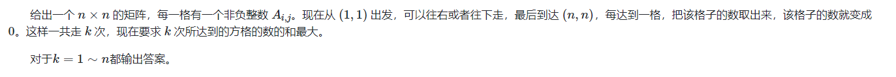

# 2023.10

落幕

vp记录： 

2022 ICPC：
南京： 140 （铜）
西安： 206 （铜）
济南： 209 （铜）

2020银川： 82 （银）
2020南京   84 （银）

2021南京： 120 （铜）

2021ccpc威海： 110 （铜）

2022 CCPC
桂林： 110 （铜）

2021
桂林：70 （银）


**复盘，总结：**

遇见的一些情况：

1. 签到不顺。

2. 同时卡题。

3. 铜牌题耗时过长。

   key: 调试 ， 代码编写规范 ， 题目反应 ， 思考效率。

4. 双线程开题。

5. 节奏慢。

## 补题：

**动态规划：**

1. 

**ICPC VP**

1. 2022南京： [2022ICPC南京.md](..\..\problems\XCPC\2022ICPC南京.md) 
1. 2021威海： [2021ccpc威海.md](..\..\problems\XCPC\2021ccpc威海.md) 

**网络流**

1. [最大流.md](..\..\Logrithm\图论\流匹配\最大流.md) 
2. [最小割.md](..\..\Logrithm\图论\流匹配\最小割.md) 
3. [费用流.md](..\..\Logrithm\图论\流匹配\费用流.md) 


**做题记录：**

**dp**

1. [Problem - D - Codeforces](https://codeforces.com/contest/1616/problem/D) (2000 dp , 转换， 解空间压缩下的dp方程优化（翡蜀定理）)

**数论：**

1. [Problem - 1627D - Codeforces](https://codeforces.com/problemset/problem/1627/D) （1900）

----

# G. Inscryption

https://codeforces.com/gym/104128/problem/G


### solve

事实1: 由于初始条件下比值就是大于等于1的.因此卡牌操作,降低平均实力.
因此问题转换成,保证有解的前提下,使得合并操作尽量多.

用反悔贪心解决当前问题:  为了迎接最优结果,保持最优的状态。

```cpp
#include<bits/stdc++.h>
using namespace std;

using ll = long long;

#define dbg(x) cerr << "[" << __LINE__ << "]" << ": " << x << "\n"

#define all(x) (x).begin(),(x).end()
#define sz(x) (int)(x).size()

const int inf = 1E9 + 7;
const ll INF = 1E18 + 7;
const int N = 1E6 + 10;

int a[N];

void work(int testNo)
{
	int n;
	cin >> n;
	int x = 1, y = 1;
	int  rec2 = 0;
	bool flag = false;
	for (int i = 1; i <= n; i++) {
		int ty; cin >> ty;
		if (ty == -1) {
			if (y == 1) {
				if (rec2 > 0) {
					rec2--;
					x++;
					y++;
				} else {
					// cout << -1 << "\n";
					flag = true;
					// return;
				}
			} else {
				y--;
			}
		} else if (ty == 0) {
			if (y == 1) {
				x++;
				y++;
			} else {
				rec2++;
				y--;
			}
		} else {
			x++;
			y++;
		}
	}
	if (flag) {
		cout << -1 << "\n";
		return;
	}
	int t = __gcd(x , y);
	cout << x / t << " " << y / t << "\n";
}

signed main()
{
	ios::sync_with_stdio(false);
	cin.tie(0);

	int t; cin >> t;
	for (int i = 1; i <= t; i++)work(i);
}

/* stuff you should look for
* int overflow, array bounds
* special cases (n=1?)
* do smth instead of nothing and stay organized
* WRITE STUFF DOWN
* DON'T GET STUCK ON ONE APPROACH
*/
```

# M. Drain the Water Tank

[Problem - M - Codeforces](https://codeforces.com/gym/104128/problem/M)
[M - 清空水箱 - SUA Wiki](https://sua.ac/wiki/2022-icpc-nanjing/m/)

赛时用了一个构造点来判断点包含的思路，做了很多有意思的，有启发性的分类讨论。

利用另外的角度(点积，叉积的方法来判断。)


发现局部最小必须满足几个性质：

1. 局部最小。
2. 内角小于180度。

同时要判调平角的情况。其方法时，判掉边界点。

判断内角是否小于180度。可以通过逆时针顺序的边做一个叉积。

.png)

**题解思路代码：**

```cpp
#include<bits/stdc++.h>
using namespace std;

using  db = long double;
const db EPS = 1E-15;

inline int sign(db a) {
	return a < -EPS ? -1 : a > EPS;
}
inline int cmp(db a , db b) {
	return sign(a - b);
}

struct P {
	db x , y;
	P() {};
	P(db x_ , db y_) : x(x_) , y(y_) {}

	db dot(P p) {
		return x * p.x + y * p.y;
	}
	db det(P p) {
		return x * p.y - y * p.x;
	}
	P operator-(P p) {
		return {x - p.x, y - p.y};
	}
	P operator+(P p) {
		return {x + p.x , p.y};
	}
	P operator/(db d) {
		return {x / d , y / d};
	}
	void write() {
		cout << x << " " << y << "\n";
	}
};

#define cross(p1,p2,p3) ((p2.x-p1.x)*(p3.y- p1.y)-(p3.x-p1.x)*(p2.y-p1.y))
#define crossOp(p1,p2,p3) sign(cross(p1,p2,p3))

const int N = 2E3 + 10;

bool flag[N];
signed main() {
	ios::sync_with_stdio(false);
	cin.tie(0);

	int n;
	cin >> n;
	vector<P> p;
	for (int  i = 1; i <= n; i++) {
		int x , y;
		cin >> x >> y;
		p.push_back({x , y});
	}
	vector<int> id(n);

	iota(id.begin() , id.end(), 0);
	sort(id.begin() , id.end() , [&] (int x , int y) {
		// return p[x].y < p[y].y;
		if (p[x].y == p[y].y) {
			return p[x].x < p[y].x;
		} else return p[x].y < p[y].y;
	});
	for (int i = 0; i < n; i++) {
		int cur = id[i];
		if (flag[cur])continue;
		int l = (cur - 1 + n) % n;
		while (l != cur && p[l].y >= p[(l + 1) % n].y) {
			flag[l] = true;
			l = (l - 1 + n) % n;
		}
		int r = (cur + 1) % n;
		while (r != cur && p[r].y >= p[(r - 1 + n) % n].y) {
			flag[r] = true;
			r = (r + 1) % n;
		}
	}
	int ans = 0;
	for (int i = 0; i < n; i++) {
		if (flag[i]) continue;
		P p1 = p[(i - 1 + n) % n];
		P p2 = p[i];
		P p3 = p[(i + 1) % n];
		if ((p2 - p1).det(p3 - p2) > 0) {
			ans++;
		}
	}
	cout << ans << "\n";
}
```

**赛时：**

```cpp
#include<bits/stdc++.h>
using namespace std;

using  db = long double;
const db EPS = 1E-15;

inline int sign(db a) {
	return a < -EPS ? -1 : a > EPS;
}
inline int cmp(db a , db b) {
	return sign(a - b);
}

struct P {
	db x , y;
	P() {};
	P(db x_ , db y_) : x(x_) , y(y_) {}

	db dot(P p) {
		return x * p.x + y * p.y;
	}
	db det(P p) {
		return x * p.y - y * p.x;
	}
	P operator-(P p) {
		return {x - p.x, y - p.y};
	}
	P operator+(P p) {
		return {x + p.x , p.y};
	}
	P operator/(db d) {
		return {x / d , y / d};
	}
	void write() {
		cout << x << " " << y << "\n";
	}
};

#define cross(p1,p2,p3) ((p2.x-p1.x)*(p3.y- p1.y)-(p3.x-p1.x)*(p2.y-p1.y))
#define crossOp(p1,p2,p3) sign(cross(p1,p2,p3))

bool isMiddle(db a , db m , db b) {
	return sign(a - m) == 0 || sign(b - m) == 0 || (a < m != b < m);
}
bool isMiddle(P a , P m , P b) {
	return isMiddle(a.x, m.x , b.x) && isMiddle(a.y , m.y , b.y);
}

bool onSeg(P p1 , P p2 , P q) {
	return crossOp(p1 , p2 , q) == 0 && isMiddle(p1, q , p2);
}

int contain(vector<P> ps , P p) {
	int n = ps.size() , ret = 0;
	for (int i = 0; i < n; i++) {
		P u = ps[i] , v = ps[(i + 1) % n];
		if (onSeg(u , v , p)) return 1;
		if (cmp(u.y, v.y) <= 0) swap(u , v);
		if (cmp(p.y, u.y) > 0 || cmp(p.y , v.y) <= 0) continue;
		ret ^= crossOp(p, u, v) > 0;
	}
	return ret * 2;
}

const int N = 2E3 + 10;

bool flag[N];

/*

*/

signed main() {
	ios::sync_with_stdio(false);
	cin.tie(0);

	int n;
	cin >> n;
	vector<P> p;
	for (int  i = 1; i <= n; i++) {
		int x , y;
		cin >> x >> y;
		p.push_back({x , y});
	}
	vector<int> id(n);

	iota(id.begin() , id.end(), 0);
	sort(id.begin() , id.end() , [&] (int x , int y) {
		return p[x].y < p[y].y;
	});
	for (int i = 0; i < n; i++) {
		int cur = id[i];
		if (flag[cur])continue;
		// cout << cur << "\n";
		int l = (cur - 1 + n) % n;
		while (l != cur && p[l].y >= p[(l + 1) % n].y) {
			flag[l] = true;
			l = (l - 1 + n) % n;
		}
		int r = (cur + 1) % n;
		while (r != cur && p[r].y >= p[(r - 1 + n) % n].y) {
			flag[r] = true;
			r = (r + 1) % n;
		}
	}
	// int rec = contain(p , (p[0] + p[1])/2);
	// cout << rec << "\n";
	// cout << "aaa" << "\n";
	int ans = 0;
	for (int i = 0; i < n; i++) {
		if (flag[i])continue;
		// cout << i << "\n";
		int rec = contain(p , {p[i].x , p[i].y - 0.0000001});
		// p[i].write();
		// cout << rec << "\n";
		if (rec == 0) {
			ans++;
		}
		// if(rec == 2){
		//     ans++;
		// }else if(rec == 1){
		//     int l = (i - 1 + n) % n;
		//     int r = (i + 1) % n;
		//     int t;
		//     if(p[l].y == p[i].y) t = l;
		//     else if(p[r].y == p[i].y) t = t;
		//     // t.write();
		//     P tt = (p[t] + p[i])/2;
		//     rec = contain(p , {tt.x , tt.y - 0.5});
		//     if(rec == 2) ans++;
		// }
	}

	cout << ans << "\n";
	// for (int i = 0; i < n; i++) {
	//     cout << id[i] << " ";
	// }
	// cout << "\n";
	// for (int i = 0; i < n; i++) {
	//     int cur = id[i];
	//     cout << "aaa" << "\n";
	//     if (flag[cur]) continue;
	//     int l = (cur - 1 + n) % n;
	//     while (l != cur) {
	//         if (flag[l]) break;
	//         if (p[l].y < p[(l + 1) % n].y) {
	//             P p1 = p[(l + 2) % n];
	//             P p2 = p[(l + 1) % n];

	//             int t = crossOp(p1 , p2 , p[l]);
	//             cout << "l " << l <<  " t " << t << " ";
	//             if (t == 1)break;
	//         }
	//         flag[l] = true;
	//         cout << l << " ";
	//         l = (l - 1 + n) % n;
	//     }
	//     cout << "bbb";
	//     int r = (cur + 1) % n;
	//     while (r != cur) {
	//         if (flag[r])break;
	//         if (p[r].y < p[(r - 1 + n) % n].y) {
	//             P p1 = p[(r - 2 + n) % n];
	//             P p2 = p[(r - 1 + n) % n];
	//             int t = crossOp(p1 , p2 , p[r]);
	//             if(r == 3){
	//                 cout << "\n";
	//                 p1.write();
	//                 p2.write();
	//                 p[r].write();
	//             }
	//             cout << "r " <<r <<  " t "<< t << " ";
	//             if (t == 1)break;
	//         }
	//         cout << r << " ";
	//         flag[r] = true;
	//         r = (r + 1) % n;
	//     }
	// }
}
```

-----

# D - 聊天程序

[D - 聊天程序 - SUA Wiki](https://sua.ac/wiki/2022-icpc-nanjing/d/)

[Problem - D - Codeforces](https://codeforces.com/gym/104128/problem/D)


二分答案：（防止队友把自己的路封死。尝试多种思路，往下探索解法。）

二分答案中，关注第k大。或者一些和某个临界大小相关的数时候，可以对模型做下角度的一个简化：将大于x的看作1 ， 小于x的看作0。这样可以避免一些不必要的麻烦。

进行check答案时候，观察一个简单的性质， 发现滑动等差数列的过程中，每个数字的属性只发生一次性变。我们关注第一次为x的位置。这样就可以对操作块内的x进行快速的统计。

**注意边界：**

1. 这种模型，增加序列的尾部不能小于m。否则是不符合实际定义的。
   1. 如果有解，可以找出尾部。
   2. 无解：（最小增加长度是x ， x > i）

```cpp
const int N = 1E6 + 10;

int a[N];
int n , k , m , c , d;

bool check(ll x) {
	vector<int> b(n + 1) , fi(n + 1) , pre(n + 1);
	// cerr << x << "\n";
	for (int i = 1; i <= n; i++) {
		// cerr << i << "\n";

		int chance = min(m , i);
		if (a[i] < x) {
			int dis = x - a[i] , sum = 0;
			/*长度为1*/
			dis -= c;

			if (dis <= 0) sum = 1;
			else {
				if (d)
					sum = (dis + d - 1) / d + 1;
				else sum = m + 1;
			}
			if (sum <= chance) {
				fi[i] = min(i + m - sum + 1 , n + 1);
			}
		} else b[i] = 1;
		pre[i] = pre[i - 1] + b[i];
	}
	// cerr << x << "\n";
	if (pre[n] >= k) return true;
	vector<int> cnt(n + 2 , 0);
	int  cur = pre[n] , mx = cur;

	for (int r = 1; r <= n; r++) {
		cur -= cnt[r];
		if (b[r] == 0 && fi[r]) {
			cur++;
			cnt[fi[r]]++;
		}
		mx = max(cur , mx);
	}
	return mx >= k;
}
signed main()
{
	ios::sync_with_stdio(false);
	cin.tie(0);

	cin >> n >> k >> m >> c >> d;

	for (int i = 1; i <= n; i++) {
		cin >> a[i];
	}
	ll low = 0 , high = 1E15;
	while (low < high) {
		ll mid = (low + high + 1) / 2;
		// cerr << mid << "\n";
		if (check(mid)) low = mid;
		else high = mid - 1;
	}
	cout << low << "\n";
}
```


# Problem A. 停停，昨日请不要再重现


逆向思维 + 二维数组中的差分技巧。

**思路关键**

1. 对于将会出界必定不会留存下来的袋鼠，不必考虑洞对他的影响。
2. 于是找到最终的袋鼠小方阵（最后保存下来的肯定是一个方阵）
3. 考虑每个洞经历过不同的袋鼠个数。手玩之后发现，由于方阵是整齐移动的，因此一个袋鼠去到新的格子，其它所有袋鼠都去到新的格子。因此只需维护最左上角的袋鼠，处理某个袋鼠第2 + x次经过洞的情况。对于第一次经过，方阵覆盖的每一个点的掉入的袋鼠个数都增加1.

**二维数组矩形加**

临场手玩了一下，其实就是一个小构造。

.png)


```cpp
#include<bits/stdc++.h>
using namespace std;

using ll = long long;
using i64 = long long;
using ld = long double;
using uint = unsigned int;
using pii = pair<int , int>;
using pli = pair<ll , int>;
using pll = pair<ll , ll>;


#define dbg(x) cerr << "[" << __LINE__ << "]" << ": " << x << "\n"

#define all(x) (x).begin(),(x).end()
#define sz(x) (int)(x).size()
#define pb push_back
#define fi first
#define se second

const int inf = 1 << 29;
const ll INF = 1LL << 60;
const int N = 1E6 + 10;

/*
1
4 5 3
ULDDRR

*/

void work(int testno) {
    int n , m , k;

    cin >> n >> m >> k;
    vector<vector<int>> sum(n + 2 , vector<int>(m + 2));
    string s;
    cin >> s;
    s = "#" + s;
    set<pair<int , int>> rec;
    int l = 1, r = m, u = 1, d = n, tag = 0;
    int len = sz(s) - 1;
    for (int i = 1; i <= len; ++i) {
        if (s[i] == 'U') {
            if (u > 1)u--;
            d--;
            if (d <= 0)tag = 1;
        } else if (s[i] == 'D') {
            if (d < n)d++;
            u++;
            if (u > n)tag = 1;
        } else if (s[i] == 'L') {
            if (l > 1)l--;
            r--;
            if (r <= 0)tag = 1;
        } else {
            if (r < m)++r;
            ++l;
            if (l > m)tag = 1;
        }
    }
    int remain = 0;
    if (tag == 1) {
        remain = 0;
        if (k == 0) {
            cout << n * m << "\n";
            return;
        } else {
            cout << 0 << "\n";
            return;
        }
    }
    remain = (r - l + 1) * (d - u + 1);
    if (remain < k) {
        cout << 0 << '\n';
        // cout << testno << "\n";
        return;
    }
    // pair<int , int> l = {1 , 1} , r = {n , n};
    // for (int i = 0; i < sz(s); i++) {
    // }

    set<pair<int , int>> pass;

    for (int i = len; i > 0; i--) {
        // cout << l << " " << r << " " << u << " " << d << '\n';
        if (pass.count({l , u}) == 0) {
            pass.insert({l , u});
            sum[u][l]++; sum[d + 1][r + 1]++;
            sum[u][r + 1]--; sum[d + 1][l]--;

        }
        if (s[i] == 'U') {
            d++; u++;
        } else if (s[i] == 'D') {
            d--; u--;
        } else if (s[i] == 'R') {
            l--; r--;
        } else {
            l++; r++;
        }
    }
    // cout << l << " " << r << " " << u << " " << d << '\n';
    if (pass.count({l , u}) == 0) {
        pass.insert({l , u});
        sum[u][l]++; sum[d + 1][r + 1]++;
        sum[u][r + 1]--; sum[d + 1][l]--;

    }
    int ans = 0;
    for (int i = 1; i <= n; i++)
        for (int j = 1; j <= m; j++) {
            sum[i][j] += sum[i - 1][j] + sum[i][j - 1];
            sum[i][j] -= sum[i - 1][j - 1];
            if (sum[i][j] == remain - k) ans++;
        }
    // cout << testno << "\n";
    cout << ans << '\n';
}

int main() {
    ios::sync_with_stdio(false);
    cin.tie(nullptr);
    int t; cin >> t;
    for (int i = 1; i <= t; i++)
        work(i);
}
```

---

# Problem B. 索道

[Problem - B - Codeforces](https://codeforces.com/gym/104128/problem/B)


为了维护这种局部的修改，考虑头做一次动态规划，尾做一次动态规划。发生局部修改时，可以通过小规模的信息调整，以及未被影响的记录，整理出新的解。

**状态定义：**
$f_i$ : 表示处理0 ... i , 在i点上建立一个基站的最优解。
$g_i$ : 表示处理i .... n + 1。在i点建立基站的最优解。

**状态转移：**
枚举上一个建立基站的位置。（注意一些站点必须要建立基站。）


```cpp
#include<bits/stdc++.h>
using namespace std;

using ll = long long;
#define all(x) (x).begin(),(x).end()

#define int ll

const int N = 5E5 + 10;
const ll INF = (long long)1E18 + 7;

int a[N];
ll f[N] , g[N];
int que[N];
void solve() {
	int n , k;
	cin >> n >> k;
	for (int i = 0; i <= n + 1; i++) {
		f[i] = g[i] = 0;
	}
	for (int i = 1; i <= n; i++)
		cin >> a[i];
	string s; cin >> s;
	s = '1' + s + '1';
	int low = 0 , high = 0;
	que[low] = 0;
	for (int i = 1; i <= n; i++) {
		while (low <= high && i - que[low] > k) low++;
		f[i] = f[que[low]] + a[i];
		if (s[i] == '1') {
			high = low - 1;
		} else {
			while (low <= high && f[que[high]] >= f[i]) high--;
		}
		que[++high] = i;
	}
	low = 0 ; high = 0;
	que[low] = n + 1;
	for (int i = n; i >= 1; i--) {
		while (low <= high && que[low] - i > k) low++;
		g[i] = g[que[low]] + a[i];
		if (s[i] == '1') {
			high = low - 1;
		} else {
			while (low <= high && g[que[high]] >= g[i]) high--;
		}
		que[++high] = i;
	}
	int m; cin >> m;
	vector<ll> ans(m);
	for (int i = 0; i < m; i++) {
		int pos , val , id = i;
		cin >> pos >> val;

		low = 0 , high = 0;
		que[low] = pos + 1;
		/*必选*/
		ans[id] = f[pos] + g[pos] - 2LL * a[pos] + val;
		if (s[pos] == '0' && k != 1) {
			int j = pos - 1;
			while (j > 0 && j > pos - k + 1 && s[j] == '0') j--;
			for (; j < pos; j++) {
				int nxt = que[high] + 1;
				while (nxt <= j + k && nxt <= n + 1 && s[que[high]] == '0') {
					while (low <= high && g[que[high]] >= g[nxt]) high--;
					que[++high] = nxt;
					nxt++;
				}
				ans[id] = min(ans[id] , f[j] + g[que[low]]);
			}
		}
	}
	for (int i = 0; i < m; i++) {
		cout << ans[i] << "\n";
	}
}
signed main() {
	ios::sync_with_stdio(false);
	cin.tie(0);
	int t; cin >> t;
	while (t--) solve();
}
```

-----

# Problem E. 树的染色


每一层的节点的染色是相互独立的，于是每一层染色的最小值相加就是ans(第一步拆)于是问题转换成了下方一个更加简洁明了的dp方式：

**状态定义：**

$f_{u}$ : 表示语境下（枚举到某一层时）以u为父亲节点的子树下的当前枚举层节点被染色的最小代价。

**状态转移方程：**

一共有两类方案： 1. 选择更上层的节点，一次染完。2. 子树内部小子树染完。

$f_u$ = $min(a_{d-dep_u....d - dep_1} , \sum_{v\in sons(u)} f_v)$

**朴素实现：**

显然是$O(n^2)$ 枚举深度，每一次$O(n)$ 处理。

**优化**

发现一些总是存在一些冗余的访问情况： 例如某些大子树相当与部分是没有层节点的。并且如果是一条链的结构，重复做着本质相同的转移。

这种树相关的冗余结构，可以通过虚树的方法实现。复杂度如下：

**建树：**

$nlog(n)$

**dp：**

$\sum key \times\log n$

$\sum key = n$


```cpp
#include<bits/stdc++.h>

using namespace std;
using ll = long long;

const int N = 1E5 + 10;
const ll INF = 1E18 + 7;

int a[N];
vector<int> e[N] , VT[N] , node[N];

const int LOGN = 18;
int n;
int dep[N] , par[LOGN + 1][N] , val[LOGN + 1][N];
int l[N] , r[N] , tot;

/*记录数组的st表：*/
int f[22][N];

void dfs(int u , int fa) {
	l[u] = ++tot;
	dep[u] = dep[fa] + 1;
	node[dep[u]].push_back(u);
	for (auto v : e[u]) {
		if (v == fa) continue;
		par[0][v] = u;
		dfs(v , u);
	}
	r[u] = tot;
}

void init() {
	for (int i = 1; i <= n; i++) f[0][i] = a[i];
	for (int j = 1; j <= LOGN; j++) {
		for (int i = 1; i + (1 << j) - 1 <= n; i++) {
			f[j][i] = min(f[j - 1][i] , f[j - 1][i + (1 << (j - 1))]);
		}
	}

	dfs(1 , 0);
	for (int i = 1; i <= LOGN; i++) {
		for (int u = 1; u <= n; u++) {
			par[i][u] = par[i - 1][par[i - 1][u]];
		}
	}
}

int query(int l , int r) {
	assert(l <= r);
	int len = 31 - __builtin_clz(r - l + 1);
	return min(f[len][l] , f[len][r - (1 << len) + 1]);
}

int LCA(int u , int v) {
	if (dep[u] > dep[v]) swap(u , v);
	int d = dep[v] - dep[u];
	for (int i = LOGN; i >= 0; i--) {
		if ((1 << i) <= d) {
			d -= (1 << i);
			v = par[i][v];
		}
	}
	if (v == u) return v;
	for (int i = LOGN; i >= 0; i--) {
		if (par[i][v] != par[i][u]) {
			v = par[i][v];
			u = par[i][u];
		}
	}
	return par[0][u];
}

/*怎么建立两点之间的边？*/
void Build(vector<int>&key) { /*当前的深度*/
	auto cmp = [&](int x , int y) {
		return l[x] < l[y];
	};
	auto add = [&](int x , int y) {
		/*边*/
		VT[x].emplace_back(y);
	};
	key.push_back(1);
	sort(key.begin() , key.end() , cmp);

	vector<int> a;
	for (int i = 0; i < (int)key.size() - 1; i++) {
		a.push_back(key[i]);
		a.push_back(LCA(key[i] , key[i + 1]));
	}
	a.push_back(key.back());
	sort(a.begin() , a.end() , cmp);
	a.erase(unique(a.begin() , a.end()) , a.end());
	for (int i = 0 , lc; i < (int)a.size() - 1; i++) {
		lc = LCA(a[i] , a[i + 1]);
		add(lc , a[i + 1]);
	}
}
ll dp[N];

void dfs2(int u , int d) {
	dp[u] = 0;
	// int low = d - dep[u] + 1  , high = d - dep[1] + 1;
	// cerr << "u " << u << " " << "LL " << (low) << " RR " << (high) <<  " mi :" << query(low , high) <<  "\n";
	for (auto v : VT[u]) {
		dfs2(v , d);
		dp[u] += dp[v];
	}
	if (VT[u].size() == 0) dp[u] = INF;
	dp[u] = min(dp[u] , 1LL * query(d - dep[u] + 1 , d - dep[1] + 1));
	VT[u].clear();
}
void solve() {
	cin >> n;
	for (int i = 1; i <= n; i++) {
		e[i].clear();
		node[i].clear();
	}
	for (int i = 1; i <= n; i++) {
		cin >> a[i];
	}
	for (int i = 1; i < n; i++) {
		int u , v;
		cin >> u >> v;
		e[u].push_back(v);
		e[v].push_back(u);
	}
	init();
	ll ans = 0;
	for (int i = 1; i <= n; i++) {
		if (node[i].size()) {
			// cerr << "aaa : " << i << "\n";
			Build(node[i]);
			dfs2(1 , i);
			// cerr << "bbb: " << dp[1] << "\n";
			ans += dp[1];
		}
	}
	cout << ans << "\n";
}
/*
1
4
10 15 40 1
1 2
2 3
2 4

1
5
10 5 1 100 1000
1 2
2 3
2 4
4 5

1
4
1000 200 10 8
1 2
2 3
3 4

*/

signed main() {
	ios::sync_with_stdio(false);
	cin.tie(0);
	int t; cin >> t;
	while (t--) solve();
}
```

---

# 2021ccpc威海

X 国是一个繁荣的自由贸易国家，有 $n$ 个城市由 $n-1$ 条双向道路连接。虽然 X 国一直非常稳定，但商人们普遍对城市安全非常敏感。他们希望 X 国能加强公安力量，确保城市安全。

此外，商人还关注周边地区的安全。因此，如果一個城市的保安力量加強了，但附近城市的保安力量沒有加 強，他們仍會擔心附近城市受到威脅。

从形式上看，要加强城市 $i$ 的安保力量，就要付出 $w_i$ 的代价。这样的努力不会白费，因为会吸引更多的商人，X 国也会从中受益。如果每个与城市 $i$ 距离小于或等于 $p$ 的城市都得到加强，城市 $i$ 将比以前获得 $v_p$ 更多的收入。(如果满足条件的 $p$ 不止一个，则只考虑最大的一个）。

现在，你作为国家官员，被任命来处理这个问题。你的目标是获得最大收益（增加的收入减去加强安全部队的成本）。

**输入**

第一行包含一个整数 $n$ ( $1 \le n \le 200$ )，代表 X 国的城市数量。

第二行包含 $n$ 个整数 $w_1,w_2,\cdots,w_n$ ( $1 \le w_i \le 10^5$ )，代表在城市 $i$ 加强安全部队的成本。

第三行包含 $n$ 个整数 $v_0,v_1,\cdots,v_{n-1}$ （ $1 \le v_i \le 10^5,\ v_i \le v_{i+1}$ ）。( $1 \le v_i \le 10^5,\ v_i \le v_{i+1}$ ) 代表上述收益。

接下来的 $n-1$ 行分别包含两个整数 $u,v$ ( $1 \le u,v \le n,\ u\neq v$ )，表示城市 $u$ 和 $v$ 之间有一条双向道路。

### solve

**网络流方法：**

转换成最小割：


### code

```cpp
#include<bits/stdc++.h>
using namespace std;
using ll = long long;

#define all(x) (x).begin(),(x).end()
#define sz(x) (int)(x).size()

const int inf = 1E9 + 7;;
const ll INF = 1E18 + 7;
const int N = 200 + 10;

int w[N] , v[N];

vector<int> adj[N] , d[N];

const int V = 50100;
const int E = 501000;
template<typename T>
struct FlowGraph {
    int s, t, vtot;
    int head[V], etot;
    int dis[V], cur[V];

    // 邻接表存储。
    // 这样可以方便建立反边^1。

    struct edge {
        int v, nxt;
        T f;
    } e[E * 2];
    void addedge(int u, int v, T f) {
        e[etot] = {v, head[u], f}; head[u] = etot++;
        e[etot] = {u, head[v], 0}; head[v] = etot++;
    }

    bool bfs() {
        for (int i = 1; i <= vtot; i++) {
            dis[i] = 0;
            cur[i] = head[i];
        }
        queue<int> q;
        q.push(s); dis[s] = 1;

        while (!q.empty()) {
            int u = q.front(); q.pop();
            for (int i = head[u]; ~i; i = e[i].nxt) {
                if (e[i].f && !dis[e[i].v]) {
                    int v = e[i].v;
                    dis[v] = dis[u] + 1;
                    if (v == t) return true;
                    q.push(v);
                }
            }
        }
        return false;
    }

    T dfs(int u, T m) {
        if (u == t) return m;
        T flow = 0;
        for (int i = cur[u]; ~i; cur[u] = i = e[i].nxt)
            if (e[i].f && dis[e[i].v] == dis[u] + 1) {
                T f = dfs(e[i].v, min(m, e[i].f));
                e[i].f -= f;
                e[i ^ 1].f += f;
                m -= f;
                flow += f;
                if (!m) break;
            }
        if (!flow) dis[u] = -1;
        return flow;
    }

    T dinic() {
        T flow = 0;
        // 从起点开始bfs，确定分层图。 然后开始增广。
        //
        while (bfs()) flow += dfs(s, numeric_limits<T>::max());
        return flow;
    }
    void init(int s_, int t_, int vtot_) {
        s = s_;
        t = t_;
        vtot = vtot_;
        etot = 0;
        for (int i = 1; i <= vtot; i++) head[i] = -1;
    }
};

FlowGraph<int> g;

signed main()
{
    ios::sync_with_stdio(false);
    cin.tie(0);

    int n;
    cin >> n;
    for (int i = 1; i <= n; i++)
        cin >> w[i];
    for (int i = 1; i <= n; i++)
        cin >> v[i];
    for (int i = 1; i < n; i++) {
        int u , v;
        cin >> u >> v;
        adj[u].push_back(v);
        adj[v].push_back(u);
    }
    auto bfs = [&](int s) {
        vector<int> dis(n + 1 , inf);
        dis[s] = 1;
        queue<int> que;
        que.push(s);
        while (not que.empty()) {
            int u = que.front();
            que.pop();
            for (auto v : adj[u]) {
                if (dis[v] > dis[u] + 1) {
                    dis[v] = dis[u] + 1;
                    que.push(v);
                }
            }
        }
        d[s] = dis;
    };
    for (int i = 1; i <= n; i++) {
        bfs(i);
        // for (int j = 1; j <= n; j++) {
        //     cout << d[i][j] << " \n"[j == n];
        // }
    }
    ll sum = 0;
    for (int i = 1; i <= n; i++) {
        sum += v[n];
    }
    auto get = [&](int i , int j) {
        return (i - 1) * n + j;
    };

    int s = n * n + n + 1 , t = n * n + n + 2;
    g.init(s , t , t);

    for (int i = 1; i <= n; i++) {
        for (int j = 1; j <= n; j++) {
            g.addedge(s , get(i , j) , v[j] - v[j - 1]);
            g.addedge(get(i , d[i][j]) , n * n +  j , inf);
        }
        for (int j = n; j > 1; j--) {
            g.addedge(get(i , j) , get(i , j - 1) , inf);
        }
    }
    for (int i = 1; i <= n; i++) {
        g.addedge(n * n + i , t , w[i]);
    }

    // cerr << "aaa\n";
    auto f = g.dinic();
    cout << sum - f << "\n";
}
/* stuff you should look for
* int overflow, array bounds
* special cases (n=1?)
* do smth instead of nothing and stay organized
* WRITE STUFF DOWN
* DON'T GET STUCK ON ONE APPROACH
*/
```


# 最大流


## 基本问题：

图上的边定义了流量的属性。给定源点和汇点。汇点流入的合理方案：满足每条边的流量不超过流量上限，，每个点满足流量平衡（如果一个点不是源点或者汇点，流入流量之和等于流出流量之和）。求出源点到汇点的最大流量。

## 基本概念：

### 基本贪心思路：

1. 不断找到一条流量上限不全为0的路径。选择当前路径来输出最大可流流量，直到没有方案为止。

2. 这种贪心是不正确的： 反例如下
   

3. 避免当前问题的方法：

   1. 引入反向边：来表式当前边流过多少流量： 这样就支持了一种可撤销的操作。

   2. 流的过程中，维护的带上述反向边的图就是残量网络。
      

   3. 引入新的贪心策略：

      **引入反向边概念：** 一条边流了x ，建立一条反向边，该边的边权为流量的值即x。（更好的处理撤销流，调整操作。）

      1. 不停增广，直到不能增广： 
      2. 增广的含义是： 找到流量上限都是正的路径，然后流过去。==可能是原图的边也可能是原图的反向边。== （这里有没有严格的方向概念？）

**残量网络：** 引入反向边后的网络。

### Ford Fullson

#### 过程：

上述基本的贪心过程。

#### 时间复杂度：

1. 时间复杂度：$O(Fm)$ 流量$\times$ m 

下图代表的图中,就会跑满上述的复杂度.


### Edmonds-karp  EK算法

和FF不同 , 有策略地寻找路径：FF像DFS，而EK像BFS
**最短增广路算法**： 每次找最短距离（最短边数）的增广路。

#### 复杂度

认识：

1. 反向边只会增加两点之间的距离。
2. 考虑分层图上增广。m次增广使得每条边被删完，每次寻找增广路的复杂度为$O(m)$
3. 点的距离会不断增加，最多增加n次。

$O(nm^2)$

一般用的是dinic.

### Dinic算法

dfs多路增广 ： 在选择最短路的基础上，dfs过程中，如果有剩余流量。就继续dfs下去。

**当前弧优化：**

保证复杂度的一个部分；

```CPP
for(int i = cur[u]; ~i ; cur[u] = i = e[i].nxt)
```

每次访问下一条边，将该点的cur修改为下一条边：

$cur:表示什么？$ 表示下次这个点，第一个访问的边。每一次增广的过程中，一条边已经被流完，就不需要再继续访问。详细看代码细节。

**复杂度**

$O(n^2m)$ 

## problems

### 模板题： 最大流。

给定n个点，m条有向边，给定每条边的容量，求从点到点t的最大流。

```cpp
#include <bits/stdc++.h>
using namespace std;
using ll = long long;

const int V = 1010;
const int E = 101000;
template<typename T>
struct FlowGraph {
	int s, t, vtot;
	int head[V], etot;
	int dis[V], cur[V];

	// 邻接表存储。
	// 这样可以方便建立反边^1。

	struct edge {
		int v, nxt;
		T f;
	} e[E * 2];
	void addedge(int u, int v, T f) {
		e[etot] = {v, head[u], f}; head[u] = etot++;
		e[etot] = {u, head[v], 0}; head[v] = etot++;
	}

	bool bfs() {
		for (int i = 1; i <= vtot; i++) {
			dis[i] = 0;
			cur[i] = head[i];
		}
		queue<int> q;
		q.push(s); dis[s] = 1;

		while (!q.empty()) {
			int u = q.front(); q.pop();
			for (int i = head[u]; ~i; i = e[i].nxt) {
				if (e[i].f && !dis[e[i].v]) {
					int v = e[i].v;
					dis[v] = dis[u] + 1;
					if (v == t) return true;
					q.push(v);
				}
			}
		}
		return false;
	}

	T dfs(int u, T m) {
		if (u == t) return m;
		T flow = 0;
		for (int i = cur[u]; ~i; cur[u] = i = e[i].nxt)
			if (e[i].f && dis[e[i].v] == dis[u] + 1) {
				T f = dfs(e[i].v, min(m, e[i].f));
				e[i].f -= f;
				e[i ^ 1].f += f;
				m -= f;
				flow += f;
				if (!m) break;
			}
		if (!flow) dis[u] = -1;
		return flow;
	}

	T dinic() {
		T flow = 0;
		// 从起点开始bfs，确定分层图。 然后开始增广。
		//
		while (bfs()) flow += dfs(s, numeric_limits<T>::max());
		return flow;
	}
	void init(int s_, int t_, int vtot_) {
		s = s_;
		t = t_;
		vtot = vtot_;
		etot = 0;
		for (int i = 1; i <= vtot; i++) head[i] = -1;
	}
};

FlowGraph<ll> g;
int n, m, s, t;
int main() {
	scanf("%d%d%d%d", &n, &m, &s, &t);
	g.init(s, t, n);
	for (int i = 1; i <= m; i++) {
		int u, v, w;
		scanf("%d%d%d", &u, &v, &w);
		g.addedge(u, v, w);
	}
	printf("%lld\n", g.dinic());
}
```

### 网络流20题，试题库：

[网络流 24 题, 试题库 - 题目 - Daimayuan Online Judge](http://oj.daimayuan.top/course/23/problem/1059)

假设一个试题库中有 n 道试题。每道试题都标明了所属类别。同一道题可能有多个类别属性。现要从题库中抽取 m 道题组成试卷。并要求试卷包含指定类型的试题。试设计一个满足要求的组卷算法。


#### solve

匹配模型。考虑将这个图建模，使其转变成网络流模型。

**建模指导**

1. 用一条流代表一个选择：
2. 1道题只能被选择一次。
3. 某一类型的题必须有规定数量道。即通过题目类型的流的大小应该为其数目。

**建模细节**

1. 抽象出两种节点： 题目类型点，以及题目点。
2. 定义出两个点：源点汇点。源点指向每一个类型节点（）。其值的大小就是每种类型题目的需求值。题目点指向汇点，必须为1.代表这道题只能被选择一次。
3. 题目类型点指向对应类型的题目点，容量限制为1（只能选择一次）。

**基于建模解决一些问题：**

1. 无解： 如果存在解，必然是存在一个最大流方案的。即每一类型点都经过了对应的流量。
2. 有解：
   1. 怎么还原解。可以关注最后的残量网络，从而关注，哪一条边被使用过，从而可以判定出对应流的选择。

#### code

```cpp
#include <bits/stdc++.h>
using namespace std;
using ll = long long;

const int V = 1010;
const int E = 101000;
template<typename T>
struct FlowGraph {
	int s, t, vtot;
	int head[V], etot;
	int dis[V], cur[V];

	// 邻接表存储。
	// 这样可以方便建立反边^1。

	struct edge {
		int v, nxt;
		T f;
	} e[E * 2];
	void addedge(int u, int v, T f) {
		e[etot] = {v, head[u], f}; head[u] = etot++;
		e[etot] = {u, head[v], 0}; head[v] = etot++;
	}

	bool bfs() {
		for (int i = 1; i <= vtot; i++) {
			dis[i] = 0;
			cur[i] = head[i];
		}
		queue<int> q;
		q.push(s); dis[s] = 1;

		while (!q.empty()) {
			int u = q.front(); q.pop();
			for (int i = head[u]; ~i; i = e[i].nxt) {
				if (e[i].f && !dis[e[i].v]) {
					int v = e[i].v;
					dis[v] = dis[u] + 1;
					if (v == t) return true;
					q.push(v);
				}
			}
		}
		return false;
	}

	T dfs(int u, T m) {
		if (u == t) return m;
		T flow = 0;
		for (int i = cur[u]; ~i; cur[u] = i = e[i].nxt)
			if (e[i].f && dis[e[i].v] == dis[u] + 1) {
				T f = dfs(e[i].v, min(m, e[i].f));
				e[i].f -= f;
				e[i ^ 1].f += f;
				m -= f;
				flow += f;
				if (!m) break;
			}
		if (!flow) dis[u] = -1;
		return flow;
	}

	T dinic() {
		T flow = 0;
		// 从起点开始bfs，确定分层图。 然后开始增广。
		//
		while (bfs()) flow += dfs(s, numeric_limits<T>::max());
		return flow;
	}
	void init(int s_, int t_, int vtot_) {
		s = s_;
		t = t_;
		vtot = vtot_;
		etot = 0;
		for (int i = 1; i <= vtot; i++) head[i] = -1;
	}
};

FlowGraph<ll> g;
int n, k, s, t;
int main() {
	ios::sync_with_stdio(false);
	cin.tie(0);
	// cin >> n >> m >> s >> t;
	// scanf("%d%d" , &n , &k);
	cin >> k >> n;

	s = n + k + 1;
	t = n + k + 2;


	int sum = 0;
	g.init(s, t, n + k + 2);
	for (int i = 1; i <= k; i++) {
		int x;
		// scanf("%d" , &x);
		cin >> x;
		sum += x;
		// scanf("%d%d%d", &u, &v, &w);
		g.addedge(s, i, x);
	}
	// printf("%d\n" , sum);

	// cout << sum << "\n";
	for (int i = 1; i <= n; i++) {
		g.addedge(i + k , t , 1);
		int m;
		// scanf("%d" , &m);
		cin >> m;
		for (int j = 1; j <= m; j++) {
			int ty;
			// scanf("%d" , &ty);
			cin >> ty;
			g.addedge(ty , i + k , 1);
		}
	}
	// cout << g.dinic() << "\n";
	// printf("%d %d\n" , g.dinic() , sum);
	if (g.dinic() != sum) {
		// printf("No Solution!\n");
		cout << "No Solution!\n";
	} else {
		for (int i = 1; i <= k; i++) {
			// printf("%d: " , i);
			cout << i << ":";
			int tot = 1;
			for (int j = g.head[i]; ~j; j = g.e[j].nxt) {
				int v = g.e[j].v - k;
				if (g.e[j].f == 0 && v <= n) {
					// printf(" %d" , g.e[j].v);
					tot = 0;
					cout << " " << g.e[j].v - k;
				}
			}
			if (tot) cout << " ";
			cout << "\n";
		}
	}
}
```

### POI 2005 dicing

[POI2005, Dicing - 题目 - Daimayuan Online Judge](http://oj.daimayuan.top/course/23/problem/1060)


#### solve

匹配问题。和上述问题一样，利用网络流建模检查去确定流（确定解）的情况下，是否存在解。

然后就可以二分，搜索出答案了。

#### 细节总结：

要非常注意数组长度上的定义： 由于重新建图，引入其它点。（源点， 汇点 , 表达匹配关系的点）等等。点的个数一般是 n + m。 起码开两倍。 边的个数是$m  + n + m$ 起码得开5倍。总的来说，如果内存限制足够，能开多大就开多大。 1E6;

#### code

```cpp
#include<bits/stdc++.h>
using namespace std;

using ll  = long long;

const int V = 40010;
const int E = 40010;
template<typename T>
struct FlowGraph {
	int s , t , vtot;
	int head[V] , etot;
	int dis[V] , cur[V];

	struct edge {
		int v , nxt;
		T f;
	} e[E * 2];

	void addedge(int u , int v , T f) {
		e[etot] = {v , head[u] , f}; head[u] = etot++;
		e[etot] = {u , head[v] , 0}; head[v] = etot++;
	}

	bool bfs() {
		for (int i = 1; i <= vtot; i++) {
			dis[i] = 0;
			cur[i] = head[i];
		}
		queue<int> q;
		q.push(s); dis[s] = 1;

		while (!q.empty()) {
			int u = q.front(); q.pop();
			for (int i = head[u]; ~i; i = e[i].nxt) {
				if (e[i].f && !dis[e[i].v]) {
					int v = e[i].v;
					dis[v] = dis[u] + 1;
					if (v == t) return true;
					q.push(v);
				}
			}
		}
		return false;
	}

	T dfs(int u , T m) {
		if (u == t)  return m;
		T flow = 0;
		for (int i = cur[u]; ~i; cur[u] = i = e[i].nxt)
			if (e[i].f && dis[e[i].v] == dis[u] + 1) {
				T f = dfs(e[i].v , min(m , e[i].f));
				e[i].f -= f;
				e[i ^ 1].f += f;
				m -= f;
				flow += f;
				if (!m) break;
			}
		if (!flow) dis[u] = -1;
		return flow;
	}

	T dinic() {
		T flow = 0;
		while (bfs()) flow += dfs(s , numeric_limits<T> :: max());
		return flow;
	}
	void init(int s_ , int t_ , int vtot_) {
		s = s_;
		t = t_;
		vtot = vtot_;
		etot = 0;
		for (int i = 1; i <= vtot; i++) head[i] = -1;
	}
};
FlowGraph<ll> g;

int a[E][2];

signed main() {
	ios::sync_with_stdio(false);
	cin.tie(0);
	int n , m;
	cin >> n >> m;

	int s = n + m + 1;
	int t = n + m + 2;
	for (int i = 1; i <= m; i++) {
		cin >> a[i][0] >> a[i][1];
	}

	auto check = [&](int x) {
		g.init(s , t , n + m + 2);

		for (int i = 1; i <= m; i++) {
			g.addedge(s , i , 1);
			g.addedge(i , m + a[i][0] , 1);
			g.addedge(i , m + a[i][1] , 1);
		}
		for (int i = 1; i <= n; i++) {
			g.addedge(m + i , t , x);
		}
		return g.dinic() == m;
	};

	int low = 1 , high = m;
	while (low < high) {
		int mid = (low + high) / 2;
		if (check(mid)) high = mid;
		else low = mid + 1;
	}
	cout << low << "\n";
}
```

### 最长上升子序列：


网络流中的路径模型：

### solve

**问题一**

用一个比较暴力的dp方式即可解决。否则用二分优化该该模型。

**问题二**
**转换成一个统计问题。每一个流抽象为一个合法的划分方案。**
关注不同的特征进行建模。

1. 长度为s。
   构造流的合法性，通过建边细节的调整上实现：连边的规则$a_i <= a_j \&\& dp_i + 1 = dp_j$ （第一个条件显然，第二个条件如果不得到满足：）
2. 每个点最多只被使用一次。
   如果仅通过边的设置，显然是不行的。这里可以引入一个技巧（拆点）对于i , 用i1， 用来流入流， i2 ，用于流出流。其中两个点之间的容量限制为1。这样就可以完整的卡住流量为1的流。

.png)

#### tips(关键)

1. 注意特判n = 1；
2. 建图中的边界条件：

#### code

```cpp
#include<bits/stdc++.h>
using namespace std;

using ll  = long long;

const int V = 10010;
const int E = 1000010;

template<typename T>
struct FlowGraph {
	int s , t , vtot;
	int head[V] , etot;
	int dis[V] , cur[V];

	struct edge {
		int v , nxt;
		T f;
	} e[E * 2];

	void addedge(int u , int v , T f) {
		e[etot] = {v , head[u] , f}; head[u] = etot++;
		e[etot] = {u , head[v] , 0}; head[v] = etot++;
	}

	bool bfs() {
		for (int i = 1; i <= vtot; i++) {
			dis[i] = 0;
			cur[i] = head[i];
		}
		queue<int> q;
		q.push(s); dis[s] = 1;

		while (!q.empty()) {
			int u = q.front(); q.pop();
			for (int i = head[u]; ~i; i = e[i].nxt) {
				if (e[i].f && !dis[e[i].v]) {
					int v = e[i].v;
					dis[v] = dis[u] + 1;
					if (v == t) return true;
					q.push(v);
				}
			}
		}
		return false;
	}

	T dfs(int u , T m) {
		if (u == t)  return m;
		T flow = 0;
		for (int i = cur[u]; ~i; cur[u] = i = e[i].nxt)
			if (e[i].f && dis[e[i].v] == dis[u] + 1) {
				T f = dfs(e[i].v , min(m , e[i].f));
				e[i].f -= f;
				e[i ^ 1].f += f;
				m -= f;
				flow += f;
				if (!m) break;
			}
		if (!flow) dis[u] = -1;
		return flow;
	}

	T dinic() {
		T flow = 0;
		while (bfs()) flow += dfs(s , numeric_limits<T> :: max());
		return flow;
	}
	void init(int s_ , int t_ , int vtot_) {
		s = s_;
		t = t_;
		vtot = vtot_;
		etot = 0;
		for (int i = 1; i <= vtot; i++) head[i] = -1;
	}
};
FlowGraph<ll> g;

int a[V] , f[V];

signed main() {
	ios::sync_with_stdio(false);
	cin.tie(0);
	int n;
	cin >> n;

	for (int i = 1; i <= n; i++) {
		cin >> a[i];
	}
	int mx = 0;
	for (int i = 1; i <= n; i++) {
		for (int j = 0; j < i; j++) {
			if (a[j] <= a[i]) {
				f[i] = max(f[j] + 1 , f[i]);
			}
		}
		mx = max(mx , f[i]);
	}
	int s = 2 * n + 1;
	int t = 2 * n + 2;

	g.init(s , t , t);
	for (int i = 1; i <= n; i++) {
		if (f[i] == 1) g.addedge(s , i , 1);
		if (f[i] == mx) g.addedge(i + n , t , 1);
		g.addedge(i , i + n , 1);
		for (int j = i + 1; j <= n; j++) {
			if (a[i] <= a[j] && f[i] + 1 == f[j]) {
				g.addedge(i + n , j , 1);
			}
		}
	}
	cout << mx << "\n" << g.dinic() << "\n";

	g.init(s , t , t);
	for (int i = 1; i <= n; i++) {
		if (f[i] == 1) g.addedge(s , i , 1);
		if (f[i] == mx) g.addedge(i + n , t , 1);
		g.addedge(i , i + n , 1);
		for (int j = i + 1; j <= n; j++) {
			if (a[i] <= a[j] && f[i] + 1 == f[j]) {
				g.addedge(i + n , j , 1);
			}
		}
	}
	g.addedge(s , 1 , V);
	g.addedge(1 , 1 + n , V);
	if (f[n] == mx) {
		g.addedge(n , n + n , V);
		g.addedge(n + n , t , V);
	}
	if (n != 1)
		cout << g.dinic() << "\n";
	else cout << 1 << "\n";
}
```


# 最小割

[TOC]


## 简介

**问题描述**

1. 给定一个有向图。删除一些边，使得这个图不连通，并且这些边权和最小。（无向图可以等效转换成有向图。）
2. 将图分成两个集合，A , B。定义割边为$(u , v) , u \in A , v\in B$ 求割边权值之和。求分割集合方案中，割边和最小值。

**最小割和最大流的关系：**

1. 结论是最小割等于最大流。（最大流最小割定理）

**割集**

求割集的方法：在残量网络里，从起点开始BFS:把能到达的点记作S集，不能到达的点记作T集。
**变种**

1. 最大割： NP-complete：只能进行搜索。
2. 边权为负的最小割等效为最大割。
3. 无向图的全局最小割。

## problems

### 1. 最小生成树：


#### solve

从kruskal的角度来看，加入了一条长度为L的边，要求加入L 时 ， u， v还未连通。
从几个角度考虑当前问题；

1. 对于最小生成树： 只考虑边权比L小的图。做kruskal的过程中，如果u，v本来是连通的。那么做完kruskal之后，其必然也是连通的。因此问题转变为了最小割问题，使得u , v之后不连通
2. 同理推广到最大生成树问题。

#### code

```cpp
#include<bits/stdc++.h>
using namespace std;

using ll  = long long;

const int V = 20010;
const int E = 400010;

template<typename T>
struct FlowGraph {
	int s , t , vtot;
	int head[V] , etot;
	int dis[V] , cur[V];

	struct edge {
		int v , nxt;
		T f;
	} e[E * 2];

	void addedge(int u , int v , T f) {
		e[etot] = {v , head[u] , f}; head[u] = etot++;
		e[etot] = {u , head[v] , 0}; head[v] = etot++;
	}

	bool bfs() {
		for (int i = 1; i <= vtot; i++) {
			dis[i] = 0;
			cur[i] = head[i];
		}
		queue<int> q;
		q.push(s); dis[s] = 1;

		while (!q.empty()) {
			int u = q.front(); q.pop();
			for (int i = head[u]; ~i; i = e[i].nxt) {
				if (e[i].f && !dis[e[i].v]) {
					int v = e[i].v;
					dis[v] = dis[u] + 1;
					if (v == t) return true;
					q.push(v);
				}
			}
		}
		return false;
	}

	T dfs(int u , T m) {
		if (u == t)  return m;
		T flow = 0;
		for (int i = cur[u]; ~i; cur[u] = i = e[i].nxt)
			if (e[i].f && dis[e[i].v] == dis[u] + 1) {
				T f = dfs(e[i].v , min(m , e[i].f));
				e[i].f -= f;
				e[i ^ 1].f += f;
				m -= f;
				flow += f;
				if (!m) break;
			}
		if (!flow) dis[u] = -1;
		return flow;
	}

	T dinic() {
		T flow = 0;
		while (bfs()) flow += dfs(s , numeric_limits<T> :: max());
		return flow;
	}
	void init(int s_ , int t_ , int vtot_) {
		s = s_;
		t = t_;
		vtot = vtot_;
		etot = 0;
		for (int i = 1; i <= vtot; i++) head[i] = -1;
	}
};
FlowGraph<ll> g;

int a[V] , f[V];
array<int , 3> edge[E];

signed main() {
	ios::sync_with_stdio(false);
	cin.tie(0);
	int n , m;
	cin >> n >> m;
	for (int i = 1; i <= m; i++) {
		int u , v , w;
		cin >> u >> v >> w;
		edge[i] = {w , u , v};
	}
	sort(edge + 1 , edge + 1 + m);
	int x , y , L;
	cin >> x >> y >> L;
	g.init(x , y , n);
	for (int i = 1; i <= m; i++) {
		auto [w , u , v] = edge[i];
		if (w >= L) break;
		g.addedge(u , v , 1);
		g.addedge(v , u , 1);
	}
	int ans = g.dinic();
	g.init(x , y , n);
	for (int i = m; i >= 1; i--) {
		auto [w , u , v] = edge[i];
		if (w <= L) break;
		g.addedge(u , v , 1);
		g.addedge(v , u , 1);
	}
	ans += g.dinic();
	cout << ans << "\n";
}
```

### 2. ABC239 G, Builder Takahashi

[ABC239 G, Builder Takahashi - 题目 - Daimayuan Online Judge](http://oj.daimayuan.top/course/23/problem/1073)


#### solve

用一个类比的思维来看：其实是求一个最小割点集。尝试将其转变成最小割边集合问题。发现用上面拆点的trick就可以通过建模 ， 将问题转变为求最小割问题。

#### code

```cpp
#include<bits/stdc++.h>
using namespace std;

using ll  = long long;

const ll INF = 1E18 + 7;

const int V = 20010;
const int E = 400010;


template<typename T>
struct FlowGraph {
	int s , t , vtot;
	int head[V] , etot;
	int dis[V] , cur[V];

	struct edge {
		int v , nxt;
		T f;
	} e[E * 2];

	void addedge(int u , int v , T f) {
		e[etot] = {v , head[u] , f}; head[u] = etot++;
		e[etot] = {u , head[v] , 0}; head[v] = etot++;
	}

	bool bfs() {
		for (int i = 1; i <= vtot; i++) {
			dis[i] = 0;
			cur[i] = head[i];
		}
		queue<int> q;
		q.push(s); dis[s] = 1;

		while (!q.empty()) {
			int u = q.front(); q.pop();
			for (int i = head[u]; ~i; i = e[i].nxt) {
				if (e[i].f && !dis[e[i].v]) {
					int v = e[i].v;
					dis[v] = dis[u] + 1;
					if (v == t) return true;
					q.push(v);
				}
			}
		}
		return false;
	}

	T dfs(int u , T m) {
		if (u == t)  return m;
		T flow = 0;
		for (int i = cur[u]; ~i; cur[u] = i = e[i].nxt)
			if (e[i].f && dis[e[i].v] == dis[u] + 1) {
				T f = dfs(e[i].v , min(m , e[i].f));
				e[i].f -= f;
				e[i ^ 1].f += f;
				m -= f;
				flow += f;
				if (!m) break;
			}
		if (!flow) dis[u] = -1;
		return flow;
	}

	T dinic() {
		T flow = 0;
		while (bfs()) flow += dfs(s , numeric_limits<T> :: max());
		return flow;
	}
	void init(int s_ , int t_ , int vtot_) {
		s = s_;
		t = t_;
		vtot = vtot_;
		etot = 0;
		for (int i = 1; i <= vtot; i++) head[i] = -1;
	}
};
FlowGraph<ll> g;
signed main() {
	ios::sync_with_stdio(false);
	cin.tie(0);
	int n , m;
	cin >> n >> m;
	g.init(1 , 2 * n , 2 * n);
	for (int i = 1; i <= m; i++) {
		int u , v;
		cin >> u >> v;
		g.addedge(u * 2 , v  * 2 - 1, INF);
		g.addedge(v * 2, u * 2 - 1 , INF);
	}
	for (int i = 1; i <= n; i++) {
		int c; cin >> c;
		if (i == 1 || i == n) {
			g.addedge(i * 2 - 1 , i * 2 , INF);
			continue;
		}
		g.addedge(i * 2 - 1 , i * 2 , c);
	}
	cout << g.dinic() << "\n";
	vector<int> ans;
	for (int i = 2; i < n; i++) {
		if (g.dis[i * 2 - 1] != 0 && g.dis[i * 2] == 0) {
			ans.push_back(i);
		}
	}
	cout << (int) ans.size() << "\n";
	for (auto x : ans) {
		cout << x << " ";
	}
	cout << "\n";
}
```

### 3. 网络流 24 题, 方格取数


#### solve

一个经典的最大权独立集的问题。

**转换**
将最大问题，转变成： 总点权和减去最小。于是转变成了一个如下问题： 在一个图上删除一些点，使得一个每条边至少都要有一个点都被删除。求删除点权值和的最小值。

**建图**

内容：

1. 流来表达每一条边的选择关系。
2. 表达某一个点的点权的选择。
3. 边的二分互斥关系。

.png)

最后建图的形式如上：于是将问题转变成了边的选择上：

1. 中间INF的边表达了两个点的相邻关系。一个合法方案要求这条边两端只有一条边被选择。即必须删掉一条边，因此发现所有不连通的方案都是合法方案，任何连通的方案都是不合法方案。并且该图边的选择可以表达所有的可能方案。

如上： 转换成了删除一些边使得s ， t不连通，并且要求边权和最小；即最小割问题。

#### code

```cpp
#include<bits/stdc++.h>
using namespace std;

using ll  = long long;

const ll INF = 1E18 + 7;

const int V = 2010;
const int E = 80000;


template<typename T>
struct FlowGraph {
	int s , t , vtot;
	int head[V] , etot;
	int dis[V] , cur[V];

	struct edge {
		int v , nxt;
		T f;
	} e[E * 2];

	void addedge(int u , int v , T f) {
		e[etot] = {v , head[u] , f}; head[u] = etot++;
		e[etot] = {u , head[v] , 0}; head[v] = etot++;
	}

	bool bfs() {
		for (int i = 1; i <= vtot; i++) {
			dis[i] = 0;
			cur[i] = head[i];
		}
		queue<int> q;
		q.push(s); dis[s] = 1;

		while (!q.empty()) {
			int u = q.front(); q.pop();
			for (int i = head[u]; ~i; i = e[i].nxt) {
				if (e[i].f && !dis[e[i].v]) {
					int v = e[i].v;
					dis[v] = dis[u] + 1;
					if (v == t) return true;
					q.push(v);
				}
			}
		}
		return false;
	}

	T dfs(int u , T m) {
		if (u == t)  return m;
		T flow = 0;
		for (int i = cur[u]; ~i; cur[u] = i = e[i].nxt)
			if (e[i].f && dis[e[i].v] == dis[u] + 1) {
				T f = dfs(e[i].v , min(m , e[i].f));
				e[i].f -= f;
				e[i ^ 1].f += f;
				m -= f;
				flow += f;
				if (!m) break;
			}
		if (!flow) dis[u] = -1;
		return flow;
	}

	T dinic() {
		T flow = 0;
		while (bfs()) flow += dfs(s , numeric_limits<T> :: max());
		return flow;
	}
	void init(int s_ , int t_ , int vtot_) {
		s = s_;
		t = t_;
		vtot = vtot_;
		etot = 0;
		for (int i = 1; i <= vtot; i++) head[i] = -1;
	}
};
FlowGraph<ll> g;
int a[32][32];
signed main() {
	ios::sync_with_stdio(false);
	cin.tie(0);
	int  n , m;
	cin >> n >> m;
	ll sum = 0;
	for (int i = 1; i <= n; i++) {
		for (int j = 1; j <= m; j++) {
			cin >> a[i][j];
			sum += a[i][j];
		}
	}
	int s = n * m + 1 , t = n * m + 2;
	g.init(s , t , n * m + 2);
	const ll INF = 1LL << 60;
	for (int i = 1; i <= n; i++) {
		for (int j = 1; j <= m; j++) {
			int id = (i - 1) * m + j;
			if ((i + j) % 2) {
				g.addedge(s , id , a[i][j]);
				/*上下左右：*/
				if (i != 1) g.addedge(id , id - m , INF);
				if (i != n) g.addedge(id , id + m , INF);
				if (j != 1) g.addedge(id , id - 1 , INF);
				if (j != m) g.addedge(id , id + 1 , INF);
			} else {
				g.addedge(id , t , a[i][j]);
			}
		}
	}
	sum -= g.dinic();
	cout << sum << "\n";
}
```

### 4. 网络流 24 题, 太空飞行计划


#### solve

关键的思想：

1. 如果采取最小割的思想，那么一个很关键的思考点： 建一个图，用边来代表对某个对象的贡献。（是否在割边集合中，代表着对该边映射的物品采取唯二的选择或者不选的策略。当选择有两种时就关注（S， T）集的特征。）

对于上述问题：

1. 最大权独立集，转换成求最小的问题： 常见的思路是求补的思想：

   定义$sum = \sum_{i = 1}^{m} v_i$ ;

   任意方案表达为;
   $$
   W = sum - (\sum x  + \sum y)
   $$
   其中$\sum x：表示不选择的实验 ,\sum ：表示不选择的实验仪器。$

**建模：**

原则：

1. 边权代表着对象价值（实验、仪器的价值。）
2. 实验点和依赖仪器点要在同一个独立集中。（S ， T意义挖掘。其中S表示选择，T表示不选择。的对象。）这些点之间建立一条无穷大的边，这样保证了，最小割不会分割两点。

策略：

1. S -> 实验， 其中边权为实验价值。
2. 仪器 -> T ， 其中边权为仪器花费。
3. 实验 -> 依赖仪器 ， 其中边权为INF。 

**感受**

1. 割边表示对映射对象的策略。其边权即策略的的结果贡献。
2. 最后得到的结果必然是合法解。（不多）
3. 其中任意组合，都可以转变成图上割掉某些边。（不漏）

.png)


还原方案，可以通过处理残量网络来实现。

#### solve

```cpp
#include <bits/stdc++.h>
using namespace std;
using ll = long long;

const int V = 20100;
const int E = 201000;
template<typename T>
struct FlowGraph {
	int s, t, vtot;
	int head[V], etot;
	int dis[V], cur[V];
	struct edge {
		int v, nxt;
		T f;
	} e[E * 2];
	void addedge(int u, int v, T f, T f2 = 0) {
		e[etot] = {v, head[u], f}; head[u] = etot++;
		e[etot] = {u, head[v], f2}; head[v] = etot++;
	}

	bool bfs() {
		for (int i = 1; i <= vtot; i++) {
			dis[i] = 0;
			cur[i] = head[i];
		}
		queue<int> q;
		q.push(s); dis[s] = 1;
		while (!q.empty()) {
			int u = q.front(); q.pop();
			for (int i = head[u]; ~i; i = e[i].nxt) {
				if (e[i].f && !dis[e[i].v]) {
					int v = e[i].v;
					dis[v] = dis[u] + 1;
					if (v == t) return true;
					q.push(v);
				}
			}
		}
		return false;
	}

	T dfs(int u, T m) {
		if (u == t) return m;
		T flow = 0;
		for (int i = cur[u]; ~i; cur[u] = i = e[i].nxt)
			if (e[i].f && dis[e[i].v] == dis[u] + 1) {
				T f = dfs(e[i].v, min(m, e[i].f));
				e[i].f -= f;
				e[i ^ 1].f += f;
				m -= f;
				flow += f;
				if (!m) break;
			}
		if (!flow) dis[u] = -1;
		return flow;
	}
	T dinic() {
		T flow = 0;
		while (bfs()) flow += dfs(s, numeric_limits<T>::max());
		return flow;
	}
	void init(int s_, int t_, int vtot_) {
		s = s_;
		t = t_;
		vtot = vtot_;
		etot = 0;
		for (int i = 1; i <= vtot; i++) head[i] = -1;
	}
};

const ll INF = 1ll << 60;
FlowGraph<ll> g;
int main() {
	ios::sync_with_stdio(false);
	cin.tie(0);
	int m , n;
	std::cin >> m >> n;
	std::string str;
	std::getline(std::cin, str);
	int s = n + m + 1 , t = n + m + 2;
	g.init(s , t , t);

	ll sum = 0;
	for (int i = 1; i <= m; i++) {
		std::getline(std::cin, str);
		std::stringstream ss;
		ss << str;
		int x;
		ss >> x;
		sum += x;
		g.addedge(s , i , x);
		while (!ss.eof()) {
			ss >> x;
			g.addedge(i , x + m , INF);
		}
	}
	for (int i = 1; i <= n; i++) {
		int x;
		cin >> x;
		g.addedge(i + m , t , x);
	}
	sum -= g.dinic();
	vector<int> ans1 , ans2;
	for (int i = 1; i <= m; i++) {
		if (g.dis[i] > 0) ans1.push_back(i);
	}
	for (int i = 1; i <= n; i++) {
		if (g.dis[i + m] > 0) ans2.push_back(i);
	}
	for (auto x : ans1) cout << x << " ";
	cout << "\n";
	for (auto x : ans2) cout << x << " ";
	cout << "\n";
	cout << sum << "\n";
}
```

----

#### BZOJ 2127, Happiness


#### solve

一般的： 逆向调整方向： 定义一个合适的sum，于是将问题转变成，sum - 调整策略的最小总损失。

在这个语境下定义$sum = \sum 文 + \sum 理 + \sum 同时选$ 即一个贡献全集。

**建边细节：**

1. 对于一个人选文 ， 选理两者互斥。
2. 相邻人的选择方案。 同时选文 与其中一个人选理互斥 。 同时选理，其中一个人选文互斥。类似与灯泡的并联，串联。互斥边（组合）要串联。

.png)

基于这个图，跑出一个最小割。

1. 那么这个最小割即最后的舍弃方案，留在图中的边即最终选定的方案属性。

感受其正确性：

1. 任何一种合法方案都可以用来表达。其特征是不形成通路。
2. 最大流最小割定理的正确性。以及其得到的（使s ，t不连通）的最小割对应所有合法方案。

#### code

```cpp
#include <bits/stdc++.h>
using namespace std;
using ll = long long;

const int V = 400100;
const int E = 2001000;
template<typename T>
struct FlowGraph {
	int s, t, vtot;
	int head[V], etot;
	int dis[V], cur[V];
	struct edge {
		int v, nxt;
		T f;
	} e[E * 2];
	void addedge(int u, int v, T f, T f2 = 0) {
		e[etot] = {v, head[u], f}; head[u] = etot++;
		e[etot] = {u, head[v], f2}; head[v] = etot++;
	}

	bool bfs() {
		for (int i = 1; i <= vtot; i++) {
			dis[i] = 0;
			cur[i] = head[i];
		}
		queue<int> q;
		q.push(s); dis[s] = 1;
		while (!q.empty()) {
			int u = q.front(); q.pop();
			for (int i = head[u]; ~i; i = e[i].nxt) {
				if (e[i].f && !dis[e[i].v]) {
					int v = e[i].v;
					dis[v] = dis[u] + 1;
					if (v == t) return true;
					q.push(v);
				}
			}
		}
		return false;
	}

	T dfs(int u, T m) {
		if (u == t) return m;
		T flow = 0;
		for (int i = cur[u]; ~i; cur[u] = i = e[i].nxt)
			if (e[i].f && dis[e[i].v] == dis[u] + 1) {
				T f = dfs(e[i].v, min(m, e[i].f));
				e[i].f -= f;
				e[i ^ 1].f += f;
				m -= f;
				flow += f;
				if (!m) break;
			}
		if (!flow) dis[u] = -1;
		return flow;
	}
	T dinic() {
		T flow = 0;
		while (bfs()) flow += dfs(s, numeric_limits<T>::max());
		return flow;
	}
	void init(int s_, int t_, int vtot_) {
		s = s_;
		t = t_;
		vtot = vtot_;
		etot = 0;
		memset(head , -1 , sizeof head);
		// for (int i = 1; i <= vtot; i++) head[i] = -1;
	}
};

const ll INF = 1ll << 60;
FlowGraph<ll> g;
int id[110][110];

int main() {
	ios::sync_with_stdio(false);
	cin.tie(0);
	int n , m;
	cin >> n >> m;
	int s = 1 , t = 2 , tot = 2;
	for (int i = 1; i <= n; i++)
		for (int j = 1; j <= m; j++) {
			id[i][j] = ++tot;
		}
	g.init(s , t , 0);
	ll sum = 0;

	/*文*/
	for (int i = 1; i <= n; i++) {
		for (int j = 1; j <= m; j++) {
			int x;
			cin >> x;
			sum += x;
			g.addedge(s , id[i][j] , x);
		}
	}
	/*理*/
	for (int i = 1; i <= n; i++)
		for (int j = 1; j <= m; j++) {
			int x;
			cin >> x;
			sum += x;
			g.addedge(id[i][j] , t , x);
		}
	//前后同时文
	for (int i = 1; i <= n - 1; i++)
		for (int j = 1; j <= m; j++) {
			int x;
			cin >> x;
			sum += x;
			++tot;
			g.addedge(s , tot , x);
			g.addedge(tot , id[i][j] , INF);
			g.addedge(tot , id[i + 1][j] , INF);
		}

	for (int i = 1; i <= n - 1; i++)
		for (int j = 1; j <= m; j++) {
			int x;
			cin >> x;
			sum += x;
			++tot;
			g.addedge(tot , t , x);
			g.addedge(id[i][j] , tot , INF);
			g.addedge(id[i + 1][j] , tot , INF);
		}
	for (int i = 1; i <= n; i++)
		for (int j = 1; j < m; j++) {
			int x;
			cin >> x;
			sum += x;
			++tot;
			g.addedge(s , tot , x);
			g.addedge(tot , id[i][j] , INF);
			g.addedge(tot , id[i][j + 1] , INF);
		}
	for (int i = 1; i <= n; i++)
		for (int j = 1; j < m; j++) {
			int x; cin >> x;
			sum += x;
			++tot;
			g.addedge(tot , t , x);
			g.addedge(id[i][j] , tot , INF);
			g.addedge(id[i][j + 1] , tot ,  INF);
		}
	// 对板子的应用，以及对网络流过程的理解：
	g.vtot = tot;
	cout << sum - g.dinic() << "\n";
}
```

### 总结：

1. 直接分析，接近最小割中的定义。
2. 二分图最大权独立集。
3. 最小权闭合子图建图：（定义一个有向图，每一个点都有一个权值。选择一个权值和最大的子图，使得每一个点的后继都在子图里。）
   1. 总代价减去最小损失。最小损失使用最小割做。寻找其中的互斥关系。
   2. 挖掘S ， T集合的意义。

# 费用流

## 费用流简介：

**流代价：** 每条边的流量乘上流费用之和。
**常见问题**

1. 最小（大）费用最大流
2. **循环流** 没有源点汇点。每点流入等于流出。

**算法**
MCMF 最小费用最大流。 mininum cost maximum flow
类似于最大流中的方案，但是该算法上的优先选择的路为费用最小的路径。流过流量之后，其反向边关注费用。（用于增广。）

一些细节：

1. 找最短路。 由于存在负数边，因此选用spfa来寻找最短路。
2. 负环问题： 存在负环，最小费用流依然存在。但是最小增广路已经不存在了。 
   默认不带负环： 1. 边权全为正 ， 2.DAG。初始不带负环，过程中也不带负环。

**时间复杂度**
$O(f \times (spfa))$ : 增广次数乘上spfa的复杂度。其中f的上界为流量。（并非多项式级别。）
$O(流量\times m)$ : 要注意问题中的流量是否很大。（2000 -- 4000）的流量就够呛了。

一般是找性质，关注问题中的增广次数的上界。

## problems

### 最小费用流


#### code

```cpp
#include <bits/stdc++.h>
using namespace std;
using ll = long long;

const int V = 20100;
const int E = 201000;

template<typename T>
struct MinCostGraph {
	int s, t, vtot;
	int head[V], etot;
	T dis[V], flow, cost;
	int pre[V];
	bool vis[V];

	struct edge {
		int v, nxt;
		T f, c;
	} e[E * 2];
	void addedge(int u, int v, T f, T c, T f2 = 0) {
		e[etot] = {v, head[u], f, c}; head[u] = etot++;
		e[etot] = {u, head[v], f2, -c}; head[v] = etot++;
	}

	bool spfa() {
		T inf = numeric_limits<T>::max() / 2;
		for (int i = 1; i <= vtot; i++) {
			dis[i] = inf;
			vis[i] = false;
			pre[i] = -1;
		}
		dis[s] = 0;
		vis[s] = true;
		queue<int> q;
		q.push(s);
		while (!q.empty()) {
			int u = q.front();
			for (int i = head[u]; ~i; i = e[i].nxt) {
				int v = e[i].v;
				if (e[i].f && dis[v] > dis[u] + e[i].c) {
					dis[v] = dis[u] + e[i].c;
					pre[v] = i;
					if (!vis[v]) {
						vis[v] = 1;
						q.push(v);
					}
				}
			}
			q.pop();
			vis[u] = false;
		}
		return dis[t] != inf;
	}

	void augment() {
		int u = t;
		T f = numeric_limits<T>::max();
		while (~pre[u]) {
			f = min(f, e[pre[u]].f);
			u = e[pre[u] ^ 1].v;
		}
		flow += f;
		cost += f * dis[t];
		u = t;
		while (~pre[u]) {
			e[pre[u]].f -= f;
			e[pre[u] ^ 1].f += f;
			u = e[pre[u] ^ 1].v;
		}
	}

	pair<T, T> solve() {
		flow = 0;
		cost = 0;
		while (spfa()) augment();
		return {flow, cost};
	}
	void init(int s_, int t_, int vtot_) {
		s = s_;
		t = t_;
		vtot = vtot_;
		etot = 0;
		for (int i = 1; i <= vtot; i++) head[i] = -1;
	}
};

MinCostGraph<int> g;
array<int, 3> e[E];
int main() {
	ios::sync_with_stdio(false);
	cin.tie(0);
	int n , m;
	cin >> n >> m;
	g.init(1, n, n);
	for (int i = 1; i <= m; i++) {
		int u, v, f, c;
		// scanf("%d%d%d%d", &u, &v, &f, &c);
		cin >> u >> v >> f >> c;
		g.addedge(u, v, f, c);
	}
	auto [flow, cost] = g.solve();
	// printf("%d %d\n", flow, cost);
	cout << flow << " " << cost << "\n";
}
```

### 网络流 24 题, 运输问题


### solve

唯一的问题是，最大费用最大流。

1. 按照直觉是反过来，增广时决策由选择最短路变为选最长路。
2. 由于题中并不存在负环，一种常见的思维是对所有边取反，转最大费用问题为最小费用问题。

### code

```cpp
#include<bits/stdc++.h>
using namespace std;

const int V = 20100;
const int E = 201000;

template<typename T>
struct MinCostGraph {
	int s , t , vtot;
	int head[V] , etot;
	T dis[V] , flow , cost;
	int pre[V];
	bool vis[V];

	struct edge {
		int v , nxt;
		T f , c;
	} e[E * 2];

	void addedge(int u , int v , T f , T c , T f2 = 0) {
		e[etot] = {v , head[u] , f , c}; head[u] = etot++;
		e[etot] = {u , head[v] , f2 , -c}; head[v] = etot++;
	}

	bool spfa() {
		T inf  = numeric_limits<T> :: max() / 2;
		for (int i = 1; i <= vtot; i++) {
			dis[i] = inf;
			vis[i] = false;
			pre[i] = -1;
		}
		dis[s] = 0;
		vis[s] = true;
		queue<int> q;
		q.push(s);
		while (!q.empty()) {
			int u = q.front();
			for (int i = head[u]; ~i; i = e[i].nxt) {
				int v = e[i].v;
				if (e[i].f && dis[v] > dis[u] + e[i].c) {
					dis[v] = dis[u] + e[i].c;
					pre[v] = i;
					if (!vis[v]) {
						vis[v] = 1;
						q.push(v);
					}
				}
			}
			q.pop();
			vis[u] = false;
		}
		return dis[t] != inf;
	}

	void augment() {
		int u = t;
		T f = numeric_limits<T>::max();
		while (~pre[u]) {
			f = min(f , e[pre[u]].f);
			u = e[pre[u] ^ 1].v;
		}
		flow += f;
		cost += f * dis[t];
		u = t;
		while (~pre[u]) {
			e[pre[u]].f -= f;
			e[pre[u] ^ 1].f += f;
			u = e[pre[u] ^ 1].v;
		}
	}

	pair<T , T> solve() {
		flow = 0;
		cost = 0;
		while (spfa()) augment();
		return {flow , cost};
	}
	void init(int s_ , int t_ , int vtot_) {
		s = s_;
		t = t_;
		vtot = vtot_;
		etot = 0;
		for (int i = 1; i <= vtot; i++) head[i] = -1;
	}
};
MinCostGraph<int> g;


template<typename T>
struct MaxCostGraph {
	int s , t , vtot;
	int head[V] , etot;
	T dis[V] , flow , cost;
	int pre[V];
	bool vis[V];

	struct edge {
		int v , nxt;
		T f , c;
	} e[E * 2];

	void addedge(int u , int v , T f , T c , T f2 = 0) {
		e[etot] = {v , head[u] , f , c}; head[u] = etot++;
		e[etot] = {u , head[v] , f2 , -c}; head[v] = etot++;
	}

	bool spfa() {
		T inf  = numeric_limits<T> :: max() / 2;
		for (int i = 1; i <= vtot; i++) {
			dis[i] = -inf;
			vis[i] = false;
			pre[i] = -1;
		}
		dis[s] = 0;
		vis[s] = true;
		queue<int> q;
		q.push(s);
		while (!q.empty()) {
			int u = q.front();
			for (int i = head[u]; ~i; i = e[i].nxt) {
				int v = e[i].v;
				if (e[i].f && dis[v] < dis[u] + e[i].c) {
					dis[v] = dis[u] + e[i].c;
					pre[v] = i;
					if (!vis[v]) {
						vis[v] = 1;
						q.push(v);
					}
				}
			}
			q.pop();
			vis[u] = false;
		}
		return dis[t] != -inf;
	}

	void augment() {
		int u = t;
		T f = numeric_limits<T>::max();
		while (~pre[u]) {
			f = min(f , e[pre[u]].f);
			u = e[pre[u] ^ 1].v;
		}
		flow += f;
		cost += f * dis[t];
		u = t;
		while (~pre[u]) {
			e[pre[u]].f -= f;
			e[pre[u] ^ 1].f += f;
			u = e[pre[u] ^ 1].v;
		}
	}

	pair<T , T> solve() {
		flow = 0;
		cost = 0;
		while (spfa()) augment();
		return {flow , cost};
	}
	void init(int s_ , int t_ , int vtot_) {
		s = s_;
		t = t_;
		vtot = vtot_;
		etot = 0;
		for (int i = 1; i <= vtot; i++) head[i] = -1;
	}
};
MaxCostGraph<int> mxg;

int a[110] , b[110];

signed main() {
	ios::sync_with_stdio(false);
	cin.tie(0);
	int n , m;
	cin >> m >> n;
	int s = n + m + 1 , t = n + m + 2;
	g.init(s , t , t);
	mxg.init(s , t , t);
	for (int i = 1; i <= m; i++) {
		cin >> a[i];
		g.addedge(s , i , a[i] , 0);
		mxg.addedge(s , i , a[i] , 0);
	}
	for (int i = 1; i <= n; i++) {
		int x;
		cin >> x;
		g.addedge(m + i , t , x , 0);
		mxg.addedge(m + i , t , x , 0);
	}
	for (int i = 1; i <= m; i++) {
		for (int j = 1; j <= n; j++) {
			int x;
			cin >> x;
			g.addedge(i , m + j , a[i]  , x);
			mxg.addedge(i , m + j , a[i]  , x);
		}
	}
	auto [flow1 , mincost] = g.solve();
	auto [flow2 , maxcost] = mxg.solve();
	// cout << flow << "\n";
	cout << mincost << "\n" << maxcost << "\n";
}
```


```cpp
#include<bits/stdc++.h>
using namespace std;

const int V = 20100;
const int E = 201000;

template<typename T>
struct MinCostGraph {
	int s , t , vtot;
	int head[V] , etot;
	T dis[V] , flow , cost;
	int pre[V];
	bool vis[V];

	struct edge {
		int v , nxt;
		T f , c;
	} e[E * 2];

	void addedge(int u , int v , T f , T c , T f2 = 0) {
		e[etot] = {v , head[u] , f , c}; head[u] = etot++;
		e[etot] = {u , head[v] , f2 , -c}; head[v] = etot++;
	}

	bool spfa() {
		T inf  = numeric_limits<T> :: max() / 2;
		for (int i = 1; i <= vtot; i++) {
			dis[i] = inf;
			vis[i] = false;
			pre[i] = -1;
		}
		dis[s] = 0;
		vis[s] = true;
		queue<int> q;
		q.push(s);
		while (!q.empty()) {
			int u = q.front();
			for (int i = head[u]; ~i; i = e[i].nxt) {
				int v = e[i].v;
				if (e[i].f && dis[v] > dis[u] + e[i].c) {
					dis[v] = dis[u] + e[i].c;
					pre[v] = i;
					if (!vis[v]) {
						vis[v] = 1;
						q.push(v);
					}
				}
			}
			q.pop();
			vis[u] = false;
		}
		return dis[t] != inf;
	}

	void augment() {
		int u = t;
		T f = numeric_limits<T>::max();
		while (~pre[u]) {
			f = min(f , e[pre[u]].f);
			u = e[pre[u] ^ 1].v;
		}
		flow += f;
		cost += f * dis[t];
		u = t;
		while (~pre[u]) {
			e[pre[u]].f -= f;
			e[pre[u] ^ 1].f += f;
			u = e[pre[u] ^ 1].v;
		}
	}

	pair<T , T> solve() {
		flow = 0;
		cost = 0;
		while (spfa()) augment();
		return {flow , cost};
	}
	void init(int s_ , int t_ , int vtot_) {
		s = s_;
		t = t_;
		vtot = vtot_;
		etot = 0;
		for (int i = 1; i <= vtot; i++) head[i] = -1;
	}
};
MinCostGraph<int> g1 , g2;

int a[110];

signed main() {
	ios::sync_with_stdio(false);
	cin.tie(0);
	int n , m;
	cin >> m >> n;
	int s = n + m + 1 , t = n + m + 2;
	g1.init(s , t , t);
	g2.init(s , t , t);
	for (int i = 1; i <= m; i++) {
		cin >> a[i];
		g1.addedge(s , i , a[i] , 0);
		g2.addedge(s , i , a[i] , 0);
	}
	for (int i = 1; i <= n; i++) {
		int x;
		cin >> x;
		g1.addedge(m + i , t , x , 0);
		g2.addedge(m + i , t , x , 0);
	}
	for (int i = 1; i <= m; i++) {
		for (int j = 1; j <= n; j++) {
			int x;
			cin >> x;
			g1.addedge(i , m + j , a[i]  , x);
			g2.addedge(i , m + j , a[i]  , -x);
		}
	}
	auto [flow1 , mincost] = g1.solve();
	auto [flow2 , maxcost] = g2.solve();
	// cout << flow << "\n";
	cout << mincost << "\n" << -maxcost << "\n";
}
```

### 数字梯形问题：


#### solve

1. 使用流来卡路径对点的经过情况。
2. 使用费用来处理几条条流中的节点权值之和。

**建模：**

1. 定义源点s  , 终点t。
2. s - >第一层节点引一条容量限制为1的边。

基本的卡法：
.png)

**分三个问题**

1. 要求每一条边只能被选一次， 以及每一个点只能被选择一次。对这方面限制的调制方法是：对象（路径中的边，点等）映射的边的容量限制设置为1.
2. 边不限制，点设置为1.
3. 都不限制。

#### code

```cpp
#include <bits/stdc++.h>
using namespace std;
using ll = long long;
const int V = 20100;
const int E = 201000;

template<typename T>
struct MinCostGraph {
	int s, t, vtot;
	int head[V], etot;
	T dis[V], flow, cost;
	int pre[V];
	bool vis[V];

	struct edge {
		int v, nxt;
		T f, c;
	} e[E * 2];
	void addedge(int u, int v, T f, T c, T f2 = 0) {
		e[etot] = {v, head[u], f, c}; head[u] = etot++;
		e[etot] = {u, head[v], f2, -c}; head[v] = etot++;
	}

	bool spfa() {
		T inf = numeric_limits<T>::max() / 2;
		for (int i = 1; i <= vtot; i++) {
			dis[i] = inf;
			vis[i] = false;
			pre[i] = -1;
		}
		dis[s] = 0;
		vis[s] = true;
		queue<int> q;
		q.push(s);
		while (!q.empty()) {
			int u = q.front();
			for (int i = head[u]; ~i; i = e[i].nxt) {
				int v = e[i].v;
				if (e[i].f && dis[v] > dis[u] + e[i].c) {
					dis[v] = dis[u] + e[i].c;
					pre[v] = i;
					if (!vis[v]) {
						vis[v] = 1;
						q.push(v);
					}
				}
			}
			q.pop();
			vis[u] = false;
		}
		return dis[t] != inf;
	}

	void augment() {
		int u = t;
		T f = numeric_limits<T>::max();
		while (~pre[u]) {
			f = min(f, e[pre[u]].f);
			u = e[pre[u] ^ 1].v;
		}
		flow += f;
		cost += f * dis[t];
		u = t;
		while (~pre[u]) {
			e[pre[u]].f -= f;
			e[pre[u] ^ 1].f += f;
			u = e[pre[u] ^ 1].v;
		}
	}

	pair<T, T> solve() {
		flow = 0;
		cost = 0;
		while (spfa()) augment();
		return {flow, cost};
	}
	void init(int s_, int t_, int vtot_) {
		s = s_;
		t = t_;
		vtot = vtot_;
		etot = 0;
		for (int i = 1; i <= vtot; i++) head[i] = -1;
	}
};

MinCostGraph<ll> g1, g2, g3;

int id[50][50];

signed main() {
	ios::sync_with_stdio(false);
	cin.tie(0);
	int m , n;
	cin >> m >> n;
	int tot = 0;
	for (int i = 1; i <= n; i++)
		for (int j = 1; j <= m + i - 1; j++) {
			id[i][j] = ++tot;
		}

	int s = tot * 2 + 1 , t = tot * 2 + 2;
	// cout << s << " " << t << "\n";
	// cout << tot << "\n";

	g1.init(s , t , t);
	g2.init(s , t , t);
	g3.init(s , t , t);

	for (int i = 1; i <= m; i++) {
		g1.addedge(s, id[1][i] * 2 - 1, 1, 0);
		g2.addedge(s, id[1][i] * 2 - 1, 1, 0);
		g3.addedge(s, id[1][i] * 2 - 1, 1, 0);
	}

	for (int i = 1; i <= n; i++) {
		for (int j = 1; j <= m + i - 1; j++) {
			if (i != n ) {
				g1.addedge(id[i][j] * 2 , id[i + 1][j]     * 2 - 1 , 1 , 0);
				g1.addedge(id[i][j] * 2 , id[i + 1][j + 1] * 2 - 1 , 1 , 0);
				g2.addedge(id[i][j] * 2 , id[i + 1][j]     * 2 - 1 , 1 , 0);
				g2.addedge(id[i][j] * 2 , id[i + 1][j + 1] * 2 - 1 , 1 , 0);
				g3.addedge(id[i][j] * 2 , id[i + 1][j]     * 2 - 1 , m , 0);
				g3.addedge(id[i][j] * 2 , id[i + 1][j + 1] * 2 - 1 , m , 0);

			} else {
				g1.addedge(id[i][j] * 2 , t , 1 , 0);
				g2.addedge(id[i][j] * 2 , t , m , 0);
				g3.addedge(id[i][j] * 2 , t , m , 0);
			}

			int x;
			cin >> x;
			g1.addedge(id[i][j] * 2 - 1 , id[i][j] * 2 , 1 , -x);
			g2.addedge(id[i][j] * 2 - 1 , id[i][j] * 2 , m , -x);
			g3.addedge(id[i][j] * 2 - 1 , id[i][j] * 2 , m , -x);
		}
	}
	auto [f1 , c1] = g1.solve();
	auto [f2 , c2] = g2.solve();
	auto [f3 , c3] = g3.solve();
	// cout << f1 << " " << f2 << " " << f3 << "\n";
	cout << -c1 << "\n" << -c2 << "\n" << -c3 << "\n";
}
```

### k 取方格数



#### solve

1. 用流来控制走了多少次。
2. 用费用来处理流路径上的点权的贡献。

**第一个问题：**
当一个位置被经历过一次之后，那么其余几次经过就会变成0。应该怎么处理这种变化？

有以下这种建图方式：由于优先最大费用，因此$a_j$总是被选的，并且只选一次。


**第二个问题：**
如果分n次调整流量，跑n次网络流，会超时，该怎么提升效率。

发现每一次增广，总是被卡长度为1的流量（中间的边容量全是1）。因此在增广的过程中记录答案即可。

#### code

```cpp
#include <bits/stdc++.h>
using namespace std;
using ll = long long;
const int V = 20100;
const int E = 201000;

template<typename T>
struct MinCostGraph {
	int s, t, vtot;
	int head[V], etot;
	T dis[V], flow, cost;
	int pre[V];
	bool vis[V];

	struct edge {
		int v, nxt;
		T f, c;
	} e[E * 2];
	void addedge(int u, int v, T f, T c, T f2 = 0) {
		e[etot] = {v, head[u], f, c}; head[u] = etot++;
		e[etot] = {u, head[v], f2, -c}; head[v] = etot++;
	}

	bool spfa() {
		T inf = numeric_limits<T>::max() / 2;
		for (int i = 1; i <= vtot; i++) {
			dis[i] = inf;
			vis[i] = false;
			pre[i] = -1;
		}
		dis[s] = 0;
		vis[s] = true;
		queue<int> q;
		q.push(s);
		while (!q.empty()) {
			int u = q.front();
			for (int i = head[u]; ~i; i = e[i].nxt) {
				int v = e[i].v;
				if (e[i].f && dis[v] > dis[u] + e[i].c) {
					dis[v] = dis[u] + e[i].c;
					pre[v] = i;
					if (!vis[v]) {
						vis[v] = 1;
						q.push(v);
					}
				}
			}
			q.pop();
			vis[u] = false;
		}
		return dis[t] != inf;
	}

	void augment() {
		int u = t;
		T f = numeric_limits<T>::max();
		while (~pre[u]) {
			f = min(f, e[pre[u]].f);
			u = e[pre[u] ^ 1].v;
		}
		flow += f;
		cost += f * dis[t];
		u = t;
		while (~pre[u]) {
			e[pre[u]].f -= f;
			e[pre[u] ^ 1].f += f;
			u = e[pre[u] ^ 1].v;
		}
		cout << -cost << "\n";
	}

	pair<T, T> solve() {
		flow = 0;
		cost = 0;
		while (spfa()) augment();
		return {flow, cost};
	}
	void init(int s_, int t_, int vtot_) {
		s = s_;
		t = t_;
		vtot = vtot_;
		etot = 0;
		for (int i = 1; i <= vtot; i++) head[i] = -1;
	}
};

MinCostGraph<ll> g;
const ll inf = 1LL << 60;

int id[100][100];
signed main() {
	ios::sync_with_stdio(false);
	cin.tie(0);
	int n;
	cin >> n;
	int tot = 0;
	for (int i = 1; i <= n ; i++)
		for (int j = 1; j <= n; j++) {
			id[i][j] = ++tot;
		}
	int s = tot * 2 + 1 , t = tot * 2 + 2;
	g.init(s , t , t);
	g.addedge(s , id[1][1] * 2 - 1 , n , 0);
	g.addedge(id[n][n] * 2 , t , n , 0);

	for (int i = 1; i <= n; i++) {
		for (int j = 1; j <= n; j++) {
			int x; cin >> x;
			g.addedge(id[i][j] * 2 - 1 , id[i][j] * 2 , 1 , -x);
			g.addedge(id[i][j] * 2 - 1 , id[i][j] * 2 , inf , 0);
			if (i != n) g.addedge(id[i][j] * 2 , id[i + 1][j] * 2 - 1 , inf , 0);
			if (j != n) g.addedge(id[i][j] * 2 , id[i][j + 1] * 2 - 1, inf , 0);
		}
	}
	g.solve();
}
```

### 网络流 24 题, 餐巾计划问题


