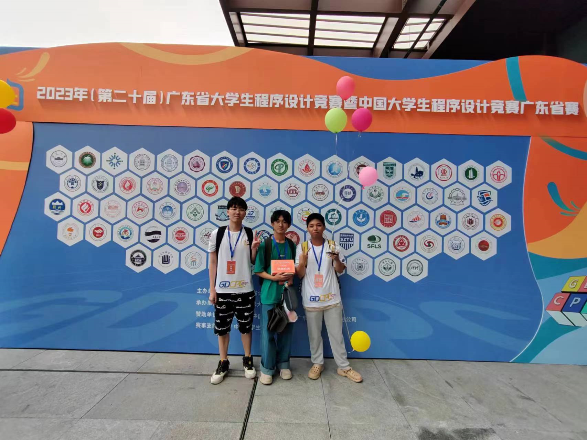

**2023 5月第二周**

日志：

1. 这个周末开始省赛， 保持状态全力准备。

-----

gdcpc银牌：

**codeforces**

动态规划：

1.  [E. Array Shrinking.md](..\..\problems\codeforces\2100\动态规划\线性dp\E. Array Shrinking.md) 
1.  [D. Jongmah.md](..\..\problems\codeforces\2200\动态规划\线性dp\D. Jongmah.md) 
1.  [H. Queries for Number of Palindromes.md](..\..\problems\codeforces\1800\动态规划\区间dp\H. Queries for Number of Palindromes.md) 
1.  [D2. Hot Start Up (hard version).md](..\..\problems\codeforces\2100\动态规划\优化\D2. Hot Start Up (hard version).md)  ==鸽子煮了==
1.   [E. Music Festival.md](..\..\problems\codeforces\1900\动态规划\数据结构优化dp\E. Music Festival.md) ==鸽子==

​	回文串与dp相结合：

1.  [B. Zuma.md](..\..\problems\codeforces\1900\动态规划\区间dp\B. Zuma.md) 

​	换根dp

1.  [D. Bear and Tree Jumps.md](..\..\problems\codeforces\2100\动态规划\树形dp\换根dp\D. Bear and Tree Jumps.md) 

**组合数学 ， 简单期望统计**

1.  [D2. LuoTianyi and the Floating Islands (Hard Version).md](..\..\problems\codeforces\2200\图论\树\D2. LuoTianyi and the Floating Islands (Hard Version).md) 
1.   [E. Combinatorics Problem.md](..\..\problems\codeforces\2000\数学\组合数学\E. Combinatorics Problem.md) 

**数据结构**

1. 势能分析：
   1.  [势能分析模型总结.md](..\..\Logrithm\数据结构\势能分析\势能分析模型总结.md) 
   2.  [D1. Balance .md](..\..\problems\codeforces\1400-1600\数据结构\势能分析\D1. Balance .md) 

**图论建模与构造**

1.  [D. Madoka and The Corruption Scheme.md](..\..\problems\codeforces\1900\图论建模\D. Madoka and The Corruption Scheme.md)  &&&
2.  [F. Build a Tree and That Is It.md](..\..\problems\codeforces\1900\构造\图论\F. Build a Tree and That Is It.md)

**二分**

1.  [D. New Year's Problem.md](..\..\problems\codeforces\1800\二分\D. New Year's Problem.md) 

**暴力美学**

1. 分块：
   1.  [E. Array Queries.md](..\..\problems\codeforces\2000\分块\E. Array Queries.md) 
2. 根号做法：
   1.  [B. The BOSS Can Count Pairs.md](..\..\problems\codeforces\2000\数学\枚举剪枝\B. The BOSS Can Count Pairs.md) 

#### 算法学习：

1. **数据结构：** 
   1. 扫描线 + 权值线段树： ==鸽子==
   2. 笛卡尔树 ==鸽子==
   3. 带权并查集 ==鸽子==
2. 字符串
   1. ==ac自动机==
3. 图论
   1.   [倍增与树.md](..\..\Logrithm\图论\树上问题\倍增与树.md) 
   1.    [dfs序.md](..\..\Logrithm\图论\树上问题\dfs序.md) 

