**2023 5月第二周**

日志：

1. 这个周末开始省赛， 保持状态全力准备。

-----

gdcpc银牌：


**codeforces**

动态规划：

1.  [E. Array Shrinking.md](..\..\problems\codeforces\2100\动态规划\线性dp\E. Array Shrinking.md) 
1.  [D. Jongmah.md](..\..\problems\codeforces\2200\动态规划\线性dp\D. Jongmah.md) 
1.  [H. Queries for Number of Palindromes.md](..\..\problems\codeforces\1800\动态规划\区间dp\H. Queries for Number of Palindromes.md) 
1.  [D2. Hot Start Up (hard version).md](..\..\problems\codeforces\2100\动态规划\优化\D2. Hot Start Up (hard version).md)  ==鸽子煮了==
1.  [E. Music Festival.md](..\..\problems\codeforces\1900\动态规划\数据结构优化dp\E. Music Festival.md) ==鸽子==

​	回文串与dp相结合：

1.  [B. Zuma.md](..\..\problems\codeforces\1900\动态规划\区间dp\B. Zuma.md) 

​	换根dp

1.  [D. Bear and Tree Jumps.md](..\..\problems\codeforces\2100\动态规划\树形dp\换根dp\D. Bear and Tree Jumps.md) 

**组合数学 ， 简单期望统计**

1.  [D2. LuoTianyi and the Floating Islands (Hard Version).md](..\..\problems\codeforces\2200\图论\树\D2. LuoTianyi and the Floating Islands (Hard Version).md) 
1.  [E. Combinatorics Problem.md](..\..\problems\codeforces\2000\数学\组合数学\E. Combinatorics Problem.md) 

**数据结构**

1. 势能分析：
   1.  [势能分析模型总结.md](..\..\Logrithm\数据结构\势能分析\势能分析模型总结.md) 
   2.  [D1. Balance .md](..\..\problems\codeforces\1400-1600\数据结构\势能分析\D1. Balance .md) 

**图论建模与构造**

1.  [D. Madoka and The Corruption Scheme.md](..\..\problems\codeforces\1900\图论建模\D. Madoka and The Corruption Scheme.md)  &&&
2.  [F. Build a Tree and That Is It.md](..\..\problems\codeforces\1900\构造\图论\F. Build a Tree and That Is It.md)

**二分**

1.  [D. New Year's Problem.md](..\..\problems\codeforces\1800\二分\D. New Year's Problem.md) 

**暴力美学**

1. 分块：
   1.  [E. Array Queries.md](..\..\problems\codeforces\2000\分块\E. Array Queries.md) 
2. 根号做法：
   1.  [B. The BOSS Can Count Pairs.md](..\..\problems\codeforces\2000\数学\枚举剪枝\B. The BOSS Can Count Pairs.md) 


#### 算法学习：

1. **数据结构：** 
   1. 扫描线 + 权值线段树： ==鸽子==
   2. 笛卡尔树 ==鸽子==
   3. 带权并查集 ==鸽子==
2. 字符串
   1. ==ac自动机==
3. 图论
   1.   [倍增与树.md](..\..\Logrithm\图论\树上问题\倍增与树.md) 
   1.   [dfs序.md](..\..\Logrithm\图论\树上问题\dfs序.md) 

-------------


**E. Array Shrinking**
https://codeforces.com/contest/1312/problem/E

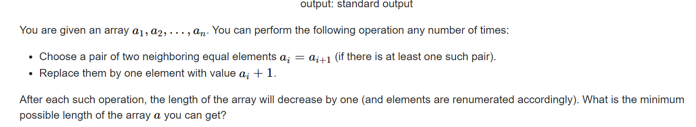


#### solve

区间动态规划：
对于一些列的操作： 都是基于一个区间内进行的： 最后的一步 可以看成是两个区间的合并。符合区间dp的特征；

**状态定义：**

$f_{l , r}$表示 l  到   r执行一系列操作后的最小长度。

$w_{l , r}$ 表示区间 l  到   r  执行一系列的操作如果为1 ， 其值的大小（显然如果能够合成一种 ， 无论何种方式  ， 最终的大小都是固定的。）

**转移方程：**
$$
if(f_{l , mid} == 1 \&\& f_{mid + 1 , r} == 1 \&\& w_{l , mid} == w_{mid + 1 , r})\\
f_{l , r} = 1 , w_{l , r} = w_l{l , mid} + 1;\\
else \\
f_{l ,r} = max(f_{l , r} , f_{l , mid} + f_{mid + 1 , r} )\\
$$
**初始化：**

特殊的处理前几项即可；

#### code

```cpp
const int  N  = 510;
int a[N] , f[N][N] , w[N][N];
signed main()
{
	ios::sync_with_stdio(false);
	cin.tie(0);
	int n;
	cin >> n;
	for (int i = 1; i <= n; i++)
		cin >> a[i];
	memset(f , 0x3f , sizeof f);
	for (int i = 1; i <= n; i++) {
		f[i][i] = 1;
		w[i][i] = a[i];
	}
	for (int len = 2; len <= n; len++)
		for (int l = 1; l + len - 1 <= n; l++) {
			int r = l + len - 1;
			for (int m = l; m < r; m++) {
				if (f[l][m] == 1 && f[m + 1][r] == 1 && w[l][m] == w[m + 1][r]) {
					f[l][r] = 1;
					w[l][r] = w[l][m] + 1;
					break;
				} else {
					f[l][r] = min(f[l][r] , f[l][m] + f[m + 1][r]);
				}
			}
		}
	cout << f[1][n] << "\n";
}
```

-----

**D. Jongmah**
https://codeforces.com/contest/1110/problem/D

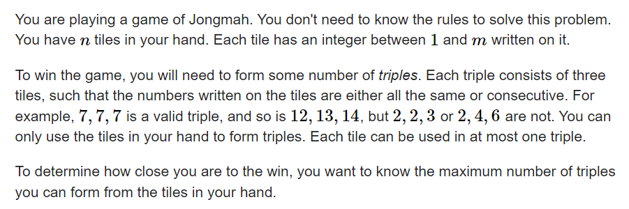

#### solve

1. 首先对解集做一个优化：如果解集中同时存在：

   ```
   i i + 1 i + 2
   i i + 1 i + 2
   i i + 1 i + 2
   ```

   那么可以转换为

   ```txt
   i i i 
   i + 1 i + 1 i + 1
   i + 2 i + 2 i + 2
   ```

   这样不妨对解集做一个等效变化 ， 连续的三个数字同类三元组不存在。

**状态设计：**

$f_{i , j , k}$ 表示：考虑前 i 项： 包含 j 个(i - 1 ,   i    , i + 1) , k 个 （i , i + 1 , i + 2）元组的最大元组数。

**状态转移：**

枚举小的$f_{i - 1 , j , k}$ 更新：$f_{i , k , l}$ 其中l也参与枚举。

**初始化：**

$f_{0 , 0 , 0} = 0$

#### 生长思考：

1. 解集优化， 可以减少记录的解的特征， 有利于状态的设计。

#### code

```cpp
const int N = 1E6 + 10;
int sum[N];
int f[N][3][3];
signed main()
{
	ios::sync_with_stdio(false);
	cin.tie(0);
	int n , m; cin >> n >> m;
	for (int i = 0; i < n; i++) {
		int x; cin >> x;
		sum[x] ++;
	}
	memset(f , 0x88 , sizeof f);
	f[0][0][0] = 0;
	for (int i = 1; i <= m; i++)
		for (int j = 0; j < 3; j++)
			for (int k = 0; k < 3; k++) {
				for (int l = 0; l < 3; l++) {
					if (j + k + l > sum[i])continue;
					f[i][k][l] = max(f[i][k][l] , f[i - 1][j][k] + l + (sum[i] - j - k - l) / 3);
				}
			}
	cout << f[m][0][0] << "\n";
}
```

----

**H. Queries for Number of Palindromes**
https://codeforces.com/problemset/problem/245/H

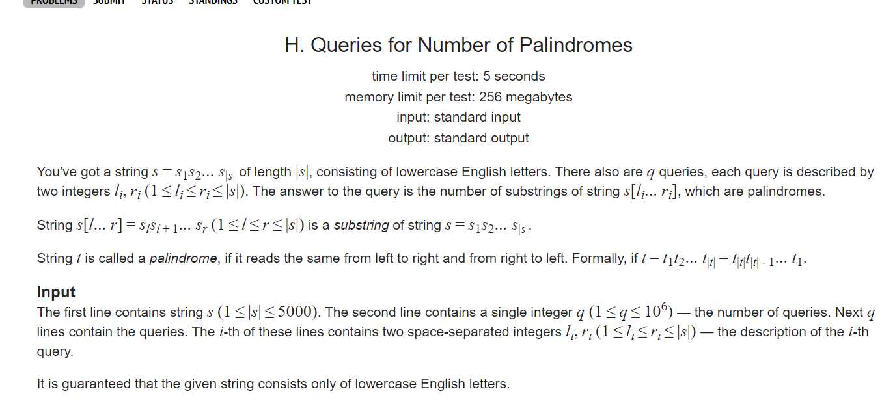


#### solve

1. 范围比较小： 考虑区间信息记录： 区间内的回文串个数： 并不好处理由于新入端点： 探究这个点带来的影响 ， 就要探究其串内部的结构情况。

正解： 

**状态设计**

$f_{l , r}$区间l   ,  r 这一段子串是否为一个回文串： 如果是为1  ， 否则为0；

**状态转移方程**

比较简单， 略， 看代码。

**计算答案**

1. 二维前缀和，
2. 求出固定的区间段内的回文串总数。

#### 生长：

1. 这个角度思路 ， 比较陌生 如上就是有两步主要的思维跳跃 ； 归类为： 
   1. 找出有限的贡献元素。（所有的回文串）
   2. 前缀和维护 。

#### code

```cpp
const int inf = 1 << 29;
const ll INF = 1LL << 60;
const int N = 5000 + 10;

int f[N][N];

signed main()
{
	ios::sync_with_stdio(false);
	cin.tie(0);
	string s;
	cin >> s;
	int n = sz(s);
	s = ' ' + s;
	for (int i = 1; i <= n; i++) {
		for (int l = 1; l + i - 1 <= n; l++) {
			int r = l + i - 1;
			if (l == r) {f[l][r] = 1; continue;}
			if (l == r - 1) {f[l][r] = s[l] == s[r]; continue;}
			if (s[l] == s[r]) f[l][r] = f[l + 1][r - 1];
			else f[l][r] = 0;
		}
	}
	// for (int i = 1; i <= n; i++)
	// 	for (int j = 1; j <= n; j++) {
	// 		cout << f[i][j] << " \n"[j == n];
	// 	}
	for (int i = 1; i <= n; i++)
		for (int j = 1; j <= n; j++) {
			f[i][j] += f[i - 1][j] + f[i][j - 1] - f[i - 1][j - 1];
		}
	int t;
	cin >> t;
	while (t -- ) {
		int l , r;
		cin >> l >> r;
		cout << f[r][r] - f[r][l - 1] - f[l - 1][r] + f[l - 1][l - 1] << "\n";
	}
}
```

----

**D2. Hot Start Up (hard version)**
https://codeforces.com/contest/1799/problem/D2

[Problem - D2 - Codeforces](https://codeforces.com/contest/1799/problem/D2)

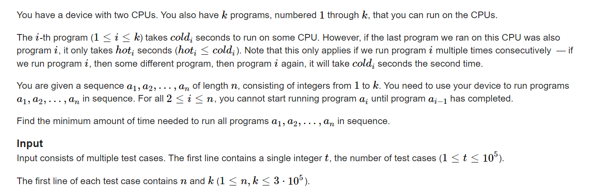

#### solve

1. ==**第一角度：**==

   1. **状态定义** : 

      $f_{k,i ,j}$ 表示处理完前k个程序， 当前两个cpu上一个运行的程序分别为： i ， j。其最小价值。

   2. **状态转移方程：**

      在上述状态下 ： 显然是暴力猜的$N\times K^2$


   ##### 优化一

   1. **状态优化**

      分析冗余， 抽出有有意义的状态： 按顺序执行完程序之后，上一个有效的状态中必定有一个cpu是运行了a[i - 1]的。并且由于$f_{i,j}=f_{j ,i}$， 于是我们可以优化掉一个维度：

   2. **状态转移方程优化：**

      概念定义：

      ```latex
      X :  a[i]
      Y :  a[i - 1]
      f[i] : 指标函数的解
      nf[i] : 滚动数组优化， 上一个阶段的指标函数的解。
      cold[i] , hot[i]  题意
      
      下方的下标i显然指的是连续的 0 ... k。
      ```

      $$
      if(X= Y)\\
      f_i = min(f_i  ,  nf_i + hot_x)\\
      f_x = min(f_x , nf_i + cold_x)
      $$


      $$
      if(X\ne Y)\\
      f_i = min(f_i , nf_i + cold_x)\\
      f_y = min(f_y , nf_i + cold_x)\\
      f_y = min(f_y , nf_x + hot_x)
      $$

2. 

##### 优化2 ：

1. 方程上的优化： 

   1. 是否可以简化： 可以对max ， min运算做一个界的收缩？

      观察发现

      1. （1）中$f_x$ 的优化式子可以删除。

2. 处理转移上的优化：

   1. 上述就是简单的区间加 ， 单点修改 ， 区间最小值查询的操作。直接用单调栈维护即可。

##### 优化3 ：

 发现是全局的区间加：维护的信息是非常朴素的。于是维护这些信息， 可以适时还原。

另外： 每一个阶段 ，几个元素之间的相对关系变化不大；如果a[i] != a[i - 1] ， 更新最小值 ， 只需要关注一个元素。

参考题解为： https://www.luogu.com.cn/blog/CGY/solution-cf1799d2


==**第二角度**==  ~~出错了~~

首先按照常规的方法处理完所有的值： 其花费是： $\sum cold[a_i]$

然后考虑让hot情况出现的次数尽量小：

1. 考虑让某两个元素在同一个cpu中相遇： 这意味着，i + 1  ..... j  - 1中的元素要在同一个cpu中运行：
2. 特殊的 ： 相邻相连同值得元素做特殊处理：

**状态定义：**
$f_{i}$表示i之前单独处理连线的最大贡献。

**状态转移方程：**

首先贪心的选择更短的边：
$$
考虑当前是否向之前连边：\\
f_{i} = max(f_{i - 1}, f_{pre_i} + cold_i-hot_i)
$$


hack

```in
input : 
1
5 3
1 3 2 1 2
2 2 2
1 1 1

output :
8
```

相似的思想： 参考该篇题解：

https://www.cnblogs.com/legendstane/p/codeforces-round-854-cybercats-cf-1799-a-b-c-d1-d2-e-f-g-solution.html

**和上述角度的不同之处**

1. 特殊处理了相邻相同点的情况。
2. 正推角度下的状态转移方程。
3. 贡献计算中的一个容斥角度：

#### 朴素写法：面对简单版本的问题：

```cpp
int a[N] , cold[N] , hot[N];
void work(int testNo)
{
	int n , k;
	cin >> n >> k;
	for (int i = 1; i <= n; i++)
		cin >> a[i];
	for (int i = 1; i <= k; i++) cin >> cold[i];
	for (int i = 1; i <= k; i++) cin >> hot[i];
	vector<ll> dp(k + 1, INF);
	dp[0] = 0;
	// 关于对称性的问题：
	for (int j = 1; j <= n; j++) {
		auto ndp = dp;
		dp = vector<ll> (k + 1 , INF);
		int x = a[j] , y = a[j - 1];;
		if (x == y) {
			for (int i = 0; i <= k; i++) {
				dp[i] = min(ndp[i] + hot[x] , dp[i]);
			}
			for (int i = 0; i <= k; i++) {
				if (i != x) dp[x] = min(dp[x] , ndp[i] + cold[x]);
			}

		} else {
			for (int i = 0; i <= k; i++) {
				dp[i] = min(dp[i] , ndp[i] + cold[x]);
			}
			for (int i = 0; i <= k; i++) {
				dp[y] = min(dp[y] , ndp[i] + cold[x]);
			}
			dp[y] = min(dp[y] , ndp[x] + hot[x]);
		}
	}
	cout << *min_element(dp.begin() , dp.end()) << "\n";
}
signed main()
{
	ios::sync_with_stdio(false);
	cin.tie(0);

	int t; cin >> t;
	for (int i = 1; i <= t; i++)work(i);
}
```


#### 第二个角度code

```cpp
int pre[N] , pos[N],  a[N];
ll f[N] , hot[N] , cold[N] , val[N];
void work(int testNo)
{
	int n , k;
	cin >> n >> k;
	vector<vector<int>> pos(k + 1);
	for (int i = 1; i <= n; i++) {
		cin >> a[i];
		pos[a[i]].push_back(i);
	}
	for (int i = 1; i <= k; i++)
		cin >> cold[i];
	for (int i = 1; i <= k; i++)
		cin >> hot[i];

	vector<vector<pair<int , int>>> line (n + 1);
	ll addr = 0;
	for (int i = 1; i <= k; i++)
		for (int j = 1; j < sz(pos[i]); j++) {
			if (pos[i][j] == pos[i][j - 1] + 1) {addr += cold[i] - hot[i]; continue;};
			line[pos[i][j - 1] + 1].push_back(make_pair(pos[i][j] - 1 , cold[i] - hot[i]));
		}
	vector<ll>f(n + 1 , 0);
	ll res = 0;
	for (int i = 1; i <= n; i++) {
		res += cold[a[i]];
		f[i] = max(f[i - 1] , f[i]);
		for (auto [x , y] : line[i]) {
			f[x + 1] = max(f[x + 1] , f[i] + y);
		}
	}
	cout << res - f[n] - addr << "\n";
}
signed main()
{
	ios::sync_with_stdio(false);
	cin.tie(0);

	int t; cin >> t;
	for (int i = 1; i <= t; i++)work(i);
}

/* stuff you should look for
* int overflow, array bounds
* special cases (n=1?)
* do smth instead of nothing and stay organized
* WRITE STUFF DOWN
* DON'T GET STUCK ON ONE APPROACH
*/

/*
1
5 3
1 3 2 1 2
2 2 2
1 1 1
*/
```

#### 维护全局离线加法

```cpp\
#include<bits/stdc++.h>
using namespace std;

using ll = long long;
using i64 = long long;
using ull = unsigned long long;
using ld = long double;
using uint = unsigned int;
using pii = pair<int , int>;
using pli = pair<ll , int>;
using pll = pair<ll , ll>;


#define dbg(x) cerr << "[" << __LINE__ << "]" << ": " << x << "\n"

#define all(x) (x).begin(),(x).end()
#define sz(x) (int)(x).size()
#define pb push_back
#define fi first
#define se second

const int inf = 1 << 29;
const ll INF = 1LL << 59;
const int N = 1E6 + 10;

int a[N];
ll  hot[N] , cold[N];

void work(int testNo)
{
	int n , k;
	cin >> n >> k;
	for (int i = 1; i <= n; i++) {
		cin >> a[i];
	}
	for (int i = 1; i <= k; i++)
		cin >> cold[i];
	for (int i = 1; i <= k; i++)
		cin >> hot[i];
	ll add = 0 , mi = 0;
	vector<ll> f(k + 1 , INF);
	f[0] = 0;
	for (int i = 1; i <= n; i++) {
		int x = a[i] , y = a[i - 1];

		if (x == y)
			add += hot[x];
		else {
			add += cold[x];
			f[y] = min(mi + cold[x] , f[x] + hot[x]) - cold[x];
			mi = min(mi , f[y]);
		}
	}
	cout << mi + add << "\n";
}
signed main()
{
	ios::sync_with_stdio(false);
	cin.tie(0);

	int t; cin >> t;
	for (int i = 1; i <= t; i++)work(i);
}

/* stuff you should look for
* int overflow, array bounds
* special cases (n=1?)
* do smth instead of nothing and stay organized
* WRITE STUFF DOWN
* DON'T GET STUCK ON ONE APPROACH
*/

/*
1
5 3
1 3 2 1 2
2 2 2
1 1 1
*/
```

#### code 线段树优化：

```cpp
#include<bits/stdc++.h>
using namespace std;

using ll = long long;
using i64 = long long;
using ull = unsigned long long;
using ld = long double;
using uint = unsigned int;
using pii = pair<int , int>;
using pli = pair<ll , int>;
using pll = pair<ll , ll>;


#define dbg(x) cerr << "[" << __LINE__ << "]" << ": " << x << "\n"

#define all(x) (x).begin(),(x).end()
#define sz(x) (int)(x).size()
#define pb push_back
#define fi first
#define se second

const int inf = 1 << 29;
const ll INF = 1LL << 50;
const int N = 1E6 + 10;

int id[N];
ll  hot[N] , cold[N];

// 于是现在写一颗维护两种信息的线段树
// 维护区间。
// 维护单点修改
// 维护单点查询最小值。
// 维护单点修改：
//const int N = 201000;
//const ll mod = 1000000007;
int a[N];
ll f[N];

struct tag {
	// 区间加法
	ll add;
};
struct info {
	ll mi;
	ll sum;
};
//标记合并。用于updatetag

//节点的内容。数据项以及内容。
//如果维护信息比较复杂。也可以考虑将信息封装。并且如上写一个区间信息合并重载函数。
struct node {
	ll add;
	info val;
	int sz;
} seg[N * 4];

// [l, r]

//在modify以及建树之后。把两个儿子的信息合并。
void update(int id) {
	seg[id].val.sum = seg[id * 2].val.sum + seg[id * 2 + 1].val.sum;
	seg[id].val.mi = min(seg[id * 2].val.mi , seg[id * 2 + 1].val.mi);
}
//push down。
//完成两项东西。合并标记。
//修改区间信息。
void settag(int id, ll t) {
	seg[id].add += t;
	seg[id].val.sum += seg[id].sz * t;
	seg[id].val.mi += t;
}
//记得将下放后将标记初始化。
void pushdown(int id) {
	if (seg[id].add != 0) { // 标记非空
		settag(id * 2, seg[id].add);
		settag(id * 2 + 1, seg[id].add);
		seg[id].add = 0;
	}
}

//建树。记得建完之后update.
//以及到达终点时，将节点信息修正。
void build(int id, int l, int r) {
	seg[id].add = {0};
	seg[id].sz = r - l + 1;
	if (l == r) {
		seg[id].val = {f[l] , f[l]};
	} else {
		int mid = (l + r) / 2;
		build(id * 2, l, mid);
		build(id * 2 + 1, mid + 1, r);
		update(id);
	}
}

// 节点为id，对应的区间为[l, r]，修改a[pos] -> val
//记得update
//正确sertag
void modify(int id, int l, int r, int ql, int qr, ll t) {
	if (l == ql && r == qr) {
		settag(id, t);
		return;
	}
	int mid = (l + r) / 2;
	// 重要‼️
	pushdown(id);
	if (qr <= mid) modify(id * 2, l, mid, ql, qr, t);
	else if (ql > mid) modify(id * 2 + 1, mid + 1, r, ql, qr, t);
	else {
		modify(id * 2, l, mid, ql, mid, t);
		modify(id * 2 + 1, mid + 1, r, mid + 1, qr, t);
	}
	// 重要‼️
	update(id);
}
// [ql, qr]表示查询的区间
//到达终点时及时返回。
ll query_mi(int id, int l, int r, int ql, int qr) {
	if (l == ql && r == qr) return seg[id].val.mi;
	int mid = (l + r) / 2;
	// 重要‼️
	pushdown(id);
	if (qr <= mid) return query_mi(id * 2, l, mid, ql, qr);
	else if (ql > mid) return query_mi(id * 2 + 1, mid + 1, r, ql, qr);
	else {
		// qr > mid, ql <= mid
		// [ql, mid], [mid + 1, qr]
		return min(query_mi(id * 2, l, mid, ql, mid) ,
		           query_mi(id * 2 + 1, mid + 1, r, mid + 1, qr));
	}
}
ll query(int id, int l, int r, int ql, int qr) {
	if (l == ql && r == qr) return seg[id].val.sum;
	int mid = (l + r) / 2;
	// 重要‼️
	pushdown(id);
	if (qr <= mid) return query(id * 2, l, mid, ql, qr);
	else if (ql > mid) return query(id * 2 + 1, mid + 1, r, ql, qr);
	else {
		// qr > mid, ql <= mid
		// [ql, mid], [mid + 1, qr]
		return query(id * 2, l, mid, ql, mid) +
		       query(id * 2 + 1, mid + 1, r, mid + 1, qr);
	}
}
/*
1. 该代码处理问题：同时维护区间加，区间改变，区间乘法三种操作。
2. 调整过程
维护信息 -> build -> updata -> 区间信息合并函数
tag - > modify  -> push_down  ->  settag
query -> 返回类型，修改内容 , 信息合并。
*/

void work(int testNo)
{
	int n , k;
	cin >> n >> k;
	for (int i = 1; i <= n; i++) {
		cin >> id[i];
	}
	for (int i = 1; i <= k; i++)
		cin >> cold[i];
	for (int i = 1; i <= k; i++)
		cin >> hot[i];
	fill(f + 1 , f + k + 1 , INF);
	// 1. 0位置怎么维护？
	build(1 , 0 , k);
	// modify(1, 0 , k , 0 , k , 100);
	// cout << query(1 , 0 , k , k , k) << "\n";
	for (int i = 1; i <= n; i++) {
		int x = id[i] , y = id[i - 1];
		if (x == y) {
			modify(1 , 0 , k , 0 , k , hot[x]);
		} else {
			// 注意操作的顺序，防止丢失更小规模的解。
			ll Y = query_mi(1 , 0 , k , 0 , k) + cold[x];
			Y = min(Y , query(1 , 0 , k , x , x) + hot[x]);
			modify(1 , 0 , k , 0 , k , cold[x]);
			ll temp = query(1 , 0 , k , y , y);
			// cout << Y << "\n";
			// cout << temp << "\n";
			modify(1 , 0 , k , y , y , Y - temp);
		}
	}
	// for (int i = 0; i <= k; i++) {
	// 	cout << query(1, 0 , k , i , i) << " \n"[i == k];
	// }
	// for (int i = 0; i <= k; i++) {
	// 	cout << query_mi(1 , 0 , k , i , i) << " \n"[i == k];
	// }
	cout << query_mi(1 , 0 , k , 0 , k) << "\n";
}

signed main()
{
	ios::sync_with_stdio(false);
	cin.tie(0);

	int t; cin >> t;
	for (int i = 1; i <= t; i++)work(i);
}
/* stuff you should look for
* int overflow, array bounds
* special cases (n=1?)
* do smth instead of nothing and stay organized
* WRITE STUFF DOWN
* DON'T GET STUCK ON ONE APPROACH
*/
/*
1
5 3
1 3 2 1 2
2 2 2
1 1 1
*/
```

-----

**E. Music Festival**
https://codeforces.com/contest/1802/problem/E

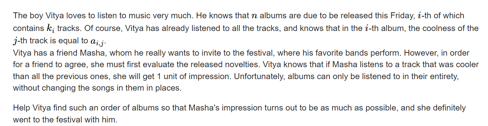

将若干个数列拼接， 找出作为前缀严格最大值的元素个数；

参考题解：


#### solve

1. 最暴力的做法：

   1. 即使考虑第i位元素， 枚举新的元素时 ， 也要考虑前缀的具体情况。

2. 观察出一些现象：

   1. 考虑一个数组序列的贡献情形。

      1. 发现产生贡献的是升序序列的子序列：如下：

      ```txt
      1 4 3 5 6 7 3
      - >  1 4 5 6 7
      ```

   2. 将上述的所有可能贡献序列整理成一个集合， 并且对其进行一个依据$r_i$的大小进行排序；

      1. 对于任意的组合 ， 我们拼接在一些方案上 ： 关注两个属性：
         1. 新拼接上的数组贡献了多少。
         2. 确定上述1贡献的具体大小之后 ， 其贡献如何？

**状态定义：**

$f_i:$ 表示以i为结尾的序列中的最大贡献;

**状态转移：**

1. 枚举前缀贡献。 确定其关注序列结尾的取值范围；求一个前缀最大值。
2. 上述要求我们子问题已经求出。因此，需要对r做一个排序。其更小的back。 的子问题已经求出。

**实现**

1. 树状数组维护即可。
2. 由于值域比较大。采取面向元素的初始化方式。

#### code

```cpp
#include<bits/stdc++.h>
using namespace std;

using ll = long long;
using i64 = long long;
using ull = unsigned long long;
using ld = long double;
using uint = unsigned int;
using pii = pair<int , int>;
using pli = pair<ll , int>;
using pll = pair<ll , ll>;


#define dbg(x) cerr << "[" << __LINE__ << "]" << ": " << x << "\n"

#define all(x) (x).begin(),(x).end()
#define sz(x) (int)(x).size()
#define pb push_back
#define fi first
#define se second

const int inf = 1 << 29;
const ll INF = 1LL << 60;
const int N = 2E5 + 10;

int c[N];
int n;
void modify(int x , int d) {
	for (; x < N; x += x & -x)
		c[x] = max(c[x] , d);
}

int query(int x) {
	int res = 0;
	for (; x; x -= x & -x)
		res = max(res , c[x]);
	return res;
}
void clear(int x) {
	for (; x < N; x += x & -x)
		c[x] = 0;
}
// 其作用是记录以某个值为结尾最小值的个数。
// 当其作为最小值之后，其余后边的贡献都将是0.

void work(int testNo)
{
	int n;
	cin >> n;
	vector<vector<int>> rec(n);
	for (int i = 0; i < n; i++) {
		int  m;
		cin >> m;
		int mx = 0;
		for (int j = 0; j < m; j++) {
			int x; cin >> x;
			if (x > mx) {
				mx = x;
				rec[i].push_back(mx);
			}
		}
	}
	sort(rec.begin() , rec.end() , [&](vector<int>& a , vector<int> & b) {
		return a.back() < b.back();
	});
	int ans = 0;
	for (int i = 0; i < n; i ++) {
		int mx = 0;
		for (int j = 0; j < (int)rec[i].size(); j++) {
			// 当前枚举项为贡献多少项。
			mx = max(mx , query(rec[i][j] - 1) + (int)rec[i].size() - j);
			ans = max(ans , mx);
		}
		modify(rec[i].back() , mx);
	}
	for (int i = 0; i < n; i++) {
		clear(rec[i].back());
	}
	cout << ans << "\n";
}
signed main()
{
	ios::sync_with_stdio(false);
	cin.tie(0);

	int t; cin >> t;
	for (int i = 1; i <= t; i++)work(i);
}
/* stuff you should look for
* int overflow, array bounds
* special cases (n=1?)
* do smth instead of nothing and stay organized
* WRITE STUFF DOWN
* DON'T GET STUCK ON ONE APPROACH
*/
```

----

**B. Zuma**
https://codeforces.com/contest/607/problem/B

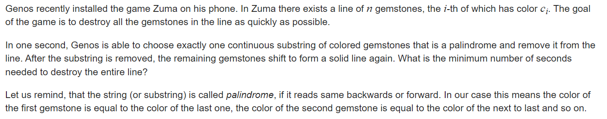

#### solve

考察操作一个区间内的解：发现总共有几种操作空间：

1. 一整个消除：（区间本身就是回文串：）
2. 分开消除：
   1. 首尾不同 ， 所有有效的解必然都是看作分成两个区间进行操作。每次操作看作一些连续的块： 最后一步的区间的边界为界限：
      1. 可以看出两部分的块是独立的： 
      2. 由于首尾不同 ， 不能够整只区间移除
   2. 首尾相同： 
      1. 相比于普通区间的操作方向更多：
         1. 普通变成两个区间的处理 ；如上2.1：
         2. 在  $dp_{l + 1 , r- 1}$的最优方案下 ， 溢出最后一个区间时， 顺便打包首尾。

**状态定义：**

$f_{low , high}$ 表示 ， 移除区间 [low , high]的回文串的最小操作次数。

**状态转移：**

1. $s_{low} \ne s_{high}$  : $f_{low , high} = MIN_{mid = low}^{high - 1}(f_{low , mid} + f_{mid+ 1 , high})$
2. $s_{low} = s_{high} : $ 
   1. $f_{low , high} = MIN_{mid = low} ^{high - 1}(f_{low , mid} + f_{mid + 1 , high})$
   2. $f_{low , high} = MIN(f_{low , high} , f_{low + 1 , high - 1})$

**初始化：**

1. $f_{low , low} = 1 $
2. $if(s_{low} \ne s_{low+ 1})f_{low , low + 1} = 1$

#### code

```cpp
const int inf = 1 << 29;
const ll INF = 1LL << 60;
const int N = 1010;
int f[N][N];
int a[N];

signed main()
{
	ios::sync_with_stdio(false);
	cin.tie(0);
	int n; cin >> n;
	for (int i = 1; i <= n; i++) {
		cin >> a[i];
	}
	memset(f , 0x3f , sizeof f);
	for (int len = 1; len <= n; len++)
		for (int l = 1; l + len - 1 <= n; l++) {
			int r = l + len - 1;
			if (len == 1) {f[l][r] = 1; continue;}
			if (len == 2) {f[l][r] = 1 + (a[l] != a[r]); continue;}
			if (a[l] == a[r]) {f[l][r] = f[l + 1][r - 1];}
			for (int mid = l; mid < r; mid++)
				f[l][r] = min(f[l][r] , f[l][mid] + f[mid + 1][r]);
		}
	cout << f[1][n] << "\n";
}
```

----

**D2. LuoTianyi and the Floating Islands (Hard Version)**
https://codeforces.com/contest/1825/problem/D2

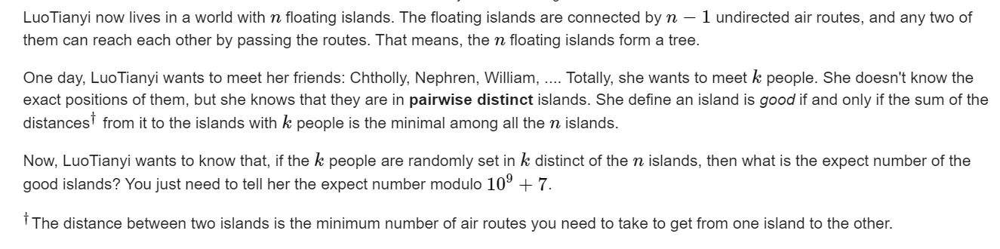


#### solve

切入角度：

1. 考虑每一个点在所有方案中作为好点的贡献次数：

发现一些现象 ： 

1. 当k为奇数时 ， 对于任意方案 ， 好点的个数有且仅有一个。

   1. 该问题的证明 ： 假设有一个好点， 那么其对于所有点的距离和最小， 假设其向一条边挪动 ， 必然是某一些数目的点与该点的距离＋1 ， 某一些数目的点与该点的距离减少1。距离增加的点必然比距离减少的点更好， 否则矛盾。递推可以证明除非返回原点， 否则距离将不变或者减少。（以某条边为分界线。）
   2. 此时好点的贡献之和 ， 等于方案总数。于是最终的期望大小为1。

2. 当k为偶数时 , 统计方案是 ， 枚举一个点， 枚举其作为好点的方案数， 以一条边为分界： 好点分布与两条边内外划分出的两个子图。该点贡献为： 
   $$
   sum = (_{size_u}^{k/2})*(_{n - size_u}^{k/2})
   $$

#### 生长思考

1. 期望贡献的统计策略：
   1. 现象： 点在方案中的出现次数 ， 产生贡献。于是可以从点的角度出发来枚举一个点， 整体上的贡献情况。

#### code

```cpp
#include<bits/stdc++.h>
using namespace std;
using ll = long long;
using i64 = long long;
using ull = unsigned long long;
using ld = long double;
using uint = unsigned int;
using pii = pair<int, int>;
using pli = pair<ll, int>;
using pll = pair<ll, ll>;
#define dbg(x) cerr << "[" << __LINE__ << "]" << ": " << x << "\n"
#define all(x) (x).begin(),(x).end()
// #define sz(x) (int)(x).size()
#define pb push_back
#define fi first
#define se second
const int mod = 1E9 + 7;
const int inf = 1 << 29;
const ll INF = 1LL << 60;
const int N = 1E6 + 10;
const int N_c = 2E5 + 10;
int fac[N_c], infac[N_c];
ll quickly_pow(ll x, ll n, ll p)
{
	ll res = 1;
	while (n > 0)
	{
		if (n & 1)res = res * x % p;
		x = x * x % p;
		n >>= 1;
	}
	return res;
}
void init() {
	fac[0] = infac[0] = 1;
	for (int i = 1; i < N_c; i++)
	{
		fac[i] = 1LL * fac[i - 1] * i % mod;
		infac[i] = 1LL * infac[i - 1] * quickly_pow(i, mod - 2, mod) % mod;
	}
}
ll c(int a, int b) {
	if (a  == 0 || a < b) return 0 ;
	return 1LL * fac[a] * infac[b] % mod * infac[a - b] % mod;
}
/*
*记得初始化。
*/
int  n, k;
vector<int> g[N];
ll ans = 0;
int sz[N];
void dfs(int u, int fa) {
	sz[u] = 1;
	for (auto v : g[u]) {
		if (v != fa) {
			dfs(v, u);
			sz[u] += sz[v];
		}
	}
}
signed main()
{
	ios::sync_with_stdio(false);
	cin.tie(0);
	cin >> n >> k;
	init();
	for (int i = 1; i < n; i++) {
		int u, v;
		cin >> u >> v;
		g[u].push_back(v);
		g[v].push_back(u);
	}
	dfs(1, 0);
	if (k % 2 == 1) {
		cout << 1 << "\n";
		return 0;
	} else {
		for (int i = 2; i <= n; i++) {
			ans += 1LL * c(sz[i] , k / 2) * c(n - sz[i] , k / 2);
			ans %= mod;
		}
		ans *= quickly_pow(c(n , k ) , mod - 2 , mod) ;
		ans = (ans + 1 ) % mod;
	}
	cout << ans << "\n";
}
```

----

**E. Combinatorics Problem**
https://codeforces.com/contest/1832/problem/E

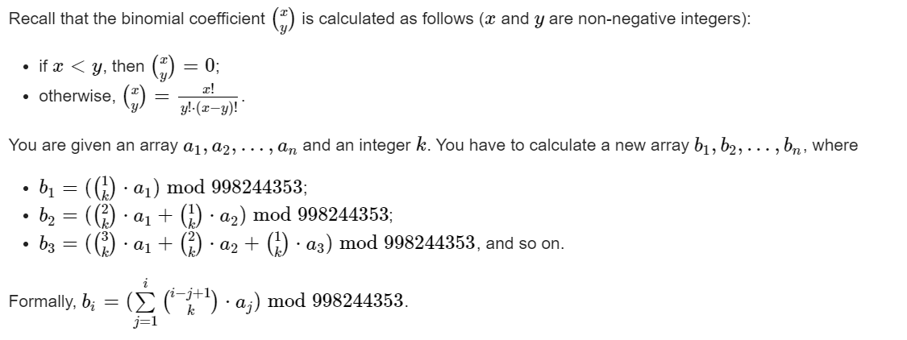

#### solve

$$b_i默认为b_{k,i}$$
$$
b_i = \sum_{j=1}^{i}(_{k}^{i-j + 1})*a_j\\
=\sum_{j=1}^{i}((_{k}^{i-j}) + (_{k-1}^{i-j}))*a_j\\
=b_{i-1} + b_{k-1, j-1}
$$
处理边界问题：


#### code

```cpp
template <typename T>
T inverse(T a, T m) {
	T u = 0, v = 1;
	while (a != 0) {
		T t = m / a;
		m -= t * a; swap(a, m);
		u -= t * v; swap(u, v);
	}
	assert(m == 1);
	return u;
}
template <typename T>
class Modular {
public:
	using Type = typename decay<decltype(T::value)>::type;

	constexpr Modular() : value() {}
	template <typename U>
	Modular(const U& x) {
		value = normalize(x);
	}

	template <typename U>
	static Type normalize(const U& x) {
		Type v;
		if (-mod() <= x && x < mod()) v = static_cast<Type>(x);
		else v = static_cast<Type>(x % mod());
		if (v < 0) v += mod();
		return v;
	}

	const Type& operator()() const { return value; }
	template <typename U>
	explicit operator U() const { return static_cast<U>(value); }
	constexpr static Type mod() { return T::value; }

	Modular& operator+=(const Modular& other) { if ((value += other.value) >= mod()) value -= mod(); return *this; }
	Modular& operator-=(const Modular& other) { if ((value -= other.value) < 0) value += mod(); return *this; }
	template <typename U> Modular& operator+=(const U& other) { return *this += Modular(other); }
	template <typename U> Modular& operator-=(const U& other) { return *this -= Modular(other); }
	Modular& operator++() { return *this += 1; }
	Modular& operator--() { return *this -= 1; }
	Modular operator++(int) { Modular result(*this); *this += 1; return result; }
	Modular operator--(int) { Modular result(*this); *this -= 1; return result; }
	Modular operator-() const { return Modular(-value); }

	template <typename U = T>
	typename enable_if<is_same<typename Modular<U>::Type, int>::value, Modular>::type & operator*=(const Modular& rhs) {
#ifdef _WIN32
		uint64_t x = static_cast<int64_t>(value) * static_cast<int64_t>(rhs.value);
		uint32_t xh = static_cast<uint32_t>(x >> 32), xl = static_cast<uint32_t>(x), d, m;
		asm(
		    "divl %4; \n\t"
		    : "=a" (d), "=d" (m)
		    : "d" (xh), "a" (xl), "r" (mod())
		);
		value = m;
#else
		value = normalize(static_cast<int64_t>(value) * static_cast<int64_t>(rhs.value));
#endif
		return *this;
	}
	template <typename U = T>
	typename enable_if<is_same<typename Modular<U>::Type, long long>::value, Modular>::type & operator*=(const Modular& rhs) {
		long long q = static_cast<long long>(static_cast<long double>(value) * rhs.value / mod());
		value = normalize(value * rhs.value - q * mod());
		return *this;
	}
	template <typename U = T>
	typename enable_if < !is_integral<typename Modular<U>::Type>::value, Modular >::type & operator*=(const Modular& rhs) {
		value = normalize(value * rhs.value);
		return *this;
	}

	Modular& operator/=(const Modular& other) { return *this *= Modular(inverse(other.value, mod())); }

	friend const Type& abs(const Modular& x) { return x.value; }

	template <typename U>
	friend bool operator==(const Modular<U>& lhs, const Modular<U>& rhs);

	template <typename U>
	friend bool operator<(const Modular<U>& lhs, const Modular<U>& rhs);

	template <typename V, typename U>
	friend V& operator>>(V& stream, Modular<U>& number);

private:
	Type value;
};

template <typename T> bool operator==(const Modular<T>& lhs, const Modular<T>& rhs) { return lhs.value == rhs.value; }
template <typename T, typename U> bool operator==(const Modular<T>& lhs, U rhs) { return lhs == Modular<T>(rhs); }
template <typename T, typename U> bool operator==(U lhs, const Modular<T>& rhs) { return Modular<T>(lhs) == rhs; }

template <typename T> bool operator!=(const Modular<T>& lhs, const Modular<T>& rhs) { return !(lhs == rhs); }
template <typename T, typename U> bool operator!=(const Modular<T>& lhs, U rhs) { return !(lhs == rhs); }
template <typename T, typename U> bool operator!=(U lhs, const Modular<T>& rhs) { return !(lhs == rhs); }

template <typename T> bool operator<(const Modular<T>& lhs, const Modular<T>& rhs) { return lhs.value < rhs.value; }

template <typename T> Modular<T> operator+(const Modular<T>& lhs, const Modular<T>& rhs) { return Modular<T>(lhs) += rhs; }
template <typename T, typename U> Modular<T> operator+(const Modular<T>& lhs, U rhs) { return Modular<T>(lhs) += rhs; }
template <typename T, typename U> Modular<T> operator+(U lhs, const Modular<T>& rhs) { return Modular<T>(lhs) += rhs; }

template <typename T> Modular<T> operator-(const Modular<T>& lhs, const Modular<T>& rhs) { return Modular<T>(lhs) -= rhs; }
template <typename T, typename U> Modular<T> operator-(const Modular<T>& lhs, U rhs) { return Modular<T>(lhs) -= rhs; }
template <typename T, typename U> Modular<T> operator-(U lhs, const Modular<T>& rhs) { return Modular<T>(lhs) -= rhs; }

template <typename T> Modular<T> operator*(const Modular<T>& lhs, const Modular<T>& rhs) { return Modular<T>(lhs) *= rhs; }
template <typename T, typename U> Modular<T> operator*(const Modular<T>& lhs, U rhs) { return Modular<T>(lhs) *= rhs; }
template <typename T, typename U> Modular<T> operator*(U lhs, const Modular<T>& rhs) { return Modular<T>(lhs) *= rhs; }

template <typename T> Modular<T> operator/(const Modular<T>& lhs, const Modular<T>& rhs) { return Modular<T>(lhs) /= rhs; }
template <typename T, typename U> Modular<T> operator/(const Modular<T>& lhs, U rhs) { return Modular<T>(lhs) /= rhs; }
template <typename T, typename U> Modular<T> operator/(U lhs, const Modular<T>& rhs) { return Modular<T>(lhs) /= rhs; }

template<typename T, typename U>
Modular<T> power(const Modular<T>& a, const U& b) {
	assert(b >= 0);
	Modular<T> x = a, res = 1;
	U p = b;
	while (p > 0) {
		if (p & 1) res *= x;
		x *= x;
		p >>= 1;
	}
	return res;
}

template <typename T>
bool IsZero(const Modular<T>& number) {
	return number() == 0;
}

template <typename T>
string to_string(const Modular<T>& number) {
	return to_string(number());
}

// U == std::ostream? but done this way because of fastoutput
template <typename U, typename T>
U& operator<<(U& stream, const Modular<T>& number) {
	return stream << number();
}

// U == std::istream? but done this way because of fastinput
template <typename U, typename T>
U& operator>>(U& stream, Modular<T>& number) {
	typename common_type<typename Modular<T>::Type, long long>::type x;
	stream >> x;
	number.value = Modular<T>::normalize(x);
	return stream;
}

constexpr int md = 998244353;
using Mint = Modular<std::integral_constant<decay<decltype(md)>::type, md>>;

const int inf = 1 << 29;
const ll INF = 1LL << 60;
const int N = 1E7 + 10;

ll a[N];
Mint f[6][N];

signed main()
{
	ios::sync_with_stdio(false);
	cin.tie(0);
	int n , x , y , m , k;
	cin >> n >> a[1] >> x >> y >> m >> k;

	for (int i = 2; i <= n; i++)a[i] = (a[i - 1] * x + y) % m;
	for (int i = 1; i <= n; i++)f[0][i] = f[0][i - 1] + a[i];
	for (int i = 1; i <= n; i++)f[1][i] = f[0][i] + f[1][i - 1];
	for (int i = 2; i <= k; i++)
		for (int j = 1; j <= n; j++)
			f[i][j] = f[i][j - 1] + f[i - 1][j - 1];
	ll ans = 0;
	for (int i = 1; i <= n; i++) {
		ans ^= (long long)f[k][i]() * i;
	}
	cout << ans << "\n";
}

/* stuff you should look for
* int overflow, array bounds
* special cases (n=1?)
* do smth instead of nothing and stay organized
* WRITE STUFF DOWN
* DON'T GET STUCK ON ONE APPROACH
*/
```

----

**D. Madoka and The Corruption Scheme**
https://codeforces.com/contest/1717/problem/D


#### solve

假定一个模拟锦标赛竞争的二叉树：

1. 处理等效 ： 不妨调整这棵树， 使得每次胜者都是左边的选手。因此操纵者在上面的操作 ， 相当于从根节点往下走， 默认情况下往左走。操纵者不断地改变移动方向， 问操纵者可以到达哪几种终点：

2. 这个可以由组合计算得出：

   1. 如果当前可选择次数大于层数。那么结果为$2^n$

   2. 否额， 一种选择对应一个人， 总共是
      $$
      \sum _{j=0}^{k}C_{n}^{j}
      $$

3. 

#### code

```cpp
int fac[N_c] , infac[N_c];
ll quickly_pow(ll x, ll n, ll p)
{
	ll res = 1;
	while (n > 0)
	{
		if (n & 1)res = res * x % p;
		x = x * x % p;
		n >>= 1;
	}
	return res;
}
void init() {
	fac[0] = infac[0] = 1;
	for (int i = 1; i < N_c; i++)
	{
		fac[i] = 1LL * fac[i - 1] * i % mod;
		infac[i] = 1LL * infac[i - 1] * quickly_pow(i, mod - 2, mod) % mod;
	}
}
int c(int a , int b) {
	return 1LL * fac[a] * infac[b] % mod * infac[a - b] % mod;
}
signed main()
{
	ios::sync_with_stdio(false);
	cin.tie(0);
	init();
	int n , k;
	cin >> n >> k;
	if (k >= n) {cout << quickly_pow(2 , n , mod); return 0;}
	ll ans = 0;
	for (int i = 0; i <= k; i++) {
		ans = (ans + c(n , i)) % mod;
	}
	cout << ans << "\n" << "\n";
}
```

----

**D1. Balance (Easy version)**
https://codeforces.com/contest/1732/problem/D1
[Problem - D1 - Codeforces](https://codeforces.com/contest/1732/problem/D1)

#### 简介：

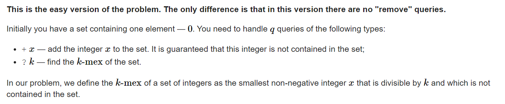

#### solve

1. 最暴力的方法： 

   1. map维护直接插入：
   2. 从小到大枚举k的若干倍 ， 检查是否存在直到找出答案。

2. 优化：

   1. 记忆化，对每一次询问记忆即可。（因为中途不会出现删除数字的操作 ， 因此这个答案是可持续使用的。）

   2. 复杂度估算：

      1. 链子比较短 ， 短于500 可以忽略不记；一次查询。

      2. 链子比较长： 第一次的复杂度就是该链子： 考虑基于同一条长链的查询 ：
         $$
         \sum \frac {len}{1} + \frac {len}{2} +... + 1 = len\sum_{d = 1}^{len} \frac {1}{d}\\
         = len\times log(len)
         $$

      3. 长链子比较多。 长度大于 1000 的最多200.也就是说，然后剩下的每次询问的复杂度为1000： 总的来说过是 1000 * 200。也许带个log。

#### 生长思考 ：

1. 暴力小优化， 对于一些比较特殊的模型， 认真审视复杂度。
   1. 分块。
   2. 图的度数分布
   3. 上述调和函数类型的形式。

#### code

```cpp
map<ll , ll> mp1 , mp2;

signed main()
{
	ios::sync_with_stdio(false);
	cin.tie(0);
	int q;
	cin >> q;
	while (q--) {
		char ch; ll x;
		cin >> ch >> x;
		if (ch == '+') {
			mp1[x] = 1;
		} else {
			if (mp2.count(x) == 0)mp2[x] = 1;
			int p = mp2[x];
			while (mp1[p * x])
				p++;
			mp2[x] = p;
			cout << x * p << "\n";
		}
	}
}
```

-----

 **D. Madoka and The Corruption Scheme**
https://codeforces.com/contest/1717/problem/D

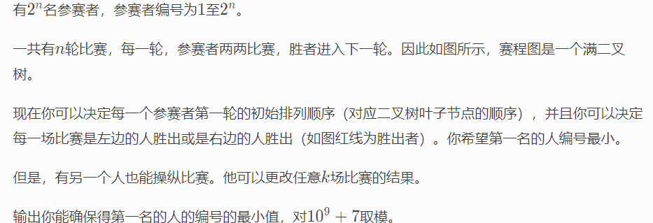

#### solve

假定一个模拟锦标赛竞争的二叉树：

1. 处理等效 ： 不妨调整这棵树， 使得每次胜者都是左边的选手。因此操纵者在上面的操作 ， 相当于从根节点往下走， 默认情况下往左走。操纵者不断地改变移动方向， 问操纵者可以到达哪几种终点：

2. 这个可以由组合计算得出：

   1. 如果当前可选择次数大于层数。那么结果为$2^n$

   2. 否额， 一种选择对应一个人， 总共是
      $$
      \sum _{j=0}^{k}C_{n}^{j}
      $$

3. 

#### code

```cpp
int fac[N_c] , infac[N_c];
ll quickly_pow(ll x, ll n, ll p)
{
	ll res = 1;
	while (n > 0)
	{
		if (n & 1)res = res * x % p;
		x = x * x % p;
		n >>= 1;
	}
	return res;
}
void init() {
	fac[0] = infac[0] = 1;
	for (int i = 1; i < N_c; i++)
	{
		fac[i] = 1LL * fac[i - 1] * i % mod;
		infac[i] = 1LL * infac[i - 1] * quickly_pow(i, mod - 2, mod) % mod;
	}
}
int c(int a , int b) {
	return 1LL * fac[a] * infac[b] % mod * infac[a - b] % mod;
}
signed main()
{
	ios::sync_with_stdio(false);
	cin.tie(0);
	init();
	int n , k;
	cin >> n >> k;
	if (k >= n) {cout << quickly_pow(2 , n , mod); return 0;}
	ll ans = 0;
	for (int i = 0; i <= k; i++) {
		ans = (ans + c(n , i)) % mod;
	}
	cout << ans << "\n" << "\n";
}
```

----

**F. Build a Tree and That Is It**
https://codeforces.com/contest/1714/problem/F

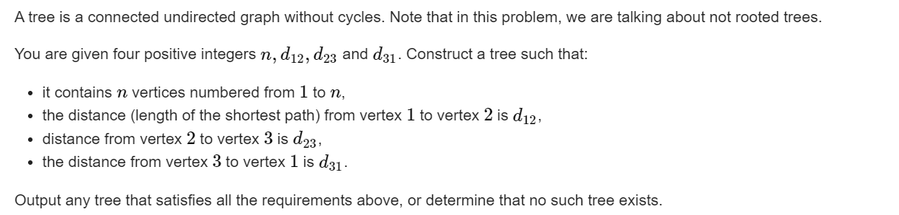

#### sovle

任何方案可以转换成：三个点地最近距离点为根：
可以设出三个点到根地距离， ，然后联立方程组求解：如下：
$$
x , y , z 分别表示三个点地情况。\\
x+ y + z = (d_{12} + d_{23} + d_{31})/2;\\
x+y = d_{12}\\
x+z = d_{31}\\
y + z= d_{2,3}\\
$$

1. 发现sum必须为偶数：否则无解：
2. 三个变量必须是负数， 并且为0地项不能超过1个。

求出上述三个变量之后， 

1. 如果有0就使用对应点为根节点。
2. 如果没有0 ， 就使用4为根节点。
   1. 先处理三个点。
   2. 将剩余点连在根节点上。

#### code

```cpp
const int inf = 1 << 29;
const ll INF = 1LL << 60;
const int N = 1E6 + 10;

int f(int x , int y , int z) {
	return (x + y - z) / 2;
}

void work(int testNo)
{
	int n , d12 , d23 , d31;
	cin >> n >> d12 >> d23 >> d31;
	int sum = d12 + d23 + d31;
	int x = f(d12 , d31 , d23);
	int y = f(d12 , d23 , d31);
	int z = f(d31 , d23 , d12);
	// dbg(x);
	// dbg(y);
	// dbg(z);
	if (sum % 2  || x < 0 || y < 0 || z < 0 || (x == 0 && y == 0) || (x == 0 && z == 0) || (y == 0 && z == 0)) {
		cout << "NO\n";
		return;
	}
	int root;
	int cunt = 4;
	if (x == 0) {root = 1;}
	else if (y == 0) {root = 2;}
	else if (z == 0) {root = 3;}
	else root = 4 , cunt = 5;
	// dbg(root);
	vector<array<int , 2>> edge;
	auto update = [&](int ed , int sum) {
		if (sum == 0)return;
		int cur = 0;
		if (sum == 1) {
			edge.push_back({root , ed});
			return;
		}
		if (cur + 1 < sum) {
			cur ++;
			edge.push_back({root , cunt++});
		}
		while (cur + 1 < sum) {
			cur++;
			edge.push_back({cunt - 1 , cunt++});
		}
		edge.push_back({cunt - 1 , ed});
	};
	update(1 , x);
	update(2 , y);
	update(3 , z);
	if (cunt > n + 1) {
		cout << "NO\n";
		return;
	}
	while (cunt <= n) {
		edge.push_back({root, cunt++});
	}
	cout << "YES\n";
	for (auto [x , y] : edge) {
		cout << x << " " << y << "\n";
	}
}
signed main()
{
	ios::sync_with_stdio(false);
	cin.tie(0);

	int t; cin >> t;
	for (int i = 1; i <= t; i++)work(i);
}
```

----

**D. New Year's Problem**
https://codeforces.com/contest/1619/problem/D

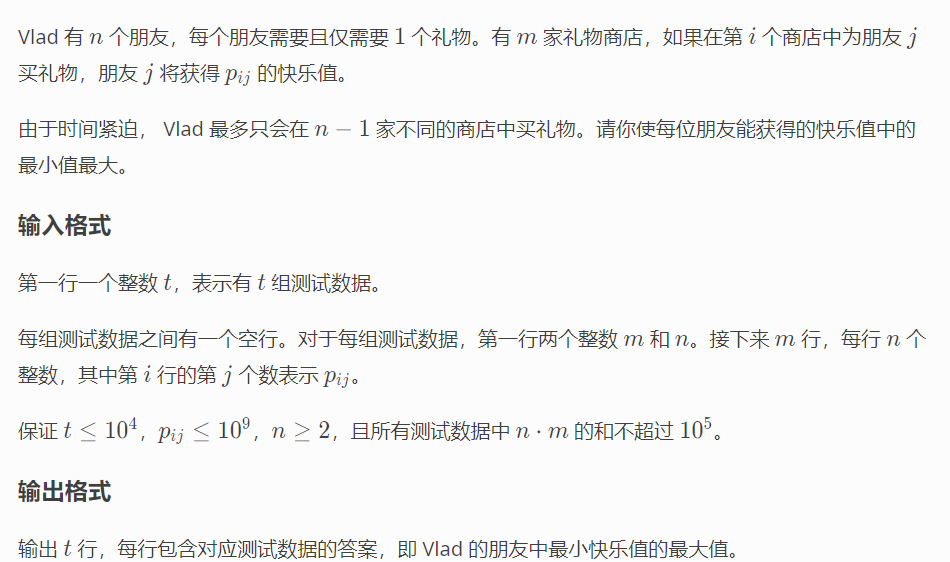

#### solve

最大化最小值： 显然是二分：
考虑怎么check一个值x , 是否有更优的解：关注下角度：

1. 每一个人至少对应一个商品比该值大.
1. 存在一个商店,满足有两个以上的人可以在其中找到对应的商品。

#### code

```cpp
#include<bits/stdc++.h>
using namespace std;

// 加油！！！
vector<vector<int>> a;
void solve() {
	int m , n;
	cin >> m >> n;
	a = vector<vector<int>> (m + 1 , vector<int>(n + 1));
	for (int i = 1; i <= m; i++)
		for (int j = 1; j <= n; j++)
			cin >> a[i][j];
	function<bool(int x)> check = [&](int x)->bool{
		int flag = 0;
		//首先检查。对于每一个人，都可以找到喜欢的商品价值大于等于该值。
		int cunt = 0;
		for (int i = 1; i <= n; i++) {
			bool have = false;
			for (int j = 1; j <= m; j++) {
				if (a[j][i] >= x) have = true;
			}
			cunt += have;
		}
		flag |= cunt == n;
		for (int i = 1; i <= m; i++) {
			int cunt = 0;
			for (int j = 1; j <= n; j++) {
				cunt += a[i][j] >= x;
			}
			flag |= (cunt >= 2) << 1;
		}
		return flag == 3;
	};
	int low = 0 , high = (int)1E9;
	while (low < high) {
		int mid = (low + high + 1) / 2;
		if (check(mid)) low = mid;
		else high = mid - 1;
	}
	cout << low << "\n";
}

int main() {
	ios::sync_with_stdio(false);
	cin.tie(0);
	int t; cin >> t;
	while (t--)solve();
}
```

----


#### 倍增与树

利用倍增的思想， 可以给树上的点建立父亲st表：
应用st表： 可以完成以下任务：

1. 最近公共祖先：

   原理： 可以用$2^0 ......2^{31}$这些二进制数字， 且每个数字只使用一次 ， 拼凑出所有的在范围内的数字。

##### code

```cpp
const int LOGN = 18;
int n , q;
vector<int> e[N];
int par[LOGN + 1][N] , dep[N];
void dfs(int u , int fa) {
	dep[v] = dep[u] + 1;
	for (auto v : e[u]) {
		if (v != fa) {
			par[0][v] = u;
			dfs(v , u);
		}
	}
}
int query(int u , int v) {
	if (dep[u] > dep[v]) swap(u , v);
	int d = dep[v] - dep[u];
	for (int i = LOGN; i >= 0; i--) {
		if ((1 << i) <= d) {
			d -= (1 << i);
			v = par[i][v];
		}
	}
	if (v == u) return v;
	// 降到同一个高度上；
	// 接着 ， 两个一起跳；
	for (int i = LOGN; i >= 0; i--) {
		// 如果不是同一个父亲就跳。
		// 如果是同一个 ， 就用更小的操作去跳。
		// 最后它们会相差1.
		if (par[i][v] != par[i][u]) {
			v = par[i][v];
			u = par[i][u];
		}
	}
	return par[0][u];
}
int main() {
	int s;
	cin >> n >> q >> s;
	for (int i = 1; i < n; i++) {
		int u , v;
		cin >> u >> v;
		e[u].push_back(v);
		e[v].push_back(u);
	}
	dfs(s , 0);
	for (int i = 1; i <= LOGN; i++) {
		for (int j = 1; j <= n; j++) {
			par[i][j] = par[i - 1][par[i - 1][j]];
		}
	}
	for (int i = 0; i < q; i++) {
		int u , v;
		cin >> u >> v;
		cout << query(u , v) << "\n";
	}
}
```

2. 两点之间的路径最小值：

   http://oj.daimayuan.top/course/15/problem/793

```cpp
#include <bits/stdc++.h>
using namespace std;
typedef long long ll;

const int N = 201000;
const int LOGN = 18;

int n, q;
int dep[N], par[N][LOGN + 1], val[N][LOGN + 1];
vector<pair<int, int>> e[N];

void dfs(int u, int f) {
	dep[u] = dep[f] + 1;
	for (auto p : e[u]) {
		int v = p.first;
		if (v == f) continue;
		par[v][0] = u;
		val[v][0] = p.second;
		dfs(v, u);
	}
}
int query(int u, int v) {
	int ans = 1 << 30;
	if (dep[u] > dep[v]) swap(u, v);
	int d = dep[v] - dep[u];
	for (int j = LOGN; j >= 0; j--) if (d & (1 << j)) {
		ans = min(ans, val[v][j]);
		v = par[v][j];
	}
	if (u == v) return ans;
	for (int j = LOGN; j >= 0; j--) if (par[u][j] != par[v][j]) {
		ans = min(ans, min(val[u][j], val[v][j]));
		u = par[u][j];
		v = par[v][j];
	}
	ans = min(ans, min(val[u][0], val[v][0]));
	return ans;
}

int main() {
	scanf("%d%d",&n, &q);
	for (int i = 1; i < n; i++) {
		int u, v, w;
		scanf("%d%d%d", &u, &v, &w);
		e[u].push_back(make_pair(v, w));
		e[v].push_back(make_pair(u, w));
	}
	dfs(1, 0);
	for (int j = 1; j <= LOGN; j++) {
		for (int u = 1; u <= n; u++) {
			par[u][j] = par[par[u][j - 1]][j - 1];
			val[u][j] = min(val[u][j - 1], val[par[u][j - 1]][j - 1]);
		}
	}
	for (int i = 1; i <= q; i++) {
		int u, v;
		scanf("%d%d", &u, &v);
		printf("%d\n", query(u, v));
	}
}
```

3. 路径上的最小点权值；
4. 第k祖先：略；

-----

**dfs序**

**概念：**

对树节点打一个序标记： 其中该序和dfs的顺序有关。遇到就打一个未分配标记：
