**2023 . 5月第一周**

**小松
自小刺头深草里，
而今渐觉出蓬篙。
时人不识凌云木，
直待凌云始道高。**

这一阶段的目标是： 为省赛做准备：保铜争银。

**日志：**

1. 第一次独立做出了1800的构造问题。

   https://codeforces.com/problemset/problem/1705/D

2. 额这一周蓝名， 上月就有两次机会蓝名。 一是一场div3策略不对出锅 ， 一场是div2 , 不认真打， 差一分钟调出D。可惜这个目标没有在4月完成。

   虽然根本上， 这这只是一种数据 ， 但是其对队伍 ， 对个人的信息发展有着非常积极的作用。

   可能直到退役也无法再上一步， 但是我得相信每个人都有自己的成长性。由其是自己， 蓝不应该是终点 ， 我也不能够让他真正成为终点。


#### 算法学习

1.  [SOSdp .md](..\..\Logrithm\动态规划\状压dp\状态压缩dp进阶\SOSdp .md) 
2.  [E. Compatible Numbers.md](..\..\Logrithm\动态规划\状压dp\状态压缩dp进阶\例题\E. Compatible Numbers.md)  （==猫头鹰==） 完毕
3.  [E. Vowels.md](..\..\Logrithm\动态规划\状压dp\状态压缩dp进阶\例题\E. Vowels.md)   第一道2700
4.  [超集和and卷积.md](..\..\Logrithm\动态规划\状压dp\状态压缩dp进阶\超集和and卷积.md) 
5.  [CF Round #257 (Div 1) D, Jzzhu and Numbers.md](..\..\Logrithm\动态规划\状压dp\状态压缩dp进阶\例题\CF Round #257 (Div 1) D, Jzzhu and Numbers.md)  ==猫头鹰==

**st表**

1.  [st_table.md](..\..\Logrithm\数据结构\st表\st_table.md) 

**codeforces:**

1. 构造
   1.  [Tournament Countdown.md](..\..\problems\codeforces\1800\构造\交互构造\Tournament Countdown.md) 
   2.  翻车惨案：(数组构是自己最薄弱的点)
       1.  数组构造： [B. Indivisible.md](..\..\problems\codeforces\1400-1600\构造\数组模型\800翻车惨案\B. Indivisible.md) 
       2.  数组构造：  [D. Super-Permutation.md](..\..\problems\codeforces\1400-1600\构造\数组模型\800翻车惨案\D. Super-Permutation.md) 
   3.  [C. Connect the Points.md](..\..\problems\codeforces\1800\构造\坐标系上移动\C. Connect the Points.md) 
   4.  [F. Copy of a Copy of a Copy.md](..\..\problems\codeforces\1900\构造\运算求逆\F. Copy of a Copy of a Copy.md) 
   5.  [H. Hot Black Hot White.md](..\..\problems\codeforces\1800\特殊运算模型\mod\H. Hot Black Hot White.md) 

2. 图论
   1.  [D. Fish Graph.md](..\..\problems\codeforces\1900\图论\环问题\D. Fish Graph.md) 
3. 分块
   1.  [G2. Magic Triples (Hard Version).md](G2. Magic Triples (Hard Version).md) （值域分块）
4. 贪心
   1.  [G. Restore the Permutation.md](G. Restore the Permutation.md) 
5. 思维
   1.  [D. Reverse Sort Sum.md](..\..\problems\codeforces\1900\思维\正逆向推理\D. Reverse Sort Sum.md) 

6. 动态规划
   1.  [D. Weight the Tree.md](..\..\problems\codeforces\2000\动态规划\树形dp\D. Weight the Tree.md) 

-----------


该问题类型： 由下问题引出：

####  子集和

http://oj.daimayuan.top/course/8/problem/368
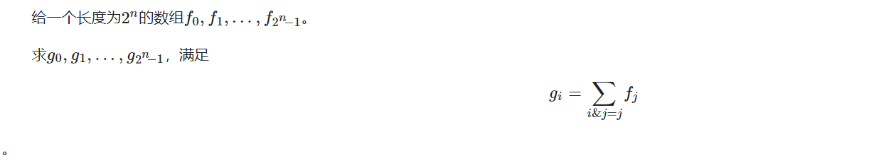


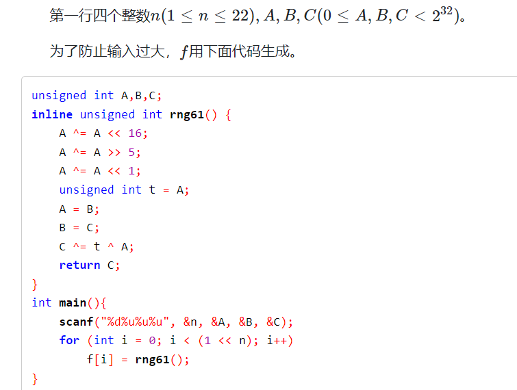


### solve：

**三种方法：**

#### 枚举算法：

1. **最暴力算法：**暴力枚举算法：
   1. 枚举一个集合：
   2. 枚举所有子集。并且求和；
2. 复杂度分析 ： 显然是$O(4^n)$

```code
unsigned int A, B, C;
inline unsigned int rng61() {
	A ^= A << 16;
	A ^= A >> 5;
	A ^= A << 1;
	unsigned int t = A;
	A = B;
	B = C;
	C ^= t ^ A;
	return C;
}
ull f[1 << 23];
ull g[1 << 23];
signed main()
{
	ios::sync_with_stdio(false);
	cin.tie(0);
	int n;
	cin >> n;
	cin >> A >> B >> C;
	const int M = 1 << n;
	for (int i = 0; i < M; i++) {
		f[i] = rng61();
	}
	//相当于已经求出了所有的前缀和：
	//方法一：
	//暴力：
	for (int i = 0; i < M; i++)
		for (int j = 0; j < M; j++) {
			//判断j是否为i的子集。
			//求交集。
			if ((i & j) == j) {
				g[i] += f[j];
			}
		}
	ull ans = 0;
	for (int i = 0; i < M; i++) {
		ans ^= g[i];
	}
	cout << ans << "\n";
}
```

----

#### 利用一些trick枚举前缀和：

1. 整体上子集个数和统计

   $$
   从组合数统计的角度上看：\\
      \sum _{k = 0}^{n}(_{k}^{n})2^k\\
      枚举一个集合\\
      枚举其子集个数(放0或者放1)\\
      使用组合数原理不难发现 子集个数和为：\\
      O(3^n)
   $$

   $$
   关注匹配关系：\\
   假设前缀情况已经枚举完： 接下来的情况分别有三种：\\
   (1 , 1) , (1 , 0) , (0 , 0)\\
   所以综上， 匹配的个数是：3^n
   $$

2. 对于一个数，快速的枚举出所有的前缀和的方法：

```
for(i : 1 .... (1 << n) - 1){
    j = i;
    while(true){
        g[i] += f[j];
        if(j == 0)break;
        j = (j - 1) & i;
    }
}
```

二进制上的一个trick 。 比较难证明： 但是可以写一些多感受：

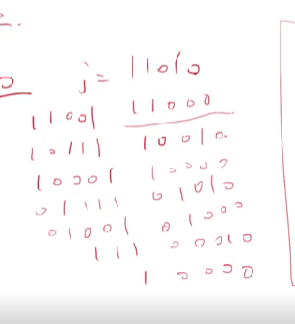


**这个技巧比较常用：**

#### code

```cpp
unsigned int A, B, C;
inline unsigned int rng61() {
	A ^= A << 16;
	A ^= A >> 5;
	A ^= A << 1;
	unsigned int t = A;
	A = B;
	B = C;
	C ^= t ^ A;
	return C;
}
ull f[1 << 23];
ull g[1 << 23];
signed main()
{
	ios::sync_with_stdio(false);
	cin.tie(0);
	int n;
	cin >> n;
	cin >> A >> B >> C;
	const int M = 1 << n;
	for (int i = 0; i < M; i++)
		f[i] = rng61();
	for (int i = 0; i < M; i++) {
		int j = i;
		while (true) {
			g[i] += f[j];
			if (j == 0)break;
			j = (j - 1) & i;
		}
	}
	ull ans = 0;
	for (int i = 0; i < M; i++)
		ans ^= g[i];
	cout << ans << "\n";
}
```

#### 高维前缀和

 [高维前缀和.md](..\..\..\基础算法设计思想\前缀和\高维前缀和.md) 
**观察现象：**

1. 将子集元素的存在情况压缩成一个二进制数： 发现求和就是一个高维度前缀和问题：
2. 与普通高维前缀和的不同点： 
   1. 维度过多。
   2. 维度的上限为1.

#### 复杂度分析：

$O(n2^n)$  ， 一个非常优越的复杂度。

#### code如下： 偏向一个trick

```cpp
unsigned int A, B, C;
inline unsigned int rng61() {
	A ^= A << 16;
	A ^= A >> 5;
	A ^= A << 1;
	unsigned int t = A;
	A = B;
	B = C;
	C ^= t ^ A;
	return C;
}
ull f[1 << 23];
signed main()
{
	ios::sync_with_stdio(false);
	cin.tie(0);
	int n;
	cin >> n;
	cin >> A >> B >> C;
	const int M = 1 << n;
	for (int i = 0; i < M; i++)
		f[i] = rng61();
	for (int i = 0; i < n; i++)
		for (int j = 0; j < M; j++)
			if (j & (1 << i))
				f[j] += f[j - (1 << i)];
	ull ans = 0;
	for (int i = 0; i < M; i++)
		ans ^= f[i];
	cout << ans << "\n";
}
```

**E. Compatible Numbers**
http://oj.daimayuan.top/course/8/problem/369
https://codeforces.com/contest/165/problem/E

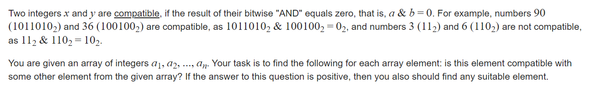

#### solve

问题等效于： 对于$a_i$ ， 找到一个其反码（关注前部分位取反）的属于该码子集的元素。

1. 基于集合空间， 考虑一个集合的子集整体。（没一个集合都对应一个指标函数）。然后就转换成了sosdp问题。

**状态定义**

$f_s$ , 基于集合空间得到的， 特征为s的值。

$g_i$ ，特征为i子集的指标函数的最小值。

**转移方程：**
$$
g_i = Min_{i\&j = j}f_j
$$
**初始化：**

$f_i = inf$

#### 生长思考：

1. 总结出一个非常自然的思路：
   1. 对于一个集合空间 整理，映射到一个二进制集合空间。
      1. 比方说： 该问题的元素空间中，映射到了一个连续的二进制空间；标记为$f_{s}$表示作为s的子集且最小的$a_i$。
   2. 然后将问题变成一个子集统筹运算的问题；
      1. 比方说，这里变成了一个子集统筹求min的问题。

#### code

```cpp
const int inf = 1 << 29;
const ll INF = 1LL << 60;
const int N = 1E6 + 10;
const int M = (1 << 22)  + 10;
int f[M];
int a[N];
signed main()
{
	ios::sync_with_stdio(false);
	cin.tie(0);
	int n;
	cin >> n;
	fill(f , f + M , inf);
	for (int i = 0; i < n; i++) {
		cin >> a[i];
		f[a[i]] = min(i , f[a[i]]);
	}
	for (int i = 0; i < 23; i++) {
		for (int j = 0; j < M; j++) {
			if (j & (1 << i)) f[j] = min(f[j ^ (1 << i)] , f[j]);
		}
	}
	for (int i = 0; i < n; i++) {
		if (f[(1 << 22) - 1 - a[i]] < n) {
			cout << a[f[(1 << 22) - 1 - a[i]]] << " ";
		} else cout << -1 << " ";
	}
	cout << "\n";
}
```


**D. Jzzhu and Numbers**

https://codeforces.com/contest/383/problem/E

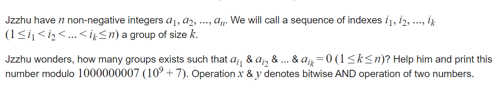

#### solve

==**定义： **==

$f_s$表示异或和为s的子集个数。

$f_s$难求， 但是我们有方法求出：

$g_s$ , 异或和为s的超集合的子集个数。

==**求$g_s$ **==

1. 先预处理出s二进制形式的数的个数。$h_i = 1$如果二进制为i的元素存在。
2. 求出s的超集个数：

$$
g_i = \sum _{j \& i = i} T_i
$$

​           sosdp。

3. 考虑$g_i的解集合$： 显然：(注意不同情况下， $g_i$的含义：) 
   $$
   g_i = 2^{g_i}
   $$

==由$g_i$ 求 $f_i$==

由一个前缀和求出 ， 一个空间的一个元素值： 
不断对每一维逆过来求差分。这点和and卷积中的两个关键思想之一 一致。

最终答案就是$f_0$ ， 并且其实已经超额完成任务了。

#### 生长思考：

1. 转换步骤较多， 主要关注超集 ， 前缀和等。于是转着转着 ， 就转到答案。

#### code

```cpp
#include<bits/stdc++.h>
using namespace std;

using ll = long long;
using i64 = long long;
using ull = unsigned long long;
using ld = long double;
using uint = unsigned int;
using pii = pair<int , int>;
using pli = pair<ll , int>;
using pll = pair<ll , ll>;


#define dbg(x) cerr << "[" << __LINE__ << "]" << ": " << x << "\n"

#define all(x) (x).begin(),(x).end()
#define sz(x) (int)(x).size()
#define pb push_back
#define fi first
#define se second

const int inf = 1 << 29;
const ll INF = 1LL << 60;
const int N = 1E6 + 10;
const int mod = int (1E9 + 7);


const int M = 20;

ll f[(1 << M) + 10];
ll p2[N];
signed main()
{
	ios::sync_with_stdio(false);
	cin.tie(0);

	int n; cin >> n;
	p2[0] = 1;
	for (int i = 1; i <= n; i++)
		p2[i] = p2[i - 1] * 2 % mod;
	for (int i = 0; i < n; i++) {
		int x; cin >> x;
		f[x]++;
	}
	//超集相关的sosdp
	for (int i = 0; i < M; i++)
		for (int j = 0; j < (1 << M); j++) {
			if ((j & (1 << i)) == 0)
				f[j] += f[j + (1 << i)];
		}
	for (int i = 0; i < (1 << M); i++)
		f[i] = p2[f[i]];
	for (int i = 0; i < M; i++)
		for (int j = 0; j < (1 << M); j++) {
			if ((j & (1 << i)) == 0) {
				f[j] -= f[j + (1 << i)];
			}
		}
	f[0] %= mod;
	if (f[0] < 0) f[0] += mod;
	cout << f[0] << "\n";
}

/* stuff you should look for
* int overflow, array bounds
* special cases (n=1?)
* do smth instead of nothing and stay organized
* WRITE STUFF DOWN
* DON'T GET STUCK ON ONE APPROACH
*/
```


**AND卷积**
http://oj.daimayuan.top/course/8/problem/371


----


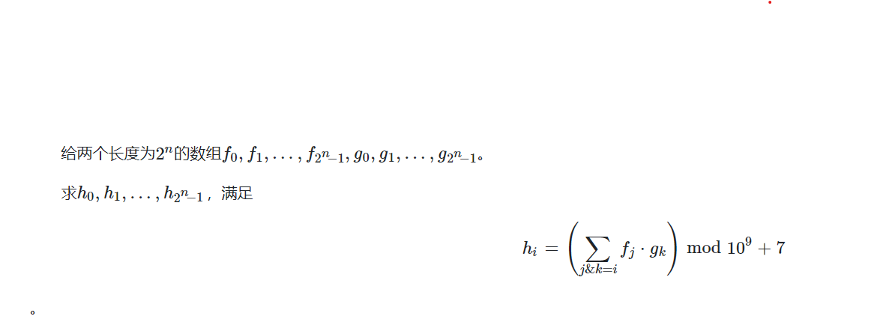

#### 超集合

$$
g_i = \sum _{i \& j = i } f_j
$$

对于二进制的每一个位 ，都要求j大于等于i 。 所以转变成一个后缀和问题： 

##### code

```cpp
	for (int i = 0; i < n; i++) {
		for (int j = 0; j < (1 << n); j++) {
			if ((j & (1 << i)) == 0) {
				f[j] += f[j + (1 << i)];
			}
		}
	}
```

**转换过程：**

$F_i$:  $f_i$的后缀和。
$$
F_i = \sum _{k >= i} f_k\\
$$
$G_i$  $g_i$的后缀和。
$$
G_i = \sum _{k >= i} g_k
$$


$H_i$  定义为$h_i$的后缀和。
$$
H_i = \sum _{k >= i}h_k
$$
**关键性质1：**
$$
H_i = F_i \times G_i。\\
$$
感受上述性质， 对于上述乘法式子的每一个组合， 都唯一投射到 唯一的一个$h_j$上 。 同时对于不在$H_i $ , $F_i$中的元素是必然没有投射到某种解的。

**最后的问题 ： 由后缀和还原空间中的元素$h_i$**

按照规律就是逆着做差。

```
	for (int i = 0; i < n; i++) {
		for (int j = 0; j < (1 << n); j++) {
			if ((j & (1 << i)) == 0) {
				f[j] -= f[j + (1 << i)];
			}
		}
	}
```


#### code

```cpp
const int inf = 1 << 29;
const ll INF = 1LL << 60;
const int N = 1E6 + 10;

unsigned int A, B, C;
inline unsigned int rng61() {
	A ^= A << 16;
	A ^= A >> 5;
	A ^= A << 1;
	unsigned int t = A;
	A = B;
	B = C;
	C ^= t ^ A;
	return C;
}
const int M = 1 << 22;
const int mod = 1000000007;
ll f[M + 10];
ll g[M + 10];
int main() {
	ios::sync_with_stdio(false);
	cin.tie(0), cout.tie(0);
	int n;
	cin >> n >> A >> B >> C;
	for (int i = 0; i < (1 << n); i++)
		f[i] = rng61();
	for (int i = 0; i < (1 << n); i++)
		g[i] = rng61();
    //一种特殊的数据shu
	for (int i = 0; i < n; i++) {
		for (int j = 0; j < (1 << n); j++) {
			if ((j & (1 << i)) == 0) {
				f[j] += f[j + (1 << i)];
				g[j] += g[j + (1 << i)];
			}
		}
	}
	for (int i = 0; i < (1 << n); i++) {
		f[i] %= mod;
		g[i] %= mod;
		f[i] = f[i] * g[i] % mod;
	}
	for (int i = 0; i < n; i++) {
		for (int j = 0; j < (1 << n); j++) {
			if ((j & (1 << i)) == 0) {
				f[j] -= f[j + (1 << i)];
			}
		}
	}
	ll ans = 0;
	for (int i = 0; i < (1 << n); i++) {
		f[i] %= mod;
		if (f[i] < 0)
			f[i] += mod;
		ans ^= f[i];
	}
	cout << ans << "\n";
}
```

-----

**E. Vowels**

https://codeforces.com/contest/383/problem/E

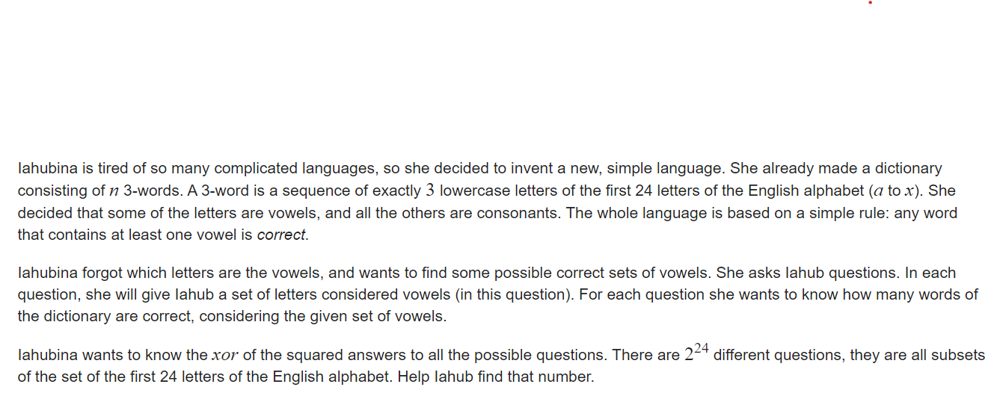

#### solve

1. 关注集合性质：（毕竟是基于集合的一个求和问题。）

$$
f_i = \sum _{j\&i = i}T_j
$$

2. 枚举一个组合： 
   1. 通过上述处理的空间 ， 计算出与其有交集的字符串个数。
   2. 关注组合的反集合。通过容斥非常容易计算。

#### code

````cpp
const int inf = 1 << 29;
const ll INF = 1LL << 60;
const int N = 1E6 + 10;
const int M = 24;
const int MM = 1 << 24;

ll f[MM + 10];

signed main()
{
	ios::sync_with_stdio(false);
	cin.tie(0);
	int n;
	cin >> n;
	for (int i = 0; i < n; i++) {
		string s;
		cin >> s;
		int rec = 0;
		for (int j = 0; j < 3; j++) {
			rec |= 1 << (s[j] - 'a');
		}
		f[rec]++;
	}
	//然后就求一个高维前缀和的东西。
	//然后通过容斥反过来求贡献。
	for (int i = 0; i < M; i++) {
		for (int j = 0; j < MM; j++) {
			if (j & 1 << i) {
				f[j] += f[j ^ (1 << i)];
			}
		}
	}
	ll ans = 0;
	for (int i = 0; i < MM; i++) {
		ll d = n - f[MM - 1 - i];
		ans ^= d * d;
	}
	cout << ans << "\n";
}
````


### st表

```cpp
const int N = (int)1E6 + 10;
//把较小的维度放在前面有利于优化维度。
ll f[22][N] , a[N];
//int log[N];
void init() {
    //预处理log。
    //for(int i = 2; i <= n; i++) log[i] = log[i / 2] + 1;
	for (int i = 1; i <= n; i++) f[0][i] = a[i];
	for (int j = 1; j <= 20; j++) {
		for (int i = 1; i + (1 << j) - 1 <= n; i++) {
			f[j][i] = max(f[j - 1][i] , f[j - 1][i + (1 << (j - 1))]);
		}
	}
}
int query(int l , int r) {
    assert(l <= r);
    //len = log[r- l + 1];
	int len = 31 - __builtin_clz(r - l + 1);
	return max(f[len][l] , f[len][r - (1 << len) + 1]);
}
//这个下标默认从1开始。
```

#### tourist的st表

```cpp
/**
 *    author:  tourist
 *    created: 31.05.2022 18:35:43
**/
template <typename T, class F = function<T(const T&, const T&)>>
class SparseTable {
public:
	int n;
	vector<vector<T>> mat;
	F func;

	SparseTable(const vector<T>& a, const F& f) : func(f) {
		n = static_cast<int>(a.size());
		int max_log = 32 - __builtin_clz(n);
		mat.resize(max_log);
		mat[0] = a;
		for (int j = 1; j < max_log; j++) {
			mat[j].resize(n - (1 << j) + 1);
			for (int i = 0; i <= n - (1 << j); i++) {
				mat[j][i] = func(mat[j - 1][i], mat[j - 1][i + (1 << (j - 1))]);
			}
		}
	}

	T get(int from, int to) const {
		assert(0 <= from && from <= to && to <= n - 1);
		int lg = 32 - __builtin_clz(to - from + 1) - 1;
		return func(mat[lg][from], mat[lg][to - (1 << lg) + 1]);
	}
};
//应用示例。挺好用的
int main() {
	ios::sync_with_stdio(false);
	cin.tie(0);
	vector<ll> a(n + 1);
	SparseTable<long long> smin(a, [&](long long i, long long j) { return min(i, j);});
	SparseTable<long long> smax(a, [&](long long i, long long j) { return max(i, j);});
}

```


**D. Tournament Countdown**
https://codeforces.com/contest/1713/problem/D


#### solve

询问结果是， 胜场数的多少。而不是简单的数值大小情况。

特殊的性质下， 引出一个性质：

1. 可以通过2次询问筛除3个人。

假设现在剩下4个人： 分别标记为a  ,b ,c d;

**询问（a ,  d）**

1. ans = 1

   **信息**：a > b

   **next**(a , c)

   ​		1 : a最终赢家

   ​		2  b最终赢家

2. ans = 0

   **信息：** a = b.且两者都是被淘汰者。

   **next:** (c , d);

3. ans = 2;

   同上1.


#### code

```cpp
#include<bits/stdc++.h>
using namespace std;
using ll = long long;
using i64 = long long;
using ull = unsigned long long;
using ld = long double;
using uint = unsigned int;
using pii = pair<int , int>;
using pli = pair<ll , int>;
using pll = pair<ll , ll>;
#define dbg(x) cerr << "[" << __LINE__ << "]" << ": " << x << "\n"
#define all(x) (x).begin(),(x).end()
#define sz(x) (int)(x).size()
#define pb push_back
#define fi first
#define se second
const int inf = 1 << 29;
const ll INF = 1LL << 60;
const int N = 1 << 20;
int a[N] , b[N] , tot;
int query(int x , int y) {
	cout << "? " << x << " " << y << endl;
	int res; cin >> res;
	return res;
}
void work(int testNo)
{
	int n;
	cin >> n;
	const int M = 1 << n;
	tot = M;
	iota(b + 1 , b + 1 + M , 1);
	while (tot >= 4) {
		int cunt = 0;
		for (int i = 1; i <= tot; i += 4) {
			int q = query(b[i] , b[i + 3]);
			if (q == 1) {
				q = query(b[i] , b[i + 2]);
				if (q == 1)a[++cunt] = b[i];
				else a[++cunt] = b[i + 2];
			} else if (q == 0) {
				q = query(b[i + 1] , b[i + 2]);
				if (q == 1) a[++cunt] = b[i + 1];
				else a[++cunt] = b[i + 2];
			} else {
				q = query(b[i + 1] , b[i + 3]);
				if (q == 1)a[++cunt] = b[i + 1];
				else a[++cunt] = b[i + 3];
			}
		}
		tot = cunt;
		for (int i = 1; i <= tot; i++)
			b[i] = a[i];
	}
	if (tot == 2) {
		int q = query(b[1] , b[2]);
		if (q == 1) {
			cout << "! " << b[1] << endl;
		} else cout << "! " << b[2] << endl;
	}
	else cout << "! " << b[1] << endl;
}
signed main()
{
	ios::sync_with_stdio(false);
	cin.tie(0);

	int t; cin >> t;
	for (int i = 1; i <= t; i++)work(i);
}
/* stuff you should look for
* int overflow, array bounds
* special cases (n=1?)
* do smth instead of nothing and stay organized
* WRITE STUFF DOWN
* DON'T GET STUCK ON ONE APPROACH
*/
```

https://codeforces.com/contest/1818/problem/B

**B. Indivisible**

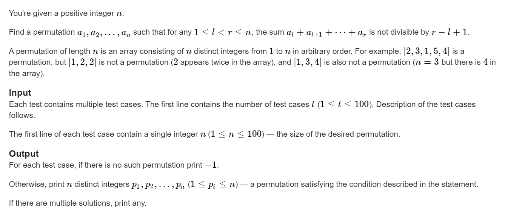

#### solve

没什么好说的；结论看下面代码

#### code

```cpp
#include<bits/stdc++.h>
using namespace std;

using ll = long long;
using i64 = long long;
using ull = unsigned long long;
using ld = long double;
using uint = unsigned int;
using pii = pair<int , int>;
using pli = pair<ll , int>;
using pll = pair<ll , ll>;


#define dbg(x) cerr << "[" << __LINE__ << "]" << ": " << x << "\n"

#define all(x) (x).begin(),(x).end()
#define sz(x) (int)(x).size()
#define pb push_back
#define fi first
#define se second

const int inf = 1 << 29;
const ll INF = 1LL << 60;
const int N = 1E6 + 10;

int ans[N];
void work(int testNo)
{
	int n;
	cin >> n;
	if (n == 1) {
		cout << 1 << "\n";
		return;
	}
	if (n % 2) {
		cout << -1 << "\n";
		return;
	}
	int high = 2 , low = 1;
	for (int i = 1; i <= n; i += 2, low += 2 , high += 2) {
		ans[i] = high;
		ans[i + 1] = low;
	}
	for (int i = 1; i <= n; i++) {
		cout << ans[i] << " \n"[i == n];
	}
}


signed main()
{
	ios::sync_with_stdio(false);
	cin.tie(0);

	int t; cin >> t;
	for (int i = 1; i <= t; i++)work(i);
}

/* stuff you should look for
* int overflow, array bounds
* special cases (n=1?)
* do smth instead of nothing and stay organized
* WRITE STUFF DOWN
* DON'T GET STUCK ON ONE APPROACH
*/
```


**D. Super-Permutation**

[Problem - D - Codeforces](https://codeforces.com/contest/1822/problem/D)

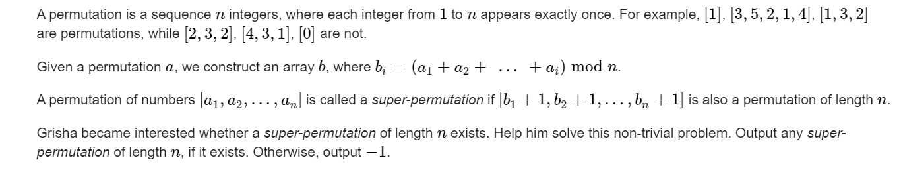

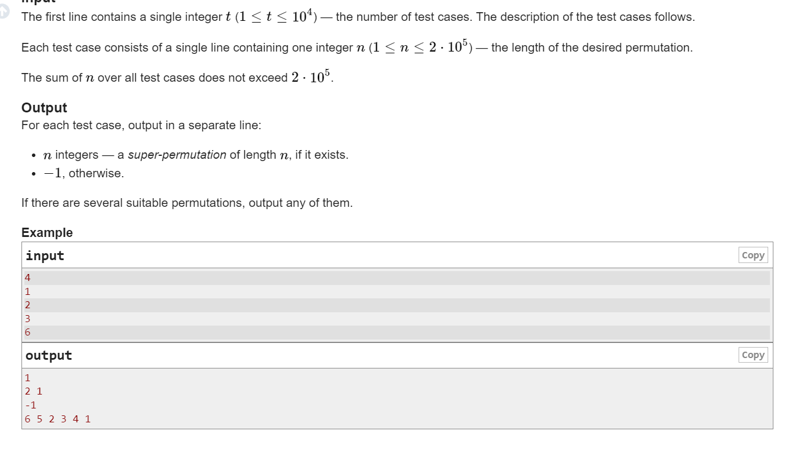

#### solve

mod 数： 逐步渐近。一道非常精彩的题；


#### code

```cpp
#include<bits/stdc++.h>
using namespace std;

using ll = long long;
using i64 = long long;
using ull = unsigned long long;
using ld = long double;
using uint = unsigned int;
using pii = pair<int , int>;
using pli = pair<ll , int>;
using pll = pair<ll , ll>;


#define dbg(x) cerr << "[" << __LINE__ << "]" << ": " << x << "\n"

#define all(x) (x).begin(),(x).end()
#define sz(x) (int)(x).size()
#define pb push_back
#define fi first
#define se second

const int inf = 1 << 29;
const ll INF = 1LL << 60;
const int N = 1E6 + 10;
int ans[N];

void work(int testNo)
{
	int n;
	cin >> n;
	if (n == 1) {
		cout << 1 << "\n";
		return;
	}
	if (n % 2) {
		cout << -1 << "\n";
		return;
	}
	ans[1] = n;
	ans[2] = n - 1;
	for (int i = 3; i <= n; i++) {
		if (i % 2) ans[i] = n + 1 - ans[i - 1];
		else ans[i] = n - 1 - ans[i - 1];
	}
	for (int i = 1; i <= n; i++)
		cout << ans[i] << " \n"[i == n];
}

signed main()
{
	ios::sync_with_stdio(false);
	cin.tie(0);

	int t; cin >> t;
	for (int i = 1; i <= t; i++)work(i);
}

/* stuff you should look for
* int overflow, array bounds
* special cases (n=1?)
* do smth instead of nothing and stay organized
* WRITE STUFF DOWN
* DON'T GET STUCK ON ONE APPROACH
*/
```

**C. Connect the Points**
https://codeforces.com/contest/1666/problem/C

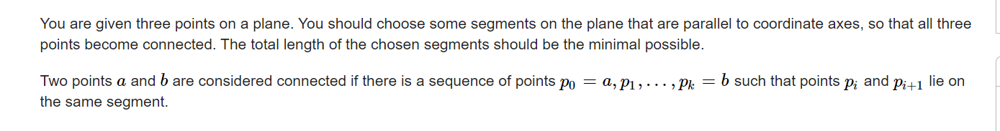

#### solve

首先只要求线段覆盖路径即可。

这种移动方式： 只能上下左右走：和曼哈顿距离相关：

1. 非常容易的找到一个移动距离的下界。

求轨迹最小：

这里移动距离的下界必然是 $x_{max} - x_{min} + y_{max} - y_{min}$

1. 处理策略：
   1. 对三个点进行一个排序：
   2. 中间点上下界跑满。另外两点接近中间线：
   3. 显然结果就是所有方案的下界。 

然后捉着这个下界构造即可；

#### 生长思考：

1. 问题推广：问题面对的解： 设方案为$x$ ， 方案价值为$f(x)$ 。找最大最小价值解。
   1. 考虑所有的集合 ， 贴着函数值域的上下界构造。

#### code

```cpp
#include<bits/stdc++.h>
using namespace std;

using ll = long long;
using i64 = long long;
using ull = unsigned long long;
using ld = long double;
using uint = unsigned int;
using pii = pair<int , int>;
using pli = pair<ll , int>;
using pll = pair<ll , ll>;


#define dbg(x) cerr << "[" << __LINE__ << "]" << ": " << x << "\n"

#define all(x) (x).begin(),(x).end()
#define sz(x) (int)(x).size()
#define pb push_back
#define fi first
#define se second

const int inf = 1 << 30;
const ll INF = 1LL << 60;
const int N = 1E6 + 10;

// ll x[N] , y[N];
// vector<pll> g(int a , int b , int c) {
// 	vector<pll> res;
// 	res.push_back(make_pair(x[a] , y[a]));
// 	auto t = res.back();
// 	res.push_back(make_pair(t.fi , y[b]));
// 	res.push_back(make_pair(x[b] , y[b]));
// 	t = res.back();
// 	res.push_back(make_pair(t.fi , y[c]));
// 	res.push_back(make_pair(x[c] , y[c]));
// 	return res;
// }
// ll f(vector<pll> t) {
// 	ll res = 0;
// 	for (int i = 1; i < sz(t); i++) {
// 		res += abs(t[i].fi - t[i - 1].fi);
// 		res += abs(t[i].se - t[i - 1].se);
// 	}
// 	return res;
// }
// void update(vector<pll>& ans , vector<pll>& a) {
// 	ans.push_back(a[0]);
// 	ans.push_back(a[1]);
// 	for (int i = 2; i < sz(a); i++) {
// 		if (a[i].fi == ans[sz(ans) - 1].fi && a[i].fi == ans[sz(ans) - 2].fi) {
// 			ans.pop_back();
// 		} else if (a[i].se == ans[sz(ans) - 1].se && a[i].se == ans[sz(ans) - 2].se) {
// 			ans.pop_back();
// 		}
// 		ans.push_back(a[i]);
// 	}
// }

pii node[3];
signed main()
{
	ios::sync_with_stdio(false);
	cin.tie(0);
	for (int i = 0; i < 3; i++)
		cin >> node[i].fi >> node[i].se;
	sort(node , node + 3);
	int mi = inf;
	int mx = -inf;
	// dbg(mx);
	// dbg(mi);
	for (int i = 0; i < 3; i++) {
		mi = min(mi , node[i].se);
		mx = max(mx , node[i].se);
	}
	vector<pair<pii , pii>> ans;
	if (mi != mx) {
		ans.push_back({{node[1].fi , mi} , {node[1].fi , mx}});
	}
	for (int i = 0; i <= 2; i += 2) {
		if (node[i].fi != node[1].fi) ans.push_back({{node[i].fi , node[i].se} , {node[1].fi , node[i].se}});
	}
	cout << sz(ans) << "\n";
	for (auto t : ans) {
		cout << t.fi.fi << " " << t.fi.se << " " << t.se.fi << " " << t.se.se << "\n";
	}
}

/* stuff you should look for
* int overflow, array bounds
* special cases (n=1?)
* do smth instead of nothing and stay organized
* WRITE STUFF DOWN
* DON'T GET STUCK ON ONE APPROACH
*/
```

------

**F. Copy of a Copy of a Copy**
https://codeforces.com/problemset/problem/1772/F

给定一张 $n$ 行 $m$ 列的黑白图片（下标从 $1$ 开始），每一个单元格都被涂上了黑色或白色（$1$ 或者 $0$）。

我们对这张图片进行了若干次（可能为零次）操作，每一次操作都是下列两种之一：

- 选择一个单元格，这个单元格不能在图片的边缘（即，单元格所在行不能是 $1$ 或 $n$ 行，所在列不能是 $1$ 或 $m$ 列），并且这个单元格被四个不同颜色的单元格包围（中间 $0$ 四周 $1$，反之亦然），将这个单元格涂成相反的颜色；
- 复制一份当前图片。

两种操作不一定会交替进行。

给出你初始图片与 $k$ 份复制图片，一共 $k+1$ 份图片，这 $k+1$ 份图片是被随机打乱的。

你的任务是恢复操作的顺序。若有多种可能答案，只输出其中一个即可。

所有数据保证答案一定存在。


#### solve

1. 运算的起点是什么？
2. 运算过程中 ， 资源的关键性变化。

关注二问题： 点颜色转变之后 ， 将不可复原。即连续的过程中， 可改变点的个数必定是连续变化的。

1. 由此解决问题 1 ： 起点就是可运算点的数目最大点的图。
2. 然后通过单调性 ， 就可以逐渐确定所有的过程：

#### code

```cpp
#include<bits/stdc++.h>
using namespace std;

using ll = long long;
using i64 = long long;
using ull = unsigned long long;
using ld = long double;
using uint = unsigned int;
using pii = pair<int, int>;
using pli = pair<ll, int>;
using pll = pair<ll, ll>;


#define dbg(x) cerr << "[" << __LINE__ << "]" << ": " << x << "\n"

#define all(x) (x).begin(),(x).end()
#define sz(x) (int)(x).size()
#define pb push_back
#define fi first
#define se second

const int inf = 1 << 29;
const ll INF = 1LL << 60;
const int N = 1E6 + 10;

char s[110][33][33];
int sum[110];
int dx[] = { 0 , 0 , 1,  -1 }, dy[] = { -1 , 1 , 0 , 0 };
int n, m, k;
vector<pair<int, int>> update(int i, int j) {
	vector<pii> res;
	for (int x = 1; x <= n; x++)
		for (int y = 1; y <= m; y++) {
			if (s[i][x][y] != s[j][x][y]) {
				res.emplace_back(x, y);
			}
		}
	return res;
}

signed main()
{
	ios::sync_with_stdio(false);
	cin.tie(0);
	cin >> n >> m >> k;
	priority_queue<pair<int, int>> que;
	for (int i = 0; i <= k; i++) {
		for (int j = 1; j <= n; j++) {
			cin >> (s[i][j] + 1);
		}
		int rec = 0;
		for (int j = 1; j <= n; j++)
			for (int k = 1; k <= m; k++) {
				if (j == 1 || j == n || k == 1 || k == m)continue;
				bool flag = true;
				for (int l = 0; l < 4; l++) {
					if (s[i][j + dx[l]][k + dy[l]] == s[i][j][k]) {
						flag = false;
					}
				}
				rec += flag == true;
			}
		sum[i] = rec;
		que.push(make_pair(rec, i));
	}
	auto cur = que.top();
	que.pop();
	cout << cur.se + 1 << "\n";
	vector<array<int, 3>> ans;
	while (que.size()) {
		auto t = que.top();
		if (t.fi == cur.fi) {
			ans.push_back({ 2 , t.se , 0 });
			que.pop();
		}
		else {
			auto res = update(cur.se, t.se);
			while (res.size()) {
				auto tt = res.back();
				res.pop_back();
				ans.push_back({ 1 , tt.fi , tt.se});
			}
		}
		cur = t;
	}
	cout << sz(ans) << "\n";
	for (auto t : ans) {
		int x = t[0], y = t[1], z = t[2];
		if (x == 1)
			cout << x << " " << y << " " << z << "\n";
		else cout << x << " " << y + 1 << "\n";
	}
}
/* stuff you should look for
* int overflow, array bounds
* special cases (n=1?)
* do smth instead of nothing and stay organized
* WRITE STUFF DOWN
* DON'T GET STUCK ON ONE APPROACH
*/
```


**H. Hot Black Hot White**
https://codeforces.com/problemset/problem/1725/H

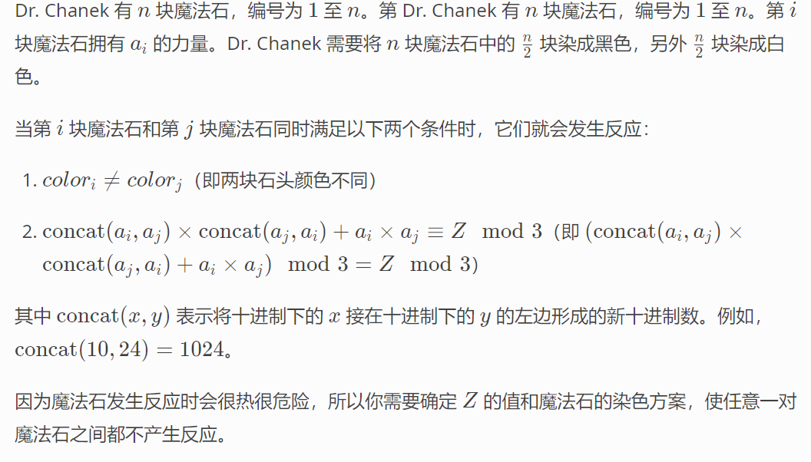

#### solve

1. 对于该运算中， 关注其中一个值， 在其中做出的贡献： 

关注： 

1. 10000 % 3 = 1； 。 无论有多少个0.
2. 上述运算式子左值化简为：

$$
(a_i ^2 + a_j^2 + 3a_ia_j)\equiv Z( mod\quad3) \\
a_i^2 + a_j^2 \equiv Z (mod\quad 3)\\
$$

3. 一个数的平方 ， mod 3 等于2 或者等于0；

于是这样就转变成了一个分类讨论构造问题：
记录cunt0 , cunt1 分别表示 $a_i ^2$为 0 或1的个数。

1.  cunt0 > cunt1 ： 取Z等于2；
1.  cunt0 < cunt1 ： 取Z等于 0；

#### code

```cpp
#include<bits/stdc++.h>
using namespace std;

using ll = long long;
using i64 = long long;
using ull = unsigned long long;
using ld = long double;
using uint = unsigned int;
using pii = pair<int , int>;
using pli = pair<ll , int>;
using pll = pair<ll , ll>;


#define dbg(x) cerr << "[" << __LINE__ << "]" << ": " << x << "\n"

#define all(x) (x).begin(),(x).end()
#define sz(x) (int)(x).size()
#define pb push_back
#define fi first
#define se second

const int inf = 1 << 29;
const ll INF = 1LL << 60;
const int N = 1E6 + 10;

int a[N];

signed main()
{
	ios::sync_with_stdio(false);
	cin.tie(0);
	int n = 10;
	cin >> n;
	vector<int> rec[2];
	for (int i = 0; i < n; i++) {
		ll x; cin >> x;
		rec[x * x % 3].push_back(i);
	}
	if (sz(rec[0]) < sz(rec[1])) {
		cout << 0 << "\n";
		swap(rec[0] , rec[1]);
	} else cout << 2 << "\n";
	string ans(n , '0');
	for (int i = 0; i < n / 2; i++) {
		ans[rec[0][i]] = '1';
	}
	cout << ans << "\n";
}

/* stuff you should look for
* int overflow, array bounds
* special cases (n=1?)
* do smth instead of nothing and stay organized
* WRITE STUFF DOWN
* DON'T GET STUCK ON ONE APPROACH
*/
```


**D. Fish Graph**
https://codeforces.com/contest/1818/problem/D

#### 简介：

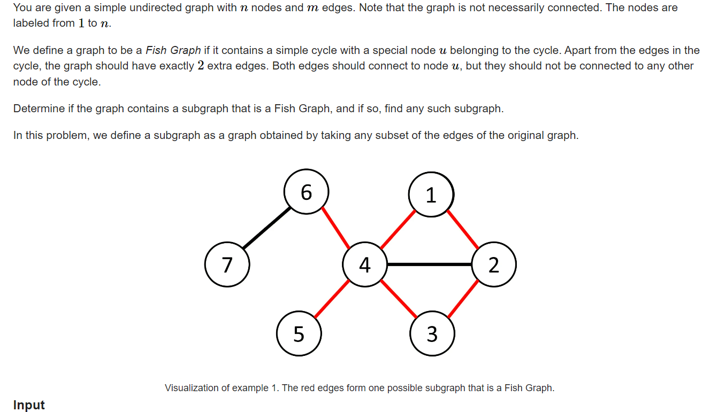

找一个环， 其中一个点挂着其它两个点： 尝试找出这个环：

#### solve

1. **怎么找一个环？**
2. **在拥有环信息处理能力的基础上， 怎么判断题目中要求的环？**
3. **怎么具体找出图上的环？**

---

##### 关于问题1的解决：

1. bellman ford。
   1.  [Currency Exchange.md](Currency Exchange.md) （判断正数环的存在性。）
   2.  [Extended Traffic.md](..\..\..\..\题单\kuangbing\最短路练习\Extended Traffic.md) （找出负环， 并且将负环可达的点标记。）
2. [环问题集录.md](..\..\..\..\..\Logrithm\图论\基础图论\环\环问题集录.md) （全部放在这里：）

找一个环 ， 就bfs ， dfs搜索发现自己就可以找出一个环了。

##### 关于问题2的解决：

容易发现一个结论： 只要环上有一个点是度数为4就可以找到一个节点。

题解中的有一句话很深刻：Try to prove this, and see if your proof can be turned into an algorithm.

##### 关于问题3的解决：

关注最短环： （因为特殊的 ， 度数为4的点连起来的点也在自己所处的一个环中， 但是只要找出最小的环，另外两条边必然在环外。）

基于一边找最小环的办

1. 删边再bfs：
   1. 复杂度分析 ： bfs的话， 每个点只会经历一遍。否则在之前出现解了。
   2. 怎么维护 ， 
      1. 打标记： 和起点节点第二次相遇。
      2. 终点转换为起点的相邻点即可（下面tourist）的代码 ， 就是这个bfs的角度。

#### 生长：

1. 对于其中任何一条边 ， 找到最小环都有解： 不要求找到所有环集合中的最小环。
   1. 反证法 ： 如果不是对一条边最小环，其中不可能包含多个与其起点相连的边  ， 否则就会矛盾，该环可以更小。
2. A_G的做法中 ， 道理也是相同的。dfs做法：
   1. 递归的临界：如果遇到起点的相邻点。就说明找到了一个较小的环： 
      1. 感受： 路径上只有两个相邻点。

前辈代码：

----------

自己的代码是照着tourist写的。所以也没放下来的必要。

#### code jly

```cpp
#include <bits/stdc++.h>

using i64 = long long;

void solve() {
    int n, m;
    std::cin >> n >> m;
    
    std::vector<std::vector<int>> adj(n);
    for (int i = 0; i < m; i++) {
        int u, v;
        std::cin >> u >> v;
        u--, v--;
        adj[u].push_back(v);
        adj[v].push_back(u);
    }
    
    for (int u = 0; u < n; u++) {
        if (adj[u].size() >= 4) {
            std::queue<std::pair<int, int>> q;
            std::vector<std::array<int, 2>> s(n, {-1, -1});
            std::vector<std::array<std::pair<int, int>, 2>> pre(n);
            for (auto v : adj[u]) {
                s[v][0] = v;
                pre[v][0] = {u, 0};
                q.emplace(v, 0);
            }
            while (!q.empty()) {
                auto [x, t] = q.front();
                q.pop();
                
                for (auto y : adj[x]) {
                    if (y != u) {
                        if (s[y][0] == -1) {
                            s[y][0] = s[x][t];
                            pre[y][0] = {x, t};
                            q.emplace(y, 0);
                        } else if (s[y][1] == -1 && s[y][0] != s[x][t]) {
                            s[y][1] = s[x][t];
                            pre[y][1] = {x, t};
                            q.emplace(y, 1);
                        }
                    } else if (t == 1) {
                        std::cout << "YES\n";
                        std::vector<bool> vis(n);
                        std::vector<std::pair<int, int>> ans;
                        ans.emplace_back(u + 1, x + 1);
                        while (x != u) {
                            vis[x] = true;
                            auto [y, q] = pre[x][t];
                            ans.emplace_back(x + 1, y + 1);
                            std::tie(x, t) = std::pair(y, q);
                        }
                        
                        int k = 0;
                        for (auto v : adj[u]) {
                            if (!vis[v] && k < 2) {
                                ans.emplace_back(u + 1, v + 1);
                                k++;
                            }
                        }
                        
                        std::cout << ans.size() << "\n";
                        for (auto [x, y] : ans) {
                            std::cout << x << " " << y << "\n";
                        }
                        
                        return;
                    }
                }
            }
        }
    }
    std::cout << "NO\n";
}

int main() {
    std::ios::sync_with_stdio(false);
    std::cin.tie(nullptr);
    
    int t;
    std::cin >> t;
    
    while (t--) {
        solve();
    }
    
    return 0;
}
```


#### tourist

```cpp
/**
 *    author:  tourist
 *    created: 29.04.2023 10:37:43       
**/
#include <bits/stdc++.h>

using namespace std;

#ifdef LOCAL
#include "algo/debug.h"
#else
#define debug(...) 42
#endif

int main() {
  ios::sync_with_stdio(false);
  cin.tie(0);
  int tt;
  cin >> tt;
  while (tt--) {
    int n, m;
    cin >> n >> m;
    vector<vector<int>> g(n);
    for (int i = 0; i < m; i++) {
      int x, y;
      cin >> x >> y;
      --x; --y;
      g[x].push_back(y);
      g[y].push_back(x);
    }
    vector<pair<int, int>> edges;
    for (int i = 0; i < n; i++) {
      if (g[i].size() >= 4) {
        vector<bool> nei(n, false);
        for (int j : g[i]) {
          nei[j] = true;
        }
        vector<int> pv(n, -1);
        pv[i] = -2;
        int win = -1;
        for (int j : g[i]) {
          if (pv[j] == -1) {
            vector<int> que(1, j);
            pv[j] = i;
            for (int b = 0; b < (int) que.size(); b++) {
              for (int to : g[que[b]]) {
                if (pv[to] == -1) {
                  que.push_back(to);
                  pv[to] = que[b];
                  if (win == -1 && nei[to]) {
                    win = to;
                  }
                }
              }
            }
          }
        }
        if (win != -1) {
          edges.emplace_back(i, win);
          int x = win;
          while (x != i) {
            edges.emplace_back(x, pv[x]);
            x = pv[x];
          }
          vector<bool> used(n, false);
          for (auto& e : edges) {
            used[e.first] = true;
            used[e.second] = true;
          }
          vector<int> rest;
          for (int y : g[i]) {
            if (!used[y]) {
              rest.push_back(y);
            }
          }
          assert(rest.size() >= 2);
          edges.emplace_back(i, rest[0]);
          edges.emplace_back(i, rest[1]);
          break;
        }
      }
    }
    if (edges.empty()) {
      cout << "NO" << '\n';
    } else {
      cout << "YES" << '\n';
      cout << edges.size() << '\n';
      for (auto& e : edges) {
        cout << e.first + 1 << " " << e.second + 1 << '\n';
      }
    }
  }
  return 0;
}

```

#### A_G

```cpp
#include <bits/stdc++.h>
using namespace std;

const int N = 2005;
vector<int> G[N];

int fa[N], vis[N];
int n, m;
bool is_nbr[N], used[N];

int root = 0;
int z = -1;

bool dfs(int v, int p) {
  vis[v] = 1;
  fa[v] = p;
  if (is_nbr[v] && p != root) {
    z = v;
    return 1;
  }
  for (int u: G[v]) {
    if (!vis[u]) {
      if (dfs(u, v)) return 1;
    }
  }
  return 0;
}

void solve() {
  cin >> n >> m;
  for (int i = 0; i < m; i++) {
    int u, v;
    cin >> u >> v;
    G[u].push_back(v);
    G[v].push_back(u);
  }

  for (int v = 1; v <= n; v++) {
    if ((int)G[v].size() < 4) continue;
    fill(vis+1, vis+n+1, 0);
    fill(is_nbr+1, is_nbr+n+1, 0);
    fill(used+1, used+n+1, 0);
    z = -1;
    root = v;
    for (int u: G[v]) is_nbr[u] = 1;
    if (dfs(v, v)) {
      cout << "YES\n";
      vector<pair<int, int>> edges;
      edges.emplace_back(z, v);
      used[z] = 1;
      int t = z;
      for (t = z; t != v; t = fa[t]) {
        edges.emplace_back(t, fa[t]);
        used[t] = 1;
        if (fa[t] == v) break;
      }
      int cnt = 0;
      for (int c: G[v]) {
        if (used[c]) continue;
        edges.emplace_back(c, v);
        cnt++;
        if (cnt == 2) break;
      }
      cout << edges.size() << '\n';
      for (auto& [x, y]: edges) cout << x << ' ' << y << '\n';
      return;
    }
  }
  cout << "NO\n";
}

int main () {
  ios_base::sync_with_stdio(0); cin.tie(0);
  int T;
  cin >> T;
  while (T--) {
    solve();
    for (int i = 1; i <= n; i++) G[i].clear();
  }
}
```

----

**G2. Magic Triples (Hard Version)**

https://codeforces.com/contest/1822/problem/G2

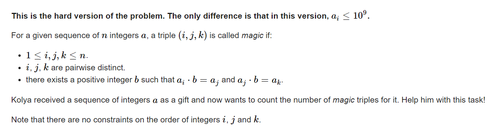

#### solve

1. 首先这里有一些统计贡献的技巧：

   1. 对于相同值的特殊贡献处理。
      1. $x\times (x - 1)\times (x - 2)$


      2. 一般贡献的处理：

         1. 枚举中间值。

         2. ==枚举b的大小。==
            1. 因数枚举法： 适合1E6以内的数字。最大花费为$\sqrt {10^6}$
            2. 相关数字的上界；因为x*b <= 1E9； 所以只需要枚举1E3即可。
         3. 综上使用值域分块处理的思想： 总复杂度为$n\times \sqrt{1E9}$

#### code

```cpp
#include<bits/stdc++.h>
using namespace std;

using ll = long long;

#define dbg(x) cerr << "[" << __LINE__ << "]" << ": " << x << "\n"

#define all(x) (x).begin(),(x).end()
#define sz(x) (int)(x).size()
#define pb push_back
#define fi first
#define se second

const int inf = 1 << 29;
const ll INF = 1LL << 60;
const int N = 1E6 + 10;
//配合完成分治策略。
const int s = 1E6;

vector<int> get_c(ll x) {
	vector<int> res;
	for (int i = 1; i * i <= x; i++) {
		if (x % i == 0) {
			res.push_back(i);
			if (x != i * i) {
				res.push_back(x / i);
			}
		}
	}
	return res;
}
ll f(ll x) {
	return x * (x - 1) * (x - 2);
}

void work(int testNo)
{
	int n;
	cin >> n;
	map<int , int> mp;
	for (int i = 1; i <= n; i++) {
		int x; cin >> x;
		mp[x] += 1;
	}
	const int mx = 1E9;
	ll res = 0;
	for (auto& [x , y] : mp) {
		// dbg(x);
		// dbg(y);
		res += f(y);
		if (x >= s) {
			for (int i = 2; 1LL * i * x <= mx; i++) {
				if (x % i == 0 && mp.count(x / i) && mp.count(i * x))
					res += 1LL * y * mp[x / i] * mp[x * i];
			}
		} else {
			vector<int> c = get_c(x);
			sort(c.begin() , c.end());
			for (auto b : c) {
				if (b == 1)continue;
				if (1LL * b * x > mx)break;
				if (mp.count(x / b) && mp.count(x * b))
					res += 1LL * y * mp[x / b] * mp[x * b];
			}
		}
	}
	cout << res << "\n";
}

signed main()
{
	ios::sync_with_stdio(false);
	cin.tie(0);

	int t; cin >> t;
	for (int i = 1; i <= t; i++)work(i);
}

/* stuff you should look for
* int overflow, array bounds
* special cases (n=1?)
* do smth instead of nothing and stay organized
* WRITE STUFF DOWN
* DON'T GET STUCK ON ONE APPROACH
*/
```


**G. Restore the Permutation**

https://codeforces.com/contest/1759/problem/G

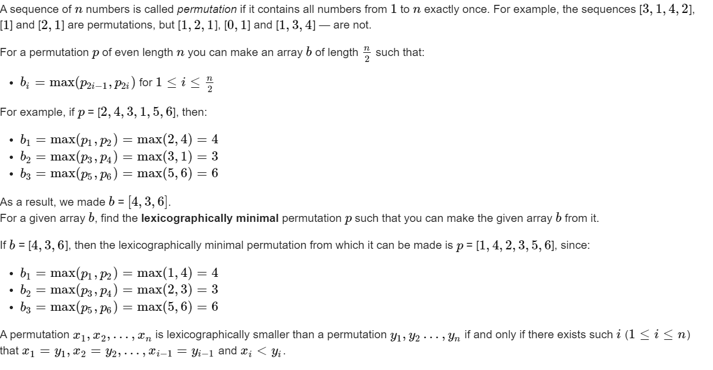

#### solve

字典序相关的贪心：

贪心角度：

正着看：

1. 最小的放前面：
   1. 发现放置最小的过程中，还要check后面是否无解。
   2. check的角度是： 放完最小元素， 是否后边的所有位置都有元素放。
   3. 即使有高效率的check手段， 但是也非常麻烦

平常字典序都是正着放最小。但是由于放置的资源是有限的， 是寻求一个匹配关系。因此可以逆向看；

1. 从后面开始看， 先放可放最大。
   1. 如果问题有解， 显然不会影响解的存在性。
   2. 将小的位置留给前面的位置。

#### code

```cpp
void work(int testNo)
{
	int n;
	cin >> n;
	vector<int> ans(n + 10 , 0);
	vector<bool> used(n + 10 , false);
	bool f = false;
	for (int i = 2; i <= n; i += 2) {
		cin >> ans[i];
		if (used[ans[i]]) f = true;
		used[ans[i]] = true;;
	}
	if (f) {
		cout << -1 << "\n";
		return;
	}
	set<int> rec;
	for (int i = 1; i <= n; i++) {
		if (!used[i])
			rec.insert(i);
	}
	for (int i = n - 1; i >= 0; i -= 2) {
		auto ptr = rec.upper_bound(ans[i + 1]);
		if (ptr == rec.begin()) {
			cout << -1 << "\n";
			return;
		}
		ptr--;
		ans[i] = *ptr;
		rec.erase(ptr);
	}
	for (int i = 1; i <= n; i++) {
		cout << ans[i] << " \n"[i == n];
	}
}
```

**D. Reverse Sort Sum**
https://codeforces.com/contest/1659/problem/D

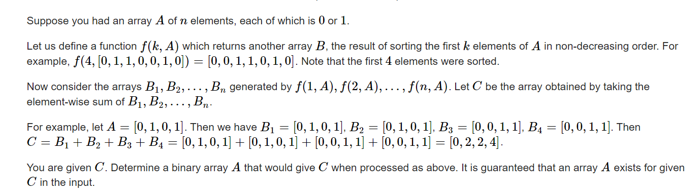

#### sove

非常精彩的思维过程：
开启思路的关键是问这几个问题：用问题来指导推理，挖掘现象，进而整理出可行算法：

1. 构造的顺序是什么？（正向 ，逆向）
2. 下面考虑逆向推导：
   1. 关注问题中的什么属性？精力集中点在于挖掘这些属性之间的关系。
   2. $a_n$的值怎么确定？ 
   3. 怎么将确定$a_n$的算法推广到 $a_i$

---------

1.1 逆向或者正向。综合题解， 逆向更容易理解：

2.1 方向比较多， 但还是尝试问一问自己。在这个问题中：

 	1. $a_i$
 	2. $c_i$
 	3. 前缀中1的个数。


2.2 

1. 关注$c_i$上的贡献情况。一类是在对应的数组中未经过排序的1贡献。 二类在对应数组中排序部分的贡献。
2. 对于最后一位
   1. $a_n = 1$ ： 1类（未经排序）贡献为n - 1 。 二类贡献为1. 总体上贡献为n
   2. $a_n = 0:$     2类 (未经排序）贡献 为0 。二类贡献为0或者1（取决于1的个数）     

2.3 

1. 据此相似地， 详细研究$c_i$的贡献。
2. 通过未排序地贡献就可以推导出$a_i$

**实现细节：**

1. 处理排序后贡献中： 涉及到了区间减的操作：
   1. 数据结构维护。
   2. 差分维护。

#### code

```cpp
int c[N] , a[N] , d[N];
void work(int testNo)
{
	int n;
	cin >> n;
	ll sum = 0;
	fill(c , c + n + 1 , 0);
	fill(d , d + n + 1 , 0);
	fill(a , a + n + 1 , 0);
	for (int i = 1; i <= n; i++) {
		cin >> c[i];
		sum += c[i];
	}
	int cunt = sum / n;
	int t = 0;
	for (int i = n; i >= 1 && cunt; i--) {
		t += d[i];
		d[i - 1]--;
		d[i - cunt]++;
		if (c[i] + t == i) {
			a[i] = 1;
			cunt--;

		}
	}
	for (int i = 1; i <= n; i++)
		cout << a[i] << " \n"[i == n];
}


signed main()
{
	ios::sync_with_stdio(false);
	cin.tie(0);

	int t; cin >> t;
	for (int i = 1; i <= t; i++)work(i);
}

/* stuff you should look for
* int overflow, array bounds
* special cases (n=1?)
* do smth instead of nothing and stay organized
* WRITE STUFF DOWN
* DON'T GET STUCK ON ONE APPROACH
*/
```

----

**D. Weight the Tree**
https://codeforces.com/contest/1646/problem/D

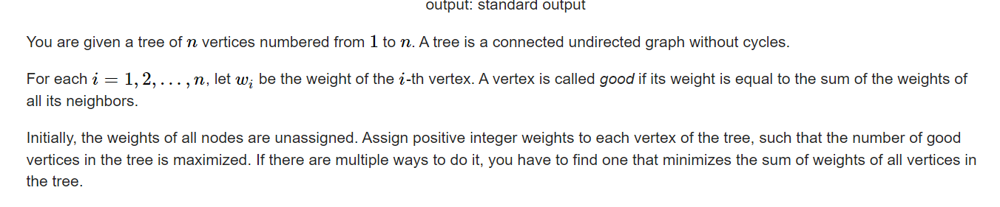

#### solve

一些很显然的观察：

1. 相邻节点不可能同时为good点。

然后就天然的转换成了一个树形dp问题：

**状态定义：**

下面两个状态在具体的存储类型中： 为pair<int , ll>类形。第一类取good点的个数。第二类取总权合和的负数（一种trick ， 转最大为最小。取反转最大值为最小问题。使用小于号重载....）

$f_i$：表示 i 点不作为good点的最优方案。

$g_i：$ 表示i点作为good点的的最优方案。

**转移方程**
$$
f_u = \sum _{v \in sons(u)} (g_v > f_v)?g_v : f_v 
$$

$$
g_u=\sum _{v \in sons(u)} f_v
$$

**初始化：**
$$
g_u = make\_pair(1 , deg_u)\\
g_u = make\_pair(0 , 1);
$$

#### 生长思考：

1. 关于树形dp的策略还原： 

   由于是阶段性转移非常具体。递归选择过程，很容易地确定具体最优方案；详见代码。

#### code

```cpp
vector<int> edg[N];
int w[N];
pair<int , ll> f[N] , g[N]; //表示当前是否为好点 ， 的最优方案。
void dfs(int u , int fa) {
	f[u] = make_pair(0 , -1);
	g[u] = make_pair(1 , -sz(edg[u]));

	for (auto v : edg[u]) {
		if (v != fa) {
			dfs(v , u);
			if (g[v] > f[v]) {
				f[u].fi += g[v].fi;
				f[u].se += g[v].se;
			} else {
				f[u].fi += f[v].fi;
				f[u].se += f[v].se;
			}
			g[u].fi += f[v].fi;
			g[u].se += f[v].se;
		}
	}
}
void dfs_(int u , int fa , bool good) {
	w[u] = good ? sz(edg[u]) : 1;
	for (auto v : edg[u]) {
		if (v != fa) {
			if (good) {
				dfs_(v , u , 0);
			} else {
				dfs_(v , u , g[v] > f[v]);
			}
		}
	}
}
signed main()
{
	ios::sync_with_stdio(false);
	cin.tie(0);
	int n;
	cin >> n;
	for (int i = 1; i < n; i++) {
		int u , v;
		cin >> u >> v;
		edg[u].push_back(v);
		edg[v].push_back(u);
	}
	if (n == 2) {
		cout << "2 2\n";
		cout << 1 << " " << 1 << "\n";
		return 0;
	}
	dfs(1 , 0);
	dfs_(1 , 0 , g[1] > f[1]);
	cout << (g[1] > f[1] ? g[1].fi : f[1].fi) << " " << (g[1] > f[1] ? -g[1].se : -f[1].se) << "\n";
	for (int i = 1; i <= n; i++) {
		cout << w[i] << " \n"[i == n];
	}
}
```


