# 七月下旬 ： 多校时训练：

**补题**
**多校补题：**

1. 多校
   1. [牛客第一场.md](..\..\problems\nowcoder\牛客多校\1多校.md)

   1. [多校第二场.md](..\..\problems\nowcoder\牛客多校\2多校.md) 

   1. [多校第三场.md](..\..\problems\nowcoder\牛客多校\3多校第三场.md) ==一道毒瘤题没补， 二维平面上的马拉车==

   1. [4多校第四场.md](..\..\problems\nowcoder\牛客多校\4多校第四场.md) ==太难了，补不动==

   1. [5多校.md](..\..\problems\nowcoder\牛客多校\5多校.md) ==队友补完等于我补完==

**算法学习**

1.  [数位dp进阶.md](..\..\Logrithm\动态规划\数位dp\进阶课\数位dp进阶.md)  ==3月之耻，梦幻岛宝珠==
1.  [最大流.md](..\..\Logrithm\图论\流匹配\最大流.md) ==没学完==

**刷题**

1.  [C. Baby Ehab Partitions Again.md](..\..\problems\codeforces\1700\性质挖掘\C. Baby Ehab Partitions Again.md) 
2.  [E. Rearrange Brackets.md](..\..\problems\codeforces\2100\模型\括号模型\E. Rearrange Brackets.md) 
3.  [游游的整数操作.md](..\..\problems\nowcoder\牛客周赛\模型性质挖掘\游游的整数操作.md)  这道有点像设置界限。不同点在于设置界限。
    1.  [D. Rating System.md](..\..\problems\codeforces\1800\模型性质挖掘\数字数组模型\D. Rating System.md) 数组模型挖掘：

**图论建模**

1. [D. Array Differentiation.md](..\..\problems\codeforces\1800\图论\建模\D. Array Differentiation.md)

**逆向思维**

1.  [C. Ntarsis' Set.md](..\..\problems\codeforces\1800\思维\逆向思维\C. Ntarsis' Set.md) 

**贪心：**

1.  [D. Slime Escape.md](..\..\problems\codeforces\1800\贪心\D. Slime Escape.md) 

**动态规划**

1.  [Bit Sequence.md](..\..\problems\XCPC\动态规划\数位dp\Bit Sequence.md) 
1.  [dls区间dp进阶课.md](..\..\Logrithm\动态规划\区间dp\区间动态规划进阶\dls区间dp进阶课.md)
1.  [状压dp进阶2.md](..\..\Logrithm\动态规划\状压dp\状态压缩dp进阶\状压dp进阶2.md) ==古文明化石== 

**构造**

1.  [B. Imbalanced Arrays.md](..\..\problems\codeforces\1800\构造\数组构造\B. Imbalanced Arrays.md)  ==jls==的代码思路分析：
1.  [C2. Dual (Hard Version).md](..\..\problems\codeforces\1900\构造\观察\C2. Dual (Hard Version).md) 

------

# ==多校1==

反思总结：

1. 签到卡了： 关于数学上的一些小计算，边界问题，没能够很好的处理。
2. 分类讨论应该沉下心来慢慢做：
3. 1 << 29 并没有1e9 ， 有时候并不可以作为题意中的无穷大。一般而言定义为1E9 + 7是最保险的。因为这个问题卡了一个小时。导致精力白白消耗：

# J Roulette

[J-Roulette_“范式杯”2023牛客暑期多校训练营1 (nowcoder.com)](https://ac.nowcoder.com/acm/contest/57355/J)

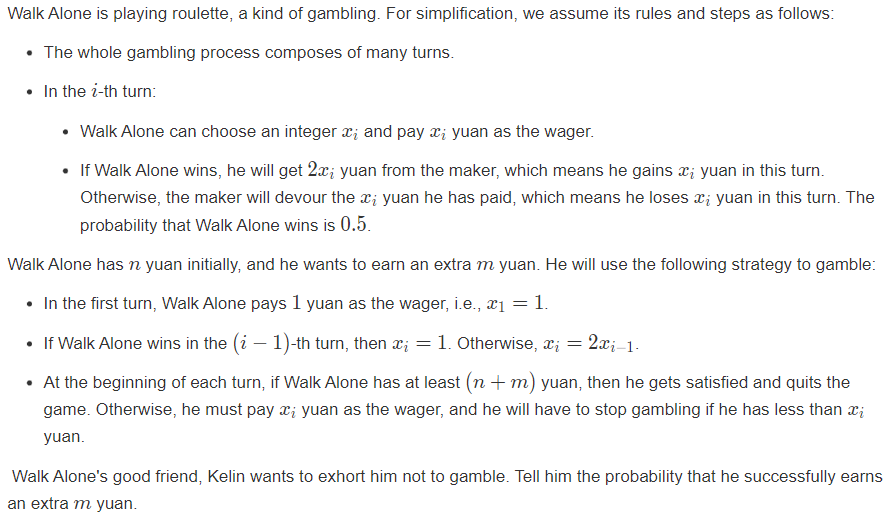

### solve

首先发现一个事实： 每赢一次其只赚一个金币： 于是对这一个解空间做一个全面把握：

1. 一共打了多少场？
2. 每一场的最多可以打多少场？ 

枚举每一场的所有可能事件， 于是最终就可以用一块$()\times () \times ()...\times()$ 计算。

**反思 ，总结：**

场上处理一些边界问题，用了非常多时间： 例如：

1. 确定当前金币下，最多可以打多少场：
   1. 二分即可：但是场上一直找规律，留在原地前进不了。
2. 计算等比数列的和：
3. 求逆元：

最后在170mins的才解决这个问题，如果能够省下精力解决其它问题，应该可以开出M题：

```cpp
const int inf = 1 << 29;
const ll INF = 1LL << 60;
const int N = 1E6 + 10;
const ll mod = 998244353;
ll qmi(ll a, ll b)
{
	ll res = 1;
	while (b)
	{
		if (b & 1)res = a * res % mod;
		a = a * a % mod;
		b >>= 1;
	}
	return res;
}

ll sum[50];

signed main()
{
	ios::sync_with_stdio(false);
	cin.tie(0);

	ll p = 1;
	sum[1] = 0;
	for (int i = 1; i <= 40; i++) {
		sum[i] += sum[i - 1] + p;
		p *= 2;
	}

	ll n, m;
	cin >> n >> m;
	ll ans = 1;
	for (ll l = n; l < n + m; l++) {
		// 首先求出这一块的有边界；
		// l - r;
		// 等比数列求和。
		// 0.5 ... 0.5^(x + 1)
		int id = upper_bound(sum + 1, sum + 32, l) - sum - 1;
		// ll r = min((1LL << (x + 1)) - 2, n + m - 1);
		ll r = min(sum[id + 1] - 1, n + m - 1);
		ll u = qmi(2, id) - 1;
		u = u * qmi(u + 1, mod - 2) % mod;
		ans = (ans * qmi(u, (r - l + 1)) % mod + mod) % mod;
		l = r;
	}
	cout << ans << "\n";
}
```


# A.

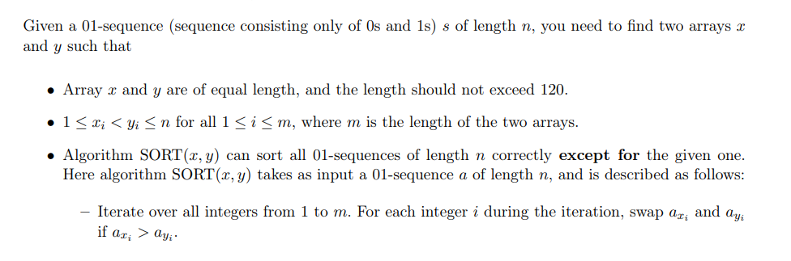

鉴定为赛时做不出来的构造：

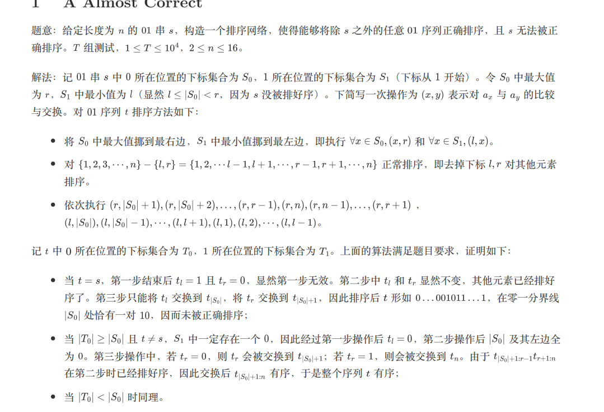

### 生长思考：

1. 关注01比特的位置序列：~~好了，没有其它角度了：~~
2. 对其余字符串进行分类：
   1. |$S_0$| 更大的。
   2. |$S_0$| 更小的。
3. 针对一个字符串的|$S_0$| 做一些交换操作。
4. 总体上，先做到什么样的局部排序，然后再根据|$S_0$|的特征做出一些交换排序操作。


```cpp
#include<bits/stdc++.h>
using namespace std;
using ll = long long;
#define dbg(x) cerr << "[" << __LINE__ << "]" << ": " << x << "\n"
#define all(x) (x).begin(),(x).end()
#define sz(x) (int)(x).size()
const int inf = 1E9 + 7;
const ll INF = 1E18 + 7;
const int N = 1E6 + 10;

void work(int testNo)
{
	int n;
	cin >> n;
	string s;
	cin >> s;
	vector<int> s0 , s1;
	vector<pair<int , int>> ans;
	for (int i = 0; i < n; i++) {
		if (s[i] == '0') s0.push_back(i + 1);
		else s1.push_back(i + 1);
	}
	//为了将该元素移动到最后，必须反序。
	reverse(all(s1));

	int l = s1.back()  , r = s0.back();
	// 第一步，内部将l , r移动。
	for (auto x : s0) if (x != r) ans.emplace_back(x , r);
	//将0移动到最右边。
	for (auto x : s1) if (x != l) ans.emplace_back(x , l);
	// 将l ， r外的元素正常排序。
	for (int i = 1; i <= n; i++) {
		if (i == l || i == r) continue;
		for (int j = i + 1; j <= n; j++) {
			if (j == l || j == r) continue;
			ans.emplace_back(i , j);
		}
	}
	//第三步：
	int len = sz(s0);
	// 必须是其中一个先手？
	for (int i = len + 1; i < r; i++)
		ans.emplace_back(r , i);
	for (int i = n; i > r; i--)
		ans.emplace_back(r , i);
	for (int i = len; i > l; i--)
		ans.emplace_back(l , i);
	for (int i = 1; i < l; i++)
		ans.emplace_back(l , i);
	cout << sz(ans) << "\n";
	for (auto [x , y] : ans) {
		// 为什么要排序一遍？ 规定了其情况。
		// 因此反序必然是互换位置的。
		if (x > y) swap(x , y);
		cout << x << " " << y << "\n";
	}
}
signed main()
{
	ios::sync_with_stdio(false);
	cin.tie(0);

	int t; cin >> t;
	for (int i = 1; i <= t; i++)work(i);
}
```

# D

[D-Chocolate_“范式杯”2023牛客暑期多校训练营1 (nowcoder.com)](https://ac.nowcoder.com/acm/contest/57355/D)

### solve:

正解：挺难的：

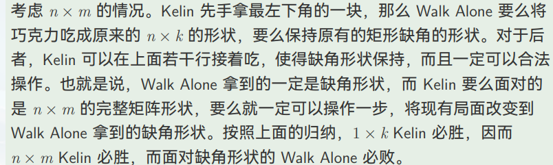


# H  Matches

题意朴素的一道题：

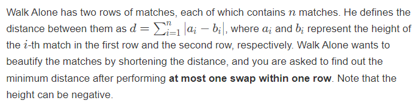

任何解集都可以转换成只在一个维度上的交换：

**集中精力解决的问题：**

1.  各种交换下的变化： 为了摸清细节： 进行一些概念的抽象：
    1. 抽象出两线段，来形象表述交换后的变化：
    2. 定义直线的方向： 
       1. 如果a大于b 为正 ，否则为负：
    3. 定义直线之间的关系：
       1. 正序关系， 同向：
       2. 偏序关系： 反向：
       3. 直线相交： 形象表述 
       4. 包含：     形象表述
       5. 分离       形象表述：
2.  讨论各种方式之后得到如下结论：
    1.  一共有6种情形，一一模拟之后发现只有两种情况是使总和变小的： 分别是
        1.  反向相交
        2.  反向包含：

    2.  减少的就是交集长度：


因此解决问题的方法是, 维护两个方向的直线，枚举一个方向的直线，然后找出另外一个方向与之相交的直线，于是找出最大交集：

维护方法：

1. 将直线pair<int , int>的比较符号进行一个排序：
2. 然后枚举一个方向的直线： 
   1. 在另一个方向的直线体系中 ， 二分找到第一个右端点大于直线低端的直线：于是找到了下界：
   2. 在另一个方向的直线体系中， 二分找到第一个第左端点在当前枚举至西安右端点之外的至西安，于是找到了上界：
3. 上述的复杂度挺假的，因为涉及到了暴力枚举： 但是这个应该可以用线段树优化：但是离散化什么的细节都很麻烦：

### code

```cpp
#include<bits/stdc++.h>
using namespace std;

using ll = long long;
using i64 = long long;
using ull = unsigned long long;
using ld = long double;
using uint = unsigned int;
using pii = pair<int, int>;
using pli = pair<ll, int>;
using pll = pair<ll, ll>;


#define dbg(x) cerr << "[" << __LINE__ << "]" << ": " << x << "\n"

#define all(x) (x).begin(),(x).end()
#define sz(x) (int)(x).size()
#define pb push_back
#define fi first
#define se second

const int inf = 1 << 29;
const ll INF = 1LL << 60;
const int N = 1E6 + 10;

int a[N], b[N];

signed main()
{
	ios::sync_with_stdio(false);
	cin.tie(0);
	int n;
	cin >> n;
	for (int i = 1; i <= n; i++) {
		cin >> a[i];
	}
	for (int i = 1; i <= n; i++) {
		cin >> b[i];
	}
	//分别维护两种方向的。
	vector<pair<ll, ll>> A, B;
	ll ans = 0;
	for (int i = 1; i <= n; i++) {
		int  x = a[i], y = b[i];
		ans += abs(x - y);
		if (x < y) A.push_back({ x , y });
		else B.push_back({ y , x });
	}
	sort(all(A));
	ll rr = -1E18;
	vector<ll> x, y, len;
	for (auto t : A) {
		int l = t.first;
		int r = t.second;
		if (r <= rr)
			continue;
		else {
			x.push_back(l);
			y.push_back(r);
			len.push_back(r - l);
			rr = r;
		}
	}
	ll res = 0;
	n = len.size();
	for (auto temp : B) {
		ll s = temp.first;
		ll t = temp.second;
		int idl = upper_bound(x.begin(), x.end(), s) - x.begin();
		int idr = lower_bound(y.begin(), y.end(), t) - y.begin();
		if (idl > 0)
			res = max(res, min(y[idl - 1] , t) - s);// 反序交叉。
		if (idr < n)
			res = max(res, t - max(x[idr] , s));
		if (idl < idr)
			res = max(res, *max_element(len.begin() + idl, len.begin() + idr));
	}
	cout << ans - 2 * res << "\n";
}
```


## 场外话：

反思：

1. 就个人习惯：
   1. 打比赛的过程中，保持情绪稳定。这个比赛一直在大喊大叫，把自己和荣栩的心态都搞炸了。
   2. 保持幽默感，不施加压力。
2. 策略上：
   1. 每个人都不应该死在一道题上： 包括荣栩。
   2. 同时得捏四道题，要不拿牌，要不签到题不过都无所谓。
   3. 为什么不开D呢？ 有时候必须正视签到没有卡了的情况：
      1. 给其他人开， 不听思路直接接盘。
      2. 合理分配 ， 减少损失： 
      3. 控制罚时，保守交签到题。
3. 合理分析，自己给出的小问题的答案：
   1. 比如这次，样例都没有过，但是自己就是死固执的死磕。

## 补题：

### F

[2023_牛客暑期多校训练营_2_Solution_Markdown.pdf (nowcoder.com)](https://uploadfiles.nowcoder.com/files/20230721/999991351_1689931950887/2023_牛客暑期多校训练营_2_Solution_Markdown.pdf)

[F-Link with Chess Game_2023牛客暑期多校训练营2 (nowcoder.com)](https://ac.nowcoder.com/acm/contest/57356/F)

博弈：其底层知识非常难想，其中大多数人都是靠猜出来的。

1. 这种复杂的博弈清形，即使是枚举优解都非常困难。

可以考虑的角度：

1. 简化博弈模型：
   1. 如果是一维的怎么样？
   2. 推广到三维怎么样？

有些许荒唐，但是这一场的后果说明，这是比手玩更加接近正确答案的方式。

其原理： 二分图博弈：

1. 若起始状态必定位于该二分图的最大匹配上，则先手必胜。否则先手必败。

如果n是偶数，显然很容易构造出一个完全匹配。

如果n是奇数：

1. 分类讨论点的情况： 如果$a + b + c$ 为偶数，那么这个点必须要作为最大匹配中的一个点。因为n是奇数情形下， 可以找到剩余1个点的匹配。如果a + b + c为偶数，那么省去这个点无法得到最大匹配。
2. 否则 ， $a + b + c$ 为奇数时，即使不考虑该点，也可以构造出一个最大匹配出来（剩余一个点。）

### H

[H-0 and 1 in BIT_2023牛客暑期多校训练营2 (nowcoder.com)](https://ac.nowcoder.com/acm/contest/57356/H)

思路比较简单就是，仔细考察其每一种操作的贡献： 然后使用前后缀硬搞即可。

1. 取反操作 ： 相当于贡献了一个规定长度内的超码。
2. 加一操作： 普通的加一操作。

先处理前后缀，再根据段的基本情况去计算出几个信息：

1. 段常数种的贡献情况。
2. 最后x是正数或是负数？

#### 犯了个很智障的错误：

1. 强制在线中，涉及到了l 到 $l_{real}$的计算： 找找差别？

   ```cpp
   cin >> l >> r >> str;
   // l = min((ans[qq - 1] ^ l) % n + 1 , (ans[qq - 1] ^ r) % n + 1);
   // r = max((ans[qq - 1] ^ l) % n + 1 , (ans[qq - 1] ^ r) % n + 1);
   
   
   // cout <<  l << " " << r << "\n";
   l = (ans[qq - 1] ^ l) % n + 1;
   r = (ans[qq - 1] ^ r) % n + 1;
   if (l > r) swap(l , r);
   ```

   

```cpp
#include<bits/stdc++.h>
using namespace std;
using ll = long long;

#define all(x) (x).begin(),(x).end()
#define sz(x) (int)(x).size()

const int inf = 1E9 + 7;;
const ll INF = 1E18 + 7;
const int N = 2E5 + 10;
const int M = 55;

// int A0[M][N] , A1[M][N] , B0[M][N] , B1[M][N];
int sum[N];
ll f[M][N];
ll ans[N];

signed main()
{
	ios::sync_with_stdio(false);
	cin.tie(0);
	int n , q;
	cin >> n >> q;
	string s;
	cin >> s;
	s = '#' + s;
	for (int i = n; i >= 1; i--) {
		sum[i] = sum[i + 1] + (s[i] == 'A');
	}
	for (int k = 1; k <= 50; k++) {
		const ll mod = 1LL << k;
		for (int i = n; i >= 1; i--) {
			if (s[i] == 'A') {
				if (sum[i + 1] % 2) {
					// - (mod - 1)
					f[k][i] = (f[k][i + 1] + 1) % mod;
				} else {
					// (+ mod - 1)
					f[k][i] = (f[k][i + 1] + (mod - 1)) % mod;
				}
			} else {
				if (sum[i + 1] % 2) {
					// -1
					f[k][i] = (f[k][i + 1] - 1 + mod) % mod;
				} else {
					// + 1
					f[k][i] = (f[k][i + 1] + 1) % mod;
				}
			}
		}
	}

	for (int qq = 1; qq <= q; qq++) {
		ll l , r;
		string str;
		cin >> l >> r >> str;
		// l = min((ans[qq - 1] ^ l) % n + 1 , (ans[qq - 1] ^ r) % n + 1);
		// r = max((ans[qq - 1] ^ l) % n + 1 , (ans[qq - 1] ^ r) % n + 1);
		// cout <<  l << " " << r << "\n";
		l = (ans[qq - 1] ^ l) % n + 1;
		r = (ans[qq - 1] ^ r) % n + 1;
		if (l > r) swap(l , r);

		ll x = 0;
		int kk = (int)str.size();
		const ll mod = 1LL << kk;
		// cout << str << "\n";
		for (int i = 0; i < (int)str.size(); i++) {
			x = (str[i] == '1') + x * 2;
		}
		// cout << x << "\n";
		ans[qq] = ((f[kk][l] - f[kk][r + 1]) % mod + mod) % mod;
		if (sum[r + 1] % 2) {
			ans[qq] = (-ans[qq] % mod + mod) % mod;
			// 取一个mod.
		}

		if ((sum[l] - sum[r + 1]) % 2) {
			ans[qq] = ((ans[qq] - x) % mod + mod) % mod;
		} else ans[qq] = (ans[qq] + x) % mod;

		vector<int> p;
		x = ans[qq];
		for (int j = 1; j <= kk; j++) {
			p.push_back(x % 2);
			x /= 2;
		}
		reverse(p.begin() , p.end());
		for (auto Bit : p) {
			cout << Bit;
		}
		cout << "\n";
	}
}
/* stuff you should look for
* int overflow, array bounds
* special cases (n=1?)
* do smth instead of nothing and stay organized
* WRITE STUFF DOWN
* DON'T GET STUCK ON ONE APPROACH
*/
```


### G

[G-Link with Centrally Symmetric Strings_2023牛客暑期多校训练营2 (nowcoder.com)](https://ac.nowcoder.com/acm/contest/57356/G)

Manacher:

1. 和回文串相似的处理方式，得到一个元素中心的半径：使用当前的成果。
2. 寻求一个最小的覆盖：
   1. 如果一个字符串具有合法划分，那么其中，如果$ABSB`A`$ 中  A内涵了一个对称串，就可以对其进行分割成 A + $BSB`+ A`$ 
   2. 于是问题转换成一种贪心思路，每次基于当前的覆盖情况，寻求下一个最小覆盖。


```cpp
#include<bits/stdc++.h>
using namespace std;

using ll = long long;

#define dbg(x) cerr << "[" << __LINE__ << "]" << ": " << x << "\n"

#define all(x) (x).begin(),(x).end()
#define sz(x) (int)(x).size()

const int inf = 1E9 + 7;
const ll INF = 1E18 + 7;
const int N = 5E6 + 10;

string one = "bqdpnuosxz#";
string two = "qbpdunosxz#";

bool checkself(char s) {
	return s == 'o' || s == 's' || s == 'x' || s == 'z' || s == '#';
}
bool check(char s , char t) {
	for (int i = 0; i < (int)one.size(); i++) {
		if (one[i] == s) return t == two[i];
	}
	return false;
}
void work(int testNo)
{
	string s1 , s;
	vector<int> d;
	cin >> s1;
	int n = (int)s1.size();
	s.resize(n * 2 + 1);
	for (int i = 0; i < n; i++) {
		s[i * 2] = '#';
		s[i * 2 + 1] = s1[i];
	}
	s[n * 2] = '#';
	n =  n * 2 + 1;
	d.resize(n);
	for (int i = 1 , l = -1 , r = -1 , k; i < n; i++) {
		if (checkself(s[i]) == false) {
			d[i] = 0;
			continue;
		}
		k = i > r ? 1 : min(d[l + r - i] , r - i);
		while (i - k >= 0 && i + k < n && check(s[i + k] , s[i - k]))k++;
		d[i] = --k;
		if (i + k > r)
			r = i + k , l = i - k;
	}
	// 然后在上面的基础上怎么进行一个匹配？
	int r = -1;
	for (int i = 0; i < n; i++) {
		if (checkself(s[i]) == false) {
			continue;
		}
		if (i - d[i] <= r  + 1) {
			r += 2 * (i - r - 1) + 1;
			i = r;
		}
	}

	// for (int i = 0; i < n; i++) {
	// 	cout << s[i] << " ";
	// }
	// cout << "\n";
	// for (int i = 0; i < n; i++) {
	// 	cout << d[i] << " ";
	// }
	// cout << "\n";
	// cout << n << " " << r << "\n";

	if (r != n - 1) {
		cout << "No\n";
	} else cout << "Yes\n";
}

signed main()
{
	ios::sync_with_stdio(false);
	cin.tie(0);

	int t; cin >> t;
	for (int i = 1; i <= t; i++)work(i);
}

/* stuff you should look for
* int overflow, array bounds
* special cases (n=1?)
* do smth instead of nothing and stay organized
* WRITE STUFF DOWN
* DON'T GET STUCK ON ONE APPROACH
*/
```


# 多校第三场：

sum : 5/ ranks : 153

凭运气做了一道140人过的题: 

# E Koraidon, Miraidon and DFS Shortest Path

[E-Koraidon, Miraidon and DFS Shortest Path_2023牛客暑期多校训练营3 (nowcoder.com)](https://ac.nowcoder.com/acm/contest/57357/E)

## solve

转换题意: 要求无论什么顺序dfs,都得到一颗只由简单路径组成的树:

1. 先根据实际的最小距离处理出一个图: 发现分层图需要满足以下的原则:
   当访问一条边(u, v)时:
   1. u , v在同一层(即d[u] = d[v]) ,那么显然答案是错误的.
   2. d[u] = d[v] - 1 , 显然没有影响:
   3. d[v] < d[u]; 要分析v是否为当前点的支配点:
      1. 实现方式: 支配树.


jls的写法:

1. 判断每个环上除了根以外的点,不能从根的子树外到达:

   然后就是个非常复杂的模拟了:

   ```cpp
   #include <bits/stdc++.h>
   
   using i64 = long long;
   
   // 并查集的作用？
   struct DSU {
   	std::vector<int> f, siz;
   	DSU() {}
   	DSU(int n) {
   		init(n);
   	}
   
   	void init(int n) {
   		f.resize(n);
   		std::iota(f.begin(), f.end(), 0);
   		siz.assign(n, 1);
   	}
   
   	int find(int x) {
   		while (x != f[x]) {
   			x = f[x] = f[f[x]];
   		}
   		return x;
   	}
   
   	bool same(int x, int y) {
   		return find(x) == find(y);
   	}
   
   	bool merge(int x, int y) {
   		x = find(x);
   		y = find(y);
   		if (x == y) {
   			return false;
   		}
   		siz[x] += siz[y];
   		f[y] = x;
   		return true;
   	}
   
   	int size(int x) {
   		return siz[find(x)];
   	}
   };
   
   
   void solve() {
   	int n, m;
   	std::cin >> n >> m;
   
   
   	std::vector<std::vector<int>> adj(n);
   	for (int i = 0; i < m; i++) {
   		int u, v;
   		std::cin >> u >> v;
   		u--, v--;
   		adj[u].push_back(v);
   	}
   
   
   	// 深度， 父亲 ， ？？ ？？
   	std::vector<int> dep(n, -1), parent(n, -1), in(n), out(n);
   	std::vector<bool> vis(n);
   
   
   	// ？？
   	std::vector<int> lim(n, 0);
   
   	bool ok = true;
   	DSU dsu(n);
   	int cur = 0;
   
   	// dfs解决几个问题：
   	/*
   	1.dfs序中的l , r记录了非路径上的可达点。。
   	*/
   	std::vector<std::pair<int, int>> e;
   	auto dfs = [&](auto self, int x) -> void {
   		in[x] = cur++;
   		for (auto y : adj[x]) {
   
   			// 没有遍历过的边。
   			if (dep[y] == -1) {
   				dep[y] = dep[x] + 1;
   				parent[y] = x;
   				self(self, y);
   
   			}
   			// 已经处理完可达点的边。
   			else if (vis[y]) {
   
   				// vis 打的也很有特色： 将所有点都遍历完之后才打标记：
   				// 下面说明指向了其它树而且指向点的路径长度不同： 说明受到了顺序的影响：
   				if (dep[y] != dep[x] + 1) {
   					ok = false;
   				}
   			} else {
   
   				// 遍历过未处理完的边，即当前的返祖边。
   				e.emplace_back(x, y);
   			}
   		}
   		vis[x] = true;
   		out[x] = cur;
   	};
   	dep[0] = 0;
   	dfs(dfs, 0);
   
   
   	// 对边进行一个排序： 按照到达点的深度降序。
   	std::sort(e.begin(), e.end(), [&](auto a, auto b) {
   		return dep[a.second] > dep[b.second];
   	});
   
   
   	// 检查每一个返祖边：
   	for (auto [x, y] : e) {
   		for (int i = dsu.find(x); dep[i] > dep[y]; i = dsu.find(i)) {
   			dsu.merge(parent[i], i);
   
   			// lim数组是什么意思呢？
   			// 一步一步往上爬：
   			// 环的顶点
   			// 这一大块都是处理环：
   
   			// 记录环的头顶：
   			lim[i] = y;
   		}
   	}
   
   	for (int i = 0; i < n; i++) {
   		for (auto j : adj[i]) {
   			//检查每一条边：
   
   			// 判断当前i是否为j节点上的环外的点。
   
   			// 如果没有环就是根。 可以覆盖所有点，同时保证有解，是比较厉害的归纳技巧：
   			if (in[i] < in[lim[j]] || in[i] >= out[lim[j]]) {
   				ok = false;
   			}
   		}
   	}
   
   	if (ok) {
   		std::cout << "Yes\n";
   	} else {
   		std::cout << "No\n";
   	}
   }
   
   int main() {
   	std::ios::sync_with_stdio(false);
   	std::cin.tie(nullptr);
   
   	int t;
   	std::cin >> t;
   
   	while (t--) {
   		solve();
   	}
   
   	return 0;
   }
   ```

   

### 生长:

1. 从jls的代码中,可以学到一般图的环的处理; 同时借助dfs序,对dfs过程分出多个块,然后可以找出环与环相关的点的关系.

## B (DP)

[B-Auspiciousness_2023牛客暑期多校训练营3 (nowcoder.com)](https://ac.nowcoder.com/acm/contest/57357/B)


## solve

定义小数($x<= n$) 大数($y \gt n$)

考察所有解的一个解集: 
发现贡献的前缀满足一个性质: 

1. 连续递增的小数,连续递减的大数段组成.


**状态设计:** 

$dp_{i , j , k}$ 表示: 大数已经放了i个 , 小数放了j个 , 当前结尾为小大数0/1 情形下的方案数:

**状态转移**
$$
dp_{i , j ,0} , 枚举前面的k长度的连续减少的段;\\
dp_{i , j , 0} += dp_{i -k, j , 1} \times C(k , n +k - i)
$$

$$
dp_{i , j ,1} 同上:\\
dp_{i , j ,1} +=  dp_{i , j - k , 0} \times C(k , n + k - j)
$$

注意k的范围:

**计算ans**

每次基于当前前缀下的合法方案总数:当前的位置考虑前缀下: 当前(i + j + 1)位贡献的总数:
$$
ans += (dp_{i , j , 0} + dp_{i , j ,1}) \times A(2\times n - i - j)
$$
注意：特殊的 0 0不做贡献。
 **初始化:**

$dp_{0 , 0 ,0} = 1 , dp_{0 , 0 , 1} = 1$
$ans = A(2\times n)$

### code

```cpp
#include<bits/stdc++.h>
using namespace std;
using ll = long long;

#define all(x) (x).begin(),(x).end()
#define sz(x) (int)(x).size()

const int inf = 1E9 + 7;
const ll INF = 1E18 + 7;
const int N  = 310;

ll c[N][N];
ll a[N];
ll f[N][N][2];
void C_init(const ll mod , const int N_c) {
	for (int i = 1; i <= N_c; ++i) {
		c[i][0] = c[i][i] = 1;
		for (int j = 1; j < i; ++j) {
			c[i][j] = (c[i - 1][j] + c[i - 1][j - 1]) % mod;
		}
	}
	a[0] = 1;
	for (int i = 1; i <= 2 * N_c; i++)
		a[i] = a[i - 1] * i % mod;
}
//注意范围
//小心me
void work(int testNo){
	int n , mod;
	cin >> n >> mod;
	C_init(mod , n);
	vector<vector<array<ll , 2>>> f(n + 1 , vector<array<ll , 2>>(n + 1 , {0}));
	// memset(f , 0 , sizeof f);
	f[0][0][0] = f[0][0][1] = 1;
	ll ans = a[2 * n];
	for (int i = 0; i <= n; i++) {
		for (int j = 0; j <= n; j++) {
			for (int k = 1; k <= i; k++) {
				(f[i][j][0] += f[i - k][j][1] * c[n + k - i][k]) %= mod;
			}
			for (int k = 1; k <= j; k++) {
				(f[i][j][1] += f[i][j - k][0] * c[n + k - j][k]) %= mod;
			}
			if ((i == 0 && j == 0) || (i == n && j == n)) continue;
			(ans += (f[i][j][0] + f[i][j][1]) * a[2 * n - i - j]) %= mod;
		}
	}
	cout << ans << "\n";
}
signed main(){
	ios::sync_with_stdio(false);
	cin.tie(0);
	int t; cin >> t;
	for (int i = 1; i <= t; i++)work(i);
}
```

### 生长：

1. 明确的，看复杂度可以看出这是个$N^3$的dp。
2. 沾点组合数。
   把握解集合这一步很精彩：
3. 合法的前缀（通过策略可以胜利）, 满足相关的性质：
   1. 由上升小数段和下降大数段组合而成。

## G

[G-Beautiful Matrix_2023牛客暑期多校训练营3 (nowcoder.com)](https://ac.nowcoder.com/acm/contest/57357/G)


-----

# 多校第四场

太难了， 补不动：

### H ： Merge the squares!

[H-Merge the squares!_2023牛客暑期多校训练营4 (nowcoder.com)](https://ac.nowcoder.com/acm/contest/57358/H)

### solve

~~满脑子想着构造：~~

但是正解是： （题解以及jls的code：）

1. 算出某种构造方式中的最小最小操作值： 然后根据这个最小操作值，进行一个操作的转移分割：


==**challenge1**==

有两种方式：（第一个突破点：就是寻找一种简单的分割方式：）

1. 如下jls的辗转相除法：
2. 其中一些结论得通过数学功底看出来。如果看出这种方式就可以得到优解 ， 那就转成下述问题：

==challenge2==

知道了上述的构造方式之后，通过已经算出的每种状态下的处理方式，得到特定解：

### code

jls代码

```cpp
#include <bits/stdc++.h>

using i64 = long long;

int main() {
    std::ios::sync_with_stdio(false);
    std::cin.tie(nullptr);
    
    std::vector<int> f(1001);
    for (int i = 2; i <= 1000; i++) {
        for (int j = 1; j < i; j++) {
            int cnt = 1;
            int a = j, b = i - j;
            while (b) {
                cnt += a / b;
                a %= b;
                std::swap(a, b);
            }
            if (cnt <= 25) {
                f[i] = j;
                break;
            }
        }
        assert(f[i] != 0);
    }
    std::vector<std::array<int, 3>> ans;
    int n;
    std::cin >> n;
    
    auto solve = [&](auto self, int x1, int y1, int x2, int y2) -> void {
        if (x2 - x1 == y2 - y1) {
            if (x2 - x1 == 1) {
                return;
            }
            int k = f[x2 - x1];
            self(self, x1, y1, x1 + k, y1 + k);
            self(self, x1 + k, y1 + k, x2, y2);
            self(self, x1, y1 + k, x1 + k, y2);
            self(self, x1 + k, y1, x2, y1 + k);
            ans.push_back({x1, y1, x2 - x1});
            return;
        }
        if (x2 - x1 > y2 - y1) {
            int d = y2 - y1;
            self(self, x1, y1, x1 + d, y2);
            self(self, x1 + d, y1, x2, y2);
        } else {
            int d = x2 - x1;
            self(self, x1, y1, x2, y1 + d);
            self(self, x1, y1 + d, x2, y2);
        }
    };
    solve(solve, 0, 0, n, n);
    
    std::cout << ans.size() << "\n";
    for (auto [x, y, k] : ans) {
        std::cout << x + 1 << " " << y + 1 << " " << k << "\n";
    }
    
    return 0;
}
```


my code

```cpp
#include<bits/stdc++.h>
using namespace std;
using ll = long long;

#define all(x) (x).begin(),(x).end()
#define sz(x) (int)(x).size()

const int inf = 1E9 + 7;;
const ll INF = 1E18 + 7;
const int N = 1010;
int f[N] , mx[N];
vector<array<int , 3>> ans;

void dfs(int x1 , int y1 , int x2 , int y2) {
	// 正方形：
	if (x2 - x1 == y2 - y1) {
		// 不需要递归了：
		if (x2 - x1 == 1) return;
		// 分割的情况：
		int k = f[x2 - x1];
		//左上正方形：
		dfs(x1 , y1 , x1 + k , y1 + k);
		//右下正方形
		dfs(x1 + k , y1 + k , x2 , y2);
		//左下矩形
		dfs(x1 , y1 + k , x1 + k , y2);
		// 右上矩形
		dfs(x1 + k , y1 , x2 , y1 + k);
		ans.push_back({x1 , y1 , x2 - x1});
	}
	//当前是长方形
	else if (x2 - x1 > y2 - y1) {
		//长方形的辗转分割：
		int d = y2 - y1;
		dfs(x1 , y1 , x1 + d , y1 + d);
		dfs(x1 + d , y1 , x2 , y2);
	} else {
		int d = x2 - x1;
		dfs(x1 , y1 , x1 + d , y1 + d);
		dfs(x1 , y1 + d , x2 , y2);
	}
}

signed main()
{
	ios::sync_with_stdio(false);
	cin.tie(0);
	int n;
	cin >> n;
	memset(mx , 0x3f , sizeof mx);
	for (int i = 2; i <= n; i++) {
		for (int j = 1; j < i; j++) {
			// 最后必然合并：
			int cnt = 1;
			// 长方形的两条边：
			int a = i , b = i - j;
			while (b) {
				// 区分，合并成多少次：
				cnt += a / b;
				// 辗转相除法：
				a %= b;
				swap(a , b);
			}
			if (cnt < mx[i]) {
				// 记录当前状态的最优划分：比较优秀的划分：
				// 为什么是25？
				// 可能是处于一些定理的应用，计算。
				// 是否可以确定最后不超？
				// 黄金分割附近是优秀的。。
				// 那么m <= 1E6 是否可以得到保证呢？
				// 不懂》平时这种分割去思考下斐波那契，黄金分割等东西吧：
				mx[i] = cnt;
				f[i] = j;
			}
		}
	}
	dfs(0 , 0 , n , n);
	cout << sz(ans) << '\n';
	for (auto [x , y , z] : ans) {
		cout << x + 1 << " "  << y + 1 <<  " " << z << "\n";
	}
}
/* stuff you should look for
* int overflow, array bounds
* special cases (n=1?)
* do smth instead of nothing and stay organized
* WRITE STUFF DOWN
* DON'T GET STUCK ON ONE APPROACH
*/
```


### L We are the Lights

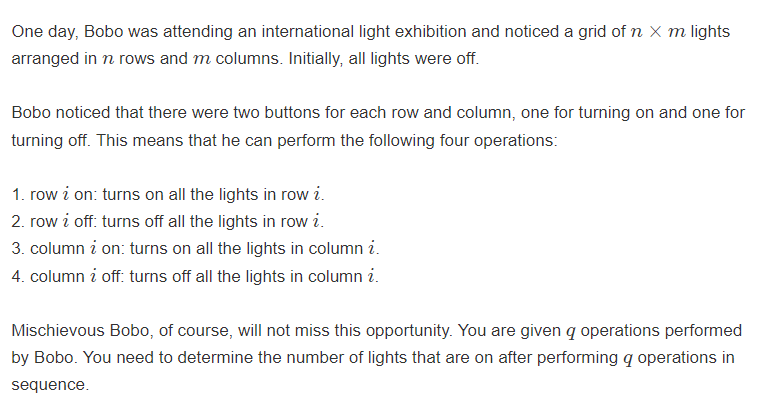

经典的逆向思维： 铺地毯问题；但是全队都差点被卡死，有点离谱：

```cpp
#include<bits/stdc++.h>
using namespace std;
using ll = long long;

#define all(x) (x).begin(),(x).end()
#define sz(x) (int)(x).size()

const int inf = 1E9 + 7;;
const ll INF = 1E18 + 7;
const int N = 1E6 + 10;

signed main()
{
	ios::sync_with_stdio(false);
	cin.tie(0);
	int n, m, k;
	cin >> n >> m >> k;
	vector<array<int, 3>> op(k + 1);
	for (int i = 0; i < k; i++) {
		string s;
		int c;
		string t;
		cin >> s >> c >> t;
		if (s == "row")  op[i][0] = 0;
		else op[i][0] = 1;
		op[i][1] = c;
		if (t == "on") op[i][2] = 1;
		else op[i][2] = 0;
	}
	set<int> rec1[2], rec0[2];
	ll ans = 0;
	for (int i = k - 1; i >= 0; i--) {
		//auto [a, b, c] = op[i];
		int a = op[i][0], b = op[i][1], c = op[i][2];
		// 列操作
		if (a == 1) {
			// 关闭：
			if (c == 0) {
				// 之前打开过：
				if (rec1[1].count(b)) continue;
				rec1[0].insert(b);
				continue;
			}
			//打开
			else if (c == 1) {
				// 之前关闭过一行, 或者打开过
				if (rec1[1].count(b) || rec1[0].count(b)) {
					continue;
				}
				else {
					// 打开了多少行：
					ans += n - rec0[1].size();
					// 关闭过多少行。
					ans -= rec0[0].size();
				}
				rec1[1].insert(b);
			}
		}
		else {
			// 关闭：
			if (c == 0) {
				if (rec0[1].count(b)) continue;
				rec0[0].insert(b);
				continue;
			}
			else if (c == 1) {
				// 之前关闭过一行, 或者打开过
				if (rec0[1].count(b) || rec0[0].count(b)) {
					continue;
				}
				else {
					// 打开了多少行：
					ans += m - rec1[1].size();
					// 关闭过多少行。
					ans -= rec1[0].size();
				}
				rec0[1].insert(b);
			}
		}
	}
	cout << ans << '\n';
}
```


# 多校5

段错误极多 ， 手速极其慢：

[牛客竞赛_ACM/NOI/CSP/CCPC/ICPC算法编程高难度练习赛_牛客竞赛OJ (nowcoder.com)](https://ac.nowcoder.com/acm/contest/57359)

### [I-The Yakumo Family_2023牛客暑期多校训练营5 (nowcoder.com)](https://ac.nowcoder.com/acm/contest/57359/I)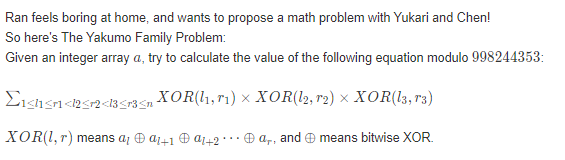

[一类二进制拆位算贡献的题目： - 知乎 (zhihu.com)](https://zhuanlan.zhihu.com/p/647165385)

生长： [H-Problem H. xor_2021 CCPC 新疆省赛 (nowcoder.com)](https://ac.nowcoder.com/acm/contest/22754/H)

###  solve

1. 第一个观察：

$\sum XOR(l_1 , r_1)\times XOR(l_2 , r_2) \times XOR(l_3 , r_3)$

显然可以变成，不相交的三部分和的乘积。

2. tips2:

   考虑维护一些信息：

   1. $f_1(i)$ 表示：维护前缀： 1...i区间中所有异或段的和；
   2. $f_3(i)$ 表示：维护后缀： i...n区间中所有异或段的和：

   **求出上述维护的关键** 现在考虑$f_1$ 的求法：

   1. 显然$f_{i-1}$ -> $f_i$

   2. 所有新增的信息是以i为结尾的一些段： 不断地维护上个区间地尾部，从而转移到当前求取区间地尾部：具体的维护方法如下：

      1. 显然是不能和加减法进行分配律的。

      2. 当之前维护的尾段，异或上当前这个段后会发生什么变化？

         每一个尾段值，发生对应的异或运算的变化。

      3. 那么怎么统计这些变化？

         发现每一个数都可以拆位成若干权的进制位的变化。同时，我们可以记录每个位权对应的尾段个数。

         1. 如果j位上，$a_i$ 位上为1。该位为0 -> 1 ， 1 -> 0
         2. 如果j位上，$a_i$ 位上为0。那么原来维护的尾段不会发生变化。
         3. 同时增加尾段集合$a_i$ 对信息的贡献。

      4. 统计具体值：

         每一个位独立贡献。且每一个位上为1的尾段又独立贡献直接计算即可：

   ```cpp
   ll pre[32][2] {};
   for (int i = 1; i <= n; i++) {
       f1[i] = f1[i - 1];
       for (int j = 0; j <= 29; j++) {
           if ((a[i] >> j & 1)) {
               swap(pre[j][0] , pre[j][1]);
           }
           pre[j][a[i] >> j & 1]++;
           // cout << pre[j][1] << " \n"[j == 29];
           add(f1[i] , pre[j][1] * (1LL << j) % mod);
       }
   }
   
   int suf[32][2] {};
   for (int i = n ; i >= 1; i--) {
       f3[i] = f3[i + 1];
       for (int j = 0; j <= 29; j++) {
           if ((a[i] >> j & 1)) {
               swap(suf[j][0] , suf[j][1]);
           }
           suf[j][a[i] >> j & 1]++;
           add(f3[i] , suf[j][1] * (1LL << j) % mod);
       }
   }
   ```

----

进一步得到答案：
维护信息：$f_2(i) : $ 表示第二个段以i为结尾的的前两个段的方案数。
在上述的过程中，依然可以得到一些启发：

**第一个集中精力解决的问题：假设知道$f_2(i-1)$ , 对$f_2(i)$? 对有什么帮助**

1. 发现是在$f_2(i - 1)$尾端拼接$a_i$。尾段区间异或上这个数之后，$f_2(i -1)$相关的贡献变化如下：

   $(A)\times (B)$  , 就是考虑B中的变化

   另外一类贡献是,$a_i$ 单独做一个区间， 此时转移与$f1(i - 1)$ 相关。

**第二个集中精力解决的问题：把握$f_2(i - 1)$接上$a_i$之后， 即（A）$\times$ (B)的变化。**  

其实只需要考虑B中的变化， 于是我们拆位，然后就可以简单清晰的把握住接上$a_i$ 之后你， B结构的变化。用$pre[i][1/0]$ 来做相关的维护。$a_i$ 做独立区间的贡献此时也要考虑进去。这影响了问题的计算。

```cpp
for (int i = 2; i < n; i++) {
    f2[i] = f2[i - 1] + f1[i - 1] * a[i];
    for (int j = 0; j < 30; j++) {
        if ((a[i] >> j & 1) == 0) {
            continue;
            pre[j][0] += f1[i - 1];
        } else {
            f2[i] += pre[j][0];
            f2[i] %= mod;
            f2[i] -= pre[j][1];
            f2[i] = (f2[i] % mod + mod) % mod;
            pre[j][1] += f1[i - 1];
        }
    }
    add(ans , 1LL * f2[i] * f3[i + 1] % mod);
}
```


```cpp
#include<bits/stdc++.h>
using namespace std;
using ll = long long;

#define all(x) (x).begin(),(x).end()
#define sz(x) (int)(x).size()

const int inf = 1E9 + 7;;
const ll INF = 1E18 + 7;
const int N = 2E5 + 10;
const int mod = 998244353;

int a[N];

int f1[N];
int f2[N];
int f3[N];
ll pre[32][2];

void add(ll & a , int b) {
	a += b;
	if (a >= mod) a -= mod;
}
signed main()
{
	ios::sync_with_stdio(false);
	cin.tie(0);

	int n;
	cin >> n;
	for (int i = 1; i <= n; i++) {
		cin >> a[i];
	}

	f1[1] = a[1];
	int ppre = a[1];
	for (int i = 2; i <= n; i++) {
		ppre = (ppre ^ a[i]) + a[i];
		f1[i] = f1[i - 1] + ppre;
		f1[i] %= mod;
	}

	f3[n] = a[n];
	int suf = a[n];
	for (int i = n - 1; i > 0; i--) {
		suf = (suf ^ a[i]) + a[i];
		f3[i] = f3[i + 1] + suf;
		f3[i] %= mod;
	}
	ll ans = 0;

	for (int i = 2; i < n; i++) {
		f2[i] = f2[i - 1] + f1[i - 1] * a[i];
		for (int j = 0; j < 30; j++) {
			if ((a[i] >> j & 1) == 0) {
				continue;
				pre[j][0] += f1[i - 1];
			} else {
				f2[i] += pre[j][0];
				f2[i] %= mod;
				f2[i] -= pre[j][1];
				f2[i] = (f2[i] % mod + mod) % mod;
				pre[j][1] += f1[i - 1];
			}
		}
		add(ans , 1LL * f2[i] * f3[i + 1] % mod);
	}
	cout << ans << "\n";
}

/* stuff you should look for
* int overflow, array bounds
* special cases (n=1?)
* do smth instead of nothing and stay organized
* WRITE STUFF DOWN
* DON'T GET STUCK ON ONE APPROACH
*/
```


**数位dp进阶**

### 数数3

[数数3 - 题目 - Daimayuan Online Judge](http://oj.daimayuan.top/course/8/problem/248)

求区间中有多少个数字a满足存在连续三个数位 $a_i , a_{i + 1} , a_{i + 1}$使得$a_{i} < a_{i + 1}<a_{i + 2}$

 [basic.md](..\basic.md) 参照题解：

```cpp
#include<bits/stdc++.h>
using namespace std;
using ll = long long;

const int N = 1E6 + 10;

ll dp[20][2][20][5];


//用单词前三个的习惯。
ll dfs(int rem , int exit , int pre , int inc) {
	if (rem == 0) return exit;
	if (dp[rem][exit][pre][inc] != -1)
		return dp[rem][exit][pre][inc];

	ll &res = dp[rem][exit][pre][inc];
	res = 0;

	for (int i = 0; i <= 9; i++) {
		int inc_ = (i > pre) ? min(inc + 1 , 3) : 1;
		res += dfs(rem - 1 , exit || inc_ == 3 , i , inc_);
	}
	return res;
}

ll solve(ll x) {
	x++;//细节1
	vector<int> d;
	while (x) {d.push_back(x % 10); x /= 10;}
	//处理前导0的情况。
	ll ans = 0;
	int m = d.size();
	reverse(d.begin(), d.end());
	for (int i = 1; i < m; i++) {
		for (int j = 1; j <= 9; j++) {
			ans += dfs(i - 1, 0 , j , 1);
		}
	}
	//然后处理贴着上界走的情况。
	int exit = 0 , pre = 0, inc = 0;
	for (int i = 0; i < m; i++) {
		for (int j = (i == 0); j < d[i] ; j ++) {
			//同时要记录前缀的一些信息。
			int inc_ = (j > pre) ? min(inc + 1 , 3) : 1;
			ans += dfs(m - i - 1 , exit || inc_ == 3, j , inc_);
		}
		inc = (d[i] > pre) ? min(inc + 1, 3) : 1;
		pre = d[i];
		exit |= (inc == 3);
	}
	return ans;
}

int main()
{
	ios::sync_with_stdio(false);
	cin.tie(0);

	memset(dp , -1 , sizeof dp);
	ll l , r;
	cin >> l >> r;
	cout << solve(r) - solve(l - 1) << '\n';
}

```

### CF Round #739 (Div 3) F, Nearest Beautiful Number

[Problem - F2 - Codeforces](https://codeforces.com/contest/1560/problem/F2)

找到最小的 ， 满足大于等于n的， 美丽数位k的数字。

#### solve.

暴力搜索加剪枝：并不是数位dp的解法。

1. 可以估算复杂度非常小 ， 为n的字符值之和。

   1. dfs算法从可能的最小数字解开始进行枚举

#### code

```cpp
#include<bits/stdc++.h>
using namespace std;
typedef long long ll;

const int oo = 0x0fffffff;
const int N = 1E6 + 10;

void work(int testNo)
{
	int  n , k; cin >> n >> k;
	vector<int> d;
	//尽量开大一点，拓展当前值域，增多可表达内容。
	int vis[10] {};
	while (n) {d.push_back(n % 10); n /= 10;}
	reverse(d.begin() , d.end());
	// x： 表示当前遍历的位置。 large，前缀是否大于规定的前缀。nums前面的k的前缀中数字的种数。
	function<bool (int , int , int , int)> dfs = [&](int x , int large , int nums , int cunt) {
		//能走到一步必然有解了。
		if (x == (int)d.size()) {
			cout << nums << '\n';
			return true;
		} else {
			//然后从哪里开始枚举呢？分情况。
			//如果已经large。那么就从0开始。否则从 d[x]开始
			for (int i = (large ? 0 : d[x]); i <= 9; i++) {
				//然后开始各种枚举枚举构造大法。
				vis[i] += 1;
				int ncunt = cunt;
				if (vis[i] == 1)ncunt += 1;
				if (ncunt <= k && dfs(x + 1 , large | (i > d[x]) , nums * 10 + i , ncunt)) {
					return true;
				}
				vis[i] -= 1;
			}
			return false;
		}
	};
	dfs(0 , 0 , 0 , 0);
}

int main()
{
	ios::sync_with_stdio(false);
	cin.tie(0);

	int t; cin >> t;
	for (int i = 1; i <= t; i++)work(i);
}

/* stuff you should look for
* int overflow, array bounds
* special cases (n=1?)
* do smth instead of nothing and stay organized
* WRITE STUFF DOWN
* DON'T GET STUCK ON ONE APPROACH
*/
```

### **乘法**

[乘法 - 题目 - Daimayuan Online Judge](http://oj.daimayuan.top/course/8/problem/185)

#### 简介：

将乘法转换成加减法组合的最小花费。

#### solve

1. 从高位到低位考虑：

   ​           定义$S_i$  = $a_{1}....a_i000000(i-1个0)$二进制串的值。T为前期操作地结果。

   1. 假设现在枚举到了第i位。要有解，必须满足：
      1. $S-T =0$或者$T-S=(1<<(i))$
      2. 否则，在低位进行任意加减操作。都不会把差异消除。

2. 状态设计

   从高位到低位对应 $i=1......i=n$

   $f_i$表示从高位开始考虑到了第i个位置。

   $g_i$表示从高位开始考虑到了第i个位置。$T_{i} - S_i=(2^{n-i})$

3. 初始化：

   1. $f_0=0,g_i=1$

4. 状态转移方程

   1. 如果$s_i='0'$
      1. 对于$f_i$有如下转移：
         1. $f_{i-1}$啥都不变。
      2. 对于$g_i$有如下方案
         1. $f_{i-1}$ , 对应方案加当前位权。
         2. $g_{i-1}$，对应方案减去当前位权。
   2. 如果$s_i='1'$
      1. 对于$f_i$
         1. $g_{i-1}$对应的方案减去当前位权。
         2. $f_{i-1}$对应的方案加上当前为位权。
      2. 对于$g_i$
         1. $g_{i-1}$对应的方案减去当前位权。

#### code

```cpp
#include<bits/stdc++.h>
using namespace std;
using ll = long long;
const int N = 1E6 + 10;
int f[N] , g[N];

int main()
{
	ios::sync_with_stdio(false);
	cin.tie(0);
	string s; cin >> s;
	int n = s.size();
	s = ' ' + s;
	fill(f , f + 1 + n , N);
	fill(g , g + 1 + n , N);
	f[0] = 0; g[0] = 1;
	for (int i = 1 ; i <= n; i++) {
		if (s[i] == '1' ) {
			f[i] = min(f[i - 1] + 1 , g[i - 1] + 1);
			g[i] = g[i - 1];

		} else {
			f[i] = f[i - 1];
			g[i] = min(f[i - 1] + 1 , g[i - 1] + 1);
		}
		//cout << "now is  " << i << "  " << f[i] << "  " << g[i] << '\n';
	}
	cout << f[n] * 2 - 1 << '\n';
}
```

-------------

###  P3188 [HNOI2007]梦幻岛宝珠

特殊的01背包问题。
特殊点：

1. 物品的重量大小比较特殊： $w = a2^b$
2. 背包总承受重量非常大。

#### 10mins

关注数字的特殊性：

1. 数字都是一个二进制数的倍数。
2. a , b都非常小。
   可以优化值域，枚举一些特殊的二进制数字。

#### solve

考虑将背包按照b分组。$s=\sum a$

##### 关注几个现象

1. 重量的形式非常特殊。考虑b类的物品时，比b更低位的位，无论怎么变化都和全0下的空间的大小是等效的。因为这点大小的空间下，无法影响某空间问题下考察的方案数。
2. 当枚举到b=15时候，是否意味着高十五位的空间变化都需要分别独立记录？参与转移
   1. 发现b = 15中的物品通过组合看，空间至多是$s\times 2^b$。 因此我们对上述空间的压缩为：留下的多少


面对这些现象可以采取什么样的策略？

```cpp
#include <bits/stdc++.h>
using namespace std;
typedef long long ll;
const ll inf = 1ll << 60;

vector<pair<int, int>> item[40];
ll f[2010], g[2010];
int n, W;

void solve() {
	int s = 0;
	for (int i = 0; i <= 30; i++) item[i].clear();
	for (int i = 0; i < n; i++) {
		int w, v;
		scanf("%d%d", &w, &v);
		int lev = __builtin_ctz(w);
		w >>= lev;
		item[lev].push_back({w, v});
		s += w;
	}
	for (int i = 0; i <= s; i++) f[i] = -inf;
	f[0] = 0; // >= 2^31的背包
	for (int i = 30; i >= 0; i--) {
		// i + 1 -> i
		for (int i = 0; i <= s; i++) g[i] = f[i], f[i] = -inf;
		int d = (W >> i) & 1;
		for (int i = 0; i <= s; i++) {
			// 上面用剩下了多少。
			// 主要是用来记录s中最大地情况。超过s的归于一类。
			f[min(2 * i + d, s)] = max(f[min(2 * i + d, s)], g[i]);
		}

		// 后缀和，表示，当前剩下有i的最大价值。
		for (int i = s - 1; i >= 0; i--)
			f[i] = max(f[i], f[i + 1]);

		for (auto p : item[i]) {
			// 做一个普通的01背包即可。
			for (int i = p.first; i <= s; i++)
				f[i - p.first] = max(f[i - p.first], f[i] + p.second);
		}
	}
	// 剩下0的最大价值。没有要求恰好装满；
	printf("%lld\n", f[0]);
}

int main() {
	while (true) {
		scanf("%d%d", &n, &W);
		if (n == -1 && W == -1)
			break;
		solve();
	}
}
```


### CCPC Changchun 2020 D, Meaningless Sequence

[CCPC Changchun 2020 D, Meaningless Sequence - 题目 - Daimayuan Online Judge](http://oj.daimayuan.top/course/8/problem/315)

注意仔细地读标号。防止读错。

第一次读这道题地时候，没有发现 & 是位于下标中的。

#### solve

~~反正只知道 ， 是我一些不懂的规律。~~

打表可以发现 ， $a_n = c^{popcunt(n)}$

特别的有 ， $a_0 = 1$

自然而然地问题转换成了一道简单地数位dp。

##### solve1

dfs过程中枚举前缀。然后直接利用组合数计算贡献即可。

##### solve2

枚举任意前缀时，发现后缀的贡献总是：

$c^{pre(1)}\times(c + 1)^{sux\_len}$

##### code of solve1

```cpp
#include<bits/stdc++.h>
using namespace std;
using ll = long long;

const int N = 3E3 + 10;
const ll mod = 1E9 + 7;

string s;
ll c;
ll d[N][N][2] , C[N][N] , p[N];
int n;

ll dfs(int rem ,  int sum , bool larger) {

	if (rem == 0) return p[sum];
	if (larger == false) {
		ll res  = 0;
		for (int i = 0; i <= rem ; i ++)
			res += (p[sum] * C[rem][i] % mod) * p[i] % mod;
		return res;
	}
	ll res = 0;
	for (int i = 0; i <= s[n - rem] - '0'; i++) {
		res = (res + dfs(rem - 1, sum + (i == 1) , i == (s[n - rem] - '0'))) % mod;
	}
	return res;
}

void intit() {
	cin >> s >> c;
	n  = s.size();
	p[0] = 1;
	for (int i = 1; i < N; i++) p[i] = p[i - 1] * c % mod;
	for (int i = 0; i < N; i++) {
		for (int j = 0; j <= i; j++) {
			if (j == 0) C[i][j] = 1;
			else C[i][j] = (C[i - 1][j] + C[i - 1][j - 1]) % mod;
		}
	}
}

int main()
{
	ios::sync_with_stdio(false);
	cin.tie(0);
	intit();
	cout << dfs(n , 0 , true) << '\n';

}

/* stuff you should look for
* int overflow, array bounds
* special cases (n=1?)
* do smth instead of nothing and stay organized
* WRITE STUFF DOWN
* DON'T GET STUCK ON ONE APPROACH
*/
```

##### code of solve2

```cpp
#include<bits/stdc++.h>
using namespace std;
using ll = long long;

const int N = 1E6 + 10;
const int mod = 1E9 + 7;
ll p[N];

int main()
{
	ios::sync_with_stdio(false);
	cin.tie(0);

	string s; int c;
	cin >> s >>  c;
	int n = s.size();

	p[0] = 1;
	for (int i = 1 ; i <= n; i++) {
		p[i] = p[i - 1] * (c + 1) % mod;
	}

	ll pre = 1 , ans = 0;
	for (int i = 0; i < n; i++) {
		if (s[i] == '1') {
			ans  = (ans + pre * p[n - i - 1]) % mod;
			pre = pre * c % mod;
		}
	}
	cout << (pre + ans ) % mod << '\n';
}

/* stuff you should look for
* int overflow, array bounds
* special cases (n=1?)
* do smth instead of nothing and stay organized
* WRITE STUFF DOWN
* DON'T GET STUCK ON ONE APPROACH
*/
```

### **CCPC Jinan 2020 L, Bit Sequence**

[CCPC Jinan 2020 L, Bit Sequence - 题目 - Daimayuan Online Judge](http://oj.daimayuan.top/course/8/problem/316)

[L-Bit Sequence_第 45 届国际大学生程序设计竞赛（ICPC）亚洲区域赛（济南） (nowcoder.com)](https://ac.nowcoder.com/acm/contest/10662/L)

#### 简介

定义$f_{i}$为i的二进制串中的1的个数。给定一个01序列$a_{0...m-1}$。求取$[0....x-1]$中，满足对于任意$0<=i<m,f(x+i)\%2=a_i$

#### solve

观察一些现象：

1. 由于m的范围比较小。因此两个数字相加，结果相比于x， m只能影响低7位。并且低七位进一个1， 其影响是明确且容易把握的。（一段连续的位反转。）
   如下记录可重复使用的信息：（研究递归树：）

```
ll f[61][2][2][2];
dfs(int cur /*第几位*/, int sum ,  int odd /*前面位置的奇偶性*/, int limit /*是否贴着上界*/, int chose/*后7位的选择情况。*/) {
```

于是每一个状态最多只使用254 * 5的花费求出。（由于最后的状态是暴力处理的。 每一次处理到最后5位，花费254 * 5 ，影响一个状态。）

#### code

```cpp
#include<bits/stdc++.h>
using namespace std;

using ll = long long;

const int N = 110;

ll l;
int a[N] , m;
ll f[61][2][2][2];

vector<int> Bit;
//检查后5位置的奇偶性
int check(int x /*当前后7位的情况。*/, int pre /*前高位连续0*/, int sum/*高位0的总数奇偶性*/) {
	int flag = 1;
	for (int i = 0; i < m; i++) {
		int j = x + i;
		if (j < (1 << 7)) {
			flag &= (sum ^ (__builtin_parity(j))) == a[i];
		} else {
			flag &= ((sum ^ pre) ^ (__builtin_parity(j))) == a[i];
		}
	}
	// if (flag == 1)
	// 	cout << x << " "  << pre  << " " << sum  << "\n";
	return flag;
}

/*
3
3 10
0 1 0
1 1000
0
9 1000000
1 0 1 1 0 1 0 0 1
*/

/*
1
3 10
0 1 0
*/

ll dfs(int cur /*第几位*/, int sum ,  int odd /*前面位置的奇偶性*/, int limit /*是否贴着上界*/, int chose/*后7位的选择情况。*/) {
	if (cur > 6 && f[cur][sum][odd][limit] != -1) {
		return f[cur][sum][odd][limit];
	}
	if (cur == -1) return check(chose , odd , sum);
	int mx = limit ? Bit[cur] : 1;
	ll& res = f[cur][sum][odd][limit];
	res = 0;
	for (int i = 0; i <= mx; i++) {
		int sum_ = sum, odd_ = odd, chose_ = chose * 2;
		if (i == 1) {
			if (cur < 7) {
				chose_++;
			} else {
				odd_ ^= 1;
				sum_ ^= 1;
			}
		} else {
			if (cur  > 6) {
				odd_ = 0;
			}
		}
		res += dfs(cur - 1 , sum_ , odd_ , limit && (i == mx) , chose_);
	}
	return res;
}

void solve() {
	memset(f , 0xff , sizeof f);
	Bit.clear();
	cin >> m >> l;
	for (int i = 0; i < m; i++)
		cin >> a[i];
	for (int i = 0; i <= 60; i++) {
		Bit.push_back(l % 2);
		l /= 2;
	}
	cout << dfs(60 , 0 , 0 , 1 , 0) << "\n";
}

int main() {
	ios::sync_with_stdio(false);
	cin.tie(0);
	int t; cin >> t;
	while (t--)solve();
}
```

----

# C. Baby Ehab Partitions Again

https://codeforces.com/problemset/problem/1516/C

宝宝 Ehab 正在玩数组。他有一个长度为 $n$的数组 $a$。如果没有办法将数组分割成 $2$ 个子序列，使得第一个子序列中的元素之和等于第二个子序列中的元素之和，那么他就认为这个数组是好数组。现在他想删除 $a$中的最少元素数，使其成为一个好数组。你能帮助他吗？

如果通过删除一些（可能是零或全部）元素可以从 $a$得到 $b$，那么序列 $b$就是数组 $a$的子序列。数组的分割是一种将数组分成 $2$ 个子序列的方法，每个元素恰好属于一个子序列，因此必须使用所有元素，不能共享任何元素。


### solve

首先就几种特殊的情况展开一些讨论：

1. 如果和为奇数那么已经是优解了：
   否则考察不花费的情况下是否可以分成两个序列： 这是一个经典的利用bitset实现的可行性背包问题。

2. 发现至多只需要花费1的消费就可以得到好序列：

可以对这个序列做一个等效处理，就是将每一个元素除于2：

1. 这种方式下，组合的相对关系是不变化的，其好序列的本质属性不变。其每一种划分方式对应原数组中的划分方式，其结果是等效的。
2. 这样不断除于2，必然会出现奇数，于是就递归到了上述1中的讨论。

### code

```cpp
#include<bits/stdc++.h>
using namespace std;
using ll = long long;

#define all(x) (x).begin(),(x).end()
#define sz(x) (int)(x).size()
#define return return 0;

const int inf = 1E9 + 7;;
const ll INF = 1E18 + 7;
const int N = 110;
const int M = 100 * 2000 + 1;

int a[N];
bitset<M> f[N];

signed main()
{
	ios::sync_with_stdio(false);
	cin.tie(0);

	int n;
	cin >> n;
	ll sum = 0;

	for (int i = 1; i <= n; i++) {
		cin >> a[i];
		sum += a[i];
	}
	if (sum % 2) {
		cout << 0 << "\n";
		return;
	}

	f[0][0] = 1;

	for (int i = 1; i <= n; i++) {
		f[i] = f[i - 1] | (f[i - 1] << a[i]);
	}

	if (f[n][sum / 2] == 0) {
		cout << 0 << "\n";
		return;
	}

	while (true) {
		for (int i = 1; i <= n; i++) {
			if (a[i] % 2) {
				cout << 1 << "\n";
				cout << i << "\n";
				return;
			}
			a[i] /= 2;
		}
	}

}
```

---


# E. Rearrange Brackets

https://codeforces.com/problemset/problem/1821/E

正则括号序列是指可以通过在序列的原始字符之间插入字符 "1 "和 "+"来转换成正确算术表达式的括号序列。例如

- 括号序列"()() "和"(()) "是正则表达式（得到的表达式为"(1)+(1) "和"((1+1)+1)"）；
- 括号序列")("、"("和") "则不是。

给您一个正则括号序列。您可以一次删除一对**相邻**的括号，使左边的括号是开括号，右边的括号是闭括号。然后在不改变顺序的情况下将得到的部分连接起来。此举的代价是这对括号中右括号右边的括号数。

常规括号序列的代价是使序列为空所需的最小移动总代价。

实际上，您并没有删除任何括号。相反，我们给你一个正则括号序列和一个整数$k$。您最多可以执行以下操作 $k$次：

- 从序列中提取某个括号，并在任意位置（任意两个括号之间、括号的开头或结尾；可能的话，在原来的位置）将其插入。

所有操作完成后，括号序列必须是规则的。由此得到的正则括号序列的最小代价是多少？

### solve

1. 第一个子问题：对于一个括号序列中，其花费怎么统计：
   1. 从个体的贡献角度，发现一对括号的贡献次数就是其本身包含的括号对数。
2. 由上述观察得到一个非常显然的贪心思路，就是对减少一些括号（这些括号，包含了许多括号。）这总是可以实现的。
3. 研究这种括号之间的包含关系，其角度包括：
   1. 祖先关系。
   2. 一个括号的包含括号对数：

上述天然的用一树来表达：于是将问题转变成了树上的问题，贪心的将节点数数量最大祖宗消除即可。

### code

```cpp
#include<bits/stdc++.h>
using namespace std;

using ll = long long;

#define dbg(x) cerr << "[" << __LINE__ << "]" << ": " << x << "\n"

#define all(x) (x).begin(),(x).end()

const int inf = 1E9 + 7;
const ll INF = 1E18 + 7;
const int N = 1E6 + 10;

void work(int testNo)
{
	int k; cin >> k;
	string s;
	cin >> s;
	int n = (int)s.size();
	vector<vector<int>> g(n);
	vector<int> par(n , -1) , sz(n , 0);
	vector<int> stk;
	// 万年一用 ，
	ll ans = 0;
	function<void (int)> dfs = [&](int u)->void{
		sz[u] = 1;
		for (auto v : g[u]) {
			dfs(v);
			sz[u] += sz[v];
		}
	};

	for (int i = 0; i < n; i++) {
		if (s[i] == '(') stk.push_back(i);
		else {
			int t = stk.back(); stk.pop_back();
			ans += (int)stk.size(); // 说明当前其深度是多少。一共有多少个父亲。
			if (not stk.empty()) {
				par[t] = stk.back();
				g[stk.back()].push_back(t);
			}
		}
	}

	for (int i = 0; i < n; i++)
		if (s[i] == '(' && par[i] == -1) dfs(i);

	sort(sz.begin() , sz.end());

	for (int i = 0; i < k && sz.size() && sz.back() != 0; i++) {
		int temp = sz.back(); sz.pop_back();
		ans -= temp - 1;
	}

	cout << ans << '\n';
}

signed main()
{
	ios::sync_with_stdio(false);
	cin.tie(0);

	int t; cin >> t;
	for (int i = 1; i <= t; i++)work(i);
}
```

----

# 游游的整数操作

[C-游游的整数操作_牛客周赛 Round 4 (nowcoder.com)](https://ac.nowcoder.com/acm/contest/61571/C)

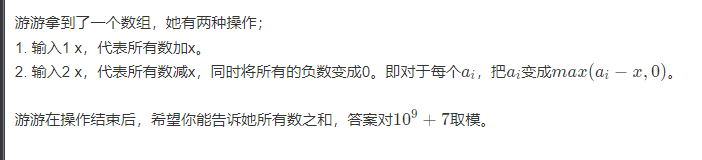

### solve

考虑一个点的变化历程，减到最低点之后，其最终是不断变高的。结论是：

1. 这个点没有低于0 ， 那么$final = a[i] + sum$

2. 这个点曾经低于0 ， $final = sum - mi$


### code

```cpp
int a[N];
signed main()
{
	ios::sync_with_stdio(false);
	cin.tie(0);
	int n , k;
	cin >> n >> k;
	for (int i = 0; i < n; i++)
		cin >> a[i];
	ll sum = 0 , mi_sum = INF;
	for (int i = 0; i < k; i++) {
		int x , y; cin >> x >> y;
		if (x == 1) sum += y;
		else mi_sum = min(mi_sum , (sum -= y));
	}
	ll ans = 0;
	for (int i = 0; i < n; i++) {
		if (a[i] + mi_sum >= 0) (ans += a[i] + sum) %= mod;
		else (ans += sum - mi_sum) %= mod;
	}
	cout << ans << "\n";
}
```

---


# D. Rating System

[Problem - D - Codeforces](https://codeforces.com/contest/1845/problem/D)

## 题面翻译

给定一个长度为 $n$ 数列 $a$，保证每项都不为 $0$。初始时 $x=0$，然后对于 $1\le i\le n$，按顺序进行如下操作：

- 如果 $x\ge k$，则 $x\rightarrow \max(k, x+a_i)$，否则 $x\rightarrow x+a_i$。
  你需要求出 $k$，使得 $x$ 的值尽量大。

## solve

当选定一个k ， 并且rating恰好到达k之后 ：

1. 接下来连续的一段如负数的段和，等效于这段rating的变化操作无效。

   1. 于是找到最长的一段最大的负数段，其余的总和减去该段即为后续的rating变化.即，最终的答案是k + remain - 前缀（没有则表示0） ===> k + 最大后缀。
      关于k的选择：

1. 关注a数组的前缀和， 选择前缀和上数组的值作为k是更优的：

   1. 对于k迁移到离他最近的sum数组元素值， 效果不会更差：
      证明如下：

      1. 选择更大的元素： 

      两个的最大后缀其实是一样的。因此，此时k越大越好。
      如果只有更小的最近，说明，将k移动到该值，能保证其结果为更小的最近前缀和，结果不会更坏。
      补充： 注意

## 生长思考

1. 数组模型的关注角度，总是比较明确的。
   1. 前后缀。
   2. 选择前缀值为k。
   3. 策略的等效替换。

## code

```cpp
void work(int testNo)
{
	int n;
	cin >> n;
	vector<ll> a(n + 1) , pre(n + 1 , 0) , suf(n + 2 , 0);
	// 后缀加上最大前缀。
	ll ans = 0;
	for (int i = 1; i <= n; i++)
		cin >> a[i];
	for (int i = 1; i <= n; i++) {
		pre[i] = a[i] + pre[i - 1];
	}
	for (int i = n; i >= 1; i--) {
		suf[i] = max(suf[i + 1] , pre[n] - pre[i - 1]);
	}
	ll mx = suf[1];
	for (int i = 1; i <= n; i++) {
		if (pre[i] + suf[i + 1] > mx) {
			ans = pre[i];
			mx = pre[i] + suf[i + 1];
		}
	}
	cout << max(ans , 0LL) << "\n";
}
signed main()
{
	ios::sync_with_stdio(false);
	cin.tie(0);
	int t; cin >> t;
	for (int i = 1; i <= t; i++)work(i);
}
```

-----

# D. Array Differentiation

https://codeforces.com/problemset/problem/1552/D
给你一个由 $n$个整数组成的序列 $a_1, \, a_2, \, \dots, \, a_n$。
是否存在一个 $n$整数序列 $b_1, \, b_2, \, \dots, \, b_n$，使得下面的性质成立？

- 对于每个$1 \le i \le n$，存在两个（不一定不同）指数$j$和$k$（$1 \le j, \, k \le n$），使得$a_i = b_j - b_k$成立。


### solve

[题解 CF1552D 【Array Differentiation】 - SSerxhs 的博客 - 洛谷博客 (luogu.com.cn)](https://www.luogu.com.cn/blog/SSerxhs/solution-cf1552d)

参考博客：

1. 第一点，$b_i - b_j = a , b_j -b_i = -a$ : 原数组中元素的正负对解没有影响，为了方便处理统一变成正数：

2. 建模：抽象出b之间的关系。如果两个元素之间产生一个a那么就连一条边。

3. 对上述的图进行分析：

   1. n条边n个点， 如果构造出一个合法的图就必须有环。
   2. 由于边代表了$b_i - b_j = x$ 这样对每一个边代表的方程相加：则最终为$\sum x = 0$

4. 在一个环中，当确定一个节点时，只关注一个元素对其它元素进行展开：
   $$
   b_1 = b_1\\
   b_2 = f_1(b_1)\\
   b_3 = f_2(b_2)= f_2(f_1(b_1))\\
   $$

5. 最终都可以用$b_1$进行表示 ： 综上有环则必有解：其余连通图，显然容易构造：

**实现方式：**
  问题已经转变成了是否可以判断有若干个$a_i$ 随意分配正负（重定向）使得最终和为0：

使用进制模型，压位枚举： 下面是三进制地使用技巧：给一个数字地分配方式有：

1. 为0      对应0
2. 为a      对应1
3. 为-a     对应2

### code

```cpp
#include<bits/stdc++.h>
using namespace std;

using ll = long long;

#define dbg(x) cerr << "[" << __LINE__ << "]" << ": " << x << "\n"

#define all(x) (x).begin(),(x).end()
#define sz(x) (int)(x).size()

const int inf = 1E9 + 7;
const ll INF = 1E18 + 7;
const int N = 1E6 + 10;

void work(int testNo)
{
	int n;
	cin >> n;
	vector<int> a(n);
	int c = 1; // 枚举子集。
	for (int i = 0; i < n; i++) {
		cin >> a[i];
		c *= 3;
	}
	// 至少从一开始：
	for (int i = 1; i < c; i++) {
		int t = i;
		ll sum = 0;
		for (int j = 0; j < n; j++) {
			int x = t % 3;
			t /= 3;
			if (x == 2) x = -1;
			sum += x * a[j];
		}
		if (sum == 0) {
			cout << "YES\n";
			return;
		}
	}
	cout << "NO\n";
}
signed main()
{
	ios::sync_with_stdio(false);
	cin.tie(0);

	int t; cin >> t;
	for (int i = 1; i <= t; i++)work(i);
}
```

-----


## C. Ntarsis' Set

https://codeforces.com/contest/1853/problem/C

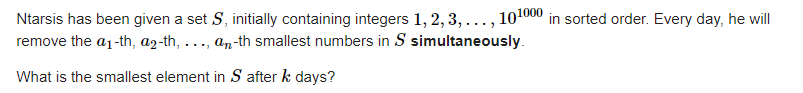

### solve

关注某个时刻： 发现每一轮迭代之前，其前会出现多少个元素。于是根据这些手段，我们就可以逐步递推出当前最后的第一位在第一轮时处于什么位置。

于是集中精力解决的问题：

1. 某个位置上其前出现多少个元素？
   1. 找出函数$f(x)$ 推出当前，x之前有多少个元素。
   2. 一定要由x到 $f_x$ 吗？
      1. 由$f_x$到x ， 双指针一步一步确定，被回溯到往后偏移1....n的个数。（注意特判$a_1 \ne 0$）
      2. 细节处理，还原上一轮删除$a_j$，将会在$a_j - j$ 之后增加一个新的数字。并且保证$a_{k,(k\ge j)} - k$大于等于$a_j - j$。 因此可以跑一遍双指针。指针j表示 j之前的元素删除操作影响到了当前ans表示的位置。

```cpp
void work(int testNo) 
{
	int n , k;
	cin >> n >> k;
	vector<int> a(n);
	for (int i = 0; i < n; i++)
		cin >> a[i];
	ll ans = 1;
	for (int i = 0 , j = 0; i < k; i++) {
		while (j < n && a[j] - (j + 1) < ans)j++;
		ans += j;
	}
	cout << ans << "\n";
}
```


-----


# D. Slime Escape

https://codeforces.com/problemset/problem/1734/D

### 题意：

史莱姆初始在位置k上， 并且又初始的生命值。它可以选择从左往右，左右每一个格子的有史莱姆，当与它们相遇之后，史莱姆的生命值就会加上遇见的史莱姆的生命值。之后，其它史莱姆会消失。问史莱姆是否可以到达0 或 n + 1个格子的点。

### solve

首先可以考虑用最优策略从左边逃离，或者从右边逃离：两种方向的策略解决方法一致，因此现在考虑从左边逃离。

1. 考虑操作一种有规律可循的连续向左或者向右的操作序列。
2. 一段连续向左或者连续向右的序列为何终止？
   1. 到达了0格子上。
   2. 遇到了非常小的妖怪。
3. 面对2.2情况下，应该采取什么样的策略？
   1. 回退到过程中的最大的生命值点，然后去尝试向右得到更多的增值。

### 实现key

1. 使用双指针维护两个方向上的移动。同时记录过程中生命的最大值。
2. 细节：
   1. 贪心策略更加细节的完善：
   2. 轮到轮之间的过渡：
      1. 
   3. 发现上述过程对于l , r两个方向上的寻求都是最优策略。因此不需要额外写两个循环执行。

### 生长思考：

1. 替换：

   假设有一种方案使得[L , R]之间的所有点都被遍历： 

   其具体的行为（更新的段）

   ```txt
   LLRRLLRLRLRL 的无序的一种序列：
   1. 倘若可以使得L延长到生命值更大的点。LLL后续的对于R的操作都不会受到影响。反而会更优，更自由的变化。即是兼容后续R的更新的。
   ```

### code

```cpp
#include<bits/stdc++.h>
using namespace std;

using ll = long long;

#define dbg(x) cerr << "[" << __LINE__ << "]" << ": " << x << "\n"

#define all(x) (x).begin(),(x).end()
#define sz(x) (int)(x).size()

const int inf = 1E9 + 7;
const ll INF = 1E18 + 7;
const int N = 1E6 + 10;

void work(int testNo)
{
	int n, k;
	cin >> n >> k;
	vector<int> a(n + 2, 0);
	for (int i = 1; i <= n; i++) {
		cin >> a[i];
	}
	if (a[k] < 0) {
		cout << "NO\n";
		return;
	}

	int low = k - 1, high = k + 1;
	// 当前生命值:
	ll cur = a[k];
	int reci , recj;
	// 先处理一个方向：
	while (low && high <= n) {
		// 也写不好啊：
		ll presum = cur;


		reci = low + 1;
		ll mx = cur;
		while (low) {
			if (cur + a[low] < 0) break;

			cur += a[low];
			if (cur > mx) {
				mx = cur;
				reci = low;
			}
			low--;
		}
		//

		if (low >= 1) {
			low = reci - 1;
			cur = mx;
		} else break;

		recj = high  - 1;

		while (high <= n) {
			if (cur + a[high] < 0) break;
			cur += a[high];
			if (cur > mx) {
				mx = cur;
				recj = high;
			}
			high++;
		}
		if (high <= n) {
			cur = mx;
			high = recj + 1;
		} else break;
		if (cur == presum) break;
		// 终止的标记是什么？ 可以更新的位置：
	}
	if (low && high <= n) cout << "NO\n";
	else cout << "YES\n";
}
signed main()
{
	ios::sync_with_stdio(false);
	cin.tie(0);

	int t; cin >> t;
	for (int i = 1; i <= t; i++)work(i);
}
```


### 大佬代码：

```cpp
#include <bits/stdc++.h>

using i64 = long long;

void solve() {
	int n, k;
	std::cin >> n >> k;
	k--;


	std::vector<int> a(n);
	for (int i = 0; i < n; i++) {
		std::cin >> a[i];
	}


	std::vector<std::array<i64, 2>> l, r;

	// 这一步的作用是什么？
	for (int i = 0; i < k; i++) {

		// 合并连续的负数段：
		// 第一维度： 末区间最大负数段负数和：
		// 第二维度： 区间和：
		l.push_back({std::min(a[i], 0), a[i]});

		// 对若干负数区间进行合并：
		while (l.size() > 1 && l.back()[1] <= 0) {
			auto [x, y] = l.back();
			l.pop_back();
			l.back() = {std::min(x, y + l.back()[0]), y + l.back()[1]};
		}
	}

	// 同上；

	for (int i = n - 1; i > k; i--) {
		r.push_back({std::min(a[i], 0), a[i]});
		while (r.size() > 1 && r.back()[1] <= 0) {
			auto [x, y] = r.back();
			r.pop_back();
			r.back() = {std::min(x, y + r.back()[0]), y + r.back()[1]};
		}
	}

	i64 cur = a[k];

	//基于上述结构的贪心。
	while (!l.empty() && !r.empty()) {

		// 哪个能走走哪个， 并且保证了，每走完一步后，其生命值都会变多。后续的选择都会更加自由。
		if (cur + l.back()[0] >= 0) {

			//保证后续段都是大于0的。

			cur += l.back()[1];
			l.pop_back();
		} else if (cur + r.back()[0] >= 0) {
			cur += r.back()[1];
			r.pop_back();
		} else {
			std::cout << "NO\n";
			return;
		}
	}

	std::cout << "YES\n";
}

int main() {
	std::ios::sync_with_stdio(false);
	std::cin.tie(nullptr);

	int t;
	std::cin >> t;

	while (t--) {
		solve();
	}

	return 0;
}
```


### 生长：

1. 本质上的贪心思路是一样的：但是这里涉及到了一些数组上段划分，段处理的细节。

-----

----


# 2020 ICPC 济南站 L：Bit Sequence

参考https://blog.csdn.net/qq1838641320/article/details/112061559

https://ac.nowcoder.com/acm/contest/10662/L

1. 数组$a_{0 ...m -1}$
2. 运算函数$f_{x}$ , x的二进制串上1的个数。
   question: 统计中 , 对于任意的 0 <= i < m , 都满足 $f(x + i) = a_i$的数字的个数.

## solve

1. 发现m的范围非常的小。分析m的影响：
   1. 比较$f(x+i)和f(x)$，不考虑进位 ， i最多影响7位。(100 = 1100100)。
   2. 考虑进位，最多进一位。7位之后的连续1反转。并且在第一个0出加一个1.
2. 综上在枚举前缀时，只需要关注结构的几个特征如下：
   1. 第6位之后连续1的奇偶性。
   2. 最后7的状态：
   3. 整体上1比特的个数的奇偶性质


**状态设计：**

$f_{i, 0/2 ,0/2}$ 表示 当前高60到第i位比特下，前面1位总数位奇/偶数。当前是否贴着上界，合法的数字总数。

**状态转移：**

1. 60 --- 8位置： 枚举之后往下记忆化搜索。
2. 7....0的位置，继续枚举往下搜索。
3. 枚举到最后就check答案。
   1. 如果当前线程的数位为60 -- 8注意使用记忆数组。
   2. 否则，只做每种方案下返回合法总数的贡献。


### my code (奇慢200ms)

```cpp
#include<bits/stdc++.h>
using namespace std;

using ll = long long;

const int N = 110;

ll l;
int a[N] , m;
ll f[61][2][2][2];

vector<int> Bit;
//检查后5位置的奇偶性
int check(int x /*当前后7位的情况。*/, int pre /*前高位连续0*/, int sum/*高位0的总数奇偶性*/) {
	int flag = 1;
	for (int i = 0; i < m; i++) {
		int j = x + i;
		if (j < (1 << 7)) {
			flag &= (sum ^ (__builtin_parity(j))) == a[i];
		} else {
			flag &= ((sum ^ pre) ^ (__builtin_parity(j))) == a[i];
		}
	}
	// if (flag == 1)
	// 	cout << x << " "  << pre  << " " << sum  << "\n";
	return flag;
}

/*
3
3 10
0 1 0
1 1000
0
9 1000000
1 0 1 1 0 1 0 0 1
*/

/*
1
3 10
0 1 0
*/

ll dfs(int cur /*第几位*/, int sum ,  int odd /*前面位置的奇偶性*/, int limit /*是否贴着上界*/, int chose/*后7位的选择情况。*/) {
	if (cur > 6 && f[cur][sum][odd][limit] != -1) {
		return f[cur][sum][odd][limit];
	}
	if (cur == -1) return check(chose , odd , sum);
	int mx = limit ? Bit[cur] : 1;
	ll& res = f[cur][sum][odd][limit];
	res = 0;
	for (int i = 0; i <= mx; i++) {
		int sum_ = sum, odd_ = odd, chose_ = chose * 2;
		if (i == 1) {
			if (cur < 7) {
				chose_++;
			} else {
				odd_ ^= 1;
				sum_ ^= 1;
			}
		} else {
			if (cur  > 6) {
				odd_ = 0;
			}
		}
		res += dfs(cur - 1 , sum_ , odd_ , limit && (i == mx) , chose_);
	}
	return res;
}

void solve() {
	memset(f , 0xff , sizeof f);
	Bit.clear();
	cin >> m >> l;
	for (int i = 0; i < m; i++)
		cin >> a[i];
	for (int i = 0; i <= 60; i++) {
		Bit.push_back(l % 2);
		l /= 2;
	}
	cout << dfs(60 , 0 , 0 , 1 , 0) << "\n";
}

int main() {
	ios::sync_with_stdio(false);
	cin.tie(0);
	int t; cin >> t;
	while (t--)solve();
}
```


### 借鉴code

```cpp
#include<iostream>
#include<algorithm>
#include<cstring>
#define rep(i,a,b) for(int i=a;i<b;i++)
#define mem(a,b) memset(a,b,sizeof(a))
using ll=long long;
using namespace std;
ll dp[64][2][2][2]={},x;
int bi[64]={},am[109]={},m;
ll calc(int lim,int s,int t){
	int res=0,hi=lim?x%128:127;
	for(int i=0;i<=hi;i++){//枚举低6位
		int f=1;
		for(int j=0;j<m&&f;j++)//O(m)逐一检查,注意到模2意义下加减都相当于异或
			if(i+j<128) f&=(__builtin_parity(i+j)^s)==am[j];
			else f&=(__builtin_parity(i+j)^s^t)==am[j];
		res+=f;
	}
	return res;
}
ll dfs(int pos,int lim,int s,int t){
	ll&res=dp[pos][lim][s][t];
	if(res!=-1) return res;
	if(pos<=6) return res=calc(lim,s,t);
	res=0;
	int up=lim?bi[pos]:1;
	for(int i=0;i<=up;i++) //注意到模2意义下加减都相当于异或
		res+=dfs(pos-1,lim&&i==up,s^i,i&(!t));
	return res;
}
ll solve(){
	mem(dp,-1);
	int len=0;
	for(ll xi=x;xi;xi>>=1) bi[len++]=xi&1;
	return dfs(len-1,1,0,0);
}
int main() {
	int ___;
	for(scanf("%d",&___);___--;){
		scanf("%d%lld",&m,&x);
		rep(i,0,m) scanf("%d",&am[i]);
		printf("%lld\n",solve());
	}
}
```

-----

## **ICPC Beijing 2017 J, Pangu and Stones**

[ICPC Beijing 2017 J, Pangu and Stones - 题目 - Daimayuan Online Judge](http://oj.daimayuan.top/course/8/problem/327)

### 题目简介

1. 石子合并问题：

   对一堆石子，合并连续的连续长度为$[L,R]$的石子。

和最简单的区间动态规划问题不同。这里对连续合并的石堆个数有限制。

### solve

1. 显然不能简单的枚举每一堆的分界点。（就是纯暴力。）

定义一个状态：

$f_{i,j,k}$表示$i,j$ ， 为合并成k堆的最小代价。

辅助状态的转移方程。

1. 枚举i , j。
2. 枚举k。
3. 枚举第一堆的的尾部。

$$
k\ge2;f_{i,j,k}=min(f_{i,mid,1}+f_{mid+1,r,k-1})\\
k=1;f_{i,j,1}=min(f_{i,j,2...k}+sum_{l...r})
$$

**初始化：**

$f_{i , j , j - i + 1} = sum_{i , j}$

### 生长：

1. 感受状态设计以及方程，关注的角度。

#### code

```cpp
#include<bits/stdc++.h>
using namespace std;
using ll = long long;
#define f dp

const int N = 110;
const int inf = 1 << 29;
int n , L , R;
int f[N][N][N];
int sum[N];

void solve() {
	for (int i = 1; i <= n ; i++) {
		int x; cin >> x;
		sum[i] = sum[i - 1] + x;
	}
	for (int i = 1; i <= n; i ++)
		for (int j = 1; j <= n; j++)
			for (int k = 1; k <= n; k++)
				f[i][j][k] = inf;
	for (int d = 0; d <= n ; d++) {
		for (int l = 1; l + d <= n; l++) {
			int r = l + d;
			if (d == 0) {
				f[l][r][1] = 0;
			} else {
				for (int k = 2; k <= n; k++) {
					for (int mid = l ; mid < r; mid ++) {
						f[l][r][k] = min(f[l][r][k] , f[l][mid][1] + f[mid + 1][r][k - 1]);
					}
					if (k >= L && k <= R) f[l][r][1] = min(f[l][r][k] , f[l][r][1]);
				}
				f[l][r][1] += sum[r] - sum[l - 1];
			}
		}
	}
	if (f[1][n][1] >= inf) cout << 0 << '\n';
	else cout << f[1][n][1] << '\n';
}


int main()
{
	ios::sync_with_stdio(false);
	cin.tie(0);
	while (cin >> n >> L >> R)solve();

}
```

-----

--------

## ICPC Kunming 2020 C, Cities

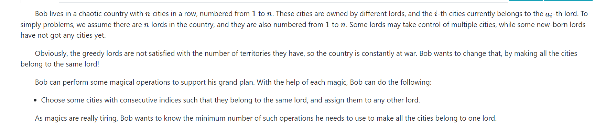

[ICPC Kunming 2020 C, Cities - 题目 - Daimayuan Online Judge](http://oj.daimayuan.top/course/8/problem/328)


### solve

分析模型， 考虑怎么将一段变成同一种颜色：最差劲的做法以及情况如下：

```
1 2 3 4 5
```

逐步处理： 其操作总数其实是 改变颜色，合并块与块之间的情况。

```
1 2 1 4 5
```

因此总的最优情况是： 同颜色的一一匹配就可以减少一个答案贡献。因此问题转变成了求这种匹配的最大个数。并且要求是不相交的（因为不同颜色的连线之后，处理一个匹配时候，其颜色就已经发生改变。其后一个匹配关系就会不再成立。）

因此就转换成了一个经典的区间dp模型：


**状态定义：**

$f_{i ,j}$ 表示将i , j区间的最大不相交匹配数。

$nxt_{i}$ , 与color[i]相同的下一个最近的位置（如果不存在就设置为n + 1） 一个非常熟悉，但是非常好用的trick.

**状态转移方程：**
$$
f_{i ,j} = max(f_{i + 1 , j} , f_{i +1,x}\\col[x] = a[i] \&\& x \le j
$$
**初始化：**

显然是全部为0：

#### code

```cpp
#include<bits/stdc++.h>
using namespace std;

using ll = long long;

#define dbg(x) cerr << "[" << __LINE__ << "]" << ": " << x << "\n"

#define all(x) (x).begin(),(x).end()
#define sz(x) (int)(x).size()

const int inf = 1E9 + 7;
const ll INF = 1E18 + 7;
const int N = 5000 + 10;

int a[N] , pos[N] , nxt[N];
int f[N][N];

void work(int testNo)
{
	int n;
	cin >> n;
	for (int i = 1; i <= n; i++)
		pos[i] = n + 1;
	for (int i = 1; i <= n; i++) {
		cin >> a[i];
		if (i != 1 && a[i] == a[i - 1]) {
			n--;
			i--;
		}
	}
	for (int i = n; i >= 1; i--) {
		nxt[i] = pos[a[i]];
		pos[a[i]] = i;
	}
	for (int i = 1; i <= n; i++)
		for (int j = i; j <= n; j++)
			f[i][j] = 0;
	for (int d = 1; d <= n; d++)
		for (int l = 1; l + d - 1 <= n; l++) {
			int r = l + d - 1;
			f[l][r] = f[l + 1][r];
			int x = nxt[l];
			while (x <= r) {
				f[l][r] = max(f[l][r] , f[l + 1][x - 1] + f[x][r] + 1);
				x = nxt[x];
			}
		}
	int  ans = n - 1 - f[1][n];
	cout << ans << "\n";
}

signed main()
{
	ios::sync_with_stdio(false);
	cin.tie(0);

	int t; cin >> t;
	for (int i = 1; i <= t; i++)work(i);
}

/* stuff you should look for
* int overflow, array bounds
* special cases (n=1?)
* do smth instead of nothing and stay organized
* WRITE STUFF DOWN
* DON'T GET STUCK ON ONE APPROACH
*/
```

## 括号序列：

[CSP-S 2021, 括号序列 - 题目 - Daimayuan Online Judge](http://oj.daimayuan.top/course/8/problem/329)

### solve

简单版本的问题怎么解决？
就是根据前缀中还有多少个'( ' 需要匹配， 进行两种方向上的转移。最终的答案为$f_{1 ,n}$
和简单版本的解决方法相比：方案字符的结构是不能记录的。


首先，定义$f_{l , r}$ ： l  , r的合法方案数其可能的结构为：

1. 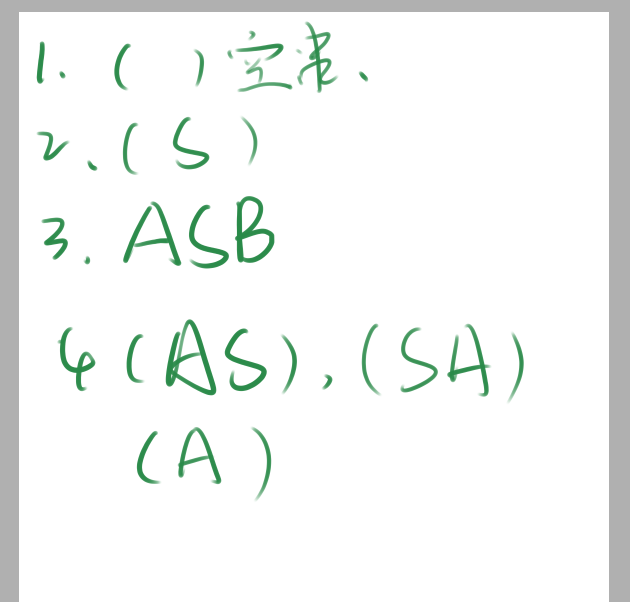


根据上述结构，分类记录方案，然后进行转移；
**状态设计：**
$g_{l , r}$ 表示， l , r中 ，左右边界为括号的合法括号序列的方案个数；

$f_{l ,r}$ , l r 中，合法括号序列的方案个数。

**状态转移方程：**

根据上述结构的分类进行转移：

$g_{l,r}$ : 

1. （）内部是空：
2. （S） , 枚举然后考虑贡献 ， 是否可以寻得这种情况。
3. （A） ， f(l + 1 , r - 1)
4. （AS） ， 枚举前缀*的个数，同时由$f_{l ,mid}$ 转移
5. （SA） ， 同上。

$f_{l ,r}$

1. $g_{l,r}$
2. 枚举中点： mid : mid ... mid + len 为* ， 则为$f_{l,mid - 1} \times f_{mid + len + 1 , r}$

**复杂度**

对于上述$f_{l , r}$ 最朴素的编写方法下，其复杂度是：$O(N^4)$的。第一份代码，即使用了如下的编写方法：

==优化为$N^3$ 的方法：==

1. 对SA结构的统计可以进行预处理 ： 然后可以，AS中，这种结构会被多次访问，因此可以高效的处理。


#### code $O(N^4)$

```cpp
#include<bits/stdc++.h>
using namespace std;
using ll = long long;
const int mod = 1E9 + 7;
const int N = 520;
char s[N];
int f[N][N] , g[N][N];
void add(int& a , int b) {
	a += b;
	if (a >= mod) a -= mod;
}
bool match(int p , char t) {
	return s[p] == '?' || s[p] == t;
}

/*
10 2
???(*??(?)
7 3
(*??*??
*/
signed main()
{
	ios::sync_with_stdio(false);
	cin.tie(0);
	int n , k;
	cin >> n >> k;
	cin >> (s + 1);
	for (int d = 0; d < n; d++) {
		for (int l = 1; l + d <= n; l++) {
			int  r = l + d;

			// 基于多种情况分类讨论下的转移：
			//case1
			if (match(l , '(') && match(r , ')') && l != r) {
				// 空串：
				// case1.1 : ()
				if (l + 1 == r) add(g[l][r] , 1);
				// case1.2 (S)
				else if (r - l - 1 <= k) {
					// 如果中间的长度小于k
					bool flag = true;
					for (int i = l + 1; i < r ; i++)
						flag = flag && match(i , '*');
					if (flag) add(g[l][r] , 1);
				}
				// case1.3 (A);
				add(g[l][r] , f[l + 1][r - 1]);
				// case1.4 : (SA)
				for (int i = l + 1; i < r - 1 && i <= l + k; i++) {
					if (match(i , '*')) add(g[l][r] , f[i + 1][r - 1]);
					else break;
				}
				// case1.5 : (AS)
				for (int i = r - 1; i > l + 1 && i >= r - k; i--)
					if (match(i , '*')) add(g[l][r] , f[l + 1][i - 1]);
					else break;
			}
			//case2
			add(f[l][r] , g[l][r]);
			/* case3*/
			if (match(l , '(')) {
				for (int mid = l + 1 ; mid < r; mid++) {
					//Case3.1 (AB)
					int tmp = 0;
					add(tmp , f[mid + 1][r]);
					//Case3.2 (ASB)
					for (int i = mid + 1; i < r - 1 && i  <= mid +  k; i++) {
						if (match(i , '*')) {
							add(tmp , f[i + 1][r]);
						} else break;
					}
					add(f[l][r] , 1LL * tmp * g[l][mid] % mod);
				}
			}
		}
	}
	cout << f[1][n] << "\n";
}

/* stuff you should look for
* int overflow, array bounds
* special cases (n=1?)
* do smth instead of nothing and stay organized
* WRITE STUFF DOWN
* DON'T GET STUCK ON ONE APPROACH
*/
```


#### code $O(N^3)$

```cpp
#include<bits/stdc++.h>
using namespace std;
using ll = long long;

const int mod = 1E9 + 7;
const int N = 520;

char s[N];
int f[N][N] , g[N][N], h[N][N];
void add(int& a , int b) {
	a += b;
	if (a >= mod) a -= mod;
}
bool match(int p , char t) {
	return s[p] == '?' || s[p] == t;
}

/*
10 2
???(*??(?)

7 3
(*??*??
*/
signed main()
{
	ios::sync_with_stdio(false);
	cin.tie(0);

	int n , k;
	cin >> n >> k;
	cin >> (s + 1);
	for (int d = 0; d < n; d++) {
		for (int l = 1; l + d <= n; l++) {
			int  r = l + d;

			// 基于多种情况分类讨论下的转移：
			//case1
			if (match(l , '(') && match(r , ')') && l != r) {
				// 空串：
				// case1.1 : ()
				if (l + 1 == r) add(g[l][r] , 1);
				// case1.2 (S)
				else if (r - l - 1 <= k) {
					// 如果中间的长度小于k
					bool flag = true;
					for (int i = l + 1; i < r ; i++)
						flag = flag && match(i , '*');
					if (flag) add(g[l][r] , 1);
				}
				// case1.3 (A);
				add(g[l][r] , f[l + 1][r - 1]);
				// case1.4 : (SA)
				// updaste1
				add(g[l][r] , h[l + 1][r - 1]);
				// case1.5 : (AS)
				for (int i = r - 1; i > l + 1 && i >= r - k; i--)
					if (match(i , '*')) add(g[l][r] , f[l + 1][i - 1]);
					else break;
			}
			//case2(...)
			add(f[l][r] , g[l][r]);
			/* case3*/
			// 组合形：
			if (match(l , '(')) {
				for (int mid = l + 1 ; mid < r; mid++) {
					//Case3.1 (AB)
					int tmp = 0;
					add(tmp , f[mid + 1][r]);
					//Case3.2 (ASB)
					// update2
					add(tmp , h[mid + 1][r]);
					add(f[l][r] , 1LL * tmp * g[l][mid] % mod);
				}
			}
			// 更新： h[l][r];
			for (int i = l; i < r && i <= l  + k - 1; i++) {
				if (match(i , '*')) add(h[l][r] , f[i + 1][r]);
				else break;
			}
		}
	}
	cout << f[1][n] << "\n";
}
```

-----

##  Outer space invaders

来自外太空的外星人（最终）入侵了地球。保卫自己，或者解体，被他们同化，或者成为食物。迄今为止，我们无法确定。
外星人遵循已知的攻击模式。有 $N$ 个外星人进攻，第 $i$ 个进攻的外星人会在时间 $a_i$ 出现，距离你的距离为 $d_i$，它必须在时间 $b_i$ 前被消灭，否则被消灭的会是你。
你的武器是一个区域冲击波器，可以设置任何给定的功率。如果被设置了功率 $R$，它会瞬间摧毁与你的距离在 $R$ 以内的所有外星人（可以等于），同时它也会消耗 $R$ 单位的燃料电池。
求摧毁所有外星人的最低成本（消耗多少燃料电池），同时保证自己的生命安全。

### solve

#### 20 mins

question: 

1. 没有感受到一个非常明显的区间性： 区间性在哪里？
   1. 如上区间问题所有问题，都有一个明确的区间性： 区间性的情况：记录的内容都是区间性的。但是这里的元素没有形成一种明显的时间性：
2. 考虑对外星人做一个排序：然后基于该序列做一个dp。
   1. ==起始时间：== 
   2. 末时间：
   3. 距离。

通过起始时间做一个排序之后：考虑一个区间动态规划技术：~~修不成正果qaq~~

#### Answer

1. 找出区间性：
   时间性： 画出一个时间轴，然后基于时间轴上确立时间，炸弹长度。
   1. 然后一个贪心思路显然是：确定某个时刻之后，选择爆炸的炸弹显然应该是最大的。于是区间就划分成了左右两部分。然后又是一个非常显然的区间问题了。
      **状态设计：**
      $f_{l ,r}$ 表示处理完l时刻到r时刻的最小的花费。
      遇见问题： 时间范围可能会非常的大： 这个问题可以通过离散化解决：在没有涉及到的时刻点上都可以通过已知的时刻点等效替代；
      **状态转移方程：**

$$
f_{l ,r} = min(f_{l,mid-1} + f_{mid + 1 , r} + w_{mid}, f_{l,r})
$$

**初始化：**
记忆化搜索写法，为-1

#### 一些生长思考：

1. 为什么使用记忆化搜索的写法？
   1. 因为和一般的模型不同，比较多的状态其实是没有被用到的。虽然开线程，开存储空间等花费了一定的常数。但是相对应的当前的模型下，被使用到的状态比较离散，所以综合起来常数更小。
   2. 很好写
2. 离散化在dp上的应用，对时间的离散化。应该对时间轴相关的状态设计更加敏感些。

#### code

```cpp
#include<bits/stdc++.h>
using namespace std;
using ll = long long;

#define fsio ios::sync_with_stdio(false);cin.tie(0);

const int inf = (int)1E9 + 7;
const ll INF = (long long)1E18 + 7;
const int N = 610;

int n , a[N] , b[N] , d[N] , f[N][N];


int solve(int l , int r) {
	if (l > r) return 0;
	if (f[l][r] != -1) return f[l][r];
	int& ans = f[l][r];
	// 然后转移状态：
	// 记录这段时间内的最大距离对应的怪物:
	ans = inf;
	int mx = -1 , pos = -1;
	for (int i = 1; i <= n; i++) {
		if (a[i] >= l && b[i] <= r && d[i] > mx) {
			mx = d[i];
			pos = i;
		}
	}
	if (mx == -1) return ans = 0;
	for (int i = a[pos]; i <= b[pos]; i++) {
		ans = min(ans , solve(l , i - 1) +  solve(i + 1 , r));
	}
	ans += mx;
	// cout << "l " << l << "r " << r << " " << ans << "\n";
	return ans;
}

void solve() {
	cin >> n;
	vector<int> t;
	for (int i = 1; i <= n; i++) {
		cin >> a[i] >> b[i] >> d[i];
		t.push_back(a[i]);
		t.push_back(b[i]);
	}
	sort(t.begin() , t.end());
	t.erase(unique(t.begin() , t.end()) , t.end());

	for (int i = 1; i <= n; i++) {
		a[i] = lower_bound(t.begin() , t.end() , a[i]) - t.begin() + 1;
		b[i] = lower_bound(t.begin() , t.end() , b[i]) - t.begin() + 1;
	}
	int m = (int)t.size();
	for (int i = 1; i <= m; i++)
		for (int j = i; j <= m; j++) {
			f[i][j] = -1;
		}
	cout << solve(1 , m) << "\n";
}

int main() {
	fsio;
	int t; cin >> t;
	while (t--)solve();
}
```

## 总结：

1. 观察出资源的区间性：如第四题：
2. 多做一些区间dp问题。


-------

# CCPC 女生专场 2021 C, 连锁商店

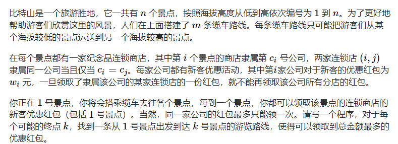

### solve

按照一般的状态设计方法： 由于公司的数目高达36个。因此如果做一个统筹兼顾的统计是不行的。

于是思考： 状态设计上的优化：

1. 是不是有一些不必要枚举的状态？
   1. 第一点： 状态设计位记录的应该是公司，而不是某个景点。公司的分布情况很特殊。
   2. 第二点： 发现，如果只有一个公司只和一个景点相关时： 那么该公司参与状态设计显得很用冗余。
      1. 于是对这一类公司不并入状态设计中，只有检查到该公司的景点时，就直接加上该公司的红包即可。

**状态设计：**
$$
f_{i ,s } :表示考虑到达第i个城市，途中经历公司红包（不包括当前景点）领取情况如s
$$
**状态转移方程：**
$$
f_{i , s} \\
1. 如果当前，i节点的公司属于，只出现一次的一类。那么就将该公司的红包直接加到所有的状态中。\\
2. 由下到上的转移：f_{i,s}- > f_{v, t} ， t表示考虑了i景点后，针对j的公司经历情况。
$$

#### 转移：

1. 每天一些卡常小技巧：
2. 求逆元方法中的线性方法：

### code

```cpp
const int N   = 40;

vector<int> g[N];
int ans[N], c[N], w[N] , id[N];
int  cnt[N];
int f[N][1 << 20];

signed main()
{
	ios::sync_with_stdio(false);
	cin.tie(0);

	int n, m;
	cin >> n >> m;
	for (int i = 0; i < n; i++) {
		cin >> c[i];
		c[i]--;
		cnt[c[i]]++;
	}
	int mm = 0;
	for (int i = 0; i < n; i++) {
		cin >> w[i];
		if (cnt[i] > 1) id[i] = mm++;
		else id[i] = -1;
	}
	for (int i = 0; i < m; i++) {
		int u, v;
		cin >> u >> v;
		u--; v--;
		g[u].push_back(v);
	}
	memset(f , -1 , sizeof f);

	f[0][0] = 0;
	for (int i = 0; i < n; i++) {
		for (int s = 0; s < (1 << mm); s++) {
			if (f[i][s] == -1) continue;
			int t = s;
			if (id[c[i]] == -1) f[i][s] += w[c[i]];
			else if ((s >> id[c[i]] & 1) == 0) {
				f[i][s] += w[c[i]];
				t |= 1 << id[c[i]];
			}
			// int t = s;
			// t |= 1 << id[c[i]];
			for (auto v : g[i]) {
				f[v][t] = max(f[v][t] , f[i][s]);
			}
			ans[i] = max(ans[i] , f[i][s]);
			// cout << f[i][s] << "\n";
		}
	}
	for (int i = 0; i < n; i++)
		cout << ans[i] << "\n";
}
```


------

# ICPC 网络预选赛2 2021 K, Meal

[ICPC 网络预选赛2 2021 K, Meal - 题目 - Daimayuan Online Judge](http://oj.daimayuan.top/course/8/problem/379)

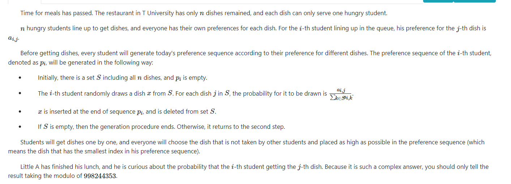

### solve

1. 这个范围，很容易的，可以使用状态压缩dp处理：
2. 注意一点是概率的计算： 当处理第i步时， 其选择某一个物品的概率就是当前选择的物品的偏好度 ， 与剩下的物品偏好度之和之间的比。

**状态设计：**

$f_{i , s}$ 考虑了前i个物品之后 ， 当前的物品的选择状况为s的总价值：

**状态转移方程：**

也是采取了一种由小到大特色的转移方式：
$$
f_{i , s} ->f_{i + 1 , s | (1 << j)}
$$

```cpp
#include<bits/stdc++.h>
using namespace std;
using ll = long long;

#define all(x) (x).begin(),(x).end()
#define sz(x) (int)(x).size()
#define bit(x) (1 << (x))

const int inf = 1E9 + 7;;
const ll INF  = 1E18 + 7;
const int N   = 30;
const int M = 3000;
const int mod =  998244353;

int a[N][N] , ans[N][N] , inv[M] , f[N][bit(20)];

void add(int& a , int b) {
	a += b;
	if (a >= mod) a -= mod;
}

signed main()
{
	ios::sync_with_stdio(false);
	cin.tie(0);

	inv[1] = 1;
	for (int i = 2; i < M; i++) {
		inv[i] = 1LL * (mod - mod / i) * inv[mod % i] % mod;
		// cout << inv[i] << '\n';
	}
	int n;
	cin >> n;
	for (int i = 0; i < n; i++) {
		for (int j = 0; j < n; j++)
			cin >> a[i][j];
	}

	f[0][0] = 1;
	for (int i = 0; i < n; i++) {
		for (int s = 0; s < bit(n); s++) {
			if (f[i][s]) {
				int sum = 0;
				for (int j = 0; j < n; j++)
					if ((s & bit(j)) == 0)
						sum += a[i][j];
				ll tmp = 1LL * f[i][s] * inv[sum] % mod;
				// cout << tmp << "\n";
				for (int j = 0; j < n; j++) {
					if ((s & bit(j)) == 0) {
						ll prob = 1LL * tmp * a[i][j] % mod;
						// cout << prob << "\n";
						add(f[i + 1][s | (1 << j)] , prob);
						add(ans[i][j] , prob);
					}
				}
			}
		}
	}
	for (int i = 0; i < n; i++)
		for (int j = 0; j < n; j++)
			cout << ans[i][j] << " \n"[j == n - 1];
}
```

--------

# CCPC Harbin 2021 G, Damaged Bicycle

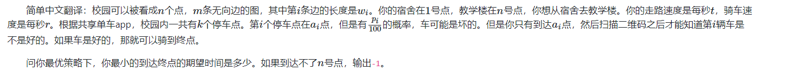

### solve


### 生长思考：

1. 第一个收获： 在概率模型下，其最优决策是用每一种策略下最终的期望函数作为参考的。这里的最优策略就是从该状态下到达终点的期望时间中最短的选择。

2. 第二个收获：


```cpp
#include <bits/stdc++.h>
using namespace std;
typedef long long ll;

#define bit(x) (1 << (x))

const int N = 101000;
const int M = (1 << 18) + 10;

int n, m, k, d[22][22], a[22], p[22];

typedef pair<int,int> PII;
const int inf = 1 << 30;
vector<PII> e[N];
int vis[N], dis[N];
priority_queue<PII, vector<PII>, greater<PII>> hs;

void dijkstra(int S,int n) {
    for (int i = 1; i <= n; i++) {
        dis[i] = inf;
        vis[i] = 0;
    }
    dis[S] = 0;
    hs.push({dis[S], S});
    while (!hs.empty()) {
        int u=hs.top().second;
        hs.pop();
        if (vis[u]) continue;
        vis[u] = 1;
        for (auto p : e[u]) {
            int v = p.first;
            if (dis[v]>dis[u] + p.second) {
                dis[v]=dis[u] + p.second;
                hs.push({dis[v], v});
            }
        }
    }
}

int v1, v2;
double dp[M][20];
int main() {
    scanf("%d%d", &v1, &v2);
    scanf("%d%d", &n, &m);

    for (int i = 0; i < m; i++) {
        int u, v, w;
        scanf("%d%d%d", &u, &v, &w);
        e[u].push_back({v, w});
        e[v].push_back({u, w});
    }
    scanf("%d", &k);
    for (int i = 0; i < k; i++) {
        scanf("%d%d", &a[i], &p[i]);
    }
    a[k] = 1;
    a[k + 1] = n;
    for (int i = 0; i <= k + 1; i++) {
        dijkstra(a[i], n);
        for (int j = 0; j <= k + 1; j++) {
            d[i][j] = dis[a[j]];
        }
    }
    if (d[k][k + 1] == inf) {
        puts("-1");
        return 0;
    }
    // dp[S][i]
    for (int S = bit(k) - 1; S >= 0; S--)
        for (int i = 0; i < k; i++) if (S & bit(i)) {
            double pBad = 0.01 * p[i];
            // 有车
            double tGood = 1. * d[i][k + 1] / v2;
            // 无车
            double tBad = 1. * d[i][k + 1] / v1;
            for (int j = 0; j < k; j++) if ((S & bit(j)) == 0) {
                tBad = min(tBad, 1. * d[i][j] / v1 + dp[S | bit(j)][j]);
            }
            dp[S][i] = pBad * tBad + (1 - pBad) * tGood;
        }
    double ans = 1. * d[k][k + 1] / v1;
    for (int j = 0; j < k; j++)
        ans = min(ans, 1. * d[k][j] / v1 + dp[bit(j)][j]);
    printf("%.10f\n", ans);
}
```

-----------

# CCPC Changchun 2020 J, Abstract Painting

简介： 在一个图上画圆，要求这些圆之间满足：

1. 圆的半径范围为[1 , 5]
2. 两两个圆之间最多只有一个交点；
3. 圆心在x轴上。
4. 圆上任意点的x坐标必须在[0 , n]的范围之内。

question : 画家已经画了一些圆，问还可以有多少种合法的方案？

### solve

1. 第一步是转换问题： 发现最终问题等价于在0 ... n的点上进行连点的问题，满足任意两条连线只有包含与被包含，或只有一个交点的关系。、

在上述基础上，考虑两种解法：

1. 区间dp的解法：

   类比括号序列： 将线段之间的关系，定义出几种结构：

   1. 定义A 形如括号序列模型中(A)(A)并且满足能够准确定位左右边界的结构》
   2. 形如(A)S(A)。

2. **状压dp**

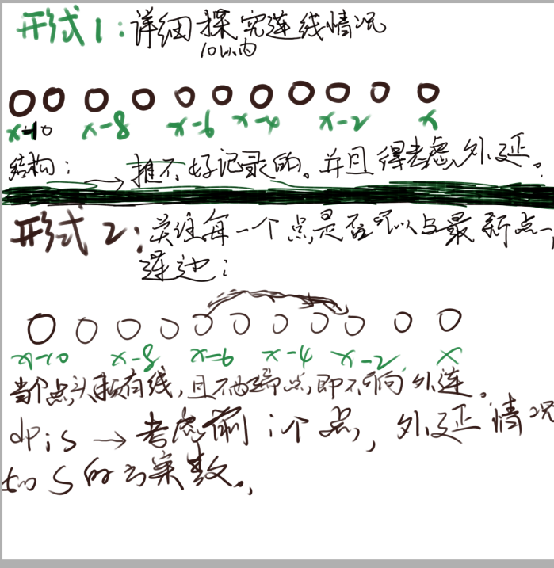

**状态定义：**

$f_{i , s}$ 表示考虑了前i个点， 当前节点外延情况为s。（某位上可外延标记为0 ， 否则标记为1。）

**状态转移方程：**

1. 枚举前一个状态下的一个s：

2. 按照： x - 2 , x - 4 , x - 6 , x - 8 , x - 10的顺序进行枚举连边：
   $$
   f_{i-1,s} - f_{i  , s \& ((1 << 10) - (1 << i - j - 1))}
   $$

3. 注意 x - 2 ， x - 4 ... 形如这种的划分，也是一个阶段划分： x - 2 得到状态记录也可以贡献x - 4的问题：

####  生长思考：

1. 区间dp形式的解法。

#### code

```cpp
#include<bits/stdc++.h>
using namespace std;
using ll = long long;

#define all(x) (x).begin(),(x).end()
#define sz(x) (int)(x).size()
#define bit(x) (1 << (x))

const int inf = 1E9 + 7;;
const ll INF = 1E18 + 7;
const int N = 1010;
const int mod = inf;

int circle[N][N];
int f[bit(10)] , g[bit(10)];

void add(int& a , int b) {
	a += b;
	if (a >= mod) a -= mod;
}
signed main()
{
	ios::sync_with_stdio(false);
	cin.tie(0);
	int n , k;
	cin >> n >> k;
	for (int i = 0; i < k; i++) {
		int c , r;
		cin >> c >> r;
		circle[c - r][c + r] = 1;
	}

	f[0] = 1;
	for (int i = 0; i <= n; i++) {
		for (int j = i - 2; j >= 0 && j >= i - 10; j -= 2) {
			// 滚动数组：
			for (int s = 0; s < bit(10); s++) {
				g[s] = f[s];
				f[s] = 0;
			}
			//当前点可以选择不放情况下：
			if (not circle[j][i]) {
				for (int s = 0; s < bit(10); s++)
					f[s] = g[s];
			}
			// 连一条线；
			for (int s = 0; s < bit(10); s++) {
				// 第一个阶段：
				if (s >> (i - j - 1) & 1) {
					int news = s & (bit(10) - bit(i - j - 1));
					add(f[news] , g[s]);
				}
			}
		}
		// 更新 ： i - i + 1
		for (int s = 0; s < bit(10); s++) g[s] = f[s] , f[s] = 0;
		for (int s = 0; s < bit(10); s++) {
			int news = (s << 1 | 1) & (bit(10) - 1);
			add(f[news] , g[s]);
		}
	}
	int ans = 0;
	for (int s = 0; s < bit(10); s++)
		add(ans , f[s]);
	cout << ans << "\n";
}

/* stuff you should look for
* int overflow, array bounds
* special cases (n=1?)
* do smth instead of nothing and stay organized
* WRITE STUFF DOWN
* DON'T GET STUCK ON ONE APPROACH
*/
```

# CCPC Qinhuangdao 2019 G, Game on Chessboard

[Problem - G - Codeforces](https://codeforces.com/gym/102361/problem/G)

### 简介：

在一个棋盘上：玩消消乐，每次可以进行以下两种操作：

1. 选择任意一个棋子，消除，其花费为$cost_i$
2. 选择两个不同颜色的棋子i ， j其花费为$cost_i - cost_j$
3. 每当一个棋子被选择操作之后，都将会被消除：
   要求：
4. 选择的棋子(X , Y) 中， 必须满足  x >= X , Y <= y 的棋子都被消除。

### solve

发现整个图中的==有效状态==是非常少的：其形式都是以下的几种形式：
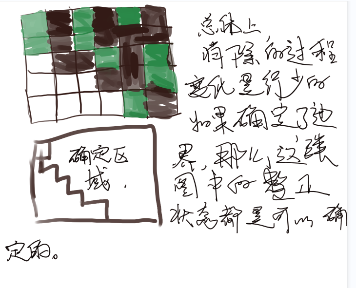
**状态设计：**
记录这个路径就可以将这个边界确定，从而进一步确定整个图的结构： 实现转移
路径的记忆方法： 用一个二进制，从低位到高位模拟，从（1 ， 1） 到( n , n)每一步的走法（在注意是在网格点上行走的而不是在内部）。1表示向y走，0表示向x走。于是就可以2n的二进制串来记录出一条路的结构：
$f_{s}$ 表示路径信息为s时，的最小花费。
**状态转移：**
首先用一个数组，找到每一个角： 形如10的情况。

1. 分别记录出黑白：
1. 两两匹配用第二种方法处理：

**集中精力解决的一些问题：**

1. 细节问题：

   1. 进制状态到边界的映射：

      1. 某一个拐角的坐标怎么确定： 从低位到高位模拟这个路径。找到拐角与当前坐标的联系：
      2. 模拟细节：
         1. 初始位置为（0 ， 0）， 表示最左顶的方格。
         2. 0表示x++ , 1表示y++
         3. 如果接下来进行01的移动说明当前格子是拐角：

   2. 状态转移：

      在上述模拟行走的过程中，实现对两种颜色格子的记录：

      记录的内容：

      1. 这个拐角的坐标信息：
      2. 如果对这个拐角消除之后，原来的10就会变成01.为了修改，因此记录代表该拐角的10位置的信息。适用10 中 0的首位置来表示（i）： 消除的操作为 s ^(3 << i)


**初始化：**

1. $f_{111..._{n}000..._{n}} = 0$
2. 其余表示为： inf；表示该状态不存在；

#### code

```cpp
#include<bits/stdc++.h>
using namespace std;
using ll = long long;

#define fsio ios::sync_with_stdio(false);cin.tie(0);
#define bit(x) (1 << (x))

const int inf = (int)1E9 + 7;
const ll INF = (long long)1E18 + 7;
const int N = 25;
char mp[N][N];
int w[N][N];
int f[bit(N)];
void upd(int& a , int b) {
	if (a > b) a = b;
}
int main() {
	fsio;
	int n; cin >> n;
	for (int i = 0; i < n; i++)
		cin >> mp[i];
	for (int i = 0; i < n; i++)
		for (int j = 0; j < n; j++)
			cin >> w[i][j];
	memset(f , 0x3f , sizeof f);
	// 初始化

	// 记录某一种颜色下，的方格的个数情况：
	const int M = 2 * n;
	array<int , 2> white[M] , black[M];

	// dp数组的初始化：

	f[bit(2 * n) - bit(n)] = 0;
	// 枚举路径的信息：
	for (int s = bit(M) - 1; s >= 0; s--) {
		if (f[s] < 0x3f3f3f3f) {

			// 当前走到哪里：
			int x = 0 , y = 0;
			int cw = 0 , cb = 0;

			for (int i = 0; i < M; i++) {
				// 检测当前是否为10类：
				// 说明当前点为为拐角：
				if (((s >> i) & 3) == 2) {
					upd(f[s ^ (3 << i)] , f[s] + w[x][y]);
					if (mp[x][y] == 'B') {
						black[cb++] = {i , w[x][y]};
					} else {
						white[cw++] = {i , w[x][y]};
					}
				}
				if (s & bit(i)) y++; else x++;
			}
			for (int i = 0; i < cb; i++)
				for (int j = 0; j < cw; j++)
				{
					upd(f[s ^ (3 << black[i][0]) ^ (3 << white[j][0])] ,
					    f[s] + abs(black[i][1] - white[j][1]));
				}
		}
	}
	cout << f[bit(n) - 1] << '\n';
}
```

-----

# B. Imbalanced Arrays

[Problem - B - Codeforces](https://codeforces.com/contest/1852/problem/B)

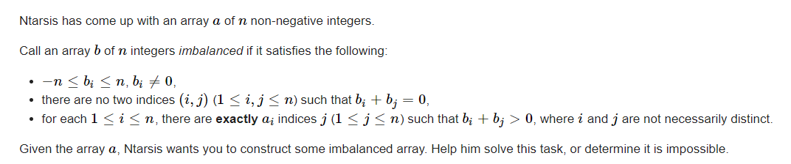

### solve

首先先排序一遍： 从两端开始看：

发现由$a_{i}$ 可以挖掘排序后首尾的一些匹配关系： 构造入口是两端，逐步前移动，发现总有唯一构造方案，同时为了防止标记不够用，标记总是从大中选择。

r从大到小遍历，更新了一个r之后，从后往前遍历更新l , 发现矛盾就判无解：
对标记注意错开使用：

1. tagr : n 或者 n - 1 （具体选择要看首尾a[r]的情况，要追求尽量使用满标记。） 
2. tagl : -n 或-n + 1

看上去jls的思路更清晰： 下分析jls的代码思路：

### code jls

```cpp
#include <bits/stdc++.h>

using i64 = long long;

void solve() {
    int n;
    std::cin >> n;
    
    std::vector<int> a(n);
    for (int i = 0; i < n; i++) {
        std::cin >> a[i];
    }
    
    std::vector<int> p(n);
    std::iota(p.begin(), p.end(), 0);
    std::sort(p.begin(), p.end(), [&](int i, int j) {
        return a[i] < a[j];
    });
    
    int l = 0, r = n - 1;
    int pos = 0;
    std::vector<int> ans(n);
    for (int i = n; i > 0; i--) {
        if (a[p[l]] - pos == 0) {
            ans[p[l]] = -i;
            l++;
        } else if (a[p[r]] - pos == i) {
            ans[p[r]] = i;
            pos++;
            r--;
        } else {
            std::cout << "NO\n";
            return;
        }
    }
    std::cout << "YES\n";
    for (int i = 0; i < n; i++) {
        std::cout << ans[i] << " \n"[i == n - 1];
    }
}

int main() {
    std::ios::sync_with_stdio(false);
    std::cin.tie(nullptr);
    
    int t;
    std::cin >> t;
    
    while (t--) {
        solve();
    }
    
    return 0;
}
```

### myself code

```cpp
#include<bits/stdc++.h>
using namespace std;

using ll = long long;

#define dbg(x) cerr << "[" << __LINE__ << "]" << ": " << x << "\n"

#define all(x) (x).begin(),(x).end()
#define sz(x) (int)(x).size()
#define fi first
#define se second

const int inf = 1E9 + 7;
const ll INF = 1E18 + 7;
const int N = 1E6 + 10;

/*
1
3
1 3 1
*/

void work(int testNo)
{
	int n;
	cin >> n;
	vector<pair<int, int>> rec(n + 1);
	for (int i = 1; i <= n; i++) {
		int x;
		cin >> x;
		rec[i] = { x , i };
	}
	sort(rec.begin() + 1, rec.end());
	vector<int> ans(n + 1);
	int cur ;
	if (rec[1].fi == 0) cur = n - 1;
	else cur = n;
	rec[0].fi = -1000;
	// 错开的构造思路：
	for (int r = n, l = 1; r >= 1 && r >= l; r--, cur -= 2) {
		ans[rec[r].se] = cur;
		int suf = n - r;
		while (r >= 1 && rec[r].fi == rec[r - 1].fi) {
			r--;
			ans[rec[r].se] = cur;
		}

		// 怎么对相遇的情况做出处理？
		while (l <= n - rec[r].fi) {
			ans[rec[l].se] = -cur - 1;
			if (rec[l].fi != suf) {
				// cout << rec[l].fi << " " << n - r << "\n";
				cout << "NO\n"; return;
			}
			l++;
		}
	}
	cout << "YES\n";
	for (int i = 1; i <= n; i++) {
		cout << ans[i] << " \n"[i == n];
	}
}

signed main()
{
	ios::sync_with_stdio(false);
	cin.tie(0);

	int t; cin >> t;
	for (int i = 1; i <= t; i++)work(i);
}

/* stuff you should look for
* int overflow, array bounds
* special cases (n=1?)
* do smth instead of nothing and stay organized
* WRITE STUFF DOWN
* DON'T GET STUCK ON ONE APPROACH
*/
```

------


# C2. Dual (Hard Version)

[Problem - C2 - Codeforces](https://codeforces.com/contest/1855/problem/C2)

[Popskyy & tiasu - Dual](https://soundcloud.com/popskyy/popskyy-tiasu-dual)

给你一个整数数组 $a_1, a_2,\dots, a_n$（正数、负数或 $0$）。你可以对数组进行多种运算（可能有 $0$种运算）。
在一次操作中，您可以选择 $i, j$（$1 \leq i, j \leq n$，它们可以相等）并设置 $a_i := a_i + a_j$（即将 $a_j$加到 $a_i$）。
使数组在最多$31$次运算中不递减（即$a_i \leq a_{i+1}$次为$1 \leq i \leq n-1$次）。您不需要尽量减少运算次数。

### solve

典型的构造观察题：

1. 考虑一个简单的问题： 其实就是简单版本中的正解：对于全正或全负的数组的处理方式：
   1. 做一个前缀和或者后缀和：
2. 想到怎么将问题转换成上述问题： 用31次卡过去：事实上（由于长度为20 ， 1操作只花费19次，因此12次花费可以支配：）

3. 关注序列的正负情况： 数量分别为a  , b：（反之同理）
   1. a等于b。a , b中的绝对值最大者：容易解决问题 一共操作29次：
   2. a = 9 , b = 11: 取绝对值较大的一边，然后可以至多在11 + 19 = 30次类似上述情况：解决问题：
   3. a = 8 , b = 12 : 同上：12 + 19 = 31
   4. a = 7 , b = 13 : 现在其拥有更多的倍增机会， 为5（5 + 7 + 19 = 31）次倍增：（2 * 2 * 2 * 2 * 2 = 32）
   5. 后续同上：

### 生长思考：

不够敏锐： 

1. 意识到长度更短之后，倍增机会更多之后。进一步分类讨论，进行深化；
2. 并且要非常精准的把握住31次机会操作的特殊性。

### code

```cpp
#include<bits/stdc++.h>
using namespace std;

using ll = long long;

#define dbg(x) cerr << "[" << __LINE__ << "]" << ": " << x << "\n"

#define all(x) (x).begin(),(x).end()
#define sz(x) (int)(x).size()

const int inf = 1E9 + 7;
const ll INF = 1E18 + 7;
const int N = 1E6 + 10;

void work(int testNo)
{
	int n;
	cin >> n;

	vector<int> a(n + 1);
	int mi = inf;
	int mx = -inf;
	int sum1 = 0, sum2 = 0;
	int idmx, idmi;
	for (int i = 1; i <= n; i++) {
		cin >> a[i];
		if (a[i] > 0)sum1++;
		else if (a[i] < 0) sum2++;
		mi = min(a[i], mi);
		mx = max(a[i], mx);
	}

	vector<pair<int, int>> ans;
	auto pre = [&]() {
		for (int i = 2; i <= n; i++) {
			ans.push_back({ i , i - 1 });
		}
	};

	auto suf = [&]() {
		for (int i = n - 1; i >= 1; i--) {
			ans.push_back({ i , i + 1 });
		}
	};

	auto update1 = [&]() {
		for (int i = 1; i <= n; i++) {
			if (a[i] < 0) ans.push_back({ i , idmx });
		}
	};
	auto update2 = [&]() {
		for (int i = 1; i <= n; i++) {
			if (a[i] > 0) ans.push_back({ i , idmi });
		}
	};

	for (int i = 1; i <= n; i++) {
		if (a[i] == mx) idmx = i;
		if (a[i] == mi) idmi = i;
	};


	if (mi >= 0) {
		pre();
	}
	else if (mx <= 0) {
		suf();
	}
	else {
		if (sum1 == sum2) {
			if (abs(mi) >= mx) {
				update2();
				suf();

			}
			else {
				update1();
				pre();

			}
		}
		else if (abs(sum1 - sum2) <= 4) {
			if (mx > abs(mi)) {
				update1();
				pre();
			}
			else {
				update2();
				suf();
			}
		}
		else if (sum1 > sum2) {
			while (mx + mi < 0) {
				mx += mx;
				ans.push_back({ idmx , idmx });
			}
			update1();
			pre();
		}
		else {
			while (mx + mi > 0) {
				mi += mi;
				ans.push_back({ idmi , idmi });
			}
			update2();
			suf();
		}

	}
	cout << sz(ans) << "\n";
	for (auto p : ans) {
		cout << p.first << " " << p.second << "\n";
	}
}
signed main()
{
	ios::sync_with_stdio(false);
	cin.tie(0);

	int t; cin >> t;
	for (int i = 1; i <= t; i++)work(i);
}
```


