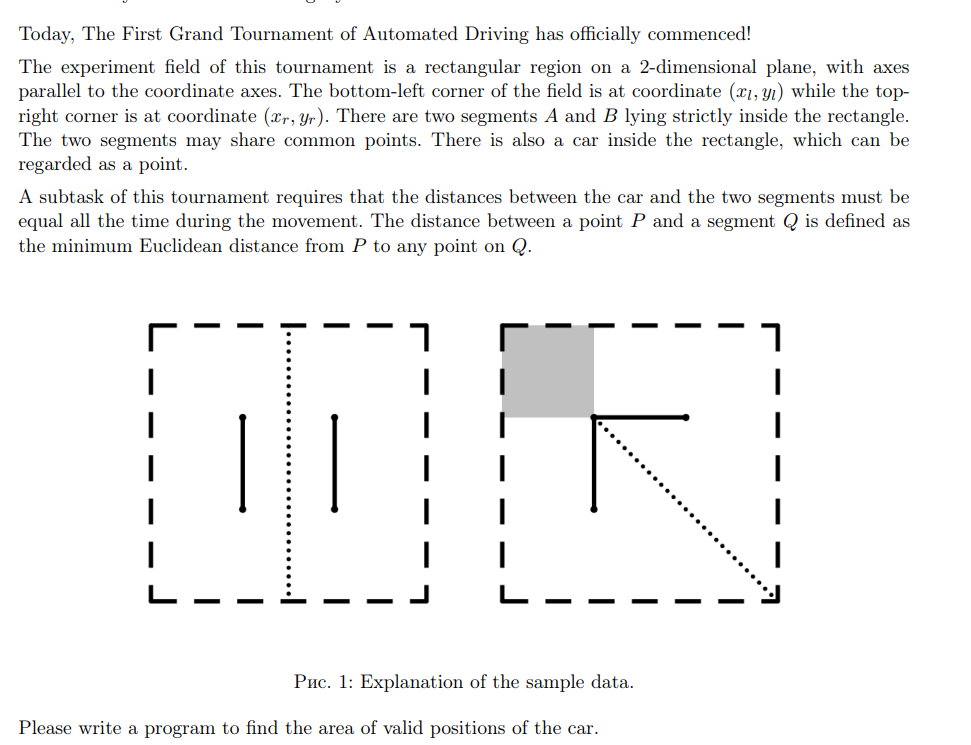
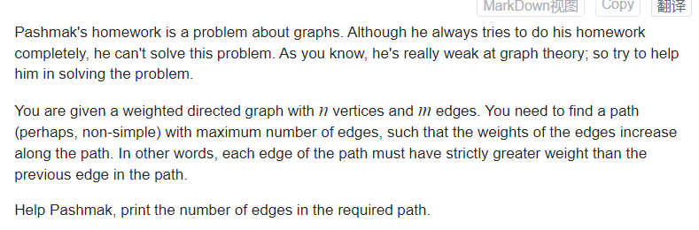
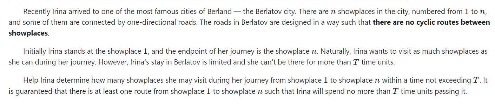
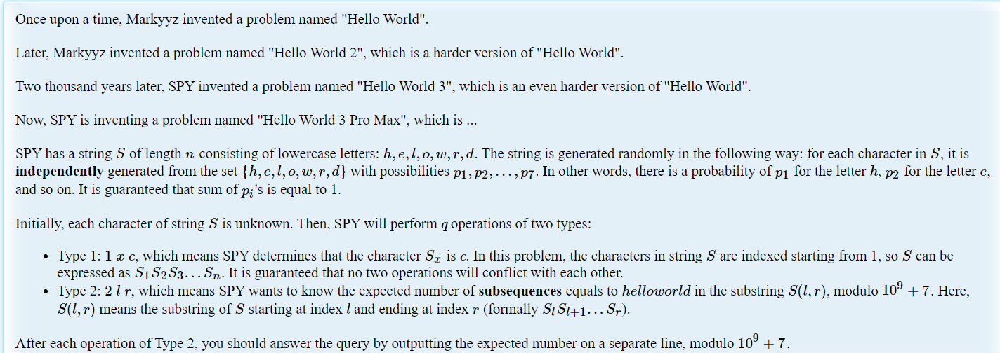
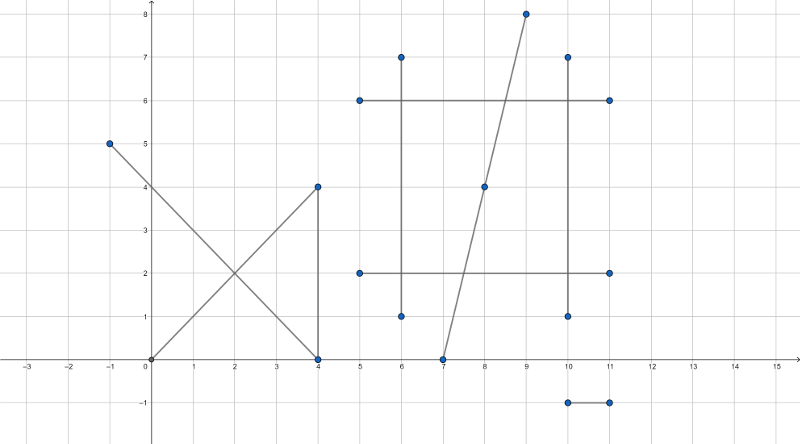

# 九月

**《题都城南庄》** 
**去年今日此门中，人面桃花相映红。**
**人面不知何处去，桃花依旧笑春风。**
ICPC网络赛：备战，争取两个名额。 ==完蛋, 大概率只有一个名额。==

9月将要过去，剩下几天里该怎么去准备ccpc , icpc？
同时也迷惑，最后两个月是否还有高强度做笔记的意义。

所有事情，都已进入尾声。

### 补题：

icpc (2)网络赛：

1.  [ICPC2023（2）.md](..\..\problems\XCPC\网络赛\ICPC2023（2）.md) 

**ICPC VP**

1.  [2022西安.md](..\..\problems\XCPC\VP\2022\2022西安.md) ==咕咕 ， 网络流 + 一道dp。加未知算法。==
    **div2 9.10 D1 + D2补题**
    **div2 9.12** 补题：

### 技能书更新

**计算几何：**

1. 多边形题集： 
   [多边形—中级课课程解题报告.md](..\..\Logrithm\计算几何\多边形\多边形—中级课课程解题报告.md) 

**图论**

1. [图上dp进阶.md](..\..\Logrithm\动态规划\图上dp\图上dp进阶.md) ==咕咕==

**数论**

1. exgcd [exgcd.md](..\..\Logrithm\数学\扩展欧几里得算法\exgcd.md) ==咕咕==

2. [整除分块板子.md](..\..\Logrithm\数学\数论\数论基础\整除分块板子.md) 

    

Z函数 ：  [Z函数板子.md](..\..\Logrithm\string\Z函数\Z函数板子.md) 

### codeforeces

**图论：**

1.  [E. Speedrun.md](..\..\problems\codeforces\2100\图论\E. Speedrun.md) ==咕咕==
1.  [E. Square Root of Permutation.md](..\..\problems\codeforces\2200\图论\置换与图论\E. Square Root of Permutation.md)

**动态规划：**

1. 期望dp： [Hello World 3 Pro Max.md](..\..\problems\HDU\杭电多校\动态规划\期望dp\Hello World 3 Pro Max.md)
2. 滚动 以及单调队列优化dp:  [Klee likes making friends.md](..\..\problems\HDU\杭电多校\动态规划\单调队列优化dp\Klee likes making friends.md)
3. 上一次发现了一道非常有意思的dp问题也没有补充： （2020的一个场）
4. [E. Vasya and Big Integers.md](..\..\problems\codeforces\2600\dp\Z函数\E. Vasya and Big Integers.md) ==咕咕== 

**数论：**

1.  [E. Sum of Remainders.md](..\..\problems\codeforces\2200\数论\整除分块\E. Sum of Remainders.md)
1.  [E. Covered Points.md](..\..\problems\codeforces\2400\计算几何\E. Covered Points.md) ==exgcd + 计算几何==

**思维：**

1.  [D. Survey in Class.md](..\..\problems\codeforces\1900\解空间压缩经典\D. Survey in Class.md) ==咕咕==

**把握模型**

1.  [E. Max to the Right of Min.md](..\..\problems\codeforces\2300\模型有限性\E. Max to the Right of Min.md) ==咕咕==
1.  [D. Berland Fair.md](..\..\problems\codeforces\1700\优雅的暴力\分阶段暴力\D. Berland Fair.md) ==咕咕==

**随机化**

1. [G1. In Search of Truth.md](..\..\Logrithm\杂篇\随机化\problems\G1. In Search of Truth.md) ==咕咕==

**最短路**

1.  [F. The Shortest Statement.md](..\..\problems\codeforces\2400\图论\最短路问题\F. The Shortest Statement.md) ==咕咕==

# CCPC网络赛

[PTA | 程序设计类实验辅助教学平台 (pintia.cn)](https://pintia.cn/problem-sets/1705510247604809728/exam/problems/1705514248467492872?type=7&page=0)

我与期望相关的贪心不公待天！！

## **I Impatient Patient**

You accidentally sprained your ankle, and now you are facing a long recovery phase. Initially, you are at stage 0, and your recovery progresses until you reach stage *n*.

Each day, if you rest properly, you advance by exactly one stage. So it takes *n* days for you to recover, that is, if you do not do anything improper.

However, instead of resting, you have the option to challenge yourself, which also takes one day. If you are at stage *i* and succeed, you will instantly recover. However, if you fail, you will regress to stage *$a_i$* (0≤*$a_i$*≤*i*). The probability of success is *$p_i$*.

Now, you are wondering what the expected time required for your recovery would be, assuming you adopt the best strategy.

### Input

The first line contains a positive integer *T* (1≤*T*≤104), denoting the number of test cases.

For each test case:

- The first line contains one integer *n* ($1≤n≤5×10^5$), denoting the number of stages of recovery.
- The next line contains *n* integers $a_0,a_1,⋯,a_{n−1} (0≤a_i≤i)$, denoting the stage you will go back to if you fail at stage *i*.
- The next line contains *n* integers$q_0,q_1,⋯,q_{n−1} (0≤q_i≤10^5)$, where $p_i=q_i/10^5 $denotes the probability of success at stage *i*.

It is guaranteed that $∑n≤5×10^5$

### solve

发现最优策略必然是一下这种形式：

不断的选择走到某个点，在这个点上一直赌，赌输了回到这个点继续赌。于是就变成了一个明确过程，计算期望的问题。

**证明如下：**

$f_i$ 表示第一次在i点赌的，后续过程的最小步数期望。

$g_i$ 表示第一次在i点赌的，总体上的方案最小期望。$g_i = i + f_i$

.png)

**求解$g_i$ **
$$
g_i = i +  \sum_{k = 0} ^{+oo} (1 + k\times(i - a_i + 1))(\overline p )^k p\\
=i  + p\sum _{k = 0}^{+oo} (1 + k\times (i - a_i + 1)) (\overline p) ^k\\
令D = i- a_i  + 1 ，原式：\\
= i+ p\sum _{k = 0}^{+oo} (1 + k\times D) (\overline p) ^k\\
= i + 1 + D\times (\frac{\overline p}{p})
$$

### 生长思考：

1. 首先1000个人过的题，为什么不是一个朴素结论的题？
   1. 为什么长时间以来，都不去考虑是否可能拥有一个朴素的结论？

2. 


### code

```cpp
const int inf = 1E9 + 7;
const ll INF = 1E18 + 7;
const int N = 1E6 + 10;
void work(int testNo)
{
	int n; cin >> n;
	vector<int> b(n) , a(n);
	for (int i = 0; i < n; i++) {
		cin >> a[i];
	}
	for (int i = 0; i < n; i++) {
		cin >> b[i];
	}
	long double ans = n;
	for (int i = 0; i < n; i++) {
		if (b[i] == 0) continue;
		long double p = b[i] / 1E5;
		int D = i - a[i] + 1;
		long double cur = i + 1 + D * (1 - p) / p;
		ans = min(ans , cur);
	}
	cout << ans << "\n";
}
signed main()
{
	ios::sync_with_stdio(false);
	cin.tie(0);
	cout << fixed << setprecision(12);
	int t; cin >> t;
	for (int i = 1; i <= t; i++)work(i);
}
```

----

# 2022ICPC 西安

[Dashboard - The 2022 ICPC Asia Xian Regional Contest - Codeforces](https://codeforces.com/gym/104077)
铜尾： 差点铁首。

参考题解： [The 2022 ICPC Asia Xian Regional Contest / ICPC 西安 2022 题解(ABDHJKL) - 知乎 (zhihu.com)](https://zhuanlan.zhihu.com/p/588162564)


## L. Tree

You are given a tree $T$ with $n$ nodes. The tree is rooted at $1$. Define $\mathrm{subtree}(u)$ as the set of nodes in the subtree of $u$.

Call a subset of nodes $S$ good if and only if $S$ satisfies at least one of the following contidions:

-   For all $u, v\in S$ where $u\neq v$, either $u\in \mathrm{subtree}(v)$ or $v\in \mathrm{subtree}(u)$.
-   For all $u, v\in S$ where $u\neq v$, both $u\notin \mathrm{subtree}(v)$ and $v\notin \mathrm{subtree}(u)$.

You need to partition all nodes of $T$ into several good subsets. Calculate the minimum number of subsets.

### solve


### code

```cpp
#include<bits/stdc++.h>
#define int long long
using namespace std;
vector<int>g[1000000 + 50];
int fa[1000000 + 50], dep[1000000 + 50];
int ans = 0;
vector<int>vec;
void dfs(int u, int f, vector<int>&p, int d) {
    ++p[d];
    fa[u] = f;
    dep[u] = d;
    ans = max(ans, d);
    for (auto v : g[u])dfs(v, u, p, d + 1);
    if (g[u].empty())vec.push_back(u);
}
void solve() {
    int n;
    cin >> n;
    vec.clear();
    ans = 0;
    for (int i = 1; i <= n; ++i)g[i].clear();
    for (int i = 2; i <= n; ++i) {
        int f;
        cin >> f;
        g[f].push_back(i);
    }
    vector<int>d(n + 2, 0);
    dfs(1, 0, d, 1);
    vector<int>vis(n + 2, 0);
    vis[0] = 1;
    vector<pair<int, int>>pii;
    sort(vec.begin(), vec.end(), [&](int x, int y) {
        return dep[x] > dep[y];
    });
    for (auto x : vec) {
        int t = x;
        vis[t] = 1;
        while (!vis[fa[t]]) {t = fa[t]; vis[t] = 1;}
        pii.push_back({dep[t], dep[x]});
    }
    map<int, int>cnt;
    for (auto ii : pii)cnt[ii.second - ii.first + 1]++;
    int tot = pii.size();

    ans = min(ans, tot);
    int sum = 0;
    for (auto j : cnt) {
        int len = j.first, res = j.second;
        // //tot=min(tot,tot-res+len-sum);
        // if (tot - res + len - sum < tot) {
        //  tot = tot - res + len - sum;
        //  sum = len;
        // }
        sum += res;
        ans = min(ans , tot - sum + len);
        // ans = min(ans, tot);
    }
    cout << ans << "\n";
}
signed main() {
    ios::sync_with_stdio(0); cin.tie(0);
    int t;
    cin >> t;
    while (t--)solve();
}
```

------

## E. Find Maximum

We define a function $f(x)$ over all non-negative integer $x$ as follows:

$$
f(x) = \begin{cases} 1 & (x = 0) \\ f(\frac{x}{3}) + 1 & (x &gt; 0\land x\bmod3 = 0) \\ f(x - 1) + 1 & (x &gt; 0\land x\bmod 3\neq 0) \end{cases}
$$
 Calculate $\max_{x = l} ^ r f(x)$.

You need to answer $T$ queries independently.

### solve


### code

```cpp
#include<bits/stdc++.h>
using namespace std;


#define int long long

const int inf = 1 << 29;
const int N = 1E6 + 10;

int p[1000];
int sum;

void work(int testno) {
	int l , r;
	cin >> l >> r;
	/*定义最高位置：*/
	int cunt1 = 0;
	int rr = r;
	while (rr > 0) {
		cunt1++;
		rr /= 3;
	}
	int ll = l;

	vector<int> d(sum + 1 , 0);
	int cunt2 = 0;
	while (ll > 0) {
		d[cunt2] = (ll % 3);
		// cout << d[cunt2] << " ";
		cunt2++;
		ll /= 3;
	}
	// cout << "\n";
	cunt2 --; cunt1--;
	int ans = 0;
	for (int i = cunt2 + 1; i <= cunt1; i++) {
		for (int k = 1; k <= 2; k++) {
			ll = p[i] * k;
			for (int j = 0; j < i; j++) {
				if (ll + p[j] * 2 <= r) {
					ll += p[j] * 2;
				} else if (ll + p[j] <= r) {
					ll += p[j];
				}
			}
			if (ll > r || ll < l) continue;

			int temp = 0;
			while (ll > 0) {
				temp += ll % 3 + 1;
				ll /= 3;
			}
			ans = max(temp , ans);
		}
	}

	ll = l;
	for (int i = 0; i < sum; i++)
	{
		//cout<<l<<' ';
		// cout << d[i] << "\n";
		if (d[i] == 0)
		{
			if (ll + p[i] * 2 <= r) ll += p[i] * 2;
			else if (ll + p[i] <= r)
			{
				ll += p[i];
			}
		}
		else if (d[i] == 1)
		{
			if (ll + p[i] <= r)
				ll += p[i];
		}
		//cout<<l<<'\n';
	}
	// cout << ll << "\n";
	long long temp = 0;
	while (ll > 0) {
		temp += ll % 3 + 1;
		ll /= 3;
	}
	ans = max(temp , ans);

	cout << ans << "\n";
}

signed main() {
	ios::sync_with_stdio(false);
	cin.tie(nullptr);
	p[0] = 1;
	for (int i = 1; i < N; i++) {
		p[i] = p[i - 1] * 3;
		if (p[i] <= 1E18) sum++;
		else break;
	}
	int t; cin >> t;
	for (int i = 1; i <= t; i++)
		work(i);
	return 0;
}
```

## D. Contests

There are $n$ contestants and they take part in $m$ contests. You are given the ranklist of each contest. The ranklist of the $k$\-th contest is a sequence $a_k$, indicating that the $a_{k, i}$\-th contestant's rank is $i$.

SolarPea and PolarSea are two of the $n$ contestants. SolarPea wants to prove that he is stronger than PolarSea.

Define $x$ is $l$\-stronger than $y$, if and only if there exists a sequence $b$ of length $l + 1$, such that $b_1 = x$, $b_{l + 1} = y$, and for all $1\leq i\leq k$, $b_i$ has a smaller rank than $b_{i + 1}$ in at least one contest.

There are $q$ queries. In the $i$\-th query, SolarPea is contestant $x$ and PolarSea is contestant $y$. Please find the minimum positive number $l$ such that SolarPea is $l$\-stronger than PolarSea.

### solve

用图论的角度上。序列中不断地增加新地元素 ， 可以看作选择了某个排列上偏序关系地过程。显然如果下一次使用某个排列上地关系。对于前面地策略，必然式相同步数下最后到达地元素在该排列上，位置下标越小越好。

$f_{i , j , k}$ 表示，从i开始， 花费j步数，能到达k序列的最小位置。 但是显然，这样状态会非常多。并且每一次处理查询，都要枚举步数进行检查。 总体的复杂度高达$O(N^2)$ 显然是会挂掉的。

**集中精力解决减小规模的问题：**

发现一些现象：

考虑倍增 ， $f_{i , j , k}$ 表示 从i出发， 最多花费$2^k$ 的步数。到达j排列上的最短位置。

**状态转移：**
$$
f_{i ,j , k} = min(f_{i , j , k - 1} , f_{u_l , j , k - 1})\\
u_l = a_{l ,f_{i , l , k - 1}}
$$
**初始化：**

和一般的倍增一致，初始化k = 0的数组即可。

**怎么通过上述的倍增数组得到询问的解？**

维护一个$p_i$ ， 表示更新过程中，各个排列可以到达的最早位置。

在上述$p_i$ 的基础上走$2^k$ 步数。得到一个被更新的$g_i$

1. 如果$g_i$ 状态下，已经可以到达y:(即存在$p_i \le pos_{i ,y}$)

   则不更新答案。

2. 否则 ， 更新ans , 以及$p_i$


### code

```cpp
#include<bits/stdc++.h>
using namespace std;

const int N = (int)1E5 + 10;
const int M = 7;
const int LOG = 18;

int a[M][N] , pos[M][N];
int f[N][M][LOG];

void cmin(int& x , int y) {
	if (x > y) x = y;
}

int main() {
	ios::sync_with_stdio(false);
	cin.tie(0);
	int n , m;
	cin >> n >> m;
	for (int i = 1; i <= m; i++) {
		for (int j = 1; j <= n; j++) {
			cin >> a[i][j];
			/*记录第i个序列中a[i][j]的位置：*/
			pos[i][a[i][j]] = j;
		}
	}
	for (int k = 0; k < LOG; k++)
		for (int i = 1; i <= n + 1; i++)
			for (int j = 1; j <= m; j++)
				f[i][j][k] = n + 1;
	// 跳到k的最前位置：
	for (int k = 1; k <= m; k++) {
		// 从第i个序列进行枚举：
		for (int j = 1; j <= m; j++) {
			int mi = n + 1;
			for (int i = n; i > 0; i--) {
				cmin(mi , pos[k][a[j][i]]);
				cmin(f[a[j][i]][k][0] , mi);
			}
		}
	}
	for (int k = 1; k < LOG; k++)
		for (int i = 1; i <= n; i++)
			for (int j = 1; j <= m; j++) {
				f[i][j][k] = f[i][j][k - 1];
				for (int l = 1; l <= m; l++) {
					cmin(f[i][j][k] , f[a[l][f[i][l][k - 1]]][j][k - 1]);
				}
			}

	int q; cin >> q;
	while (q--) {
		int x , y; cin >> x >> y;
		/*首先做一些基础的特判：*/
		int ans = 0 , p[M];
		bool have_ans = false;
		/*然后怎么倍增得到最小值？*/
		for (int i = 1; i <= m; i++) {
			p[i] = pos[i][x];
			if (pos[i][x] <= pos[i][y]) {
				ans = -1;
				have_ans = true;
				goto print;
			}
		}
		for (int k = LOG - 1; k >= 0; k--) {
			int g[M] , flag = 0;
			/*更新g[j]*/
			for (int j = 1; j <= m; j++) {
				g[j] = p[j];
				for (int l = 1; l <= m; l++)
					cmin(g[j] , f[a[l][p[l]]][j][k]);
				if (g[j] <= pos[j][y]) {
					have_ans = true;
					flag = true;
					break;
				}
			}
			if (flag == false) {
				ans += 1 << k;
				memcpy(p , g , sizeof(p));
			}
		}
		//
print:
		if (have_ans) cout << ans + 2 << "\n";
		else cout << -1 << "\n";
	}
}
```

----

# 多边形——中级课课程解题报告

## HNOI2007, 最小矩形覆盖

http://oj.daimayuan.top/course/30/problem/1208
给定一些点的坐标，要求求能够覆盖所有点的最小面积的矩形，输出所求矩形的面积和四个顶点坐标。


### solve

**分析一个显然的解空间的枚举方式：**
显然只需要关注这些点的凸包：
枚举一条边的角度。矩形的其它边也就确定了。
**观察一些现象：**
最优的方案总有一个特征：矩阵上的一条边总是和凸包上的一条边重合的。于是大程度减少直线斜率的枚举规模。
**每次枚举一个边的方向时 ，怎么进一步确定其它方向的边？**
对于一种情形下，快速确定边界的方法是，通过点积的大小判断：
点积最大与最小分别组成了左右边界。通过叉积来判断上边界

但是如果朴素的枚举然后，寻找边界。显然复杂度是不允许的。

**怎么快速的定位左右边界？**

发现按顺序的枚举边，其余两个边界，也是微小变化的。可能发生的变化仅限于，边界点变成逆时针的下一个顶点。

这个和旋转卡壳的思想很相似。一个枚举资源下，计算这些资源中的某些本质属性，要有一定量的花费。但是我们可以从临近的资源中的结果，得到答案。

**实现：**

1. 求出凸包：
2. 找到一个扫描的起点。一般初始选择边为$P_{0 , 1}$
   1. 初始状态下： L， R， U。分别表示几个方向上的一个分割的点的代表。
3. 上述L ， R， U， D确定之后 ， 进一步计算和矩形的相关的属性： 面积以及端点。

**确定两条边的长度：**
-1693586871207-1.png)
从而确定了面积。 接下来确定四个端点：
确定四个顶点，只需要确定四条对应的直线。然后使用使用封装好的函数即可。


同理使用类似的定位思想，就可以确定其它点，以及直线。

**tips:**

远古题中，没有special judge。 会导致-0.00000被判别错误。如果到时候一直wa。要注意取是否和0.0000接近重合。如果是则取一个绝对值。

### code

```cpp
#include<bits/stdc++.h>

using namespace std;

using ll = long long;
using db = double;

const double EPS = 1E-9;

inline int sign(db a) {return a < -EPS ? -1 : a > EPS;}
inline int cmp(db a , db b) {return sign(a - b);}

struct P {
	db x , y;
	P() {}
	P(db x_ , db y_) : x(x_) , y(y_) {}

	P operator+(P p) {
		return {x + p.x , y + p.y};
	}
	P operator-(P p) {
		return {x - p.x , y - p.y};
	}
	P operator*(db d) {
		return {x * d , y * d};
	}
	P operator/(db d) {
		return {x / d , y / d};
	}
	bool operator<(P p) const {
		int c = cmp(y , p.y);
		if (c) return c == -1;
		return cmp(x , p.x) == -1;
	}
	db dot(P p) {
		return x * p.x + y * p.y;
	}
	db det(P p) {
		return x * p.y - y * p.x;
	}
	P rot90() {
		return P(-y , x);
	}
	db abs() {return sqrt(abs2());}
	db abs2() {return x * x + y * y;}
};
#define cross(p1 , p2 , p3) ((p2.x - p1.x) * (p3.y - p1.y) - (p3.x - p1.x) * (p2.y - p1.y))
#define crossOp(p1 , p2 , p3) sign(cross(p1 , p2 , p3))

P isLL(P p1 , P p2 , P q1 , P q2) {
	db a1 = cross(q1 , q2 , p1) , a2 = -cross(q1 , q2 , p2);
	return (p1 * a2 + p2 * a1) / (a1 + a2);
}

vector<P> convexHul(vector<P> ps) {
	int n = ps.size(); if (n <= 1) return ps;
	sort(ps.begin() , ps.end());
	vector<P> qs(2 * n); int k = 0;
	for (int i = 0; i < n; qs[k++] = ps[i++])
		while (k > 1 && crossOp(qs[k - 2] , qs[k - 1] , ps[i]) <= 0)--k;
	for (int i = n - 2 , t = k; i >= 0; qs[k++] = ps[i--])
		while (k > t && crossOp(qs[k - 2] , qs[k - 1] , ps[i]) <= 0) --k;
	qs.resize(k - 1);
	return qs;
}


int main() {
	// ios::sync_with_stdio(false);
	// cin.tie(0);
	int n;
	// cin >> n;
	scanf("%d" , &n);
	vector<P> p(n);
	for (int i = 0; i < n; i++) {
		// cin >> p[i].x >> p[i].y;
		scanf("%lf%lf" , &p[i].x , &p[i].y);
	}
	/*求个凸包：*/
	p = convexHul(p);
	n = (int) p.size();
	p.resize(n * 2);
	for (int  i = 0; i < n; i++)
		p[i + n] = p[i];
	/*定义出初始状态*/
	vector<P> ansp;
	P d = p[1] - p[0];
	int L = -1 , R = -1 , U = -1;
	for (int i = 0; i < n; i++) {
		if (R == -1 || d.dot(p[i]) > d.dot(p[R])) R = i;
		if (L == -1 || d.dot(p[i]) < d.dot(p[L])) L = i;
		if (U == -1 || d.det(p[i]) > d.det(p[U])) U = i;
	}

	db ans = 1E10;
	for (int i = 0; i < n; i++) {
		d = p[i + 1] - p[i];
		while (R + 1 < 2 * n  &&  d.dot(p[R + 1]) > d.dot(p[R])) ++R;
		while (L + 1 < 2 * n  &&  d.dot(p[L + 1]) < d.dot(p[L])) ++L;
		while (U + 1 < 2 * n  &&  d.det(p[U + 1]) > d.det(p[U])) ++U;
		/*然后求出两条边的边长：*/
		/*底*/
		db s1 = d.dot(p[R] - p[L]) / d.abs();
		db s2 = d.det(p[U] - p[i]) / d.abs();
		if (s1 * s2 < ans) {
			ans = s1 * s2;
			/*然后就是求出四个顶点。*/
			/*右下：*/
			P p1 = isLL(p[i] , p[i] + d , p[R] , p[R] + d.rot90());
			/*右上：*/
			P p2 = isLL(p[U] , p[U] - d , p[R] , p[R] + d.rot90());
			/*左上*/
			P p3 = isLL(p[U] , p[U] - d , p[L] , p[L] - d.rot90());
			/*左下*/
			P p4 = isLL(p[i] , p[i] + d , p[L] , p[L] - d.rot90());
			ansp = vector<P> {p1 , p2 , p3 , p4};
			/*调整顺序：*/
			/*该函数机理的理解：*/

			rotate(ansp.begin(), min_element(ansp.begin(), ansp.end()), ansp.end());
		}
	}
	// cout << fixed << setprecision(6);
	// cout << ans << "\n";
	printf("%.5f\n" , ans);
	for (int i = 0; i < 4; i++) {
		// cout << ansp[i].x << " " << ansp[i].y << "\n";
		printf("%.5f %.5f\n" , abs(ansp[i].x) , abs(ansp[i].y));
	}
}
```

## ICPC Shenyang 2020 A, The Grand Tournament



简介：给定一个矩形，以及两条线段。分析矩形内部，到达两条线段最短距离的点，组成的集合的面积：对于最短距离： 就是点到线段任意点的距离取最小值。

### solve

分析得，总体上。其实情况就只有如下几种：

1. 相交：
   1. 非严格相交：
      1. 端点相交。
      2. 线段重合。
   2. 非严格相交：
2. 不相交：
   1. 平行：
   2. 延长线相交。

每一种情况得分析如下所示：

-1693641515962-5.png)

显然只需要关注4 , 5这几种情况。
对上述几种情况进行总结： 就转变成了一个半平面交得过程。同时可以表述为。直线切割多边形得过程。具体过程如下：

1. 一条线段的端点如果在两条线段上。

   1. 使用垂直线段分割剩余的多边形。

   2. 有部分段相交。一整段上的垂直平面都符合题意。

      相交段下注意切线的方向。（由于切多边形函数返回的是切线方向逆时针方向的多边形：）

      .png)

2. 没有相交，或者严格相交： sum = 0;

### code

```cpp
#include<bits/stdc++.h>

using namespace std;

using ll = long long;
using db = double;

const double EPS = 1E-9;

inline int sign(db a) {return a < -EPS ? -1 : a > EPS;}
inline int cmp(db a , db b) {return sign(a - b);}

struct P {
	db x , y;
	P() {}
	P(db x_ , db y_) : x(x_) , y(y_) {}

	P operator+(P p) {
		return {x + p.x , y + p.y};
	}
	P operator-(P p) {
		return {x - p.x , y - p.y};
	}
	P operator*(db d) {
		return {x * d , y * d};
	}
	P operator/(db d) {
		return {x / d , y / d};
	}
	bool operator<(P p) const {
		int c = cmp(y , p.y);
		if (c) return c == -1;
		return cmp(x , p.x) == -1;
	}
	bool operator==(P p) const {
		return cmp(x , p.x) == 0 && cmp(y , p.y) == 0;
	}
	void read() {
		cin >> x >> y;
	}
	db dot(P p) {
		return x * p.x + y * p.y;
	}
	db det(P p) {
		return x * p.y - y * p.x;
	}
	P rot90() {
		return P(-y , x);
	}
	db abs() {return sqrt(abs2());}
	db abs2() {return x * x + y * y;}
};
#define cross(p1 , p2 , p3) ((p2.x - p1.x) * (p3.y - p1.y) - (p3.x - p1.x) * (p2.y - p1.y))
#define crossOp(p1 , p2 , p3) sign(cross(p1 , p2 , p3))


P isLL(P p1 , P p2 , P q1 , P q2) {
	db a1 = cross(q1 , q2 , p1) , a2 = -cross(q1 , q2 , p2);
	return (p1 * a2 + p2 * a1) / (a1 + a2);
}

db area(vector<P> ps) {
	db ret = 0;
	for (int i = 0; i < (int) ps.size(); i++) {
		ret += ps[i].det(ps[(i + 1) % (int)ps.size()]);
	}
	return abs(ret / 2);
}

// 注意规范。保留的是逆时针方向上的多边形。
vector<P> convexCut(const vector<P>& ps , P q1 , P q2) {
	vector<P> qs;
	int n = ps.size();
	for (int i = 0; i < n; i++) {
		P p1 = ps[i] , p2 = ps[(i + 1) % n];
		int d1 = crossOp(q1 , q2 , p1) , d2 = crossOp(q1 , q2 , p2);
		if (d1 >= 0) qs.push_back(p1);
		if (d1 * d2 < 0) qs.push_back(isLL(p1 , p2 , q1 , q2));
	}
	return qs;
}

void solve() {
	P ld , ru;
	ld.read(); ru.read();
	/*矩形中的点：*/
	vector<P> ret({ld , {ru.x , ld.y} , ru , {ld.x , ru.y}});
	P l1[2] , l2[2];
	l1[0].read(); l1[1].read();
	l2[0].read(); l2[1].read();
	db ans = 0;
	for (int i = 0; i < 2; i++)
		for (int j = 0; j < 2; j++) {
			if (l1[i] == l2[j]) {
				auto cur = ret;
				/*定位分割线是当前要集中精力解决的问题：*/
				cur = convexCut(cur , l1[i] , l1[i] + (l1[1 - i] - l1[i]).rot90());
				cur = convexCut(cur , l2[j] , l2[j] + (l2[1 - j] - l2[j]).rot90());
				ans += area(cur);
			}
		}
	if (crossOp(l1[0] , l1[1] , l2[0]) == 0 && crossOp(l1[0] , l1[1] , l2[1]) == 0) {
		auto cur = ret;
		for (int i = 0; i < 2; i++) {
			cur = convexCut(cur , l1[i] , l1[i] - (l1[1 - i] - l1[i]).rot90());
			cur = convexCut(cur , l2[i] , l2[i] - (l2[1 - i] - l2[i]).rot90());
		}
		ans += area(cur);
	}
	cout << fixed << setprecision(9);
	cout << ans << "\n";
}

int main() {
	ios::sync_with_stdio(false);
	cin.tie(0);
	int t; cin >> t;
	while (t--) solve();
}
```

## ICPC World Final 2017 A, Airport Construction

题意： 给定一个简单多边形， 在简单多边形找到一条尽量长的线段。要满足，线段要完全在多边形内部。

### solve

**减少枚举空间**
对任何一个解，平移线段，在某个方向上总是不劣的直到碰到某个节点。因此触碰节点的线段集合，包含了最优解。

继续探索空间，发现只触碰一个点的方案中。按照某个方向旋转直线。是可以找到更优解的。
不大会证。但是是比较显然，应该可以看出来。
因此花费$n^2$ 的代价计算花费。然后接下来集中精力解决的问题如下：

1. 判断枚举线段的合法性。即是否完全被多边形包含。
   其方法是，求完所有交点。然后通过这些交点进行线段分割。关注每一子段的中点。显然，线段被包含在多边形中，要满足，每一个中点都在多边形中。

复杂度估计是：$O(N^4)$ 及时剪枝。还可以看命。（由于中间经过的点并不总是非常多的。加了一些剪枝之后并不非常好卡。）

这是一些简单的经验，如果比赛的过程中没有题目写了。可以基于当前角度交上一发。

### code

```cpp
#include<bits/stdc++.h>

using namespace std;

using ll = long long;
using db = double;

const db EPS = 1E-9;

inline int sign(db a) {return a < -EPS ? -1 : a > EPS;}
inline int cmp(db a , db b) {return sign(a - b);}

struct P {
	db x , y;
	P() {}
	P(db x_ , db y_) : x(x_) , y(y_) {}

	P operator+(P p) {
		return {x + p.x , y + p.y};
	}
	P operator-(P p) {
		return {x - p.x , y - p.y};
	}
	P operator*(db d) {
		return {x * d , y * d};
	}
	P operator/(db d) {
		return {x / d , y / d};
	}
	bool operator<(P p) const {
		int c = cmp(y , p.y);
		if (c) return c == -1;
		return cmp(x , p.x) == -1;
	}
	bool operator==(P p) const {
		return cmp(x , p.x) == 0 && cmp(y , p.y) == 0;
	}
	void read() {
		cin >> x >> y;
	}
	db dot(P p) {
		return x * p.x + y * p.y;
	}
	db det(P p) {
		return x * p.y - y * p.x;
	}
	db disTo(P p) {
		return (*this - p).abs();
	}
	db abs() {return sqrt(abs2());}
	db abs2() {return x * x + y * y;}
};
#define cross(p1 , p2 , p3) ((p2.x - p1.x) * (p3.y - p1.y) - (p3.x - p1.x) * (p2.y - p1.y))
#define crossOp(p1 , p2 , p3) sign(cross(p1 , p2 , p3))

P isLL(P p1 , P p2 , P q1 , P q2) {
	db a1 = cross(q1 , q2 , p1) , a2 = -cross(q1 , q2 , p2);
	return (p1 * a2 + p2 * a1) / (a1 + a2);
}

bool isMiddle(db a , db m , db b) {
	return sign(a - m) == 0 || sign(b - m) == 0 || ((a < m) != (b < m));
}

bool isMiddle(P a , P m , P b) {
	return isMiddle(a.x , m.x , b.x) && isMiddle(a.y , m.y , b.y);
}

bool onSeg(P p1 , P p2 , P q) {
	return crossOp(p1 , p2 , q) == 0 && isMiddle(p1 , q , p2);
}

int contain(vector<P> ps , P p) {
	int n = ps.size() , ret = 0;
	for (int i = 0; i < n; i++) {
		P u = ps[i] , v = ps[(i + 1) % n];
		if (onSeg(u , v , p)) return 1;
		if (cmp(u.y , v.y) <= 0) swap(u , v);
		if (cmp(p.y , u.y) > 0 || cmp(p.y , v.y) <= 0) continue;
		ret ^= crossOp(p , u , v) > 0;
	}
	return ret * 2;
}


#define all(x) (x).begin(),(x).end()

int n;
db ans;
vector<P> p;

void work(P p0 , P p1) {
	/*然后找到直线切割的每一个点*/
	/*基本过程，给定了一条切线。然后求出这些点：*/
	vector<P> q;
	for (int i =  0 ; i < n; i++) {
		/*说明当前点在直线上。*/
		if (crossOp(p0 , p1 , p[i]) == 0) {
			q.push_back(p[i]);
		}

		/*说明当前相交：*/
		if (crossOp(p0 , p1 , p[i]) * crossOp(p0 , p1 , p[(i + 1) % n])  < 0) {
			q.push_back(isLL(p[i] , p[(i + 1) % n] , p0 , p1));
		}
	}
	sort(all(q));
	q.erase(unique(all(q)) , q.end());
	int m = q.size();
	int s = -1 , t = -1;
	for (int i = 0; i < m; i++) {
		if (q[i] == p0) s = i;
		if (q[i] == p1) t = i;
	}
	if (s > t) swap(s , t);

	if (q[0].disTo(q[m - 1]) < ans) return;
	// cout << 1 << "\n";
	// cout << len << "\n";
	db len = 0;
	bool inside = true;
	for (int i = s; i < t; i++) {
		P mid = (q[i] + q[i + 1]) / 2;
		if (contain(p , mid) == 0) {
			// cout << "zzz\n";
			inside = false;
			break;
		} else len += q[i].disTo(q[i + 1]);
	}
	if (not inside) return;

	for (int i = s; i > 0; i--) {
		P mid = (q[i] + q[i - 1]) / 2;
		if (contain(p , mid)) {
			len += q[i].disTo(q[i - 1]);
		} else break;
	}
	for (int i = t; i < m - 1; i++) {
		P mid = (q[i] + q[i + 1]) / 2;
		if (contain(p , mid)) {
			len += q[i].disTo(q[i + 1]);
		} else break;
	}
	// cout << "aaa\n";
	ans = max(ans , len);
}
void solve() {
	ans = 0;
	cin >> n;
	p.resize(n);
	for (int i = 0; i < n; i++) {
		p[i].read();
	}
	for (int i = 0; i < n; i++)
		for (int j = i + 1; j < n; j++) {
			work(p[i] , p[j]);
		}
	cout << fixed << setprecision(10);
	cout << ans << "\n";
}
int main() {
	ios::sync_with_stdio(false);
	cin.tie(0);
	// int t; cin >> t;
	int t = 1;
	while (t--) solve();
}
```

----

# 图上动态规划进阶：

整体上，图上动态规划分成三种：

1. DAG 有向无环图，通过拓扑序处理出顺序。 （有顺序）
2. 一般图，但是可以通过缩点的方法 使图成为DAG。 于是转变成DAG上的问题。同样这也是有顺序的一个dp模型。
3. 一般图。其转移顺序，是参考最短路算法的贪心实现的。（Dijkstra， SPFA）

##  solve

### E. Pashmak and Graph

[Problem - 459E - Codeforces](https://codeforces.com/problemset/problem/459/E)



#### solve

虽然这并不是有向无环图。但是很容易想到一个阶段划分的方式（通过边的大小进行阶段划分。）

**状态设计：**
$f_i$ : 到某个阶段时（通过边的大小分类，进行阶段划分）。

**状态转移方程：**
考虑该阶段中涉及的边：


1. 显然是合法解。这种顺序转移动。每个状态记录下， 都是合法的，末边比其低的解。

#### code

```cpp
const int N = 3E5 + 10;
int f[N];
signed main()
{
	ios::sync_with_stdio(false);
	cin.tie(0);

	int n , m;
	cin >> n >> m;
	vector<array<int , 3>> rec(m);
	for (int i = 0; i < m; i++) {
		cin >> rec[i][1] >> rec[i][2] >> rec[i][0];
	}
	sort(all(rec));
	for (int l = 0; l < m; l++) {
		int r = l;
		while (r < m && rec[l][0] == rec[r][0])r++;
		map<int , int> g;
		for (int i = l; i < r; i++) {
			g[rec[i][2]] = max(g[rec[i][2]] , f[rec[i][1]] + 1);
		}
		for (auto [x , y] : g) {
			f[x] = max(f[x] , y);
		}
		l = r - 1;
	}
	cout << *max_element(f + 1, f + n + 1) << "\n";
}
```

### CF Round #374 (Div. 2) C, Journey



#### solve

**状态设计**

#### code

```cpp
#include<bits/stdc++.h>
using namespace std;
using ll = long long;

#define all(x) (x).begin(),(x).end()
#define sz(x) (int)(x).size()

const int inf = 1E9 + 7;;
const ll INF = 1E18 + 7;
const int N = 5E3 + 10;

int f[N][N] , pre[N][N];
bool vis[N][N];
array<int , 3> edge[N];

signed main()
{
	ios::sync_with_stdio(false);
	cin.tie(0);
	int n , m , T;
	cin >> n >> m >> T;
	for (int i = 1; i <= n; i++)
		for (int j = 0; j <= n; j++)
			f[i][j] = T + 1;

	for (int i = 0; i < m; i++) {
		int u  , v , t;
		cin >> u >> v >> t;
		edge[i] = {u , v  , t};
	}

	f[n][0] = 0;
	for (int i = 1; i <= n; i++) {
		for (int j = 0; j < m; j++) {
			// cerr << __LINE__ << "\n";
			auto [u  , v , t] = edge[j];
			if (f[u][i] > f[v][i - 1] + t) {
				f[u][i] = f[v][i - 1] + t;
				pre[u][i] = v;
			}
		}
	}
	// cerr << __LINE__ << "\n";
	int ans  = 0;
	for (int i = 0; i <= n; i++) {
		// cerr << f[1][i] << "\n";
		if (f[1][i] <= T) {
			ans = i;
		}
	}
	// cerr << ans << "\n";
	cout << ans + 1 << '\n';
	vector<int> path;
	int u = 1;
	while (u != n) {
		path.push_back(u);
		u = pre[u][ans--];
	}
	path.push_back(n);
	for (auto u : path) {
		cout << u << " ";
	}
	cout << "\n";
}
```

# 扩展欧几里得算法

[最大公约数 - OI Wiki (oi-wiki.org)](https://oi-wiki.org/math/number-theory/gcd/)

[P5656 【模板】二元一次不定方程 (exgcd) - 洛谷 | 计算机科学教育新生态 (luogu.com.cn)](https://www.luogu.com.cn/problem/P5656)

扩展欧几里得算法：常用于求$ax + by = gcd(a , b)$的一组可行解：

求解过程：
$$
ax_1 + by_1 = gcd(a , b)\\
bx_2 + (a\%b)y_2 = gcd(b , a \% b)\\
由于:gcd(a , b) = gcd(b , a\%b)\\
ax_1 + by_1 = bx_2 + (a \%b)y_2\\
又因为：a\%b = a - \left \lfloor  \frac{a}{b} \right \rfloor b\\
所以ax_1 + by_1 = bx_2 + (a - (\left \lfloor \frac {a}{b} \right \rfloor \times b )) y_2\\
所以x_1 = y_2 , y1 = x_2 - \left \lfloor  \frac{a}{b} \right \rfloor y_2
$$

---

将$x_2 , y_2$不断代入递归求解。直到gcd为0，递归x = 1 , y = 0.回去求解。


### 性质，以及基本问题：

**1. 求出方程的一组整数解：**


**2. 求出方程的整数解个数：**


**3. **


给定不定方程

$$ax+by=c$$

若该方程无整数解，输出 $-1$。  
若该方程有整数解，且有正整数解，则输出其**正整数**解的数量，所有**正整数**解中 $x$ 的最小值，所有**正整数**解中 $y$ 的最小值，所有**正整数**解中 $x$ 的最大值，以及所有**正整数**解中 $y$ 的最大值。  
若方程有整数解，但没有正整数解，你需要输出所有**整数解**中 $x$ 的最小正整数值， $y$ 的最小正整数值。

正整数解即为 $x, y$ 均为正整数的解，$\boldsymbol{0}$ **不是正整数**。  
整数解即为 $x,y$ 均为整数的解。  
$x$ 的最小正整数值即所有 $x$ 为正整数的整数解中 $x$ 的最小值，$y$ 同理。

对于 $100\%$ 的数据，$1 \le T \le 2 \times {10}^5$，$1 \le a, b, c \le {10}^9$。


### 板子

```cpp
int Exgcd(int a, int b, int &x, int &y) {
  if (!b) {
    x = 1;
    y = 0;
    return a;
  }
  int d = Exgcd(b, a % b, x, y);
  int t = x;
  x = y;
  y = t - (a / b) * y;
  return d;
}
```

```cpp
//整除分块
for (int l = 1, r; l <= n; l = r + 1) {
    r = n / (n / l); 
    //基于当前定位的快操作。
}
```

远古链接：[22 8 26 网赛筛补题（哈希，整除分块，与逆序对相关的贪心。）_牛客博客 (nowcoder.net)](https://blog.nowcoder.net/n/f9f5104ca9c94b1b97296113ccc44c5b)

# Z函数

[题解 P5410 【【模板】扩展 KMP（Z 函数）】 - George1123 - 洛谷博客 (luogu.com.cn)](https://www.luogu.com.cn/blog/George1123/solution-p5410)

[Z 函数（扩展 KMP） - OI Wiki (oi-wiki.org)](https://oi-wiki.org/string/z-func/)

关键的思想和manacher相似， 使用已经计算出的成果，关注对称，交等特征。

会板就行：

****

$\Large moban$

```cpp
vector<int> Z(string s) {
	int n = (int)s.size();
	vector<int> z(n);
	for (int i = 1, l = 0 , r = 0; i < n; ++i) {
		if (i <= r && z[i - l] < r - i + 1) {
			z[i] = z[i - l];
		} else {
			z[i] = max(0 , r - i + 1);
			while (i + z[i] < n && s[z[i]] == s[i + z[i]]) ++z[i];
		}
		if (i + z[i] - 1 > r) {
			l = i;
			r = i + z[i] - 1;
		}
	}
	z[0] = n;
	return z;
}

vector<int> Z(string s , string parten) {
	int n = (int)s.size();
	auto zz = Z(parten + '$' + s);
	vector<int> z(n);
	for (int i = 0 , id = (int)zz.size() - n; i < n; i++ , id++) {
		z[i] = zz[id];
	}
	return z;
}
//返回，s各个位置和parten的最小前缀匹配长度  
```

---

# E. Speedrun

[Problem - E - Codeforces](https://codeforces.com/contest/1863/problem/E)

You are playing a video game. The game has $n$ quests that need to be completed. However, the $j$\-th quest can only be completed at the beginning of hour $h_j$ of a game day. The game day is $k$ hours long. The hours of each game day are numbered $0, 1, \ldots, k - 1$. After the first day ends, a new one starts, and so on.

Also, there are dependencies between the quests, that is, for some pairs $(a_i, b_i)$ the $b_i$\-th quest can only be completed after the $a_i$\-th quest. It is guaranteed that there are **no circular dependencies**, as otherwise the game would be unbeatable and nobody would play it.

You are skilled enough to complete any number of quests in a negligible amount of time (i. e. you can complete any number of quests at the beginning of the same hour, even if there are dependencies between them). You want to complete all quests as fast as possible. To do this, you can complete the quests in any valid order. The completion time is equal to the difference between the time of completing the last quest and the time of completing the first quest in this order.

Find the least amount of time you need to complete the game.

您正在玩一款视频游戏。游戏中有$n$个任务需要完成。但是，第$j$个任务只能在游戏日的第$h_j$个小时开始时完成。游戏日为$k$小时。每个游戏日的小时数为$0, 1, \ldots, k - 1$。第一天结束后，新的一天开始，依此类推。

此外，任务之间存在依赖关系，即对于某些任务对$(a_i, b_i)$来说，$b_i$/-个任务只能在$a_i$/-个任务之后完成。保证不存在**循环依赖**，否则游戏将是不可战胜的，也不会有人玩。

您有足够的技能在可以忽略不计的时间内完成任意数量的任务（也就是说，您可以在同一小时开始时完成任意数量的任务，即使它们之间存在依赖关系）。您希望尽快完成所有任务。为此，您可以按照任何有效顺序完成任务。完成时间等于完成最后一个任务的时间与按此顺序完成第一个任务的时间之差。

找出完成游戏所需的最少时间。

###  solve


### code

```cpp
#include<bits/stdc++.h>
using namespace std;
using ll = long long;
#define dbg(x) cerr << "[" << __LINE__ << "]" << ": " << x << "\n"
#define all(x) (x).begin(),(x).end()
#define sz(x) (int)(x).size()

const int inf = 1E9 + 7;
const ll INF = 1E18 + 7;
const int N = 1E6 + 10;

void work(int testNo)
{
    int n , m , k;
    cin >> n >> m >> k;
    vector<int> h(n);
    for (int  i = 0; i < n; i++)
        cin >> h[i];
    vector<vector<int>> g(n);
    for (int i = 0; i < m; i++) {
        int u , v;
        cin >> u >> v;
        u-- , v--;
        g[u].push_back(v);
    }
    /*深度*/
    vector<int> dp(n);
    for (int i = 0; i < n; i++) {
        for (auto j : g[i]) {
            dp[j] = max(dp[j] , dp[i] + (h[j] < h[i]));
        }
    }
    vector<int> order(n);
    iota(all(order) , 0);
    sort(all(order) , [&](int x , int y) {
        return h[x] < h[y];
    });
    ll mx = 0;
    for (int i = 0; i < n; i++) {
        mx = max(mx , 1LL * dp[i] * k + h[i]);
    }
    /*然后进行一些更新：*/
    /*不断的跳跃式的选择一个起点， 并且对所有点进行小规模的更新；*/
    /*order[0]*/
    ll ans = INF;
    for (int i = 0; i < n; i++) {
        ans = min(ans , mx - h[order[i]]);
        vector<int> que;
        /*将x点放在第v天完成*/
        auto update = [&](int x , int v) {
            if (dp[x] < v) {
                dp[x] = v;
                que.push_back(x);
                mx = max(mx , 1LL * dp[x] * k + h[x]);
            }
        };
        /*将其放在第一天完成：*/
        update(order[i] , 1);
        for (int j = 0; j < sz(que); j++) {
            int u = que[j];
            for (auto v : g[u]) {
                update(v , dp[u] + (h[v] < h[u]));
            }
        }
    }
    cout << ans << "\n";
}
signed main()
{
    ios::sync_with_stdio(false);
    cin.tie(0);

    int t; cin >> t;
    for (int i = 1; i <= t; i++)work(i);
}
```


---

# E. Square Root of Permutation

[Problem - 612E - Codeforces](https://codeforces.com/problemset/problem/612/E)

# Square Root of Permutation


## 题面翻译

给定一个$n$的排列$p_i$，求一个排列$q_i$，使得对于任意$1\leq i\leq n$，$q_{q_i}=p_i$。无解输出$-1$。

$1\leq n\leq10^6$。

## 题目描述

A permutation of length $ n $ is an array containing each integer from $ 1 $ to $ n $ exactly once. For example, $ q=[4,5,1,2,3] $ is a permutation. For the permutation $ q $ the square of permutation is the permutation $ p $ that $ p[i]=q[q[i]] $ for each $ i=1...\ n $ . For example, the square of $ q=[4,5,1,2,3] $ is $ p=q^{2}=[2,3,4,5,1] $ .
This problem is about the inverse operation: given the permutation $ p $ you task is to find such permutation $ q $ that $ q^{2}=p $ . If there are several such $ q $ find any of them.

## 输入格式

The first line contains integer $ n $ ( $ 1<=n<=10^{6} $ ) — the number of elements in permutation $ p $ .
The second line contains $ n $ distinct integers $ p_{1},p_{2},...,p_{n} $ ( $ 1<=p_{i}<=n $ ) — the elements of permutation $ p $ .

## 输出格式

If there is no permutation $ q $ such that $ q^{2}=p $ print the number "-1".
If the answer exists print it. The only line should contain $ n $ different integers $ q_{i} $ ( $ 1<=q_{i}<=n $ ) — the elements of the permutation $ q $ . If there are several solutions print any of them.

```
4 5 1 2 3
```

## solve

将问题转换成一个图上的问题： 具体的建模方式如下： $i -> a_i$

正向考虑， 如果一个排列进行置换。置换后的图，依然进行上述的抽象将会转变成如下形式：

即隔开指向。
考虑这样一个过程求逆运算：
当前图可以按照上述的方式分成若干的奇数偶数环。根据其奇偶性，分别进行一些处理。

**对于奇数环：**

1. 发现奇数环可能是由一个大偶数环分裂而来，也有可能是一个奇数环内部处理。发现大偶数环分裂可行的情况下，内部处理也总是可行的。 奇数环内部处理，肯定有一种方式。
   **对于偶数环：**
   偶数环必定是由两个奇数环分裂而来的。等大小的环数量必须相等，否则将无解。
   ==如果上述的条件都得到了满足，具体的构造方式如下：==
   **奇数环：**
   
   **偶数环：**
   
   即将两个等大的偶数环错开合并即可。

### code

```cpp
#include<bits/stdc++.h>
using namespace std;
using ll = long long;

#define all(x) (x).begin(),(x).end()
#define sz(x) (int)(x).size()

const int inf = 1E9 + 7;;
const ll INF = 1E18 + 7;
const int N = 1E6 + 10;

int a[N];
bool vis[N];

vector<vector<int>> cycle[N];

signed main()
{
	ios::sync_with_stdio(false);
	cin.tie(0);
	int n; cin >> n;
	for (int i = 1; i <= n; i++) {
		cin >> a[i];
	}
	for (int i = 1; i <= n; i++) {
		if (vis[i]) continue;
		int u = i;
		vector<int> temp;
		while (!vis[u]) {
			vis[u] = true;
			temp.push_back(u);
			u = a[u];
		}
		cycle[sz(temp)].push_back(temp);
	}
	vector<int> ans(n + 1);
	for (int i = 1; i <= n; i++) {
		if (cycle[i].empty()) continue;
		// cerr << i << " \t" << cycle[i].size() << "\n";
		if (i & 1) {
			for (auto cur : cycle[i]) {
				vector<int> b;
				for (int j = 0; j < i / 2; j++) {
					b.push_back(cur[j]);
					b.push_back(cur[i / 2 + j + 1]);
				}
				b.push_back(cur[i / 2]);
				for (int j = 0; j < sz(b); j++) {
					ans[b[j]] = b[(j + 1) % sz(b)];
				}
			}
		} else {
			if (sz(cycle[i]) % 2) {
				cout << -1 << "\n";
				return 0;
			}
			for (int j = 0; j < sz(cycle[i]); j += 2) {
				vector<int> b;
				auto L = cycle[i][j] , R = cycle[i][j + 1];
				for (int k = 0; k < i; k++) {
					b.push_back(L[k]);
					b.push_back(R[k]);
				}
				for (int k = 0; k < sz(b); k++) {
					ans[b[k]] = b[(k + 1) % sz(b)];
				}
			}
		}
	}
	for (int i = 1; i <= n; i++) {
		cout << ans[i] << " \n"[i == n];
	}

	return 0;
}
```

---

# Hello World 3 Pro Max



[Hello World 3 Pro Max - HDU 7294 - Virtual Judge (vjudge.net)](https://vjudge.net/problem/HDU-7294)

[2023 杭电多校2 个人题解 ABCDEFGHIJKL 已更新完毕 - 知乎 (zhihu.com)](https://zhuanlan.zhihu.com/p/644908897) 参考题解：

### 简介

矩阵优化dp。金牌题。 不会，看博客了解了解即可。


---

# Klee likes making friends

[Klee likes making friends - HDU 7296 - Virtual Judge (vjudge.net)](https://vjudge.net/problem/HDU-7296)

简介：

Klee likes to make friends,now there are n people standing in a line and Klee can make friend with the $i^{th}$ people with a cost of $a_i$, Klee has a principle that at least 2 out of m consecutive people must be her friends.Please help her calculate the minimum amount of costs she needs.

### solve

参考： [2023 杭电多校2 个人题解 ABCDEFGHIJKL 已更新完毕 - 知乎 (zhihu.com)](https://zhuanlan.zhihu.com/p/644908897)

如果只是m个中取一个。就是经典的单调队列优化问题。但是这里取两个，分析其可行解空间的特征。发现所有可行解都满足，一个选择元素附近两空隙处的长度小于m - 1。否则必定不合法。反之必定合法。
**状态设计：**
$f_{i , j}$ 表示选择第i个人， 和上一个选择的人的距离为j的可行解中的最小花费。
**状态转移：**
$f_{i , j} = min(f_{i - j + 1} , 0...(m - j))$
**状态优化**
发现其实就是一个前缀和优化的问题。

但是该问题非常的毒瘤， 一秒跑1E8并且还卡常。机子也非常慢；

**剩下集中精力解决的问题：**

1. 解决空间限制问题： 该问题可以使用滚动数组优化。发现计算一个状态时，只可能用到长度相距离为1 ..... m - 1以内的状态。因此我们基于长度为m的数组进行dp即可。发现每一个状态其实都是偏移的过程。因此， 用mod使其变成一个环，完成滚动即可。（对滚动的空间模式选择上 ， 下功夫。）

2. 卡常：

### code

下面这份代码是tle的。总体上，其常数可以优化的点为：

1. 减少函数块中的if。
   1. 手动初始化。 减少pre的判断。
   2. 下标设置上： 前缀和的有效段从1开始，减少判断。
2. 拼一个假想的0.然后便捷的求出ans.

```cpp
const int N = 20000 + 10;
const int M = 2000 + 10;
int f[M] , mi[M][M] , a[N];
void solve() {
    int n , m;
    cin >> n >> m;
    for (int i = 1; i <= n; i++)cin >> a[i];
    n++; a[n] = 0;
    for (int i = 1; i <= n; i++) {
        int cur = (i - 1) % m + 1;
        for (int j = 0; j < m - 1; j++) {
            int pre = (i - j - 1);
            if (pre <= 0) {
                f[j] = a[i];
                goto end;
            }
            pre = (pre - 1) % m + 1;
            f[j] = mi[pre][m - j - 2] + a[i];
end:
            if (j > 0) mi[cur][j] = min(mi[cur][j - 1] , f[j]);
            else mi[cur][0] = f[0];
        }
    }
    int ans = inf;
    for (int i = 0; i < m - 1; i++) {
        ans = min(ans , f[i]);
        // cout << f[i] << " ";
    }
    // cout << "\n";
    cout << ans << "\n";
}

signed main()
{
    ios::sync_with_stdio(false);
    cin.tie(0);
    int t;
    cin >> t;
    while (t--) solve();
}
```

### code改进：

```cpp
const int N = 20000 + 10;
const int M = 2000 + 10;
int f[M] , g[M][M] , a[N];
void solve() {
    int n , m;
    cin >> n >> m;
    for (int i = 1; i <= n; i++)cin >> a[i];
    for (int i = 1; i <= m; i++) {
        for (int j = 0; j < m; j++) g[i][j] = inf;
        for (int j = 1; j < i; j++) {
            f[j] = a[i] + a[i - j];
            g[i][j] = min(g[i][j - 1] , f[j]);
        }
    }
    /*f[i][j] : 表示距离为 i , 与上一个距离为j*/
    n++; a[n] = 0;
    for (int i = m + 1; i <= n; i++) {
        int cur = (i - 1) % m + 1;
        for (int j = 1; j < m; j++) {
            int pre = (i - j - 1) % m + 1;;
            f[j] = g[pre][m - j] + a[i];
            g[cur][j] = min(g[cur][j - 1] , f[j]);
        }
    }
    int ans = inf;
    for (int i = 1; i < m; i++) {
        ans = min(ans , f[i]);
    }
    cout << ans << "\n";
}
signed main()
{
    ios::sync_with_stdio(false);
    cin.tie(0);
    int t;
    cin >> t;
    while (t--) solve();
}
```

----

# E. Vasya and Big Integers

[Problem - 1051E - Codeforces](https://codeforces.com/problemset/problem/1051/E)

Vasya owns three big integers — $a, l, r$. Let's define a partition of $x$ such a sequence of strings $s_1, s_2, \dots, s_k$ that $s_1 + s_2 + \dots + s_k = x$, where $+$ is a concatanation of strings. $s_i$ is the $i$\-th element of the partition. For example, number $12345$ has the following partitions: \["1", "2", "3", "4", "5"\], \["123", "4", "5"\], \["1", "2345"\], \["12345"\] and lots of others.

Let's call some partition of $a$ beautiful if each of its elements **contains no leading zeros**.

Vasya want to know the number of beautiful partitions of number $a$, which has each of $s_i$ satisfy the condition $l \le s_i \le r$. Note that the comparison is the integer comparison, not the string one.

Help Vasya to count the amount of partitions of number $a$ such that they match all the given requirements. The result can be rather big, so print it modulo $998244353$.

### solve


### code

```cpp
#include<bits/stdc++.h>
using namespace std;
using ll = long long;

#define all(x) (x).begin(),(x).end()
#define sz(x) (int)(x).size()
const int inf = 1E9 + 7;;
const ll INF = 1E18 + 7;
const int N = 1E6 + 10;
const int mod = 998244353;

void add(int& x , int y) {
	x += y;
	if (x >= mod) x -= mod;
	else if (x < 0) x += mod;
}

int f[N];

vector<int> Z(string s) {
	int n = (int)s.size();
	vector<int> z(n);
	for (int i = 1, l = 0 , r = 0; i < n; ++i) {
		if (i <= r && z[i - l] < r - i + 1) {
			z[i] = z[i - l];
		} else {
			z[i] = max(0 , r - i + 1);
			while (i + z[i] < n && s[z[i]] == s[i + z[i]]) ++z[i];
		}
		if (i + z[i] - 1 > r) {
			l = i;
			r = i + z[i] - 1;
		}
	}
	z[0] = n;
	return z;
}

vector<int> Z(string s , string parten) {
	int n = (int)s.size();
	auto zz = Z(parten + '$' + s);
	vector<int> z(n);
	for (int i = 0 , id = (int)zz.size() - n; i < n; i++ , id++) {
		z[i] = zz[id];
	}
	return z;
}
signed main()
{
	ios::sync_with_stdio(false);
	cin.tie(0);

	string a , l , r;
	cin >> a >> l >> r;
	int n = sz(a);
	f[0] = 1; f[1] = -1;
	auto zl = Z(a , l);
	auto zr = Z(a , r);
	for (int i = 1; i <= n; i ++) {
		add(f[i] , f[i - 1]);
		if (a[i - 1] == '0') {
			if (l == "0") {
				add(f[i] , f[i - 1]);
				add(f[i + 1] , -f[i - 1]);
			}
			continue;
		}

		int L , R;
		/*还有一些边界问题没有解决：*/
		L = zl[i - 1];
		// cerr << __LINE__ << " " << L << "\n";
		if (L == sz(l)) {
			L = i + L - 1;
		} else {
			if (i + L > n) continue;
			if (a[i + L - 1] < l[L]) {
				L = i + sz(l);
			} else {
				L = i + sz(l) - 1;
			}
		}
		// cerr << __LINE__ << " " << L << "\n";
		R = zr[i - 1];
		if (R == sz(r)) {
			R = i + R - 1;
		} else {
			if (i + R > n) R = n;
			else if (a[i + R - 1] < r[R]) {
				R = i + sz(r) - 1;
			}
			else R = i + sz(r) - 2;
		}
		// cout << i << " " << L << " " << R << "\n";
		if (L > R || L > n) continue;
		R = min(R , n);
		add(f[L] , f[i - 1]);
		add(f[R + 1] , -f[i - 1]);
	}
	cout << f[n] << "\n";
}
```


# E. Sum of Remainders

[Problem - E - Codeforces](https://codeforces.com/contest/616/problem/E)


### 题目描述

计算以下式子的和：$n \bmod 1 + n \bmod 2 + n \bmod 3 + \dots + n \bmod m$。由于结果可能很大，你需要输出其对 $10^9+7$ 取模的结果。

#### 输入输出格式

**输入格式：**

一行两个整数 $n,m(1 \leq n,m \leq 10^{13})$。

**输出格式：**

输出整数 $s$，表示结果对 $10^9+7$ 取模的结果。

## solve

首先从整体考虑，统计这些贡献。并且关注一些根号复杂度的角度。

**对mod运算进行一个转换 ，更加方便更加宏观的统计答案。**
$$
a\%b = a -\left \lfloor \frac{a}{b} \right \rfloor *b
$$
整体上考虑：
$$
\sum _{i = 1}^{m} a -\left \lfloor \frac{a}{i} \right \rfloor *i\\
n\times m - \sum_{i =1}^{m}\left \lfloor \frac{a}{i} \right \rfloor *i
$$
关注每一个整除分块的贡献。然后通过$O(1)$算出每一块的贡献。最终的复杂度为$\sqrt m$。

**考虑一个整除分块具体的贡献：**

1. 将$\left \lfloor \frac{a}{i} \right \rfloor$ 提出一整个加法分式后，于是转变成等差数列求和问题。

### code

```cpp
#include<bits/stdc++.h>
using namespace std;
using ll = long long;

#define int ll

#define all(x) (x).begin(),(x).end()
#define sz(x) (int)(x).size()

const int inf = 1E9 + 7;;
const ll INF = 1E18 + 7;
const int N = 1E6 + 10;
const int mod = (int)1E9 + 7;
void add(ll& a , ll b) {
    a += b;
    a %= mod;
    if (a < 0) a += mod;
}

ll qpow(ll x , ll n) {
    ll res = 1;
    while (n) {
        if (n & 1) res = res * x %  mod;
        x = x * x % mod;
        n /= 2;
    }
    return res;
}

signed main()
{
    ios::sync_with_stdio(false);
    cin.tie(0);

    ll n , m;
    cin >> n >> m;
    ll ans = (n % mod) * (m % mod) % mod;

    ll inv2 = qpow(2 , mod - 2);
    // ll inv2 = 2;
    for (ll l = 1, r; l <= min(n , m); l = r + 1) {
        r = min( n / (n / l) , m);
        //基于当前定位的快操作。
        // cerr << l << " " << r << "\n";
        add(ans , -((((r + l)  % mod) * ((r - l + 1) % mod) % mod * inv2) % mod * (n / l)) % mod);
    }
    (ans += mod) %= mod;
    cout << ans << "\n";
}
```


# E. Covered Points

[Problem - E - Codeforces](https://codeforces.com/contest/1036/problem/E)

You are given $n$ segments on a Cartesian plane. Each segment's endpoints have integer coordinates. Segments can intersect with each other. No two segments lie on the same line.

Count the number of distinct points with **integer coordinates**, which are covered by at least one segment.



### solve

非常简单的容斥：（并且保证了两条直线不会共线）

计算直线上的整数点： （exgcd）

[P5656 【模板】二元一次不定方程 (exgcd) - 洛谷 | 计算机科学教育新生态 (luogu.com.cn)](https://www.luogu.com.cn/problem/P5656)

求出两条直线的交点，判断是否为整数点，并且去重。
计算几何模板。

### code

```cpp
#include<bits/stdc++.h>
using namespace std;
using ll = long long;

#define all(x) (x).begin(),(x).end()
#define sz(x) (int)(x).size()

const int inf = 1E9 + 7;;
const ll INF = 1E18 + 7;
const int N = 1E3 + 10;


typedef long double db;
const db EPS = 1e-9;

// 确定一个数的符号。同时避免精度问题。
inline int sign(db a) { return a < -EPS ? -1 : a > EPS; }

// 避免精度问题。
inline int cmp(db a, db b) { return sign(a - b); }

struct P {
	db x, y;
	P() {}
	P(db _x, db _y) : x(_x), y(_y) {}
	P operator+(P p) { return {x + p.x, y + p.y}; }
	P operator-(P p) { return {x - p.x, y - p.y}; }
	P operator*(db d) { return {x * d, y * d}; }
	P operator/(db d) { return {x / d, y / d}; }

	bool operator<(P p) const {
		int c = cmp(x, p.x);
		if (c) return c == -1;
		return cmp(y, p.y) == -1;
	}

	bool operator==(P o) const {
		return cmp(x, o.x) == 0 && cmp(y, o.y) == 0;
	}

	db dot(P p) { return x * p.x + y * p.y; }
	db det(P p) { return x * p.y - y * p.x; }

	db distTo(P p) { return (*this - p).abs(); }
	db alpha() { return atan2(y, x); }
	void read() { cin >> x >> y; }
	void write() {cout << "(" << x << "," << y << ")" << endl;}
	db abs() { return sqrt(abs2());}
	db abs2() { return x * x + y * y; }
	P rot90() { return P(-y, x);}
	P unit() { return *this / abs(); }
	int quad() const { return sign(y) == 1 || (sign(y) == 0 && sign(x) >= 0); }
	P rot(db an) { return {x * cos(an) - y * sin(an), x * sin(an) + y * cos(an)}; }
};

#define cross(p1,p2,p3) ((p2.x-p1.x)*(p3.y-p1.y)-(p3.x-p1.x)*(p2.y-p1.y))
#define crossOp(p1,p2,p3) sign(cross(p1,p2,p3))

// 直线 p1p2, q1q2 是否恰有一个交点
bool chkLL(P p1, P p2, P q1, P q2) {
	db a1 = cross(q1, q2, p1), a2 = -cross(q1, q2, p2);
	return sign(a1 + a2) != 0;
}

// 求直线 p1p2, q1q2 的交点
P isLL(P p1, P p2, P q1, P q2) {
	db a1 = cross(q1, q2, p1), a2 = -cross(q1, q2, p2);
	return (p1 * a2 + p2 * a1) / (a1 + a2);
}

// 判断区间 [l1, r1], [l2, r2] 是否相交
bool intersect(db l1, db r1, db l2, db r2) {
	if (l1 > r1) swap(l1, r1); if (l2 > r2) swap(l2, r2);
	return !( cmp(r1, l2) == -1 || cmp(r2, l1) == -1 );
}

// 线段 p1p2, q1q2 相交
bool isSS(P p1, P p2, P q1, P q2) {
	return	intersect(p1.x, p2.x, q1.x, q2.x) &&
	        intersect(p1.y, p2.y, q1.y, q2.y) &&
	        crossOp(p1, p2, q1) * crossOp(p1, p2, q2) <= 0 &&
	        crossOp(q1, q2, p1) * crossOp(q1, q2, p2) <= 0;
}

// 线段 p1p2, q1q2 严格相交
bool isSS_strict(P p1, P p2, P q1, P q2) {
	return crossOp(p1, p2, q1) * crossOp(p1, p2, q2) < 0 && crossOp(q1, q2, p1)
	       * crossOp(q1, q2, p2) < 0;
}

// m 在 a 和 b 之间
bool isMiddle(db a, db m, db b) {
	/*if (a > b) swap(a, b);
	return cmp(a, m) <= 0 && cmp(m, b) <= 0;*/
	return sign(a - m) == 0 || sign(b - m) == 0 || (a < m != b < m);
}

bool isMiddle(P a, P m, P b) {
	return isMiddle(a.x, m.x, b.x) && isMiddle(a.y, m.y, b.y);
}

// 点 q 在线段 p1p2 上
bool onSeg(P p1, P p2, P q) {
	return crossOp(p1, p2, q) == 0 && isMiddle(p1, q, p2);
}
// 点 p 严格在 p1p2 上
bool onSeg_strict(P p1, P p2, P q) {
	return crossOp(p1, p2, q) == 0 && sign((q - p1).dot(p1 - p2)) * sign((q - p2).dot(p1 - p2)) < 0;
}

// 求 q 到 直线p1p2 的投影（垂足） ⚠️ : p1 != p2
P proj(P p1, P p2, P q) {
	P dir = p2 - p1;
	return p1 + dir * (dir.dot(q - p1) / dir.abs2());
}

// 求 q 以 直线p1p2 为轴的反射
P reflect(P p1, P p2, P q) {
	return proj(p1, p2, q) * 2 - q;
}

// 求 q 到 线段p1p2 的最小距离
db nearest(P p1, P p2, P q) {
	if (p1 == p2) return p1.distTo(q);
	P h = proj(p1, p2, q);
	if (isMiddle(p1, h, p2))
		return q.distTo(h);
	return min(p1.distTo(q), p2.distTo(q));
}

// 求 线段p1p2 与 线段q1q2 的距离
db disSS(P p1, P p2, P q1, P q2) {
	if (isSS(p1, p2, q1, q2)) return 0;
	return min(min(nearest(p1, p2, q1), nearest(p1, p2, q2)), min(nearest(q1, q2, p1), nearest(q1, q2, p2)));
}

// 极角排序
array<P , 2> line[N];
int x[N][2] , y[N][2];

signed main()
{
	ios::sync_with_stdio(false);
	cin.tie(0);
	int n;
	cin >> n;
	for (int i = 1; i <= n; i++) {
		cin >> x[i][0] >> y[i][0];
		cin >> x[i][1] >> y[i][1];
		line[i][0] = {x[i][0] , y[i][0]};
		line[i][1] = {x[i][1] , y[i][1]};
	}
	ll ans = 0;
	int res = 0;
	for (int i = 1; i <= n; i++) {
		int dx = abs(x[i][0] - x[i][1]);
		int dy = abs(y[i][0] - y[i][1]);
		// ans += dx / (dx / __gcd(dx , dy)) + 1;
		int sum = 0;
		if (dx == 0) {
			sum = dy + 1;
		} else if (dy == 0) {
			sum = dx + 1;
		} else {
			sum = max(dx / (dx / __gcd(dx , dy)) , dy / (dy / __gcd(dx , dy))) + 1;
		}
		ans += sum;
		res += sum;
		set<pair<int , int>> rec;
		for (int j = i + 1; j <= n; j++) {
			if (isSS(line[i][0] , line[i][1] , line[j][0], line[j][1])) {
				P mid = isLL(line[i][0] , line[i][1] , line[j][0] , line[j][1]);
				// cerr << __LINE__ << mid.x << " " << mid.y << "\n";
				/*怎么判单当前是整数点？*/
				bool fx = cmp(mid.x , (int)mid.x) == 0 || cmp(mid.x , (int)mid.x + 1) == 0;
				bool fy = cmp(mid.y , (int)mid.y) == 0 || cmp(mid.y , (int)mid.y + 1) == 0;
				if (fx && fy) {
					// cerr << __LINE__ << " "  << i << " " << j << "\n";
					rec.insert({mid.x , mid.y});
				}
			}
		}
		ans -= rec.size();
	}
	// cout << res << "\n";
	cout << ans << "\n";
}
```

# D. Survey in Class

[Problem - D - Codeforces](https://codeforces.com/contest/1834/problem/D)

Zinaida Viktorovna has $n$ students in her history class. The homework for today included $m$ topics, but the students had little time to prepare, so $i$\-th student learned only topics from $l_i$ to $r_i$ inclusive.

At the beginning of the lesson, each student holds their hand at $0$. The teacher wants to ask some topics. It goes like this:

-   The teacher asks the topic $k$.
-   If the student has learned topic $k$, then he raises his hand by $1$, otherwise he lower it by $1$.

Each topic Zinaida Viktorovna can ask **no more than one time**.

Find the maximum difference of the heights of the highest and the lowest hand that can be in class after the survey.

Note that the student's hand **can go below $0$**.

Zinaida Viktorovna 的历史课上有$n$名学生。今天的作业包括$m$个题目，但学生们没有多少时间准备，所以$i$个学生只学了$l_i$到$r_i$（含】）的题目。

上课伊始，每个学生都把手放在$0$处。老师想问一些问题。是这样的

- 老师提出题目$k$。
- 如果学生已学过题目$k$，则举手$1$，否则举手$1$。

每个话题季娜达-维克托罗夫娜可以提问**次，但不得超过一次**。

找出调查后全班最高和最低的手的高度之差的最大值。

注意，学生的手**可以低于$0$**。

## solve

**基本的观察：**

枚举某个学生得分为最大： 则对于该类解的最优策略必定是，将该学生会的所有题目问一遍。


## code

```cpp
#include<bits/stdc++.h>
using namespace std;

using ll = long long;

#define dbg(x) cerr << "[" << __LINE__ << "]" << ": " << x << "\n"

#define all(x) (x).begin(),(x).end()
#define sz(x) (int)(x).size()
#define fi first
#define se second

const int inf = 1E9 + 7;
const ll INF = 1E18 + 7;
const int N = 1E6 + 10;

/*
1
4 8
2 6
4 8
2 7
1 5

1
3 3
1 3
2 3
2 2
*/
void work(int testNo)
{
    int n , m;
    cin >> n >> m;
    vector<pair<int , int>> inter(n);
    int mx_l = 0 , mi_r = m + 1 , mi_len = m + 1;
    for (int i = 0; i < n; i++) {
        cin >> inter[i].fi >> inter[i].se;
        mx_l = max(mx_l , inter[i].fi);
        mi_r = min(mi_r , inter[i].se);
        mi_len = min(mi_len , inter[i].se - inter[i].fi + 1);
    }
    int ans = 0;
    for (int i = 0; i < n; i++) {
        int l = inter[i].fi , r = inter[i].se;
        int len = r - l + 1;
        ans = max(ans , len - max(0 , mi_r - l + 1));
        ans = max(ans , len - max(0 , r - mx_l + 1));
        ans = max(ans , len - mi_len);
    }
    cout << ans * 2 << "\n";
}
signed main()
{
    ios::sync_with_stdio(false);
    cin.tie(0);

    int t; cin >> t;
    for (int i = 1; i <= t; i++)work(i);
}
```

# E. Max to the Right of Min

[Problem - E - Codeforces](https://codeforces.com/contest/1849/problem/E)

You are given a permutation $p$ of length $n$ — an array, consisting of integers from $1$ to $n$, all distinct.

Let $p_{l,r}$ denote a subarray — an array formed by writing down elements from index $l$ to index $r$, inclusive.

Let $\mathit{maxpos}_{l,r}$ denote the **index** of the maximum element on $p_{l,r}$. Similarly, let $\mathit{minpos}_{l,r}$ denote the index of the minimum element on it.

Calculate the number of subarrays $p_{l,r}$ such that $\mathit{maxpos}_{l,r} \gt \mathit{minpos}_{l,r}$.

给你一个长度为 $n$ 的排列 $p$ - 一个数组，由从 $1$ 到 $n$ 的整数组成，所有整数都是不同的。

让$p_{l,r}$表示一个子数组--由写下从索引$l$到索引$r$（包括索引$r$）的元素组成的数组。

让$\mathit{maxpos}_{l,r}$表示$p_{l,r}$上最大元素的**索引**。同样，让 $\mathit{minpos}_{l,r}$ 表示其上最小元素的索引。

计算子数组 $p_{l,r}$的个数，使得 $\mathit{maxpos}_{l,r} \gt \mathit{minpos}_{l,r}$.

### solve


### code

```cpp
#include<bits/stdc++.h>
using namespace std;
using ll = long long;

#define all(x) (x).begin(),(x).end()
#define sz(x) (int)(x).size()

const int inf = 1E9 + 7;;
const ll INF = 1E18 + 7;
const int N = 1E6 + 10;

int a[N] , stk[N] , top = 0;
int lmi[N] , rmi[N] , lmx[N] , rmx[N];
ll ans = 0;


/*扫描左边的情况下需更加特殊的处理。*/
void LL(int l , int x , int r) {
	int q = inf , pos = x;
	for (int i = x - 1; i >= l; i--) {
		if (a[i] < q) {
			q = a[i];
			pos = rmi[i] - 1;
		}
		ans += min(pos - x , r - x);
	}
}

void RR(int l , int x , int r) {
	int q = inf , pos = x;
	for (int i = x  + 1; i <= r; i++) {
		if (a[i] < q) {
			q = a[i];
			pos = lmi[i];
		}
		ans += max(0 , pos - l + 1);
	}
}

signed main()
{
	ios::sync_with_stdio(false);
	cin.tie(0);

	int n;
	cin >> n;
	for (int i = 1; i <= n; i++) {
		cin >> a[i];
	}
	/*单调栈：求出几个信息：*/

	a[n + 1] = 0;
	for (int i = 1; i <= n + 1; i++) {
		while (top != 0 && a[stk[top]] > a[i]) {
			rmi[stk[top]] = i;
			top--;
		}
		stk[++top] = i;
	}
	top = 0;
	a[n + 1] = inf;
	for (int  i = 1; i <= n + 1; i++) {
		while (top != 0 && a[stk[top]] < a[i]) {
			rmx[stk[top]] = i;
			top--;
		}
		stk[++top] = i;
	}
	top = 0;
	a[0] = 0;
	for (int i = n; i >= 0; i--) {
		while (top != 0 && a[stk[top]] > a[i]) {
			lmi[stk[top]] = i;
			top--;
		}
		stk[++top] = i;
	}
	top = 0;
	a[0] = inf;
	for (int i = n; i >= 0; i--) {
		while (top != 0 && a[stk[top]] < a[i]) {
			lmx[stk[top]] = i;
			top--;
		}
		stk[++top] = i;
	}
	for (int i = 1; i <= n; i++) {
		int l = lmx[i] + 1 , r = rmx[i] - 1;
		if (r - i < i - l) {
			RR(l , i , r);
		} else LL(l , i , r);
		ans += i - l;
		// cout << l << " " << i << " " << r << "\n";
		// cout << ans << "\n";
	}
	cout << ans << "\n";
}
```

# D. Berland Fair

[Problem - D - Codeforces](https://codeforces.com/contest/1073/problem/D)

XXI Berland Annual Fair is coming really soon! Traditionally fair consists of $n$ booths, arranged in a circle. The booths are numbered $1$ through $n$ clockwise with $n$ being adjacent to $1$. The $i$\-th booths sells some candies for the price of $a_i$ burles per item. Each booth has an unlimited supply of candies.

Polycarp has decided to spend at most $T$ burles at the fair. However, he has some plan in mind for his path across the booths:

-   at first, he visits booth number $1$;
-   if he has enough burles to buy **exactly one** candy from the current booth, then he buys it immediately;
-   then he proceeds to the next booth in the clockwise order (regardless of if he bought a candy or not).

Polycarp's money is finite, thus the process will end once he can no longer buy candy at any booth.

Calculate the number of candies Polycarp will buy.

**Input**

The first line contains two integers $n$ and $T$ ($1 \le n \le 2 \cdot 10^5$, $1 \le T \le 10^{18}$) — the number of booths at the fair and the initial amount of burles Polycarp has.

The second line contains $n$ integers $a_1, a_2, \dots, a_n$ ($1 \le a_i \le 10^9$) — the price of the single candy at booth number $i$.

### solve


### code

```cpp
#include<bits/stdc++.h>
using namespace std;
using ll = long long;

#define all(x) (x).begin(),(x).end()
#define sz(x) (int)(x).size()

const int inf = 1E9 + 7;;
const ll INF = 1E18 + 7;
const int N = 1E6 + 10;

signed main()
{
	ios::sync_with_stdio(false);
	cin.tie(0);
	int n;
	ll T;
	cin >> n >> T;

	vector<int> a(n + 1);
	for (int i = 1; i <= n; i++) {
		cin >> a[i];
	}
	ll ans = 0 , s = 0;
	do {
		s = 0;
		/*表示能够购买的糖果数量*/
		ll sum = 0;
		for (int i = 1; i <= n; i++) {
			if (s + a[i] <= T) {
				s += a[i];
				sum++;
			}
		}
		if (s == 0) break;
		ans += sum * (T / s);
		T %= s;
	} while (s > 0);
	cout << ans << "\n";
}
/* stuff you should look for
* int overflow, array bounds
* special cases (n=1?)
* do smth instead of nothing and stay organized
* WRITE STUFF DOWN
* DON'T GET STUCK ON ONE APPROACH
*/
```

---

# G2. In Search of Truth (Hard Version)

[Problem - G2 - Codeforces](https://codeforces.com/contest/1840/problem/G2)

**The only difference between easy and hard versions is the maximum number of queries. In this version, you are allowed to ask at most $1000$ queries.**

This is an interactive problem.

You are playing a game. The circle is divided into $n$ sectors, sectors are numbered from $1$ to $n$ in some order. You are in the adjacent room and do not know either the number of sectors or their numbers. There is also an arrow that initially points to some sector. Initially, the host tells you the number of the sector to which the arrow points. After that, you can ask the host to move the arrow $k$ sectors counterclockwise or clockwise at most $1000$ times. And each time you are told the number of the sector to which the arrow points.

Your task is to determine the integer $n$ — the number of sectors in at most $1000$ queries.

It is guaranteed that $1 \le n \le 10^6$.

简易版和困难版的唯一区别在于最大查询次数。在这个版本中，您最多可以提出 $1000$个问题。

这是一个互动问题。

你正在玩一个游戏。圆圈被分成 $n$个扇形，扇形的编号按一定顺序从 $1$到 $n$。您在相邻的房间里，既不知道扇区的数量，也不知道它们的编号。还有一个箭头最初指向某个扇区。一开始，主持人会告诉你箭头指向的扇区的编号。之后，你可以要求主机逆时针或顺时针移动箭头 $k$ 个扇区，最多 $1000$ 次。每次都会告诉你箭头指向的扇区的编号。

你的任务是确定整数$n$--最多$1000$次查询的扇形数。

保证为 $1 \le n \le 10^6$。

### solve

[CF1840G2 In Search of Truth (Hard Version) - 洛谷 | 计算机科学教育新生态 (luogu.com.cn)](https://www.luogu.com.cn/problem/solution/CF1840G2)

### code

```cpp
const int N = 1E6 + 10;
mt19937_64 rnd(chrono::steady_clock::now().time_since_epoch().count());
int ask(int x) {
	cout << "+ " << x << endl;
	cin >> x;
	return x;
}
void repose(int x) {
	cout << "! " << x << endl;
}
int vis[N];
signed main(){
	ios::sync_with_stdio(false);
	cin.tie(0);
	int x;
	cin >> x;
	int mx = 0;
	for (int i = 1; i <= 333; i++) {
		x = ask(rnd() % 1000000000);
		mx = max(x , mx);
	}
	memset(vis , -1 , sizeof vis);
	vis[x] = 0;
	for (int i = 1; i <= 333; i++) {
		x = ask(1);
		if (vis[x] != -1) {
			repose(i);
			return 0;
		}
		vis[x] = i;
	}
	x = ask(mx);
	int ans = mx + 333;
	if (vis[x] != -1) {
		repose(ans - vis[x]);
		return 0;
	}
	while (true) {
		x = ask(333);
		ans += 333;
		if (vis[x] != -1) {
			repose(ans - vis[x]);
			return 0;
		}
	}
}
```


