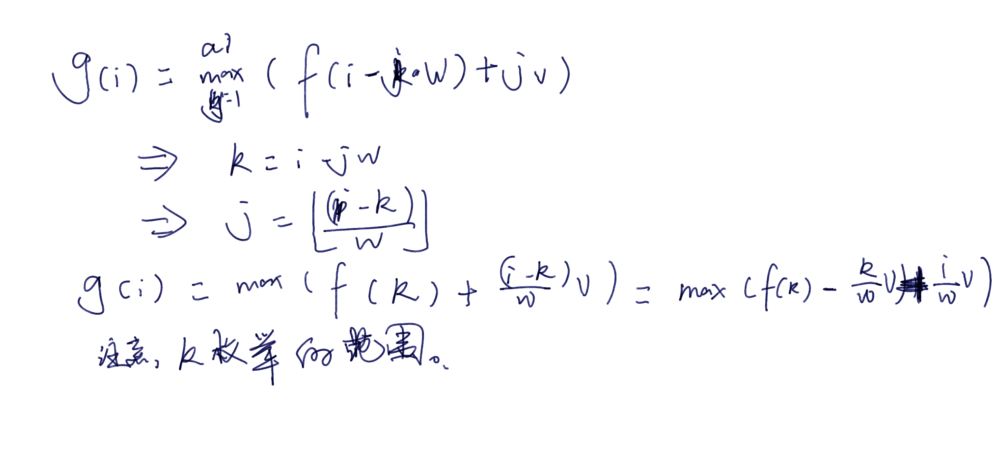
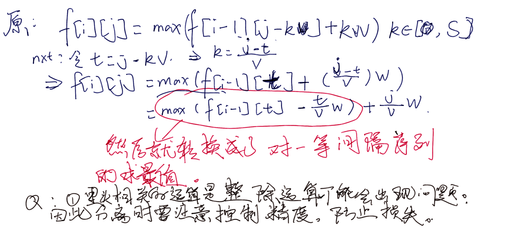

## **单调队列**

#### 问题背景

转移过程中，花费时间去查询一个窗口的最大值。在状态迁移的过程中，伴随着等长窗口的移动。

#### 优化思路

优化思路一般有，st表，线段树。但是单调队列，虽然相比于前面的算法思想， 是最不深刻的一种思想，但确实常数最小。定义一些物理量以及概念：

---

$q_{front...tail}$, in , out其表达的意义看英文符号具有自明性。
做出一些变化：

### problems

#### **多重背包3**

http://oj.daimayuan.top/course/8/problem/168
参考博客：https://blog.csdn.net/weixin_72060925/article/details/128714489

  [多重背包问题.md](..\背包dp\背包九讲\多重背包问题.md) 

##### solve

用之前的方法去做，就是一个普通的三重背包问题：
定义状态$f_{i}$表示当前考虑了前某个物品中，总体积为i的最大价值。

根据一般的思路：这里的复杂度应该是：$O(n\times \sum a_i)$
现在考虑使用单调队列，对它进行一些优化：

**定义：**

$f_{i}$ 上一级子问题的dp数组。$g_{i}$表示当前考虑物品的dp数组。

**状态转移**
$$
g_{i}=max(f_{i} , f_{i-w}+v+...+f_{i-j*w}+j*v)
$$

其中j表示选择了多少物品。$j\in[0...a_{now}]$.$a_{now}$当前物品的数量。

**关注现象**
接下来的问题是：将迁移联系成与连续队列最值。

1. 发现对f数组进行mod分组。出现一个类似单调队列优化的结构：
   1. 精准的思考点是，观察出暴力过程中的枚举方式。运算对象信息的计算，可以利用预处理的信息就来快速计算出每次迁移的最大值。
   2. 做一些算数处理，从原数组映射到新的数组。并且单调队列优化就是在新的数组上进行。



常用的技巧如上，是代换的技巧。那么里面的除法

------------

上述描述是混乱且没有本质的。体会里面的数学原理，数学方法。

--------

**剩下解决的问题：**

1. 单调队列的维护问题：
2. 关注问题，需求；

​			其实就是滑动一个等长的区间，无论任何时刻，都可以正确的得到当前维护区间中的最大值。

3. 具体过程
   1. 进
      1. 将比它小的（看具体情形）元素都弹掉。
   2. 出
      1. 看最大值（队尾）是否为当前元素。如果是就弹掉。
         1. 必然不可能是中间的元素。因为入队的时候，比入队元素小的都要被弹掉。于是，如果当前元素没有被弹走必然是最大值。

-----------

##### code 这一份代码是tle的

```cpp
#include<bits/stdc++.h>
using namespace std;
using ll = long long;

const int N = 2E4 + 10;
const int inf = 1 << 29;

int que[N] , low , high;
//关于队列的初始化定义怎么处理？
//初始化之后怎么迁移？
ll f[N][2];

int main()
{
	ios::sync_with_stdio(false);
	cin.tie(0);
	int n , m; cin >> n >> m;
	int now = 1;
	for (int i = 1; i <= n; i++) {
		//体积， 价值 ， 可选个数：
		int v , w , l; cin >> v >> w >> l;
		for (int mod = 0; mod < v; mod++) {
			//先把队头的小元素弹出来。
			int low = 0 , high = -1;
			for (int j = mod; j <= m; j += v) {

				//弹出较大值

				if (low <= high && que[low] < j - l * v) low++;
				while (low <= high && f[que[high]][1 - now] - que[high] * w / v <= f[j][1 - now] - j * w / v) high--;
				que[++high] = j;
				f[j][now] = f[que[low]][1 - now] + (j - que[low]) * w / v;
			}
		}
		now = 1 - now;
	}
	cout << f[m][1 - now] << '\n';
}
```

##### 可以过的代码

```cpp
#include <iostream>
#include <cstring>

using namespace std;

const int N = 10010;

int dp[N], pre[N], q[N];
int n, m;

int main() {
	ios::sync_with_stdio(false);
	cin.tie(0);
	cin >> n >> m;
	for (int i = 0; i < n; ++i) {
		memcpy(pre, dp, sizeof(dp));
		int v, w, s;
		cin >> v >> w >> s;
		for (int j = 0; j < v; ++j) {
			int head = 0, tail = -1;
			for (int k = j; k <= m; k += v) {

				if (head <= tail && k - s * v > q[head])
					++head;

				while (head <= tail && pre[q[tail]] - (q[tail] - j) / v * w <= pre[k] - (k - j) / v * w)
					--tail;

				if (head <= tail)
					dp[k] = max(dp[k], pre[q[head]] + (k - q[head]) / v * w);

				q[++tail] = k;
			}
		}
	}
	cout << dp[m] << endl;
	return 0;
}
```

实在不理解差别究竟在哪里？

然后一步一步改：

最终改成了如下情况：

1. 主要是将dp更新的方式改了。

```cpp
#include<bits/stdc++.h>
using namespace std;
using ll = long long;

const int N = 1E4 + 10;
const int inf = 1 << 29;

int que[N];
//关于队列的初始化定义怎么处理？
//初始化之后怎么迁移？
int pre[N] , dp[N];

int main()
{
    ios::sync_with_stdio(false);
    cin.tie(0);
    int n , m; cin >> n >> m;
    for (int i = 1; i <= n; ++i) {
        //体积， 价值 ， 可选个数：
        int v , w , l; cin >> v >> w >> l;
        memcpy(pre , dp , sizeof(dp));
        for (int mod = 0; mod < v; ++mod) {
            //先把队头的小元素弹出来。
            int low = 0 , high = -1;
            for (int j = mod; j <= m; j += v) {

                //弹出较大值

                if (low <= high && que[low] < j - l * v) ++low;
                while (low <= high && pre[que[high]] - (que[high] - mod) / v * w <= pre[j] - (j - mod) / v * w) --high;
                if (low <= high) {
                    dp[j] = max(pre[que[low]] + (j - que[low]) / v * w , dp[j]);
                }
                que[++high] = j;

            }
        }
    }
    cout << dp[m] << '\n';
}
```

**下面这份是很久之前写的，也是顺利过了**

```cpp
#include <bits/stdc++.h>
using namespace std;
const int maxn = 10010, maxv = 10010;
int f[maxn][maxv];
int que[maxv];
int main()
{
    ios::sync_with_stdio(false);
    cin.tie(0), cout.tie(0);
    int n, m;
    cin >> n >> m;
    for (int i = 1; i <= n; i++)
    {
        int w, v, s;
        cin >> w >> v >> s;
        for (int tt = 0; tt < w; tt++)
        {
            int l = 0, r = -1;                            //双端队列实现单调队列。
            for (int j = tt, k = 1; j <= m; j += w, k++) //利用k这一个变量可以做一些什么样的记录？
            {
                if (k > s + 1) //代表着曾经有多少个元素进队列了。如果超过了三个就说明一些元素要弹队列。
                {
                    //还要确认当前队头元素是否为弹出的元素。
                    //只要弹出元素和它相等即可。
                    if (que[l] == f[i - 1][j - (s + 1) * w] - (k - (s + 1)) * v)
                        l++;
                }
                while (l <= r && que[r] + k * v < f[i - 1][j]) //滑动窗口对应的数组是什么？                            				  //添加的过程中可以加一些处理，这样并不会影响它们的次序同时也可以还原真实量的大小
                    r--;
                que[++r] = (f[i - 1][j] - k * v);
                f[i][j] = que[l] + k * v;
            }
        }
    }
    cout << f[n][m] << '\n';
}
```

**集中困惑点**

1. 对单调队列原理感到困惑：

   1. 从最简单的问题开始考虑：一个静态连续的数字序列上，滑动窗口同时逐步求出最值。
   2. 转移到上述问题：

2. 对上述复杂的转移方程的处理感到困惑。

   1. 关于转移方程的认知理解。
   2. 使用了什么样的数学处理方法？

------

1. 对于最后一份代码：使用了一种偏移还原的思维：

2. dls(y总)的思路，就是换了个元，进行处理：将涉及的dp数组中的索引做一个整体考虑。然后就将max运算的对象转变成了下面一种形式：



然后基于上面的启发：第一份代码改动如下：

```cpp
#include<bits/stdc++.h>
using namespace std;
using ll = long long;

const int N = 2E4 + 10;
const int inf = 1 << 29;

int que[N] , low , high;
//关于队列的初始化定义怎么处理？
//初始化之后怎么迁移？
ll f[N][2];

int main()
{
	ios::sync_with_stdio(false);
	cin.tie(0);
	int n , m; cin >> n >> m;
	int now = 1;
	for (int i = 1; i <= n; i++) {
		//体积， 价值 ， 可选个数：
		int v , w , l; cin >> v >> w >> l;
		for (int mod = 0; mod < v; mod++) {
			//先把队头的小元素弹出来。
			int low = 0 , high = -1;
			for (int j = mod; j <= m; j += v) {

				//弹出较大值

				if (low <= high && que[low] < j - l * v) low++;
				while (low <= high && f[que[high]][1 - now] - 1.0 * que[high] * w / v <= f[j][1 - now] - 1.0 * j * w / v) high--;
				que[++high] = j;
				f[j][now] = f[que[low]][1 - now] + (j - que[low]) * w / v;
			}
		}
		now = 1 - now;
	}
	cout << f[m][1 - now] << '\n';
}
```

于是就过了。

**所做的换元方法是数学上的一般除法，但是事实上计算机处理方式是整除。要注意控制精度，防止精度丢失。**


#### 第二个问题：燃烧烟花：

**C. Watching Fireworks is Fun**

[Problem - 372C - Codeforces](https://codeforces.com/problemset/problem/372/C)

[CF Round #219 (Div. 1) C, Watching Fireworks is Fun - 题目 - Daimayuan Online Judge](http://oj.daimayuan.top/course/8/problem/426)

**问题简介**

去到任意地方：

初始可以在任意地点：然后每一个时间单元可以去w单位内的任意地点：每个时刻在不同的地点看烟花会收获到不同大小的幸福值。问m个烟花放完之后，可以得到的最大快乐值是多少：可能为负数：

**solve**

状态设计：

$dp_{i , j}$表示第i个时刻在j街道处的最大快乐值是多少：

**状态转移方程：**
$$
dp_{i,j}=max(dp_{i-1,j-0..(t-1)*d,t*d},dp_{i-1,j+0..(k - 1)*d,k*d})+b_i-|a_i-j|
$$
对于一个$dp_{i,j}$的计算，可以使用一个单调队列进行优化。可以在$O(1)$的时间之内完成计算：

**code**

```cpp
#include<bits/stdc++.h>
using namespace std;
using ll = long long;
const int N = 300010;
ll f[N][2];
int q[N];
int main()
{
    ios::sync_with_stdio(false);
    cin.tie(0);
    int n , m , d;
    cin >> n >> m >> d;
    int now = 1;
    int t1 = 1;//上一轮放烟花的时间。
    while (m--) {
        int a , b , t; cin >> a >> b >> t;
        //时间间隔之内可以移动的单向移动的范围
        int D = min(1LL * n , 1LL * (t - t1) * d);
        t1 = t;
        int low = 1 , high = 0 ;
        auto add = [&](int x) {
            while (low <= high && f[x][now ^ 1] >= f[q[high]][now ^ 1])
                high --;
            q[++high] = x;
        };
        for (int i = 1; i <= D; i++)add(i);
        for (int i = 1; i <= n; i++) {
            if (i + D <= n) add(i + D);
            while (low <= high && q[low] < i - D)low++;
            f[i][now] = f[q[low]][1 - now] + b - abs(a - i);
        }
        now = 1 - now;
    }
    ll ans = -1E18;
    for (int i = 1 ; i <= n; i++) {
        ans = max(ans  , f[i][1 - now]);
    }
    cout << ans << '\n';
}
```

---------


[P2254 [NOI2005\] 瑰丽华尔兹 - 洛谷 | 计算机科学教育新生态 (luogu.com.cn)](https://www.luogu.com.cn/problem/P2254)

# [NOI2005] 瑰丽华尔兹

## 题目背景

你跳过华尔兹吗？当音乐响起，当你随着旋律滑动舞步，是不是有一种漫步仙境的惬意？

众所周知，跳华尔兹时，最重要的是有好的音乐。但是很少有几个人知道，世界上最伟大的钢琴家一生都漂泊在大海上，他的名字叫丹尼・布德曼・T.D.・柠檬・1900，朋友们都叫他 1900。

1900 在 20 世纪的第一年出生在往返于欧美的邮轮弗吉尼亚号上。很不幸，他刚出生就被抛弃，成了孤儿。1900 孤独的成长在弗吉尼亚号上，从未离开过这个摇晃的世界。也许是对他命运的补偿，上帝派可爱的小天使艾米丽照顾他。可能是天使的点化，1900 拥有不可思议的钢琴天赋：从未有人教，从没看过乐谱，但他却能凭着自己的感觉弹出最沁人心脾的旋律。当 1900 的音乐获得邮轮上所有人的欢迎时，他才 8 岁，而此时，他已经乘着海轮往返欧美大陆 50 余次了。

虽说是钢琴奇才，但 1900 还是个孩子，他有着和一般男孩一样的好奇和调皮，只不过更多一层浪漫的色彩罢了：这是一个风雨交加的夜晚，海风卷起层层巨浪拍打着弗吉尼亚号，邮轮随着巨浪剧烈的摇摆。船上的新萨克斯手迈克斯・托尼晕船了，1900 招呼托尼和他一起坐到舞厅里的钢琴上，然后松开了固定钢琴的闸，于是，钢琴随着海轮的倾斜滑动起来。准确的说，我们的主角 1900…

## 题目描述

不妨认为舞厅是一个 $N$ 行 $M$ 列的矩阵，矩阵中的某些方格上堆放了一些家具，其他的则是空地。钢琴可以在空地上滑动，但不能撞上家具或滑出舞厅，否则会损坏钢琴和家具，引来难缠的船长。每个时刻，钢琴都会随着船体倾斜的方向向相邻的方格滑动一格，相邻的方格可以是向东、向西、向南或向北的。而艾米丽可以选择施魔法或不施魔法：如果不施魔法，则钢琴会滑动；如果施魔法，则钢琴会原地不动。

艾米丽是个天使，她知道每段时间的船体的倾斜情况。她想使钢琴在舞厅里滑行的路程尽量长，这样 1900 会非常高兴，同时也有利于治疗托尼的晕船。但艾米丽还太小，不会算，所以希望你能帮助她。

## 输入格式

输入文件的第一行包含 $5$ 个数 $N$, $M$, $x$, $y$ 和 $K$。$N$ 和 $M$ 描述舞厅的大小，$x$ 和 $y$ 为钢琴的初始位置；我们对船体倾斜情况是按时间的区间来描述的，且从 $1$ 开始计算时间，比如 “在 $[1, 3]$ 时间里向东倾斜，$[4, 5]$ 时间里向北倾斜”，因此这里的 $K$ 表示区间的数目。

以下 $N$ 行，每行 $M$ 个字符，描述舞厅里的家具。第 $i$ 行第 $j$ 列的字符若为 `.`，则表示该位置是空地；若为 `x`，则表示有家具。

以下 $K$ 行，顺序描述 $K$ 个时间区间，格式为：$s_i t_i d_i (1 \leq i \leq K)$。表示在时间区间 $[s_i, t_i]$ 内，船体都是向 $d_i$ 方向倾斜的。$d_i$ 为 $1$, $2$, $3$, $4$ 中的一个，依次表示北、南、西、东（分别对应矩阵中的上、下、左、右）。输入保证区间是连续的，即

$s_1 = 1$

$s_i = t_{i-1} + 1 (1 < i \leq K)$

$t_K = T$

## 输出格式

输出文件仅有 $1$ 行，包含一个整数，表示钢琴滑行的最长距离 (即格子数)。

## 样例 #1

### 样例输入 #1

```
4 5 4 1 3
..xx.
.....
...x.
.....
1 3 4
4 5 1
6 7 3
```

### 样例输出 #1

```
6
```

## 提示

钢琴的滑行路线：

  

钢琴在“×”位置上时天使使用一次魔法，因此滑动总长度为 $6$。

【数据范围】

$50\%$ 的数据中，$1\leq N, M\leq 200，T\leq 200$；

$100\%$ 的数据中，$1\leq N$, $M \leq 200$，$K \leq 200$，$T\leq 40000$。

------------

**solve**

**状态定义**

$f_{i , j , k}$表示第k次倾斜之后，在（x , y )点时， 钢琴经历过的滑动距离：

**状态转移方程**

四种方向的状态迁移都是类似的。差别在于， 操作了不同的行与列， 滚动数组优化下，滚动的方向有点不一样。详细理解看代码就可以容易的体会到位：

*不妨先考虑向第k段的时候滑动：*

$f_{i , j ， k} = max(f_{i-(0..d),j,k-1}+d)$

**滚动数组优化如下：**

$f_{i , j}=max(f_{i-(0....d),j}+d)$

注意转移方向是从下往上。这样才可以保证计算某个状态时，想迁移的子问题没有丢失，以及某些子问题用完即丢。

#### code	

```cpp
#include<bits/stdc++.h>
using namespace std;
using ll = long long;
const int N = 2E2 + 10;
char G[N][N];
int f[N][N];
int ans;
struct XYZ {int x/*max值*/ ; int y;/*用以表示该值在序列下标*/} q[N];
int dx[5] {0 , -1 , 1 , 0 , 0} , dy[5] { 0 , 0 , 0 , -1 , 1};
void solve(int x, int y , int d , int to , int n) {
	//接下来的任务是，统一各种方向以及处理情况。
	int low = 0 , high = -1;
	for (int i = 1; i <= n; ++i) {
		if (G[x][y] == 'x')low = 0 , high = -1;
		else {
			int v = f[x][y] - i;
			while (low <= high && q[high].x <= v) --high;
			while (low <= high && i - q[low].y > d) ++low;
			q[++high] = {v , i};
			f[x][y] = q[low].x + i;
			ans = max(f[x][y] , ans);
		}
		x += dx[to];
		y += dy[to];
	}
}
int main()
{
	ios::sync_with_stdio(false);
	cin.tie(0);
	int n , m , k , x , y;
	cin >> n >> m >>  x >> y >> k;
	memset(f , -63 , sizeof f);
	f[x][y] = 0;
	for (int i = 1; i <= n; ++i) cin >> (G[i] + 1);
	for (int j = 1; j <= k; ++j) {
		int x , y , to;
		cin >> x >> y >> to;
		int t = y - x + 1;
		if (to == 1)for (int i = 1; i <= m ; ++i)solve(n , i , t , to , n);
		else if (to == 2)for (int i = 1; i <= m; ++i)solve(1 , i , t , to , n);
		else if (to == 3) for (int i = 1; i <= n; ++i)solve(i , m, t , to , m);
		else for (int i = 1; i <= n; ++i) solve(i , 1 , t , to , m);
	}
	cout << ans << '\n';
}
```


