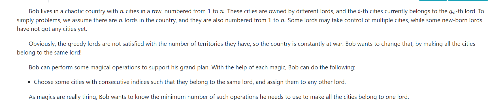

## **ICPC Beijing 2017 J, Pangu and Stones**

[ICPC Beijing 2017 J, Pangu and Stones - 题目 - Daimayuan Online Judge](http://oj.daimayuan.top/course/8/problem/327)

### 题目简介

1. 石子合并问题：

   对一堆石子，合并连续的连续长度为$[L,R]$的石子。

和最简单的区间动态规划问题不同。这里对连续合并的石堆个数有限制。

### solve

1. 显然不能简单的枚举每一堆的分界点。（就是纯暴力。）

定义一个状态：

$f_{i,j,k}$表示$i,j$ ， 为合并成k堆的最小代价。

辅助状态的转移方程。

1. 枚举i , j。
2. 枚举k。
3. 枚举第一堆的的尾部。

$$
k\ge2;f_{i,j,k}=min(f_{i,mid,1}+f_{mid+1,r,k-1})\\
k=1;f_{i,j,1}=min(f_{i,j,2...k}+sum_{l...r})
$$

**初始化：**

$f_{i , j , j - i + 1} = sum_{i , j}$

### 生长：

1. 感受状态设计以及方程，关注的角度。

#### code

```cpp
#include<bits/stdc++.h>
using namespace std;
using ll = long long;
#define f dp

const int N = 110;
const int inf = 1 << 29;
int n , L , R;
int f[N][N][N];
int sum[N];

void solve() {
	for (int i = 1; i <= n ; i++) {
		int x; cin >> x;
		sum[i] = sum[i - 1] + x;
	}
	for (int i = 1; i <= n; i ++)
		for (int j = 1; j <= n; j++)
			for (int k = 1; k <= n; k++)
				f[i][j][k] = inf;
	for (int d = 0; d <= n ; d++) {
		for (int l = 1; l + d <= n; l++) {
			int r = l + d;
			if (d == 0) {
				f[l][r][1] = 0;
			} else {
				for (int k = 2; k <= n; k++) {
					for (int mid = l ; mid < r; mid ++) {
						f[l][r][k] = min(f[l][r][k] , f[l][mid][1] + f[mid + 1][r][k - 1]);
					}
					if (k >= L && k <= R) f[l][r][1] = min(f[l][r][k] , f[l][r][1]);
				}
				f[l][r][1] += sum[r] - sum[l - 1];
			}
		}
	}
	if (f[1][n][1] >= inf) cout << 0 << '\n';
	else cout << f[1][n][1] << '\n';
}


int main()
{
	ios::sync_with_stdio(false);
	cin.tie(0);
	while (cin >> n >> L >> R)solve();

}
```
-----
--------

## ICPC Kunming 2020 C, Cities



[ICPC Kunming 2020 C, Cities - 题目 - Daimayuan Online Judge](http://oj.daimayuan.top/course/8/problem/328)


### solve

分析模型， 考虑怎么将一段变成同一种颜色：最差劲的做法以及情况如下：

```
1 2 3 4 5
```

逐步处理： 其操作总数其实是 改变颜色，合并块与块之间的情况。

```
1 2 1 4 5
```

因此总的最优情况是： 同颜色的一一匹配就可以减少一个答案贡献。因此问题转变成了求这种匹配的最大个数。并且要求是不相交的（因为不同颜色的连线之后，处理一个匹配时候，其颜色就已经发生改变。其后一个匹配关系就会不再成立。）

因此就转换成了一个经典的区间dp模型：


**状态定义：**

$f_{i ,j}$ 表示将i , j区间的最大不相交匹配数。

$nxt_{i}$ , 与color[i]相同的下一个最近的位置（如果不存在就设置为n + 1） 一个非常熟悉，但是非常好用的trick.

**状态转移方程：**
$$
f_{i ,j} = max(f_{i + 1 , j} , f_{i +1,x}\\col[x] = a[i] \&\& x \le j
$$
**初始化：**

显然是全部为0：

#### code

```cpp
#include<bits/stdc++.h>
using namespace std;

using ll = long long;

#define dbg(x) cerr << "[" << __LINE__ << "]" << ": " << x << "\n"

#define all(x) (x).begin(),(x).end()
#define sz(x) (int)(x).size()

const int inf = 1E9 + 7;
const ll INF = 1E18 + 7;
const int N = 5000 + 10;

int a[N] , pos[N] , nxt[N];
int f[N][N];

void work(int testNo)
{
	int n;
	cin >> n;
	for (int i = 1; i <= n; i++)
		pos[i] = n + 1;
	for (int i = 1; i <= n; i++) {
		cin >> a[i];
		if (i != 1 && a[i] == a[i - 1]) {
			n--;
			i--;
		}
	}
	for (int i = n; i >= 1; i--) {
		nxt[i] = pos[a[i]];
		pos[a[i]] = i;
	}
	for (int i = 1; i <= n; i++)
		for (int j = i; j <= n; j++)
			f[i][j] = 0;
	for (int d = 1; d <= n; d++)
		for (int l = 1; l + d - 1 <= n; l++) {
			int r = l + d - 1;
			f[l][r] = f[l + 1][r];
			int x = nxt[l];
			while (x <= r) {
				f[l][r] = max(f[l][r] , f[l + 1][x - 1] + f[x][r] + 1);
				x = nxt[x];
			}
		}
	int  ans = n - 1 - f[1][n];
	cout << ans << "\n";
}

signed main()
{
	ios::sync_with_stdio(false);
	cin.tie(0);

	int t; cin >> t;
	for (int i = 1; i <= t; i++)work(i);
}

/* stuff you should look for
* int overflow, array bounds
* special cases (n=1?)
* do smth instead of nothing and stay organized
* WRITE STUFF DOWN
* DON'T GET STUCK ON ONE APPROACH
*/
```

## 括号序列：

[CSP-S 2021, 括号序列 - 题目 - Daimayuan Online Judge](http://oj.daimayuan.top/course/8/problem/329)

### solve

简单版本的问题怎么解决？
就是根据前缀中还有多少个'( ' 需要匹配， 进行两种方向上的转移。最终的答案为$f_{1 ,n}$
和简单版本的解决方法相比：方案字符的结构是不能记录的。


首先，定义$f_{l , r}$ ： l  , r的合法方案数其可能的结构为：

1. 


根据上述结构，分类记录方案，然后进行转移；
**状态设计：**
$g_{l , r}$ 表示， l , r中 ，左右边界为括号的合法括号序列的方案个数；

$f_{l ,r}$ , l r 中，合法括号序列的方案个数。

**状态转移方程：**

根据上述结构的分类进行转移：

$g_{l,r}$ : 

1. （）内部是空：
2. （S） , 枚举然后考虑贡献 ， 是否可以寻得这种情况。
3. （A） ， f(l + 1 , r - 1)
4. （AS） ， 枚举前缀*的个数，同时由$f_{l ,mid}$ 转移
5. （SA） ， 同上。

$f_{l ,r}$

1. $g_{l,r}$
2. 枚举中点： mid : mid ... mid + len 为* ， 则为$f_{l,mid - 1} \times f_{mid + len + 1 , r}$

**复杂度**

对于上述$f_{l , r}$ 最朴素的编写方法下，其复杂度是：$O(N^4)$的。第一份代码，即使用了如下的编写方法：

==优化为$N^3$ 的方法：==

1. 对SA结构的统计可以进行预处理 ： 然后可以，AS中，这种结构会被多次访问，因此可以高效的处理。


#### code $O(N^4)$

```cpp
#include<bits/stdc++.h>
using namespace std;
using ll = long long;
const int mod = 1E9 + 7;
const int N = 520;
char s[N];
int f[N][N] , g[N][N];
void add(int& a , int b) {
	a += b;
	if (a >= mod) a -= mod;
}
bool match(int p , char t) {
	return s[p] == '?' || s[p] == t;
}

/*
10 2
???(*??(?)
7 3
(*??*??
*/
signed main()
{
	ios::sync_with_stdio(false);
	cin.tie(0);
	int n , k;
	cin >> n >> k;
	cin >> (s + 1);
	for (int d = 0; d < n; d++) {
		for (int l = 1; l + d <= n; l++) {
			int  r = l + d;

			// 基于多种情况分类讨论下的转移：
			//case1
			if (match(l , '(') && match(r , ')') && l != r) {
				// 空串：
				// case1.1 : ()
				if (l + 1 == r) add(g[l][r] , 1);
				// case1.2 (S)
				else if (r - l - 1 <= k) {
					// 如果中间的长度小于k
					bool flag = true;
					for (int i = l + 1; i < r ; i++)
						flag = flag && match(i , '*');
					if (flag) add(g[l][r] , 1);
				}
				// case1.3 (A);
				add(g[l][r] , f[l + 1][r - 1]);
				// case1.4 : (SA)
				for (int i = l + 1; i < r - 1 && i <= l + k; i++) {
					if (match(i , '*')) add(g[l][r] , f[i + 1][r - 1]);
					else break;
				}
				// case1.5 : (AS)
				for (int i = r - 1; i > l + 1 && i >= r - k; i--)
					if (match(i , '*')) add(g[l][r] , f[l + 1][i - 1]);
					else break;
			}
			//case2
			add(f[l][r] , g[l][r]);
			/* case3*/
			if (match(l , '(')) {
				for (int mid = l + 1 ; mid < r; mid++) {
					//Case3.1 (AB)
					int tmp = 0;
					add(tmp , f[mid + 1][r]);
					//Case3.2 (ASB)
					for (int i = mid + 1; i < r - 1 && i  <= mid +  k; i++) {
						if (match(i , '*')) {
							add(tmp , f[i + 1][r]);
						} else break;
					}
					add(f[l][r] , 1LL * tmp * g[l][mid] % mod);
				}
			}
		}
	}
	cout << f[1][n] << "\n";
}

/* stuff you should look for
* int overflow, array bounds
* special cases (n=1?)
* do smth instead of nothing and stay organized
* WRITE STUFF DOWN
* DON'T GET STUCK ON ONE APPROACH
*/
```


#### code $O(N^3)$

```cpp
#include<bits/stdc++.h>
using namespace std;
using ll = long long;

const int mod = 1E9 + 7;
const int N = 520;

char s[N];
int f[N][N] , g[N][N], h[N][N];
void add(int& a , int b) {
	a += b;
	if (a >= mod) a -= mod;
}
bool match(int p , char t) {
	return s[p] == '?' || s[p] == t;
}

/*
10 2
???(*??(?)

7 3
(*??*??
*/
signed main()
{
	ios::sync_with_stdio(false);
	cin.tie(0);

	int n , k;
	cin >> n >> k;
	cin >> (s + 1);
	for (int d = 0; d < n; d++) {
		for (int l = 1; l + d <= n; l++) {
			int  r = l + d;

			// 基于多种情况分类讨论下的转移：
			//case1
			if (match(l , '(') && match(r , ')') && l != r) {
				// 空串：
				// case1.1 : ()
				if (l + 1 == r) add(g[l][r] , 1);
				// case1.2 (S)
				else if (r - l - 1 <= k) {
					// 如果中间的长度小于k
					bool flag = true;
					for (int i = l + 1; i < r ; i++)
						flag = flag && match(i , '*');
					if (flag) add(g[l][r] , 1);
				}
				// case1.3 (A);
				add(g[l][r] , f[l + 1][r - 1]);
				// case1.4 : (SA)
				// updaste1
				add(g[l][r] , h[l + 1][r - 1]);
				// case1.5 : (AS)
				for (int i = r - 1; i > l + 1 && i >= r - k; i--)
					if (match(i , '*')) add(g[l][r] , f[l + 1][i - 1]);
					else break;
			}
			//case2(...)
			add(f[l][r] , g[l][r]);
			/* case3*/
			// 组合形：
			if (match(l , '(')) {
				for (int mid = l + 1 ; mid < r; mid++) {
					//Case3.1 (AB)
					int tmp = 0;
					add(tmp , f[mid + 1][r]);
					//Case3.2 (ASB)
					// update2
					add(tmp , h[mid + 1][r]);
					add(f[l][r] , 1LL * tmp * g[l][mid] % mod);
				}
			}
			// 更新： h[l][r];
			for (int i = l; i < r && i <= l  + k - 1; i++) {
				if (match(i , '*')) add(h[l][r] , f[i + 1][r]);
				else break;
			}
		}
	}
	cout << f[1][n] << "\n";
}
```
-----
##  Outer space invaders
来自外太空的外星人（最终）入侵了地球。保卫自己，或者解体，被他们同化，或者成为食物。迄今为止，我们无法确定。
外星人遵循已知的攻击模式。有 $N$ 个外星人进攻，第 $i$ 个进攻的外星人会在时间 $a_i$ 出现，距离你的距离为 $d_i$，它必须在时间 $b_i$ 前被消灭，否则被消灭的会是你。
你的武器是一个区域冲击波器，可以设置任何给定的功率。如果被设置了功率 $R$，它会瞬间摧毁与你的距离在 $R$ 以内的所有外星人（可以等于），同时它也会消耗 $R$ 单位的燃料电池。
求摧毁所有外星人的最低成本（消耗多少燃料电池），同时保证自己的生命安全。
### solve
#### 20 mins
question: 
1. 没有感受到一个非常明显的区间性： 区间性在哪里？
   1. 如上区间问题所有问题，都有一个明确的区间性： 区间性的情况：记录的内容都是区间性的。但是这里的元素没有形成一种明显的时间性：
2. 考虑对外星人做一个排序：然后基于该序列做一个dp。
   1. ==起始时间：== 
   2. 末时间：
   3. 距离。

通过起始时间做一个排序之后：考虑一个区间动态规划技术：~~修不成正果qaq~~

#### Answer
1. 找出区间性：
   时间性： 画出一个时间轴，然后基于时间轴上确立时间，炸弹长度。
   1. 然后一个贪心思路显然是：确定某个时刻之后，选择爆炸的炸弹显然应该是最大的。于是区间就划分成了左右两部分。然后又是一个非常显然的区间问题了。
   **状态设计：**
   $f_{l ,r}$ 表示处理完l时刻到r时刻的最小的花费。
   遇见问题： 时间范围可能会非常的大： 这个问题可以通过离散化解决：在没有涉及到的时刻点上都可以通过已知的时刻点等效替代；
   **状态转移方程：**
$$
f_{l ,r} = min(f_{l,mid-1} + f_{mid + 1 , r} + w_{mid}, f_{l,r})
$$
**初始化：**
记忆化搜索写法，为-1
#### 一些生长思考：
1. 为什么使用记忆化搜索的写法？
   1. 因为和一般的模型不同，比较多的状态其实是没有被用到的。虽然开线程，开存储空间等花费了一定的常数。但是相对应的当前的模型下，被使用到的状态比较离散，所以综合起来常数更小。
   2. 很好写
2. 离散化在dp上的应用，对时间的离散化。应该对时间轴相关的状态设计更加敏感些。
#### code

```cpp
#include<bits/stdc++.h>
using namespace std;
using ll = long long;

#define fsio ios::sync_with_stdio(false);cin.tie(0);

const int inf = (int)1E9 + 7;
const ll INF = (long long)1E18 + 7;
const int N = 610;

int n , a[N] , b[N] , d[N] , f[N][N];


int solve(int l , int r) {
	if (l > r) return 0;
	if (f[l][r] != -1) return f[l][r];
	int& ans = f[l][r];
	// 然后转移状态：
	// 记录这段时间内的最大距离对应的怪物:
	ans = inf;
	int mx = -1 , pos = -1;
	for (int i = 1; i <= n; i++) {
		if (a[i] >= l && b[i] <= r && d[i] > mx) {
			mx = d[i];
			pos = i;
		}
	}
	if (mx == -1) return ans = 0;
	for (int i = a[pos]; i <= b[pos]; i++) {
		ans = min(ans , solve(l , i - 1) +  solve(i + 1 , r));
	}
	ans += mx;
	// cout << "l " << l << "r " << r << " " << ans << "\n";
	return ans;
}

void solve() {
	cin >> n;
	vector<int> t;
	for (int i = 1; i <= n; i++) {
		cin >> a[i] >> b[i] >> d[i];
		t.push_back(a[i]);
		t.push_back(b[i]);
	}
	sort(t.begin() , t.end());
	t.erase(unique(t.begin() , t.end()) , t.end());

	for (int i = 1; i <= n; i++) {
		a[i] = lower_bound(t.begin() , t.end() , a[i]) - t.begin() + 1;
		b[i] = lower_bound(t.begin() , t.end() , b[i]) - t.begin() + 1;
	}
	int m = (int)t.size();
	for (int i = 1; i <= m; i++)
		for (int j = i; j <= m; j++) {
			f[i][j] = -1;
		}
	cout << solve(1 , m) << "\n";
}

int main() {
	fsio;
	int t; cin >> t;
	while (t--)solve();
}
```

## 总结：

1. 观察出资源的区间性：如第四题：
2. 多做一些区间dp问题。
