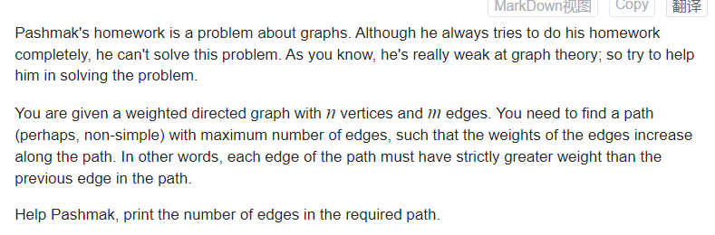
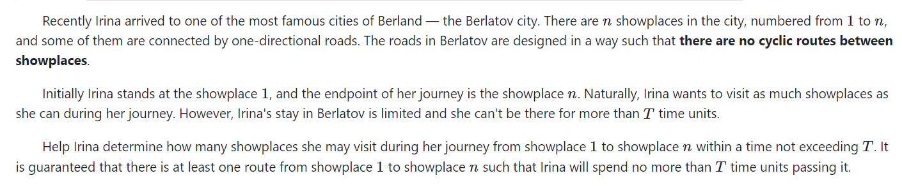

# 图上动态规划进阶：
整体上，图上动态规划分成三种：
1. DAG 有向无环图，通过拓扑序处理出顺序。 （有顺序）
2. 一般图，但是可以通过缩点的方法 使图成为DAG。 于是转变成DAG上的问题。同样这也是有顺序的一个dp模型。
3. 一般图。其转移顺序，是参考最短路算法的贪心实现的。（Dijkstra， SPFA）

##  solve
### E. Pashmak and Graph

[Problem - 459E - Codeforces](https://codeforces.com/problemset/problem/459/E)



#### solve
虽然这并不是有向无环图。但是很容易想到一个阶段划分的方式（通过边的大小进行阶段划分。）

**状态设计：**
$f_i$ : 到某个阶段时（通过边的大小分类，进行阶段划分）。

**状态转移方程：**
考虑该阶段中涉及的边：


1. 显然是合法解。这种顺序转移动。每个状态记录下， 都是合法的，末边比其低的解。

#### code

```cpp
const int N = 3E5 + 10;
int f[N];
signed main()
{
	ios::sync_with_stdio(false);
	cin.tie(0);

	int n , m;
	cin >> n >> m;
	vector<array<int , 3>> rec(m);
	for (int i = 0; i < m; i++) {
		cin >> rec[i][1] >> rec[i][2] >> rec[i][0];
	}
	sort(all(rec));
	for (int l = 0; l < m; l++) {
		int r = l;
		while (r < m && rec[l][0] == rec[r][0])r++;
		map<int , int> g;
		for (int i = l; i < r; i++) {
			g[rec[i][2]] = max(g[rec[i][2]] , f[rec[i][1]] + 1);
		}
		for (auto [x , y] : g) {
			f[x] = max(f[x] , y);
		}
		l = r - 1;
	}
	cout << *max_element(f + 1, f + n + 1) << "\n";
}
```

### CF Round #374 (Div. 2) C, Journey



#### solve

**状态设计**


#### code

```cpp
#include<bits/stdc++.h>
using namespace std;
using ll = long long;

#define all(x) (x).begin(),(x).end()
#define sz(x) (int)(x).size()

const int inf = 1E9 + 7;;
const ll INF = 1E18 + 7;
const int N = 5E3 + 10;

int f[N][N] , pre[N][N];
bool vis[N][N];
array<int , 3> edge[N];

signed main()
{
	ios::sync_with_stdio(false);
	cin.tie(0);
	int n , m , T;
	cin >> n >> m >> T;
	for (int i = 1; i <= n; i++)
		for (int j = 0; j <= n; j++)
			f[i][j] = T + 1;

	for (int i = 0; i < m; i++) {
		int u  , v , t;
		cin >> u >> v >> t;
		edge[i] = {u , v  , t};
	}

	f[n][0] = 0;
	for (int i = 1; i <= n; i++) {
		for (int j = 0; j < m; j++) {
			// cerr << __LINE__ << "\n";
			auto [u  , v , t] = edge[j];
			if (f[u][i] > f[v][i - 1] + t) {
				f[u][i] = f[v][i - 1] + t;
				pre[u][i] = v;
			}
		}
	}
	// cerr << __LINE__ << "\n";
	int ans  = 0;
	for (int i = 0; i <= n; i++) {
		// cerr << f[1][i] << "\n";
		if (f[1][i] <= T) {
			ans = i;
		}
	}
	// cerr << ans << "\n";
	cout << ans + 1 << '\n';
	vector<int> path;
	int u = 1;
	while (u != n) {
		path.push_back(u);
		u = pre[u][ans--];
	}
	path.push_back(n);
	for (auto u : path) {
		cout << u << " ";
	}
	cout << "\n";
}
```


