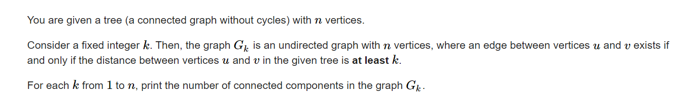

**D. A Wide, Wide Graph**
https://codeforces.com/contest/1805/problem/D



#### solve

最特殊的 ， 关注树的直径。发现k变大的过程中， 如果一个点脱离了图， 就将变成孤立点。

某点是否变成孤立点的结论是：

1. 到两端点的最大距离小于k.

于是问题转变成了：求点到其它点的最大距离，其实就是该点到直径两端点的距离的较大值：

有更简单的方式求：但用换根dp做， 会使用到换根dp的经典内容 ， 经典优化：\

**指标函数定义**

$d_i$以1为根的树中， d到该子树点的最大距离。

$par_i$以该i点父亲为一个根， 除i子树点 ， 所有点 作为其子树中的点 ， 该子树的最大高度（ 根据阶段而定。类似滚动数组， 存储空间重利用。）

**状态转移：**

$d_i$   dfs扫一遍即可

$par_i$ 

1. max比较对象：
   1. 父亲的父亲
   2. i的兄兄弟。
2. 上述信息可以通过前后缀和维护。

**初始化：**

1. 根节点的没有父亲。 par[1] = -1
2. 前后缀初始化负数.因为可能没有。

#### code

```cpp
#include<bits/stdc++.h>
using namespace std;
using ll = long long;
const int N = 1E6 + 10;
vector<int> g[N];
int d[N];
int pa[N];
int sum[N];
//子树深度
void dfs(int u, int fa) {
	d[u] = 0;
	for (auto v : g[u]) {
		if (fa != v) {
			dfs(v, u);
			d[u] = max(d[v] + 1, d[u]);
		}
	}
}
//换根dp;
void dfs2(int u, int fa) {

	int sz = g[u].size();
	vector<int>pre(sz + 5, -1), suf(sz + 5, -1);
	d[u] = max(d[u], pa[fa] + 1);
	for (int i = 1; i <= sz; i++) {
		int v = g[u][i - 1];
		if (fa != v) {
			pre[i] = max(pre[i - 1], d[g[u][i - 1]]);
		}
		else pre[i] = pre[i - 1];
	}
	for (int i = sz; i >= 1; i--) {
		int v = g[u][i - 1];
		if (fa != v) {
			suf[i] = max(suf[i + 1], d[g[u][i - 1]]);
		}
		else suf[i] = suf[i + 1];
	}
	for (int i = 1; i <= sz; i++) {
		int v = g[u][i - 1];
		if (fa != v) {
			pa[u] = max({ pre[i - 1] , suf[i + 1] , pa[fa]}) + 1;
			dfs2(g[u][i - 1], u);
		}
	}
}
int main()
{
	ios::sync_with_stdio(false);
	cin.tie(0);

	int n; cin >> n;
	for (int i = 1; i < n; i++) {
		int u, v;
		cin >> u >> v;
		g[u].push_back(v);
		g[v].push_back(u);
	}
	dfs(1, 0);
	pa[0] = -1;
	dfs2(1, 0);
	for (int i = 1; i <= n; i++) {
		sum[d[i] + 1]++;
	}
	for (int i = 1; i <= n; i++) {
		sum[i] = sum[i - 1] + sum[i];
		cout << min(1 + sum[i], n) << " \n"[i == n];
	}
}
```


