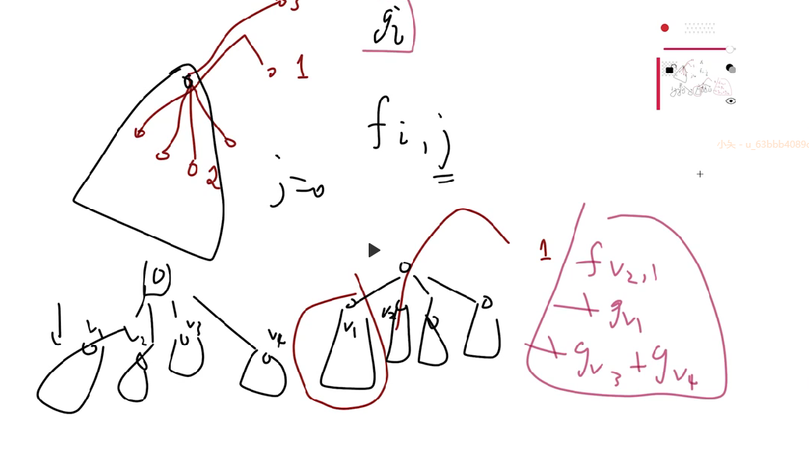

### 树上路径1

[树上路径1 - 题目 - Daimayuan Online Judge](http://oj.daimayuan.top/course/8/problem/272)

关注现象：

1. 对于一颗树。一个节点，它的儿子的子树是互不干扰的。

#### solve1

多加入一维状态转移。


状态定义:  

1. $f_{i,j}$表示第i个节点选择j路径的最大权重。
2. $g_{i , j}$表示$v_i$子树下。集合{所选择的路径没有交集，路径不超过子树范围}的最大权重和。

转移方程：

1. 关于f的计算



2. 关于g的计算


#### solve2

只考虑两点的lca处的情况。

状态

1. $f_i$表示i子树下，不外延选择的路径和。

状态转移如下


#### coding技巧

关于状态计算：

1. 考虑逐步计算。从根部出发，每次拓展一次点。变化量为$dp_v -sdp_u$
2. 每一次计算，得到的新状态都满足目标状态。这样最终就可以计算处$dp_u$了。

关于lca处理：

1. 由于n比较小。所以可以使用暴力的寻父亲的方法。
2. 当然常见的倍增法，也是居家必备的。

#### 复杂度计算：

每一个路径上的节点经历一次。每一个节点经历一次。总复杂度是$O(n*m)$

#### code

```cpp
#include<bits/stdc++.h>
using namespace std;
using ll = long long;

const int N = 2E3 + 10;

vector<int> son[N];
vector<array<int , 3>> path[N];

int dep[N] , f[N] , lca[N];
ll dp[N] , sdp[N];

void dfs(int u) {
	for (auto v : son[u]) {
		dfs(v);
		sdp[u] += dp[v];
	}
	dp[u] = sdp[u];

	for (auto p : path[u]) {
		ll tmp = sdp[u];
		int x = p[0];
		while (x != u) {
			tmp += sdp[x] - dp[x];
			x = f[x];
		}
		x = p[1];
		while (x != u) {
			tmp += sdp[x] - dp[x];
			x = f[x];
		}
		tmp += p[2];
		dp[u] = max(tmp , dp[u]);
	}
}


int main()
{
	ios::sync_with_stdio(false);
	cin.tie(0);

	int n , m;
	cin >> n >> m;
	for (int i = 2; i <= n; i++) {
		cin >> f[i];
		son[f[i]].push_back(i);
		dep[i] = dep[f[i]] + 1;
	}

	for (int i = 1; i <= m; i++) {
		int x , y , w;
		cin >> x >> y >> w;
		int u = x , v = y;
		while (x != y) {
			if (dep[x] > dep[y]) x = f[x];
			else y = f[y];
		}
		path[x].push_back({u , v , w});
	}
	dfs(1);
	cout << dp[1] << '\n';
}

/* stuff you should look for
* int overflow, array bounds
* special cases (n=1?)
* do smth instead of nothing and stay organized
* WRITE STUFF DOWN
* DON'T GET STUCK ON ONE APPROACH
*/
```

##### 生长思考

- 这种逐步构造式计算的思路。非常巧妙。
- 关于当前暴力方法下，求取lca
- 第二个方法是第一个方法的子集，$g_i$依然是用这种方法计算。所以放心偷懒即可。
  - 但是第一个方法，给予一个解的结构关注的角度。拆成两个状态来转移。

### 树上路径二

[树上路径2 - 题目 - Daimayuan Online Judge](http://oj.daimayuan.top/course/8/problem/273)

#### 变化

1. 路径必然是孙子指向祖先
2. 树上的每一个点至少被覆盖一次。

#### solve

1. 定义状态

​		$f_{i , j}$表示从i,开始，把子树填满，并且上升打到深度j的最小的花费权重。

2. 状态转移方程如下图：
3. 初始化。
   1. 遍历以u为孙子的路径。更新$dp_{u , w}$因为后面对于这个dp。乍一看下面子树没有满，感觉非常违反定义。但是模拟一下发现。更新的dp，还要和儿子的dp组合。如果儿子的dp存在。是不违反定义的。


#### code

```cpp
#include<bits/stdc++.h>
using namespace std;
using ll = long long;


const ll inf = 1LL << 60;
const int N = 2E3 + 10;
vector<int> son[N];
vector<array<int , 2>> path[N];
ll dp[N][N];
int depth[N];
int n , m;

//lenu节点的深度。
void merge(ll *a , ll *b , int len) {
	static ll sufa[N] , sufb[N];
	sufa[len + 1] = inf;
	sufb[len + 1] = inf;
	for (int i = len; i >= 1 ; i--) {
		sufa[i] = min(sufa[i + 1] , a[i]);
		sufb[i] = min(sufb[i + 1] , b[i]);
	}
	for (int i = len; i >= 1; i--)
		a[i] = min(sufa[i] + b[i] , sufb[i] + a[i]);
}


void dfs(int u) {
	for (int i = 1; i <= depth[u] ; i++)dp[u][i] = inf;
	//怎么初始化？
	for (auto p : path[u]) {
		dp[u][depth[p[0]]] = min(dp[u][depth[p[0]]] , 1LL * p[1]);
	}
	for (auto v : son[u]) {
		dfs(v);
		merge(dp[u] , dp[v] , depth[v]);
	}
}

int main()
{
	ios::sync_with_stdio(false);
	cin.tie(0);


	cin >> n >> m;
	depth[1] = 1;
	for (int i = 2; i <= n; i++) {
		int x; cin >> x;
		son[x].push_back(i);
		depth[i] = depth[x] + 1;
	}
	for (int i = 1; i <= m; i++) {
		int u , v , w;
		cin >> u >> v >> w;
		path[v].push_back({u , w});
	}
	dfs(1);
	if (dp[1][1] < inf)
		cout << dp[1][1] << '\n';
	else cout << -1 << '\n';
}

/* stuff you should look for
* int overflow, array bounds
* special cases (n=1?)
* do smth instead of nothing and stay organized
* WRITE STUFF DOWN
* DON'T GET STUCK ON ONE APPROACH
*/
```

#### 生长思考：

1. 编写策略上： 树形dp总是有一项工作是，合并儿子和父亲的dp数组。这里写成一个merge函数。可以减少代码量。意义明确简洁，相当舒适。
2. 前缀和优化的例子。

