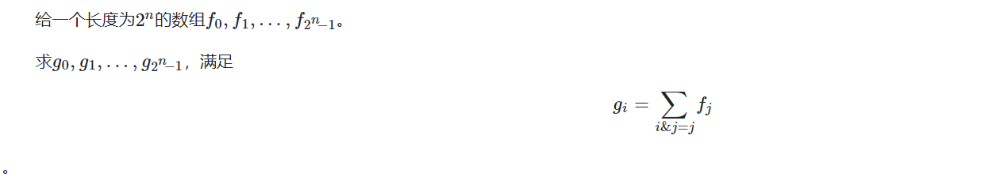
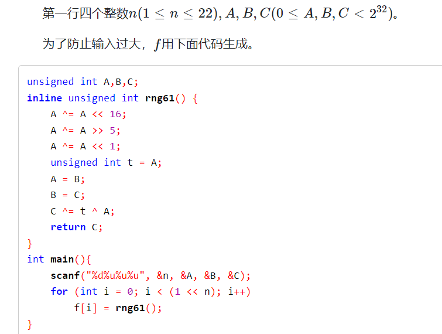
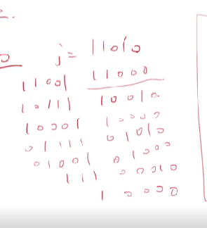

该问题类型： 由下问题引出：

####  子集和

http://oj.daimayuan.top/course/8/problem/368






### solve：

**三种方法：**

#### 枚举算法：

1. **最暴力算法：**暴力枚举算法：
   1. 枚举一个集合：
   2. 枚举所有子集。并且求和；
2. 复杂度分析 ： 显然是$O(4^n)$

```cpp
 unsigned int A, B, C;
inline unsigned int rng61() {
	A ^= A << 16;
	A ^= A >> 5;
	A ^= A << 1;
	unsigned int t = A;
	A = B;
	B = C;
	C ^= t ^ A;
	return C;
}
ull f[1 << 23];
ull g[1 << 23];
signed main()
{
	ios::sync_with_stdio(false);
	cin.tie(0);
	int n;
	cin >> n;
	cin >> A >> B >> C;
	const int M = 1 << n;
	for (int i = 0; i < M; i++) {
		f[i] = rng61();
	}
	//相当于已经求出了所有的前缀和：
	//方法一：
	//暴力：
	for (int i = 0; i < M; i++)
		for (int j = 0; j < M; j++) {
			//判断j是否为i的子集。
			//求交集。
			if ((i & j) == j) {
				g[i] += f[j];
			}
		}
	ull ans = 0;
	for (int i = 0; i < M; i++) {
		ans ^= g[i];
	}
	cout << ans << "\n";
}
```

----

#### 利用一些trick枚举前缀和：

1. 整体上子集个数和统计

   $$
   从组合数统计的角度上看：\\
      \sum _{k = 0}^{n}(_{k}^{n})2^k\\
      枚举一个集合\\
      枚举其子集个数(放0或者放1)\\
      使用组合数原理不难发现 子集个数和为：\\
      O(3^n)
   $$
   $$
   关注匹配关系：\\
   假设前缀情况已经枚举完： 接下来的情况分别有三种：\\
   (1 , 1) , (1 , 0) , (0 , 0)\\
   所以综上， 匹配的个数是：3^n
   $$

2. 对于一个数，快速的枚举出所有的前缀和的方法：

```
for(i : 1 .... (1 << n) - 1){
    j = i;
    while(true){
        g[i] += f[j];
        if(j == 0)break;
        j = (j - 1) & i;
    }
}
```

二进制上的一个trick 。 比较难证明： 但是可以写一些多感受：




**这个技巧比较常用：**

#### code

```cpp
unsigned int A, B, C;
inline unsigned int rng61() {
	A ^= A << 16;
	A ^= A >> 5;
	A ^= A << 1;
	unsigned int t = A;
	A = B;
	B = C;
	C ^= t ^ A;
	return C;
}
ull f[1 << 23];
ull g[1 << 23];
signed main()
{
	ios::sync_with_stdio(false);
	cin.tie(0);
	int n;
	cin >> n;
	cin >> A >> B >> C;
	const int M = 1 << n;
	for (int i = 0; i < M; i++)
		f[i] = rng61();
	for (int i = 0; i < M; i++) {
		int j = i;
		while (true) {
			g[i] += f[j];
			if (j == 0)break;
			j = (j - 1) & i;
		}
	}
	ull ans = 0;
	for (int i = 0; i < M; i++)
		ans ^= g[i];
	cout << ans << "\n";
}
```
#### 高维前缀和

 [高维前缀和.md](..\..\..\基础算法设计思想\前缀和\高维前缀和.md) 
**观察现象：**

1. 将子集元素的存在情况压缩成一个二进制数： 发现求和就是一个高维度前缀和问题：
2. 与普通高维前缀和的不同点： 
   1. 维度过多。
   2. 维度的上限为1.

#### 复杂度分析：

$O(n2^n)$  ， 一个非常优越的复杂度。

#### code如下： 偏向一个trick

```cpp
unsigned int A, B, C;
inline unsigned int rng61() {
	A ^= A << 16;
	A ^= A >> 5;
	A ^= A << 1;
	unsigned int t = A;
	A = B;
	B = C;
	C ^= t ^ A;
	return C;
}
ull f[1 << 23];
signed main()
{
	ios::sync_with_stdio(false);
	cin.tie(0);
	int n;
	cin >> n;
	cin >> A >> B >> C;
	const int M = 1 << n;
	for (int i = 0; i < M; i++)
		f[i] = rng61();
	for (int i = 0; i < n; i++)
		for (int j = 0; j < M; j++)
			if (j & (1 << i))
				f[j] += f[j - (1 << i)];
	ull ans = 0;
	for (int i = 0; i < M; i++)
		ans ^= f[i];
	cout << ans << "\n";
}
```

