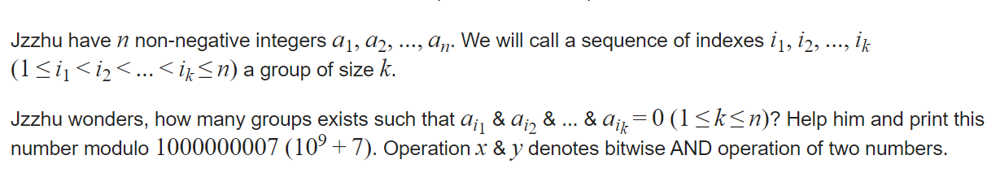

**D. Jzzhu and Numbers**

https://codeforces.com/contest/383/problem/E



#### solve

==**定义： **==

$f_s$表示异或和为s的子集个数。

$f_s$难求， 但是我们有方法求出：

$g_s$ , 异或和为s的超集合的子集个数。

==**求$g_s$ **==

1. 先预处理出s二进制形式的数的个数。$h_i = 1$如果二进制为i的元素存在。
2. 求出s的超集个数：

$$
g_i = \sum _{j \& i = i} T_i
$$

​           sosdp。

3. 考虑$g_i的解集合$： 显然：(注意不同情况下， $g_i$的含义：) 
   $$
   g_i = 2^{g_i}
   $$

==由$g_i$ 求 $f_i$==

由一个前缀和求出 ， 一个空间的一个元素值： 
不断对每一维逆过来求差分。这点和and卷积中的两个关键思想之一 一致。

最终答案就是$f_0$ ， 并且其实已经超额完成任务了。

#### 生长思考：

1. 转换步骤较多， 主要关注超集 ， 前缀和等。于是转着转着 ， 就转到答案。

#### code

```cpp
#include<bits/stdc++.h>
using namespace std;

using ll = long long;
using i64 = long long;
using ull = unsigned long long;
using ld = long double;
using uint = unsigned int;
using pii = pair<int , int>;
using pli = pair<ll , int>;
using pll = pair<ll , ll>;


#define dbg(x) cerr << "[" << __LINE__ << "]" << ": " << x << "\n"

#define all(x) (x).begin(),(x).end()
#define sz(x) (int)(x).size()
#define pb push_back
#define fi first
#define se second

const int inf = 1 << 29;
const ll INF = 1LL << 60;
const int N = 1E6 + 10;
const int mod = int (1E9 + 7);


const int M = 20;

ll f[(1 << M) + 10];
ll p2[N];
signed main()
{
	ios::sync_with_stdio(false);
	cin.tie(0);

	int n; cin >> n;
	p2[0] = 1;
	for (int i = 1; i <= n; i++)
		p2[i] = p2[i - 1] * 2 % mod;
	for (int i = 0; i < n; i++) {
		int x; cin >> x;
		f[x]++;
	}
	//超集相关的sosdp
	for (int i = 0; i < M; i++)
		for (int j = 0; j < (1 << M); j++) {
			if ((j & (1 << i)) == 0)
				f[j] += f[j + (1 << i)];
		}
	for (int i = 0; i < (1 << M); i++)
		f[i] = p2[f[i]];
	for (int i = 0; i < M; i++)
		for (int j = 0; j < (1 << M); j++) {
			if ((j & (1 << i)) == 0) {
				f[j] -= f[j + (1 << i)];
			}
		}
	f[0] %= mod;
	if (f[0] < 0) f[0] += mod;
	cout << f[0] << "\n";
}

/* stuff you should look for
* int overflow, array bounds
* special cases (n=1?)
* do smth instead of nothing and stay organized
* WRITE STUFF DOWN
* DON'T GET STUCK ON ONE APPROACH
*/
```

