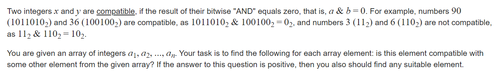

**E. Compatible Numbers**
http://oj.daimayuan.top/course/8/problem/369
https://codeforces.com/contest/165/problem/E



#### solve

问题等效于： 对于$a_i$ ， 找到一个其反码（关注前部分位取反）的属于该码子集的元素。

1. 基于集合空间， 考虑一个集合的子集整体。（没一个集合都对应一个指标函数）。然后就转换成了sosdp问题。

**状态定义**

$f_s$ , 基于集合空间得到的， 特征为s的值。

$g_i$ ，特征为i子集的指标函数的最小值。

**转移方程：**
$$
g_i = Min_{i\&j = j}f_j
$$
**初始化：**

$f_i = inf$

#### 生长思考：

1. 总结出一个非常自然的思路：
   1. 对于一个集合空间 整理，映射到一个二进制集合空间。
      1. 比方说： 该问题的元素空间中，映射到了一个连续的二进制空间；标记为$f_{s}$表示作为s的子集且最小的$a_i$。
   2. 然后将问题变成一个子集统筹运算的问题；
      1. 比方说，这里变成了一个子集统筹求min的问题。

#### code

```cpp
const int inf = 1 << 29;
const ll INF = 1LL << 60;
const int N = 1E6 + 10;
const int M = (1 << 22)  + 10;
int f[M];
int a[N];
signed main()
{
	ios::sync_with_stdio(false);
	cin.tie(0);
	int n;
	cin >> n;
	fill(f , f + M , inf);
	for (int i = 0; i < n; i++) {
		cin >> a[i];
		f[a[i]] = min(i , f[a[i]]);
	}
	for (int i = 0; i < 23; i++) {
		for (int j = 0; j < M; j++) {
			if (j & (1 << i)) f[j] = min(f[j ^ (1 << i)] , f[j]);
		}
	}
	for (int i = 0; i < n; i++) {
		if (f[(1 << 22) - 1 - a[i]] < n) {
			cout << a[f[(1 << 22) - 1 - a[i]]] << " ";
		} else cout << -1 << " ";
	}
	cout << "\n";
}
```


