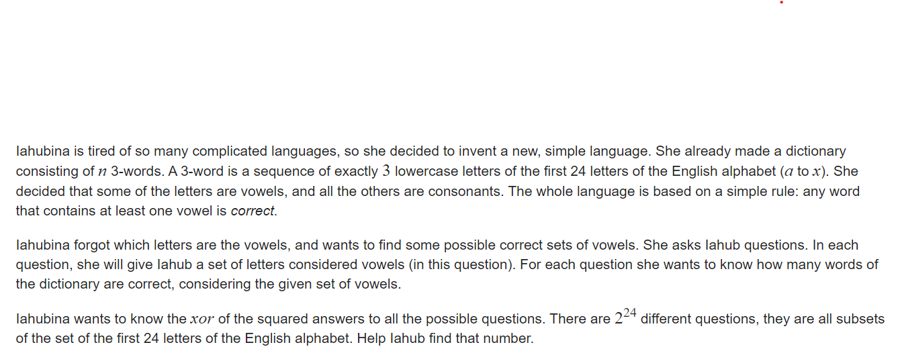

**E. Vowels**

https://codeforces.com/contest/383/problem/E



#### solve

1. 关注集合性质：（毕竟是基于集合的一个求和问题。）

$$
f_i = \sum _{j\&i = i}T_j
$$

2. 枚举一个组合： 
   1. 通过上述处理的空间 ， 计算出与其有交集的字符串个数。
   2. 关注组合的反集合。通过容斥非常容易计算。

#### code

````cpp
const int inf = 1 << 29;
const ll INF = 1LL << 60;
const int N = 1E6 + 10;
const int M = 24;
const int MM = 1 << 24;

ll f[MM + 10];

signed main()
{
	ios::sync_with_stdio(false);
	cin.tie(0);
	int n;
	cin >> n;
	for (int i = 0; i < n; i++) {
		string s;
		cin >> s;
		int rec = 0;
		for (int j = 0; j < 3; j++) {
			rec |= 1 << (s[j] - 'a');
		}
		f[rec]++;
	}
	//然后就求一个高维前缀和的东西。
	//然后通过容斥反过来求贡献。
	for (int i = 0; i < M; i++) {
		for (int j = 0; j < MM; j++) {
			if (j & 1 << i) {
				f[j] += f[j ^ (1 << i)];
			}
		}
	}
	ll ans = 0;
	for (int i = 0; i < MM; i++) {
		ll d = n - f[MM - 1 - i];
		ans ^= d * d;
	}
	cout << ans << "\n";
}
````

