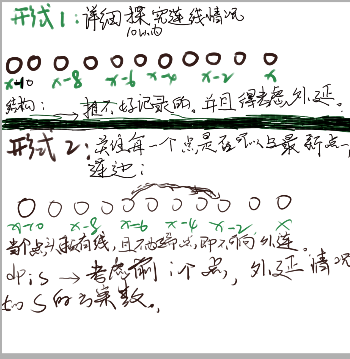
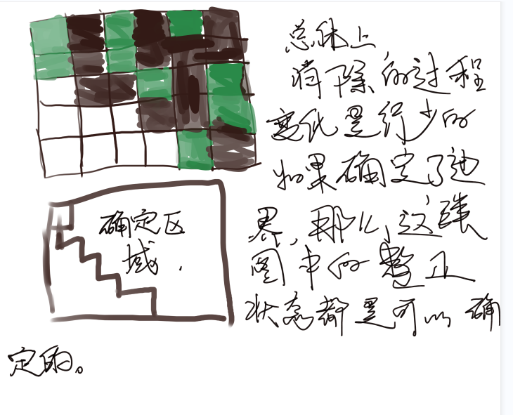

# CCPC 女生专场 2021 C, 连锁商店


### solve

按照一般的状态设计方法： 由于公司的数目高达36个。因此如果做一个统筹兼顾的统计是不行的。

于是思考： 状态设计上的优化：

1. 是不是有一些不必要枚举的状态？
   1. 第一点： 状态设计位记录的应该是公司，而不是某个景点。公司的分布情况很特殊。
   2. 第二点： 发现，如果只有一个公司只和一个景点相关时： 那么该公司参与状态设计显得很用冗余。
      1. 于是对这一类公司不并入状态设计中，只有检查到该公司的景点时，就直接加上该公司的红包即可。

**状态设计：**
$$
f_{i ,s } :表示考虑到达第i个城市，途中经历公司红包（不包括当前景点）领取情况如s
$$
**状态转移方程：**
$$
f_{i , s} \\
1. 如果当前，i节点的公司属于，只出现一次的一类。那么就将该公司的红包直接加到所有的状态中。\\
2. 由下到上的转移：f_{i,s}- > f_{v, t} ， t表示考虑了i景点后，针对j的公司经历情况。
$$

#### 转移：

1. 每天一些卡常小技巧：
2. 求逆元方法中的线性方法：

### code

```cpp
const int N   = 40;

vector<int> g[N];
int ans[N], c[N], w[N] , id[N];
int  cnt[N];
int f[N][1 << 20];

signed main()
{
	ios::sync_with_stdio(false);
	cin.tie(0);

	int n, m;
	cin >> n >> m;
	for (int i = 0; i < n; i++) {
		cin >> c[i];
		c[i]--;
		cnt[c[i]]++;
	}
	int mm = 0;
	for (int i = 0; i < n; i++) {
		cin >> w[i];
		if (cnt[i] > 1) id[i] = mm++;
		else id[i] = -1;
	}
	for (int i = 0; i < m; i++) {
		int u, v;
		cin >> u >> v;
		u--; v--;
		g[u].push_back(v);
	}
	memset(f , -1 , sizeof f);

	f[0][0] = 0;
	for (int i = 0; i < n; i++) {
		for (int s = 0; s < (1 << mm); s++) {
			if (f[i][s] == -1) continue;
			int t = s;
			if (id[c[i]] == -1) f[i][s] += w[c[i]];
			else if ((s >> id[c[i]] & 1) == 0) {
				f[i][s] += w[c[i]];
				t |= 1 << id[c[i]];
			}
			// int t = s;
			// t |= 1 << id[c[i]];
			for (auto v : g[i]) {
				f[v][t] = max(f[v][t] , f[i][s]);
			}
			ans[i] = max(ans[i] , f[i][s]);
			// cout << f[i][s] << "\n";
		}
	}
	for (int i = 0; i < n; i++)
		cout << ans[i] << "\n";
}
```


------

# ICPC 网络预选赛2 2021 K, Meal

[ICPC 网络预选赛2 2021 K, Meal - 题目 - Daimayuan Online Judge](http://oj.daimayuan.top/course/8/problem/379)


### solve

1. 这个范围，很容易的，可以使用状态压缩dp处理：
2. 注意一点是概率的计算： 当处理第i步时， 其选择某一个物品的概率就是当前选择的物品的偏好度 ， 与剩下的物品偏好度之和之间的比。

**状态设计：**

$f_{i , s}$ 考虑了前i个物品之后 ， 当前的物品的选择状况为s的总价值：

**状态转移方程：**

也是采取了一种由小到大特色的转移方式：
$$
f_{i , s} ->f_{i + 1 , s | (1 << j)}
$$

```cpp
#include<bits/stdc++.h>
using namespace std;
using ll = long long;

#define all(x) (x).begin(),(x).end()
#define sz(x) (int)(x).size()
#define bit(x) (1 << (x))

const int inf = 1E9 + 7;;
const ll INF  = 1E18 + 7;
const int N   = 30;
const int M = 3000;
const int mod =  998244353;

int a[N][N] , ans[N][N] , inv[M] , f[N][bit(20)];

void add(int& a , int b) {
	a += b;
	if (a >= mod) a -= mod;
}

signed main()
{
	ios::sync_with_stdio(false);
	cin.tie(0);

	inv[1] = 1;
	for (int i = 2; i < M; i++) {
		inv[i] = 1LL * (mod - mod / i) * inv[mod % i] % mod;
		// cout << inv[i] << '\n';
	}
	int n;
	cin >> n;
	for (int i = 0; i < n; i++) {
		for (int j = 0; j < n; j++)
			cin >> a[i][j];
	}

	f[0][0] = 1;
	for (int i = 0; i < n; i++) {
		for (int s = 0; s < bit(n); s++) {
			if (f[i][s]) {
				int sum = 0;
				for (int j = 0; j < n; j++)
					if ((s & bit(j)) == 0)
						sum += a[i][j];
				ll tmp = 1LL * f[i][s] * inv[sum] % mod;
				// cout << tmp << "\n";
				for (int j = 0; j < n; j++) {
					if ((s & bit(j)) == 0) {
						ll prob = 1LL * tmp * a[i][j] % mod;
						// cout << prob << "\n";
						add(f[i + 1][s | (1 << j)] , prob);
						add(ans[i][j] , prob);
					}
				}
			}
		}
	}
	for (int i = 0; i < n; i++)
		for (int j = 0; j < n; j++)
			cout << ans[i][j] << " \n"[j == n - 1];
}
```
--------
# CCPC Harbin 2021 G, Damaged Bicycle


### solve


### 生长思考：

1. 第一个收获： 在概率模型下，其最优决策是用每一种策略下最终的期望函数作为参考的。这里的最优策略就是从该状态下到达终点的期望时间中最短的选择。

2. 第二个收获：


```cpp
#include <bits/stdc++.h>
using namespace std;
typedef long long ll;

#define bit(x) (1 << (x))

const int N = 101000;
const int M = (1 << 18) + 10;

int n, m, k, d[22][22], a[22], p[22];

typedef pair<int,int> PII;
const int inf = 1 << 30;
vector<PII> e[N];
int vis[N], dis[N];
priority_queue<PII, vector<PII>, greater<PII>> hs;

void dijkstra(int S,int n) {
    for (int i = 1; i <= n; i++) {
        dis[i] = inf;
        vis[i] = 0;
    }
    dis[S] = 0;
    hs.push({dis[S], S});
    while (!hs.empty()) {
        int u=hs.top().second;
        hs.pop();
        if (vis[u]) continue;
        vis[u] = 1;
        for (auto p : e[u]) {
            int v = p.first;
            if (dis[v]>dis[u] + p.second) {
                dis[v]=dis[u] + p.second;
                hs.push({dis[v], v});
            }
        }
    }
}

int v1, v2;
double dp[M][20];
int main() {
    scanf("%d%d", &v1, &v2);
    scanf("%d%d", &n, &m);

    for (int i = 0; i < m; i++) {
        int u, v, w;
        scanf("%d%d%d", &u, &v, &w);
        e[u].push_back({v, w});
        e[v].push_back({u, w});
    }
    scanf("%d", &k);
    for (int i = 0; i < k; i++) {
        scanf("%d%d", &a[i], &p[i]);
    }
    a[k] = 1;
    a[k + 1] = n;
    for (int i = 0; i <= k + 1; i++) {
        dijkstra(a[i], n);
        for (int j = 0; j <= k + 1; j++) {
            d[i][j] = dis[a[j]];
        }
    }
    if (d[k][k + 1] == inf) {
        puts("-1");
        return 0;
    }
    // dp[S][i]
    for (int S = bit(k) - 1; S >= 0; S--)
        for (int i = 0; i < k; i++) if (S & bit(i)) {
            double pBad = 0.01 * p[i];
            // 有车
            double tGood = 1. * d[i][k + 1] / v2;
            // 无车
            double tBad = 1. * d[i][k + 1] / v1;
            for (int j = 0; j < k; j++) if ((S & bit(j)) == 0) {
                tBad = min(tBad, 1. * d[i][j] / v1 + dp[S | bit(j)][j]);
            }
            dp[S][i] = pBad * tBad + (1 - pBad) * tGood;
        }
    double ans = 1. * d[k][k + 1] / v1;
    for (int j = 0; j < k; j++)
        ans = min(ans, 1. * d[k][j] / v1 + dp[bit(j)][j]);
    printf("%.10f\n", ans);
}
```

-----------

# CCPC Changchun 2020 J, Abstract Painting

简介： 在一个图上画圆，要求这些圆之间满足：

1. 圆的半径范围为[1 , 5]
2. 两两个圆之间最多只有一个交点；
3. 圆心在x轴上。
4. 圆上任意点的x坐标必须在[0 , n]的范围之内。

question : 画家已经画了一些圆，问还可以有多少种合法的方案？

### solve

1. 第一步是转换问题： 发现最终问题等价于在0 ... n的点上进行连点的问题，满足任意两条连线只有包含与被包含，或只有一个交点的关系。、

在上述基础上，考虑两种解法：

1. 区间dp的解法：

   类比括号序列： 将线段之间的关系，定义出几种结构：

   1. 定义A 形如括号序列模型中(A)(A)并且满足能够准确定位左右边界的结构》
   2. 形如(A)S(A)。

2. **状压dp**



**状态定义：**

$f_{i , s}$ 表示考虑了前i个点， 当前节点外延情况为s。（某位上可外延标记为0 ， 否则标记为1。）

**状态转移方程：**

1. 枚举前一个状态下的一个s：

2. 按照： x - 2 , x - 4 , x - 6 , x - 8 , x - 10的顺序进行枚举连边：
   $$
   f_{i-1,s} - f_{i  , s \& ((1 << 10) - (1 << i - j - 1))}
   $$

3. 注意 x - 2 ， x - 4 ... 形如这种的划分，也是一个阶段划分： x - 2 得到状态记录也可以贡献x - 4的问题：

####  生长思考：

1. 区间dp形式的解法。

#### code

```cpp
#include<bits/stdc++.h>
using namespace std;
using ll = long long;

#define all(x) (x).begin(),(x).end()
#define sz(x) (int)(x).size()
#define bit(x) (1 << (x))

const int inf = 1E9 + 7;;
const ll INF = 1E18 + 7;
const int N = 1010;
const int mod = inf;

int circle[N][N];
int f[bit(10)] , g[bit(10)];

void add(int& a , int b) {
	a += b;
	if (a >= mod) a -= mod;
}
signed main()
{
	ios::sync_with_stdio(false);
	cin.tie(0);
	int n , k;
	cin >> n >> k;
	for (int i = 0; i < k; i++) {
		int c , r;
		cin >> c >> r;
		circle[c - r][c + r] = 1;
	}

	f[0] = 1;
	for (int i = 0; i <= n; i++) {
		for (int j = i - 2; j >= 0 && j >= i - 10; j -= 2) {
			// 滚动数组：
			for (int s = 0; s < bit(10); s++) {
				g[s] = f[s];
				f[s] = 0;
			}
			//当前点可以选择不放情况下：
			if (not circle[j][i]) {
				for (int s = 0; s < bit(10); s++)
					f[s] = g[s];
			}
			// 连一条线；
			for (int s = 0; s < bit(10); s++) {
				// 第一个阶段：
				if (s >> (i - j - 1) & 1) {
					int news = s & (bit(10) - bit(i - j - 1));
					add(f[news] , g[s]);
				}
			}
		}
		// 更新 ： i - i + 1
		for (int s = 0; s < bit(10); s++) g[s] = f[s] , f[s] = 0;
		for (int s = 0; s < bit(10); s++) {
			int news = (s << 1 | 1) & (bit(10) - 1);
			add(f[news] , g[s]);
		}
	}
	int ans = 0;
	for (int s = 0; s < bit(10); s++)
		add(ans , f[s]);
	cout << ans << "\n";
}

/* stuff you should look for
* int overflow, array bounds
* special cases (n=1?)
* do smth instead of nothing and stay organized
* WRITE STUFF DOWN
* DON'T GET STUCK ON ONE APPROACH
*/
```
# CCPC Qinhuangdao 2019 G, Game on Chessboard
[Problem - G - Codeforces](https://codeforces.com/gym/102361/problem/G)
### 简介：
在一个棋盘上：玩消消乐，每次可以进行以下两种操作：
1. 选择任意一个棋子，消除，其花费为$cost_i$
2. 选择两个不同颜色的棋子i ， j其花费为$cost_i - cost_j$
3. 每当一个棋子被选择操作之后，都将会被消除：
要求：
1. 选择的棋子(X , Y) 中， 必须满足  x >= X , Y <= y 的棋子都被消除。
### solve
发现整个图中的==有效状态==是非常少的：其形式都是以下的几种形式：

**状态设计：**
记录这个路径就可以将这个边界确定，从而进一步确定整个图的结构： 实现转移
路径的记忆方法： 用一个二进制，从低位到高位模拟，从（1 ， 1） 到( n , n)每一步的走法（在注意是在网格点上行走的而不是在内部）。1表示向y走，0表示向x走。于是就可以2n的二进制串来记录出一条路的结构：
$f_{s}$ 表示路径信息为s时，的最小花费。
**状态转移：**
首先用一个数组，找到每一个角： 形如10的情况。

1. 分别记录出黑白：
1. 两两匹配用第二种方法处理：

**集中精力解决的一些问题：**

1. 细节问题：

   1. 进制状态到边界的映射：

      1. 某一个拐角的坐标怎么确定： 从低位到高位模拟这个路径。找到拐角与当前坐标的联系：
      2. 模拟细节：
         1. 初始位置为（0 ， 0）， 表示最左顶的方格。
         2. 0表示x++ , 1表示y++
         3. 如果接下来进行01的移动说明当前格子是拐角：

   2. 状态转移：

      在上述模拟行走的过程中，实现对两种颜色格子的记录：

      记录的内容：

      1. 这个拐角的坐标信息：
      2. 如果对这个拐角消除之后，原来的10就会变成01.为了修改，因此记录代表该拐角的10位置的信息。适用10 中 0的首位置来表示（i）： 消除的操作为 s ^(3 << i)


**初始化：**
1. $f_{111..._{n}000..._{n}} = 0$
2. 其余表示为： inf；表示该状态不存在；

#### code

```cpp
#include<bits/stdc++.h>
using namespace std;
using ll = long long;

#define fsio ios::sync_with_stdio(false);cin.tie(0);
#define bit(x) (1 << (x))

const int inf = (int)1E9 + 7;
const ll INF = (long long)1E18 + 7;
const int N = 25;
char mp[N][N];
int w[N][N];
int f[bit(N)];
void upd(int& a , int b) {
	if (a > b) a = b;
}
int main() {
	fsio;
	int n; cin >> n;
	for (int i = 0; i < n; i++)
		cin >> mp[i];
	for (int i = 0; i < n; i++)
		for (int j = 0; j < n; j++)
			cin >> w[i][j];
	memset(f , 0x3f , sizeof f);
	// 初始化

	// 记录某一种颜色下，的方格的个数情况：
	const int M = 2 * n;
	array<int , 2> white[M] , black[M];

	// dp数组的初始化：

	f[bit(2 * n) - bit(n)] = 0;
	// 枚举路径的信息：
	for (int s = bit(M) - 1; s >= 0; s--) {
		if (f[s] < 0x3f3f3f3f) {

			// 当前走到哪里：
			int x = 0 , y = 0;
			int cw = 0 , cb = 0;

			for (int i = 0; i < M; i++) {
				// 检测当前是否为10类：
				// 说明当前点为为拐角：
				if (((s >> i) & 3) == 2) {
					upd(f[s ^ (3 << i)] , f[s] + w[x][y]);
					if (mp[x][y] == 'B') {
						black[cb++] = {i , w[x][y]};
					} else {
						white[cw++] = {i , w[x][y]};
					}
				}
				if (s & bit(i)) y++; else x++;
			}
			for (int i = 0; i < cb; i++)
				for (int j = 0; j < cw; j++)
				{
					upd(f[s ^ (3 << black[i][0]) ^ (3 << white[j][0])] ,
					    f[s] + abs(black[i][1] - white[j][1]));
				}
		}
	}
	cout << f[bit(n) - 1] << '\n';
}
```


