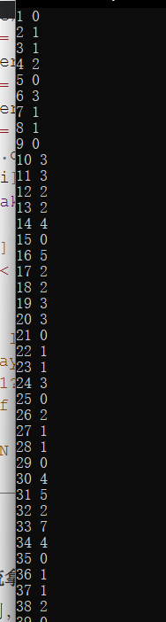
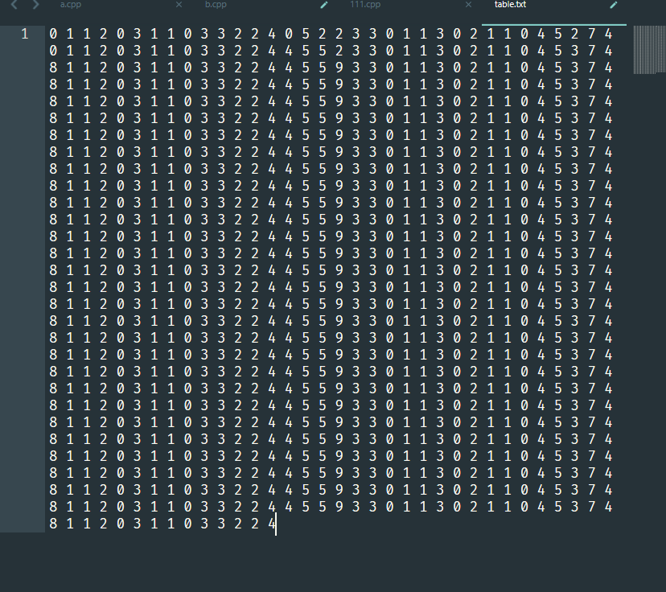

### SG函数

如果一种公平组合游戏可以转换成一个有向图。将问题转变成 ， 在一个有向无环图中 ， 只有一个起点，上面有一个棋子， 两个玩家轮流推动棋子 ， 不能走的玩家判负。
==**SG函数定义**==
状态x和它所有k个后继状态 $y_1 , y_2 ....y_k$
$SG_x = mex(SG_{y1} , SG_{y2} , SG_{y3}.....SG_{yk})$
==**游戏的和：**==
Gi表示若干个游戏：
G = G1 + G2 + G3
每步选择一个Gi移动一步。
==**SG定理：**==
对于由n个有向图游戏组成的组合游戏， 设它们的起点分别为$s_1 ...s_n$有： $SG(s)=SG(s_1)\oplus SG(s_2)\oplus ....\oplus SG(s_n) $
先手必胜当且仅当 ，$SG(s) > 0 $


#### 问题：

1. $SG$函数的初值怎么定义？
   1. 将终点状态定义为0.
2. 把握SG函数的使用前提：
   1. SG函数和SG定理可以解决一大类的博弈问题,这一大类的博弈问题称为**ICG游戏**.
      1. 游戏有两人参与，两人轮流做出决策，并且两人做出的决策都是对自己最优的
      2. **当有一人无法决策的时候，该人失败**。无论两人如何决策，该游戏都必然会在有限时间内结束
      3. 游戏中同一个状态不能达到多次，且游戏没有平局。游戏者在某个确定状态做出的决策集合只与状态有关，与游戏者无关

### 例题：

#### first

**1.设有一堆石子， 两个人轮流取， 每次可以取1  ... k 个 ， 谁不能动就算输， 问谁会获胜。**

$SG(i)表示当前这堆石子有i个其SG值的大小：$

$SG(0...i)$:0 1 2 3 .... k 0 1 2 3 ... k ....

规律就是mod （ k + 1 ) = 0必输。

-----

#### second

**2. n堆石子 。 两个人轮流取 ， 每次可以在一堆石头里面选取任意多的石头 ， 或者把一堆石头分裂成两堆 。 谁不能操作谁输。**

1.  思路： 打表找出sg大小的计算规律：

   1. 关于sg函数的转移：

   $$
   1. 取石头：sg(0...(i - 1))\\
   2. 分裂： sg(j)\quad xor \quad sg(j - i)
   $$
   
2.  

2. 然后找出规律后 ， 就可以统计多个有向图组合成的组合游戏sg情况了。

   **生长：**对于第二种分裂的统计 , 可以感受到多个有向图游戏之间有一定的独立性。

打表角度如下：

##### code

```cpp
#include<bits/stdc++.h>
using namespace std;
using ll = long long;

const int N = 1E6 + 10;

int sg[N];
int cal(int x) {
	if (x == 0 || (x - 1) % 4 == 0 || (x - 1) % 4 == 1) {
		return x;
	} else if ((x - 1) % 4 == 2)
		return x + 1;
	else return x - 1;
}
int main()
{
	ios::sync_with_stdio(false);
	cin.tie(0);
	int n = 100;
	for (int i = 1; i <= n; i++) {
		set<int> rec;
		for (int j = 1; j <= i; j++)
			rec.insert(sg[i - j]);
		for (int j = 1; j < i; j ++)
			rec.insert(sg[j] ^ sg[i - j]);
		for (int j = 0; j <= 1000; j++)
			if (rec.count(j) == 0) {
				sg[i] = j;
				break;
			}
		assert(sg[i] == cal(i));
		cout << i << " " << sg[i] << "\n";
	}
}
/* stuff you should look for
* int overflow, array bounds
* special cases (n=1?)
* do smth instead of nothing and stay organized
* WRITE STUFF DOWN
* DON'T GET STUCK ON ONE APPROACH
*/
```

#### third

**1. 有1*n的东西， 每个人轮流拿连续（序号必须连续）两个 ， 谁不能拿就输。 求sg的值： **
对于一个初始序号连续的序列， 拿到两个条之后 ， 就可以将问题转换成两个独立的公平组合游戏：
$sg(i) = sg(j)\quad xor\quad sg(i - j - 2)$

//这点还有待理解：

然后打表 ， 寻找规律即可。



​	一眼没有看出很显然的归规律 ， 但是可以看到一些数字出现的频率 ， 可以猜测出现循环结。

**技巧：**

1. 借助网站： 分析循环。（平常打比赛的时候可以用。）oeis
2. 调整文本框宽度。因为是一个字符一个字符调整的。非常清楚方便：



规律很显然：

##### fourth

**4. 两人在一张划分格子的白纸条上打轮流×标记。 先手填完得到一个3位连续×标记后胜利。**

考虑一种策略：

1. 打完一个标记之后 ， 不能在标记的附近5格子范围内打标记。于是和4一样， 游戏转变成两个独立游戏。
2. sg函数转移：

$sg(i) = sg(j)\quad xor \quad sg(i - j - 5)$

如果没有规律就暴力做即可。

------------------------

#### fifth

