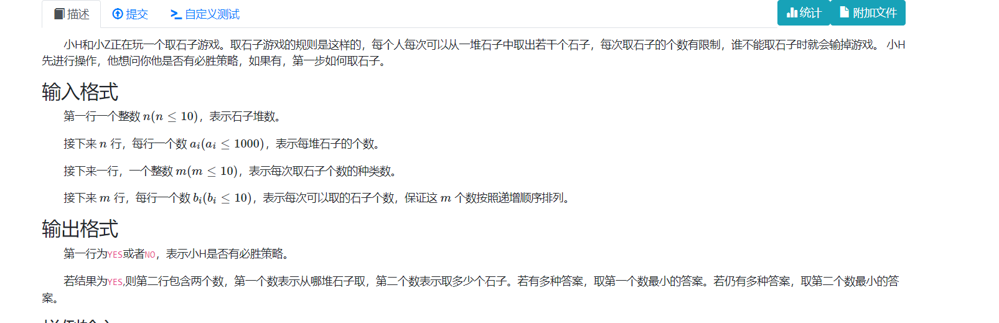

**取石子游戏**
http://oj.daimayuan.top/course/30/problem/1239



#### solve

首先是个公平组合游戏 ： 博弈的集合减少，两人操作。当集合缩减为0时结束。

1. **sg函数的计算方式：**
    ​由于数据范围比较小 ， 直接计算就行。

2. **判断先手是否必胜的方法：**

​           sg定理。

3. **找到先手必胜的第一步：**
   枚举各种操作， 找出使得后手必输的一个操作。（也是利用sg定理：）

#### code

```cpp
#include<bits/stdc++.h>
using namespace std;
using ll = long long;
const int N = 1E6 + 10;
int a[N] , b[N] , sg[N];
int main()
{
	ios::sync_with_stdio(false);
	cin.tie(0);
	int n;
	cin >> n;
	for (int i = 1; i <= n; i++)
		cin >> a[i];
	int m;
	cin >> m;
	for (int i = 1; i <= m; i++)
		cin >> b[i];
	int ans = 0;
	for (int i = 1; i <= 1100; i++) {
		set<int> rec;
		for (int j = 1; j <= m && b[j] <= i; j++) {
			rec.insert(sg[i - b[j]]);
		}
		while (rec.count(sg[i])) sg[i]++;
	}
	for (int i = 1; i <= n; i++) {
		ans ^= sg[a[i]];
	}
	if (ans == 0) cout << "NO\n";
	else {
		cout << "YES\n";
		for (int i = 1; i <= n; i ++) {
			for (int j = 1; j <= m && b[j] <= a[i]; j++) {
				if ((ans ^ sg[a[i]] ^ sg[a[i] - b[j]]) == 0) {
					cout << i << ' ' << b[j] << "\n";
					return 0;
				}
			}
		}
	}
}
/* stuff you should look for
* int overflow, array bounds
* special cases (n=1?)
* do smth instead of nothing and stay organized
* WRITE STUFF DOWN
* DON'T GET STUCK ON ONE APPROACH
*/
```

