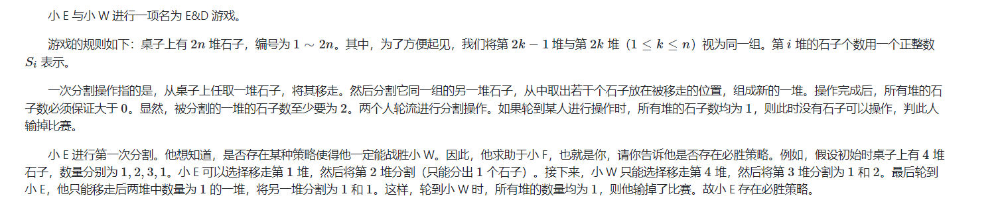
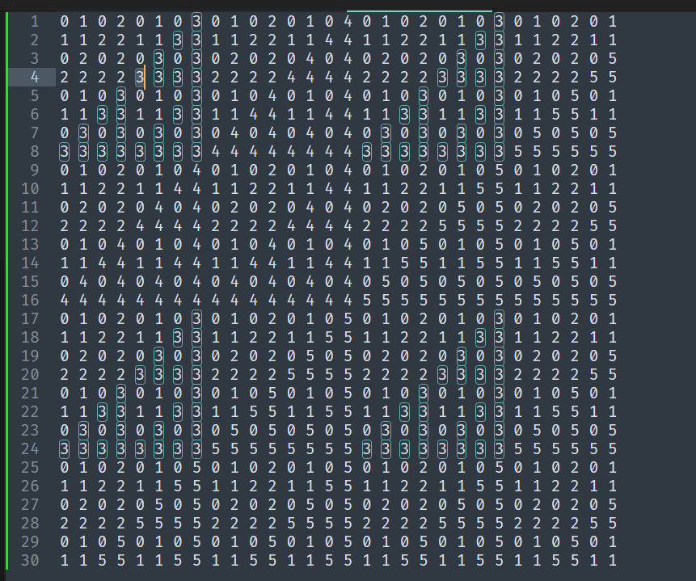

**SDOI 2009, E&D**



#### solve

$sg函数转移：$

$sg_{i , j} = mex(sg_{x , i -x} , sg_{x , j -x})$ 不太精确意会即可。

然后到打出了一张表:



很容易发现规律：

1. 从小到大构造这张表： 类似于当前表左上角的正方形向下贴三份， 并且将其中的一个数字x改成x + 1;其中x和正方形的长有关。
2. 那么怎么利用这种现象 ， 精确的计算sg的值呢？

模仿上述的递归构造方式 ， 是可以计算出目标的sg函数的（时间复杂度O（nlog(a)））

#### code

```cpp
#include<bits/stdc++.h>
using namespace std;
typedef long long ll;
const int oo = 0x0fffffff;
const int N = 1010;
int a[N] , sg[N][N];
int calsg(int i , int j) {
	if (sg[i][j] != -1) return sg[i][j];
	sg[i][j] = 0;
	set<int> rec;
	for (int x = 1; x < i; x++)
		rec.insert(calsg(x ,  i - x));
	for (int x = 1; x < j; x++)
		rec.insert(calsg(x , j - x));
	while (rec.count(sg[i][j]))sg[i][j]++;
	return sg[i][j];
}
int calc2(int  i , int j , int d) {
	if (d == -1) return 0;
	if ((i & (1 << d)) || (j & (1 << d))) {
		int ans = calc2(i & ((1 << d) - 1), j & ((1 << d) - 1) , d - 1);
		ans += ans == d;
		return ans;
	} else return calc2(i , j , d - 1);
}
void work(int testNo)
{
	int n; cin >> n;
	memset(sg , -1 , sizeof sg);
	int ans = 0;
	for (int i = 0; i < n; i += 2) {
		int x , y;
		cin >> x >> y;
		ans ^= calc2(x - 1 , y - 1 , 30);
	}
	if (ans) cout << "YES\n";
	else cout << "NO\n";
}
int main()
{
	ios::sync_with_stdio(false);
	cin.tie(0);
	int t; cin >> t;
	for (int i = 1; i <= t; i++)work(i);
}
/* stuff you should look for
* int overflow, array bounds
* special cases (n=1?)
* do smth instead of nothing and stay organized
* WRITE STUFF DOWN
* DON'T GET STUCK ON ONE APPROACH
*/
```

