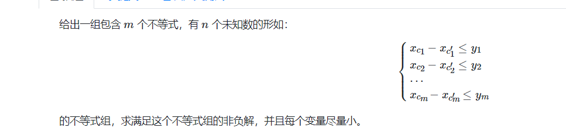
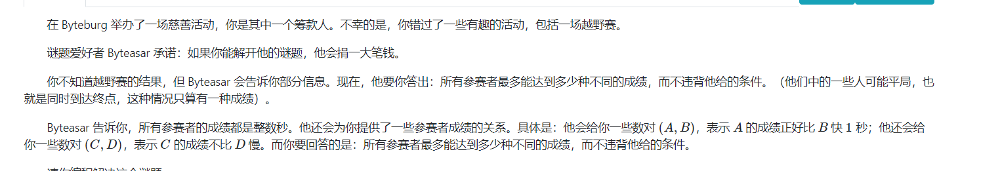

### 概念

~~蹭不了饭~~

#### 差分约束系统

一种特殊的n元不等式组。包含n个变量和m个约束条件，其中每一个约束条件由两个变量的差组成。

对于$x_1....x_n$
形如$x_i-x_j<=c$不等式限制约束下，符合条件的解。或者判断不存在解。

定义上参见：

[差分约束 - OI Wiki (oi-wiki.org)](https://oi-wiki.org/graph/diff-constraints/#定义)

[差分约束系统 - 题目 - Daimayuan Online Judge](http://oj.daimayuan.top/course/23/problem/998)



#### solve

1. 将不等式转换成：

$$
x_i <= c + x_j
$$

2. 一种方法如下：预设 ， 所有的$d_i = 0$。然后遍历上述限制。

   `x_i = min(x_i , c + x_j)`

   不断调整直到符合题意。

3. 发现上述过程等效于bellman算法。
   1. 每一个具体的问题，都可以有一个相关的图匹配。
   2. 唯一的差别是， 初始化上bell_man的初始化为inf。

##### 理解等效性：

1. 将上述关系建立成一个图。d[i]初始化为0，
2. 相当于$x_1$到所有当前的已知点的最短距离为0.然后进行更新。
3. 如果存在负数圈，找不到解。（将圈上相关关系的不等式，通过消元，得到0<= 负数）
4. 没有负数圈，一定可以找到相关的解？
   1. 如果是一条链状。必然有解。
   2. 如果是一个非负环。按照边的递增方式最终必然会出现一个解。
   3. 如果不再更新说明对于任意点满足$x_i <=x_j + c$;

##### 回到问题本身
1. 求非负数解：
    使用技巧：引入一点$x_0 = 0$，引入关系$x_i - x_0>=0$
2. 求最小解。
    事实上，数与数之间，由于边的建立为c。两点之间如果通过该点更新，将会是差为c事实上，差距可能可以更小。
    逆向思维：将最小值问题转化成最大值问题。
    调整不等式为：

$$
x_i - x_j<=c\\
-(-x_i) + (-x_j)<=c\\
令x_i` = -x_i,x_j`=-x_j
$$

初始化时，为了保证，任意两点之间的差距等于边。所以初始化$x_i=oo$

然后得到了变化后的变量的最大值，等效于找到了目标的最小值。

然后跑一遍bellman_ford即可。如果数据太大考虑spfa(加强版的)

##### code

```cpp
#include<bits/stdc++.h>
using namespace std;
using ll = long long;

const int N = 1E6 + 10;

vector<array<int , 3>> e;
int d[N];
int dif = 1E9;

int main()
{
	ios::sync_with_stdio(false);
	cin.tie(0);

	int n , m;
	cin >> n >> m;
	for (int i = 0; i < m; i++) {
		int u , v , w;
		//v - > u ,w --> u -> v w
		cin >> u >> v >> w;
		e.push_back({v , u , w});//反过来。
	}
	for (int i = 1; i <= n; i++) {
		// i -> 0  w = > 0 -> i  w
		e.push_back({ i , 0 , 0});
	}
	for (int i = 1; i <= n; i++)
		d[i] = dif;
	for (int i = 1; i <= n; i++)
		for (int j = 0; j < (int)e.size(); j++) {
			int u = e[j][0] , v = e[j][1] , w = e[j][2];
			d[u] = min(d[u] , d[v] + w);
		}
	for (int i = 0; i <= m; i++) {
		int u = e[i][0] , v = e[i][1] , w = e[i][2];
		if (d[u] > d[v] + w) {
			cout << -1 << '\n';
			return 0;
		}
	}
	for (int i = 1; i <= n; i++) {
		cout << d[0] -  d[i] << " \n"[i == n];
	}

}

/* stuff you should look for
* int overflow, array bounds
* special cases (n=1?)
* do smth instead of nothing and stay organized
* WRITE STUFF DOWN
* DON'T GET STUCK ON ONE APPROACH
*/
```


### first 问题一

[POI2012, Festival - 题目 - Daimayuan Online Judge](http://oj.daimayuan.top/course/23/problem/1026)



#### solve

1. 很容易对题中给出的约束条件，建立差分约束系统。
2. 问题是，追求数的种类尽量多。

##### 观察差分约束建立的图和问题之间的关系：

图中有如下几种环结构


----------

##### 几个结论

1. 利用强连通分量对图缩点。非强连通的两个分量，可以控制不相交：
   1. 比方说，可以将一个分量中的点的值设为无穷大。另外一个分量中的点与它的差也无穷大。这样总可以使权值集合不相交。
2. 对于缩点内部，点的最大种数，是内部点之间的最长路径。找出$max-min$。利用最短路求出，
   1. 强连通分量内部的点之间的最短路，必然只由强连通分量内部的边构成。
   2. 每条边的可能是 0 ， 1 ， -1.所以各种最最大与最小值之间的整数路径长度都存在。 
   3. 如果环内部出现0这种约束。除非全0否则无解。
   4. 对于只有-1 ，1的强连通分量内部。追求每种边都不一样。
      1. 找到这种连通量中的点数。
      2. 直接做最短路计算。（forad）顺便判断负环无解情况。

#### code(dls)

反正都是模仿dls来写的。

```cpp
#include <bits/stdc++.h>
using namespace std;
typedef long long ll;

const int N = 610;
const int inf = 1 << 29;

int n, m1, m2;
int g[N][N];
bool vis[N];

int main() {
	scanf("%d%d%d", &n, &m1, &m2);
	for (int i = 1; i <= n; i++) {
		for (int j = 1; j <= n; j++) {
			g[i][j] = (i == j) ? 0 : inf;
		}
	}
	for (int i = 1; i <= m1; i++) {
		int a, b;
		scanf("%d%d", &a, &b);
		g[b][a] = min(g[b][a], -1);
		g[a][b] = min(g[a][b], 1);
	}

	for (int i = 1; i <= m2; i++) {
		int a, b;
		scanf("%d%d", &a, &b);
		g[b][a] = min(g[b][a], 0);
	}
	for (int k = 1; k <= n; k++)
		for (int i = 1; i <= n; i++)
			for (int j = 1; j <= n; j++)
				g[i][j] = min(g[i][j], g[i][k] + g[k][j]);
	for (int i = 1; i <= n; i++)
		if (g[i][i] < 0) {
			puts("NIE");
			return 0;
		}
	int ans = 0;
	for (int i = 1; i <= n; i++) if (!vis[i]) {
		vector<int> v;
		for (int j = 1; j <= n; j++)
			if (g[i][j] <= n && g[j][i] <= n) {
				v.push_back(j);
				vis[j] = true;
			}
		int d = 0;
		for (auto p : v)for (auto q : v)
			d = max(d, g[p][q]);
		ans += d + 1;
	}
	printf("%d\n", ans);
}
```
