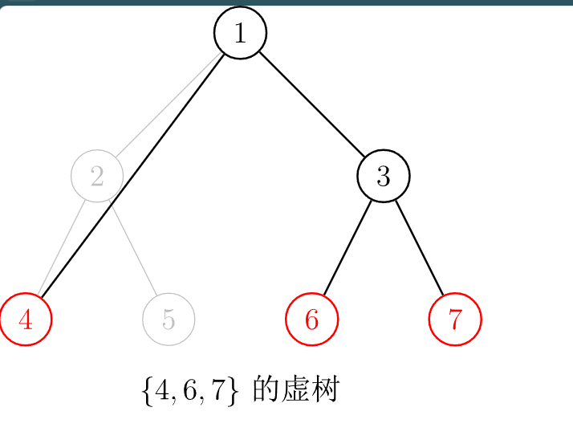

# 虚树
参考博客：
[虚树 - OI Wiki (oi-wiki.org)](https://oi-wiki.org/graph/virtual-tree/#过程)

## 引子

虚树其实就是一种树处理算法： 将一颗树简化，保留求解问题资源的同时，删去不必要的资源： 然后减少访问冗余资源（这里的资源就是指一些节点， 以及边）的消耗： 

经典问题
[P2495 [SDOI2011\] 消耗战 - 洛谷 | 计算机科学教育新生态 (luogu.com.cn)](https://www.luogu.com.cn/problem/P2495)

-----
在一场战争中，战场由 $n$ 个岛屿和 $n-1$ 个桥梁组成，保证每两个岛屿间有且仅有一条路径可达。现在，我军已经侦查到敌军的总部在编号为 $1$ 的岛屿，而且他们已经没有足够多的能源维系战斗，我军胜利在望。已知在其他 $k$ 个岛屿上有丰富能源，为了防止敌军获取能源，我军的任务是炸毁一些桥梁，使得敌军不能到达任何能源丰富的岛屿。由于不同桥梁的材质和结构不同，所以炸毁不同的桥梁有不同的代价，我军希望在满足目标的同时使得总代价最小。

侦查部门还发现，敌军有一台神秘机器。即使我军切断所有能源之后，他们也可以用那台机器。机器产生的效果不仅仅会修复所有我军炸毁的桥梁，而且会重新随机资源分布（但可以保证的是，资源不会分布到 $1$ 号岛屿上）。不过侦查部门还发现了这台机器只能够使用 $m$ 次，所以我们只需要把每次任务完成即可。

**输入格式**

第一行一个整数 $n$，代表岛屿数量。

接下来 n-1 行，每行三个整数 $u,v,w$，代表 $u$ 号岛屿和 $v$ 号岛屿由一条代价为 $c$ 的桥梁直接相连，保证 $1\le u,v\le n$ 且 $1\le c\le 10^5$。

第 $n+1$ 行，一个整数 $m$，代表敌方机器能使用的次数。

接下来 $m$ 行，每行一个整数 $k_i$，代表第 $i$ 次后，有 $k_i$ 个岛屿资源丰富，接下来 $k$ 个整数 $h_1,h_2,\cdots ,h_k$，表示资源丰富岛屿的编号。

**输出格式**

输出有 $m$ 行，分别代表每次任务的最小代价。

**数据范围**

对于 $100\%$ 的数据，$2\le n\le 2.5\times 10^5,m\ge 1,\sum k_i\le 5\times 10^5,1\le k_i\le n-1$。

----

### 对上述问题分析引入虚树：

如果只有一组变化，做一个简单的dp即可；$O(N)$ 的复杂度就可以实现。但是多组变化下，其复杂度为$O(NM)$

考虑每次dp的过程： 


如果当前拥有资源的点是2 , 4.那么遍历3 6 7 5 等子树是没有意义的。提供以下抽象方式：





新出现的边的大小显然是两点之间的最小边：

### 建树细节：

1. 定义关键点：即当前要保留的点：
2. 实现算法 ：
   1. 二次排序 + LCA连边：
   2. 使用单调栈：

### 上述引题的代码：

```cpp
#include<bits/stdc++.h>
using namespace std;
using ll = long long;
#define all(x) (x).begin(),(x).end()
#define sz(x) (int)(x).size()
const int inf = 1E9 + 7;;
const ll INF = 1E18 + 7;
const int N = 3E5 + 10;
int n;
/*虚树：
	1. 建树：
	2. 修改solve代码块，在虚树上解决问题：：
	3. 记录关键点。等等，都是无关的紧要的找开机工作：
	如果手敲板子 ， 敲错了。那么问题可能集中于：
		1. 跳表中，这里小的一端放在第一维度上： 一般习惯上，是将其放在第二维上。有可能会脑子短路把
		这个顺序给搞错。
*/
vector<pair<int, int>> e[N];
/*倍增相关：*/
const int LOGN = 18;
int dep[N], par[LOGN + 1][N], val[LOGN + 1][N];
/*与dfs序相关*/
int l[N], r[N], tot;
void dfs(int u, int fa) {
	l[u] = ++tot;
	dep[u] = dep[fa] + 1;
	for (auto p : e[u]) {
		int v = p.first, w = p.second;
		if (v == fa) continue;
		par[0][v] = u;
		val[0][v] = w;
		dfs(v, u);
	}
	r[u] = tot;
}
void init() {
	dfs(1, 0);
	for (int i = 1; i <= LOGN; i++) {
		for (int u = 1; u <= n; u++) {
			par[i][u] = par[i - 1][par[i - 1][u]];
			val[i][u] = min(val[i - 1][u], val[i - 1][par[i - 1][u]]);
		}
	}
}
int LCA(int u, int v) {
	if (dep[u] > dep[v]) swap(u, v);
	int d = dep[v] - dep[u];
	for (int i = LOGN; i >= 0; i--) {
		if ((1 << i) <= d) {
			d -= (1 << i);
			v = par[i][v];
		}
	}
	if (v == u) return v;
	for (int i = LOGN; i >= 0; i--) {
		if (par[i][v] != par[i][u]) {
			v = par[i][v];
			u = par[i][u];
		}
	}
	return par[0][u];
}
int QueryMinEdge(int u, int v) {
	int ans = 1 << 30;
	if (dep[u] > dep[v]) swap(u, v);
	int d = dep[v] - dep[u];
	for (int i = LOGN; i >= 0; i--) {
		if (d & (1 << i)) {
			ans = min(ans, val[i][v]);
			v = par[i][v];
		}
	}
	if (u == v) return ans;
	for (int i = LOGN; i >= 0; i--) {
		if (par[i][u] != par[i][v]) {
			ans = min({ ans , val[i][u] , val[i][v] });
			u = par[i][u];
			v = par[i][v];
		}
	}
	ans = min({ ans , val[0][u] , val[0][v] });
	return ans;
}
//届时怎么清空数组？
// 虚树：
vector<pair<int, int>> VT[N];
// 给两个点建边：

// 建立虚树代码：
void BuildVirtualTree(vector<int>& key) {
	function<bool(int, int)> cmp = [&](int x, int y) {
		return l[x] < l[y];
	};
	// 加边：
	function<void(int, int)> add = [&](int x, int y) {
		VT[x].push_back({ y , QueryMinEdge(x , y) });
	};
	sort(key.begin(), key.end(), cmp);
	vector<int> a;
	for (int i = 0; i < (int)key.size() - 1; i++) {
		a.push_back(key[i]);
		a.push_back(LCA(key[i], key[i + 1]));
	}
	a.push_back(key.back());
	sort(a.begin(), a.end(), cmp);
	a.erase(unique(a.begin(), a.end()), a.end());
	for (int i = 0, lc; i < (int)a.size() - 1; i++) {
		lc = LCA(a[i], a[i + 1]);
		add(lc, a[i + 1]);
	}
}
// 再在虚树上dp：
ll f[N];
bool rec[N];
void solve(int u) {
	f[u] = 0;
	for (auto p : VT[u]) {
		int v = p.first;
		ll w = p.second;
		solve(v);
		// 说明当下为关键点：
		if (rec[v]) {
			f[u] += w;
		} else {
			f[u] += min(f[v], w);
		}
	}
	VT[u].clear();
}
signed main()
{
	ios::sync_with_stdio(false);
	cin.tie(0);
	cin >> n;
	for (int i = 1; i < n; i++) {
		int u, v, w;
		cin >> u >> v >> w;
		e[u].push_back({ v , w });
		e[v].push_back({ u , w });
	}
	init();
	// 做一些预处理：
	int m;
	cin >> m;
	for (int __ = 1; __ <= m; __++) {
		int k;
		cin >> k;
		vector<int> Key;
		Key.push_back(1);
		for (int i = 1; i <= k; i++) {
			int u; cin >> u;
			Key.push_back(u);
			/*记录关键点， 配合转移*/
			rec[u] = true;;
		}
		BuildVirtualTree(Key);
		solve(1);
		cout << f[1] << "\n";
		for (auto v : Key) {
			rec[v] = false;
		}
	}
}
```


