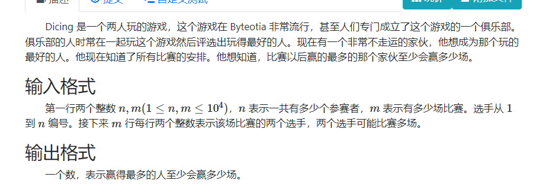
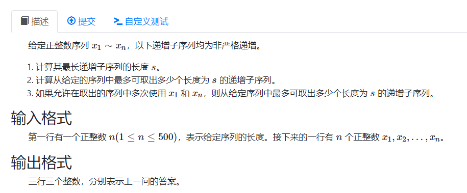

# 最大流
## 基本问题：

图上的边定义了流量的属性。给定源点和汇点。汇点流入的合理方案：满足每条边的流量不超过流量上限，，每个点满足流量平衡（如果一个点不是源点或者汇点，流入流量之和等于流出流量之和）。求出源点到汇点的最大流量。

## 基本概念：

### 基本贪心思路：

1. 不断找到一条流量上限不全为0的路径。选择当前路径来输出最大可流流量，直到没有方案为止。

2. 这种贪心是不正确的： 反例如下
   
   
3. 避免当前问题的方法：
   1. 引入反向边：来表式当前边流过多少流量： 这样就支持了一种可撤销的操作。
   
   2. 流的过程中，维护的带上述反向边的图就是残量网络。
      
   
   3. 引入新的贪心策略：
   
      **引入反向边概念：** 一条边流了x ，建立一条反向边，该边的边权为流量的值即x。（更好的处理撤销流，调整操作。）
   
      1. 不停增广，直到不能增广： 
      2. 增广的含义是： 找到流量上限都是正的路径，然后流过去。==可能是原图的边也可能是原图的反向边。== （这里有没有严格的方向概念？）

**残量网络：** 引入反向边后的网络。

### Ford Fullson

#### 过程：
上述基本的贪心过程。
#### 时间复杂度：

1. 时间复杂度：$O(Fm)$ 流量$\times$ m 

下图代表的图中,就会跑满上述的复杂度.


### Edmonds-karp  EK算法

和FF不同 , 有策略地寻找路径：FF像DFS，而EK像BFS
**最短增广路算法**： 每次找最短距离（最短边数）的增广路。

#### 复杂度

认识：

1. 反向边只会增加两点之间的距离。
2. 考虑分层图上增广。m次增广使得每条边被删完，每次寻找增广路的复杂度为$O(m)$
3. 点的距离会不断增加，最多增加n次。

$O(nm^2)$

一般用的是dinic.

### Dinic算法

dfs多路增广 ： 在选择最短路的基础上，dfs过程中，如果有剩余流量。就继续dfs下去。

**当前弧优化：**

保证复杂度的一个部分；

```CPP
for(int i = cur[u]; ~i ; cur[u] = i = e[i].nxt)
```

每次访问下一条边，将该点的cur修改为下一条边：

$cur:表示什么？$ 表示下次这个点，第一个访问的边。每一次增广的过程中，一条边已经被流完，就不需要再继续访问。详细看代码细节。

**复杂度**

$O(n^2m)$ 

## problems

### 模板题： 最大流。
给定n个点，m条有向边，给定每条边的容量，求从点到点t的最大流。
```cpp
#include <bits/stdc++.h>
using namespace std;
using ll = long long;

const int V = 1010;
const int E = 101000;
template<typename T>
struct FlowGraph {
	int s, t, vtot;
	int head[V], etot;
	int dis[V], cur[V];

	// 邻接表存储。
	// 这样可以方便建立反边^1。

	struct edge {
		int v, nxt;
		T f;
	} e[E * 2];
	void addedge(int u, int v, T f) {
		e[etot] = {v, head[u], f}; head[u] = etot++;
		e[etot] = {u, head[v], 0}; head[v] = etot++;
	}

	bool bfs() {
		for (int i = 1; i <= vtot; i++) {
			dis[i] = 0;
			cur[i] = head[i];
		}
		queue<int> q;
		q.push(s); dis[s] = 1;

		while (!q.empty()) {
			int u = q.front(); q.pop();
			for (int i = head[u]; ~i; i = e[i].nxt) {
				if (e[i].f && !dis[e[i].v]) {
					int v = e[i].v;
					dis[v] = dis[u] + 1;
					if (v == t) return true;
					q.push(v);
				}
			}
		}
		return false;
	}

	T dfs(int u, T m) {
		if (u == t) return m;
		T flow = 0;
		for (int i = cur[u]; ~i; cur[u] = i = e[i].nxt)
			if (e[i].f && dis[e[i].v] == dis[u] + 1) {
				T f = dfs(e[i].v, min(m, e[i].f));
				e[i].f -= f;
				e[i ^ 1].f += f;
				m -= f;
				flow += f;
				if (!m) break;
			}
		if (!flow) dis[u] = -1;
		return flow;
	}

	T dinic() {
		T flow = 0;
		// 从起点开始bfs，确定分层图。 然后开始增广。
		//
		while (bfs()) flow += dfs(s, numeric_limits<T>::max());
		return flow;
	}
	void init(int s_, int t_, int vtot_) {
		s = s_;
		t = t_;
		vtot = vtot_;
		etot = 0;
		for (int i = 1; i <= vtot; i++) head[i] = -1;
	}
};

FlowGraph<ll> g;
int n, m, s, t;
int main() {
	scanf("%d%d%d%d", &n, &m, &s, &t);
	g.init(s, t, n);
	for (int i = 1; i <= m; i++) {
		int u, v, w;
		scanf("%d%d%d", &u, &v, &w);
		g.addedge(u, v, w);
	}
	printf("%lld\n", g.dinic());
}
```

### 网络流20题，试题库：
[网络流 24 题, 试题库 - 题目 - Daimayuan Online Judge](http://oj.daimayuan.top/course/23/problem/1059)

假设一个试题库中有 n 道试题。每道试题都标明了所属类别。同一道题可能有多个类别属性。现要从题库中抽取 m 道题组成试卷。并要求试卷包含指定类型的试题。试设计一个满足要求的组卷算法。


#### solve

匹配模型。考虑将这个图建模，使其转变成网络流模型。

**建模指导**

1. 用一条流代表一个选择：
2. 1道题只能被选择一次。
3. 某一类型的题必须有规定数量道。即通过题目类型的流的大小应该为其数目。

**建模细节**

1. 抽象出两种节点： 题目类型点，以及题目点。
2. 定义出两个点：源点汇点。源点指向每一个类型节点（）。其值的大小就是每种类型题目的需求值。题目点指向汇点，必须为1.代表这道题只能被选择一次。
3. 题目类型点指向对应类型的题目点，容量限制为1（只能选择一次）。

**基于建模解决一些问题：**

1. 无解： 如果存在解，必然是存在一个最大流方案的。即每一类型点都经过了对应的流量。
2. 有解：
   1. 怎么还原解。可以关注最后的残量网络，从而关注，哪一条边被使用过，从而可以判定出对应流的选择。

#### code

```cpp
#include <bits/stdc++.h>
using namespace std;
using ll = long long;

const int V = 1010;
const int E = 101000;
template<typename T>
struct FlowGraph {
	int s, t, vtot;
	int head[V], etot;
	int dis[V], cur[V];

	// 邻接表存储。
	// 这样可以方便建立反边^1。

	struct edge {
		int v, nxt;
		T f;
	} e[E * 2];
	void addedge(int u, int v, T f) {
		e[etot] = {v, head[u], f}; head[u] = etot++;
		e[etot] = {u, head[v], 0}; head[v] = etot++;
	}

	bool bfs() {
		for (int i = 1; i <= vtot; i++) {
			dis[i] = 0;
			cur[i] = head[i];
		}
		queue<int> q;
		q.push(s); dis[s] = 1;

		while (!q.empty()) {
			int u = q.front(); q.pop();
			for (int i = head[u]; ~i; i = e[i].nxt) {
				if (e[i].f && !dis[e[i].v]) {
					int v = e[i].v;
					dis[v] = dis[u] + 1;
					if (v == t) return true;
					q.push(v);
				}
			}
		}
		return false;
	}

	T dfs(int u, T m) {
		if (u == t) return m;
		T flow = 0;
		for (int i = cur[u]; ~i; cur[u] = i = e[i].nxt)
			if (e[i].f && dis[e[i].v] == dis[u] + 1) {
				T f = dfs(e[i].v, min(m, e[i].f));
				e[i].f -= f;
				e[i ^ 1].f += f;
				m -= f;
				flow += f;
				if (!m) break;
			}
		if (!flow) dis[u] = -1;
		return flow;
	}

	T dinic() {
		T flow = 0;
		// 从起点开始bfs，确定分层图。 然后开始增广。
		//
		while (bfs()) flow += dfs(s, numeric_limits<T>::max());
		return flow;
	}
	void init(int s_, int t_, int vtot_) {
		s = s_;
		t = t_;
		vtot = vtot_;
		etot = 0;
		for (int i = 1; i <= vtot; i++) head[i] = -1;
	}
};

FlowGraph<ll> g;
int n, k, s, t;
int main() {
	ios::sync_with_stdio(false);
	cin.tie(0);
	// cin >> n >> m >> s >> t;
	// scanf("%d%d" , &n , &k);
	cin >> k >> n;

	s = n + k + 1;
	t = n + k + 2;


	int sum = 0;
	g.init(s, t, n + k + 2);
	for (int i = 1; i <= k; i++) {
		int x;
		// scanf("%d" , &x);
		cin >> x;
		sum += x;
		// scanf("%d%d%d", &u, &v, &w);
		g.addedge(s, i, x);
	}
	// printf("%d\n" , sum);

	// cout << sum << "\n";
	for (int i = 1; i <= n; i++) {
		g.addedge(i + k , t , 1);
		int m;
		// scanf("%d" , &m);
		cin >> m;
		for (int j = 1; j <= m; j++) {
			int ty;
			// scanf("%d" , &ty);
			cin >> ty;
			g.addedge(ty , i + k , 1);
		}
	}
	// cout << g.dinic() << "\n";
	// printf("%d %d\n" , g.dinic() , sum);
	if (g.dinic() != sum) {
		// printf("No Solution!\n");
		cout << "No Solution!\n";
	} else {
		for (int i = 1; i <= k; i++) {
			// printf("%d: " , i);
			cout << i << ":";
			int tot = 1;
			for (int j = g.head[i]; ~j; j = g.e[j].nxt) {
				int v = g.e[j].v - k;
				if (g.e[j].f == 0 && v <= n) {
					// printf(" %d" , g.e[j].v);
					tot = 0;
					cout << " " << g.e[j].v - k;
				}
			}
			if (tot) cout << " ";
			cout << "\n";
		}
	}
}
```

### POI 2005 dicing

[POI2005, Dicing - 题目 - Daimayuan Online Judge](http://oj.daimayuan.top/course/23/problem/1060)



#### solve

匹配问题。和上述问题一样，利用网络流建模检查去确定流（确定解）的情况下，是否存在解。

然后就可以二分，搜索出答案了。

#### 细节总结：

要非常注意数组长度上的定义： 由于重新建图，引入其它点。（源点， 汇点 , 表达匹配关系的点）等等。点的个数一般是 n + m。 起码开两倍。 边的个数是$m  + n + m$ 起码得开5倍。总的来说，如果内存限制足够，能开多大就开多大。 1E6;

#### code

```cpp
#include<bits/stdc++.h>
using namespace std;

using ll  = long long;

const int V = 40010;
const int E = 40010;
template<typename T>
struct FlowGraph {
	int s , t , vtot;
	int head[V] , etot;
	int dis[V] , cur[V];

	struct edge {
		int v , nxt;
		T f;
	} e[E * 2];

	void addedge(int u , int v , T f) {
		e[etot] = {v , head[u] , f}; head[u] = etot++;
		e[etot] = {u , head[v] , 0}; head[v] = etot++;
	}

	bool bfs() {
		for (int i = 1; i <= vtot; i++) {
			dis[i] = 0;
			cur[i] = head[i];
		}
		queue<int> q;
		q.push(s); dis[s] = 1;

		while (!q.empty()) {
			int u = q.front(); q.pop();
			for (int i = head[u]; ~i; i = e[i].nxt) {
				if (e[i].f && !dis[e[i].v]) {
					int v = e[i].v;
					dis[v] = dis[u] + 1;
					if (v == t) return true;
					q.push(v);
				}
			}
		}
		return false;
	}

	T dfs(int u , T m) {
		if (u == t)  return m;
		T flow = 0;
		for (int i = cur[u]; ~i; cur[u] = i = e[i].nxt)
			if (e[i].f && dis[e[i].v] == dis[u] + 1) {
				T f = dfs(e[i].v , min(m , e[i].f));
				e[i].f -= f;
				e[i ^ 1].f += f;
				m -= f;
				flow += f;
				if (!m) break;
			}
		if (!flow) dis[u] = -1;
		return flow;
	}

	T dinic() {
		T flow = 0;
		while (bfs()) flow += dfs(s , numeric_limits<T> :: max());
		return flow;
	}
	void init(int s_ , int t_ , int vtot_) {
		s = s_;
		t = t_;
		vtot = vtot_;
		etot = 0;
		for (int i = 1; i <= vtot; i++) head[i] = -1;
	}
};
FlowGraph<ll> g;

int a[E][2];

signed main() {
	ios::sync_with_stdio(false);
	cin.tie(0);
	int n , m;
	cin >> n >> m;

	int s = n + m + 1;
	int t = n + m + 2;
	for (int i = 1; i <= m; i++) {
		cin >> a[i][0] >> a[i][1];
	}

	auto check = [&](int x) {
		g.init(s , t , n + m + 2);

		for (int i = 1; i <= m; i++) {
			g.addedge(s , i , 1);
			g.addedge(i , m + a[i][0] , 1);
			g.addedge(i , m + a[i][1] , 1);
		}
		for (int i = 1; i <= n; i++) {
			g.addedge(m + i , t , x);
		}
		return g.dinic() == m;
	};

	int low = 1 , high = m;
	while (low < high) {
		int mid = (low + high) / 2;
		if (check(mid)) high = mid;
		else low = mid + 1;
	}
	cout << low << "\n";
}
```

### 最长上升子序列：



网络流中的路径模型：

### solve

**问题一**

用一个比较暴力的dp方式即可解决。否则用二分优化该该模型。

**问题二**
**转换成一个统计问题。每一个流抽象为一个合法的划分方案。**
关注不同的特征进行建模。

1. 长度为s。
   构造流的合法性，通过建边细节的调整上实现：连边的规则$a_i <= a_j \&\& dp_i + 1 = dp_j$ （第一个条件显然，第二个条件如果不得到满足：）
2. 每个点最多只被使用一次。
   如果仅通过边的设置，显然是不行的。这里可以引入一个技巧（拆点）对于i , 用i1， 用来流入流， i2 ，用于流出流。其中两个点之间的容量限制为1。这样就可以完整的卡住流量为1的流。

.png)

#### tips(关键)

1. 注意特判n = 1；
2. 建图中的边界条件：

#### code

```cpp
#include<bits/stdc++.h>
using namespace std;

using ll  = long long;

const int V = 10010;
const int E = 1000010;

template<typename T>
struct FlowGraph {
	int s , t , vtot;
	int head[V] , etot;
	int dis[V] , cur[V];

	struct edge {
		int v , nxt;
		T f;
	} e[E * 2];

	void addedge(int u , int v , T f) {
		e[etot] = {v , head[u] , f}; head[u] = etot++;
		e[etot] = {u , head[v] , 0}; head[v] = etot++;
	}

	bool bfs() {
		for (int i = 1; i <= vtot; i++) {
			dis[i] = 0;
			cur[i] = head[i];
		}
		queue<int> q;
		q.push(s); dis[s] = 1;

		while (!q.empty()) {
			int u = q.front(); q.pop();
			for (int i = head[u]; ~i; i = e[i].nxt) {
				if (e[i].f && !dis[e[i].v]) {
					int v = e[i].v;
					dis[v] = dis[u] + 1;
					if (v == t) return true;
					q.push(v);
				}
			}
		}
		return false;
	}

	T dfs(int u , T m) {
		if (u == t)  return m;
		T flow = 0;
		for (int i = cur[u]; ~i; cur[u] = i = e[i].nxt)
			if (e[i].f && dis[e[i].v] == dis[u] + 1) {
				T f = dfs(e[i].v , min(m , e[i].f));
				e[i].f -= f;
				e[i ^ 1].f += f;
				m -= f;
				flow += f;
				if (!m) break;
			}
		if (!flow) dis[u] = -1;
		return flow;
	}

	T dinic() {
		T flow = 0;
		while (bfs()) flow += dfs(s , numeric_limits<T> :: max());
		return flow;
	}
	void init(int s_ , int t_ , int vtot_) {
		s = s_;
		t = t_;
		vtot = vtot_;
		etot = 0;
		for (int i = 1; i <= vtot; i++) head[i] = -1;
	}
};
FlowGraph<ll> g;

int a[V] , f[V];

signed main() {
	ios::sync_with_stdio(false);
	cin.tie(0);
	int n;
	cin >> n;

	for (int i = 1; i <= n; i++) {
		cin >> a[i];
	}
	int mx = 0;
	for (int i = 1; i <= n; i++) {
		for (int j = 0; j < i; j++) {
			if (a[j] <= a[i]) {
				f[i] = max(f[j] + 1 , f[i]);
			}
		}
		mx = max(mx , f[i]);
	}
	int s = 2 * n + 1;
	int t = 2 * n + 2;

	g.init(s , t , t);
	for (int i = 1; i <= n; i++) {
		if (f[i] == 1) g.addedge(s , i , 1);
		if (f[i] == mx) g.addedge(i + n , t , 1);
		g.addedge(i , i + n , 1);
		for (int j = i + 1; j <= n; j++) {
			if (a[i] <= a[j] && f[i] + 1 == f[j]) {
				g.addedge(i + n , j , 1);
			}
		}
	}
	cout << mx << "\n" << g.dinic() << "\n";

	g.init(s , t , t);
	for (int i = 1; i <= n; i++) {
		if (f[i] == 1) g.addedge(s , i , 1);
		if (f[i] == mx) g.addedge(i + n , t , 1);
		g.addedge(i , i + n , 1);
		for (int j = i + 1; j <= n; j++) {
			if (a[i] <= a[j] && f[i] + 1 == f[j]) {
				g.addedge(i + n , j , 1);
			}
		}
	}
	g.addedge(s , 1 , V);
	g.addedge(1 , 1 + n , V);
	if (f[n] == mx) {
		g.addedge(n , n + n , V);
		g.addedge(n + n , t , V);
	}
	if (n != 1)
		cout << g.dinic() << "\n";
	else cout << 1 << "\n";
}
```

