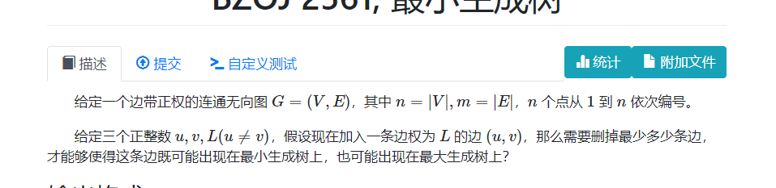
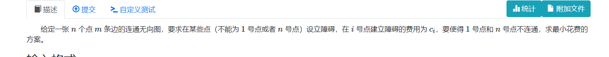
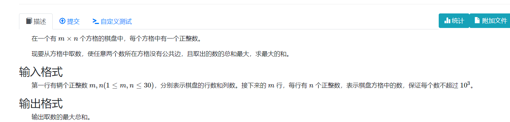
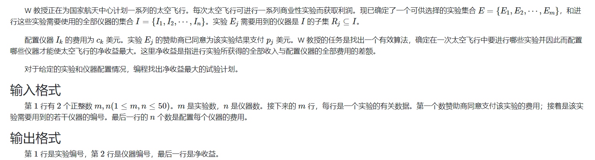
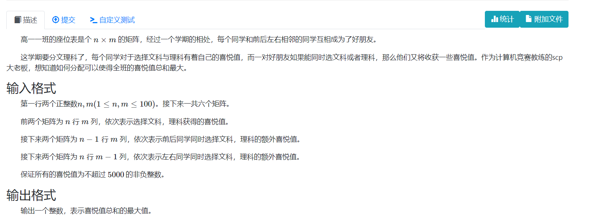

# 最小割

[TOC]


## 简介

**问题描述**
1. 给定一个有向图。删除一些边，使得这个图不连通，并且这些边权和最小。（无向图可以等效转换成有向图。）
2. 将图分成两个集合，A , B。定义割边为$(u , v) , u \in A , v\in B$ 求割边权值之和。求分割集合方案中，割边和最小值。

**最小割和最大流的关系：**

1. 结论是最小割等于最大流。（最大流最小割定理）

**割集**

求割集的方法：在残量网络里，从起点开始BFS:把能到达的点记作S集，不能到达的点记作T集。
**变种**

1. 最大割： NP-complete：只能进行搜索。
2. 边权为负的最小割等效为最大割。
3. 无向图的全局最小割。

## problems

### 1. 最小生成树：



#### solve

从kruskal的角度来看，加入了一条长度为L的边，要求加入L 时 ， u， v还未连通。
从几个角度考虑当前问题；

1. 对于最小生成树： 只考虑边权比L小的图。做kruskal的过程中，如果u，v本来是连通的。那么做完kruskal之后，其必然也是连通的。因此问题转变为了最小割问题，使得u , v之后不连通
2. 同理推广到最大生成树问题。
#### code
```cpp
#include<bits/stdc++.h>
using namespace std;

using ll  = long long;

const int V = 20010;
const int E = 400010;

template<typename T>
struct FlowGraph {
	int s , t , vtot;
	int head[V] , etot;
	int dis[V] , cur[V];

	struct edge {
		int v , nxt;
		T f;
	} e[E * 2];

	void addedge(int u , int v , T f) {
		e[etot] = {v , head[u] , f}; head[u] = etot++;
		e[etot] = {u , head[v] , 0}; head[v] = etot++;
	}

	bool bfs() {
		for (int i = 1; i <= vtot; i++) {
			dis[i] = 0;
			cur[i] = head[i];
		}
		queue<int> q;
		q.push(s); dis[s] = 1;

		while (!q.empty()) {
			int u = q.front(); q.pop();
			for (int i = head[u]; ~i; i = e[i].nxt) {
				if (e[i].f && !dis[e[i].v]) {
					int v = e[i].v;
					dis[v] = dis[u] + 1;
					if (v == t) return true;
					q.push(v);
				}
			}
		}
		return false;
	}

	T dfs(int u , T m) {
		if (u == t)  return m;
		T flow = 0;
		for (int i = cur[u]; ~i; cur[u] = i = e[i].nxt)
			if (e[i].f && dis[e[i].v] == dis[u] + 1) {
				T f = dfs(e[i].v , min(m , e[i].f));
				e[i].f -= f;
				e[i ^ 1].f += f;
				m -= f;
				flow += f;
				if (!m) break;
			}
		if (!flow) dis[u] = -1;
		return flow;
	}

	T dinic() {
		T flow = 0;
		while (bfs()) flow += dfs(s , numeric_limits<T> :: max());
		return flow;
	}
	void init(int s_ , int t_ , int vtot_) {
		s = s_;
		t = t_;
		vtot = vtot_;
		etot = 0;
		for (int i = 1; i <= vtot; i++) head[i] = -1;
	}
};
FlowGraph<ll> g;

int a[V] , f[V];
array<int , 3> edge[E];

signed main() {
	ios::sync_with_stdio(false);
	cin.tie(0);
	int n , m;
	cin >> n >> m;
	for (int i = 1; i <= m; i++) {
		int u , v , w;
		cin >> u >> v >> w;
		edge[i] = {w , u , v};
	}
	sort(edge + 1 , edge + 1 + m);
	int x , y , L;
	cin >> x >> y >> L;
	g.init(x , y , n);
	for (int i = 1; i <= m; i++) {
		auto [w , u , v] = edge[i];
		if (w >= L) break;
		g.addedge(u , v , 1);
		g.addedge(v , u , 1);
	}
	int ans = g.dinic();
	g.init(x , y , n);
	for (int i = m; i >= 1; i--) {
		auto [w , u , v] = edge[i];
		if (w <= L) break;
		g.addedge(u , v , 1);
		g.addedge(v , u , 1);
	}
	ans += g.dinic();
	cout << ans << "\n";
}
```

### 2. ABC239 G, Builder Takahashi

[ABC239 G, Builder Takahashi - 题目 - Daimayuan Online Judge](http://oj.daimayuan.top/course/23/problem/1073)



#### solve

用一个类比的思维来看：其实是求一个最小割点集。尝试将其转变成最小割边集合问题。发现用上面拆点的trick就可以通过建模 ， 将问题转变为求最小割问题。

#### code

```cpp
#include<bits/stdc++.h>
using namespace std;

using ll  = long long;

const ll INF = 1E18 + 7;

const int V = 20010;
const int E = 400010;


template<typename T>
struct FlowGraph {
	int s , t , vtot;
	int head[V] , etot;
	int dis[V] , cur[V];

	struct edge {
		int v , nxt;
		T f;
	} e[E * 2];

	void addedge(int u , int v , T f) {
		e[etot] = {v , head[u] , f}; head[u] = etot++;
		e[etot] = {u , head[v] , 0}; head[v] = etot++;
	}

	bool bfs() {
		for (int i = 1; i <= vtot; i++) {
			dis[i] = 0;
			cur[i] = head[i];
		}
		queue<int> q;
		q.push(s); dis[s] = 1;

		while (!q.empty()) {
			int u = q.front(); q.pop();
			for (int i = head[u]; ~i; i = e[i].nxt) {
				if (e[i].f && !dis[e[i].v]) {
					int v = e[i].v;
					dis[v] = dis[u] + 1;
					if (v == t) return true;
					q.push(v);
				}
			}
		}
		return false;
	}

	T dfs(int u , T m) {
		if (u == t)  return m;
		T flow = 0;
		for (int i = cur[u]; ~i; cur[u] = i = e[i].nxt)
			if (e[i].f && dis[e[i].v] == dis[u] + 1) {
				T f = dfs(e[i].v , min(m , e[i].f));
				e[i].f -= f;
				e[i ^ 1].f += f;
				m -= f;
				flow += f;
				if (!m) break;
			}
		if (!flow) dis[u] = -1;
		return flow;
	}

	T dinic() {
		T flow = 0;
		while (bfs()) flow += dfs(s , numeric_limits<T> :: max());
		return flow;
	}
	void init(int s_ , int t_ , int vtot_) {
		s = s_;
		t = t_;
		vtot = vtot_;
		etot = 0;
		for (int i = 1; i <= vtot; i++) head[i] = -1;
	}
};
FlowGraph<ll> g;
signed main() {
	ios::sync_with_stdio(false);
	cin.tie(0);
	int n , m;
	cin >> n >> m;
	g.init(1 , 2 * n , 2 * n);
	for (int i = 1; i <= m; i++) {
		int u , v;
		cin >> u >> v;
		g.addedge(u * 2 , v  * 2 - 1, INF);
		g.addedge(v * 2, u * 2 - 1 , INF);
	}
	for (int i = 1; i <= n; i++) {
		int c; cin >> c;
		if (i == 1 || i == n) {
			g.addedge(i * 2 - 1 , i * 2 , INF);
			continue;
		}
		g.addedge(i * 2 - 1 , i * 2 , c);
	}
	cout << g.dinic() << "\n";
	vector<int> ans;
	for (int i = 2; i < n; i++) {
		if (g.dis[i * 2 - 1] != 0 && g.dis[i * 2] == 0) {
			ans.push_back(i);
		}
	}
	cout << (int) ans.size() << "\n";
	for (auto x : ans) {
		cout << x << " ";
	}
	cout << "\n";
}
```

### 3. 网络流 24 题, 方格取数



#### solve

一个经典的最大权独立集的问题。

**转换**
将最大问题，转变成： 总点权和减去最小。于是转变成了一个如下问题： 在一个图上删除一些点，使得一个每条边至少都要有一个点都被删除。求删除点权值和的最小值。

**建图**

内容：

1. 流来表达每一条边的选择关系。
2. 表达某一个点的点权的选择。
3. 边的二分互斥关系。

.png)

最后建图的形式如上：于是将问题转变成了边的选择上：

1. 中间INF的边表达了两个点的相邻关系。一个合法方案要求这条边两端只有一条边被选择。即必须删掉一条边，因此发现所有不连通的方案都是合法方案，任何连通的方案都是不合法方案。并且该图边的选择可以表达所有的可能方案。

如上： 转换成了删除一些边使得s ， t不连通，并且要求边权和最小；即最小割问题。

#### code

```cpp
#include<bits/stdc++.h>
using namespace std;

using ll  = long long;

const ll INF = 1E18 + 7;

const int V = 2010;
const int E = 80000;


template<typename T>
struct FlowGraph {
	int s , t , vtot;
	int head[V] , etot;
	int dis[V] , cur[V];

	struct edge {
		int v , nxt;
		T f;
	} e[E * 2];

	void addedge(int u , int v , T f) {
		e[etot] = {v , head[u] , f}; head[u] = etot++;
		e[etot] = {u , head[v] , 0}; head[v] = etot++;
	}

	bool bfs() {
		for (int i = 1; i <= vtot; i++) {
			dis[i] = 0;
			cur[i] = head[i];
		}
		queue<int> q;
		q.push(s); dis[s] = 1;

		while (!q.empty()) {
			int u = q.front(); q.pop();
			for (int i = head[u]; ~i; i = e[i].nxt) {
				if (e[i].f && !dis[e[i].v]) {
					int v = e[i].v;
					dis[v] = dis[u] + 1;
					if (v == t) return true;
					q.push(v);
				}
			}
		}
		return false;
	}

	T dfs(int u , T m) {
		if (u == t)  return m;
		T flow = 0;
		for (int i = cur[u]; ~i; cur[u] = i = e[i].nxt)
			if (e[i].f && dis[e[i].v] == dis[u] + 1) {
				T f = dfs(e[i].v , min(m , e[i].f));
				e[i].f -= f;
				e[i ^ 1].f += f;
				m -= f;
				flow += f;
				if (!m) break;
			}
		if (!flow) dis[u] = -1;
		return flow;
	}

	T dinic() {
		T flow = 0;
		while (bfs()) flow += dfs(s , numeric_limits<T> :: max());
		return flow;
	}
	void init(int s_ , int t_ , int vtot_) {
		s = s_;
		t = t_;
		vtot = vtot_;
		etot = 0;
		for (int i = 1; i <= vtot; i++) head[i] = -1;
	}
};
FlowGraph<ll> g;
int a[32][32];
signed main() {
	ios::sync_with_stdio(false);
	cin.tie(0);
	int  n , m;
	cin >> n >> m;
	ll sum = 0;
	for (int i = 1; i <= n; i++) {
		for (int j = 1; j <= m; j++) {
			cin >> a[i][j];
			sum += a[i][j];
		}
	}
	int s = n * m + 1 , t = n * m + 2;
	g.init(s , t , n * m + 2);
	const ll INF = 1LL << 60;
	for (int i = 1; i <= n; i++) {
		for (int j = 1; j <= m; j++) {
			int id = (i - 1) * m + j;
			if ((i + j) % 2) {
				g.addedge(s , id , a[i][j]);
				/*上下左右：*/
				if (i != 1) g.addedge(id , id - m , INF);
				if (i != n) g.addedge(id , id + m , INF);
				if (j != 1) g.addedge(id , id - 1 , INF);
				if (j != m) g.addedge(id , id + 1 , INF);
			} else {
				g.addedge(id , t , a[i][j]);
			}
		}
	}
	sum -= g.dinic();
	cout << sum << "\n";
}
```

### 4. 网络流 24 题, 太空飞行计划



#### solve

关键的思想：
1. 如果采取最小割的思想，那么一个很关键的思考点： 建一个图，用边来代表对某个对象的贡献。（是否在割边集合中，代表着对该边映射的物品采取唯二的选择或者不选的策略。当选择有两种时就关注（S， T）集的特征。）

对于上述问题：

1. 最大权独立集，转换成求最小的问题： 常见的思路是求补的思想：

   定义$sum = \sum_{i = 1}^{m} v_i$ ;

   任意方案表达为;
   $$
   W = sum - (\sum x  + \sum y)
   $$
   其中$\sum x：表示不选择的实验 ,\sum ：表示不选择的实验仪器。$

**建模：**

原则：
1. 边权代表着对象价值（实验、仪器的价值。）
2. 实验点和依赖仪器点要在同一个独立集中。（S ， T意义挖掘。其中S表示选择，T表示不选择。的对象。）这些点之间建立一条无穷大的边，这样保证了，最小割不会分割两点。

策略：

1. S -> 实验， 其中边权为实验价值。
2. 仪器 -> T ， 其中边权为仪器花费。
3. 实验 -> 依赖仪器 ， 其中边权为INF。 

**感受**

1. 割边表示对映射对象的策略。其边权即策略的的结果贡献。
2. 最后得到的结果必然是合法解。（不多）
3. 其中任意组合，都可以转变成图上割掉某些边。（不漏）

.png)


还原方案，可以通过处理残量网络来实现。
#### solve

```cpp
#include <bits/stdc++.h>
using namespace std;
using ll = long long;

const int V = 20100;
const int E = 201000;
template<typename T>
struct FlowGraph {
	int s, t, vtot;
	int head[V], etot;
	int dis[V], cur[V];
	struct edge {
		int v, nxt;
		T f;
	} e[E * 2];
	void addedge(int u, int v, T f, T f2 = 0) {
		e[etot] = {v, head[u], f}; head[u] = etot++;
		e[etot] = {u, head[v], f2}; head[v] = etot++;
	}

	bool bfs() {
		for (int i = 1; i <= vtot; i++) {
			dis[i] = 0;
			cur[i] = head[i];
		}
		queue<int> q;
		q.push(s); dis[s] = 1;
		while (!q.empty()) {
			int u = q.front(); q.pop();
			for (int i = head[u]; ~i; i = e[i].nxt) {
				if (e[i].f && !dis[e[i].v]) {
					int v = e[i].v;
					dis[v] = dis[u] + 1;
					if (v == t) return true;
					q.push(v);
				}
			}
		}
		return false;
	}

	T dfs(int u, T m) {
		if (u == t) return m;
		T flow = 0;
		for (int i = cur[u]; ~i; cur[u] = i = e[i].nxt)
			if (e[i].f && dis[e[i].v] == dis[u] + 1) {
				T f = dfs(e[i].v, min(m, e[i].f));
				e[i].f -= f;
				e[i ^ 1].f += f;
				m -= f;
				flow += f;
				if (!m) break;
			}
		if (!flow) dis[u] = -1;
		return flow;
	}
	T dinic() {
		T flow = 0;
		while (bfs()) flow += dfs(s, numeric_limits<T>::max());
		return flow;
	}
	void init(int s_, int t_, int vtot_) {
		s = s_;
		t = t_;
		vtot = vtot_;
		etot = 0;
		for (int i = 1; i <= vtot; i++) head[i] = -1;
	}
};

const ll INF = 1ll << 60;
FlowGraph<ll> g;
int main() {
	ios::sync_with_stdio(false);
	cin.tie(0);
	int m , n;
	std::cin >> m >> n;
	std::string str;
	std::getline(std::cin, str);
	int s = n + m + 1 , t = n + m + 2;
	g.init(s , t , t);

	ll sum = 0;
	for (int i = 1; i <= m; i++) {
		std::getline(std::cin, str);
		std::stringstream ss;
		ss << str;
		int x;
		ss >> x;
		sum += x;
		g.addedge(s , i , x);
		while (!ss.eof()) {
			ss >> x;
			g.addedge(i , x + m , INF);
		}
	}
	for (int i = 1; i <= n; i++) {
		int x;
		cin >> x;
		g.addedge(i + m , t , x);
	}
	sum -= g.dinic();
	vector<int> ans1 , ans2;
	for (int i = 1; i <= m; i++) {
		if (g.dis[i] > 0) ans1.push_back(i);
	}
	for (int i = 1; i <= n; i++) {
		if (g.dis[i + m] > 0) ans2.push_back(i);
	}
	for (auto x : ans1) cout << x << " ";
	cout << "\n";
	for (auto x : ans2) cout << x << " ";
	cout << "\n";
	cout << sum << "\n";
}
```

----

#### BZOJ 2127, Happiness



#### solve

一般的： 逆向调整方向： 定义一个合适的sum，于是将问题转变成，sum - 调整策略的最小总损失。

在这个语境下定义$sum = \sum 文 + \sum 理 + \sum 同时选$ 即一个贡献全集。

**建边细节：**

1. 对于一个人选文 ， 选理两者互斥。
2. 相邻人的选择方案。 同时选文 与其中一个人选理互斥 。 同时选理，其中一个人选文互斥。类似与灯泡的并联，串联。互斥边（组合）要串联。

.png)

基于这个图，跑出一个最小割。

1. 那么这个最小割即最后的舍弃方案，留在图中的边即最终选定的方案属性。

感受其正确性：

1. 任何一种合法方案都可以用来表达。其特征是不形成通路。
2. 最大流最小割定理的正确性。以及其得到的（使s ，t不连通）的最小割对应所有合法方案。

#### code

```cpp
#include <bits/stdc++.h>
using namespace std;
using ll = long long;

const int V = 400100;
const int E = 2001000;
template<typename T>
struct FlowGraph {
	int s, t, vtot;
	int head[V], etot;
	int dis[V], cur[V];
	struct edge {
		int v, nxt;
		T f;
	} e[E * 2];
	void addedge(int u, int v, T f, T f2 = 0) {
		e[etot] = {v, head[u], f}; head[u] = etot++;
		e[etot] = {u, head[v], f2}; head[v] = etot++;
	}

	bool bfs() {
		for (int i = 1; i <= vtot; i++) {
			dis[i] = 0;
			cur[i] = head[i];
		}
		queue<int> q;
		q.push(s); dis[s] = 1;
		while (!q.empty()) {
			int u = q.front(); q.pop();
			for (int i = head[u]; ~i; i = e[i].nxt) {
				if (e[i].f && !dis[e[i].v]) {
					int v = e[i].v;
					dis[v] = dis[u] + 1;
					if (v == t) return true;
					q.push(v);
				}
			}
		}
		return false;
	}

	T dfs(int u, T m) {
		if (u == t) return m;
		T flow = 0;
		for (int i = cur[u]; ~i; cur[u] = i = e[i].nxt)
			if (e[i].f && dis[e[i].v] == dis[u] + 1) {
				T f = dfs(e[i].v, min(m, e[i].f));
				e[i].f -= f;
				e[i ^ 1].f += f;
				m -= f;
				flow += f;
				if (!m) break;
			}
		if (!flow) dis[u] = -1;
		return flow;
	}
	T dinic() {
		T flow = 0;
		while (bfs()) flow += dfs(s, numeric_limits<T>::max());
		return flow;
	}
	void init(int s_, int t_, int vtot_) {
		s = s_;
		t = t_;
		vtot = vtot_;
		etot = 0;
		memset(head , -1 , sizeof head);
		// for (int i = 1; i <= vtot; i++) head[i] = -1;
	}
};

const ll INF = 1ll << 60;
FlowGraph<ll> g;
int id[110][110];

int main() {
	ios::sync_with_stdio(false);
	cin.tie(0);
	int n , m;
	cin >> n >> m;
	int s = 1 , t = 2 , tot = 2;
	for (int i = 1; i <= n; i++)
		for (int j = 1; j <= m; j++) {
			id[i][j] = ++tot;
		}
	g.init(s , t , 0);
	ll sum = 0;

	/*文*/
	for (int i = 1; i <= n; i++) {
		for (int j = 1; j <= m; j++) {
			int x;
			cin >> x;
			sum += x;
			g.addedge(s , id[i][j] , x);
		}
	}
	/*理*/
	for (int i = 1; i <= n; i++)
		for (int j = 1; j <= m; j++) {
			int x;
			cin >> x;
			sum += x;
			g.addedge(id[i][j] , t , x);
		}
	//前后同时文
	for (int i = 1; i <= n - 1; i++)
		for (int j = 1; j <= m; j++) {
			int x;
			cin >> x;
			sum += x;
			++tot;
			g.addedge(s , tot , x);
			g.addedge(tot , id[i][j] , INF);
			g.addedge(tot , id[i + 1][j] , INF);
		}

	for (int i = 1; i <= n - 1; i++)
		for (int j = 1; j <= m; j++) {
			int x;
			cin >> x;
			sum += x;
			++tot;
			g.addedge(tot , t , x);
			g.addedge(id[i][j] , tot , INF);
			g.addedge(id[i + 1][j] , tot , INF);
		}
	for (int i = 1; i <= n; i++)
		for (int j = 1; j < m; j++) {
			int x;
			cin >> x;
			sum += x;
			++tot;
			g.addedge(s , tot , x);
			g.addedge(tot , id[i][j] , INF);
			g.addedge(tot , id[i][j + 1] , INF);
		}
	for (int i = 1; i <= n; i++)
		for (int j = 1; j < m; j++) {
			int x; cin >> x;
			sum += x;
			++tot;
			g.addedge(tot , t , x);
			g.addedge(id[i][j] , tot , INF);
			g.addedge(id[i][j + 1] , tot ,  INF);
		}
	// 对板子的应用，以及对网络流过程的理解：
	g.vtot = tot;
	cout << sum - g.dinic() << "\n";
}
```

### 总结：

1. 直接分析，接近最小割中的定义。
2. 二分图最大权独立集。
3. 最小权闭合子图建图：（定义一个有向图，每一个点都有一个权值。选择一个权值和最大的子图，使得每一个点的后继都在子图里。）
   1. 总代价减去最小损失。最小损失使用最小割做。寻找其中的互斥关系。
   2. 挖掘S ， T集合的意义。

