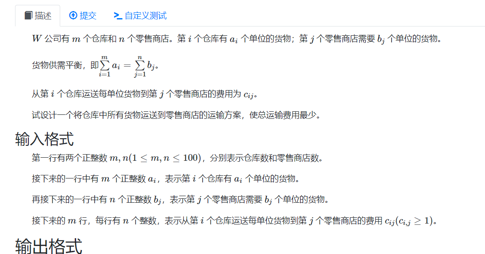
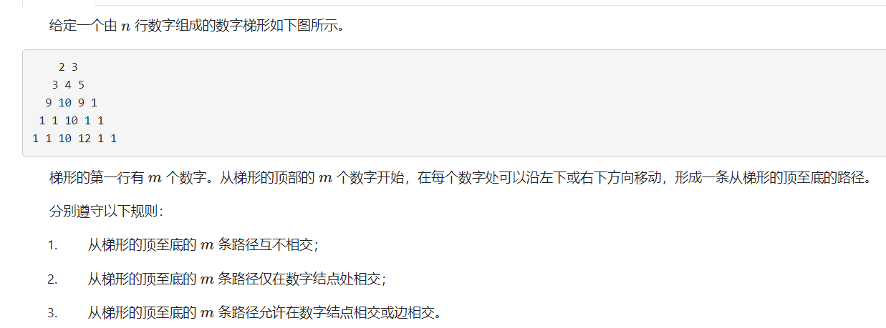
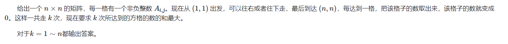

# 费用流

## 费用流简介：

**流代价：** 每条边的流量乘上流费用之和。
**常见问题**

1. 最小（大）费用最大流
2. **循环流** 没有源点汇点。每点流入等于流出。

**算法**
MCMF 最小费用最大流。 mininum cost maximum flow
类似于最大流中的方案，但是该算法上的优先选择的路为费用最小的路径。流过流量之后，其反向边关注费用。（用于增广。）

一些细节：
1. 找最短路。 由于存在负数边，因此选用spfa来寻找最短路。
2. 负环问题： 存在负环，最小费用流依然存在。但是最小增广路已经不存在了。 
   默认不带负环： 1. 边权全为正 ， 2.DAG。初始不带负环，过程中也不带负环。
   

**时间复杂度**
$O(f \times (spfa))$ : 增广次数乘上spfa的复杂度。其中f的上界为流量。（并非多项式级别。）
$O(流量\times m)$ : 要注意问题中的流量是否很大。（2000 -- 4000）的流量就够呛了。

一般是找性质，关注问题中的增广次数的上界。

## problems

### 最小费用流


#### code

```cpp
#include <bits/stdc++.h>
using namespace std;
using ll = long long;

const int V = 20100;
const int E = 201000;

template<typename T>
struct MinCostGraph {
	int s, t, vtot;
	int head[V], etot;
	T dis[V], flow, cost;
	int pre[V];
	bool vis[V];

	struct edge {
		int v, nxt;
		T f, c;
	} e[E * 2];
	void addedge(int u, int v, T f, T c, T f2 = 0) {
		e[etot] = {v, head[u], f, c}; head[u] = etot++;
		e[etot] = {u, head[v], f2, -c}; head[v] = etot++;
	}

	bool spfa() {
		T inf = numeric_limits<T>::max() / 2;
		for (int i = 1; i <= vtot; i++) {
			dis[i] = inf;
			vis[i] = false;
			pre[i] = -1;
		}
		dis[s] = 0;
		vis[s] = true;
		queue<int> q;
		q.push(s);
		while (!q.empty()) {
			int u = q.front();
			for (int i = head[u]; ~i; i = e[i].nxt) {
				int v = e[i].v;
				if (e[i].f && dis[v] > dis[u] + e[i].c) {
					dis[v] = dis[u] + e[i].c;
					pre[v] = i;
					if (!vis[v]) {
						vis[v] = 1;
						q.push(v);
					}
				}
			}
			q.pop();
			vis[u] = false;
		}
		return dis[t] != inf;
	}

	void augment() {
		int u = t;
		T f = numeric_limits<T>::max();
		while (~pre[u]) {
			f = min(f, e[pre[u]].f);
			u = e[pre[u] ^ 1].v;
		}
		flow += f;
		cost += f * dis[t];
		u = t;
		while (~pre[u]) {
			e[pre[u]].f -= f;
			e[pre[u] ^ 1].f += f;
			u = e[pre[u] ^ 1].v;
		}
	}

	pair<T, T> solve() {
		flow = 0;
		cost = 0;
		while (spfa()) augment();
		return {flow, cost};
	}
	void init(int s_, int t_, int vtot_) {
		s = s_;
		t = t_;
		vtot = vtot_;
		etot = 0;
		for (int i = 1; i <= vtot; i++) head[i] = -1;
	}
};

MinCostGraph<int> g;
array<int, 3> e[E];
int main() {
	ios::sync_with_stdio(false);
	cin.tie(0);
	int n , m;
	cin >> n >> m;
	g.init(1, n, n);
	for (int i = 1; i <= m; i++) {
		int u, v, f, c;
		// scanf("%d%d%d%d", &u, &v, &f, &c);
		cin >> u >> v >> f >> c;
		g.addedge(u, v, f, c);
	}
	auto [flow, cost] = g.solve();
	// printf("%d %d\n", flow, cost);
	cout << flow << " " << cost << "\n";
}
```

### 网络流 24 题, 运输问题



### solve

唯一的问题是，最大费用最大流。

1. 按照直觉是反过来，增广时决策由选择最短路变为选最长路。
2. 由于题中并不存在负环，一种常见的思维是对所有边取反，转最大费用问题为最小费用问题。

### code

```cpp
#include<bits/stdc++.h>
using namespace std;

const int V = 20100;
const int E = 201000;

template<typename T>
struct MinCostGraph {
	int s , t , vtot;
	int head[V] , etot;
	T dis[V] , flow , cost;
	int pre[V];
	bool vis[V];

	struct edge {
		int v , nxt;
		T f , c;
	} e[E * 2];

	void addedge(int u , int v , T f , T c , T f2 = 0) {
		e[etot] = {v , head[u] , f , c}; head[u] = etot++;
		e[etot] = {u , head[v] , f2 , -c}; head[v] = etot++;
	}

	bool spfa() {
		T inf  = numeric_limits<T> :: max() / 2;
		for (int i = 1; i <= vtot; i++) {
			dis[i] = inf;
			vis[i] = false;
			pre[i] = -1;
		}
		dis[s] = 0;
		vis[s] = true;
		queue<int> q;
		q.push(s);
		while (!q.empty()) {
			int u = q.front();
			for (int i = head[u]; ~i; i = e[i].nxt) {
				int v = e[i].v;
				if (e[i].f && dis[v] > dis[u] + e[i].c) {
					dis[v] = dis[u] + e[i].c;
					pre[v] = i;
					if (!vis[v]) {
						vis[v] = 1;
						q.push(v);
					}
				}
			}
			q.pop();
			vis[u] = false;
		}
		return dis[t] != inf;
	}

	void augment() {
		int u = t;
		T f = numeric_limits<T>::max();
		while (~pre[u]) {
			f = min(f , e[pre[u]].f);
			u = e[pre[u] ^ 1].v;
		}
		flow += f;
		cost += f * dis[t];
		u = t;
		while (~pre[u]) {
			e[pre[u]].f -= f;
			e[pre[u] ^ 1].f += f;
			u = e[pre[u] ^ 1].v;
		}
	}

	pair<T , T> solve() {
		flow = 0;
		cost = 0;
		while (spfa()) augment();
		return {flow , cost};
	}
	void init(int s_ , int t_ , int vtot_) {
		s = s_;
		t = t_;
		vtot = vtot_;
		etot = 0;
		for (int i = 1; i <= vtot; i++) head[i] = -1;
	}
};
MinCostGraph<int> g;


template<typename T>
struct MaxCostGraph {
	int s , t , vtot;
	int head[V] , etot;
	T dis[V] , flow , cost;
	int pre[V];
	bool vis[V];

	struct edge {
		int v , nxt;
		T f , c;
	} e[E * 2];

	void addedge(int u , int v , T f , T c , T f2 = 0) {
		e[etot] = {v , head[u] , f , c}; head[u] = etot++;
		e[etot] = {u , head[v] , f2 , -c}; head[v] = etot++;
	}

	bool spfa() {
		T inf  = numeric_limits<T> :: max() / 2;
		for (int i = 1; i <= vtot; i++) {
			dis[i] = -inf;
			vis[i] = false;
			pre[i] = -1;
		}
		dis[s] = 0;
		vis[s] = true;
		queue<int> q;
		q.push(s);
		while (!q.empty()) {
			int u = q.front();
			for (int i = head[u]; ~i; i = e[i].nxt) {
				int v = e[i].v;
				if (e[i].f && dis[v] < dis[u] + e[i].c) {
					dis[v] = dis[u] + e[i].c;
					pre[v] = i;
					if (!vis[v]) {
						vis[v] = 1;
						q.push(v);
					}
				}
			}
			q.pop();
			vis[u] = false;
		}
		return dis[t] != -inf;
	}

	void augment() {
		int u = t;
		T f = numeric_limits<T>::max();
		while (~pre[u]) {
			f = min(f , e[pre[u]].f);
			u = e[pre[u] ^ 1].v;
		}
		flow += f;
		cost += f * dis[t];
		u = t;
		while (~pre[u]) {
			e[pre[u]].f -= f;
			e[pre[u] ^ 1].f += f;
			u = e[pre[u] ^ 1].v;
		}
	}

	pair<T , T> solve() {
		flow = 0;
		cost = 0;
		while (spfa()) augment();
		return {flow , cost};
	}
	void init(int s_ , int t_ , int vtot_) {
		s = s_;
		t = t_;
		vtot = vtot_;
		etot = 0;
		for (int i = 1; i <= vtot; i++) head[i] = -1;
	}
};
MaxCostGraph<int> mxg;

int a[110] , b[110];

signed main() {
	ios::sync_with_stdio(false);
	cin.tie(0);
	int n , m;
	cin >> m >> n;
	int s = n + m + 1 , t = n + m + 2;
	g.init(s , t , t);
	mxg.init(s , t , t);
	for (int i = 1; i <= m; i++) {
		cin >> a[i];
		g.addedge(s , i , a[i] , 0);
		mxg.addedge(s , i , a[i] , 0);
	}
	for (int i = 1; i <= n; i++) {
		int x;
		cin >> x;
		g.addedge(m + i , t , x , 0);
		mxg.addedge(m + i , t , x , 0);
	}
	for (int i = 1; i <= m; i++) {
		for (int j = 1; j <= n; j++) {
			int x;
			cin >> x;
			g.addedge(i , m + j , a[i]  , x);
			mxg.addedge(i , m + j , a[i]  , x);
		}
	}
	auto [flow1 , mincost] = g.solve();
	auto [flow2 , maxcost] = mxg.solve();
	// cout << flow << "\n";
	cout << mincost << "\n" << maxcost << "\n";
}
```


```cpp
#include<bits/stdc++.h>
using namespace std;

const int V = 20100;
const int E = 201000;

template<typename T>
struct MinCostGraph {
	int s , t , vtot;
	int head[V] , etot;
	T dis[V] , flow , cost;
	int pre[V];
	bool vis[V];

	struct edge {
		int v , nxt;
		T f , c;
	} e[E * 2];

	void addedge(int u , int v , T f , T c , T f2 = 0) {
		e[etot] = {v , head[u] , f , c}; head[u] = etot++;
		e[etot] = {u , head[v] , f2 , -c}; head[v] = etot++;
	}

	bool spfa() {
		T inf  = numeric_limits<T> :: max() / 2;
		for (int i = 1; i <= vtot; i++) {
			dis[i] = inf;
			vis[i] = false;
			pre[i] = -1;
		}
		dis[s] = 0;
		vis[s] = true;
		queue<int> q;
		q.push(s);
		while (!q.empty()) {
			int u = q.front();
			for (int i = head[u]; ~i; i = e[i].nxt) {
				int v = e[i].v;
				if (e[i].f && dis[v] > dis[u] + e[i].c) {
					dis[v] = dis[u] + e[i].c;
					pre[v] = i;
					if (!vis[v]) {
						vis[v] = 1;
						q.push(v);
					}
				}
			}
			q.pop();
			vis[u] = false;
		}
		return dis[t] != inf;
	}

	void augment() {
		int u = t;
		T f = numeric_limits<T>::max();
		while (~pre[u]) {
			f = min(f , e[pre[u]].f);
			u = e[pre[u] ^ 1].v;
		}
		flow += f;
		cost += f * dis[t];
		u = t;
		while (~pre[u]) {
			e[pre[u]].f -= f;
			e[pre[u] ^ 1].f += f;
			u = e[pre[u] ^ 1].v;
		}
	}

	pair<T , T> solve() {
		flow = 0;
		cost = 0;
		while (spfa()) augment();
		return {flow , cost};
	}
	void init(int s_ , int t_ , int vtot_) {
		s = s_;
		t = t_;
		vtot = vtot_;
		etot = 0;
		for (int i = 1; i <= vtot; i++) head[i] = -1;
	}
};
MinCostGraph<int> g1 , g2;

int a[110];

signed main() {
	ios::sync_with_stdio(false);
	cin.tie(0);
	int n , m;
	cin >> m >> n;
	int s = n + m + 1 , t = n + m + 2;
	g1.init(s , t , t);
	g2.init(s , t , t);
	for (int i = 1; i <= m; i++) {
		cin >> a[i];
		g1.addedge(s , i , a[i] , 0);
		g2.addedge(s , i , a[i] , 0);
	}
	for (int i = 1; i <= n; i++) {
		int x;
		cin >> x;
		g1.addedge(m + i , t , x , 0);
		g2.addedge(m + i , t , x , 0);
	}
	for (int i = 1; i <= m; i++) {
		for (int j = 1; j <= n; j++) {
			int x;
			cin >> x;
			g1.addedge(i , m + j , a[i]  , x);
			g2.addedge(i , m + j , a[i]  , -x);
		}
	}
	auto [flow1 , mincost] = g1.solve();
	auto [flow2 , maxcost] = g2.solve();
	// cout << flow << "\n";
	cout << mincost << "\n" << -maxcost << "\n";
}
```

### 数字梯形问题：



#### solve

1. 使用流来卡路径对点的经过情况。
2. 使用费用来处理几条条流中的节点权值之和。

**建模：**

1. 定义源点s  , 终点t。
2. s - >第一层节点引一条容量限制为1的边。

基本的卡法：
.png)

**分三个问题**

1. 要求每一条边只能被选一次， 以及每一个点只能被选择一次。对这方面限制的调制方法是：对象（路径中的边，点等）映射的边的容量限制设置为1.
2. 边不限制，点设置为1.
3. 都不限制。

#### code

```cpp
#include <bits/stdc++.h>
using namespace std;
using ll = long long;
const int V = 20100;
const int E = 201000;

template<typename T>
struct MinCostGraph {
	int s, t, vtot;
	int head[V], etot;
	T dis[V], flow, cost;
	int pre[V];
	bool vis[V];

	struct edge {
		int v, nxt;
		T f, c;
	} e[E * 2];
	void addedge(int u, int v, T f, T c, T f2 = 0) {
		e[etot] = {v, head[u], f, c}; head[u] = etot++;
		e[etot] = {u, head[v], f2, -c}; head[v] = etot++;
	}

	bool spfa() {
		T inf = numeric_limits<T>::max() / 2;
		for (int i = 1; i <= vtot; i++) {
			dis[i] = inf;
			vis[i] = false;
			pre[i] = -1;
		}
		dis[s] = 0;
		vis[s] = true;
		queue<int> q;
		q.push(s);
		while (!q.empty()) {
			int u = q.front();
			for (int i = head[u]; ~i; i = e[i].nxt) {
				int v = e[i].v;
				if (e[i].f && dis[v] > dis[u] + e[i].c) {
					dis[v] = dis[u] + e[i].c;
					pre[v] = i;
					if (!vis[v]) {
						vis[v] = 1;
						q.push(v);
					}
				}
			}
			q.pop();
			vis[u] = false;
		}
		return dis[t] != inf;
	}

	void augment() {
		int u = t;
		T f = numeric_limits<T>::max();
		while (~pre[u]) {
			f = min(f, e[pre[u]].f);
			u = e[pre[u] ^ 1].v;
		}
		flow += f;
		cost += f * dis[t];
		u = t;
		while (~pre[u]) {
			e[pre[u]].f -= f;
			e[pre[u] ^ 1].f += f;
			u = e[pre[u] ^ 1].v;
		}
	}

	pair<T, T> solve() {
		flow = 0;
		cost = 0;
		while (spfa()) augment();
		return {flow, cost};
	}
	void init(int s_, int t_, int vtot_) {
		s = s_;
		t = t_;
		vtot = vtot_;
		etot = 0;
		for (int i = 1; i <= vtot; i++) head[i] = -1;
	}
};

MinCostGraph<ll> g1, g2, g3;

int id[50][50];

signed main() {
	ios::sync_with_stdio(false);
	cin.tie(0);
	int m , n;
	cin >> m >> n;
	int tot = 0;
	for (int i = 1; i <= n; i++)
		for (int j = 1; j <= m + i - 1; j++) {
			id[i][j] = ++tot;
		}

	int s = tot * 2 + 1 , t = tot * 2 + 2;
	// cout << s << " " << t << "\n";
	// cout << tot << "\n";

	g1.init(s , t , t);
	g2.init(s , t , t);
	g3.init(s , t , t);

	for (int i = 1; i <= m; i++) {
		g1.addedge(s, id[1][i] * 2 - 1, 1, 0);
		g2.addedge(s, id[1][i] * 2 - 1, 1, 0);
		g3.addedge(s, id[1][i] * 2 - 1, 1, 0);
	}

	for (int i = 1; i <= n; i++) {
		for (int j = 1; j <= m + i - 1; j++) {
			if (i != n ) {
				g1.addedge(id[i][j] * 2 , id[i + 1][j]     * 2 - 1 , 1 , 0);
				g1.addedge(id[i][j] * 2 , id[i + 1][j + 1] * 2 - 1 , 1 , 0);
				g2.addedge(id[i][j] * 2 , id[i + 1][j]     * 2 - 1 , 1 , 0);
				g2.addedge(id[i][j] * 2 , id[i + 1][j + 1] * 2 - 1 , 1 , 0);
				g3.addedge(id[i][j] * 2 , id[i + 1][j]     * 2 - 1 , m , 0);
				g3.addedge(id[i][j] * 2 , id[i + 1][j + 1] * 2 - 1 , m , 0);

			} else {
				g1.addedge(id[i][j] * 2 , t , 1 , 0);
				g2.addedge(id[i][j] * 2 , t , m , 0);
				g3.addedge(id[i][j] * 2 , t , m , 0);
			}

			int x;
			cin >> x;
			g1.addedge(id[i][j] * 2 - 1 , id[i][j] * 2 , 1 , -x);
			g2.addedge(id[i][j] * 2 - 1 , id[i][j] * 2 , m , -x);
			g3.addedge(id[i][j] * 2 - 1 , id[i][j] * 2 , m , -x);
		}
	}
	auto [f1 , c1] = g1.solve();
	auto [f2 , c2] = g2.solve();
	auto [f3 , c3] = g3.solve();
	// cout << f1 << " " << f2 << " " << f3 << "\n";
	cout << -c1 << "\n" << -c2 << "\n" << -c3 << "\n";
}
```

### k 取方格数



#### solve

1. 用流来控制走了多少次。
2. 用费用来处理流路径上的点权的贡献。

**第一个问题：**
当一个位置被经历过一次之后，那么其余几次经过就会变成0。应该怎么处理这种变化？

有以下这种建图方式：由于优先最大费用，因此$a_j$总是被选的，并且只选一次。


**第二个问题：**
如果分n次调整流量，跑n次网络流，会超时，该怎么提升效率。

发现每一次增广，总是被卡长度为1的流量（中间的边容量全是1）。因此在增广的过程中记录答案即可。

#### code

```cpp
#include <bits/stdc++.h>
using namespace std;
using ll = long long;
const int V = 20100;
const int E = 201000;

template<typename T>
struct MinCostGraph {
	int s, t, vtot;
	int head[V], etot;
	T dis[V], flow, cost;
	int pre[V];
	bool vis[V];

	struct edge {
		int v, nxt;
		T f, c;
	} e[E * 2];
	void addedge(int u, int v, T f, T c, T f2 = 0) {
		e[etot] = {v, head[u], f, c}; head[u] = etot++;
		e[etot] = {u, head[v], f2, -c}; head[v] = etot++;
	}

	bool spfa() {
		T inf = numeric_limits<T>::max() / 2;
		for (int i = 1; i <= vtot; i++) {
			dis[i] = inf;
			vis[i] = false;
			pre[i] = -1;
		}
		dis[s] = 0;
		vis[s] = true;
		queue<int> q;
		q.push(s);
		while (!q.empty()) {
			int u = q.front();
			for (int i = head[u]; ~i; i = e[i].nxt) {
				int v = e[i].v;
				if (e[i].f && dis[v] > dis[u] + e[i].c) {
					dis[v] = dis[u] + e[i].c;
					pre[v] = i;
					if (!vis[v]) {
						vis[v] = 1;
						q.push(v);
					}
				}
			}
			q.pop();
			vis[u] = false;
		}
		return dis[t] != inf;
	}

	void augment() {
		int u = t;
		T f = numeric_limits<T>::max();
		while (~pre[u]) {
			f = min(f, e[pre[u]].f);
			u = e[pre[u] ^ 1].v;
		}
		flow += f;
		cost += f * dis[t];
		u = t;
		while (~pre[u]) {
			e[pre[u]].f -= f;
			e[pre[u] ^ 1].f += f;
			u = e[pre[u] ^ 1].v;
		}
		cout << -cost << "\n";
	}

	pair<T, T> solve() {
		flow = 0;
		cost = 0;
		while (spfa()) augment();
		return {flow, cost};
	}
	void init(int s_, int t_, int vtot_) {
		s = s_;
		t = t_;
		vtot = vtot_;
		etot = 0;
		for (int i = 1; i <= vtot; i++) head[i] = -1;
	}
};

MinCostGraph<ll> g;
const ll inf = 1LL << 60;

int id[100][100];
signed main() {
	ios::sync_with_stdio(false);
	cin.tie(0);
	int n;
	cin >> n;
	int tot = 0;
	for (int i = 1; i <= n ; i++)
		for (int j = 1; j <= n; j++) {
			id[i][j] = ++tot;
		}
	int s = tot * 2 + 1 , t = tot * 2 + 2;
	g.init(s , t , t);
	g.addedge(s , id[1][1] * 2 - 1 , n , 0);
	g.addedge(id[n][n] * 2 , t , n , 0);

	for (int i = 1; i <= n; i++) {
		for (int j = 1; j <= n; j++) {
			int x; cin >> x;
			g.addedge(id[i][j] * 2 - 1 , id[i][j] * 2 , 1 , -x);
			g.addedge(id[i][j] * 2 - 1 , id[i][j] * 2 , inf , 0);
			if (i != n) g.addedge(id[i][j] * 2 , id[i + 1][j] * 2 - 1 , inf , 0);
			if (j != n) g.addedge(id[i][j] * 2 , id[i][j + 1] * 2 - 1, inf , 0);
		}
	}
	g.solve();
}
```

### 网络流 24 题, 餐巾计划问题


