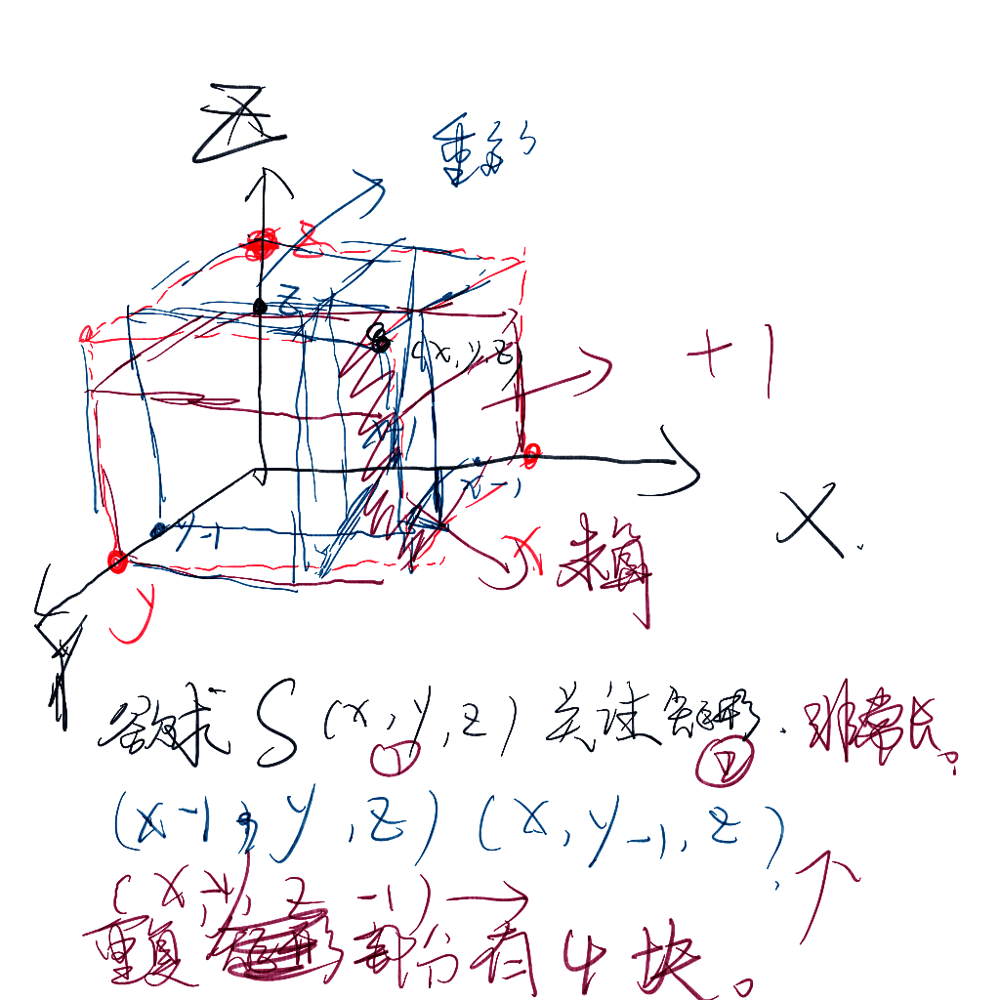

#### 前缀和的定义

就是给定一个存储结构。用一个矢量来表达元素。$(x,y,z,k...)$

关注一些下标小于等于给定$（x,y,z,k...）$的元素之和。这里的小于等于定义是，每一个维度都小于等于给定的下标组合。

参考博客：https://www.cnblogs.com/Miracevin/p/9778266.html

前缀和有两种不同的写法。

一种是容斥。另外一种是另外角度的dp写法。都非常具有启发性。

#### 容斥方法下的计算。

> 在[计数](https://baike.baidu.com/item/计数/9276342?fromModule=lemma_inlink)时，必须注意没有重复，没有遗漏。为了使[重叠](https://baike.baidu.com/item/重叠/9009438?fromModule=lemma_inlink)部分不被重复计算，人们研究出一种新的计数方法，这种方法的基本思想是：先不考虑重叠的情况，把包含于某内容中的所有对象的数目先计算出来，然后再把计数时重复计算的数目[排斥](https://baike.baidu.com/item/排斥/10717656?fromModule=lemma_inlink)出去，使得计算的结果既无遗漏又无重复，这种计数的方法称为容斥原理。

##### 一维数组下的容斥方法：

```cpp
for(int i = 1; i <= n; i++)
{
    s[i] = s[i-1] + a[i];
}
```


##### 二维数组下的容斥方法：

```cpp
for(int i = 1; i <= n; i++)
    for(int j = 1; j <= m; j++)
    {
        s[i][j]= s[i-1][j] + s[i][j-1] + a[i][j]- s[i-1][j-1];
    }
```


##### 三维下的前缀和

```cpp
for(int i = 1; i <= n; i++)
    for(int j = 1; j <= m; j++)
        for(int k = 1; k <= q; k++)
        {
            s[i][j][k] = s[i - 1][j][k] + s[i][j-1][k] + s[i][j][k-1]
                		-s[i-1][j-1][k] - s[i-1][j][k-1] - s[i][j-1][k-1]
                 		+ s[i-1][j-1][k-1];
        }
```



像我这种数学天赋一般的水平，总是想着容斥可以形象化。然后接着思维自由的进行一系列的容斥操作。

思维的话别想了，根本想不出来。所以到时候还是要用很多计数技巧。

#### 一种计数规律挖掘的方法解决该问题方法解决这个问题（类似一种dp）

##### 一维

```cpp
for(int i = 1; i <= n; i++)	s[i]=a[i];
for(int i = 1; i <= n; i++)	s[i]+=s[i-1];
```

##### 二维

```cpp
for(int i = 1; i <= n; i++)
    for(int j = 1; j <= m; j++)
        s[i][j] = a[i][j];

for(int i = 1; i <= n; i++)
    for(int j = 1; j <= m; j++)
            s[i][j] += s[i-1][j];

for(int i = 1; i <= n; i++)
    for(int j = 1; j <= m; j++)
        s[i][j] += s[i][j-1];
```

##### 三维

```cpp
for(int i = 1; i <= n; i++)
    for(int j = 1; j <= m; j++)
        for(int k = 1; k <= o; k++)
        {
            s[i][j][k] = a[i][j][k];
        }

for(int i = 1; i <= n; i++)
    for(int j = 1; j <= m; j++)
        for(int k = 1; k <= o; k++)
        {
            s[i][j][k] += s[i-1][j][k];
        }

for(int i = 1; i <= n; i++)
    for(int j = 1; j <= m; j++)
        for(int k = 1; k <= o; k++)
        {
            s[i][j][k] += s[i][j-1][k-1];
        }

for(int i = 1; i <= n; i++)
    for(int j = 1; j <= m; j++)
        for(int k = 1; k <= o; k++)
        {
            s[i][j][k] += s[i][j][k-1];
        } 

```

依此类推：

理解转移原理：

第一轮之后s\[i]\[j]\[k]中i任意变化的节点$a[1...i][j][k]$贡献计算完成

第二轮之后$s[i][j][k]$中，i  ,  j任意变化的节点$a[1...i][1...j][k]$贡献计算完成。

第三轮之后$s[i][j][k]$中，i ,  j , k任意变化的节点$a[1...i][1....j][1....k]$贡献计算完成。

到此，已经把所有的贡献都计算完成了。

这样比较好记忆。并且常数随着维度的增加，相对容斥来说会逐渐变小。

另外这个角度对于树状数组维护二维数组而言，也更加容易维护。

#### 应用场景

 [SOSdp .md](..\..\动态规划\状压dp\状态压缩dp进阶\SOSdp .md) 
