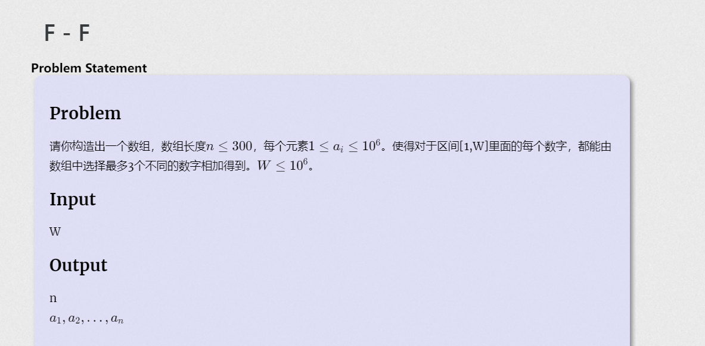

#### 覆盖加法构造：




#### solve

关注最终结果为 xxxxxxx

拆分成三组，每一位独立贡献，每组100个就可以通过这三组构造出所有的可能。

#### code

```cpp
#include<bits/stdc++.h>
using namespace std;
using ll = long long;
const int N = 1E6 + 10;
bool f[N];
int main(){
	ios::sync_with_stdio(false);
	cin.tie(0);
	cout << 298 << '\n';
	for (int i = 1; i <= 99; i++) {
		cout << i << ' ';
	}
	for (int i = 1; i <= 99; i ++) {
		cout << i * 100 << ' ';
	}
	for (int i = 1; i <= 100; i++) {
		cout << i * 10000 << ' ';
	}
	cout << '\n';
}
```

