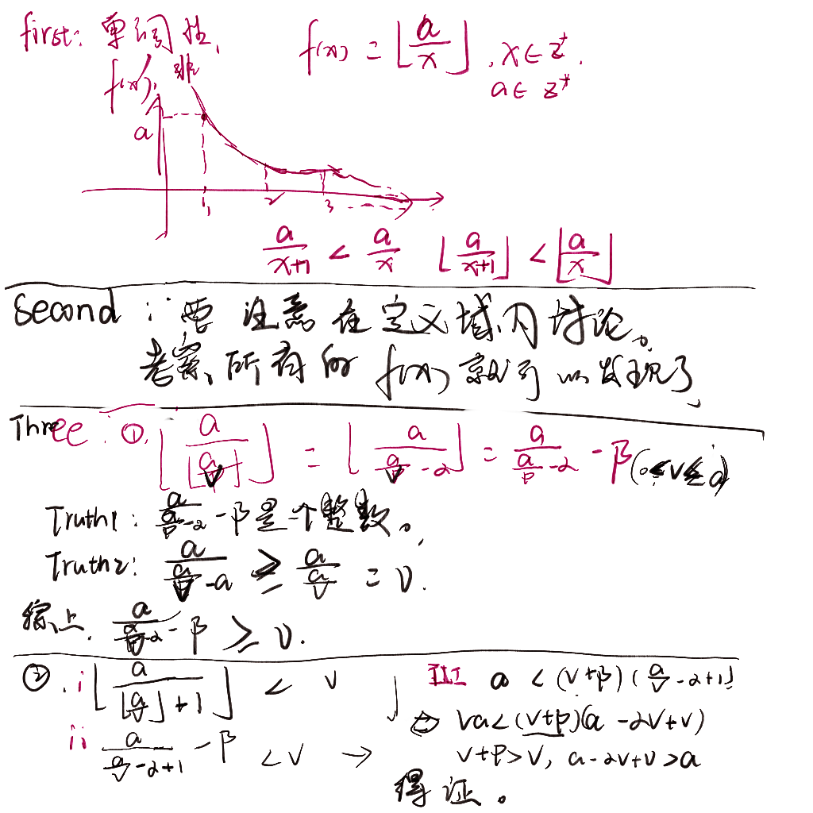

https://codeforces.com/contest/1706/problem/D1

给定一个数组$a_i$

构造一个正整数数组$P_i$，使得$max_{1<=i<=n}\left \lfloor \frac{a_i}{p_i} \right \rfloor -min_{i<=i<=n}\left \lfloor \frac{a_i}{p_i} \right \rfloor $最小。

数据量比较小，详见题目即可。


我们假设出一个目标状态，或者任意其它状态。当最小值确定之后，我们就使得最大值尽量小即可。所以解空间可以有一个很大的归纳。

##### one

首先是枚举最小值

很显然这个最小值的范围是 0...a[0]

##### two

我们追求让每一个$\left \lfloor \frac{a_i}{p_i} \right \rfloor$都接近最小值。

现在假设v就是最小值。有几个令人困惑的点：

1. 不总是可以构造出最小值。
   1. 不一定完全贴上。为了让它们尽量尽，这里有一些数学处理。这里是主要的生长点。
   2. ~~可能最小的情况无法达到比方说 3，1。~~（答案中的输入是升序的，所以必然可以达到，不会出现更小的情况。）

关于上面1.1的问题：

对于$\left \lfloor \frac{a_i}{p_i} \right \rfloor$快速计算$\left \lfloor \frac{a_i}{p_i} \right \rfloor>=v$的最小值。之前整除分块也遇到过相似的问题。

引一些和整除有关的结论：

1. 令$a_i,v是一个常数，且0<=v<=a_i,p=\left \lfloor \frac{a_i}{v} \right \rfloor$，集合$\left \{S/s\in S且s>=v且s= \left \lfloor \frac{a_i}{j} \right \rfloor(j\in[1,k])\right \} $

则$min(S)=\left \lfloor \frac{a_i}{min(p,k)} \right \rfloor$

##### 证明：

- $\left \lfloor \frac{a_i}{x} \right \rfloor,x\in Z*$s是一个单调函数。

- $\left \lfloor \frac{a_i}{min(p,k)} \right \rfloor$,属于S。
-  $\left \lfloor \frac{a_i}{p_i-1} \right \rfloor<v$


还有一点，就是该最小值不可达怎么办？

其结果是必然会被淘汰。

这是一种枚举可能解，优化枚举空间的思路。




#### code

```cpp
#include <bits/stdc++.h>
using namespace std;
typedef long long ll;
const int maxn = 2e5 + 10;

int a[maxn];

void solve()
{
    int n, k;
    cin >> n >> k;
    for (int i = 0; i < n; i++)
        cin >> a[i];
    int ans = 10000000;
    for (int v = 0; v <= a[0]; v++)
    {
        int mx = v;
        for (int i = 0; i < n; i++)
        {
            int p = min(k, (v ? (a[i] / v) : k));
            mx = max(mx, a[i] / p);
        }
        ans = min(ans, mx - v);
    }
    cout << ans << '\n';
}

int main()
{
    ios::sync_with_stdio(false);
    cin.tie(nullptr), cout.tie(nullptr);
    int t;
    cin >> t;
    while (t--)
        solve();
}
```

