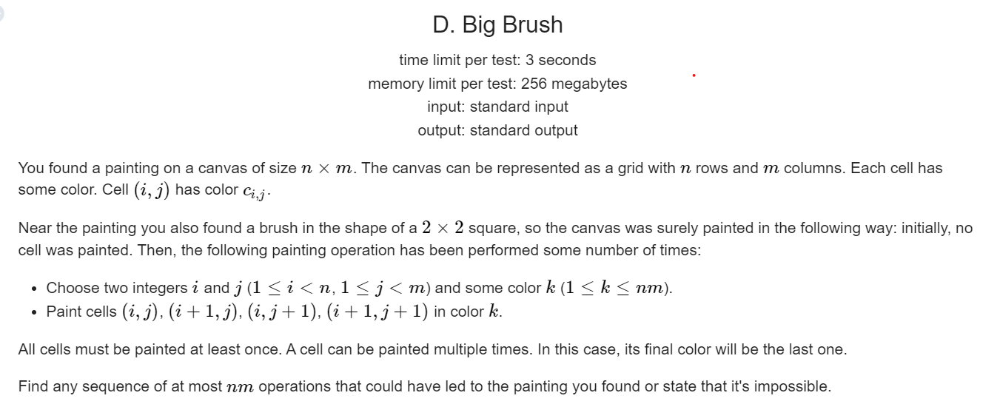

**D. Big Brush**

[Problem - D - Codeforces](https://codeforces.com/contest/1638/problem/D)



**solve**

覆盖问题中典型的逆向思维：
关注最终结果， 发现一些同色的块 ，则必然是之前该位置作为整体最后一次涂上颜色。
1. 如果当前块中同色的可以分成多个正方形块怎么办？
   1. 随便截取一块下来。最后一次有多种可能 ， 一个可行，无论其它方案怎么处理都可行。
2. 找出其中的若干几块正方形。之后 ， 怎么得到更进一步的正方形？
   1. 同色正方形中原来的颜色可以是任意的。处理完之后打上表示任意的标记。
   2. 然后通过任意标记的引入更新新的正方形即可。

如果最终没有办法将所有的块变成任意标记： 无解。
时间复杂度为$O(nm)$
#### 生长思考：
未解决问题： 上述的结论，一些细节未证如下： 
1. 对于同色块 ， 选择该步数先填哪一个效果是一致的。
2. 引入任意色的作用，想法。
**code**
```cpp
#include<bits/stdc++.h>
using namespace std;
using ll = long long;
using pii = pair<int, int>;
const int N = 1E3 + 10;
int a[N][N], cunt;
struct tt {
	int first;
	int second;
	int ch;
} ans[N * N];
int ch;
bool check(int x, int y) {
	set<int> rec;
	for (int i = 0; i < 2; i++)
		for (int j = 0; j < 2; j++) {
			rec.insert(a[x + i][y + j]);
		}
	ch = *(--rec.end());
	return (rec.size() == 1 && rec.count(-1) == 0) || (rec.size() == 2 && rec.count(-1));
}
void update(int x, int y) {
	for (int i = 0; i < 2; i++)
		for (int j = 0; j < 2; j++)
			a[x + i][y + j] = -1;
}
int main()
{
	ios::sync_with_stdio(false);
	cin.tie(0);

	int n, m; cin >> n >> m;
	for (int i = 1; i <= n; i++)
		for (int j = 1; j <= m; j++)
			cin >> a[i][j];
	for (int i = 1; i < n; i++)
		for (int j = 1; j < m; j++) {
			if (check(i, j)) {
				ans[cunt++] = {  i , j , ch};
				update(i, j);
			}
		}
	int low = 0;
	while (low < cunt) {
		int x = ans[low].first;
		int y = ans[low].second;
		for (int i = -1; i < 2; i++)
			for (int j = -1; j < 2; j++) {
				int tx = i + x, ty = j + y;
				if (tx >= 1 && tx < n && ty >= 1 && ty < m && check(tx, ty)) {
					ans[cunt++] = { tx , ty , ch};
					update(tx, ty);
				}
			}
		low++;
	}
	for (int i = 1; i <= n; i++)
		for (int j = 1; j <= m; j++) {
			if (a[i][j] != -1) {
				cout << -1 << '\n';
				return 0;
			}
		}
	cout << cunt << '\n';
	while (cunt) {
		--cunt;
		cout << ans[cunt].first << ' ' << ans[cunt].second << ' ' << ans[cunt].ch << '\n';
	}
}
```

