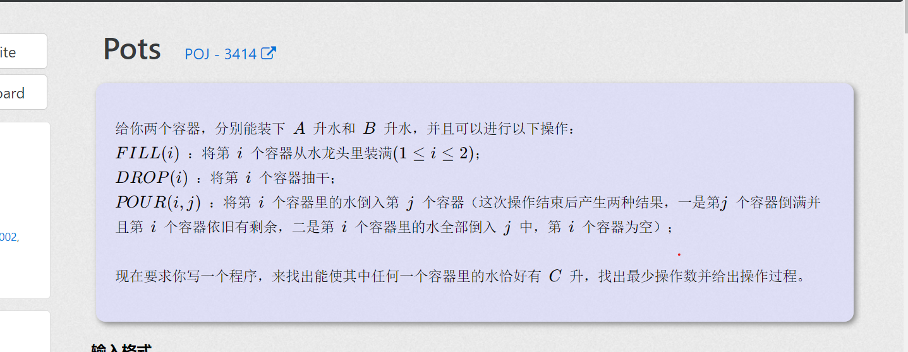

**Pots**

[Pots - POJ 3414 - Virtual Judge (csgrandeur.cn)](https://vjudge.csgrandeur.cn/problem/POJ-3414#author=0)

#### 简介：


#### solve

和非常可乐类似：
都是往容器里装水：于是关于转移方向是一样的。但是这里更多了一个要求， 求转移路径的。

1. 专门开一个pre数组记录上一次转移的状态的关键字即可。

#### code

```cpp
#include<iostream>
#include<queue>
#include<stack>
using namespace std;
const int N = 300;
const int inf = 1E9;
// 记录当前状态的上一个点。 记录上达到这一次操作的上一个操作。
struct node {
	int x, y; string op;
	node() {};
	node(int x_, int y_, const string& op_) {
		x = x_;
		y = y_;
		op = op_;
	};
} pre[N][N];
struct ttt {
	int x ,  y , sum;
	ttt() {};
	ttt(int x_ , int y_, int sum_) {
		x = x_;
		y = y_;
		sum = sum_;
	};
};
bool vis[N][N];

int main()
{
	ios::sync_with_stdio(false);
	cin.tie(0);
	int a , b , c;
	cin >> a >> b >> c;
	queue<ttt> que;
	vis[0][0] = true;
	stack<string> stk;
	que.push(ttt(0 , 0 , 0));
	int ans = inf;
	while (!que.empty()) {
		int x = 0 , y = 0;
		ttt t = que.front(); que.pop();
		//get our ans
		if (t.x == c || t.y == c) {
			x = t.x , y = t.y;
			ans = t.sum;
			while (x != 0 || y != 0) {
				stk.push(pre[x][y].op);
				int tx = pre[x][y].x;
				int ty = pre[x][y].y;
				x = tx , y = ty;
			}
			break;
		}
		//转移：
		//1. 把1倒满。
		int sum = t.sum;
		if (!vis[a][t.y]) {
			x = a , y = t.y;
			que.push(ttt(x , y , sum + 1));
			vis[x][y] = true;
			pre[x][y] = node(t.x , t.y , "FILL(1)");
		}
		//把2给倒满
		if (!vis[t.x][b]) {
			x = t.x , y = b;
			que.push(ttt(x , y , sum + 1));
			vis[x][y] = true;
			pre[x][y] = node (t.x , t.y , "FILL(2)");
		}
		//把1抽空
		if (vis[0][t.y] == false) {
			x = 0 , y = t.y;
			que.push(ttt(x , y , sum + 1));
			vis[x][y] = true;
			pre[x][y] = node(t.x , t.y , "DROP(1)");
		}
		//把2给抽空。
		if (vis[t.x][0] == false) {
			x = t.x , y = 0;
			que.push(ttt(x , y , sum + 1));
			vis[x][y] = true;
			pre[x][y] = node(t.x , t.y , "DROP(2)");
		}
		//1 -> 2 ， 并且2满。
		if (t.x >= b - t.y) {
			x = t.x - (b - t.y);
			y = b;
			if (vis[x][y] == false) {
				que.push(ttt(x , y , sum + 1));
				vis[x][y] = true;
				pre[x][y] = node(t.x , t.y , "POUR(1,2)");
			}
		}
		//与上面相反
		if (t.x < b - t.y) {
			x = 0;
			y = t.y + t.x;
			if (vis[x][y] == false) {
				que.push(ttt(x , y , sum + 1));
				vis[x][y] = true;
				pre[x][y] = node(t.x , t.y , "POUR(1,2)");
			}
		}
		// 2 -> 1
		if (t.y >= a - t.x) {
			x = a;
			y = t.y - (a - t.x);
			if (vis[x][y] == false) {
				que.push(ttt(x , y , sum + 1));
				vis[x][y] = true;
				pre[x][y] = node(t.x , t.y , "POUR(2,1)");
			}
		}
		if (t.y < a - t.x) {
			x = t.x + t.y;
			y = 0;
			if (vis[x][y] == false) {
				que.push(ttt(x , y , sum + 1));
				vis[x][y] = true;
				pre[x][y] = node(t.x , t.y , "POUR(2,1)");
			}
		}
	}
	if (ans == inf) {
		cout << "impossible\n";
		return 0;
	}
	cout << ans << '\n';
	while (stk.empty() == false) {
		string s = stk.top();
		stk.pop();
		cout << s << '\n';
	}
}
/* stuff you should look for
* int overflow, array bounds
* special cases (n=1?)
* do smth instead of nothing and stay organized
* WRITE STUFF DOWN
* DON'T GET STUCK ON ONE APPROACH
*/
```

