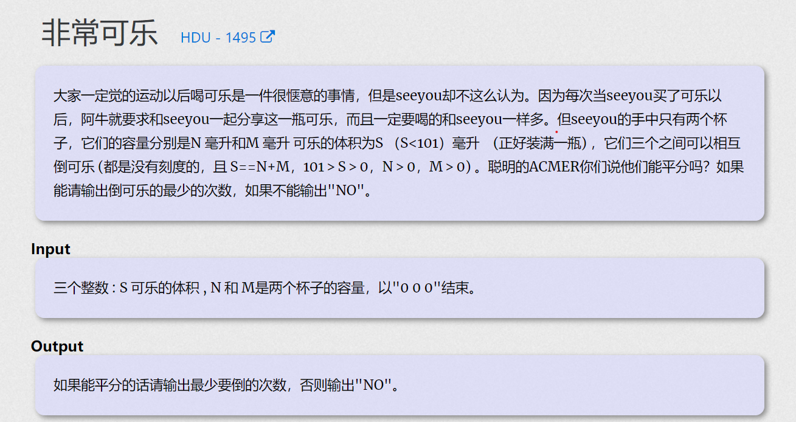

**非常可乐**

[非常可乐 - HDU 1495 - Virtual Judge (csgrandeur.cn)](https://vjudge.csgrandeur.cn/problem/HDU-1495)

https://vjudge.csgrandeur.cn/problem/HDU-1495/origin

[非常可乐 - HDU 1495 - Virtual Judge (csgrandeur.cn)](https://vjudge.csgrandeur.cn/problem/HDU-1495)

#### 简介：



#### 20mins

探究可能出现的各种行为：

1. fi   ->  se ， se被倒满。
2. fi   -> se ,      fi倒空。
枚举第一个杯子到第二个杯子，上述两种情况。一共有12种可能

#### code
```cpp
#include<bits/stdc++.h>
using namespace std;
using ll = long long;

const int N = 200;
const int inf = 1E9;
bool vis[N][N][N];

struct node {
	int a;
	int b;
	int c;
	int now;
};

int main()
{
	ios::sync_with_stdio(false);
	cin.tie(0);
	int s , n , m;
	while (true) {
		cin >> s >> n >> m;
		if (s == 0 && n == 0 && m == 0) {
			break;
		}

		if (s % 2) {cout << "NO\n"; continue;}
		for (int i = 0 ; i <= s; i++)
			for (int j = 0 ; j <= n ; j++)
				for (int k = 0; k <= m; k++)
					vis[i][j][k] = false;

		//然后开始bfs搜索。
		queue<node> que;
		que.push({s, 0 , 0 , 0});
		int ans = inf;
		while (que.empty() == false) {
			node t = que.front(); que.pop();
			int a = t.a , b = t.b , c = t.c , now = t.now;
			if (a == b + c || c == a + b || b == a + c) {
				int t = 0;
				if (a == s / 2)t++;
				if (b == s / 2) t++;
				if (c == s / 2)t++;
				if (t == 2) {
					ans = now;
				} else ans = now + 1;
				break;
			}
			//然后就是一堆分类讨论：
			int ta = a, tb = b, tc = c, tn = now + 1;
			//a - > b; 1 (b满)
			if (a >= n - b) {
				ta = a - (n - b);
				tb = n;
				tc = c;
				if (vis[ta][tb][tc] == false) {
					vis[ta][tb][tc] = true;
					que.push({ta , tb , tc , tn});
				}
			}
			// a - > b a空
			if (a <= n - b) {
				ta = 0;
				tb = b + a;
				tc = c;
				if (vis[ta][tb][tc] == false) {
					vis[ta][tb][tc] = true;
					que.push({ta , tb , tc , tn});
				}
			}
			//a - > c c满
			if (a >= m - c) {
				ta = a - (m - c);
				tb = b;
				tc = m;
				if (vis[ta][tb][tc] == false) {
					vis[ta][tb][tc] = true;
					que.push({ta , tb , tc , tn});
				}
			}
			// a - > c a空
			if (a <= m - c) {
				ta = 0;
				tb = b;
				tc = c + a;
				if (vis[ta][tb][tc] == false) {
					vis[ta][tb][tc] = true;
					que.push({ta , tb , tc , tn});
				}
			}

			// b - > a a满；
			if (b >= s - a) {
				ta = s;
				tb = b - (s - a);
				tc = c;
				if (vis[ta][tb][tc] == false) {
					vis[ta][tb][tc] = true;
					que.push({ta , tb , tc , tn});
				}
			}
			// b - > a b空
			if (b <= s - a) {
				ta = a + b;
				tb = 0;
				tc = c;
				if (vis[ta][tb][tc] == false) {
					vis[ta][tb][tc] = true;
					que.push({ta , tb , tc , tn});
				}
			}
			//b - > c c满
			if (b >= m - c) {
				ta = a;
				tb = b - (m - c);
				tc = m;
				if (vis[ta][tb][tc] == false) {
					vis[ta][tb][tc] = true;
					que.push({ta , tb , tc , tn});
				}
			}
			// b -> c b空
			if (b <= m - c) {
				ta = a;
				tb = 0;
				tc = c + b;
				if (vis[ta][tb][tc] == false) {
					vis[ta][tb][tc] = true;
					que.push({ta , tb , tc , tn});
				}
			}

			//////
			// c - > a a满；
			if (c >= s - a) {
				ta = s;
				tb = b;
				tc = c - (s - a);
				if (vis[ta][tb][tc] == false) {
					vis[ta][tb][tc] = true;
					que.push({ta , tb , tc , tn});
				}
			}
			// c - > a c空
			if (c <= s - a) {
				ta = a + c;
				tb = b;
				tc = 0;
				if (vis[ta][tb][tc] == false) {
					vis[ta][tb][tc] = true;
					que.push({ta , tb , tc , tn});
				}
			}
			//c - > b b满
			if (c >= n - b) {
				ta = a;
				tb = n;
				tc = c - (n - b);

				if (vis[ta][tb][tc] == false) {
					vis[ta][tb][tc] = true;
					que.push({ta , tb , tc , tn});
				}
			}
			// c -> b c空
			if (c <= n - b) {
				ta = a;
				tb = b + c;
				tc = 0;
				if (vis[ta][tb][tc] == false) {
					vis[ta][tb][tc] = true;
					que.push({ta , tb , tc , tn});
				}
			}
		}
		if (ans != inf) {
			cout << ans << '\n';
		} else {
			cout << "NO\n";
		}
	}
}
```

~~有一个特殊处理， 需要刚好分成两杯？不理解~~
