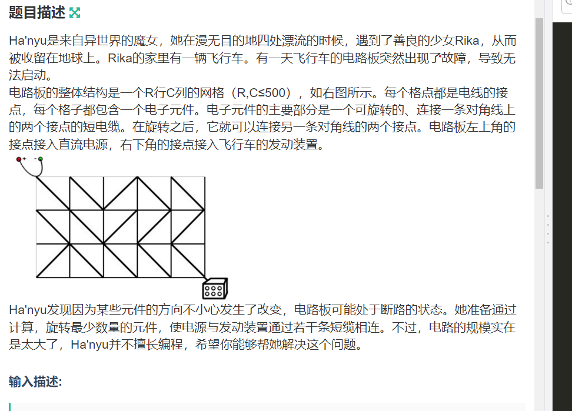
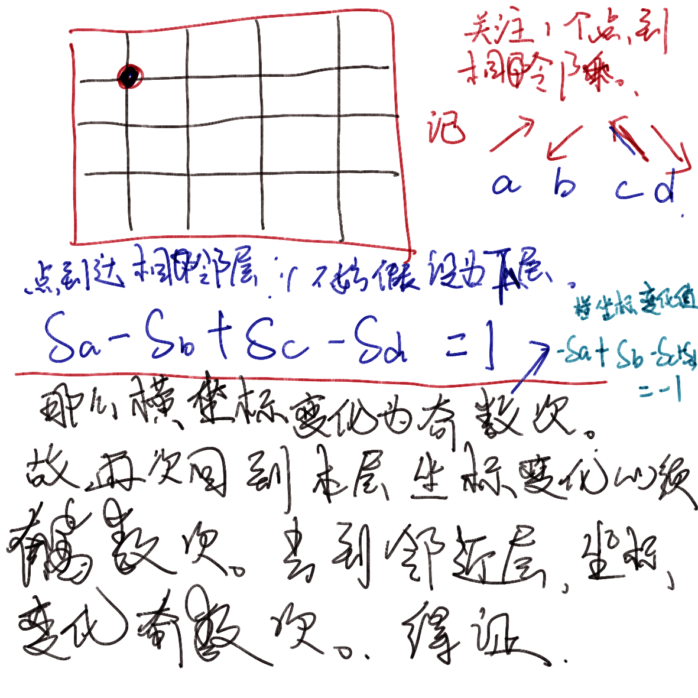

**电路维修**

[A-电路维修_0x26 搜索-广搜变形 (nowcoder.com)](https://ac.nowcoder.com/acm/contest/1018/A)



#### solve

1. 将问题转换为图上为题。

   1. 对于每个横竖线交叉点抽象为点。
   2. 如果初始电缆连接了两点，就建立权为0的边否则建立权为1的边。

   于是问题转变成寻找由（0 ， 0）到（n， m)的最短路径。

一个一疑惑：对于一个子图，是否其中的所有路径都合法（不存在回路）。可以映射到一个具体的方案，并且一个格子里面的电缆只有一种摆放方式，不产生矛盾。

1. 只要证明一个格子中的两个点不共存在一张图中即可。

----------





-------------

定义状态：队列维护的枚举状态， 从起点到（x , y）点的最短距离。

类似于广度搜索：

1. 从起点开始搜索。
   1. 第一次发现某一个点时。
      1. 如果边权为1.待定。这可能是次解，但是更新d ， 同时入队尾（此时依然保持单调性。）
      2. 如果边权为0,待定， 就及时更新答案。
2. 从队头取出状态的过程中 ，要判断当前状态是否为已知最优。状态设计中还要加入一维表示得到该状态的最小转移次数。

建图方法：格子与对每个格子进行思边的发散，建立边。


#### code

```cpp
#include<bits/stdc++.h>
using namespace std;
typedef long long ll;
typedef pair<int , int> pii;
#define fi first
#define se second

const int oo = 0x0fffffff;
const int N = 510 + 10;


char s[N][N];
int d[N][N];
bool sure[N][N];

int dx[4] = { - 1,  1 , -1, 1} , dy[4] = { -1 , - 1 , 1 , 1};
struct node {
	int x , y , w;
};
vector<node> g[N][N];


void work(int testNo)
{
	int r , c ; cin >> r >> c;
	for (int i = 0; i <= r; i++)
		for (int j = 0; j <= c; j++) {
			d[i][j] = oo;
			sure[i][j] = false;
			g[i][j].clear();
		}
	for (int i = 1; i <= r; i++)
		cin >> (s[i] + 1);
	function<void(int, int , int , int , int)> add = [&](int x , int y , int z , int k , int w) {
		g[x][y].push_back({z , k , w});
	};
	for (int i = 1; i <= r; i++)
		for (int j = 1; j <= c; j++) {
			if (s[i][j] == '/') {
				add(i , j , i - 1 , j - 1 , 1);
				add(i - 1 , j - 1 , i , j  , 1);
				add(i , j - 1 , i - 1 , j , 0);
				add( i - 1 , j , i  , j - 1 , 0);

			} else {
				add(i , j , i - 1 , j - 1 , 0);
				add(i - 1 , j - 1 , i , j  , 0);
				add(i , j - 1 , i - 1 , j , 1);
				add( i - 1 , j , i  , j - 1 , 1);
			}
		}
	deque<pair<int , int>> que;
	que.push_back({0 , 0});
	d[0][0] = 0;
	while (que.empty() == false) {
		auto f = que.front(); que.pop_front();
		if (sure[f.fi][f.se])continue;
		sure[f.fi][f.se] = true;
		for (auto t : g[f.fi][f.se]) {
			if (sure[t.x][t.y])continue;
			if (t.w ) {
				if (d[t.x][t.y] > d[f.fi][f.se] + 1) {
					d[t.x][t.y] = d[f.fi][f.se] + 1;
					que.push_back({t.x , t.y});
				}
			} else {
				if (d[t.x][t.y] > d[f.fi][f.se]) {
					d[t.x][t.y] = d[f.fi][f.se];
					que.push_front({t.x , t.y});
				}
			}
		}
	}
	if (d[r][c] >= oo) {
		cout << "NO SOLUTION\n";
	} else {
		cout << d[r][c] << '\n';
	}
}


int main()
{
	ios::sync_with_stdio(false);
	cin.tie(0);

	int t; cin >> t;
	for (int i = 1; i <= t; i++)work(i);
}

/* stuff you should look for
* int overflow, array bounds
* special cases (n=1?)
* do smth instead of nothing and stay organized
* WRITE STUFF DOWN
* DON'T GET STUCK ON ONE APPROACH
*/
```

