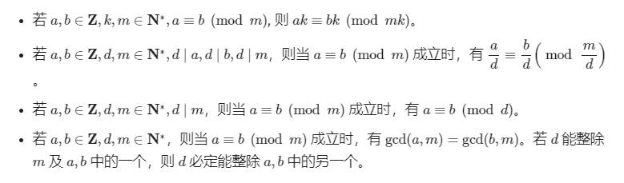

#### 同余

##### 符号表示

$a\equiv b(mod\quad p)$(同余式)

定义什么直接看oiwiki

[oiwiki内容](https://oi-wiki.org/math/number-theory/basic/)

##### 性质：

（只关注了线性运算）

1. 线性运算。

若$a\equiv b(mod\quad p),c\equiv d(mod \quad p)$

- $a\pm c\equiv b\pm d(mod \quad p)$

- $a\times c\equiv b\times d(mod \quad p)$

 [乘法逆元.md](乘法逆元.md) 