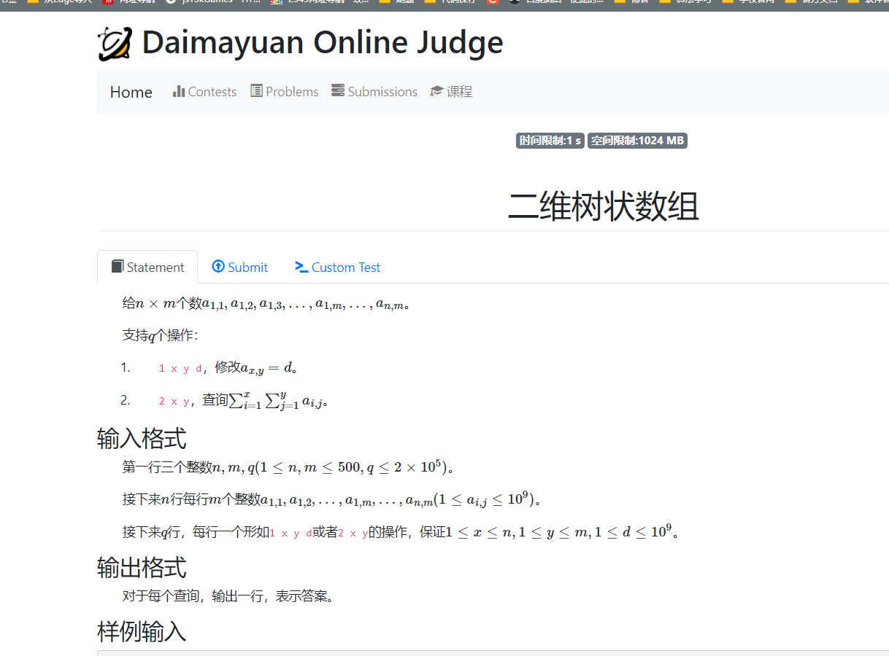

```cpp
#include<bits/stdc++.h>
using namespace std;
using ll = long long;

const int N = 5E2 + 10;

int a[N][N];
int n, m, q;

ll c[N][N];

void modify(int x , int y , ll d)
{
	for (int i = x; i <= n; i += i & -i)
		for (int j = y; j <= m ; j += j & -j)
			c[i][j] += d;
}

ll query (int x , int y)
{
	ll res = 0;
	for (int i = x; i ; i -= i & -i)
		for (int j = y; j ; j -= j & -j)
			res += c[i][j];
	return res;
}

int main()
{
	ios::sync_with_stdio(false);
	cin.tie(0);

	cin >> n >> m >> q;
	for (int i = 1; i <= n; i++)
		for (int j = 1; j <= m; j++)
		{
			cin >> a[i][j];
			modify(i, j, a[i][j]);
		}

	while (q--)
	{
		int choice;
		cin >> choice;
		if (choice == 1)
		{
			int x , y;
			ll d;
			cin >> x >> y >> d;
			modify( x , y , d - a[x][y]);
			a[x][y] = d;
		}
		else
		{
			int x , y;
			cin >> x >> y;
			cout << query(x , y) << '\n';
		}
	}

}

/* stuff you should look for
* int overflow, array bounds
* special cases (n=1?)
* do smth instead of nothing and stay organized
* WRITE STUFF DOWN
* DON'T GET STUCK ON ONE APPROACH
*/
```

