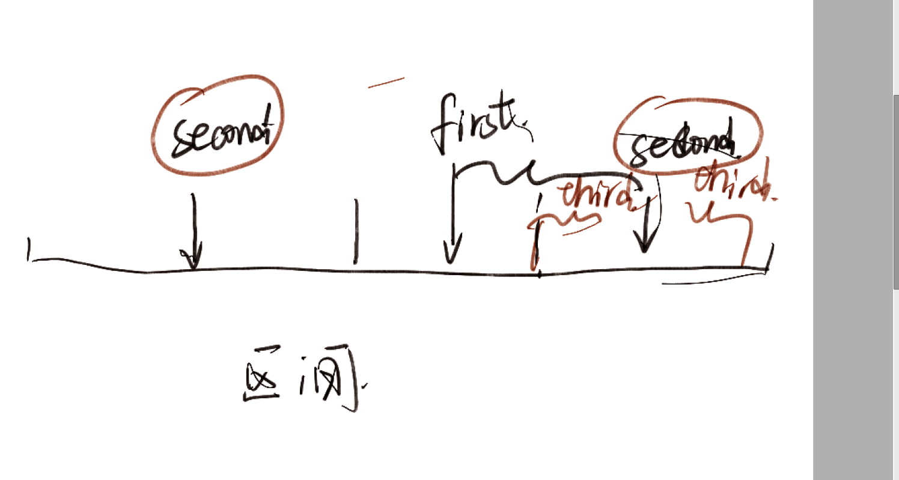

#### $first$ 树状数组1

简单维护区间求和等等问题。

就是套一个板子上去。

#### $second $逆序对2

对于一个排列，求多少个逆序对。

##### 思想

##### 扫描线的思想（类似扫描线思想

从小进行一个遍历。不断扫描，用一个数据结构维护前面的D的信息可以快速查询有多少个大于当前的数。 可以用一个数组D来记录。某一个数字是否出现过。然后不断维护后缀和即可。

其实用平衡树维护，也可以快速地实现查询操作。

##### 静态问题转换成动态问题。动态问题转换成静态问题。

就是这样一遍扫过去，同时计算贡献

#### $third$ 树状数组2

利用树状数组维护区间加的操作。

##### 原理

差分思想： 

1. 对数组求差分，可以利用差分数组还原出数组，并进一步求出数组的和。虽然计算量会变得更庞大，但是计算机可以接受这种两倍的计算量。
2. 差分，优势就是可以将区间加转换成单点修改问题。对于涉及的差分量而言，最终其实就只有一个量发生变化。更容易维护，比方说，修改[ l , r ]最终只需要改变d[l],d[r+1] 。它的优点是非常容易维护

相关推导如下：

$1.定义：d_1=a[1]， d_i=a_i-a_{i-1}$

$2.求出一个元素：a_x=\sum_{i=1}^{x}d_i $

$3.求和：$
$$
sum(x)=a_1+...a_x\\
=d_1+(d_1+d_2)+(d_1+d_2+....+d_x)\\
=\sum_{i=1}^{x}(x+1-i)*d_i\\
=(x+1)\times\sum_{i=1}^{x}d_i-\sum_{i=1}^{x}i*d_i
$$


我们维护两个数组。一个是$d_i$，另外一个是$i*d_{i}$


##### 一些思想启发：

- 利用模板封装好树状数组。这样就可以方便的管理两个数组。不用定义太多的名称。


#### 树状数组二分

维护一段区间的前缀和。保证每一个元素都大于0。查询第一个sum[t]>=t的元素。由于存在单调性，可以通过二分查询。但是复杂度是两个log。

##### 改进方法

在多次二分的过程中，一些c[i]不断地被重复访问。有一种非常神奇地访问方法。

同样，是由大区间到小区间不断定位地枚举思想。

$j=\left \lceil log(n) \right \rceil ,初始化pos=0$

先看（1<<pos）如果大于n。那么前移

否则查看当前$c[pos+(1<<j)]$是否大于check.

$c[pos+(1<<j)]$实际上存储了 1......pos'的内容。

如果发现大于。答案必然包含这个区间。

否则说明区间更少，去寻找细度更小的区间。

比方说

$[10100]_2=n$

check（x).应为 $[01111]$

第一次检查

[100000]发现该区间大于n。不符合定义，接着往下看。

[10000]小于n但是$curentSum+c[pos']>x$

所以应该看细度更小的区间

$[1000]$满足上述两个条件$pos'<n且curentSum<x$

pos=pos'=[1000]

继续向下看紧紧贴着的区间。



一直评接。然后迟早拼凑出来

#### code如下：

```cpp
//找到满足sum[i]<=x的边界。
int query(ll x) {
	int pos = 0;
	ll  t = 0;
	//18对应5e5
	//19对应1e6
	for (int i = 18; i >= 0; i--) {
		//t的水平一直是小于等于x的关系。
		if (pos + (1 << i) <= n && t + c[pos + (1 << i)] <= x) {
			pos += (1 << i);
			t += c[pos];
		}
	}
	// cout << pos << '\n';
	return pos;
}
```

注意，这里找到的是，最大的满足sum<=x的position.


