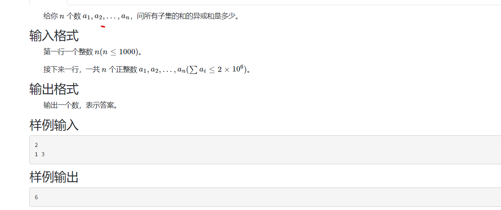
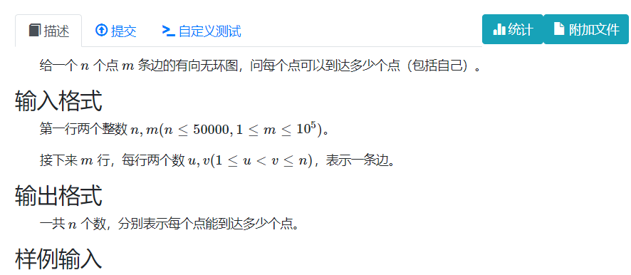
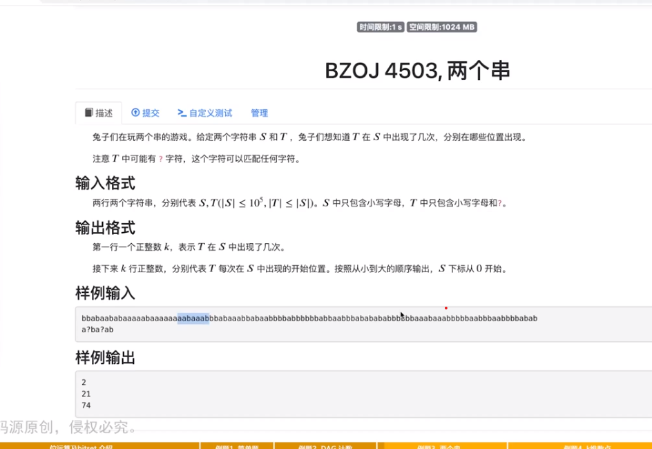
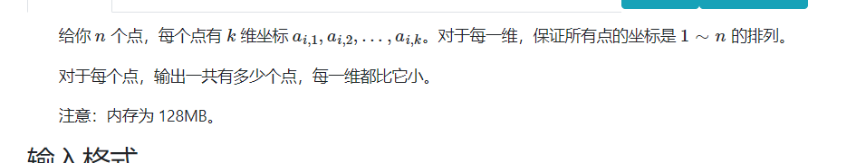
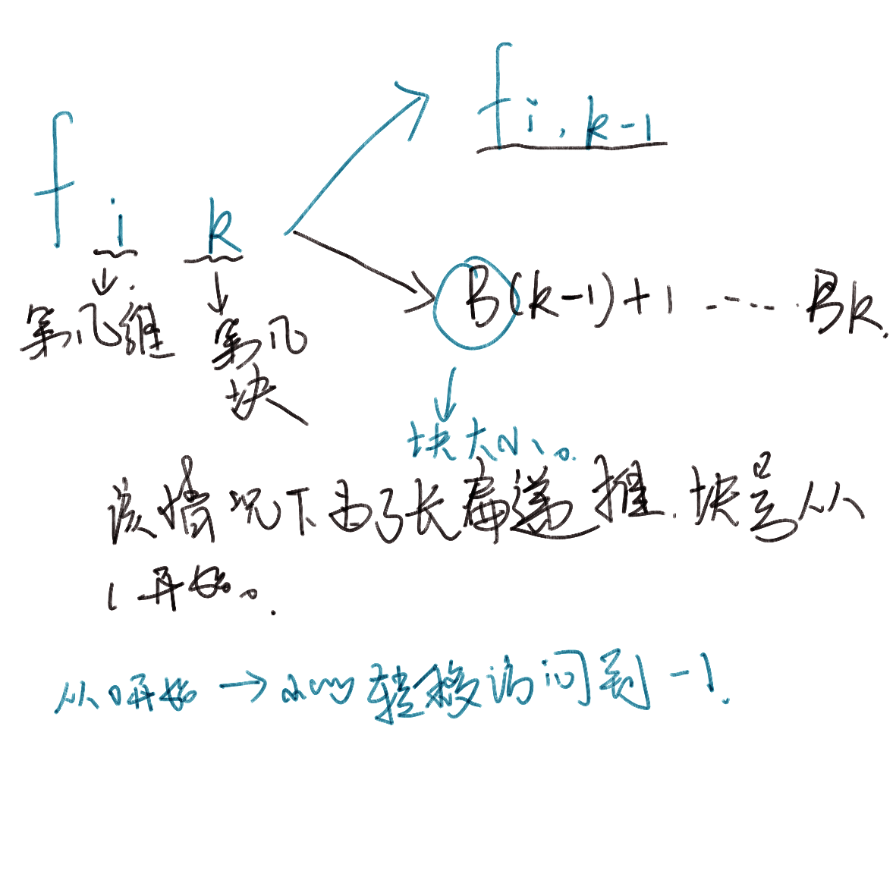

## **bitset**

四个函数： [库中算法函数使用.md](..\..\..\programming language\C++&&C\basic of lanuge\库中算法函数使用.md) 

bitset基础函数博客：

 [stl.md](..\..\..\programming language\C++&&C\basic of lanuge\stl\stl.md) 

#### 原理：

将 unsigned long long组合起来 。将其每一个比特位看作一个独立的整体 ， 有效利用空间表达简单的信息：

#### 作用：

1. 省内存， 有效利用比特位保存信息。
2. 常数优化。和普通暴力相比，复杂度除个64 ， 32等。

#### 使用 ， 接口 ， 细节。

1. bitset定长：
2. `bitset<1000>a` 定义
3. `a[1]` 访问该位，获取当前位上修改权限。

**统计函数**

1. `a.any()`是否全是0.
2. `a.node()`是否全是1。

**运算函数**

1. 常见的位运算。
2. `a.set()`把所有位变成1.
3. `a.set(1)`把第一位变成1.
4. `a.reset()`同上。
5. `a.reset(1)`
6. `_Find_first , _Find_net`

**打印**

1. `to_string()`

**特殊使用**

`bitset<1024> a;`

` auto p = (ull*) &a;`

 `cout << p[0] << p[1] << endl; `


#### 课程problems

一般解决的问题：

1. 怎么压位？
2. 将问题模型转换成一个bitset上优化的模型。

**[BZOJ 3687, 简单题 - 题目 - Daimayuan Online Judge](http://oj.daimayuan.top/course/30/problem/1279)**



### solve

关注亦或和的运算性质 ， 关注奇偶性。

**dp状态设计**

$dp_{i , j}$前i个数 ， 和为j的方案的奇偶性。

**状态转移**

$dp_{i , j}= dp_{i - 1 , j } \quad^ {\wedge}\quad dp_{i - 1 , j - x}$

**初始化**

$dp_{0 , 0} = 1$

#### 实现：

1. 一般角度： 正常转移复杂度为 2E9。

   1. 枚举前段的每一种和 ， 进行转移。
   2. 枚举数字。

2. bitset优化；

   *现象*

   1. 关注到每一个状态只有两种属性。
   2. 连续范围之内的一个点对点位运算。

#### code

```cpp
int n;
bitset<2000001> f;
int main() {
	ios::sync_with_stdio(false);
	cin.tie(0);
	cin >> n;
	f[0] = 1;
	for (int i = 0; i < n; i++) {
		int x; cin >> x;
		f = f ^ (f << x);
	}
	int ans = 0;
	for (int i = 0; i < 2000001; i++) {
		if (f[i])ans ^= i;
	}
	cout << ans << '\n';
}
```

### **DAG 计数**

[DAG 计数 - 题目 - Daimayuan Online Judge](http://oj.daimayuan.top/course/30/problem/1281)



#### solve

按照输入风格，点的标号已经可以作为拓扑序。

#### code

```cpp
#include<bits/stdc++.h>
using namespace std;
using ll = long long;
const int N = 5E4 + 10;
bitset<N> f[N];
vector<int> g[N];
int main(){
	ios::sync_with_stdio(false);
	cin.tie(0);
	int n , m;
	cin >> n >> m;
	for (int i = 1; i <= m; i++) {
		int u , v;
		cin >> u >> v;
		g[u].push_back(v);
	}
	for (int i = n; i >= 1; i--) {
		f[i][i] = 1;
		for (auto v : g[i]) {
			f[i] |= f[v];
		}
	}
	for (int i = 1; i <= n; i++) {
		cout << f[i].count() << '\n';
	}
}
```

**三元组计数问题**

记录下所有点与其它点的可达情况之后。枚举两个点.

`ans += (g[u] & g[v]).count()`

注意方案重贡献两次，最终结果要除3.

**转递闭包**

其实就是求出每个点的可达性。

1. 如果没有回路利用拓扑序dp。

2. 类似弗洛伊德的思想：

   `	for(int k = 1;k <= n; k++){`

   `	for(int i = 1; i <= n; i++)`

   `	if (g[i][k])`

   `g[i] |= g[k];`

   `}`

2更好写。


### 两个串



**通配符匹配问题**

有几种解决思路： fft  ， bitset


**下面是bitset的解决思路：**

观察出下列现象：
对于最简单类型的01匹配，可以直接取出一段运算。
字符串匹配有类似的性质。不同点在于字符的位上的种数有27种。

枚举t串中的字符。每一次枚举，筛除掉一部分字符位置，剩下位置对应的字符串对于枚举过的t[i]是匹配的。全部枚举完成之后，留下来的解就是所有解的全集了。（筛法思想。）

对于枚举t上的字符,快速筛掉不匹配的位置。这点可以使用bitset优化。

1. `bitset g[i][j]`表示对应char(i + 'a') ； 第j位上如果为1表示s串中对应的字符就是（i+ ’a‘）;

2. 枚举t串上的i位时，如果s的j位上不为枚举字符。那么j - i不可能为匹配串的首部。该过程可以看作g[j]和 f[j - i]

   的且运算。

```cpp
#include<bits/stdc++.h>
using namespace std;
using ll = long long;
const int N = 1E5 + 1;
bitset<N> f;
bitset<N> g[28];
int main(){
	ios::sync_with_stdio(false);
	cin.tie(0);
	string s , t;
	cin >> s >> t;
	int n = s.size() , m = t.size();
	for (int i = 0; i < n; i++) {
		g[s[i] - 'a'][i] = 1;
	}
	for (int i = 0; i <= n - m; i++)
		f[i] = 1;
	for (int i = 0; i < m; i++) {
		if (t[i] == '?')continue;
		f &= g[t[i] - 'a'] >> i;
	}
	cout << f.count() << "\n";
	for (int i = 0; i < n ; i++) {
		if (f[i]) cout << i << '\n';
	}
}
```


### k维数点




#### solve

直接暴力： 枚举$O(n^2\times k)$
换个角度， 预处理一些集合。从简单枚举变成集合的交集。

预处理 bitset$g_{i , j }$ ， 表示第i维小于j 的点的集合。

于是求集合的过程中，就是每一求出每一维度满足条件的集合，的交集。扫描过程中，交集同时用一个f维护即可。

**其它问题**
空间花销过大 ， 可能会被卡空间：

----------
开一个g：
$5\times(5 \times 10^4 )^2$

1.25 * 10 ^10

直接炸

----------

**卡空间的处理方法**

使用分块的处理方法。对于某维度上只处理B ， 2B  ， 3B ..... n / B *B 大小的集合。对剩下的一小块 ， 暴力枚举处理即可。

**预处理的方法：**



```cpp
#include<bits/stdc++.h>
using namespace std;
using ll = long long;
const int N = 5E4 + 10;
const int B = 250;
int a[N][10];
int pos[10][N];
//表示第几维 ， 大小小于等于N的集合情况。
bitset<N> f[10][N / B + 10] , ans , s;
int main()
{
	ios::sync_with_stdio(false);
	cin.tie(0);

	int n , k; cin >> n >> k;
	for (int i = 1; i <= n; i++) {
		for (int j = 0; j < k; j++) {
			cin >> a[i][j];
			pos[j][a[i][j]] = i;
		}
	}
	//预处理。
	for (int i = 0; i < k; i++) {
		for (int j = B; j <= n; j += B) {
			f[i][j / B] = f[i][j / B  - 1];
			for (int l = 0; l < B; l++) {
				f[i][j / B][pos[i][j - l]] = 1;
			}
		}
	}
	//进行几项重要的预处理。
	//分块中的一些细节处理：
	// 对于一个具体的位置pos应该投射到具体的第几块？
	// 管理分块标记。
	//求并集交集 ， 补集。
	for (int i = 1; i <= n; i++) {
		ans.set();
		for (int j = 0; j < k; j++) {
			s = f[j][a[i][j] / B];
			for (int l = a[i][j] / B * B + 1; l <= a[i][j]; l++) {
				s[pos[j][l]] = 1;
			}
			ans &= s;
		}
		cout << ans.count() - 1 << '\n';
	}
}
```


