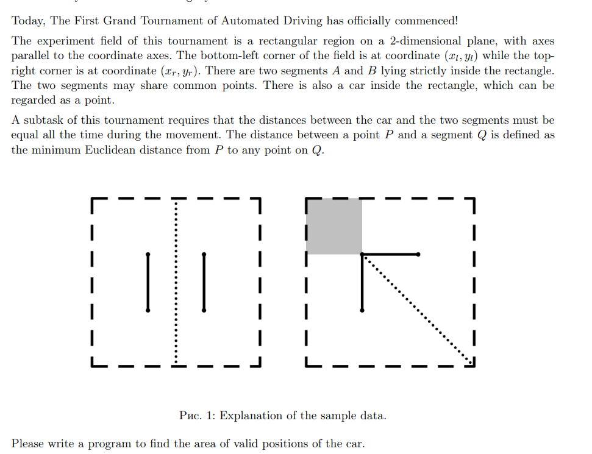

# 多边形——中级课课程解题报告
## HNOI2007, 最小矩形覆盖
http://oj.daimayuan.top/course/30/problem/1208
给定一些点的坐标，要求求能够覆盖所有点的最小面积的矩形，输出所求矩形的面积和四个顶点坐标。

### solve

**分析一个显然的解空间的枚举方式：**
显然只需要关注这些点的凸包：
枚举一条边的角度。矩形的其它边也就确定了。
**观察一些现象：**
最优的方案总有一个特征：矩阵上的一条边总是和凸包上的一条边重合的。于是大程度减少直线斜率的枚举规模。
**每次枚举一个边的方向时 ，怎么进一步确定其它方向的边？**
对于一种情形下，快速确定边界的方法是，通过点积的大小判断：
点积最大与最小分别组成了左右边界。通过叉积来判断上边界

但是如果朴素的枚举然后，寻找边界。显然复杂度是不允许的。

**怎么快速的定位左右边界？**

发现按顺序的枚举边，其余两个边界，也是微小变化的。可能发生的变化仅限于，边界点变成逆时针的下一个顶点。

这个和旋转卡壳的思想很相似。一个枚举资源下，计算这些资源中的某些本质属性，要有一定量的花费。但是我们可以从临近的资源中的结果，得到答案。

**实现：**

1. 求出凸包：
2. 找到一个扫描的起点。一般初始选择边为$P_{0 , 1}$
   1. 初始状态下： L， R， U。分别表示几个方向上的一个分割的点的代表。
3. 上述L ， R， U， D确定之后 ， 进一步计算和矩形的相关的属性： 面积以及端点。

**确定两条边的长度：**
-1693586871207-1.png)
从而确定了面积。 接下来确定四个端点：
确定四个顶点，只需要确定四条对应的直线。然后使用使用封装好的函数即可。


同理使用类似的定位思想，就可以确定其它点，以及直线。

**tips:**

远古题中，没有special judge。 会导致-0.00000被判别错误。如果到时候一直wa。要注意取是否和0.0000接近重合。如果是则取一个绝对值。

### code

```cpp
#include<bits/stdc++.h>

using namespace std;

using ll = long long;
using db = double;

const double EPS = 1E-9;

inline int sign(db a) {return a < -EPS ? -1 : a > EPS;}
inline int cmp(db a , db b) {return sign(a - b);}

struct P {
	db x , y;
	P() {}
	P(db x_ , db y_) : x(x_) , y(y_) {}

	P operator+(P p) {
		return {x + p.x , y + p.y};
	}
	P operator-(P p) {
		return {x - p.x , y - p.y};
	}
	P operator*(db d) {
		return {x * d , y * d};
	}
	P operator/(db d) {
		return {x / d , y / d};
	}
	bool operator<(P p) const {
		int c = cmp(y , p.y);
		if (c) return c == -1;
		return cmp(x , p.x) == -1;
	}
	db dot(P p) {
		return x * p.x + y * p.y;
	}
	db det(P p) {
		return x * p.y - y * p.x;
	}
	P rot90() {
		return P(-y , x);
	}
	db abs() {return sqrt(abs2());}
	db abs2() {return x * x + y * y;}
};
#define cross(p1 , p2 , p3) ((p2.x - p1.x) * (p3.y - p1.y) - (p3.x - p1.x) * (p2.y - p1.y))
#define crossOp(p1 , p2 , p3) sign(cross(p1 , p2 , p3))

P isLL(P p1 , P p2 , P q1 , P q2) {
	db a1 = cross(q1 , q2 , p1) , a2 = -cross(q1 , q2 , p2);
	return (p1 * a2 + p2 * a1) / (a1 + a2);
}

vector<P> convexHul(vector<P> ps) {
	int n = ps.size(); if (n <= 1) return ps;
	sort(ps.begin() , ps.end());
	vector<P> qs(2 * n); int k = 0;
	for (int i = 0; i < n; qs[k++] = ps[i++])
		while (k > 1 && crossOp(qs[k - 2] , qs[k - 1] , ps[i]) <= 0)--k;
	for (int i = n - 2 , t = k; i >= 0; qs[k++] = ps[i--])
		while (k > t && crossOp(qs[k - 2] , qs[k - 1] , ps[i]) <= 0) --k;
	qs.resize(k - 1);
	return qs;
}


int main() {
	// ios::sync_with_stdio(false);
	// cin.tie(0);
	int n;
	// cin >> n;
	scanf("%d" , &n);
	vector<P> p(n);
	for (int i = 0; i < n; i++) {
		// cin >> p[i].x >> p[i].y;
		scanf("%lf%lf" , &p[i].x , &p[i].y);
	}
	/*求个凸包：*/
	p = convexHul(p);
	n = (int) p.size();
	p.resize(n * 2);
	for (int  i = 0; i < n; i++)
		p[i + n] = p[i];
	/*定义出初始状态*/
	vector<P> ansp;
	P d = p[1] - p[0];
	int L = -1 , R = -1 , U = -1;
	for (int i = 0; i < n; i++) {
		if (R == -1 || d.dot(p[i]) > d.dot(p[R])) R = i;
		if (L == -1 || d.dot(p[i]) < d.dot(p[L])) L = i;
		if (U == -1 || d.det(p[i]) > d.det(p[U])) U = i;
	}

	db ans = 1E10;
	for (int i = 0; i < n; i++) {
		d = p[i + 1] - p[i];
		while (R + 1 < 2 * n  &&  d.dot(p[R + 1]) > d.dot(p[R])) ++R;
		while (L + 1 < 2 * n  &&  d.dot(p[L + 1]) < d.dot(p[L])) ++L;
		while (U + 1 < 2 * n  &&  d.det(p[U + 1]) > d.det(p[U])) ++U;
		/*然后求出两条边的边长：*/
		/*底*/
		db s1 = d.dot(p[R] - p[L]) / d.abs();
		db s2 = d.det(p[U] - p[i]) / d.abs();
		if (s1 * s2 < ans) {
			ans = s1 * s2;
			/*然后就是求出四个顶点。*/
			/*右下：*/
			P p1 = isLL(p[i] , p[i] + d , p[R] , p[R] + d.rot90());
			/*右上：*/
			P p2 = isLL(p[U] , p[U] - d , p[R] , p[R] + d.rot90());
			/*左上*/
			P p3 = isLL(p[U] , p[U] - d , p[L] , p[L] - d.rot90());
			/*左下*/
			P p4 = isLL(p[i] , p[i] + d , p[L] , p[L] - d.rot90());
			ansp = vector<P> {p1 , p2 , p3 , p4};
			/*调整顺序：*/
			/*该函数机理的理解：*/

			rotate(ansp.begin(), min_element(ansp.begin(), ansp.end()), ansp.end());
		}
	}
	// cout << fixed << setprecision(6);
	// cout << ans << "\n";
	printf("%.5f\n" , ans);
	for (int i = 0; i < 4; i++) {
		// cout << ansp[i].x << " " << ansp[i].y << "\n";
		printf("%.5f %.5f\n" , abs(ansp[i].x) , abs(ansp[i].y));
	}
}
```

## ICPC Shenyang 2020 A, The Grand Tournament



简介：给定一个矩形，以及两条线段。分析矩形内部，到达两条线段最短距离的点，组成的集合的面积：对于最短距离： 就是点到线段任意点的距离取最小值。
### solve

分析得，总体上。其实情况就只有如下几种：

1. 相交：
   1. 非严格相交：
      1. 端点相交。
      2. 线段重合。
   2. 非严格相交：
2. 不相交：
   1. 平行：
   2. 延长线相交。

每一种情况得分析如下所示：

-1693641515962-5.png)

显然只需要关注4 , 5这几种情况。
对上述几种情况进行总结： 就转变成了一个半平面交得过程。同时可以表述为。直线切割多边形得过程。具体过程如下：

1. 一条线段的端点如果在两条线段上。
   1. 使用垂直线段分割剩余的多边形。

   2. 有部分段相交。一整段上的垂直平面都符合题意。

      相交段下注意切线的方向。（由于切多边形函数返回的是切线方向逆时针方向的多边形：）

      .png)

2. 没有相交，或者严格相交： sum = 0;

### code

```cpp
#include<bits/stdc++.h>

using namespace std;

using ll = long long;
using db = double;

const double EPS = 1E-9;

inline int sign(db a) {return a < -EPS ? -1 : a > EPS;}
inline int cmp(db a , db b) {return sign(a - b);}

struct P {
	db x , y;
	P() {}
	P(db x_ , db y_) : x(x_) , y(y_) {}

	P operator+(P p) {
		return {x + p.x , y + p.y};
	}
	P operator-(P p) {
		return {x - p.x , y - p.y};
	}
	P operator*(db d) {
		return {x * d , y * d};
	}
	P operator/(db d) {
		return {x / d , y / d};
	}
	bool operator<(P p) const {
		int c = cmp(y , p.y);
		if (c) return c == -1;
		return cmp(x , p.x) == -1;
	}
	bool operator==(P p) const {
		return cmp(x , p.x) == 0 && cmp(y , p.y) == 0;
	}
	void read() {
		cin >> x >> y;
	}
	db dot(P p) {
		return x * p.x + y * p.y;
	}
	db det(P p) {
		return x * p.y - y * p.x;
	}
	P rot90() {
		return P(-y , x);
	}
	db abs() {return sqrt(abs2());}
	db abs2() {return x * x + y * y;}
};
#define cross(p1 , p2 , p3) ((p2.x - p1.x) * (p3.y - p1.y) - (p3.x - p1.x) * (p2.y - p1.y))
#define crossOp(p1 , p2 , p3) sign(cross(p1 , p2 , p3))


P isLL(P p1 , P p2 , P q1 , P q2) {
	db a1 = cross(q1 , q2 , p1) , a2 = -cross(q1 , q2 , p2);
	return (p1 * a2 + p2 * a1) / (a1 + a2);
}

db area(vector<P> ps) {
	db ret = 0;
	for (int i = 0; i < (int) ps.size(); i++) {
		ret += ps[i].det(ps[(i + 1) % (int)ps.size()]);
	}
	return abs(ret / 2);
}

// 注意规范。保留的是逆时针方向上的多边形。
vector<P> convexCut(const vector<P>& ps , P q1 , P q2) {
	vector<P> qs;
	int n = ps.size();
	for (int i = 0; i < n; i++) {
		P p1 = ps[i] , p2 = ps[(i + 1) % n];
		int d1 = crossOp(q1 , q2 , p1) , d2 = crossOp(q1 , q2 , p2);
		if (d1 >= 0) qs.push_back(p1);
		if (d1 * d2 < 0) qs.push_back(isLL(p1 , p2 , q1 , q2));
	}
	return qs;
}

void solve() {
	P ld , ru;
	ld.read(); ru.read();
	/*矩形中的点：*/
	vector<P> ret({ld , {ru.x , ld.y} , ru , {ld.x , ru.y}});
	P l1[2] , l2[2];
	l1[0].read(); l1[1].read();
	l2[0].read(); l2[1].read();
	db ans = 0;
	for (int i = 0; i < 2; i++)
		for (int j = 0; j < 2; j++) {
			if (l1[i] == l2[j]) {
				auto cur = ret;
				/*定位分割线是当前要集中精力解决的问题：*/
				cur = convexCut(cur , l1[i] , l1[i] + (l1[1 - i] - l1[i]).rot90());
				cur = convexCut(cur , l2[j] , l2[j] + (l2[1 - j] - l2[j]).rot90());
				ans += area(cur);
			}
		}
	if (crossOp(l1[0] , l1[1] , l2[0]) == 0 && crossOp(l1[0] , l1[1] , l2[1]) == 0) {
		auto cur = ret;
		for (int i = 0; i < 2; i++) {
			cur = convexCut(cur , l1[i] , l1[i] - (l1[1 - i] - l1[i]).rot90());
			cur = convexCut(cur , l2[i] , l2[i] - (l2[1 - i] - l2[i]).rot90());
		}
		ans += area(cur);
	}
	cout << fixed << setprecision(9);
	cout << ans << "\n";
}

int main() {
	ios::sync_with_stdio(false);
	cin.tie(0);
	int t; cin >> t;
	while (t--) solve();
}
```
## ICPC World Final 2017 A, Airport Construction

题意： 给定一个简单多边形， 在简单多边形找到一条尽量长的线段。要满足，线段要完全在多边形内部。

### solve

**减少枚举空间**
对任何一个解，平移线段，在某个方向上总是不劣的直到碰到某个节点。因此触碰节点的线段集合，包含了最优解。

继续探索空间，发现只触碰一个点的方案中。按照某个方向旋转直线。是可以找到更优解的。
不大会证。但是是比较显然，应该可以看出来。
因此花费$n^2$ 的代价计算花费。然后接下来集中精力解决的问题如下：

1. 判断枚举线段的合法性。即是否完全被多边形包含。
其方法是，求完所有交点。然后通过这些交点进行线段分割。关注每一子段的中点。显然，线段被包含在多边形中，要满足，每一个中点都在多边形中。

复杂度估计是：$O(N^4)$ 及时剪枝。还可以看命。（由于中间经过的点并不总是非常多的。加了一些剪枝之后并不非常好卡。）

这是一些简单的经验，如果比赛的过程中没有题目写了。可以基于当前角度交上一发。

### code

```cpp
#include<bits/stdc++.h>

using namespace std;

using ll = long long;
using db = double;

const db EPS = 1E-9;

inline int sign(db a) {return a < -EPS ? -1 : a > EPS;}
inline int cmp(db a , db b) {return sign(a - b);}

struct P {
	db x , y;
	P() {}
	P(db x_ , db y_) : x(x_) , y(y_) {}

	P operator+(P p) {
		return {x + p.x , y + p.y};
	}
	P operator-(P p) {
		return {x - p.x , y - p.y};
	}
	P operator*(db d) {
		return {x * d , y * d};
	}
	P operator/(db d) {
		return {x / d , y / d};
	}
	bool operator<(P p) const {
		int c = cmp(y , p.y);
		if (c) return c == -1;
		return cmp(x , p.x) == -1;
	}
	bool operator==(P p) const {
		return cmp(x , p.x) == 0 && cmp(y , p.y) == 0;
	}
	void read() {
		cin >> x >> y;
	}
	db dot(P p) {
		return x * p.x + y * p.y;
	}
	db det(P p) {
		return x * p.y - y * p.x;
	}
	db disTo(P p) {
		return (*this - p).abs();
	}
	db abs() {return sqrt(abs2());}
	db abs2() {return x * x + y * y;}
};
#define cross(p1 , p2 , p3) ((p2.x - p1.x) * (p3.y - p1.y) - (p3.x - p1.x) * (p2.y - p1.y))
#define crossOp(p1 , p2 , p3) sign(cross(p1 , p2 , p3))

P isLL(P p1 , P p2 , P q1 , P q2) {
	db a1 = cross(q1 , q2 , p1) , a2 = -cross(q1 , q2 , p2);
	return (p1 * a2 + p2 * a1) / (a1 + a2);
}

bool isMiddle(db a , db m , db b) {
	return sign(a - m) == 0 || sign(b - m) == 0 || ((a < m) != (b < m));
}

bool isMiddle(P a , P m , P b) {
	return isMiddle(a.x , m.x , b.x) && isMiddle(a.y , m.y , b.y);
}

bool onSeg(P p1 , P p2 , P q) {
	return crossOp(p1 , p2 , q) == 0 && isMiddle(p1 , q , p2);
}

int contain(vector<P> ps , P p) {
	int n = ps.size() , ret = 0;
	for (int i = 0; i < n; i++) {
		P u = ps[i] , v = ps[(i + 1) % n];
		if (onSeg(u , v , p)) return 1;
		if (cmp(u.y , v.y) <= 0) swap(u , v);
		if (cmp(p.y , u.y) > 0 || cmp(p.y , v.y) <= 0) continue;
		ret ^= crossOp(p , u , v) > 0;
	}
	return ret * 2;
}


#define all(x) (x).begin(),(x).end()

int n;
db ans;
vector<P> p;

void work(P p0 , P p1) {
	/*然后找到直线切割的每一个点*/
	/*基本过程，给定了一条切线。然后求出这些点：*/
	vector<P> q;
	for (int i =  0 ; i < n; i++) {
		/*说明当前点在直线上。*/
		if (crossOp(p0 , p1 , p[i]) == 0) {
			q.push_back(p[i]);
		}

		/*说明当前相交：*/
		if (crossOp(p0 , p1 , p[i]) * crossOp(p0 , p1 , p[(i + 1) % n])  < 0) {
			q.push_back(isLL(p[i] , p[(i + 1) % n] , p0 , p1));
		}
	}
	sort(all(q));
	q.erase(unique(all(q)) , q.end());
	int m = q.size();
	int s = -1 , t = -1;
	for (int i = 0; i < m; i++) {
		if (q[i] == p0) s = i;
		if (q[i] == p1) t = i;
	}
	if (s > t) swap(s , t);

	if (q[0].disTo(q[m - 1]) < ans) return;
	// cout << 1 << "\n";
	// cout << len << "\n";
	db len = 0;
	bool inside = true;
	for (int i = s; i < t; i++) {
		P mid = (q[i] + q[i + 1]) / 2;
		if (contain(p , mid) == 0) {
			// cout << "zzz\n";
			inside = false;
			break;
		} else len += q[i].disTo(q[i + 1]);
	}
	if (not inside) return;

	for (int i = s; i > 0; i--) {
		P mid = (q[i] + q[i - 1]) / 2;
		if (contain(p , mid)) {
			len += q[i].disTo(q[i - 1]);
		} else break;
	}
	for (int i = t; i < m - 1; i++) {
		P mid = (q[i] + q[i + 1]) / 2;
		if (contain(p , mid)) {
			len += q[i].disTo(q[i + 1]);
		} else break;
	}
	// cout << "aaa\n";
	ans = max(ans , len);
}
void solve() {
	ans = 0;
	cin >> n;
	p.resize(n);
	for (int i = 0; i < n; i++) {
		p[i].read();
	}
	for (int i = 0; i < n; i++)
		for (int j = i + 1; j < n; j++) {
			work(p[i] , p[j]);
		}
	cout << fixed << setprecision(10);
	cout << ans << "\n";
}
int main() {
	ios::sync_with_stdio(false);
	cin.tie(0);
	// int t; cin >> t;
	int t = 1;
	while (t--) solve();
}
```
