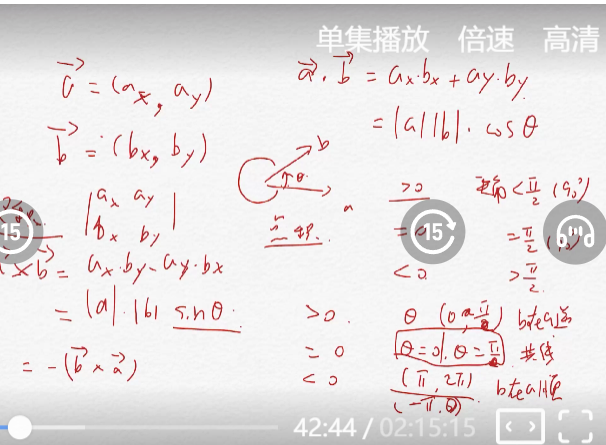

# 向量的点积和叉积

二维向量

**点积：**

$a\cdot b = ax *bx + ay*by$
常用运用：

1. 求出cos。通过正负性，判断两个向量之间的更小的夹角是什么类型的角。该角是没有方向的。因为cos函数是偶函数。

**叉积**
$a\times b = ax*by - ay*bx$
可以看作一个2行两列行列式的计算。

理解：

1. 该角式有向角。即a沿逆时针转多少度可以转到b。
   1. $>0$ 表示$\theta$ , (0 , $180^0$) b在a逆时针方向。
   2. = 0 表示$\theta$ , 0 , 180 共线。
   3. < 0 表示$\theta$ , ($180^o$ , $360^o$) b在a的顺时针方向上。

