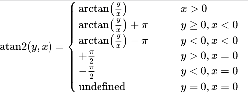
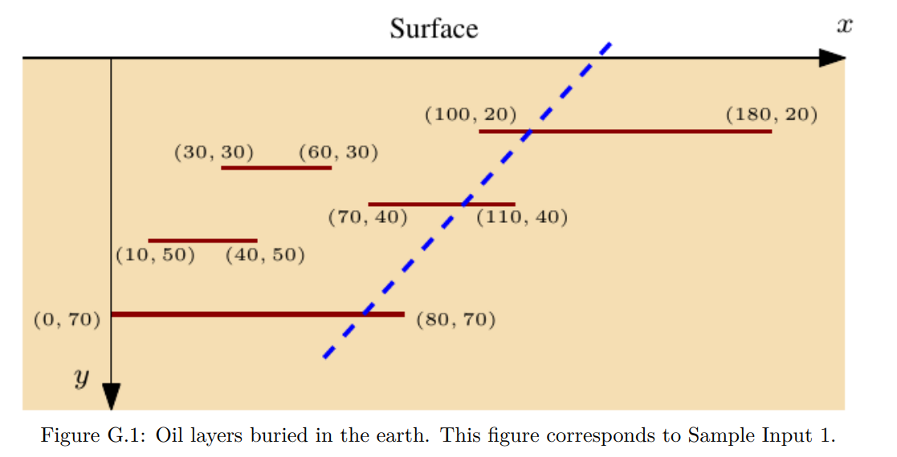
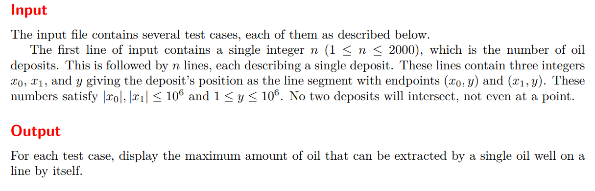
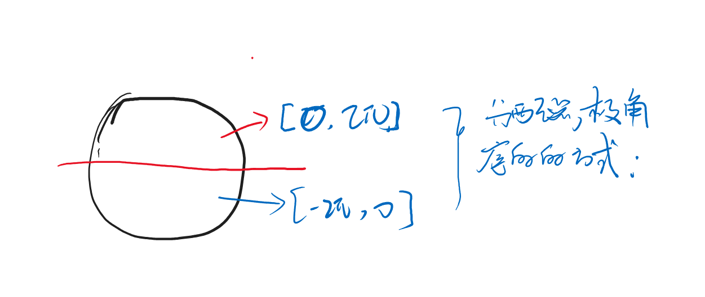
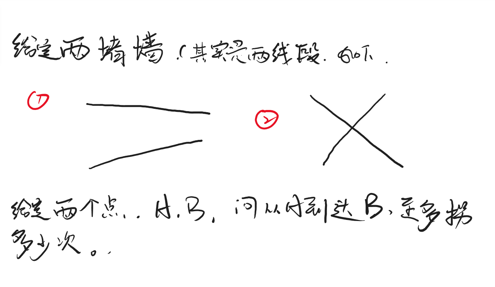
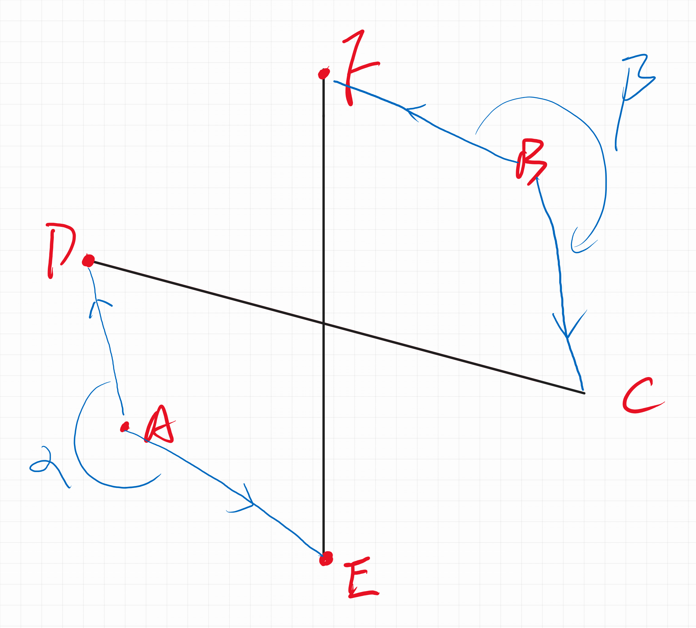
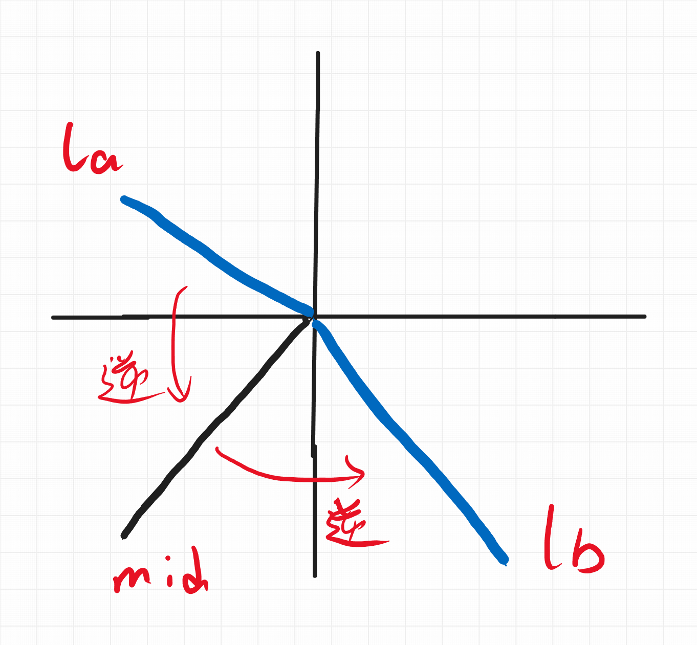

# 点、线段、极角序

## 基本概念

**关于计算几何的出题风格：**

1. 降低复杂度，偏向算法，几何能力上的问题。
2. 考察实现：
   1. 精度问题。
   2. 边界问题。

模板是基础。解决计算几何的问题，往往就是类似于在搭建积木。

下面给出相关函数的定义以及原理：

### 点：

**数据成员：** x , y

**函数成员：**

1. 加减乘除：
     将点看作一个向量。因此，可以抽象出和向量相关的加减乘除运算。原理是关于向量的四则运算。

2. 判断两点相等。

3. 点积：

   点积即$\overrightarrow{a}\cdot \overrightarrow{b}= a_xb_x + a_yb_y = |a||b|cos\theta$. 

   1. 使用方向： 计算向量之间的角度。

4. 叉积：

   叉积即$\overrightarrow{a}\times \overrightarrow{b}= a_xb_y - a_yb_x = |a||b|sin\theta$

   平行四边形面积。

5. 两点之间的距离。

6. alpha.方位角： 求极角。

   

   注意未定义的情况。

7. read（），write();快捷的读取打印。

8. abs() , 向量的模。

9. rot90()。 表示将点逆时针方向旋转90度。

10. unit()。  返回当前向量的单位向量。

11. quad() ,  求点在上象限，还是在下象限。（1 ， 2 还是 3 ， 4）匹配和极角序排序的函数。

### 线段：

1. cross（p1 , p2 , p3）: 

   $\overrightarrow{p_1p_2}\times \overrightarrow{p_1p_3} = |(p_2 - p_1)\times(p_3 - p_1)|$ 

2. crossOp : 

   计算$p_3$ 相对于$p_1p_2$实在顺时针方向上，还是逆时针方向上。作为组件，用于其它的函数。

   1. 值域定义如下：

      1. -1 : 顺时针方向上
      2. 0  : 共线
      3. 1  : 逆时针方向上：

      见如下图：简洁明了

      -1693217582980-15.png)

   

3. 检查两直线的相交情况：（两条直线，一条直线是用两个点来表示的。） chkLL(p1 , p2 , q1 , q2) ： 其实就是判断不共线。求叉积是否等于0.

4. 如果恰有一个交点：求直线具体的交点： isLL

   大致的实现思路： 

   1. 联立方程。
   2. 等比分点公式。（计算几何处理该问题时候的一般策略。）

5. 判断[l1 , r1] , [l2 , r2]是否相交： 作为后续的函数的配件。

6. 判断线段$p_1p_2与 q_1q_2$ 相交。isSS

7. 判断线段严格相交；相对于6.去除了端点相交，两线段有公共线段部分。

8.  isMiddle(dba , db m , db b): 判断m是否在[a , b]之间。

9.  isMiddle(P a , P m , P b) : 推广到了两个维度的向量。保证每一个维度都是在于a , b之间

10. 判断点p是否在线段$p_1 p_2$上。 onSeg(P p1 , P p2 , P p)

11. 判断点p是否严格在线段$p_1p_2$上。

**点与线段之间的关系**

1. 点到直线上的投影。
2. 点关于直线的反射。
3. 点到线段的最小距离。
4. 两线段之间的距离： 如果是平行的。


### 极角序

1. sort. 对极角排序。 极角，是从-Π ， Π定义为。1 ， 2象限顺时针旋转到x>0轴上的角度。符号标记为正数。3 ， 4象限逆时针旋转到x > 0轴的角度。符号标记为负。

## 板子

```cpp
typedef double db;
const db EPS = 1e-9;

// 确定一个数的符号。同时避免精度问题。
inline int sign(db a) { return a < -EPS ? -1 : a > EPS; }

// 避免精度问题。
inline int cmp(db a, db b) { return sign(a - b); }

struct P {
	db x, y;
	P() {}
	P(db _x, db _y) : x(_x), y(_y) {}
	P operator+(P p) { return {x + p.x, y + p.y}; }
	P operator-(P p) { return {x - p.x, y - p.y}; }
	P operator*(db d) { return {x * d, y * d}; }
	P operator/(db d) { return {x / d, y / d}; }

	bool operator<(P p) const {
		int c = cmp(x, p.x);
		if (c) return c == -1;
		return cmp(y, p.y) == -1;
	}

	bool operator==(P o) const {
		return cmp(x, o.x) == 0 && cmp(y, o.y) == 0;
	}

	db dot(P p) { return x * p.x + y * p.y; }
	db det(P p) { return x * p.y - y * p.x; }

	db distTo(P p) { return (*this - p).abs(); }
	db alpha() { return atan2(y, x); }
	void read() { cin >> x >> y; }
	void write() {cout << "(" << x << "," << y << ")" << endl;}
	db abs() { return sqrt(abs2());}
	db abs2() { return x * x + y * y; }
	P rot90() { return P(-y, x);}
	P unit() { return *this / abs(); }
	int quad() const { return sign(y) == 1 || (sign(y) == 0 && sign(x) >= 0); }
	P rot(db an) { return {x * cos(an) - y * sin(an), x * sin(an) + y * cos(an)}; }
};

#define cross(p1,p2,p3) ((p2.x-p1.x)*(p3.y-p1.y)-(p3.x-p1.x)*(p2.y-p1.y))
#define crossOp(p1,p2,p3) sign(cross(p1,p2,p3))

// 直线 p1p2, q1q2 是否恰有一个交点
bool chkLL(P p1, P p2, P q1, P q2) {
	db a1 = cross(q1, q2, p1), a2 = -cross(q1, q2, p2);
	return sign(a1 + a2) != 0;
}

// 求直线 p1p2, q1q2 的交点
P isLL(P p1, P p2, P q1, P q2) {
	db a1 = cross(q1, q2, p1), a2 = -cross(q1, q2, p2);
	return (p1 * a2 + p2 * a1) / (a1 + a2);
}

// 判断区间 [l1, r1], [l2, r2] 是否相交
bool intersect(db l1, db r1, db l2, db r2) {
	if (l1 > r1) swap(l1, r1); if (l2 > r2) swap(l2, r2);
	return !( cmp(r1, l2) == -1 || cmp(r2, l1) == -1 );
}

// 线段 p1p2, q1q2 相交
bool isSS(P p1, P p2, P q1, P q2) {
	return	intersect(p1.x, p2.x, q1.x, q2.x) && 
             intersect(p1.y, p2.y, q1.y, q2.y) &&
	       	crossOp(p1, p2, q1) * crossOp(p1, p2, q2) <= 0 && 
        	crossOp(q1, q2, p1) * crossOp(q1, q2, p2) <= 0;
}

// 线段 p1p2, q1q2 严格相交
bool isSS_strict(P p1, P p2, P q1, P q2) {
	return crossOp(p1, p2, q1) * crossOp(p1, p2, q2) < 0 && crossOp(q1, q2, p1)
	       * crossOp(q1, q2, p2) < 0;
}

// m 在 a 和 b 之间
bool isMiddle(db a, db m, db b) {
	/*if (a > b) swap(a, b);
	return cmp(a, m) <= 0 && cmp(m, b) <= 0;*/
	return sign(a - m) == 0 || sign(b - m) == 0 || (a < m != b < m);
}

bool isMiddle(P a, P m, P b) {
	return isMiddle(a.x, m.x, b.x) && isMiddle(a.y, m.y, b.y);
}

// 点 q 在线段 p1p2 上
bool onSeg(P p1, P p2, P q) {
	return crossOp(p1, p2, q) == 0 && isMiddle(p1, q, p2);
}
// q1q2 和 p1p2 的交点 在 p1p2 上？

// 点 p 严格在 p1p2 上
bool onSeg_strict(P p1, P p2, P q) {
	return crossOp(p1, p2, q) == 0 && sign((q - p1).dot(p1 - p2)) * sign((q - p2).dot(p1 - p2)) < 0;
}

// 求 q 到 直线p1p2 的投影（垂足） ⚠️ : p1 != p2
P proj(P p1, P p2, P q) {
	P dir = p2 - p1;
	return p1 + dir * (dir.dot(q - p1) / dir.abs2());
}

// 求 q 以 直线p1p2 为轴的反射
P reflect(P p1, P p2, P q) {
	return proj(p1, p2, q) * 2 - q;
}

// 求 q 到 线段p1p2 的最小距离
db nearest(P p1, P p2, P q) {
	if (p1 == p2) return p1.distTo(q);
	P h = proj(p1, p2, q);
	if (isMiddle(p1, h, p2))
		return q.distTo(h);
	return min(p1.distTo(q), p2.distTo(q));
}

// 求 线段p1p2 与 线段q1q2 的距离
db disSS(P p1, P p2, P q1, P q2) {
	if (isSS(p1, p2, q1, q2)) return 0;
	return min(min(nearest(p1, p2, q1), nearest(p1, p2, q2)), min(nearest(q1, q2, p1), nearest(q1, q2, p2)));
}

// 极角排序

sort(p, p + n, [&](P a, P b) {
	int qa = a.quad(), qb = b.quad();
	if (qa != qb) return qa < qb;
	else return sign(a.det(b)) > 0;
});
```

## 例题：

### ICPC World Final 2016 G, Oil

[Oil - UVA 1742 - Virtual Judge (vjudge.net)](https://vjudge.net/problem/UVA-1742)





#### solve

签到题：（wf的签到题。）
对任意一个方案进行压缩： 发现都可以转移成经过至少一个端点的方案：（通过平移）。于是就很大程度上优化了 ， 解的枚举空间：

枚举一个端点，等于枚举了一个极点。于是问题就转换成了旋转经过极点的直线。在某一些斜率范围内，这些某一些线段中地点是被经过地。相当于做一个差分（或者说是扫描线），不断地旋转直线，得到最大值。

引出一些问题：

1. 斜率是离散化的。

   因此不能用一个数组来表示 ， 这是一个扫描线问题。记录一些时间，根据斜率对这些事件排序即可。

2. 如果记录的是斜率可能造成精度问题：

   天然的极角序问题。但是模板中的极度角落的背景是：



一种简洁的统一方式： 将下半方的点投影在上半方区域。也就只是用到了一点点东西。

#### code

```cpp
#include<bits/stdc++.h>
using namespace std;
using ll = long long;

#define all(x) (x).begin(),(x).end()
#define sz(x) (int)(x).size()

#define fi first
#define se second

const int inf = 1E9 + 7;;
const ll INF = 1E18 + 7;
const int N = (int)2E3 + 10;

using db = long long;
const db EPS = 0;

inline int sign(db a) { return a < -EPS ? -1 : a > EPS;}

inline int cmp(db a , db b) {return sign(a - b);}

struct P {
	db x , y;
	P() {}
	P(db _x , db _y) : x(_x) , y(_y) {}
	P operator+(P p) {return {x + p.x , y + p.y};}
	P operator-(P p) {return {x - p.x , y - p.y};}

	/* 各种情况下返回值的意义：
	*/
	db det(P p) {return x * p.y - y * p.x;}
};

int n;
array<int , 3> rec[N];
pair<P , int> event[2 * N];

ll solve(P p) {
	int cunt = 0;
	for (int i = 0; i < n; i++) {
		if (rec[i][2] == p.y) continue;
		P p0 = {rec[i][0] ,  rec[i][2]};
		P p1 = {rec[i][1] , rec[i][2]};
		p0 = p0 - p;
		p1 = p1 - p;
		int len = p1.x - p0.x;
		if (p0.y > 0) {
			event[cunt++] = {p1 , len};
			event[cunt++] = {p0 , -len};
		} else {
			p0.x = -p0.x;
			p1.x = -p1.x;

			p0.y = -p0.y;
			p1.y = -p1.y;
			event[cunt++] = {p0 , len};
			event[cunt++] = {p1 , -len};
		}
	}

	sort(event , event + cunt , [&](pair<P , int>& a ,  pair<P , int>& b) {
		// /*首先显然是在同一侧的。*/
		// int qa = a.fi.quad() , qb = b.fi.quad();
		// /*具体实现：*/
		// if (qa != qb) return qa < qb;
		// /*表示降序；*/
		/*按照按照降序： 排序*/
		auto d = a.fi.det(b.fi);

		if (d != 0) return d > 0;
		else return a.second > b.second;
	});
	ll res = 0, cur = 0;
	for (int i = 0; i < cunt; i++) {
		cur += event[i].se;
		// cout << event[i].se << "\n";
		res = max(res , cur);
	}
	// cout << cunt << "\n";
	return res;
};
signed main(){
	ios::sync_with_stdio(false);
	cin.tie(0);
	while (cin >> n) {
		for (int i = 0; i < n; i++) {
			int x0 , x1 , y;
			cin >> x0 >> x1 >> y;
			if (x0 > x1) swap(x0 , x1);
			rec[i] = {x0 , x1 , y};
		}
		ll ans = 0;
		for (int i = 0; i < n; i++) {
			ans = max({ans , max(solve({rec[i][0] , rec[i][2]}) , solve({rec[i][1] , rec[i][2]})) + rec[i][1] - rec[i][0]});
		}
		cout << ans << "\n";
	}
}
```

### 锐角三角形

[锐角三角形 - 题目 - Daimayuan Online Judge](http://oj.daimayuan.top/course/30/problem/1204)

给 n 个点，任选三个点组成三角形，问锐角三角形个数。

#### solve

**关键**

1. 容斥： 锐角三角形并不好判断： 需要判断两个角才能确定三角形。但是相对而言，钝角三角形或者直角三角形只需要关注一个角。因此，可以利用容斥定理将问题转变成单纯的数角问题。
2. 怎么数出所有钝角：
   1. 枚举一个顶点。
   2. 双指针。

**细节**

1. 双指针： 用两个指针扫一遍。分别定位90 和180两个分界。

2. 注意去除平角。 平角可能会被计算两次。

   1. 做完之后，将平角个数减掉。
   2. 只对下半区的点算平角 ， 上半区的点不会被计算。

3. 为了统一代码风格，实现上使用一个技巧： 将所有点复制一份。这种技巧常用于处理环上的问题。

4. 对角度的分析：
   1. $[0 , \frac{\pi}{2})$
      1. $cos \theta >0$
      2. $sin \theta >= 0$
   
   2. $(\frac{\pi}{2} , \pi]$
   
      1. $cos\theta <=0$
      2. $sin \theta > 0$

5. 双指针的边界：
   1. 可能出现旋转一周的情况。因此注意设置： l < i + cunt ， r < i + cunt
   2. 如果有很多个共线。不停的旋转时。突然又回到了共线的情况。但是此时是判定为0度角的。事实上就是0度角。但是要注意指针继续往前走 ， 因此要加一个特判。


#### code

**WA点：**

1. 内积， 外积可能会爆int。 要注意。

```cpp
#include<bits/stdc++.h>
using namespace std;

using ll = long long;
using db = ll;

// #define int ll
const int N = 2010;
const db EPS = 0;

inline int sign(db a) {return a < -EPS ? -1 : a > EPS;}
inline int cmp (db a , db b) {return sign(a - b);}

struct P {
	db x , y;
	P() {};
	P(db _x , db _y) : x(_x) , y(_y) {}
	P operator+(P p) {return {x + p.x , y + p.y};}
	P operator-(P p) {return {x - p.x , y - p.y};}
	P operator*(db d) {return {x * d , y * d};}

	bool operator == (P o) {
		return cmp(x , o.x) == 0 && cmp(y , o.y) == 0;
	}
	db dot(P p) {return x * p.x + y * p.y;}
	db det(P p) {return x * p.y - y * p.x;}

	int quad() {
		return sign(y) == 1 || (sign(y) == 0 && sign(x) >= 0);
	}

} point[N] , tmp[N * 2];

int n;
ll solve(P o) {
	int cunt = 0;
	for (int i = 0; i < n; i++) {
		if (point[i] == o)continue;
		tmp[cunt++] = point[i] - o;
	}
	/*升序排序：*/

	sort(tmp , tmp + cunt , [&](P a , P b) {
		int qa = a.quad() , qb = b.quad();
		if (qa != qb) return qa < qb;
		else return sign(a.det(b)) > 0;
	});
	/*❗复制一份。简洁代码：*/
	for (int i = 0; i < cunt; i++) {
		tmp[cunt + i] = tmp[i];
	}

	/*检查第一个指针*/
	auto checkl = [&](int pre , int cur) {
		/*判断夹角小于90*/
		ll Cos = tmp[pre].dot(tmp[cur]);
		ll Sin = tmp[pre].det(tmp[cur]);
		if (Cos > 0) {
			if (Sin > 0) return true;
			else if (Sin < 0) return false;
			/*如果当前是共线的情况：*/
			// 必须在同一侧：
			else return cur < cunt;
		}
		return false;
	};
	/*检查第二个指针*/
	auto checkr = [&](int pre , int cur) {
		/*判断夹角小于小于等于180*/
		// int Cos = tmp[pre].dot(tmp[cur]);
		ll Sin = tmp[pre].det(tmp[cur]);
		/*小于 180*/
		if (Sin > 0) return true;
		/*判断是180还是0 */
		else if (Sin == 0) return cur < cunt;
		return false;
	};

	int l = 0 , r = 0;

	ll res = 0;
	for (int i = 0; i < cunt; i++) {
		// while (l <= i)l++;
		// while (r <= i)r++;
		l = max(l , i + 1);
		r = max(r , i + 1);
		while (l < i + cunt && checkl(i , l)) ++l;
		while (r < i + cunt && checkr(i , r)) ++r;
		res += r - l;
	}
	return res;
}

void work() {
	cin >> n;
	for (int i = 0; i < n; i++) {
		cin >> point[i].x >> point[i].y;
	}
	/*容斥*/
	ll ans = 1LL * n * (n - 1LL) * (n - 2LL) / 6LL;
	// cout << ans << "\n";
	for (int i = 0; i < n; i++) {
		ans -= solve(point[i]);
	}
	cout << ans << '\n';
}

signed main() {
	ios::sync_with_stdio(false);
	cin.tie(0);
	int t; cin >> t;
	while (t--) {work();}
}
```

-----

### ICPC EC Final 2021 D, Two Walls

[ICPC EC Final 2021 D, Two Walls - 题目 - Daimayuan Online Judge](http://oj.daimayuan.top/course/30/problem/1194)



#### solve

不难发现，最多拐两次。分类讨论如下：

1. 0 次：

   A到B与两条直线没有交点。容易判断。

2. 1 次：

   1. 两直线不相交：

-1693209421176-4-1693209423602-6-1693209425034-8.png)

综上： 分类讨论判断即可。
具体是实现上：

1. 判0 ， AB 直线是和其中两条直线相交：

2. 判1 ： 
   1. CD 和EF不相交。
   
   2. 在两个相邻的槽位上： 
   
      只要不满足完全异样测即可。即。只要对于一条边同侧。（排除0的可能后，共线情况的最优方案显然也是一个拐点。并入该次讨论：）
   
3. 两个都在内部。 同时处于相对的槽位。

  判断是否都在内部： 

 对图进行一个重新标记（一个规范化的过程：）：然后就可以找出和两个点相关的槽点：

  -1693234525796-24.png)

调整的方法：

只是重新打个名字而已。对于点之间的相对顺序是不会发生变化的。调整策略如下：

1. A在 CD的逆时针方向上。如果不满足就调整。
2. A在 EF的逆时针方向上。如果不满足就调整。

注意，经过上一轮的调整，其相对分布的可能形式可能如下：

-1693234338926-21.png)

调整A之后 , B由于是A对角, 其位置自然确定了。

**那么两个点在两侧， 怎么确定也可能有一个拐点的方案？**

很显然如果从如果有一个拐点的情况， 那么必然有，两个点可向外放射的矢量角度之间是有重合的。反过来如果两个点的向外放射的矢量角度有重合，那么必然存在一个点的方案。

综上，两个点的放射角度范围那么，就有一个点的方案如图：



注意两端是取开区间的。 并且约定俗成的定义逆时针方向的扫描：

因此将问题成功转换成，求旋转角度的交集问题。实现方法为：

1. 扫描线做法。

   扫描线的过程中： 注意细节：

   1. 边界共线情况下， 负数优先： 因为边界是不能选的。

   2. 要进行一些特判：因为定义极角落序列其扫描起点是确定的。但是这可能不符合实际情况：如下图：

      -1693236639542-28.png)

      因此要非常注意一些情况： 某一个点的角度区间是经过了$pi$的。要求对这些区间进行一些特判：

      1. 因为是从第三象限开始扫的。因此先对这些区间进行一个统计：预处理出cur的点数。如果有横跨$\pi$的先加加其情况有：

         1. la 在上， ra在下。（对于b相似。）

            .png)

            

         2. 如下：

            -1693237903043-30.png)

2. 直接暴力枚举，判断两两之间的方向即可。（显然这种更加明了， 边界更少。）

   

#### code

```cpp
#include<bits/stdc++.h>
using namespace std;

#define all(x) (x).begin(),(x).end()
#define int ll

using ll = long long;
using db = long long;
const db EPS = 0;
inline int sign(db a) {return a < -EPS ? -1 : a > EPS;}
inline int cmp(db a , db b) {return sign(a - b);}

struct P {
    db x , y;
    P() {}
    P(db _x , db _y) : x(_x) , y(_y) {}
    P operator+(P p) {return {x + p.x , y + p.y};}
    P operator-(P p) {return {x - p.x , y - p.y};}

    db dot(P p) {return x * p.x + y * p.y;}
    db det(P p) {return x * p.y - y * p.x;}
    void read() {cin >> x >> y;}
    int quad() const {
        return sign(y) == 1 || (sign(y) == 0 && sign(x) >= 0);
    }
};


#define cross(p1,p2,p3) ((p2.x-p1.x) *(p3.y - p1.y) - (p3.x - p1.x)*(p2.y-p1.y))
#define crossOp(p1,p2,p3) sign(cross(p1,p2,p3))

bool intersect(db l1 , db r1 , db l2 , db r2) {
    if (l1 > r1) swap(l1 , r1);
    if (l2 > r2) swap(l2 , r2);
    return !(cmp(r1 , l2) == -1 || cmp(r2 , l1) == -1);
}

// 判断直线之间是否有交点：
bool isSS(P p1 , P p2 , P q1 , P q2) {
    return intersect(p1.x , p2.x , q1.x , q2.x) &&
           intersect(p1.y , p2.y , q1.y , q2.y) &&
           crossOp(p1 , p2 , q1) * crossOp(p1 , p2 , q2) <= 0 &&
           crossOp(q1 , q2 , p1) * crossOp(q1 , q2 , p2) <= 0;
}

int cmp(P a , P b) {
    int qa = a.quad() , qb = b.quad();
    if (qa != qb) return qa < qb;
    auto d = a.det(b);
    return sign(d) > 0;
}

// 线段 p1p2, q1q2 严格相交
bool isSS_strict(P p1, P p2, P q1, P q2) {
    return crossOp(p1, p2, q1) * crossOp(p1, p2, q2) < 0 && crossOp(q1, q2, p1)
           * crossOp(q1, q2, p2) < 0;
}

int solve() {
    P a , b , c , d , e , f;
    a.read(); b.read();
    c.read(); d.read();
    e.read(); f.read();
    /*判断0的情况*/
    if (not isSS(a , b , c , d) && not isSS(a , b , e , f)) return 0;
    /*判断1的情况：*/
    /*不相交：*/
    if (not isSS_strict(c , d , e , f)) return 1;
    /*
    相邻槽位：
    1. 共线情况说明不在内部，必然可以一个。
    2. 不共线情况 ： 一同侧，两不同侧：
    */
    if (crossOp(c , d , a) * crossOp(c , d , b) >= 0)return 1;
    if (crossOp(e , f , a) * crossOp(e , f , b) >= 0)return 1;
    /*逆时针方向上， 即在上方*/
    if (crossOp(c , d , a) < 0) swap(c , d);
    /*顺时针方向上： ， 即在右方：*/
    if (crossOp(e , f , a) < 0) swap(e , f);
    /*检查：多种方法：*/
    /*下面这个是什么意思？*/
    if ((d - c).det(f - e) > 0) swap(c, e), swap(d, f);

    P la = d - a , ra = e - a;
    P lb = c - b , rb = f - b;
    vector<pair<P , int>> tmp;
    tmp.push_back(make_pair(la , 1));
    tmp.push_back(make_pair(ra , -1));
    tmp.push_back(make_pair(lb , 1));
    tmp.push_back(make_pair(rb , -1));
    int cur = cmp(ra , la) + cmp(rb , lb);
    if (cur >= 2) return 1;
    sort(all(tmp) , [&](pair<P , int> X ,  pair<P , int> Y) {
        int qx = X.first.quad() , qy = Y.first.quad();
        if (qx != qy) return qx < qy;
        auto d = X.first.det(Y.first);
        if (d == 0) return X.second < Y.second;
        else return d > 0;
    });
    for (int i = 0; i < 4; i++) {
        cur += tmp[i].second;
        if (cur >= 2) return 1;
    }
    return 2;
}
signed main() {
    ios::sync_with_stdio(false);
    cin.tie(0);
    int t; cin >> t;
    while (t--) cout << solve() << "\n";
    return 0;
}
```


