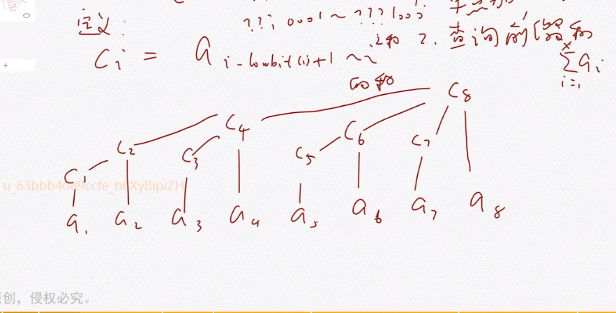
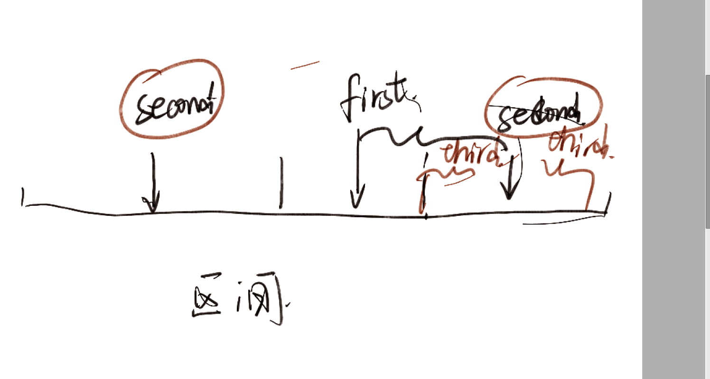
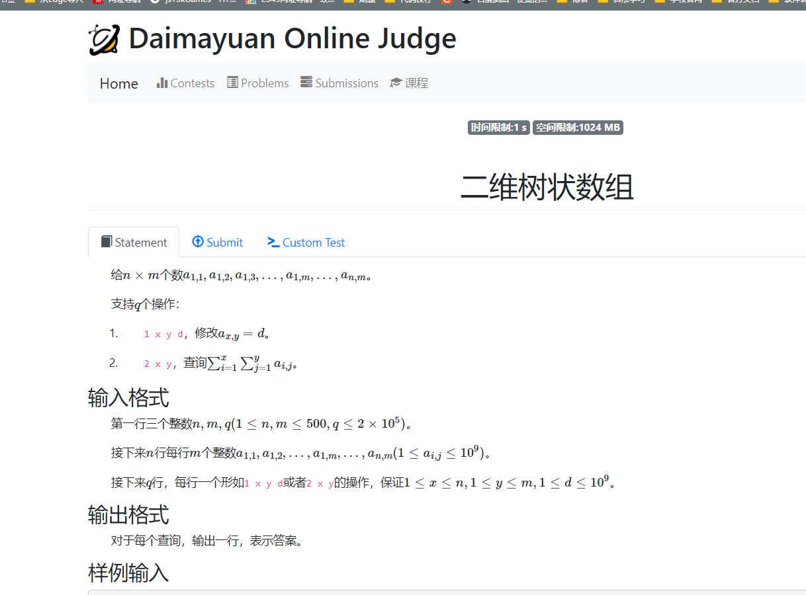

### 树状数组

### $\large BIT$

```cpp
const int N = 5E5 + 10;
int n;
int a[N];
int d[N];

class BIT {
	ll c[N];

public:
	ll query(int x) {
		ll res = 0;
		for (; x ; x -= x & (-x))
			res += c[x];
		return res;
	}
	void modify(int x, ll d) {
		assert(x != 0);
		for (; x <= n; x += x & (-x)) {
			c[x] += d;
		}
	}
};

BIT d1, d2;

//树状数组求区间和公式：
//cout << (x + 1)*d1.query(x) - d2.query(x) - (x)*d1.query(x - 1) + d2.query(x - 1) << '\n';
//区间修改仔细点，前加后减。小心记错结论。
//求和问题非常容易溢出。
```

### lowbit

#### 定义：

尾部的1000.串。0的个数可以为0.

#### 求法 ：

 `lowbit(x)=x&(-x);`(-x)其实是补码。

二进制的规律性质。是对模型充分感受后性质的挖掘。

### 树状数组

维护一个区间，支持操作： 单点加，查询前缀和。

可以做到O(log n)的复杂度。

存储形式是$c_1....c_n$的数组。

$c_i=\sum a_{i-lowbit(i)+1 ....i}$模拟一遍，情况如下：



模拟一遍，最后的结果如上。

---------------

#### one 查询操作。

对于 查询一段区间里面的值，

x

1. ans+=c[x];

2. x-=lowbit(x);
3. x==0退出否则回到第一步。

###### 原理如下

如下。假设区间为1....x

其中可以二进制表示。

比方说 为 10010011

可以通过  10010011+ 10010010 + 10010000 + 10000000 

​    1....10000000 +10000001....10010000+10010001....10010010.+10010011..10010011

其实就是贴着上界走。

###### code

```cpp
ll query(int x){
    ll sum=0;
    for(; x ; x-= x&(-x)){
        sum + = c[x];
    }
    return sum;
}
```


#### 修改操作

###### 原理

我们修改某一个点上地值。管理该点地所有区间都要进行修改。

那么c数组中的哪一个值管理了该点呢？

假设 x=10010

下面是不断寻父亲的序列。

 10100  -》  [10001,10100]

 11000  -》  [10001,11000]

100000 ->  [1,100000]

.......

如果当前已经出现了大于值的情况。

那么就及时的退出。

为什么？ 因为这点没有定义，我们构建的树只管理了存在定义的数组。虽然这个

c的定义是可以不断外延的。

###### code

```cpp
void modify(int x , ll d){
    for(: x <= n; x += x & (-x)){
        c[x]+=d; 
    }
}
```


#### 建树操作

最简单的方法是

对c{N]数组初始化为0

然后相当于在所有都为0的a数组上进行不断地修改数字地过程。

因此一边输入a[i].一边维护即可。

###### code

```cpp
const int N = 1E6 + 10;
int a[N];
ll c[N];
int n;

int init(){
    for(int i = 1; i <= n ; i++){
        cin >> a[i];
        modify( i , a[i]);
    }
}

```

#### 总模板

```cpp
using ll = long long;
const int N = 1E6 + 10;
int a[N];
ll  c[N];
int n;
//init地步骤灵活一点

ll query(int x){
    ll sum=0;
    for(; x ; x-= x&(-x)){
        sum + = c[x];
    }
    return sum;
}

void modify(int x , ll d){
    for(: x <= n; x += x & (-x)){
        c[x]+=d; 
    }
}

int init(){
    for(int i = 1; i <= n ; i++){
        cin >> a[i];
        modify( i , a[i]);
    }
}

```

****

**树状数组基本问题**

#### $first$ 树状数组1

简单维护区间求和等等问题。

就是套一个板子上去。

#### $second $逆序对2

对于一个排列，求多少个逆序对。

##### 思想

##### 扫描线的思想（类似扫描线思想

从小进行一个遍历。不断扫描，用一个数据结构维护前面的D的信息可以快速查询有多少个大于当前的数。 可以用一个数组D来记录。某一个数字是否出现过。然后不断维护后缀和即可。

其实用平衡树维护，也可以快速地实现查询操作。

##### 静态问题转换成动态问题。动态问题转换成静态问题。

就是这样一遍扫过去，同时计算贡献

#### $third$ 树状数组2

利用树状数组维护区间加的操作。

##### 原理

差分思想： 

1. 对数组求差分，可以利用差分数组还原出数组，并进一步求出数组的和。虽然计算量会变得更庞大，但是计算机可以接受这种两倍的计算量。
2. 差分，优势就是可以将区间加转换成单点修改问题。对于涉及的差分量而言，最终其实就只有一个量发生变化。更容易维护，比方说，修改[ l , r ]最终只需要改变d[l],d[r+1] 。它的优点是非常容易维护

相关推导如下：

$1.定义：d_1=a[1]， d_i=a_i-a_{i-1}$

$2.求出一个元素：a_x=\sum_{i=1}^{x}d_i $

$3.求和：$
$$
sum(x)=a_1+...a_x\\
=d_1+(d_1+d_2)+(d_1+d_2+....+d_x)\\
=\sum_{i=1}^{x}(x+1-i)*d_i\\
=(x+1)\times\sum_{i=1}^{x}d_i-\sum_{i=1}^{x}i*d_i
$$


我们维护两个数组。一个是$d_i$，另外一个是$i*d_{i}$


##### 一些思想启发：

- 利用模板封装好树状数组。这样就可以方便的管理两个数组。不用定义太多的名称。


#### 树状数组二分

维护一段区间的前缀和。保证每一个元素都大于0。查询第一个sum[t]>=t的元素。由于存在单调性，可以通过二分查询。但是复杂度是两个log。

##### 改进方法

在多次二分的过程中，一些c[i]不断地被重复访问。有一种非常神奇地访问方法。

同样，是由大区间到小区间不断定位地枚举思想。

$j=\left \lceil log(n) \right \rceil ,初始化pos=0$

先看（1<<pos）如果大于n。那么前移

否则查看当前$c[pos+(1<<j)]$是否大于check.

$c[pos+(1<<j)]$实际上存储了 1......pos'的内容。

如果发现大于。答案必然包含这个区间。

否则说明区间更少，去寻找细度更小的区间。

比方说

$[10100]_2=n$

check（x).应为 $[01111]$

第一次检查

[100000]发现该区间大于n。不符合定义，接着往下看。

[10000]小于n但是$curentSum+c[pos']>x$

所以应该看细度更小的区间

$[1000]$满足上述两个条件$pos'<n且curentSum<x$

pos=pos'=[1000]

继续向下看紧紧贴着的区间。



一直评接。然后迟早拼凑出来

#### code如下：

```cpp
//找到满足sum[i]<=x的边界。
int query(ll x) {
	int pos = 0;
	ll  t = 0;
	//18对应5e5
	//19对应1e6
	for (int i = 18; i >= 0; i--) {
		//t的水平一直是小于等于x的关系。
		if (pos + (1 << i) <= n && t + c[pos + (1 << i)] <= x) {
			pos += (1 << i);
			t += c[pos];
		}
	}
	// cout << pos << '\n';
	return pos;
}
```

注意，这里找到的是，最大的满足sum<=x的position.


**树状数组求逆序对**

https://www.luogu.com.cn/problem/P1908

与排列的逆序对问题不一样。

这里的模型是一般的数组，而排列中的数组，每一个数字只出现一次。这里的数字可能重复并且值域过大。因此要离散化。


#### 生长思考

##### 1. 关于异常捕捉：

- 放置`modify(int x , int d);`x为0.否则会出现情况。这里可以通过assert(x!=0)来抛出异常。防止出错。
- 下面第一份代码过不了。用map实现的离散化常数过大。
  - 通过b[i]为每一个元素分配标签。nlog(n)
  - 遍历a[i]的过程中，检查a[i]   nlog(n);

##### 2.关于离散化的优化。

排序的过程中，通过一个替身。我们进行一个替身排序。有几个好处。

1. 一个no序列就是升降序。
2. 一个通过no可以访存。完成修正，数据查询。

顺便把离散化的板子给写下来。

#### code2

```cpp
#include<bits/stdc++.h>
using namespace std;
using ll = long long;

const int N = 5E5 + 10;

//统管线段树的长度。
int n;
int a[N];
pair<int , int> dct[N];//discretize离散化。


template <class T>
class BIT {
	//小心越界 1E6
	T c[(int)5E5 + 10];

public:
	ll query(int x) {

		ll res = 0;
		for (; x; x -= x & (-x))
			res += c[x];

		return res;
	}

	void modify(int x, ll d) {
		//捕捉不等于0的情况。
		assert(x != 0);
		for (; x <= n; x += x & (-x))
			c[x] += d;

	}
};

BIT <ll> d1; // 用来记录某一个数字的出现情况。

int main() {
	ios::sync_with_stdio(false);
	cin.tie(0), cout.tie(0);
	cin >> n;
	//离散化
	for (int i = 1; i <= n; i++) {
		cin >> a[i];
		dct[i] = {a[i], i};
	}
	dct[0].first = 1E9 + 10;
	sort(dct + 1, dct + 1 + n);
	for (int i = 1; i <= n; i++) {
		//要追求稳定排序吗？不需要。因为最终都上了一样的标记。
		if (dct[i].first != dct[i - 1].first)
			a[dct[i].second] = i;
		else a[dct[i].second] = a[dct[i - 1].second];
		//注意特判，这里容易出错。导致有一些位置没有修改。然后造成越界的问题。
	}
	ll ans = 0;
	//树状数组求逆序对。
	for (int i = 1 ; i <= n; i++) {
		ans += d1.query(n) - d1.query(a[i]);
		d1.modify(a[i] , 1);
	}
	cout << ans << '\n';
}
```


#### code1

```cpp
#include<bits/stdc++.h>
using namespace std;
using ll = long long;

const int N = 5E5 + 10;

//统管线段树的长度。
int n;
int a[N];
int b[N];
map<int, int>mp;


template <class T>
class BIT {
	//小心越界 1E6
	T c[(int)5E5 + 10];

public:
	ll query(int x) {

		ll res = 0;
		for (; x; x -= x & (-x))
			res += c[x];

		return res;
	}

	void modify(int x, ll d) {
		//捕捉不等于0的情况。
		assert(x != 0);
		for (; x <= n; x += x & (-x))
			c[x] += d;
		int k = 1;
	}
};

BIT <ll> d1; // 用来记录某一个数字的出现情况。

int main() {
	ios::sync_with_stdio(false);
	cin.tie(0), cout.tie(0);

	cin >> n;
	//离散化
	for (int i = 1; i <= n; i++) {
		cin >> a[i];
		b[i] = a[i];
	}
	ll ans = 0;
	//离散化。先排序再标记
	sort(b + 1, b + 1 + n);
	for (int i = 1; i <= n; i++) {
		if (mp[b[i]] == 0)mp[b[i]] = i;
	}

	//进行逆序对的计算。
	for (int i = 1; i <= n; i++) {
		a[i] = mp[a[i]];
		ans += d1.query(n) - d1.query(a[i]);
		d1.modify(a[i], 1);
	}
	cout << ans << '\n';
}
```


**树状数组上二分**

https://www.luogu.com.cn/problem/P1908

与排列的逆序对问题不一样。

这里的模型是一般的数组，而排列中的数组，每一个数字只出现一次。这里的数字可能重复并且值域过大。因此要离散化。


#### 生长思考

##### 1. 关于异常捕捉：

- 放置`modify(int x , int d);`x为0.否则会出现情况。这里可以通过assert(x!=0)来抛出异常。防止出错。
- 下面第一份代码过不了。用map实现的离散化常数过大。
  - 通过b[i]为每一个元素分配标签。nlog(n)
  - 遍历a[i]的过程中，检查a[i]   nlog(n);

##### 2.关于离散化的优化。

排序的过程中，通过一个替身。我们进行一个替身排序。有几个好处。

1. 一个no序列就是升降序。
2. 一个通过no可以访存。完成修正，数据查询。

顺便把离散化的板子给写下来。

#### code2

```cpp
#include<bits/stdc++.h>
using namespace std;
using ll = long long;

const int N = 5E5 + 10;

//统管线段树的长度。
int n;
int a[N];
pair<int , int> dct[N];//discretize离散化。


template <class T>
class BIT {
	//小心越界 1E6
	T c[(int)5E5 + 10];

public:
	ll query(int x) {

		ll res = 0;
		for (; x; x -= x & (-x))
			res += c[x];

		return res;
	}

	void modify(int x, ll d) {
		//捕捉不等于0的情况。
		assert(x != 0);
		for (; x <= n; x += x & (-x))
			c[x] += d;

	}
};

BIT <ll> d1; // 用来记录某一个数字的出现情况。

int main() {
	ios::sync_with_stdio(false);
	cin.tie(0), cout.tie(0);
	cin >> n;
	//离散化
	for (int i = 1; i <= n; i++) {
		cin >> a[i];
		dct[i] = {a[i], i};
	}
	dct[0].first = 1E9 + 10;
	sort(dct + 1, dct + 1 + n);
	for (int i = 1; i <= n; i++) {
		//要追求稳定排序吗？不需要。因为最终都上了一样的标记。
		if (dct[i].first != dct[i - 1].first)
			a[dct[i].second] = i;
		else a[dct[i].second] = a[dct[i - 1].second];
		//注意特判，这里容易出错。导致有一些位置没有修改。然后造成越界的问题。
	}
	ll ans = 0;
	//树状数组求逆序对。
	for (int i = 1 ; i <= n; i++) {
		ans += d1.query(n) - d1.query(a[i]);
		d1.modify(a[i] , 1);
	}
	cout << ans << '\n';
}
```


#### code1

```cpp
#include<bits/stdc++.h>
using namespace std;
using ll = long long;

const int N = 5E5 + 10;

//统管线段树的长度。
int n;
int a[N];
int b[N];
map<int, int>mp;


template <class T>
class BIT {
	//小心越界 1E6
	T c[(int)5E5 + 10];

public:
	ll query(int x) {

		ll res = 0;
		for (; x; x -= x & (-x))
			res += c[x];

		return res;
	}

	void modify(int x, ll d) {
		//捕捉不等于0的情况。
		assert(x != 0);
		for (; x <= n; x += x & (-x))
			c[x] += d;
		int k = 1;
	}
};

BIT <ll> d1; // 用来记录某一个数字的出现情况。

int main() {
	ios::sync_with_stdio(false);
	cin.tie(0), cout.tie(0);

	cin >> n;
	//离散化
	for (int i = 1; i <= n; i++) {
		cin >> a[i];
		b[i] = a[i];
	}
	ll ans = 0;
	//离散化。先排序再标记
	sort(b + 1, b + 1 + n);
	for (int i = 1; i <= n; i++) {
		if (mp[b[i]] == 0)mp[b[i]] = i;
	}

	//进行逆序对的计算。
	for (int i = 1; i <= n; i++) {
		a[i] = mp[a[i]];
		ans += d1.query(n) - d1.query(a[i]);
		d1.modify(a[i], 1);
	}
	cout << ans << '\n';
}
```


**树状数组维护二维数组**




```cpp
#include<bits/stdc++.h>
using namespace std;
using ll = long long;

const int N = 5E2 + 10;

int a[N][N];
int n, m, q;

ll c[N][N];

void modify(int x , int y , ll d)
{
	for (int i = x; i <= n; i += i & -i)
		for (int j = y; j <= m ; j += j & -j)
			c[i][j] += d;
}

ll query (int x , int y)
{
	ll res = 0;
	for (int i = x; i ; i -= i & -i)
		for (int j = y; j ; j -= j & -j)
			res += c[i][j];
	return res;
}

int main()
{
	ios::sync_with_stdio(false);
	cin.tie(0);

	cin >> n >> m >> q;
	for (int i = 1; i <= n; i++)
		for (int j = 1; j <= m; j++)
		{
			cin >> a[i][j];
			modify(i, j, a[i][j]);
		}

	while (q--)
	{
		int choice;
		cin >> choice;
		if (choice == 1)
		{
			int x , y;
			ll d;
			cin >> x >> y >> d;
			modify( x , y , d - a[x][y]);
			a[x][y] = d;
		}
		else
		{
			int x , y;
			cin >> x >> y;
			cout << query(x , y) << '\n';
		}
	}

}

/* stuff you should look for
* int overflow, array bounds
* special cases (n=1?)
* do smth instead of nothing and stay organized
* WRITE STUFF DOWN
* DON'T GET STUCK ON ONE APPROACH
*/
```

