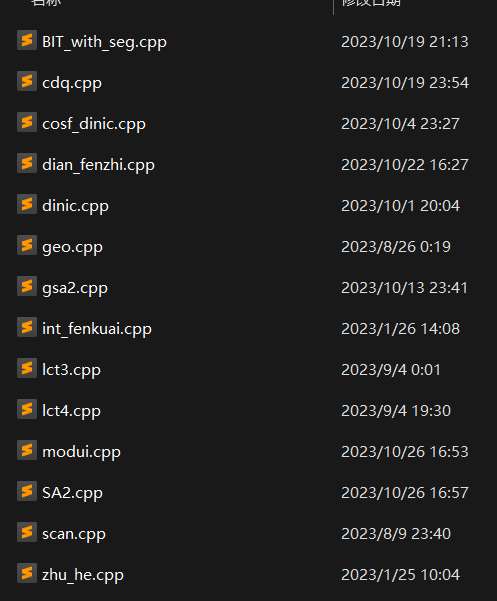

# 桂林更新 2023. 10.26

[TOC]



# 1.BIT_with_seg

```cpp
#include<bits/stdc++.h>
using namespace std;
const int maxn=2e5+5;
struct segtr{
    static const int maxp=maxn*200;
    int ls[maxp],rs[maxp],sum[maxp],pcnt;
    vector<int>ok;
    void addnode(int &p){
        if(ok.empty()){p=++pcnt;return ;}
        p=ok.back();ok.pop_back();
    }
    void del(int &p){ok.push_back(p);p=0;}
    void init(){
        ok.clear();
        memset(ls,0,sizeof(ls));
        memset(rs,0,sizeof(rs));
        memset(sum,0,sizeof(sum));
        pcnt=0;
    }
    void pushup(int p){sum[p]=sum[ls[p]]+sum[rs[p]];}
    void updata(int &u,int l,int r,int q,int k){
        if(!u)addnode(u);
        sum[u]+=k;
        if(l<r){
            int mid=(l+r)>>1;
            if(q<=mid)updata(ls[u],l,mid,q,k);
            else updata(rs[u],mid+1,r,q,k);
        }
        if(!sum[u])del(u);
    }
    int query(int p,int l,int r,int ql,int qr){
        if(!p)return 0;
        if(ql<=l&&r<=qr)return sum[p];
        int mid=(l+r)>>1;
        int res=0;
        if(ql<=mid)res+=query(ls[p],l,mid,ql,qr);
        if(mid<qr)res+=query(rs[p],mid+1,r,ql,qr);
        return res;
    }
};
struct BIT{
    int n;
    segtr seg;
    int rt[maxn];
    int lowbit (int p){return p&-p;}
    void init(int n=0){this->n=n;seg.init();}
    void updata(int p,int q,int k){
        for(;p<=n;p+=lowbit(p))seg.updata(rt[p],1,n,q,k);
    }
    int query(int p,int ql,int qr){
        int res=0;
        for(;p;p-=lowbit(p))res+=seg.query(rt[p],1,n,ql,qr);
        return res;
    }
    int query(int l,int r,int ql,int qr){return query(r,ql,qr)-query(l-1,ql,qr);}
}bit;
void solve(){
    int n,m;
    cin>>n>>m;
    vector<int>a(n+1),b(n+1),pos(n+1),c(n+1);
    for(int i=1;i<=n;++i)cin>>a[i],pos[a[i]]=i;
    for(int i=1;i<=n;++i)cin>>b[i],b[i]=pos[b[i]];
    bit.init(n);
    for(int i=1;i<=n;++i)bit.updata(i,b[i],1);
    while(m--){
        int op,x,y;
        cin>>op>>x>>y;
        if(op==1){
            int l,r;
            cin>>l>>r;
            cout<<bit.query(l,r,x,y)<<"\n";
        }else{
            bit.updata(x,b[x],-1);
            bit.updata(y,b[y],-1);
            swap(b[x],b[y]);
            bit.updata(x,b[x],1);
            bit.updata(y,b[y],1);
        }
    }
}
signed main(){
    ios::sync_with_stdio(0);cin.tie (0);
    solve();
}
```

# 2. cdq

```cpp
#include<bits/stdc++.h>
using namespace std;
const int maxn=2e5+5;
struct BIT{
    vector<int>tr;
    int n;
    BIT(int n):n(n),tr(n+12){};
    int lowbit (int p){return p&-p;}
    void updata(int p,int x){
        for(;p<=n;p+=lowbit(p))tr[p]+=x;
    }
    int query(int p){
        int res=0;
        for(;p;p-=lowbit(p))res+=tr[p];
        return res;
    }
    int query(int l,int r){return query(r)-query(l-1);}
    void clear(){for(auto &x:tr)x=0;}
};
struct CDQ{
    struct event{
        int l,r,y,val,id;
        event(int l=0,int r=0,int y=0,int val=0,int id=0):l(l),r(r),y(y),val(val),id(id){}
        const bool isupdata(){return id<0;}
        const bool isquery(){return id>=0;}
        bool const operator<(const event& o)const{return y<o.y;}
    };
    vector<event>events,buffer;
    vector<int>res;
    int n;BIT bit;
    CDQ(int n):n(n),bit(n){init();}
    int mx,mxid;
    void init(){mx=mxid=0;}// BIT clear()???
    void addupdata(int x,int y,int val){
        events.push_back({x,x,y,val,-1});
        mx=max(mx,x);
    }
    void addquery(int l,int r,int y,int val,int id){
        events.push_back({l,r,y,val,id});
        mx=max(mx,r);
        mxid=max(mxid,id);
    }
    void solve(int l,int r){
        if(r-l+1<=100){
            for(int i=l;i<=r;++i)if(events[i].isquery()){
                auto now=events[i];
                for(int j=l;j<i;++j)if(events[j].isupdata()){
                    if(events[j].y<=now.y&&now.l<=events[j].l&&events[j].l<=now.r)
                        res[now.id]+=now.val*events[j].val;
                }
            }
            sort(events.begin()+l,events.begin()+r+1);
            return ;
        }
        int mid=(l+r)>>1;
        solve(l,mid),solve(mid+1,r);
        int cur=l;
        for(int i=l,j=mid+1;i<=mid||j<=r;){
            if(j>r||(i<=mid&&events[i].y<=events[j].y)){
                if(events[i].isupdata())bit.updata(events[i].l,events[i].val);
                buffer[cur++]=events[i++];
            }else{
                if(events[j].isquery())res[events[j].id]+=events[j].val*bit.query(events[j].l,events[j].r);
                buffer[cur++]=events[j++];
            }
        }
        if(mid-l+1>(bit.n>>9))bit.clear();
        else for(int i=l;i<=mid;++i)if(events[i].isupdata())bit.updata(events[i].l,-events[i].val);
        for(int i=l;i<=r;++i)events[i]=buffer[i];
    }
    void solve(){
        res.assign(mxid+50,0);
        bit.n=mx;bit.tr.assign(mx+50,0);
        buffer.resize(events.size()+50);
        solve(0,events.size()-1);
    }
};
void solve(){
    int n,m;
    cin>>n>>m;
    CDQ cdq(n);
    vector<int>a(n+1),b(n+1),pos(n+1);
    for(int i=1;i<=n;++i)cin>>a[i],pos[a[i]]=i;
    for(int i=1;i<=n;++i)cin>>b[i],b[i]=pos[b[i]],cdq.addupdata(i,b[i],1);
    int cnt=0;
    while(m--){
        int op,x,y;
        cin>>op>>x>>y;
        if(op==1){
            int l,r;
            cin>>l>>r;
            cdq.addquery(l,r,y,1,cnt);
            cdq.addquery(l,r,x-1,-1,cnt);
            ++cnt;
        }else{
            cdq.addupdata(x,b[x],-1);
            cdq.addupdata(y,b[y],-1);
            swap(b[x],b[y]);
            cdq.addupdata(x,b[x],1);
            cdq.addupdata(y,b[y],1);
        }
    }
    cdq.solve();
    for(int i=0;i<cnt;++i)cout<<cdq.res[i]<<"\n";
}
signed main(){
    ios::sync_with_stdio(0);cin.tie (0);
    solve();
}
```

# 3.cosf_dinic

```cpp
#include<bits/stdc++.h>
using namespace std;
const int V = 20100;
const int E = 201000;
template<typename T>
struct MinCostGraph {
    int s, t, vtot;
    int head[V], etot;
    T dis[V], flow, cost;
    int pre[V];
    bool vis[V];
    struct edge {
        int v, nxt;
        T f, c;
    } e[E * 2];
    void addedge(int u, int v, T f, T c, T f2 = 0) {
        e[etot] = {v, head[u], f, c};
        head[u] = etot++;
        e[etot] = {u, head[v], f2, -c};
        head[v] = etot++;
    }
    bool spfa() {
        T inf = numeric_limits<T>::max() / 2;
        //vector<T>incf(vtot,0);incf[s]=inf;
        for(int i = 0; i <= vtot; ++i) {
            dis[i] = inf;
            vis[i] = false;
            pre[i] = -1;
        }
        dis[s] = 0;
        vis[s] = true;
        queue<int> q;
        q.push(s);
        while(!q.empty()) {
            int u = q.front();
            for(int i = head[u]; ~i; i = e[i].nxt) {
                int v = e[i].v;
                if(e[i].f && dis[v] > dis[u] + e[i].c) {//反
                    dis[v] = dis[u] + e[i].c;
                    pre[v] = i;
                    //incf[v]=min(incf[u],e[i].f);
                    if(!vis[v]) {
                        vis[v] = true;
                        q.push(v);
                    }
                }
            }
            q.pop();
            vis[u] = false;
        }
        return dis[t] != inf;//incf[t]>0;
    }
    void augment() {
        int u = t;
        T f = numeric_limits<T>::max();
        while(~pre[u]) {
            f = min(f, e[pre[u]].f);
            u = e[pre[u] ^ 1].v;
        }

        flow += f;
        cost += f * dis[t];
        u = t;
        while(~pre[u]) {
            e[pre[u]].f -= f;
            e[pre[u] ^ 1].f += f;
            u = e[pre[u] ^ 1].v;
        }
    }
    pair<T, T> solve() {
        flow = 0;
        cost = 0;
        while(spfa())augment();
        return {flow, cost};
    }
    void init(int s_, int t_, int vtot_) {
        s = s_;
        t = t_;
        vtot = vtot_;
        etot = 0;
        //如果要用0这个点的话，i要从0开始
        for(int i = 0; i <= vtot; ++i)head[i] = -1;
    }
};
MinCostGraph<int> g;
void solve() {
    int n, m, S, T;
    cin >> n >> m >> S >> T;
    g.init(S, T, n + 10);
    for(int i = 1; i <= m; ++i) {
        int u, v, f, c;
        cin >> u >> v >> f >> c;
        g.addedge(u, v, f, c);
    }
    auto [flow, cost] = g.solve();
    cout << flow << " " << cost;
}
```

# 4.点分治

```cpp
#include<bits/stdc++.h>
#define int long long
using namespace std;
vector<int>g[200000+50];
int ctr=-1,n,k,sz[200000+50],del[200000+50];
void dfs(int u,int f=0){
    sz[u]=1;
    int mx=0;
    for(auto v:g[u]){
        if(del[v]||v==f)continue;
        dfs(v,u);
        if(ctr!=-1)return ;
        mx=max(mx,sz[v]);
        sz[u]+=sz[v];
    }
    mx=max(mx,n-sz[u]);
    if(mx<=n/2){
        ctr=u;
        sz[f]=n-sz[u];
    }
}
int tmp[200000+50],tot,cnt,lens[200000+50];
void dfs2(int u,int f,int len){
    if(len>k)return ;
    cnt+=lens[k-len]+(len==k);
    tmp[tot++]=len;
    for(auto v:g[u]){
        if(del[v]||v==f)continue;
        dfs2(v,u,len+1);
    }
}
void run(int u){
    for(auto v:g[u]){
        if(del[v])continue;
        dfs2(v,u,1);
        for(int i=0;i<tot;++i)lens[tmp[i]]++;
        tot=0;
    }
    for(int i=0;i<=k;++i)lens[i]=0;
    del[u]=1;
    for(auto v:g[u]){
        if(del[v])continue;
        n=sz[v];
        ctr=-1;
        dfs(v);
        run(ctr);
    }
}
void solve(){
    cin>>n>>k;
    for(int i=1;i<n;++i){
        int u,v;
        cin>>u>>v;
        g[u].push_back(v);
        g[v].push_back(u);
    }
    dfs(1);
    run(ctr);
    cout<<cnt<<"\n";
}  
signed main(){
    ios::sync_with_stdio(0);
    cin.tie(0);
    solve();
}
```

# 5.dinic

```cpp
#include<bits/stdc++.h>
using namespace std;//sqrt(n)*m,E*V*V
#define int long long
const int V = 1e5+11;
const int E = V*30;
template<typename T>
struct FlowGraph {
    int s, t, vtot;
    int head[V], etot;
    int dis[V], cur[V];
    struct edge {
        int v, nxt;
        T f;
    } e[E * 2];

    void addedge(int u, int v, T f) {
        e[etot] = {v, head[u], f};
        head[u] = etot++;
        e[etot] = {u, head[v], 0};
        head[v] = etot++;
    }

    bool bfs() {
        //如果要用0这个点的话，i要从0开始
        for(int i = 0; i <= vtot; i++) {
            dis[i] = 0;
            cur[i] = head[i];
        }
        queue<int> q;
        q.push(s);
        dis[s] = 1;
        while(!q.empty()) {
            int u = q.front();
            q.pop();
            for(int i = head[u]; ~i; i = e[i].nxt) {
                if(e[i].f && !dis[e[i].v]) {
                    int v = e[i].v;
                    dis[v] = dis[u] + 1;
                    if(v == t) return true;
                    q.push(v);
                }
            }
        }
        return false;
    }

    T dfs(int u, T m) {
        if(u == t) return m;
        T flow = 0;
        for(int i = cur[u]; ~i; cur[u] = i = e[i].nxt) {
            if(e[i].f && dis[e[i].v] == dis[u] + 1) {
                T f = dfs(e[i].v, min(m, e[i].f));
                e[i].f -= f;
                e[i ^ 1].f += f;
                m -= f;
                flow += f;
                if(!m) break;
            }
        }
        if(!flow) dis[u] = -1;
        return flow;
    }

    T dinic() {
        T flow = 0;
        while(bfs()) flow += dfs(s, numeric_limits<T>::max());
        return flow;
    }
    void init(int s_, int t_, int vtot_) {
        s = s_, t = t_, vtot = vtot_;
        etot = 0;
        //如果要用0这个点的话，i要从0开始
        for(int i = 0; i <= vtot; i++) head[i] = -1;
    }
};
FlowGraph<int> g;
void solve(){

}
signed main(){
    ios::sync_with_stdio(0);cin.tie(0);
    solve();
}
```

# 6.geo

```cpp
#include <bits/stdc++.h>
using namespace std;

struct Point { double x, y; };        // 点
using Vec = Point;                    // 向量
struct Line { Point P; Vec v; };      // 直线（点向式）
struct Seg { Point A, B; };           // 线段（存两个端点）
struct Circle { Point O; double r; }; // 圆（存圆心和半径）

const Point O = {0, 0};                        // 原点
const Line Ox = {O, {1, 0}}, Oy = {O, {0, 1}}; // 坐标轴
const double PI = acos(-1), EPS = 1e-9;

bool eq(double a, double b) { return abs(a - b) < EPS; } // ==
bool gt(double a, double b) { return a - b > EPS; }      // >
bool lt(double a, double b) { return a - b < -EPS; }     // <
bool ge(double a, double b) { return a - b > -EPS; }     // >=
bool le(double a, double b) { return a - b < EPS; }      // <=

Vec r90a(Vec v) { return {-v.y, v.x}; }                          // 逆时针旋转90度的向量
Vec r90c(Vec v) { return {v.y, -v.x}; }                          // 顺时针旋转90度的向量
Vec operator+(Vec u, Vec v) { return {u.x + v.x, u.y + v.y}; }   // 向量加向量
Vec operator-(Vec u, Vec v) { return {u.x - v.x, u.y - v.y}; }   // 向量减向量
Vec operator*(double k, Vec v) { return {k * v.x, k * v.y}; }    // 数乘
double operator*(Vec u, Vec v) { return u.x * v.x + u.y * v.y; } // 点乘
double operator^(Vec u, Vec v) { return u.x * v.y - u.y * v.x; } // 叉乘
double len(Vec v) { return sqrt(v.x * v.x + v.y * v.y); }        // 向量长度
double slope(Vec v) { return v.y / v.x; }                        // 斜率 // NOTE 不要用isinf判断斜率不存在，用后面的paral_y

// 两向量的夹角余弦
double cos_t(Vec u, Vec v) { return u * v / len(u) / len(v); }// DEPENDS len, V*V

// 归一化向量（与原向量方向相同的单位向量）
Vec norm(Vec v) { return {v.x / len(v), v.y / len(v)}; }// DEPENDS len

// 与原向量平行且横坐标大于等于0的单位向量
Vec pnorm(Vec v) { return (v.x < 0 ? -1 : 1) / len(v) * v; }// DEPENDS d*V, len

// 线段的方向向量
// NOTE 直线的方向向量直接访问属性v
Vec dvec(Seg l) { return l.B - l.A; }// DEPENDS V-V

// 两点式直线
Line line(Point A, Point B) { return {A, B - A}; }

// 斜截式直线
Line line(double k, double b) { return {{0, b}, {1, k}}; }

// 点斜式直线
Line line(Point P, double k) { return {P, {1, k}}; }

// 线段所在直线
Line line(Seg l) { return {l.A, l.B - l.A}; }// DEPENDS V-V

// 给定直线的横坐标求纵坐标
// NOTE 请确保直线不与y轴平行
double at_x(Line l, double x) { return l.P.y + (x - l.P.x) * l.v.y / l.v.x; }

// 给定直线的纵坐标求横坐标
// NOTE 请确保直线不与x轴平行
double at_y(Line l, double y) { return l.P.x - (y + l.P.y) * l.v.x / l.v.y; }

// 点到直线的垂足
// DEPENDS V-V, V*V, d*V
Point pedal(Point P, Line l) { return l.P - (l.P - P) * l.v / (l.v * l.v) * l.v; }

// 过某点作直线的垂线
Line perp(Line l, Point P) { return {P, r90c(l.v)}; }// DEPENDS r90c

// 角平分线
Line bisec(Point P, Vec u, Vec v) { return {P, norm(u) + norm(v)}; }// DEPENDS V+V, len, norm

// 线段的方向向量
// NOTE 直线的方向向量直接访问属性v
Vec dvec(Seg l) { return l.B - l.A; }// DEPENDS V-V

// 线段中点
Point midp(Seg l) { return {(l.A.x + l.B.x) / 2, (l.A.y + l.B.y) / 2}; }

// 线段中垂线
Line perp(Seg l) { return {midp(l), r90c(l.B - l.A)}; }// DEPENDS r90c, V-V, midp


// 向量是否互相垂直
bool verti(Vec u, Vec v) { return eq(u * v, 0); }// DEPENDS eq, V*V

// 向量是否互相平行
bool paral(Vec u, Vec v) { return eq(u ^ v, 0); }// DEPENDS eq, V^V

// 向量是否与x轴平行
bool paral_x(Vec v) { return eq(v.y, 0); }// DEPENDS eq  V-V

// 向量是否与y轴平行
bool paral_y(Vec v) { return eq(v.x, 0); }// DEPENDS eq

// 点是否在直线上
bool on(Point P, Line l) { return eq((P.x - l.P.x) * l.v.y, (P.y - l.P.y) * l.v.x); }// DEPENDS eq

// 点是否在线段上
bool on(Point P, Seg l) { return eq(len(P - l.A) + len(P - l.B), len(l.A - l.B)); }// DEPENDS eq, len, V-V

// 两个点是否重合
bool operator==(Point A, Point B) { return eq(A.x, B.x) && eq(A.y, B.y); }// DEPENDS eq

// 两条直线是否重合
bool operator==(Line a, Line b) { return on(a.P, b) && on(a.P + a.v, b); }// DEPENDS eq, on(L)

// 两条线段是否重合
bool operator==(Seg a, Seg b) { return (a.A == b.A && a.B == b.B) || (a.A == b.B && a.B == b.A); }// DEPENDS eq, P==P

// 以横坐标为第一关键词、纵坐标为第二关键词比较两个点
bool operator<(Point A, Point B) { return lt(A.x, B.x) || (eq(A.x, B.x) && lt(A.y, B.y)); }// DEPENDS eq, lt

// 直线与圆是否相切
bool tangency(Line l, Circle C) { return eq(abs((C.O ^ l.v) - (l.P ^ l.v)), C.r * len(l.v)); }// DEPENDS eq, V^V, len

// 圆与圆是否相切
bool tangency(Circle C1, Circle C2) { return eq(len(C1.O - C2.O), C1.r + C2.r); }// DEPENDS eq, V-V, len

// 两点间的距离
double dis(Point A, Point B) { return len(A - B); }// DEPENDS len, V-V

// 点到直线的距离
double dis(Point P, Line l) { return abs((P ^ l.v) - (l.P ^ l.v)) / len(l.v); }// DEPENDS V^V, len

// 平行直线间的距离
// NOTE 请确保两直线是平行的
double dis(Line a, Line b) { return abs((a.P ^ pnorm(a.v)) - (b.P ^ pnorm(b.v))); }// DEPENDS d*V, V^V, len, pnorm


// 平移
Line operator+(Line l, Vec v) { return {l.P + v, l.v}; }// DEPENDS V+V
Seg operator+(Seg l, Vec v) { return {l.A + v, l.B + v}; }

// 旋转
Point rotate(Point P, double rad) { return {cos(rad) * P.x - sin(rad) * P.y, sin(rad) * P.x + cos(rad) * P.y}; }// DEPENDS V+V, V-V
Point rotate(Point P, double rad, Point C) { return C + rotate(P - C, rad); }                     // DEPENDS ^1
Line rotate(Line l, double rad, Point C = O) { return {rotate(l.P, rad, C), rotate(l.v, rad)}; }  // DEPENDS ^1, ^2
Seg rotate(Seg l, double rad, Point C = O) { return {rotate(l.A, rad, C), rotate(l.B, rad, C)}; } // DEPENDS ^1, ^2

// 对称
// 关于点对称
Point reflect(Point A, Point P) { return {P.x * 2 - A.x, P.y * 2 - A.y}; }
Line reflect(Line l, Point P) { return {reflect(l.P, P), l.v}; }           // DEPENDS ^1
Seg reflect(Seg l, Point P) { return {reflect(l.A, P), reflect(l.B, P)}; } // DEPENDS ^1
// 关于直线对称

// NOTE 向量和点在这里的表现不同，求向量关于某直线的对称向量需要用reflect_v
Point reflect(Point A, Line ax) { return reflect(A, pedal(A, ax)); }             // DEPENDS ^1  DEPENDS V-V, V*V, d*V, pedal
Vec reflect_v(Vec v, Line ax) { return reflect(v, ax) - reflect(O, ax); }        // DEPENDS ^1, ^4
Line reflect(Line l, Line ax) { return {reflect(l.P, ax), reflect_v(l.v, ax)}; } // DEPENDS ^1, ^4, ^5
Seg reflect(Seg l, Line ax) { return {reflect(l.A, ax), reflect(l.B, ax)}; }     // DEPENDS ^1, ^4

// 直线与直线交点
vector<Point> inter(Line a, Line b){// DEPENDS eq, d*V, V*V, V+V, V^V
    double c = a.v ^ b.v;
    if (eq(c, 0)) return {};
    Vec v = 1 / c * Vec{a.P ^ (a.P + a.v), b.P ^ (b.P + b.v)};
    return {{v * Vec{-b.v.x, a.v.x}, v * Vec{-b.v.y, a.v.y}}};
}

// 直线与圆交点
vector<Point> inter(Line l, Circle C){// DEPENDS eq, gt, V+V, V-V, V*V, d*V, len, pedal
    Point P = pedal(C.O, l);
    double h = len(P - C.O);
    if (gt(h, C.r)) return {};
    if (eq(h, C.r)) return {P};
    double d = sqrt(C.r * C.r - h * h);
    Vec vec = d / len(l.v) * l.v;
    return {P + vec, P - vec};
}

// 圆与圆的交点
vector<Point> inter(Circle C1, Circle C2){// DEPENDS eq, gt, V+V, V-V, d*V, len, r90c
    Vec v1 = C2.O - C1.O, v2 = r90c(v1);
    double d = len(v1);
    if (gt(d, C1.r + C2.r) || gt(abs(C1.r - C2.r), d)) return {};
    if (eq(d, C1.r + C2.r) || eq(d, abs(C1.r - C2.r))) return {C1.O + C1.r / d * v1};
    double a = ((C1.r * C1.r - C2.r * C2.r) / d + d) / 2;
    double h = sqrt(C1.r * C1.r - a * a);
    Vec av = a / len(v1) * v1, hv = h / len(v2) * v2;
    return {C1.O + av + hv, C1.O + av - hv};
}

// 三角形的重心
Point barycenter(Point A, Point B, Point C){return {(A.x + B.x + C.x) / 3, (A.y + B.y + C.y) / 3};}

// 三角形的外心
// NOTE 给定圆上三点求圆，要先判断是否三点共线
Point circumcenter(Point A, Point B, Point C){// DEPENDS r90c, V*V, d*V, V-V, V+V
    double a = A * A, b = B * B, c = C * C;
    double d = 2 * (A.x * (B.y - C.y) + B.x * (C.y - A.y) + C.x * (A.y - B.y));
    return 1 / d * r90c(a * (B - C) + b * (C - A) + c * (A - B));
}

// 三角形的内心
Point incenter(Point A, Point B, Point C){// DEPENDS len, d*V, V-V, V+V
    double a = len(B - C), b = len(A - C), c = len(A - B);
    double d = a + b + c;
    return 1 / d * (a * A + b * B + c * C);
}

// 三角形的垂心
Point orthocenter(Point A, Point B, Point C){// DEPENDS V*V, d*V, V-V, V^V, r90c
    double n = B * (A - C), m = A * (B - C);
    double d = (B - C) ^ (A - C);
    return 1 / d * r90c(n * (C - B) - m * (C - A));
}

double cross(Point a,Point b){ return a^b;}
int Quadrant(Point& a) {
    if(a.x > 0 && a.y >= 0) return 1;
    if(a.x <= 0 && a.y > 0) return 2;
    if(a.x < 0 && a.y <= 0) return 3;
    if(a.x >= 0 && a.y < 0) return 4;
}
void psort(vector<Point>&ps, Point c = O)  {// 极角排序
    sort(ps.begin(), ps.end(), [&](auto a, auto b) {
        if(Quadrant(a)!=Quadrant(b)) return Quadrant(a) < Quadrant(b);
	    return cross(a,b) > 0;
    });
}

int sgn(double x){
    if (fabs(x) < EPS) return 0;
    return (x < 0) ? -1 : 1;
}
vector<Point>andrew(int top,vector<Point>&ps){//凸包
    sort(ps.begin(),ps.end(),[&](const Point& a,const Point& b){
        return a.x < b.x || (sgn(a.x - b.x) == 0 && a.y < b.y);
    });
    auto side=[&](Point a,Point b,Point p){
        auto ab=b-a,ap=p-a;
        return cross(ab,ap);
    };
    int n=ps.size();
    if(n<3)return {};
    vector<Point>stk;
    stk.push_back(ps[0]);stk.push_back(ps[1]);
    top=1;
    for(int i=2;i<n;++i){
        while(top&&side(stk[top-1],stk[top],ps[i])<0)--top,stk.pop_back();
        ++top;
        stk.push_back(ps[i]);
    }
    ++top;
    stk.push_back(ps[n-2]);
    for(int i=n-3;i>=0;--i){
        while(top&&side(stk[top-1],stk[top],ps[i])<0)--top,stk.pop_back();
        ++top;
        stk.push_back(ps[i]);
    }
    return stk;
}
void solve(){
    
}
signed main(){
    std::ios::sync_with_stdio(false);cin.tie(0);
    solve();
}
```

# 7.gsa2

```cpp
#include<bits/stdc++.h>
using namespace std;
#define t node
const int N = 4000005;
struct Node {
    int ch[26];//现在不要管
    int len;//最大长度
    int fa;//父节点
}node [ N + 5];
int last=1,tot=1;
void extend(int c){
    if (node[last].ch[c]){
        int p = last, q = node[p].ch[c];
        if (node[q].len == node[p].len + 1) last = q;
        else{
            int nq = last = ++tot;
            node[nq] = node[q], node[nq].len = node[p].len + 1;
            node[q].fa = nq;
            for(; p && node[p].ch[c] == q; p = node[p].fa) node[p].ch[c] = nq;
        }
    }
    else{
        int p = last, np = last = ++tot;
        node[np].len = node[p].len + 1;
        for(; p && !node[p].ch[c]; p = node[p].fa) node[p].ch[c] = np;
        if (!p) node[np].fa = 1;
        else{
            int q = node[p].ch[c];
            if (node[q].len == node[p].len + 1) node[np].fa = q;
            else{
                int nq = ++tot;
                node[nq] = node[q], node[nq].len = node[p].len + 1;
                node[np].fa = node[q].fa = nq;
                for(; p && node[p].ch[c] == q; p = node[p].fa) node[p].ch[c] = nq;
            }
        }
    }
}
//==========板子=================================
vector<int>g[N];
string s[N];
int a[N];
int fa[N];
int find(int f){
    if(f==fa[f])return f;
    return fa[f]=find(fa[f]);
}
void slove() {
    int n;
    cin>>n;
    for(int i=1;i<=n;++i){
        fa[i]=i;
        cin>>s[i];
        last=1;
        for(int j=0;j<s[i].length();++j)extend(s[i][j]-'a');
    }
    for(int i=1;i<=n;++i){
        for(int j=0,p=1;j<s[i].size();++j){
            p=t[p].ch[s[i][j]-'a'];
            g[p].push_back(i);
        }
    }
    for(int i=2;i<=tot;++i)a[i]=i;

    sort(a+2,a+tot+1,[&](int x,int y){
        return t[x].len>t[y].len;
    });
    long long ans=0;
    for(int i=2;i<=tot;++i){
        for(int j=0;j<(int)g[a[i]].size()-1;++j){
            int x=g[a[i]][j],y=g[a[i]][j+1];
            int px=find(x),py=find(y);
            if(px!=py){
                fa[px]=py;
                ans+=t[a[i]].len;
            }
        }
        if(t[a[i]].fa)g[t[a[i]].fa].push_back(g[a[i]][0]);
    }
    cout<<ans<<"\n";
}
signed main(){
    ios::sync_with_stdio(false);cin.tie(nullptr);
    slove();
}
```

# 8.int_fenkuai

```cpp
#include<bits/stdc++.h>
using namespace std;
#define int long long
int block(int st,int en,int num){//return for(int i=st;i<=en;++i)ans+=num/i;
    int L=0;
    int _res=0;
    en=min(en,num);
    for(int i=st;i<=en;i=L+1){
        L=min(en,num/(num/i));
        _res+=(L-i+1)*(num/i);
    }
    return _res;
}
int up(int l,int r){
    return (l-1)/r+1;
}
int work(int st,int en){
    int ans=max(0*1LL,en/2-st+1);
    for(int start=1,right;start<st;start=right+1){
        int l=start,r=st;
        int f=up(st,start);
        for(int i=1;i<=30;++i){
            int mid=(l+r)>>1;
            if(up(st,mid)==f)l=mid+1;
            else r=mid;
        }
        right=l-1;
        ans+=max(0LL,min(right,en/(f+1))-start+1);
    }
    return ans;
}
void solve(){
    int l,r;
    cin>>l>>r;
    cout<<work(l,r)<<"\n";
}
signed main(){
	std::ios::sync_with_stdio(false);
	int t;
	cin>>t;
	while (t--)	
    solve();
}
```

# 9.lct3

```cpp
#include<bits/stdc++.h>
using namespace std;
const int N = 400050;
struct LCT {
    int ch[N][2], fa[N], tag[N], val[N], siz[N];
    void clear(int x) { ch[x][0] = ch[x][1] = fa[x] = tag[x] = val[x] = siz[x] = 0; }
    int getch(int x) { return ch[fa[x]][1] == x; }
    int isroot(int x) { return ch[fa[x]][0] != x && ch[fa[x]][1] != x; }
    void pushup(int x) { siz[x] = val[x] ^ siz[ch[x][0]] ^ siz[ch[x][1]]; }
    void pushdown(int x) {
        if (tag[x]) {
            if (ch[x][0]) swap(ch[ch[x][0]][0], ch[ch[x][0]][1]), tag[ch[x][0]] ^= 1;
            if (ch[x][1]) swap(ch[ch[x][1]][0], ch[ch[x][1]][1]), tag[ch[x][1]] ^= 1;
            tag[x] = 0;
        }
    }
    void update(int x) {
        if (!isroot(x)) update(fa[x]);
        pushdown(x);
    }
    void rotate(int x) {
        int y = fa[x], z = fa[y], chx = getch(x), chy = getch(y);
        fa[x] = z;
        if (!isroot(y)) ch[z][chy] = x;
        ch[y][chx] = ch[x][chx ^ 1];
        fa[ch[x][chx ^ 1]] = y;
        ch[x][chx ^ 1] = y;
        fa[y] = x;
        pushup(y), pushup(x);
    }
    void splay(int x) {
        update(x);
        for (int f = fa[x]; f = fa[x], !isroot(x); rotate(x))
            if (!isroot(f)) rotate(getch(x) == getch(f) ? f : x);
    }
    void access(int x) {
        int y = 0;
        while (x) {
            splay(x);
            ch[x][1] = y;
            pushup(x);
            y = x;
            x = fa[x];
        }
    }
    void makeroot(int x) {
        access(x);
        splay(x);
        swap(ch[x][0], ch[x][1]);
        tag[x] ^= 1;
    }
    int find(int x) {
        access(x);
        splay(x);
        while (ch[x][0]) x = ch[x][0];
        splay(x);
        return x;
    }
    int findfa(int x) {
        access(x), splay(x);
        pushdown(x), x = ch[x][0];
        while (pushdown(x), ch[x][1]) x = ch[x][1];
        return x;
    }
    void link(int x, int y) {
        //if (find(x) != find(y)) makeroot(x), fa[x] = y;
        access(x),splay(x),fa[x]=y;
    }
    void cut(int x, int y) {
        access(x),splay(x);
        ch[x][0]=fa[ch[x][0]]=0;
        //if (ch[y][0] == x && !ch[x][1])ch[y][0] = fa[x] = 0;
        if (ch[y][0] == x && fa[x]==y)ch[y][0] = fa[x] = 0,pushup(y);
    }
} tree;
set<pair<int,int>>ps[400000+50];
int idx=0,bl[400000+50];
int get(int id,int x){
    auto& s=ps[id];
    auto it =s.lower_bound({x,0});
    if(it->first==x)return it->second;
    int old=it->second,oldv=it->first;
    s.erase(it);
    bl[++idx]=id;
    int fa=tree.findfa(old);
    if(fa)tree.cut(old,fa);
    tree.link(old,idx);
    if(fa)tree.link(idx,fa);
    s.insert({x,old});
    s.insert({oldv,idx});
    return old;
}
void solve(){
    int n,m,q;
    cin>>n>>m>>q;
    for(int i=1;i<=n;++i)ps[i].insert({m+1,++idx}),bl[idx]=i;
    while(q--){
        int op;
        cin>>op;
        if(op==1){
            int a,b;
            cin>>a>>b;
            int v1=get(a,b),v2=get(a+1,b);
            int f1=tree.findfa(v1),f2=tree.findfa(v2);
            if(f1)tree.cut(v1,f1);
            if(f2)tree.cut(v2,f2);
            if(f1)tree.link(v2,f1);
            if(f2)tree.link(v1,f2);
        }
        else{
            int a;
            cin>>a;
            cout<<bl[tree.find(ps[a].begin()->second)]<<"\n";
        }
    }
}
signed main(){
    ios::sync_with_stdio(0);cin.tie(0);
    solve();
}
```

# 10.lct4

```cpp
#include<bits/stdc++.h>
using namespace std;
#define int long long
using namespace std;
int ch[500050][2],fa[500050],tag[500050],siz[500050],val[500050],siz2[500000+50];
void clear(int x){ch[x][0]=ch[x][1]=fa[x]=tag[x]=siz2[x]=siz[x]=0;}
int getch(int x){return x==ch[fa[x]][1];}
int isroot(int x){return ch[fa[x]][0]!=x&&ch[fa[x]][1]!=x;}
void pushup(int x){clear(0);if(x)siz[x]=siz[ch[x][0]]+siz[ch[x][1]]+1+siz2[x];}
void pushdown(int x){
    if(tag[x]){
        if(ch[x][0])swap(ch[ch[x][0]][0],ch[ch[x][0]][1]),tag[ch[x][0]]^=1;
        if(ch[x][1])swap(ch[ch[x][1]][0],ch[ch[x][1]][1]),tag[ch[x][1]]^=1;
        tag[x]=0;   
    }
}

//黑盒  旋转到当前块的根
//也就是说，我们对于同一块内的splay进行选择，他之后还是中序遍历的结果还是对应着原树中的一条实链
void updata(int x){
    if(!isroot(x))updata(fa[x]);
    pushdown(x);
}
void rorate(int x){
    int y=fa[x],z=fa[y],chx=getch(x),chy=getch(y);
    fa[x]=z;
    if(!isroot(y))ch[z][chy]=x;
    ch[y][chx]=ch[x][chx^1];
    fa[ch[x][chx^1]]=y;
    ch[x][chx^1]=y;
    fa[y]=x;
    pushup(y),pushup(x);
}
void splay(int x){
    updata(x);
    for(int f=fa[x];f=fa[x],!isroot(x);rorate(x)){
        if(!isroot(f))rorate(getch(x)==getch(f)?f:x);
    }
}

//access 在原树中把从根到x的所有点放在一条实链里，使根到x成为一条实路径，并且在同一棵 Splay 里。并且 下面没有实边。
void access(int x){
    int y=0;
    while(x){
        splay(x);
        siz2[x]+=siz[ch[x][1]]-siz[y];
        ch[x][1]=y;
        pushup(x);
        y=x;
        x=fa[x];
    }
}
// makeroot(x)在原树中，把x当成根
void makeroot(int x){
    access(x);// 此操作后 x的splay块的 根 变成了 原树的根
    splay(x);
    swap(ch[x][0],ch[x][1]);
    tag[x]^=1;
}
int find(int x){
    access(x);
    splay(x);
    while (ch[x][0])x=ch[x][0];
    splay(x);
    return x;
}
void link(int x,int y){
    if(find(x)!=find(y))makeroot(x),fa[x]=y;
}
void split(int x,int y){
    makeroot(x);
    access(y);
    splay(y);   
    //在辅助树上，y的子树就包含了 路径上的信息
}
void cut(int x,int y){
    split(x,y);
    if(ch[y][0]==x&&!ch[x][1])ch[y][0]=fa[x]=0;
}
int que(int x,int y){
    split(x,y);
    return siz[y];
}
void sets(int x,int y){
    splay(x);
    val[x]=y;
    pushup(x);
}
void solve(){
    map<int,vector<pair<int,int>>>mp;
    int n;
    cin>>n;
    for(int i=1;i<=n;++i)siz[i]=1;
    for(int i=1;i<=n-1;++i){
        int u,v,c;
        cin>>u>>v>>c;
        mp[c].push_back({u,v});
        makeroot(u);
        makeroot(v);
        fa[u]=v;
        siz2[v]+=siz[u];
    }
    int ans=0;
    for(auto j:mp){
        for(auto pii:j.second){
            int x=pii.first,y=pii.second;
            split(x,y);
            ch[y][0]=fa[x]=0;
            pushup(x);
            makeroot(x);
            makeroot(y);
        }
        for(auto pii:j.second){
            int x=pii.first,y=pii.second;
            makeroot(x),makeroot(y);
            ans+=(siz[x])*(siz[y]);
        }
        for(auto pii:j.second){
            int x=pii.first,y=pii.second;
            makeroot(x);
            makeroot(y);
            fa[x]=y;
            siz2[y]+=siz[x];
        }
    }
    cout<<ans<<"\n";
}
signed main(){
    std::ios::sync_with_stdio(false);cin.tie(0);
    solve();
}
```

# 11.modui

```cpp
#include<bits/stdc++.h>
using namespace std;
#define int long long
int sq,n;
struct node{
    int l,r,id;
    bool operator<(const node &o)const
    {
        if(l/sq!=o.l/sq)return l<o.l;
        if(l/sq&1)return r<o.r;
        return r>o.r;
    }
}qt[205000];
int a[205000];
//int mu[200000+50];
map<int,int>mu;
int res=0;
int c3(int x){
    return (x*(x-1)*(x-2))/6;
}
void add(int p){
    res-=c3(mu[p]);
    mu[p]++;
    res+=c3(mu[p]);
}
void del(int p){
    res-=c3(mu[p]);
    mu[p]--;
    res+=c3(mu[p]);
    
}
int q;
int ans[205000];
void solve(){
    int l=1,r=0;
    for(int i=1;i<=q;++i){
        while (l > qt[i].l)add(a[--l]);
        while (l < qt[i].l)del(a[l++]);
        while (r < qt[i].r)add(a[++r]);
        while (r > qt[i].r)del(a[r--]);
        ans[qt[i].id]=res;
    }
}
signed main(){
     std::ios::sync_with_stdio(false);
     cin.tie(0);cout.tie(0);
     cin>>n;cin>>q;
     sq=sqrt(n);
     for(int i=1;i<=n;++i)cin>>a[i];
     for(int i=1;i<=q;++i){
        cin>>qt[i].l>>qt[i].r;
        qt[i].id=i;
     }
     sort(qt+1,qt+q+1);
     solve();
     for(int i=1;i<=q;++i){
        cout<<ans[i]<<"\n";
     }
}
```

# 12.SA2

```cpp
string s, t;
int n, k;
ll ans  = 0;
ll pres[N], pret[N];
int ls[N], rs[N], stk[N];
int lens;
int que(ll* pre, int L, int R) {
    if (L > R)return 0;
    if (L == 0)return pre[R];
    return pre[R] - pre[L - 1];
}
void dfs(int u, int L, int R) {  
    ll Lnum = que(pres, L - 1, u - 1 );
    ll Rnum = que(pret, u , R );
    ans += Lnum * Rnum * max(0, height[u] - k);
    Lnum = que(pret, L - 1, u - 1);
    Rnum = que(pres, u , R);
    ans += Lnum * Rnum * max(0, height[u] - k);
    if (ls[u])dfs(ls[u], L, u - 1);
    if (rs[u])dfs(rs[u], u + 1, R);
}
void slove() {
    while (cin >> k) {
        if (k == 0)break;
        cin >> s >> t;
        k--;
        SA(s + "$" + t);
        n = s.length() + t.length() + 1;
        lens = s.length();
        for (int i = 1; i <= n; i++) {
            if (sa[i] <= lens)
                pres[i] = pres[i - 1] + 1, pret[i] = pret[i - 1];
            else
                pres[i] = pres[i - 1], pret[i] = pret[i - 1] + 1;
        }
        int top = 0;
        for (int i = 1; i <= n; i++)stk[i] = 0, ls[i] = 0, rs[i] = 0;
        for (int i = 1; i <= n; i++) {
            int k = top;
            while (k && height[i] <= height[stk[k]])k--;
            if (k)rs[stk[k]] = i;
            if (k < top)ls[i] = stk[k + 1];
            stk[++k] = i; top = k;
        }
        ans = 0;
        dfs(stk[1], 1, n);
        cout << ans << endl;
    }  
}

```

# 13.scan

```cpp
#include<bits/stdc++.h>
#define int long long
using namespace std;
#define ls(p) p<<1
#define rs(p) p<<1|1
int cover[200000*4+50];
double length[200000+50],yy[200000*4+50];
struct scan{
    double x,upy,downy;
    int in_out;
    scan(){};
    scan(double x,double y1,double y2,int in):x(x),upy(y1),downy(y2),in_out(in){};
    const bool operator<(const scan& o)const{return x<o.x;}
}line[200000+50];
void pushup(int p,int l,int r){
    if(cover[p])length[p]=yy[r]-yy[l];
    else if(l+1==r)length[p]=0;
    else length[p]=length[ls(p)]+length[rs(p)];
}
void updata(int p,int l,int r,int yl,int yr,int io){
    if(yl>r||yr<l)return;
    if(yl<=l&&r<=yr){
        cover[p]+=io;
        pushup(p,l,r);
        return;
    }
    if(l+1==r)return;
    int mid=(l+r)>>1;
    updata(ls(p),l,mid,yl,yr,io),updata(rs(p),mid,r,yl,yr,io);
    pushup(p,l,r);
}
void slove() {
    int n;
    cin>>n;
    int cnt=0;
    double x1,x2,y1,y2;
    int yl,yr,io;
    for(int i=1;i<=n;++i){
        cin>>x1>>y1>>x2>>y2;
        line[++cnt]=scan(x1,y2,y1,1);
        yy[cnt]=y1;
        line[++cnt]=scan(x2,y2,y1,-1);
        yy[cnt]=y2;
    }
    sort(yy+1,yy+1+cnt);
    sort(line+1,line+1+cnt);
    int len=unique(yy+1,yy+1+cnt)-yy-1;
    memset(cover,0,sizeof cover);memset(length,0,sizeof length);
    double ans=0;
    for(int i=1;i<=cnt;++i){
        ans+=length[1]*(line[i].x-line[i-1].x);
        yl=lower_bound(yy+1,yy+1+len,line[i].downy)-yy;
        yr=lower_bound(yy+1,yy+1+len,line[i].upy)-yy;
        io=line[i].in_out;
        updata(1,1,len,yl,yr,io);
    }
    cout<<ans<<"\n";    
}
signed main(){
    ios::sync_with_stdio(false);cin.tie(nullptr);
    slove();
}
```

# 14.组合

```cpp
#include<iostream>

using namespace std;

const int N = 2020;
int mod=998244353;

int c[N][N];//相当于数学中的组合公式Cab（数学公式不知如何插入le...）

void init(){
  for(int i = 0; i < N; i++)
      for(int j = 0; j <= i; j++)
      if(!j)c[i][j] = 1;
      else c[i][j] = (c[i - 1][j] + c[i - 1][j - 1])  % mod;//递推公式

}
/*
int main(){
  init();
  int n; cin >> n;
  while(n --){
      int a, b;
      cin >> a >> b;
      cout << c[a][b] << endl;
  }
  return 0;
}*/
#include<iostream>
using namespace std;
#define int long long
const int N = 1e6 + 7, mod = 1e9 + 7;
int n, m, k, t; 
int inv[N];
int fact[N], infact[N];

void init (int n)
{
    fact[0] = infact[0] = inv[0] = inv[1] = 1;
    for (int i = 2; i <= n; ++ i) 
        inv[i] = 1ll * (mod - mod / i) * inv[mod % i] % mod;
    for (int i = 1; i <= n; ++ i) {
        fact[i] = 1ll * fact[i - 1] * i % mod;
        infact[i] = 1ll * infact[i - 1] * inv[i] % mod;
    }
}

int c(int n, int m)
{
    if(n < m) return 0;
    if(m == 0 || n == m) return 1;
    return 1ll * fact[n] * infact[m] % mod * infact[n - m] % mod;
}
```


