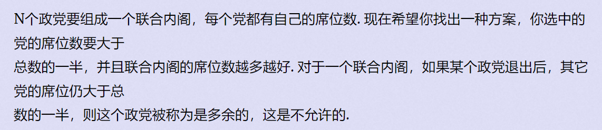

**E - Elect**

 [动态规划-背包专项练习1 - Virtual Judge (d0j1a1701.cc)](https://vjudge.d0j1a1701.cc/contest/550928#problem/E)


#### solve

对席位数排序后做01背包：

**证明：**

1. 所有解是否合法？

   对于$f_{x} , x\gt (sum)/2$ ， 被更新时 ，新选择的物品中 ， 必然小于拼接方案中的任意一个物品。所以该状态对应的方案必然是合法方案。

2. 所有解是否讨论充分？

   小于sum/2的所有情形都被记录 ，这和普通的01背包原理相同。

   大于sum/2的状态不能参与迁移， 否则必然是不合法解。就是全集减去一个必然不合法的集合。所以是对所有可能的方案都考虑充分的。 

#### code

```cpp
#include<bits/stdc++.h>
using namespace std;
using ll = long long;
const int N = 1E5 + 10;
bool f[N];
int main()
{
	ios::sync_with_stdio(false);
	cin.tie(0);
	int n; cin >> n;
	vector<int> a(n);
	ll sum = 0;
	for (int i = 0; i < n; i++) {
		cin >> a[i];
		sum += a[i];
	}
	sort(a.rbegin() , a.rend());
	int ans = 0;
	f[0] = true;
	for (int i = 1 ; i <= n; i++) {
		for (int j = min( sum / 2 + a[i - 1], sum); j >= a[i - 1] ; j--) {
			f[j] |= f[j - a[i - 1]];
			if (f[j]) ans = max(j , ans);
		}
	}
	cout << ans << '\n';
}
```

