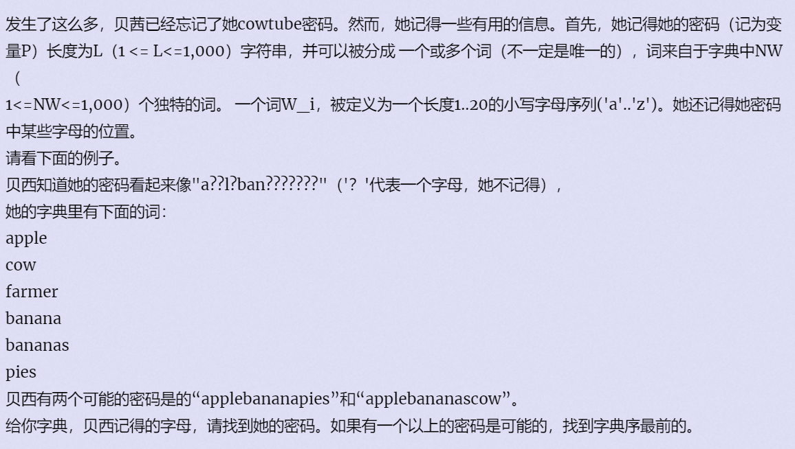

**F - forgot**
https://vjudge.d0j1a1701.cc/contest/550928#problem/F



#### solve

观察一些要求： 字典中是被分为下列的一些词的。所以可以将这些词作为整段考虑。同时要满足段之前也是由这些字典组成的词。

**状态设计：**
$f_{i}$表示i位置为末尾的合法的最小字典序方案。

**状态转移**

1. 枚举单词：
2.  check考虑接在当前的枚举位置尾部合法
   1. 通过f数组，将该单词作为一个整体考虑之后，前方段的单词是否可以作为一个整体考虑。
   2. 如果可以更新当前的状态的最小字典序单词。
3. 注意初始化， 如果当前单词就是一整段并且 ，考虑更新f值。
   1. 如果f已经有考虑解 。 比较得出小字典序。然后返回。
   2. 如果f函数尚未考虑解 ， 直接更新f。

#### code

```cpp
#include<bits/stdc++.h>
using namespace std;

const int N = 1010;

string t[N];
string f[N];
string s;

//局部匹配函数的设计。
bool check(int low, int j) {
	for (int i = 0; i < (int)t[j].size(); i++) {
		if (s[low + i] != '?' && s[low + i] != t[j][i])
			return false;
	}
	return true;
}

int main() {
	ios::sync_with_stdio(false);
	cin.tie(0);

	int n, m;
	cin >> n >> m;
	cin >> s;
	//前若干个。
	s = ' ' + s;
	for (int i = 0; i < m; i++) {
		cin >> t[i];
	}
	//怎么进行初始化？
	for (int i = 1; i <= n; i++) {
		for (int j = 0; j < m; j++) {
			int st = i - t[j].size();
			if (st < 0) continue;
			if (st && f[st] == "") continue;
			if (check(st + 1, j)) {
				if (f[i] == "" || f[st] + t[j] < f[i])
					f[i] = f[st] + t[j];
			}
		}
	}
	cout << f[n] << '\n';
}
```

