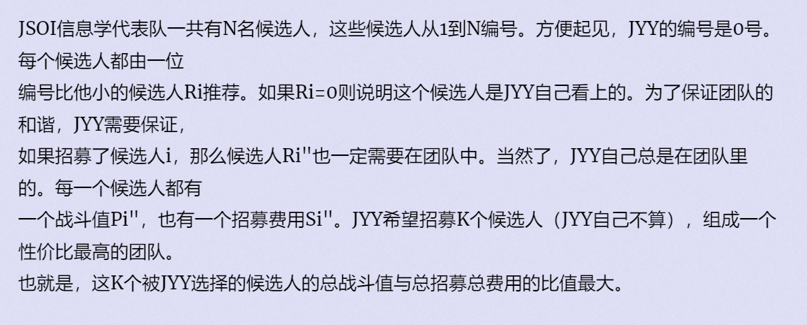

**I - 最佳团体**
https://vjudge.d0j1a1701.cc/contest/550928#problem/I

简介：

#### solve

分数规划问题： 初步分析如下：

二分答案：
$$
\frac {\sum _{i=1}^{n} a_i*w_i}{\sum_{i=1}^{n}b_i*w_i} \le mid
$$

$$
\sum_{i=1}^{n}(a_i - mid*b_i)\times w_i<=0。
$$
有k次机会分配$w_i的情况$
**题意分析**


根据输入的特点 ，发现图必然是一课没有回路的拓扑图。用二分解决上述分数规划问题。

然后转换成树上规定大小的连通块背包问题。时间复杂度是$O(n^2)$

#### code

```cpp
#include<bits/stdc++.h>
using namespace std;
using ll = long long;
const ll inf = 1E9;
const int N = 2505;
int n, m, a[N], b[N];
double f[N][N], pre[N];
int sz[N];
double mid;
vector<int> g[N];
inline void dfs(int u) {
	for (int i = 2; i <= m; i++)
		f[u][i] = -1000000000;
	f[u][0] = 0;
	f[u][1] = b[u] - a[u] * mid;
	sz[u] = 1;
	for (auto v : g[u]) {
		//防止会回路。
		dfs(v);
		for (int i = 1; i <= sz[u]; ++i)pre[i] = f[u][i];
		for (int i = 1; i <= sz[u]; ++i)
			for (int j = 0; j <= sz[v] && i + j <= m; ++j)
				f[u][i + j] = max(pre[i] + f[v][j], f[u][i + j]);
		sz[u] += sz[v];
	}
}
int main(){
	ios::sync_with_stdio(false);
	cin.tie(0), cout.tie(0);
	cin >> m >> n;
	m++;
	for (int i = 1; i <= n; ++i) {
		cin >> a[i] >> b[i];
		int x; cin >> x;
		g[x].push_back(i);
	}
	double low = 0, high = 10000;
	while (low + 0.0001 < high) {
		mid = (low + high) / 2;
		dfs(0);
		if (f[0][m] < 0) high = mid;
		else low = mid;
	}
	cout << fixed << setprecision(3) << low << '\n';

}
```
