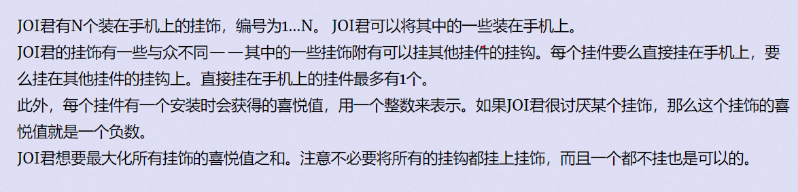

**挂饰**
https://vjudge.d0j1a1701.cc/contest/550928#problem/J



#### solve

**状态**

$g_{i ,j}$ 考虑前i个物品 ， 挂钩数为j 得到的最大喜悦值。

**状态转移：**

枚举之前的方案 ， 从后往前的更新状态即可。

==发现一些问题==

1. 负数挂钩数也要参与计算。因为最终只需要，所有方案的挂钩数大于0即可。某一个时刻可能不够但是在后续的选择中挂钩就足够了。
2. 挂钩数可能过大：
   1. 此时考虑将值域压缩。因为挂钩数一旦大于n其实和n是等效的。可以并成同一个问题考虑。

对于1：处理要平移值域。

**关于1的其它解决方法：** 
按照挂钩数升序排序。做转移即可。
**原理:**

1. 根据子问题的形式：验证问题的解的正确性： 然后可以得出 ， 显然考虑了所有情况。
2. 考虑了所有合法方案；
   1. 如果当前枚举出负数， 表示当前挂钩数为0 以后也不会补充。枚举过程中的负数方案是不合法的方案。

#### GROW

对解集合的整理优化。

做背包时为什么要对物品进行重新排序？

1. 对枚举顺序的优化。使得枚举最优。

#### code

```cpp
#include<iostream>
#include<algorithm>
using namespace std;
using ll = long long;
const int N = 2010;
const int inf = 2E9 + 10;
ll f[N][N];
struct node {
	int x , y;
	bool operator<(const node& t) const {
		return x > t.x;
	}
} a[N];
int main()
{
	ios::sync_with_stdio(false);
	cin.tie(0);
	int n;
	cin >> n;
	for (int i = 0; i < N; i++)
		for (int j = 0; j < N; j++)
			f[i][j] = -inf;
	for (int i = 1; i <= n; i++) {
		cin >> a[i].x >> a[i].y;
	}
	sort(a + 1 , a + n + 1);
	f[0][1] = 0;
	for (int i = 1; i <= n; i++) {
		int x = a[i].x , y = a[i].y;
		for (int j = 0; j <= n; j++)f[i][j] = f[i - 1][j];
		for (int j = 1; j <= n; j++) {
			f[i][min(n, j + x - 1)] = max(f[i][min(n, j + x - 1)], f[i - 1][j] + y);
		}
	}
	ll ans = 0;
	for (int i = 0; i <= n; i++)ans = max(ans, f[n][i]);
	cout << ans << '\n';
}
```
