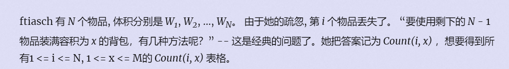

**消失之物**
https://vjudge.d0j1a1701.cc/contest/550928#problem/G



#### solve

类比普通的背包问题，这里是一个要维护一个物品的丢失情形。
比较巧妙 ， 慢慢体会。
先求出整体的背包问题的所有解。


**状态 **

$f_{i,j}$表示考虑前i个物品，当前体积为j的方案个数。

$g_{i,j}$表示不选择i物品 ， 体积为j的方案数个数。

**状态转移：**

$f_{i , j}$普通的背包方法求取即可。

$g_{i , j}$：

1. j < w[i]: $g_{i,j} = f_{n , j}$
2. $j > i$ $f_{i,j} - g_{i , j}$容斥

#### code

```cpp
#include<bits/stdc++.h>
using namespace std;
using ll = long long;
const int N = 2E3 + 10;
ll f[N] , g[N] , w[N];
int main()
{
	ios::sync_with_stdio(false);
	cin.tie(0);

	int n , m; cin >> n >> m;
	f[0] = 1;
	for (int i = 1; i <= n; i++) {
		cin >> w[i];
		for (int j = m; j >= w[i]; j--) {
			f[j] = (f[j] + f[j - w[i]]) % 10;
		}
	}
	for (int i = 1; i <= n; i++) {
		g[0] = 1;
		for (int j = 1; j <= m; j++) {
			if (w[i] > j)g[j] = f[j];
			else g[j] = (f[j] - g[j - w[i]] + 10) % 10;
			cout << g[j];
		}
		cout << '\n';
	}
}
```

