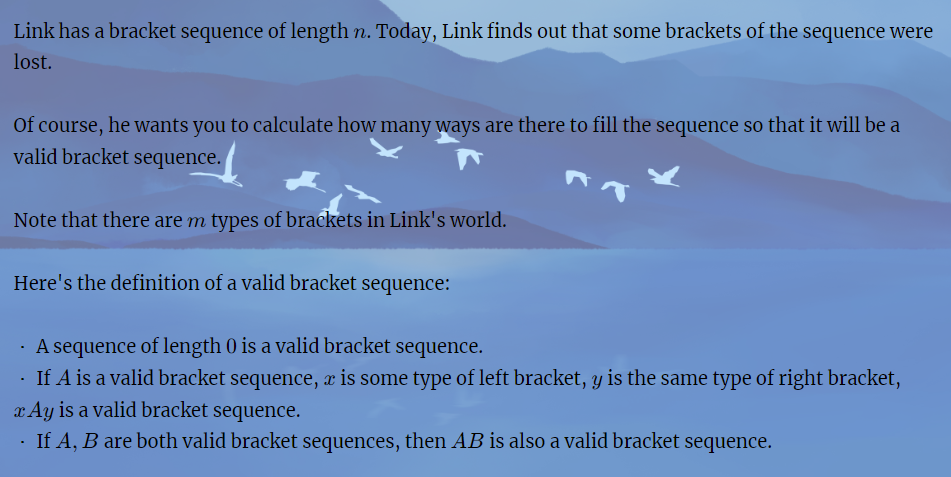
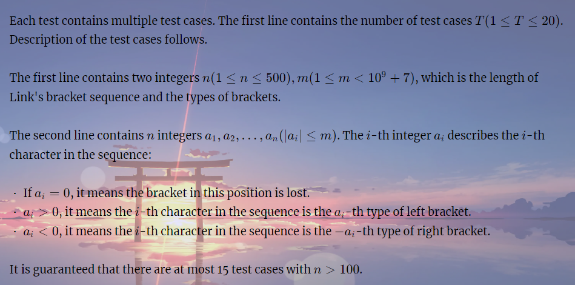

# Link with Bracket Sequence II

[Link with Bracket Sequence II - HDU 7174 - Virtual Judge (vjudge.net)](https://vjudge.net/problem/HDU-7174)

**简介：** 对于一个括号序列进行了拓展。一共定义了m对配对：其中 -i 与 i进行配对 ， 负数表示右端，正数表示左端。给定一个串，问将其中的0修改成其它数字。使得该串是一个题意中定义的合法序列，问方案数为多少。





### solve

**状态定义：**
S表示有效括号序列。
$f_{l , r}$表示将区间[l , r]变成有效括号序列的所有方案。
$g_{l , r}$ 表示将区间变成形如（S）的方案数。

**状态转移方程：**

分类这种括号序列的可能形式： 

1. S (S)
2. (S)

对于$g_{l , r}$
$g_{l , r} <- g_{l + 1 ， r - 1} \times sum$ 其中sum表示两端点的括号匹配的合法情况。 如果无论没有合法的分配方案就设置为0。因此就考虑了所有的情况。

对于$f_{l,r}$：
$f_{l ,r} <- f_{l , mid} \times  g_{mid + 1 , r} , g_{l ,r}$

### code
```cpp
#include<bits/stdc++.h>
using namespace std;

using ll = long long;

#define dbg(x) cerr << "[" << __LINE__ << "]" << ": " << x << "\n"

#define all(x) (x).begin(),(x).end()
#define sz(x) (int)(x).size()

const int inf = 1E9 + 7;
const ll INF = 1E18 + 7;
const int N = 1E6 + 10;
const int mod = (int) 1E9 + 7;

void add(int& a , int b) {
	a = a + b;
	if (a > mod) a -= mod;
}
bool same(const int& a , const int& b) {

	return (a > 0 && a == -b) || (a == 0 && b < 0) || (a > 0 && b == 0) || (a == 0 && b == 0);
}

void work(int testNo)
{
	int n , m;
	cin >> n >> m;
	vector<int> a(n + 1);
	vector<vector<int>> f(n + 1 , vector<int>(n + 1));
	vector<vector<int>> g(n + 1 , vector<int>(n + 1));
	for (int i = 1; i <= n; i++)
		cin >> a[i];
	for (int d = 1; d < n; d += 2)
		for (int l = 1; l + d <= n; l++) {
			int r = l + d;
			// 第一种情况：
			if (same(a[l] , a[r])) {
				if (d == 1) {
					if (a[l] == 0 && a[r] == 0) {
						g[l][r] = m;
					} else g[l][r] = 1;
				} else {
					if (a[l] == 0 && a[r] == 0)
						add(g[l][r] , 1LL * m * f[l + 1][r - 1] % mod);
					else {
						g[l][r] = f[l + 1][r - 1];
					}
				}
			}
			add(f[l][r] , g[l][r]);
			for (int mid = l; mid < r; mid++) {
				add(f[l][r] , 1LL *  g[l][mid] * f[mid + 1][r] % mod);
			}
		}
	// for (int l = 1; l <= n; l++)
	// 	for (int r = 1; r <= n; r++) {
	// 		cout << f[l][r] << " \n"[r == n];
	// 	}
	cout << f[1][n] << "\n";
}
/*
1
6 3
0 0 0 0 0 0

1
4 2
0 0 0 0
*/

signed main()
{
	ios::sync_with_stdio(false);
	cin.tie(0);

	int t; cin >> t;
	for (int i = 1; i <= t; i++)work(i);
}
```

