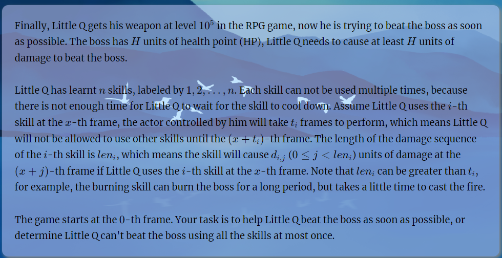

# Boss Rush

[Boss Rush - HDU 7163 - Virtual Judge (vjudge.net)](https://vjudge.net/problem/HDU-7163)



### 简介：

游戏背景：

1. BOSS ： 血量 为H
2. 技能属性：
   1. T : 表示释放这个技能的持续时间： （假定x时刻释放， 那么直到x + T都不可以使用其它技能）
   2. $len_i$ : 表示持续伤害的回合：
   3. 一个长度为$len_i$ 的伤害数组：表示开始释放技能的第i个时刻的伤害；

求可行方案中最小的时刻，使得BOSS被打败：

### solve

1. 二分：限定时间：
在限定时间后，进行一个dp；

**状态设计：**
$f_{s}$表示当前限定时间下，技能的执行情况为s的最大伤害； 
假设更小规模的状态都已经求出，当前考虑执行的技能情况为s的子问题。首先对于该问题的解集，第一步枚举最后一个使用的技能。问题的最优解就在 这不重不漏的枚举中产生：
1. 对于每一个枚举，分割成了更小的子问题。该子问题中任意解（任意顺序）拼接上枚举的技能后。其最终的形式都是$A + B$ , 其中A表示更小子问题中的某一个解。B枚举使用的技能在剩下时间内产生的伤害。显然最大A是最优的。正是更小子问题的解。
2. 更小子问题中给出什么解，都不影响枚举的最后一个技能的使用。
综上，该状态设计是递推成立，且没有后效性的。

**状态转移：**
$f_{s} ->f_t + B$ 其中t枚举最后一个使用的技能后，分裂得到的子问题。
**生长：**
1. 如果不二分，直接做会怎么样？
很多容易想到的转移方式，都要关注更多的细节，导致不可行：
例如：$f_s$ 表示使用s。打出H伤害的最短时间。显然由于加入一个新的元素之后，其能减少的时间是不能仅$f_s$ 记录的最大，这一简单信息确定的。考虑一个新的技能后，1. 是不可转移的。2. 是难以转移的。
遇事不决，先二分check 一 check。
### code
[Source code - Virtual Judge (vjudge.net)](https://vjudge.net/solution/44894945/Lm4u6AqBvaNYfNC960nZ)
```cpp
#include<bits/stdc++.h>
using namespace std;

using ll = long long;

#define dbg(x) cerr << "[" << __LINE__ << "]" << ": " << x << "\n"

#define all(x) (x).begin(),(x).end()
#define sz(x) (int)(x).size()
#define bit(x) (1 << (x))
// #define int ll

const int inf = 1E9 + 7;
const ll INF = 1E12 + 7;
const int N = 1E5 + 10;
void work(int testNo)
{
    int n;
    ll H;
    cin >> n >> H;
    vector<int> t(n), len(n), sum(bit(n));
    vector<vector<int>> d(n);
    vector<vector<ll>>pre(n);
    for (int i = 0; i < n; i++) {
        cin >> t[i] >> len[i];
        d[i].resize(len[i]);
        pre[i].resize(len[i] + 1);
        for (int j = 0; j < len[i]; j++) {
            cin >> d[i][j];
            pre[i][j + 1] = pre[i][j] + d[i][j];
        }
    }

    for (int s = 0; s < bit(n); s++) {
        for (int j = 0; j < n; j++) {
            if (s >> j & 1) sum[s] += t[j];
        }
    }

    vector<ll>f(bit(n));
    auto check = [&](ll T) {
        //然后是一个经典的状态压缩dp:
        //使用了s表示的技能中的最大伤害:
        ll mx = 0;
        for (int s = 0; s < bit(n); s++) {
            f[s] = 0;
            for (int j = 0; j < n; j++) {
                if (s >> j & 1) {
                    int pres = s ^ (1 << j);
                    if (sum[pres] > T) continue;
                    ll remain = T + 1 - sum[pres];
                    remain = min(remain, 1LL * len[j]);
                    f[s] = max(f[s], f[pres] + pre[j][remain]);
                    mx = max(mx, f[s]);
                    if (mx >= H) return true;
                }
            }
        }
        return false;
    };

    ll low = 0, high = INF;
    while (low < high) {
        ll mid = (low + high) / 2;
        if (check(mid)) {
            high = mid;
        }
        else low = mid + 1;
    }
    if (low == INF) {
        cout << -1 << "\n";
    }
    else cout << low << "\n";
}

signed main()
{
    ios::sync_with_stdio(false);
    cin.tie(0);

    int t; cin >> t;
    for (int i = 1; i <= t; i++)work(i);
}
```

