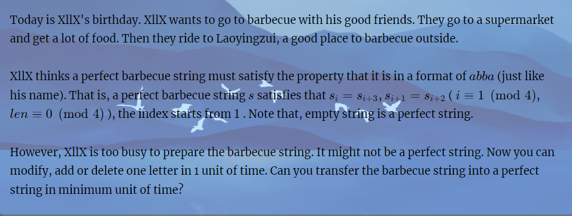

# BBQ
[BBQ - HDU 7190 - Virtual Judge (vjudge.net)](https://vjudge.net/problem/HDU-7190)
### 简介：

### solve1
很容易想到$f_{i , |S| ,|S|}$ 复杂度的dp。但是这种dp是显然做不了的。因为非计数问题，往往不方便完全滚动（即操作都在一个数组上进行）。 并且每次更新都是大范围的更新。

==更换状态设计角度==

**状态定义：**
$f_i$ : 处理1....i范围内的字符串段的最小花费：
**状态转移：**
枚举到i时， 最基本的想法是，枚举最后整体相关的一段，j ... i进行增删 ， 使其成为ABBA的形式。可以从一个集合的角度来看：
简单粗爆的 ： 直接不设长度限制的将j从i枚举到起点。 复杂度为$N^2$

----

（困惑，这里线性dp阶段性。阶段之间的划分不够笃定。有些困惑：）

对于该困惑，其本质是不同的划分之间，解方案是存在交的。这和区间动态规划也相似。不同划分方式下，记录的最优策略可能是相同的。

但是只需要关心最终是否能覆盖所有的解集。最多想第一次，这种枚举转移是充分的。（考虑了整个解空间。）

------


整体上把握： 对问题的解空间进行把握，发现处理字符串的最优策略总是将单独划分为若干1....7长度的段进行单独处理：

**证明如下：**

定义其长度为n 。
首先显然：

1. 当n大于等于8时： 其花费次数至少是：n - 4:
   但是有一个策略 ： 将9...n(设若有)删去。 然后将剩下的8个字符分成4 + 4.分别可以在2 + 2的花销下解决。其总的操作次数为： n - 8 + 4。这类长度的区间都可以分割成小于等于8的区间，使得结果不会变的更差；同时 8 长度可以转变成4 + 4。最优结果在划分长度不超过7的所有方案中出现。

**现象：**

1. 增加操作，必然是基于原字符段内的字符种类。因此对字符重新标记，用8进制表示一个状态。使得信息密度充分并且冗余（操作对称性：不同的标记下，只需要区分出两两不同，其效果等效。）
2. 总的状态只有$8^7 = 2E6$ 。

**基于上述的启发，修正转移：**
解决$f_i$ 时，枚举长度小于等于8的区间。
$f_i = max(f_j + g_{j + 1 ,,,i})$ 
$g_{s}$  表示处理s这一类的状态的最小代价：

**集中精力解决的问题**：$g_s$的计算每一个状态追求用： $n|s| = 2E7$ 的复杂度解决： 

1. 增加： $7\times 7$
2. 删除： 7
3. 改： $7\times 7$

综上，记忆化搜索可以在$2E8$ 的复杂度内解决：

### code

``` cpp
#include<bits/stdc++.h>
using namespace std;

using ll = long long;
// #define int ll

#define dbg(x) cerr << "[" << __LINE__ << "]" << ": " << x << "\n"

#define all(x) (x).begin(),(x).end()
#define sz(x) (int)(x).size()

const int inf = 1E9 + 7;
const ll INF = 1E18 + 7;
const int N = 1E6 + 10;
const int M = (int)2E7 + 10;

int g[M];
// 当前处理的字符串：
int t[10];
// s 和 p之间进行匹配的的dp；
int h[10][5];

// 不需要之间进行一个转移，内部处理即可。在这种情形下：
void dfs(int idx/*当前的状态，用一个八进制表示：*/, int Type/*当前的字符类型的数目。最大数字：*/, int n /*当前长度*/) {
    // 表示最优状态：
    int m = inf;
    if (n) {
        for (int a = 1; a <= 7; a++)
            for (int b = 1; b <= 7; b++) {
                // 目标的匹配串：
                int p[] = { 0 , a , b , b , a };
                memset(h, 0x3f, sizeof h);
                for (int i = 0; i <= 4; i++)
                    h[0][i] = i;
                for (int i = 0; i <= 7; i++) {
                    h[i][0] = i;
                }
                // 经典的两串修改匹配问题：
                for (int i = 1; i <= n; i++)
                    for (int j = 1; j <= 4; j++) {
                        // 删 i ， 添j , 修改：
                        h[i][j] = min({ h[i - 1][j] + 1 , h[i][j - 1] + 1, h[i - 1][j - 1] + (t[i] != p[j]) });
                    }
                m = min(h[n][4], m);
            }
        g[idx] = m;
    }
    if (n == 7) return;
    ++n;
    // 拓展：
    for (int i = 1; i <= Type; i++) {
        t[n] = i;
        dfs(idx * 8 + i, Type, n);
    }
    t[n] = Type + 1;
    dfs(idx * 8 + Type + 1, Type + 1, n);
}

int f[N];
void work(int testNo)
{
    string s;
    cin >> s;
    int n = sz(s);
    // 判断当前字符是否出现过：
    s = ' ' + s;

    vector<int> id(27 , 0);
    vector<int> pos;
    for (int i = 1; i <= n; i++) {
        f[i] = inf;
        int idx = 0;
        int sum = 0;
        for (int j = i; j > max(0, i - 7); j--) {
            int x = s[j] - 'a';
            if (id[x] == 0) {
                id[x] = ++sum;
                pos.push_back(x);
            }
            idx = idx * 8 + id[x];
            f[i] = min(f[i] , f[j - 1] + min(g[idx] , i - j + 1));
        }
        for (auto u : pos) id[u] = 0;
        pos.clear();
    }
    cout << f[n] << '\n';
}

signed main()
{
    ios::sync_with_stdio(false);
    cin.tie(0);
    dfs(0, 0, 0);
    // for (int i = 1; i <= 20; i++)
    // cout << g[i] << ' ';
    int t; cin >> t;
    for (int i = 1; i <= t; i++)work(i);
}
```


