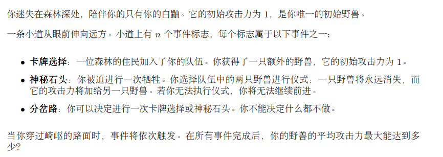
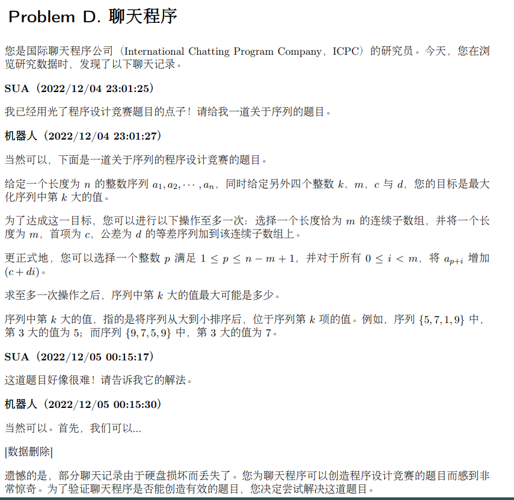
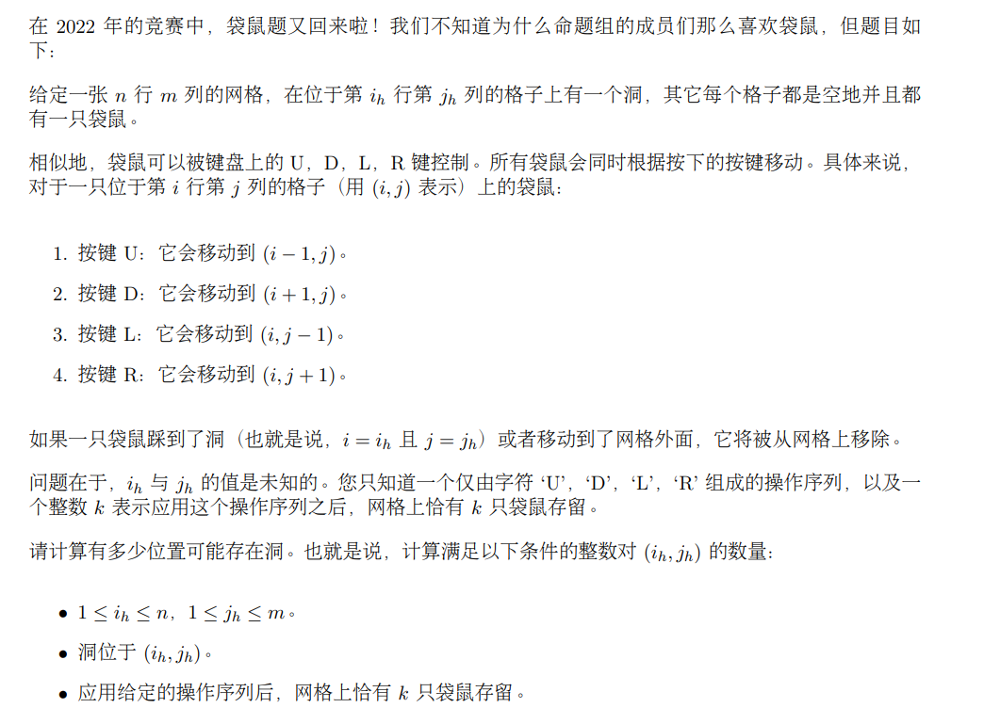
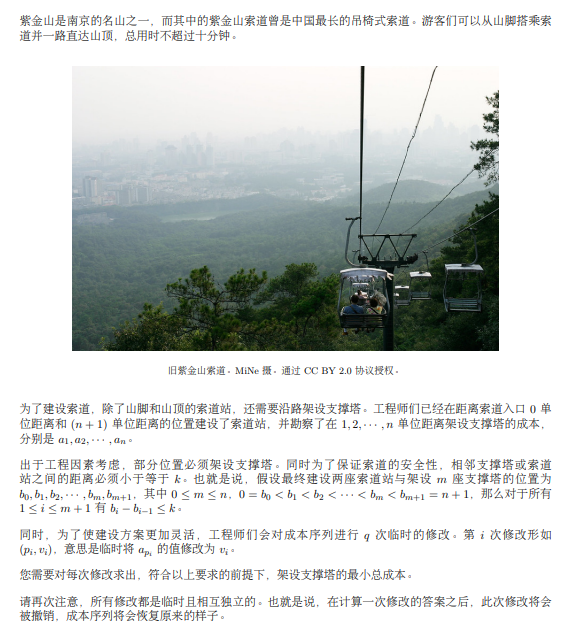
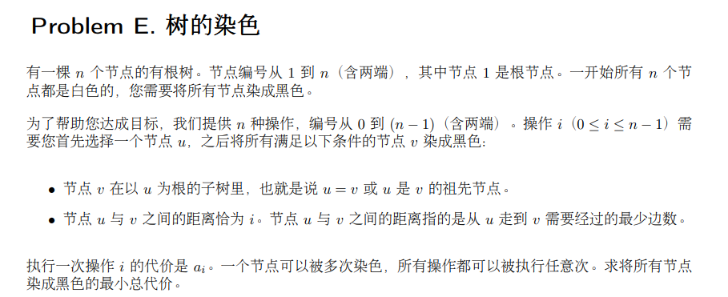

# G. Inscryption
https://codeforces.com/gym/104128/problem/G



### solve

事实1: 由于初始条件下比值就是大于等于1的.因此卡牌操作,降低平均实力.
因此问题转换成,保证有解的前提下,使得合并操作尽量多.

用反悔贪心解决当前问题:  为了迎接最优结果,保持最优的状态。

```cpp
#include<bits/stdc++.h>
using namespace std;

using ll = long long;

#define dbg(x) cerr << "[" << __LINE__ << "]" << ": " << x << "\n"

#define all(x) (x).begin(),(x).end()
#define sz(x) (int)(x).size()

const int inf = 1E9 + 7;
const ll INF = 1E18 + 7;
const int N = 1E6 + 10;

int a[N];

void work(int testNo)
{
	int n;
	cin >> n;
	int x = 1, y = 1;
	int  rec2 = 0;
	bool flag = false;
	for (int i = 1; i <= n; i++) {
		int ty; cin >> ty;
		if (ty == -1) {
			if (y == 1) {
				if (rec2 > 0) {
					rec2--;
					x++;
					y++;
				} else {
					// cout << -1 << "\n";
					flag = true;
					// return;
				}
			} else {
				y--;
			}
		} else if (ty == 0) {
			if (y == 1) {
				x++;
				y++;
			} else {
				rec2++;
				y--;
			}
		} else {
			x++;
			y++;
		}
	}
	if (flag) {
		cout << -1 << "\n";
		return;
	}
	int t = __gcd(x , y);
	cout << x / t << " " << y / t << "\n";
}

signed main()
{
	ios::sync_with_stdio(false);
	cin.tie(0);

	int t; cin >> t;
	for (int i = 1; i <= t; i++)work(i);
}

/* stuff you should look for
* int overflow, array bounds
* special cases (n=1?)
* do smth instead of nothing and stay organized
* WRITE STUFF DOWN
* DON'T GET STUCK ON ONE APPROACH
*/
```

# M. Drain the Water Tank

[Problem - M - Codeforces](https://codeforces.com/gym/104128/problem/M)
[M - 清空水箱 - SUA Wiki](https://sua.ac/wiki/2022-icpc-nanjing/m/)

赛时用了一个构造点来判断点包含的思路，做了很多有意思的，有启发性的分类讨论。

利用另外的角度(点积，叉积的方法来判断。)


发现局部最小必须满足几个性质：

1. 局部最小。
2. 内角小于180度。

同时要判调平角的情况。其方法时，判掉边界点。

判断内角是否小于180度。可以通过逆时针顺序的边做一个叉积。

.png)

**题解思路代码：**

```cpp
#include<bits/stdc++.h>
using namespace std;

using  db = long double;
const db EPS = 1E-15;

inline int sign(db a) {
	return a < -EPS ? -1 : a > EPS;
}
inline int cmp(db a , db b) {
	return sign(a - b);
}

struct P {
	db x , y;
	P() {};
	P(db x_ , db y_) : x(x_) , y(y_) {}

	db dot(P p) {
		return x * p.x + y * p.y;
	}
	db det(P p) {
		return x * p.y - y * p.x;
	}
	P operator-(P p) {
		return {x - p.x, y - p.y};
	}
	P operator+(P p) {
		return {x + p.x , p.y};
	}
	P operator/(db d) {
		return {x / d , y / d};
	}
	void write() {
		cout << x << " " << y << "\n";
	}
};

#define cross(p1,p2,p3) ((p2.x-p1.x)*(p3.y- p1.y)-(p3.x-p1.x)*(p2.y-p1.y))
#define crossOp(p1,p2,p3) sign(cross(p1,p2,p3))

const int N = 2E3 + 10;

bool flag[N];
signed main() {
	ios::sync_with_stdio(false);
	cin.tie(0);

	int n;
	cin >> n;
	vector<P> p;
	for (int  i = 1; i <= n; i++) {
		int x , y;
		cin >> x >> y;
		p.push_back({x , y});
	}
	vector<int> id(n);

	iota(id.begin() , id.end(), 0);
	sort(id.begin() , id.end() , [&] (int x , int y) {
		// return p[x].y < p[y].y;
		if (p[x].y == p[y].y) {
			return p[x].x < p[y].x;
		} else return p[x].y < p[y].y;
	});
	for (int i = 0; i < n; i++) {
		int cur = id[i];
		if (flag[cur])continue;
		int l = (cur - 1 + n) % n;
		while (l != cur && p[l].y >= p[(l + 1) % n].y) {
			flag[l] = true;
			l = (l - 1 + n) % n;
		}
		int r = (cur + 1) % n;
		while (r != cur && p[r].y >= p[(r - 1 + n) % n].y) {
			flag[r] = true;
			r = (r + 1) % n;
		}
	}
	int ans = 0;
	for (int i = 0; i < n; i++) {
		if (flag[i]) continue;
		P p1 = p[(i - 1 + n) % n];
		P p2 = p[i];
		P p3 = p[(i + 1) % n];
		if ((p2 - p1).det(p3 - p2) > 0) {
			ans++;
		}
	}
	cout << ans << "\n";
}
```

**赛时：**

```cpp
#include<bits/stdc++.h>
using namespace std;

using  db = long double;
const db EPS = 1E-15;

inline int sign(db a) {
	return a < -EPS ? -1 : a > EPS;
}
inline int cmp(db a , db b) {
	return sign(a - b);
}

struct P {
	db x , y;
	P() {};
	P(db x_ , db y_) : x(x_) , y(y_) {}

	db dot(P p) {
		return x * p.x + y * p.y;
	}
	db det(P p) {
		return x * p.y - y * p.x;
	}
	P operator-(P p) {
		return {x - p.x, y - p.y};
	}
	P operator+(P p) {
		return {x + p.x , p.y};
	}
	P operator/(db d) {
		return {x / d , y / d};
	}
	void write() {
		cout << x << " " << y << "\n";
	}
};

#define cross(p1,p2,p3) ((p2.x-p1.x)*(p3.y- p1.y)-(p3.x-p1.x)*(p2.y-p1.y))
#define crossOp(p1,p2,p3) sign(cross(p1,p2,p3))

bool isMiddle(db a , db m , db b) {
	return sign(a - m) == 0 || sign(b - m) == 0 || (a < m != b < m);
}
bool isMiddle(P a , P m , P b) {
	return isMiddle(a.x, m.x , b.x) && isMiddle(a.y , m.y , b.y);
}

bool onSeg(P p1 , P p2 , P q) {
	return crossOp(p1 , p2 , q) == 0 && isMiddle(p1, q , p2);
}

int contain(vector<P> ps , P p) {
	int n = ps.size() , ret = 0;
	for (int i = 0; i < n; i++) {
		P u = ps[i] , v = ps[(i + 1) % n];
		if (onSeg(u , v , p)) return 1;
		if (cmp(u.y, v.y) <= 0) swap(u , v);
		if (cmp(p.y, u.y) > 0 || cmp(p.y , v.y) <= 0) continue;
		ret ^= crossOp(p, u, v) > 0;
	}
	return ret * 2;
}

const int N = 2E3 + 10;

bool flag[N];

/*

*/

signed main() {
	ios::sync_with_stdio(false);
	cin.tie(0);

	int n;
	cin >> n;
	vector<P> p;
	for (int  i = 1; i <= n; i++) {
		int x , y;
		cin >> x >> y;
		p.push_back({x , y});
	}
	vector<int> id(n);

	iota(id.begin() , id.end(), 0);
	sort(id.begin() , id.end() , [&] (int x , int y) {
		return p[x].y < p[y].y;
	});
	for (int i = 0; i < n; i++) {
		int cur = id[i];
		if (flag[cur])continue;
		// cout << cur << "\n";
		int l = (cur - 1 + n) % n;
		while (l != cur && p[l].y >= p[(l + 1) % n].y) {
			flag[l] = true;
			l = (l - 1 + n) % n;
		}
		int r = (cur + 1) % n;
		while (r != cur && p[r].y >= p[(r - 1 + n) % n].y) {
			flag[r] = true;
			r = (r + 1) % n;
		}
	}
	// int rec = contain(p , (p[0] + p[1])/2);
	// cout << rec << "\n";
	// cout << "aaa" << "\n";
	int ans = 0;
	for (int i = 0; i < n; i++) {
		if (flag[i])continue;
		// cout << i << "\n";
		int rec = contain(p , {p[i].x , p[i].y - 0.0000001});
		// p[i].write();
		// cout << rec << "\n";
		if (rec == 0) {
			ans++;
		}
		// if(rec == 2){
		//     ans++;
		// }else if(rec == 1){
		//     int l = (i - 1 + n) % n;
		//     int r = (i + 1) % n;
		//     int t;
		//     if(p[l].y == p[i].y) t = l;
		//     else if(p[r].y == p[i].y) t = t;
		//     // t.write();
		//     P tt = (p[t] + p[i])/2;
		//     rec = contain(p , {tt.x , tt.y - 0.5});
		//     if(rec == 2) ans++;
		// }
	}

	cout << ans << "\n";
	// for (int i = 0; i < n; i++) {
	//     cout << id[i] << " ";
	// }
	// cout << "\n";
	// for (int i = 0; i < n; i++) {
	//     int cur = id[i];
	//     cout << "aaa" << "\n";
	//     if (flag[cur]) continue;
	//     int l = (cur - 1 + n) % n;
	//     while (l != cur) {
	//         if (flag[l]) break;
	//         if (p[l].y < p[(l + 1) % n].y) {
	//             P p1 = p[(l + 2) % n];
	//             P p2 = p[(l + 1) % n];

	//             int t = crossOp(p1 , p2 , p[l]);
	//             cout << "l " << l <<  " t " << t << " ";
	//             if (t == 1)break;
	//         }
	//         flag[l] = true;
	//         cout << l << " ";
	//         l = (l - 1 + n) % n;
	//     }
	//     cout << "bbb";
	//     int r = (cur + 1) % n;
	//     while (r != cur) {
	//         if (flag[r])break;
	//         if (p[r].y < p[(r - 1 + n) % n].y) {
	//             P p1 = p[(r - 2 + n) % n];
	//             P p2 = p[(r - 1 + n) % n];
	//             int t = crossOp(p1 , p2 , p[r]);
	//             if(r == 3){
	//                 cout << "\n";
	//                 p1.write();
	//                 p2.write();
	//                 p[r].write();
	//             }
	//             cout << "r " <<r <<  " t "<< t << " ";
	//             if (t == 1)break;
	//         }
	//         cout << r << " ";
	//         flag[r] = true;
	//         r = (r + 1) % n;
	//     }
	// }
}
```

-----

# D - 聊天程序

[D - 聊天程序 - SUA Wiki](https://sua.ac/wiki/2022-icpc-nanjing/d/)

[Problem - D - Codeforces](https://codeforces.com/gym/104128/problem/D)



二分答案：（防止队友把自己的路封死。尝试多种思路，往下探索解法。）

二分答案中，关注第k大。或者一些和某个临界大小相关的数时候，可以对模型做下角度的一个简化：将大于x的看作1 ， 小于x的看作0。这样可以避免一些不必要的麻烦。

进行check答案时候，观察一个简单的性质， 发现滑动等差数列的过程中，每个数字的属性只发生一次性变。我们关注第一次为x的位置。这样就可以对操作块内的x进行快速的统计。

**注意边界：**

1. 这种模型，增加序列的尾部不能小于m。否则是不符合实际定义的。
   1. 如果有解，可以找出尾部。
   2. 无解：（最小增加长度是x ， x > i）

```cpp
const int N = 1E6 + 10;

int a[N];
int n , k , m , c , d;

bool check(ll x) {
	vector<int> b(n + 1) , fi(n + 1) , pre(n + 1);
	// cerr << x << "\n";
	for (int i = 1; i <= n; i++) {
		// cerr << i << "\n";

		int chance = min(m , i);
		if (a[i] < x) {
			int dis = x - a[i] , sum = 0;
			/*长度为1*/
			dis -= c;

			if (dis <= 0) sum = 1;
			else {
				if (d)
					sum = (dis + d - 1) / d + 1;
				else sum = m + 1;
			}
			if (sum <= chance) {
				fi[i] = min(i + m - sum + 1 , n + 1);
			}
		} else b[i] = 1;
		pre[i] = pre[i - 1] + b[i];
	}
	// cerr << x << "\n";
	if (pre[n] >= k) return true;
	vector<int> cnt(n + 2 , 0);
	int  cur = pre[n] , mx = cur;

	for (int r = 1; r <= n; r++) {
		cur -= cnt[r];
		if (b[r] == 0 && fi[r]) {
			cur++;
			cnt[fi[r]]++;
		}
		mx = max(cur , mx);
	}
	return mx >= k;
}
signed main()
{
	ios::sync_with_stdio(false);
	cin.tie(0);

	cin >> n >> k >> m >> c >> d;

	for (int i = 1; i <= n; i++) {
		cin >> a[i];
	}
	ll low = 0 , high = 1E15;
	while (low < high) {
		ll mid = (low + high + 1) / 2;
		// cerr << mid << "\n";
		if (check(mid)) low = mid;
		else high = mid - 1;
	}
	cout << low << "\n";
}
```


# Problem A. 停停，昨日请不要再重现




逆向思维 + 二维数组中的差分技巧。

**思路关键**

1. 对于将会出界必定不会留存下来的袋鼠，不必考虑洞对他的影响。
2. 于是找到最终的袋鼠小方阵（最后保存下来的肯定是一个方阵）
3. 考虑每个洞经历过不同的袋鼠个数。手玩之后发现，由于方阵是整齐移动的，因此一个袋鼠去到新的格子，其它所有袋鼠都去到新的格子。因此只需维护最左上角的袋鼠，处理某个袋鼠第2 + x次经过洞的情况。对于第一次经过，方阵覆盖的每一个点的掉入的袋鼠个数都增加1.

**二维数组矩形加**

临场手玩了一下，其实就是一个小构造。

.png)


```cpp
#include<bits/stdc++.h>
using namespace std;

using ll = long long;
using i64 = long long;
using ld = long double;
using uint = unsigned int;
using pii = pair<int , int>;
using pli = pair<ll , int>;
using pll = pair<ll , ll>;


#define dbg(x) cerr << "[" << __LINE__ << "]" << ": " << x << "\n"

#define all(x) (x).begin(),(x).end()
#define sz(x) (int)(x).size()
#define pb push_back
#define fi first
#define se second

const int inf = 1 << 29;
const ll INF = 1LL << 60;
const int N = 1E6 + 10;

/*
1
4 5 3
ULDDRR

*/

void work(int testno) {
    int n , m , k;

    cin >> n >> m >> k;
    vector<vector<int>> sum(n + 2 , vector<int>(m + 2));
    string s;
    cin >> s;
    s = "#" + s;
    set<pair<int , int>> rec;
    int l = 1, r = m, u = 1, d = n, tag = 0;
    int len = sz(s) - 1;
    for (int i = 1; i <= len; ++i) {
        if (s[i] == 'U') {
            if (u > 1)u--;
            d--;
            if (d <= 0)tag = 1;
        } else if (s[i] == 'D') {
            if (d < n)d++;
            u++;
            if (u > n)tag = 1;
        } else if (s[i] == 'L') {
            if (l > 1)l--;
            r--;
            if (r <= 0)tag = 1;
        } else {
            if (r < m)++r;
            ++l;
            if (l > m)tag = 1;
        }
    }
    int remain = 0;
    if (tag == 1) {
        remain = 0;
        if (k == 0) {
            cout << n * m << "\n";
            return;
        } else {
            cout << 0 << "\n";
            return;
        }
    }
    remain = (r - l + 1) * (d - u + 1);
    if (remain < k) {
        cout << 0 << '\n';
        // cout << testno << "\n";
        return;
    }
    // pair<int , int> l = {1 , 1} , r = {n , n};
    // for (int i = 0; i < sz(s); i++) {
    // }

    set<pair<int , int>> pass;

    for (int i = len; i > 0; i--) {
        // cout << l << " " << r << " " << u << " " << d << '\n';
        if (pass.count({l , u}) == 0) {
            pass.insert({l , u});
            sum[u][l]++; sum[d + 1][r + 1]++;
            sum[u][r + 1]--; sum[d + 1][l]--;

        }
        if (s[i] == 'U') {
            d++; u++;
        } else if (s[i] == 'D') {
            d--; u--;
        } else if (s[i] == 'R') {
            l--; r--;
        } else {
            l++; r++;
        }
    }
    // cout << l << " " << r << " " << u << " " << d << '\n';
    if (pass.count({l , u}) == 0) {
        pass.insert({l , u});
        sum[u][l]++; sum[d + 1][r + 1]++;
        sum[u][r + 1]--; sum[d + 1][l]--;

    }
    int ans = 0;
    for (int i = 1; i <= n; i++)
        for (int j = 1; j <= m; j++) {
            sum[i][j] += sum[i - 1][j] + sum[i][j - 1];
            sum[i][j] -= sum[i - 1][j - 1];
            if (sum[i][j] == remain - k) ans++;
        }
    // cout << testno << "\n";
    cout << ans << '\n';
}

int main() {
    ios::sync_with_stdio(false);
    cin.tie(nullptr);
    int t; cin >> t;
    for (int i = 1; i <= t; i++)
        work(i);
}
```

---

# Problem B. 索道

[Problem - B - Codeforces](https://codeforces.com/gym/104128/problem/B)



为了维护这种局部的修改，考虑头做一次动态规划，尾做一次动态规划。发生局部修改时，可以通过小规模的信息调整，以及未被影响的记录，整理出新的解。

**状态定义：**
$f_i$ : 表示处理0 ... i , 在i点上建立一个基站的最优解。
$g_i$ : 表示处理i .... n + 1。在i点建立基站的最优解。

**状态转移：**
枚举上一个建立基站的位置。（注意一些站点必须要建立基站。）


```cpp
#include<bits/stdc++.h>
using namespace std;

using ll = long long;
#define all(x) (x).begin(),(x).end()

#define int ll

const int N = 5E5 + 10;
const ll INF = (long long)1E18 + 7;

int a[N];
ll f[N] , g[N];
int que[N];
void solve() {
	int n , k;
	cin >> n >> k;
	for (int i = 0; i <= n + 1; i++) {
		f[i] = g[i] = 0;
	}
	for (int i = 1; i <= n; i++)
		cin >> a[i];
	string s; cin >> s;
	s = '1' + s + '1';
	int low = 0 , high = 0;
	que[low] = 0;
	for (int i = 1; i <= n; i++) {
		while (low <= high && i - que[low] > k) low++;
		f[i] = f[que[low]] + a[i];
		if (s[i] == '1') {
			high = low - 1;
		} else {
			while (low <= high && f[que[high]] >= f[i]) high--;
		}
		que[++high] = i;
	}
	low = 0 ; high = 0;
	que[low] = n + 1;
	for (int i = n; i >= 1; i--) {
		while (low <= high && que[low] - i > k) low++;
		g[i] = g[que[low]] + a[i];
		if (s[i] == '1') {
			high = low - 1;
		} else {
			while (low <= high && g[que[high]] >= g[i]) high--;
		}
		que[++high] = i;
	}
	int m; cin >> m;
	vector<ll> ans(m);
	for (int i = 0; i < m; i++) {
		int pos , val , id = i;
		cin >> pos >> val;

		low = 0 , high = 0;
		que[low] = pos + 1;
		/*必选*/
		ans[id] = f[pos] + g[pos] - 2LL * a[pos] + val;
		if (s[pos] == '0' && k != 1) {
			int j = pos - 1;
			while (j > 0 && j > pos - k + 1 && s[j] == '0') j--;
			for (; j < pos; j++) {
				int nxt = que[high] + 1;
				while (nxt <= j + k && nxt <= n + 1 && s[que[high]] == '0') {
					while (low <= high && g[que[high]] >= g[nxt]) high--;
					que[++high] = nxt;
					nxt++;
				}
				ans[id] = min(ans[id] , f[j] + g[que[low]]);
			}
		}
	}
	for (int i = 0; i < m; i++) {
		cout << ans[i] << "\n";
	}
}
signed main() {
	ios::sync_with_stdio(false);
	cin.tie(0);
	int t; cin >> t;
	while (t--) solve();
}
```

-----

# Problem E. 树的染色




每一层的节点的染色是相互独立的，于是每一层染色的最小值相加就是ans(第一步拆)于是问题转换成了下方一个更加简洁明了的dp方式：

**状态定义：**

$f_{u}$ : 表示语境下（枚举到某一层时）以u为父亲节点的子树下的当前枚举层节点被染色的最小代价。

**状态转移方程：**

一共有两类方案： 1. 选择更上层的节点，一次染完。2. 子树内部小子树染完。

$f_u$ = $min(a_{d-dep_u....d - dep_1} , \sum_{v\in sons(u)} f_v)$

**朴素实现：**

显然是$O(n^2)$ 枚举深度，每一次$O(n)$ 处理。

**优化**

发现一些总是存在一些冗余的访问情况： 例如某些大子树相当与部分是没有层节点的。并且如果是一条链的结构，重复做着本质相同的转移。

这种树相关的冗余结构，可以通过虚树的方法实现。复杂度如下：

**建树：**

$nlog(n)$

**dp：**

$\sum key \times\log n$

$\sum key = n$


```cpp
#include<bits/stdc++.h>

using namespace std;
using ll = long long;

const int N = 1E5 + 10;
const ll INF = 1E18 + 7;

int a[N];
vector<int> e[N] , VT[N] , node[N];

const int LOGN = 18;
int n;
int dep[N] , par[LOGN + 1][N] , val[LOGN + 1][N];
int l[N] , r[N] , tot;

/*记录数组的st表：*/
int f[22][N];

void dfs(int u , int fa) {
	l[u] = ++tot;
	dep[u] = dep[fa] + 1;
	node[dep[u]].push_back(u);
	for (auto v : e[u]) {
		if (v == fa) continue;
		par[0][v] = u;
		dfs(v , u);
	}
	r[u] = tot;
}

void init() {
	for (int i = 1; i <= n; i++) f[0][i] = a[i];
	for (int j = 1; j <= LOGN; j++) {
		for (int i = 1; i + (1 << j) - 1 <= n; i++) {
			f[j][i] = min(f[j - 1][i] , f[j - 1][i + (1 << (j - 1))]);
		}
	}

	dfs(1 , 0);
	for (int i = 1; i <= LOGN; i++) {
		for (int u = 1; u <= n; u++) {
			par[i][u] = par[i - 1][par[i - 1][u]];
		}
	}
}

int query(int l , int r) {
	assert(l <= r);
	int len = 31 - __builtin_clz(r - l + 1);
	return min(f[len][l] , f[len][r - (1 << len) + 1]);
}

int LCA(int u , int v) {
	if (dep[u] > dep[v]) swap(u , v);
	int d = dep[v] - dep[u];
	for (int i = LOGN; i >= 0; i--) {
		if ((1 << i) <= d) {
			d -= (1 << i);
			v = par[i][v];
		}
	}
	if (v == u) return v;
	for (int i = LOGN; i >= 0; i--) {
		if (par[i][v] != par[i][u]) {
			v = par[i][v];
			u = par[i][u];
		}
	}
	return par[0][u];
}

/*怎么建立两点之间的边？*/
void Build(vector<int>&key) { /*当前的深度*/
	auto cmp = [&](int x , int y) {
		return l[x] < l[y];
	};
	auto add = [&](int x , int y) {
		/*边*/
		VT[x].emplace_back(y);
	};
	key.push_back(1);
	sort(key.begin() , key.end() , cmp);

	vector<int> a;
	for (int i = 0; i < (int)key.size() - 1; i++) {
		a.push_back(key[i]);
		a.push_back(LCA(key[i] , key[i + 1]));
	}
	a.push_back(key.back());
	sort(a.begin() , a.end() , cmp);
	a.erase(unique(a.begin() , a.end()) , a.end());
	for (int i = 0 , lc; i < (int)a.size() - 1; i++) {
		lc = LCA(a[i] , a[i + 1]);
		add(lc , a[i + 1]);
	}
}
ll dp[N];

void dfs2(int u , int d) {
	dp[u] = 0;
	// int low = d - dep[u] + 1  , high = d - dep[1] + 1;
	// cerr << "u " << u << " " << "LL " << (low) << " RR " << (high) <<  " mi :" << query(low , high) <<  "\n";
	for (auto v : VT[u]) {
		dfs2(v , d);
		dp[u] += dp[v];
	}
	if (VT[u].size() == 0) dp[u] = INF;
	dp[u] = min(dp[u] , 1LL * query(d - dep[u] + 1 , d - dep[1] + 1));
	VT[u].clear();
}
void solve() {
	cin >> n;
	for (int i = 1; i <= n; i++) {
		e[i].clear();
		node[i].clear();
	}
	for (int i = 1; i <= n; i++) {
		cin >> a[i];
	}
	for (int i = 1; i < n; i++) {
		int u , v;
		cin >> u >> v;
		e[u].push_back(v);
		e[v].push_back(u);
	}
	init();
	ll ans = 0;
	for (int i = 1; i <= n; i++) {
		if (node[i].size()) {
			// cerr << "aaa : " << i << "\n";
			Build(node[i]);
			dfs2(1 , i);
			// cerr << "bbb: " << dp[1] << "\n";
			ans += dp[1];
		}
	}
	cout << ans << "\n";
}
/*
1
4
10 15 40 1
1 2
2 3
2 4

1
5
10 5 1 100 1000
1 2
2 3
2 4
4 5

1
4
1000 200 10 8
1 2
2 3
3 4

*/

signed main() {
	ios::sync_with_stdio(false);
	cin.tie(0);
	int t; cin >> t;
	while (t--) solve();
}
```

